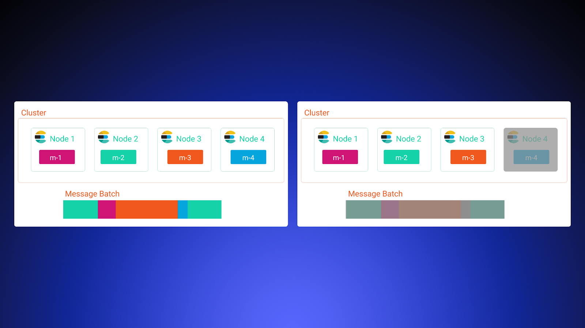
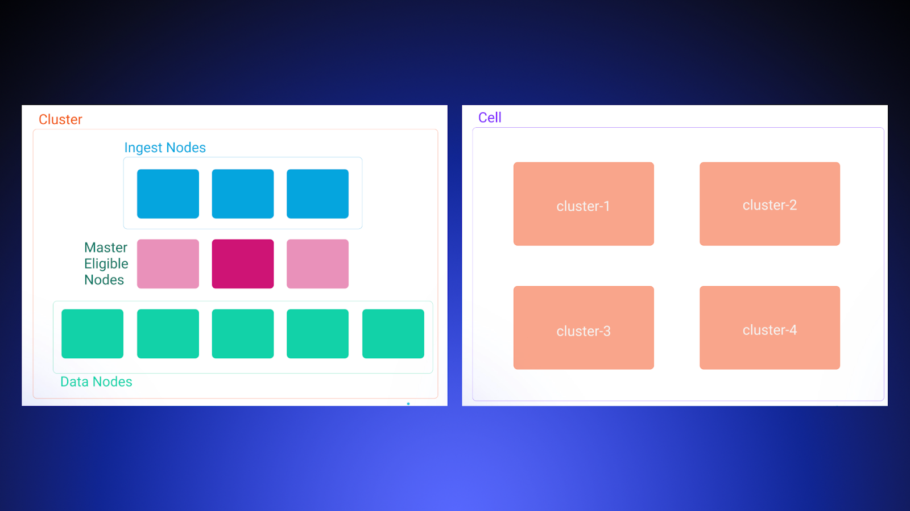

# ترجمه فارسی: چگونه Discord تریلیون‌ها پیام را ایندکس می‌کند

> **مقاله اصلی:** How Discord Indexes Trillions of Messages
> **نویسنده:** Vicki Niu (Senior Software Engineer, Persistence Infrastructure)
> **تاریخ انتشار:** April 24, 2025
> **منبع:** https://discord.com/blog/how-discord-indexes-trillions-of-messages

---

## چکیده

> Back in 2017, we shared how we built our message search system to index billions of messages. But as Discord grew, our search infrastructure began to exhibit a few cracks...

در سال ۲۰۱۷، ما نحوه ساخت سیستم جستجوی پیام خود را برای ایندکس میلیاردها پیام به اشتراک گذاشتیم. اما با رشد Discord، زیرساخت جستجوی ما شروع به نشان دادن ترک‌هایی کرد...

---

## مشکلات

### صف ایندکس Redis پیام‌ها را حذف می‌کرد

> We used Redis to back our realtime message indexing queue. However, when our indexing queue got backed up for any reason, the Redis cluster became a source of failure that began dropping messages once CPU maxed out.

ما از Redis برای پشتیبانی صف ایندکس پیام بلادرنگ استفاده می‌کردیم. با این حال، وقتی صف ایندکس ما به هر دلیلی عقب می‌افتاد، خوشه Redis به منبع خرابی تبدیل می‌شد که شروع به حذف پیام‌ها می‌کرد.

### ایندکس حجیم در برابر خرابی تحمل خطا نداشت

> If one node fails, the odds of a given batch having at least one message going to that failed node are ~40%. This means that a single-node failure leads to ~40% of our bulk index operations failing!

اگر یک گره خراب شود، احتمال اینکه یک دسته حداقل یک پیام به آن گره خراب ارسال کند ~۴۰٪ است. این بدان معناست که خرابی **یک گره منفرد** منجر به ~۴۰٪ شکست عملیات ایندکس حجیم ما می‌شود!

### خوشه‌های بزرگ Elasticsearch سربار بزرگی داشتند

> As our message volume grew, we scaled up our Elasticsearch clusters by adding additional nodes. However, adding these also meant that each of our bulk index operations were now also spread across a much larger number of indices and nodes.

با رشد حجم پیام‌های ما، خوشه‌های Elasticsearch خود را با اضافه کردن گره‌های اضافی مقیاس‌بندی کردیم. با این حال، اضافه کردن اینها همچنین به این معنی بود که هر یک از عملیات ایندکس حجیم ما اکنون در تعداد بسیار بیشتری از ایندکس‌ها و گره‌ها پخش شده بود.

---

## راه‌حل‌ها

### استقرار Elasticsearch روی Kubernetes

> We introduced the concept of a logical "cell" of multiple Elasticsearch clusters, allowing us to have a higher-level grouping of a set of smaller Elasticsearch clusters.

ما مفهوم یک "سلول" منطقی از خوشه‌های Elasticsearch متعدد را معرفی کردیم که به ما اجازه می‌دهد گروه‌بندی سطح بالاتری از مجموعه‌ای از خوشه‌های کوچکتر Elasticsearch داشته باشیم.

### صف پیام PubSub

> We migrated our indexing message queue from Redis to PubSub, which allowed us to have guaranteed message delivery and tolerate large backlogs of messages.

ما صف پیام ایندکس خود را از Redis به PubSub مهاجرت دادیم که به ما اجازه تحویل تضمینی پیام و تحمل عقب‌افتادگی‌های بزرگ پیام را داد.

### دسته‌بندی پیام‌ها قبل از ایندکس حجیم

> We implemented a PubSub message router that streams messages from PubSub and collects batches of messages grouped by their Destination.

ما یک مسیریاب پیام PubSub پیاده‌سازی کردیم که پیام‌ها را از PubSub جریان می‌دهد و دسته‌هایی از پیام‌ها را بر اساس مقصدشان گروه‌بندی می‌کند.

---

## نتایج

> Now, with our new search infrastructure, we:
> - Index **trillions of messages**, with **double the indexing throughput** of our legacy search
> - Improved median query latency from 500ms to <100ms, and p99 from 1s to <500ms
> - Run **40 Elasticsearch clusters** with **thousands of indices**

اکنون، با زیرساخت جستجوی جدید ما:
- **تریلیون‌ها پیام** را ایندکس می‌کنیم، با **دو برابر توان عملیاتی ایندکس** نسبت به جستجوی قدیمی
- تأخیر متوسط پرس‌وجو را از ۵۰۰ میلی‌ثانیه به کمتر از ۱۰۰ میلی‌ثانیه و p99 را از ۱ ثانیه به کمتر از ۵۰۰ میلی‌ثانیه بهبود دادیم
- **۴۰ خوشه Elasticsearch** با **هزاران ایندکس** اجرا می‌کنیم

---

## یادداشت شخصی

> **اهمیت این مقاله:** این مقاله یکی از بهترین مطالعات موردی در مورد مقیاس‌بندی سیستم جستجو در مقیاس واقعی است. Discord نشان می‌دهد چگونه از Redis به PubSub مهاجرت کرده و معماری "سلول" را برای مقیاس‌بندی Elasticsearch پیاده‌سازی کرده‌اند.

---

**ترجمه فارسی:** احمد مطلبی
**تاریخ ترجمه:** ۲۰۲۶/۰۸/۲۶
**منبع اصلی:** [Discord Blog - How Discord Indexes Trillions of Messages](https://discord.com/blog/how-discord-indexes-trillions-of-messages)
