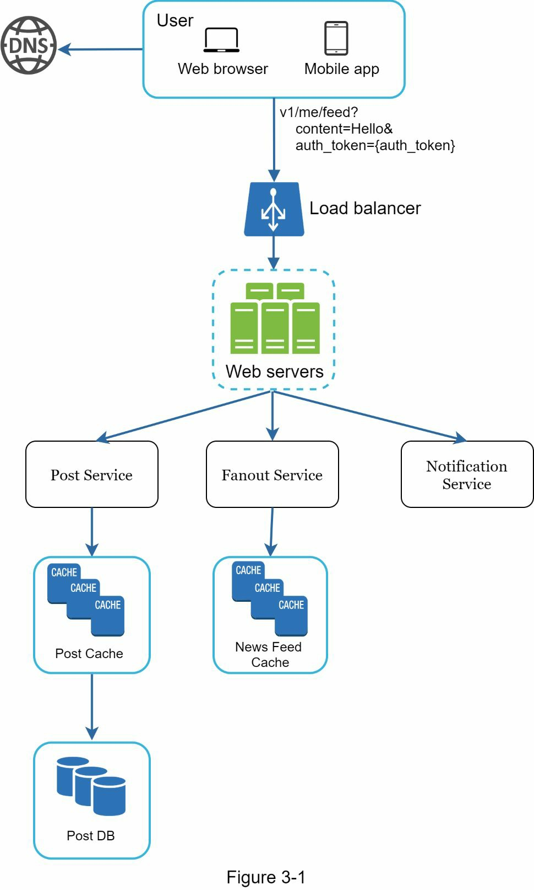
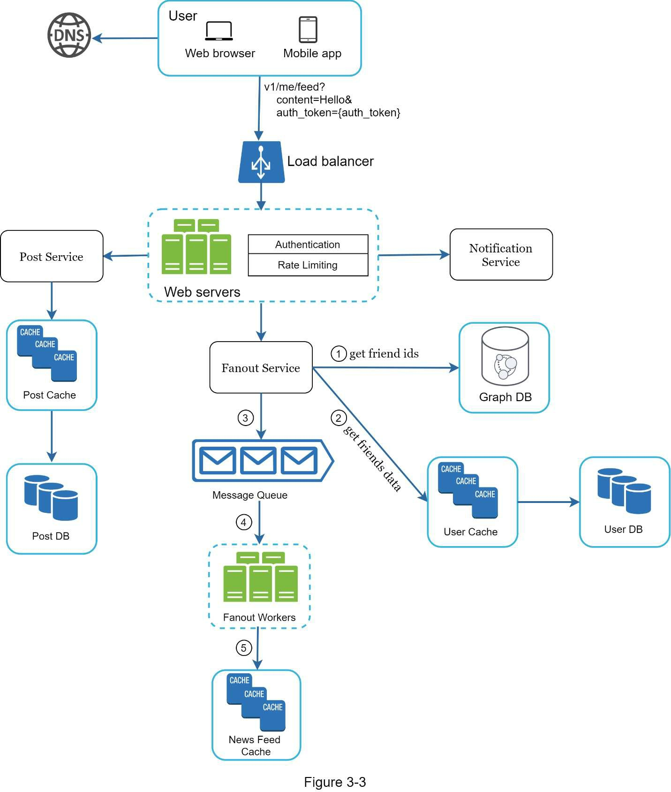

> **راهنمای مطالعه**
>
> در هر بخش، ابتدا متن اصلی کتاب به زبان انگلیسی آورده شده و سپس ترجمه و توضیحات فارسی همان بخش ارائه شده است.

---

###### 📄 صفحه ۴۲

> **CHAPTER 3: A FRAMEWORK FOR SYSTEM DESIGN INTERVIEWS**
> You have just landed a coveted on-site interview at your dream company. The hiring coordinator sends you a schedule for that day. Scanning down the list, you feel pretty good about it until your eyes land on this interview session - System Design Interview.
>
> System design interviews are often intimidating. It could be as vague as "designing a well-known product X?". The questions are ambiguous and seem unreasonably broad. Your weariness is understandable. After all, how could anyone design a popular product in an hour that has taken hundreds if not thousands of engineers to build?
>
> The good news is that no one expects you to. Real-world system design is extremely complicated. For example, Google search is deceptively simple; however, the amount of technology that underpins that simplicity is truly astonishing. If no one expects you to design a real-world system in an hour, what is the benefit of a system design interview?
>
> The system design interview simulates real-life problem solving where two co-workers collaborate on an ambiguous problem and come up with a solution that meets their goals. The problem is open-ended, and there is no perfect answer. The final design is less important compared to the work you put in the design process. This allows you to demonstrate your design skill, defend your design choices, and respond to feedback in a constructive manner.

**فصل ۳: چارچوبی برای مصاحبه‌های طراحی سیستم**

تازه برای مصاحبه‌ی حضوری در شرکت رؤیایی‌تان قبول شده‌اید. هماهنگ‌کننده استخدام برنامه‌ی آن روز را برایتان ارسال می‌کند. وقتی لیست را مرور می‌کنید، تا رسیدن به بخش «مصاحبه طراحی سیستم» احساس خوبی دارید.

مصاحبه‌های طراحی سیستم اغلب ترسناک به نظر می‌رسند. سؤالات می‌توانند مبهم و بی‌اندازه گسترده باشند، مثلاً «طراحی محصول معروف X». خستگی شما قابل درک است؛ چه کسی می‌تواند محصولی را که ساخت آن صدها یا هزاران مهندس زمان برده، در عرض یک ساعت طراحی کند؟

خبر خوب این است که **هیچ‌کس از شما این انتظار را ندارد.** طراحی سیستم در دنیای واقعی بسیار پیچیده است. برای مثال، جستجوی گوگل به‌ظاهر ساده است، اما حجم فناوری‌هایی که پشت این سادگی وجود دارد واقعاً خیره‌کننده است.

**مصاحبه طراحی سیستم، حل مسئله در دنیای واقعی را شبیه‌سازی می‌کند**؛ جایی که دو همکار روی یک مسئله مبهم همکاری می‌کنند و راه‌حلی برای رسیدن به اهداف خود ارائه می‌دهند. مسئله باز (Open-ended) است و پاسخ کاملی وجود ندارد. **طراحی نهایی کمتر از فرایندی که در طراحی طی می‌کنید اهمیت دارد.** این فرایند به شما امکان می‌دهد مهارت طراحی خود را نشان دهید، انتخاب‌هایتان را توجیه کنید و به بازخوردها به شکل سازنده‌ای پاسخ دهید.

---

###### 📄 صفحه ۴۲ (ادامه)

> Let us flip the table and consider what goes through the interviewer's head as she walks into the conference room to meet you. The primary goal of the interviewer is to accurately assess your abilities. The last thing she wants is to give an inconclusive evaluation because the session has gone poorly and there are not enough signals. What is an interviewer looking for in a system design interview?
>
> Many think that system design interview is all about a person's technical design skills. It is much more than that. An effective system design interview gives strong signals about a person's ability to collaborate, to work under pressure, and to resolve ambiguity constructively. The ability to ask good questions is also an essential skill, and many interviewers specifically look for this skill.
>
> A good interviewer also looks for red flags. Over-engineering is a real disease of many engineers as they delight in design purity and ignore tradeoffs. They are often unaware of the compounding costs of over-engineered systems, and many companies pay a high price for that ignorance. You certainly do not want to demonstrate this tendency in a system design interview. Other red flags include narrow mindedness, stubbornness, etc.
>
> In this chapter, we will go over some useful tips and introduce a simple and effective framework to solve system design interview problems.

بیایید جایگاه‌ها را عوض کنیم و ببینیم در ذهن مصاحبه‌گر چه می‌گذرد. **هدف اصلی مصاحبه‌گر، ارزیابی دقیق توانایی‌های شماست.** بدترین اتفاق برای او این است که به دلیل نبود سیگنال‌های کافی، ارزیابی نامشخصی ارائه دهد.

بسیاری فکر می‌کنند مصاحبه طراحی سیستم فقط درباره مهارت‌های فنی طراحی است، اما **خیلی بیشتر از این‌هاست.** یک مصاحبه مؤثر سیگنال‌های قوی درباره توانایی **همکاری، کار تحت فشار، و حل سازنده ابهامات** به دست می‌دهد. توانایی **提问 کردن سؤالات خوب** نیز مهارتی ضروری است و بسیاری از مصاحبه‌گران به‌طور خاص به دنبال آن هستند.

یک مصاحبه‌گر خوب به دنبال **پرچم‌های قرمز (Red Flags)** نیز هست. **بیش‌طراحی (Over-engineering)** بیماری واقعی بسیاری از مهندسان است؛ آن‌ها از خلوص طراحی لذت می‌برند و مبادلات (Tradeoffs) را نادیده می‌گیرند. سایر پرچم‌های قرمز شامل **تنگ‌نظری** و **لجبازی** نیز می‌شوند.

در این فصل، چند نکته مفید و یک **چارچوب ساده و مؤثر** برای حل مشکلات مصاحبه طراحی سیستم معرفی می‌کنیم.

---

###### 📄 صفحه ۴۳

> **A 4-step process for effective system design interview**
> Every system design interview is different. A great system design interview is open-ended and there is no one-size-fits-all solution. However, there are steps and common ground to cover in every system design interview.
>
> **Step 1 - Understand the problem and establish design scope**

### فرایند ۴ مرحله‌ای برای مصاحبه مؤثر طراحی سیستم

هر مصاحبه طراحی سیستم متفاوت است. یک مصاحبه عالی باز است و راه‌حل واحدی برای همه وجود ندارد. بااین‌حال، مراحل و نقاط مشترکی در هر مصاحبه طراحی سیستم وجود دارد.

---

#### مرحله ۱ - درک مسئله و تعیین محدوده طراحی

> "Why did the tiger roar?"
> A hand shot up in the back of the class.
> "Yes, Jimmy?", the teacher responded.
> "Because he was HUNGRY".
> "Very good Jimmy."
>
> Throughout his childhood, Jimmy has always been the first to answer questions in the class. Whenever the teacher asks a question, there is always a kid in the classroom who loves to take a crack at the question, no matter if he knows the answer or not. That is Jimmy.
>
> Jimmy is an ace student. He takes pride in knowing all the answers fast. In exams, he is usually the first person to finish the questions. He is a teacher's top choice for any academic competition.
>
> **DON'T be like Jimmy.**

«چرا ببر غرّش کرد؟» دستی در انتهای کلاس بالا رفت. «بله، جیمی؟» معلم پاسخ داد. «چون گرسنه بود!» «خیلی خوب جیمی.»

جیمی همیشه اولین کسی بود که در کلاس به سؤالات پاسخ می‌داد. او دانش‌آموز درجه یکی بود و به سرعت جواب دادن افتخار می‌کرد.

**شبیه جیمی نباشید.**

> In a system design interview, giving out an answer quickly without thinking gives you no bonus points. Answering without a thorough understanding of the requirements is a huge red flag as the interview is not a trivia contest. There is no right answer.
>
> So, do not jump right in to give a solution. Slow down. Think deeply and ask questions to clarify requirements and assumptions. This is extremely important.
>
> As an engineer, we like to solve hard problems and jump into the final design; however, this approach is likely to lead you to design the wrong system. One of the most important skills as an engineer is to ask the right questions, make the proper assumptions, and gather all the information needed to build a system. So, do not be afraid to ask questions.

در مصاحبه طراحی سیستم، **سریع جواب دادن بدون فکر کردن هیچ امتیاز اضافی‌ای به شما نمی‌دهد.** پاسخ دادن بدون درک کامل نیازمندی‌ها یک **پرچم قرمز بزرگ** است، زیرا مصاحبه یک مسابقه اطلاعات عمومی نیست و پاسخ درستی وجود ندارد.

پس **بلافاصله وارد ارائه راه‌حل نشوید. آرام باشید. عمیق فکر کنید و سؤال بپرسید** تا نیازمندی‌ها و فرضیات مشخص شوند. این بسیار مهم است.

یکی از مهم‌ترین مهارت‌های یک مهندس، **پرسیدن سؤالات درست، فرضیات مناسب، و جمع‌آوری تمام اطلاعات موردنیاز** برای ساخت یک سیستم است. پس از پرسیدن سؤال نترسید.

---

###### 📄 صفحه ۴۳ (ادامه)

> When you ask a question, the interviewer either answers your question directly or asks you to make your assumptions. If the latter happens, write down your assumptions on the whiteboard or paper. You might need them later.
>
> What kind of questions to ask? Ask questions to understand the exact requirements. Here is a list of questions to help you get started:
> • What specific features are we going to build?
> • How many users does the product have?
> • How fast does the company anticipate to scale up? What are the anticipated scales in 3 months, 6 months, and a year?
> • What is the company's technology stack? What existing services you might leverage to simplify the design?

وقتی سؤالی می‌پرسید، مصاحبه‌گر یا مستقیماً پاسخ می‌دهد یا از شما می‌خواهد فرضیات خود را مطرح کنید. اگر حالت دوم رخ داد، **فرضیات خود را روی تخته یا کاغذ یادداشت کنید** ممکن است بعداً به آن‌ها نیاز داشته باشید.

چه نوع سؤالاتی بپرسید؟ سؤالاتی بپرسید تا **نیازمندی‌های دقیق** مشخص شوند:

- چه ویژگی‌های خاصی قرار است بسازیم؟
- محصول چند کاربر دارد؟
- شرکت چه سرعتی برای رشد پیش‌بینی می‌کند؟ مقیاس مورد انتظار در ۳ ماه، ۶ ماه و یک سال چقدر است؟
- استک فناوری شرکت چیست؟ چه سرویس‌های موجودی می‌توانند طراحی را ساده‌تر کنند؟

---

###### 📄 صفحه ۴۴

> **Example:** If you are asked to design a news feed system, you want to ask questions that help you clarify the requirements. The conversation between you and the interview might look like this:
>
> Candidate: Is this a mobile app? Or a web app? Or both?
> Interviewer: Both.
> Candidate: What are the most important features for the product?
> Interviewer: Ability to make a post and see friends' news feed.
> Candidate: Is the news feed sorted in reverse chronological order or a particular order?
> Interviewer: To keep things simple, let us assume the feed is sorted by reverse chronological order.
> Candidate: How many friends can a user have?
> Interviewer: 5000
> Candidate: What is the traffic volume?
> Interviewer: 10 million daily active users (DAU)
> Candidate: Can feed contain images, videos, or just text?
> Interviewer: It can contain media files, including both images and videos.
>
> Above are some sample questions that you can ask your interviewer. It is important to understand the requirements and clarify ambiguities.

### مثال

اگر از شما خواسته شود یک سیستم فید خبری (News Feed) طراحی کنید، باید سؤالاتی بپرسید که نیازمندی‌ها را مشخص کند. گفتگوی بین شما و مصاحبه‌گر ممکن است به این صورت باشد:

**کاندیدا:** آیا این یک اپلیکیشن موبایل است؟ یا وب‌اپ؟ یا هر دو؟
**مصاحبه‌گر:** هر دو.
**کاندیدا:** مهم‌ترین ویژگی‌های محصول چیست؟
**مصاحبه‌گر:** قابلیت ایجاد پست و دیدن فید خبری دوستان.
**کاندیدا:** آیا فید بر اساس ترتیب زمانی معکوس مرتب می‌شود یا ترتیب خاصی دارد؟
**مصاحبه‌گر:** برای سادگی، فرض کنیم فید بر اساس ترتیب زمانی معکوس مرتب می‌شود.
**کاندیدا:** هر کاربر چند دوست می‌تواند داشته باشد؟
**مصاحبه‌گر:** ۵,۰۰۰
**کاندیدا:** حجم ترافیک چقدر است؟
**مصاحبه‌گر:** ۱۰ میلیون کاربر فعال روزانه (DAU)
**کاندیدا:** آیا فید می‌تواند تصاویر، ویدیو یا فقط متن داشته باشد؟
**مصاحبه‌گر:** می‌تواند فایل‌های رسانه‌ای شامل تصاویر و ویدیو داشته باشد.

---

###### 📄 صفحه ۴۴ (ادامه)

> **Step 2 - Propose high-level design and get buy-in**
> In this step, we aim to develop a high-level design and reach an agreement with the interviewer on the design. It is a great idea to collaborate with the interviewer during the process.
> • Come up with an initial blueprint for the design. Ask for feedback. Treat your interviewer as a teammate and work together.
> • Draw box diagrams with key components on the whiteboard or paper. This might include clients (mobile/web), APIs, web servers, data stores, cache, CDN, message queue, etc.
> • Do back-of-the-envelope calculations to evaluate if your blueprint fits the scale constraints. Think out loud.
>
> If possible, go through a few concrete use cases. This will help you frame the high-level design.
>
> Should we include API endpoints and database schema here? This depends on the problem. For large design problems like "Design Google search engine", this is a bit of too low level. For a problem like designing the backend for a multi-player poker game, this is a fair game. Communicate with your interviewer.

#### مرحله ۲ - ارائه طراحی سطح بالا و جلب تأیید

در این مرحله، هدف ما تدوین یک طراحی سطح بالا و رسیدن به توافق با مصاحبه‌گر است. همکاری با مصاحبه‌گر در این فرایند ایده عالی‌ای است.

- **طرح اولیه (Blueprint) طراحی** را ارائه دهید و بازخورد بخواهید. مصاحبه‌گر را مانند یک همکار در نظر بگیرید.
- **نمودار جعبه‌ای** با مؤلفه‌های کلیدی روی تخته یا کاغذ بکشید. این شامل کلاینت‌ها (موبایل/وب)، APIها، وب‌سرورها، فضای ذخیره‌سازی داده، کش، CDN، صف پیام و غیره می‌شود.
- **تخمین پشت پاکتی** انجام دهید تا بررسی کنید آیا طرح شما با محدودیت‌های مقیاس سازگار است. با صدای بلند فکر کنید.

در صورت امکان، چند **نمونه کاربری واقعی** را بررسی کنید. این کار به شما کمک می‌کند طراحی سطح بالا را بهتر قاب‌بندی کنید.

آیا باید در این مرحله نقاط انتهایی API و طرح پایگاه داده را وارد کنیم؟ این بستگی به مسئله دارد. برای مسائل بزرگ مانند «طراحی موتور جستجوی گوگل» این سطح جزئیات در ابتدا زیاد است. برای مسائلی مانند طراحی بک‌اند یک بازی پوکر چندنفره، این مناسب است. **با مصاحبه‌گر خود ارتباط برقرار کنید.**

---

###### 📄 صفحه ۴۵

> **Example:** Let us use "Design a news feed system" to demonstrate how to approach the high-level design. At the high level, the design is divided into two flows: feed publishing and news feed building.
> • Feed publishing: when a user publishes a post, corresponding data is written into cache/database, and the post will be populated into friends' news feed.
> • Newsfeed building: the news feed is built by aggregating friends' posts in a reverse chronological order.
>
> Figure 3-1 and Figure 3-2 present high-level designs for feed publishing and news feed building flows, respectively.

### مثال: طراحی سطح بالای سیستم فید خبری

طراحی سطح بالا به دو جریان اصلی تقسیم می‌شود:

- **انتشار فید (Feed Publishing):** وقتی کاربری پستی منتشر می‌کند، داده‌های مربوطه در کش/پایگاه داده نوشته شده و پست در فید خبری دوستان نمایش داده می‌شود.

- **ساخت فید خبری (News Feed Building):** فید خبری با ترکیب پست‌های دوستان به ترتیب زمانی معکوس ساخته می‌شود.

شکل‌های ۳-۱ و ۳-۲ طراحی سطح بالا برای جریان‌های انتشار فید و ساخت فید خبری را نشان می‌دهند.

---

###### 📄 صفحه ۴۶

> **Step 3 - Design deep dive**
> At this step, you and your interviewer should have already achieved the following objectives:
> • Agreed on the overall goals and feature scope
> • Sketched out a high-level blueprint for the overall design
> • Obtained feedback from your interviewer on the high-level design
> • Had some initial ideas about areas to focus on in deep dive based on her feedback
>
> You shall work with the interviewer to identify and prioritize components in the architecture. It is worth stressing that every interview is different. Sometimes, the interviewer may give off hints that she likes focusing on high-level design. Sometimes, for a senior candidate interview, the discussion could be on the system performance characteristics, likely focusing on the bottlenecks and resource estimations. In most cases, the interviewer may want you to dig into details of some system components.
>
> Time management is essential as it is easy to get carried away with minute details that do not demonstrate your abilities. You must be armed with signals to show your interviewer. Try not to get into unnecessary details.

#### مرحله ۳ - غواصی عمیق در طراحی (Design Deep Dive)

در این مرحله، شما و مصاحبه‌گرتان باید به اهداف زیر رسیده باشید:

- توافق درباره اهداف کلی و محدوده ویژگی‌ها
- ترسیم طرح اولیه سطح بالا
- دریافت بازخورد از مصاحبه‌گر
- داشتن ایدیه‌های اولیه درباره بخش‌هایی که باید عمیق‌تر بررسی شوند

باید با مصاحبه‌گر همکاری کنید تا **مؤلفه‌های معماری را شناسایی و اولویت‌بندی** کنید. هر مصاحبه متفاوت است. گاهی مصاحبه‌گر روی طراحی سطح بالا تمرکز می‌کند و گاهی بحث درباره **ویژگی‌های عملکرد سیستم، تنگناها (Bottlenecks) و تخمین منابع** است.

**مدیریت زمان ضروری است** زیرا راحت می‌توان در جزئیاتی غرق شد که توانایی‌های شما را نشان نمی‌دهند. سعی کنید وارد جزئیات غیرضروری نشوید.

---

###### 📄 صفحه ۴۷

> **Example:** At this point, we have discussed the high-level design for a news feed system, and the interviewer is happy with your proposal. Next, we will investigate two of the most important use cases:
> 1. Feed publishing
> 2. News feed retrieval
>
> Figure 3-3 and Figure 3-4 show the detailed design for the two use cases, which will be explained in detail in Chapter 11.

### مثال: طراحی عمیق

در این مرحله، طراحی سطح بالای سیستم فید خبری بررسی شده و مصاحبه‌گر از پیشنهاد شما راضی است. حالا دو مورد کاربری مهم را بررسی می‌کنیم:

1. انتشار فید
2. بازیابی فید خبری

شکل‌های ۳-۳ و ۳-۴ طراحی تفصیلی این دو مورد کاربری را نشان می‌دهند که در فصل ۱۱ به‌تفصیل توضیح داده خواهند شد.

---

###### 📄 صفحه ۴۹

> **Step 4 - Wrap up**
> In this final step, the interviewer might ask you a few follow-up questions or give you the freedom to discuss other additional points. Here are a few directions to follow:
> • The interviewer might want you to identify the system bottlenecks and discuss potential improvements. Never say your design is perfect and nothing can be improved.
> • It could be useful to give the interviewer a recap of your design. This is particularly important if you suggested a few solutions.
> • Error cases (server failure, network loss, etc.) are interesting to talk about.
> • Operation issues are worth mentioning. How do you monitor metrics and error logs? How to roll out the system?
> • How to handle the next scale curve is also an interesting topic.
> • Propose other refinements you need if you had more time.

#### مرحله ۴ - جمع‌بندی

در این مرحله نهایی، مصاحبه‌گر ممکن است چند سؤال تکمیلی بپرسد یا آزادی بحث درباره نکات اضافی را به شما بدهد. چند مسیر پیشنهادی:

- مصاحبه‌گر ممکن است بخواهد **تنگناهای سیستم** را شناسایی کرده و بهبودهای بالقوه را بحث کنید. **هرگز نگویید طراحی شما کامل است و قابل بهبود نیست.**
- **خلاصه‌ای از طراحی خود** به مصاحبه‌گر ارائه دهید. این به‌ویژه اگر چند راه‌حل پیشنهاد کرده‌اید مهم است.
- **موارد خطا** (خرابی سرور، قطع شبکه و...) موضوعات جالبی برای بحث هستند.
- **مسائل عملیاتی** مانند نظارت بر معیارها و لاگ‌های خطا، و نحوه استقرار سیستم ارزش ذکر شدن دارند.
- **نحوه مدیریت منحنی رشد بعدی** نیز موضوع جالبی است.

---

###### 📄 صفحه ۵۰

> To wrap up, we summarize a list of the Dos and Don'ts.
>
> **Dos:**
> • Always ask for clarification. Do not assume your assumption is correct.
> • Understand the requirements of the problem.
> • There is neither the right answer nor the best answer.
> • Let the interviewer know what you are thinking. Communicate with your interviewer.
> • Suggest multiple approaches if possible.
> • Once you agree with your interviewer on the blueprint, go into details on each component. Design the most critical components first.
> • Bounce ideas off the interviewer.
> • Never give up.
>
> **Don'ts:**
> • Don't be unprepared for typical interview questions.
> • Don't jump into a solution without clarifying the requirements and assumptions.
> • Don't go into too much detail on a single component in the beginning.
> • If you get stuck, don't hesitate to ask for hints.
> • Again, communicate. Don't think in silence.
> • Don't think your interview is done once you give the design.

### خلاصه: کارهای درست و نادرست

**کارهای درست (Dos):**
- همیشه برای شفاف‌سازی سؤال بپرسید. فرض نکنید فرضیات شما درست است.
- نیازمندی‌های مسئله را درک کنید.
- نه پاسخ درستی وجود دارد و نه بهترین پاسخ.
- به مصاحبه‌گر نشان دهید چه فکر می‌کنید. با او ارتباط برقرار کنید.
- در صورت امکان چند رویکرد مختلف پیشنهاد دهید.
- وقتی روی طرح اولیه توافق کردید، وارد جزئیات هر مؤلفه شوید. ابتدا مهم‌ترین مؤلفه‌ها را طراحی کنید.
- ایده‌های خود را با مصاحبه‌گر در میان بگذارید.
- **هرگز تسلیم نشوید.**

**کارهای نادرست (Don'ts):**
- برای سؤالات رایج مصاحبه آماده نباشید.
- بدون شفاف‌سازی نیازمندی‌ها و فرضیات وارد ارائه راه‌حل نشوید.
- در ابتدا وارد جزئیات بیش از حد یک مؤلفه نشوید.
- اگر گیر کردید، از مصاحبه‌گر راهنمایی نخواهید.
- دوباره تأکید می‌کنم: **ارتباط برقرار کنید. در سکوت فکر نکنید.**
- فکر نکنید وقتی طراحی را ارائه دادید مصاحبه تمام شده است.

---

> **Time allocation on each step**
> System design interview questions are usually very broad, and 45 minutes or an hour is not enough to cover the entire design. Time management is essential. The following is a very rough guide on distributing your time in a 45-minute interview session:
>
> Step 1 - Understand the problem and establish design scope: 3 - 10 minutes
> Step 2 - Propose high-level design and get buy-in: 10 - 15 minutes
> Step 3 - Design deep dive: 10 - 25 minutes
> Step 4 - Wrap up: 3 - 5 minutes

### تخصیص زمان در هر مرحله

سؤالات مصاحبه طراحی سیستم معمولاً بسیار گسترده هستند و ۴۵ دقیقه یا یک ساعت برای پوشش کل طراحی کافی نیست. **مدیریت زمان ضروری است.** راهنمای تقریبی زیر توزیع زمان در یک جلسه مصاحبه ۴۵ دقیقه‌ای را نشان می‌دهد:

| مرحله | عنوان | زمان تقریبی |
|--------|--------|-------------|
| ۱ | درک مسئله و تعیین محدوده طراحی | ۳ تا ۱۰ دقیقه |
| ۲ | ارائه طراحی سطح بالا و جلب تأیید | ۱۰ تا ۱۵ دقیقه |
| ۳ | غواصی عمیق در طراحی | ۱۰ تا ۲۵ دقیقه |
| ۴ | جمع‌بندی | ۳ تا ۵ دقیقه |

> **توجه:** این یک تخمین تقریبی است و توزیع زمان واقعی به محدوده مسئله و نیازمندی‌های مصاحبه‌گر بستگی دارد.
