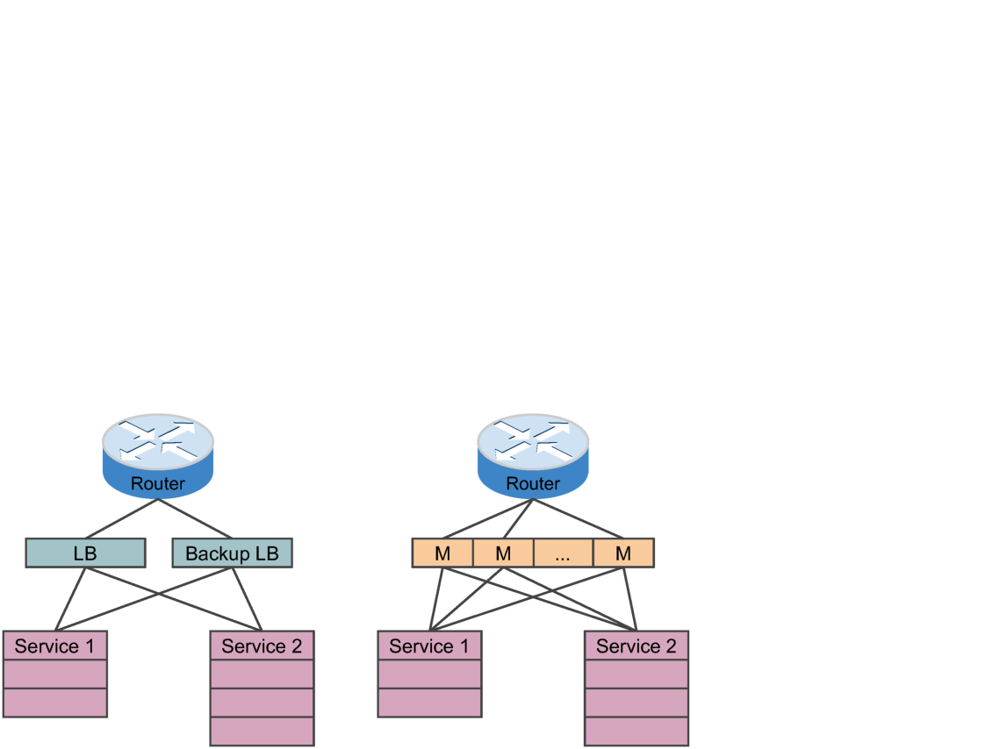
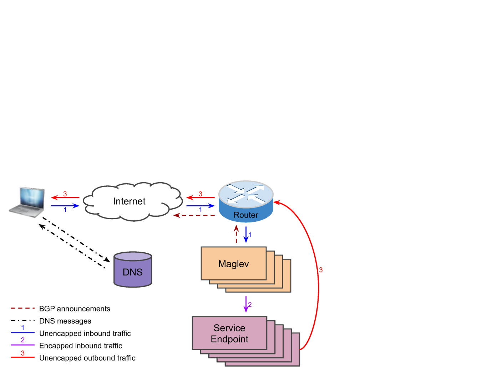
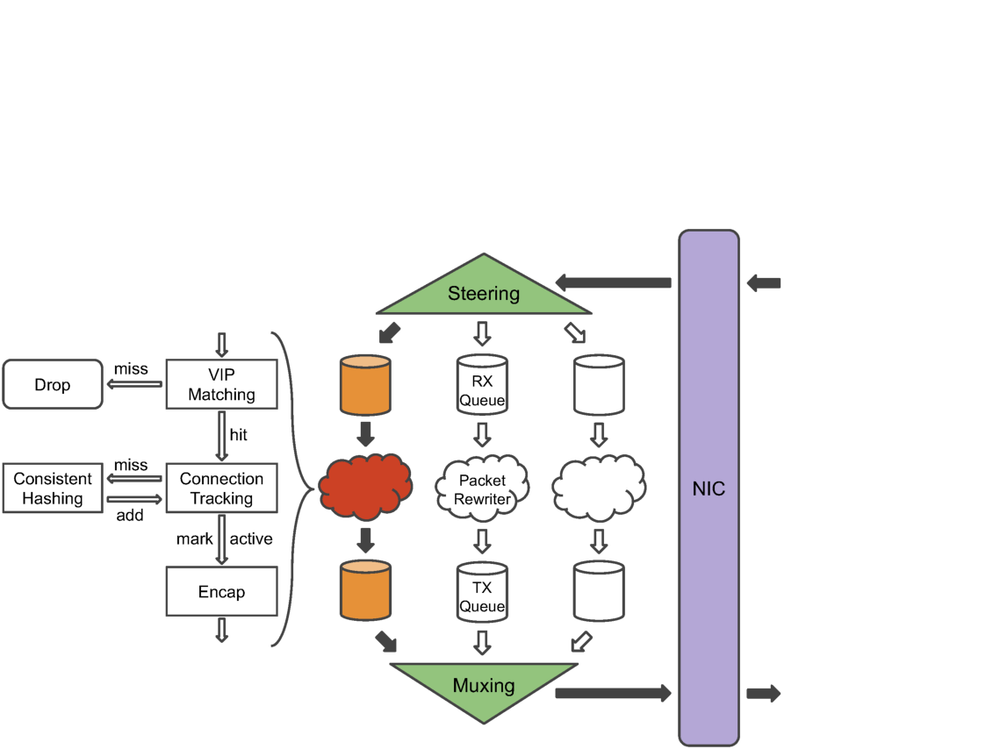
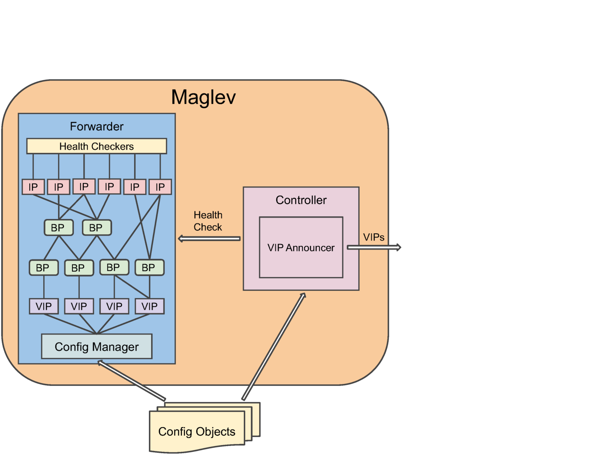
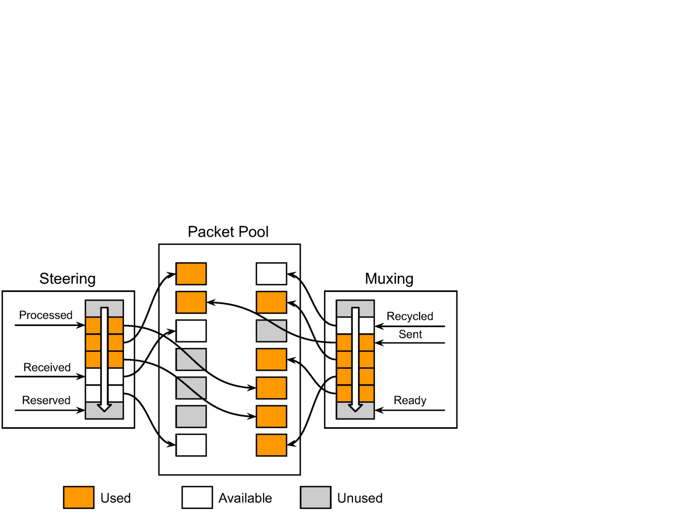
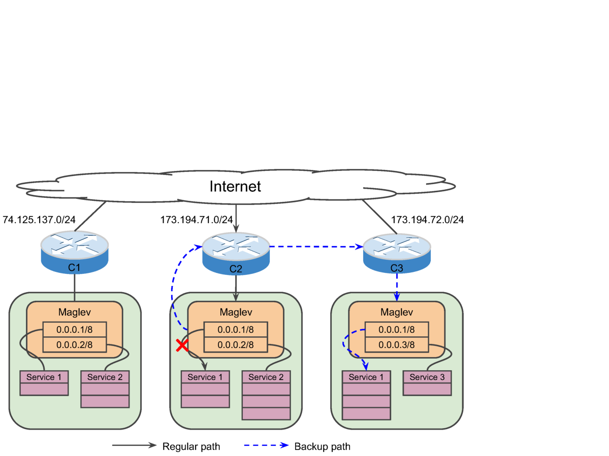
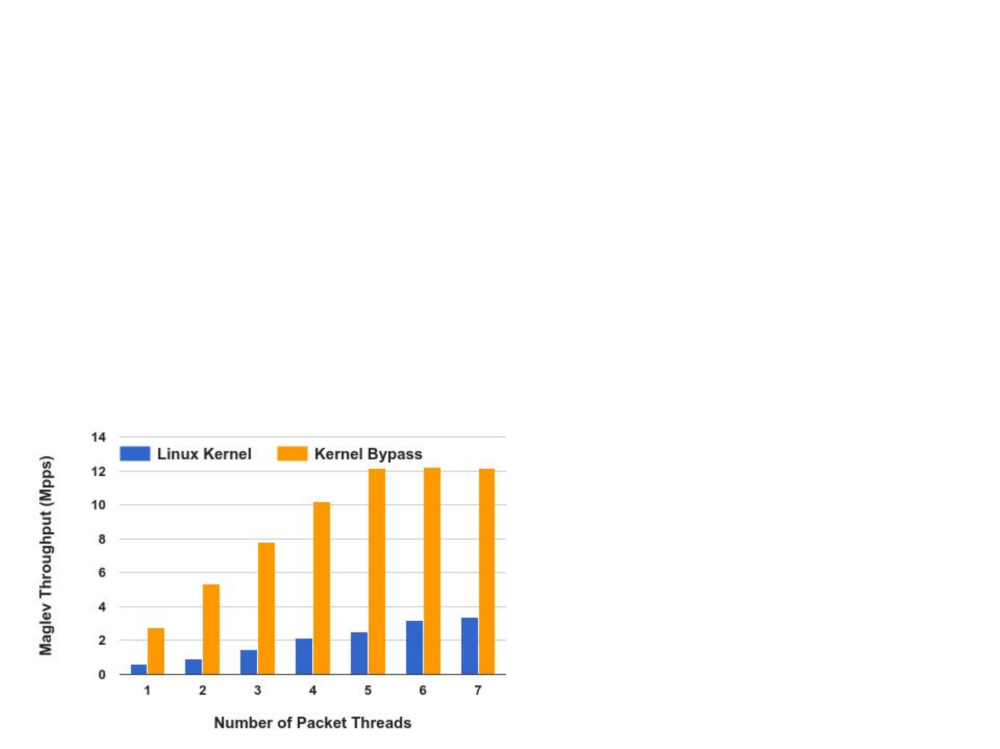
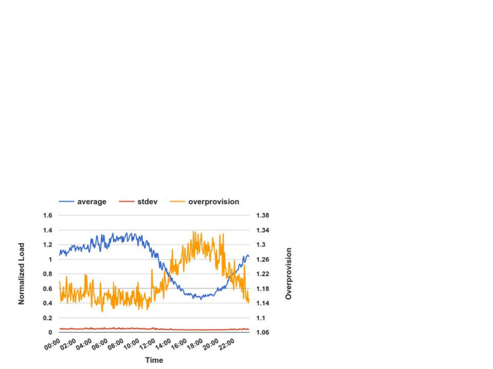

> **راهنمای مطالعه**
>
> در هر بخش، ابتدا متن اصلی کتاب به زبان انگلیسی آورده شده و سپس ترجمه و توضیحات فارسی همان بخش ارائه شده است.

---
# ترجمه فارسی: Maglev: A Fast and Reliable Software Network Load Balancer

> **مقاله اصلی:** Maglev: A Fast and Reliable Software Network Load Balancer
> **نویسندگان:** Danielle E. Eisenbud, Cheng Yi, Carlo Contavalli, Cody Smith, Roman Kononov, Eric Mann-Hielscher, Ardas Cilingiroglu, Bin Cheyney, Wentao Shang, Jinnah Dylan Hosein
> **سازمان:** Google Inc., UCLA, SpaceX
> **منبع:** NSDI 2016
> **فایل PDF:** maglev-paper.pdf

---

## چکیده

> Maglev is Google's network load balancer. It is a large distributed software system that runs on commodity Linux servers. Unlike traditional hardware network load balancers, it does not require a specialized physical rack deployment, and its capacity can be easily adjusted by adding or removing servers.

Maglev متعادل‌کننده بار شبکه گوگل است. یک سیستم نرم‌افزاری توزیع‌شده بزرگ است که روی سرورهای لینوکسی ارزان قیمت اجرا می‌شود. بر خلاف متعادل‌کننده‌های بار سخت‌افزاری سنتی، به استقرار فیزیکی تخصصی رک نیاز ندارد و ظرفیت آن به راحتی با اضافه یا حذف سرورها قابل تنظیم است.

---

## مقدمه

> Google is a major source of global Internet traffic. It provides hundreds of user-facing services. Popular Google services such as Google Search and Gmail receive millions of queries per second from around the globe.

گوگل منبع اصلی ترافیک اینترنت جهانی است. صدها سرویس کاربرمحور ارائه می‌دهد. سرویس‌های محبوب گوگل مانند Google Search و Gmail میلیون‌ها پرس‌وجو در ثانیه از سراسر جهان دریافت می‌کنند.

---

## مرور سیستم

### معماری سرویس‌دهی Frontend

> Every Google service has one or more Virtual IP addresses (VIPs). A VIP is different from a physical IP in that it is not assigned to a specific network interface, but rather served by multiple service endpoints behind Maglev.

هر سرویس گوگل یک یا چند آدرس IP مجازی (VIP) دارد. VIP با IP فیزیکی تفاوت دارد زیرا به یک رابط شبکه خاص اختصاص نمی‌یابد، بلکه توسط چندین نقطه پایانی سرویس پشت Maglev سرویس دهی می‌شود.

### پیکربندی Maglev

> Each Maglev machine contains a controller and a forwarder. Both the controller and the forwarder learn the VIPs to be served from configuration objects.

هر ماشین Maglev شامل یک کنترلر و یک ارسال‌کننده است. هر دو VIPهای مورد سرویس‌دهی را از اشیاء پیکربندی یاد می‌گیرند.

---

## طراحی ارسال‌کننده

### ساختار کلی

> The forwarder is a critical component of Maglev, as it needs to handle a huge number of packets quickly and reliably.

ارسال‌کننده جزء حیاتی Maglev است زیرا باید تعداد زیادی بسته را به سرعت و به طور قابل اعتماد مدیریت کند.

### جدول بازگشتی (Lookup Table)

> Maglev uses a consistent hashing based lookup table to map VIPs to backend pools. The lookup table is precomputed and stored in shared memory for fast access.

Maglev از جدول بازگشتی مبتنی بر هشینگ سازگار برای نگاشت VIPها به استخرهای بک‌اند استفاده می‌کند. جدول بازگشتی از پیش محاسبه شده و در حافظه مشترک برای دسترسی سریع ذخیره می‌شود.

---

## هشینگ سازگار

> Maglev implements its own variant of consistent hashing, which we call Maglev hashing. Like other consistent hashing schemes, Maglev hashing distributes connections across backends in a balanced manner while minimizing the number of connections affected by a backend change.

Maglev پیاده‌سازی خاص خود از هشینگ سازگار را اجرا می‌کند که آن را Maglev hashing می‌نامیم. مانند سایر طرح‌های هشینگ سازگار، Maglev hashing اتصالات را به طور متعادل بین بک‌اندها توزیع می‌کند و در عین حال تعداد اتصالات تحت تأثیر تغییر بک‌اند را به حداقل می‌رساند.

---

## پایش سلامت

> Maglev performs health checking on backends to ensure that traffic is only forwarded to healthy backends. Health checks are performed periodically and results are cached to avoid unnecessary overhead.

Maglev پایش سلامت روی بک‌اندها انجام می‌دهد تا اطمینان حاصل شود ترافیک فقط به بک‌اندهای سالم ارسال می‌شود. پایش سلامت به طور دوره‌ای انجام می‌شود و نتایج برای جلوگیری از سربار غیرضروری کش می‌شوند.

---

## عملکرد

> A single Maglev machine is able to saturate a 10Gbps link with small packets. Maglev has been serving Google's traffic since 2008 and has sustained the rapid global growth of Google services.

یک ماشین Maglev منفرد قادر است یک لینک 10Gbps را با بسته‌های کوچک اشباع کند. Maglev از سال ۲۰۰۸ ترافیک گوگل را سرویس دهی کرده و رشد سریع جهانی سرویس‌های گوگل را پایدار نگه داشته است.

---

## یادداشت شخصی

> **اهمیت این مقاله:** Maglev نمونه‌ای واقعی از کاربرد هشینگ سازگار در تعادل بار شبکه در مقیاس گوگل است. این مقاله نشان می‌دهد چگونه هشینگ سازگار در یک سیستم تولیدی با ترافیک بالا استفاده می‌شود و چرا انتخاب الگوریتم هشینگ مناسب برای عملکرد حیاتی است.

---

**ترجمه فارسی:** احمد مطلبی
**تاریخ ترجمه:** ۲۰۲۶/۰۸/۲۶
**منبع اصلی:** [Maglev Paper - NSDI 2016](https://research.google/pubs/pub44824/)
