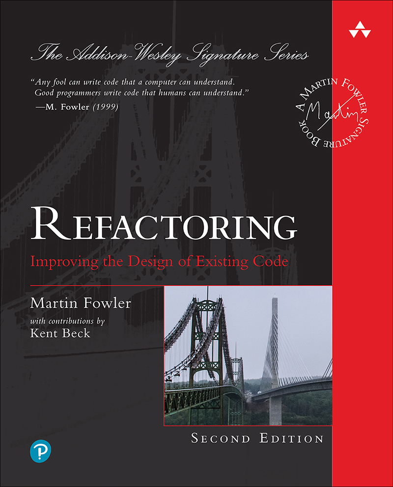
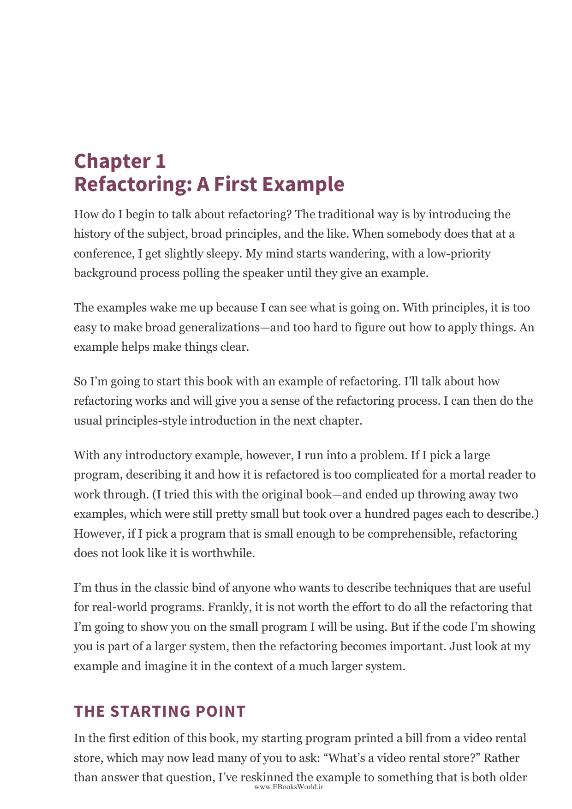
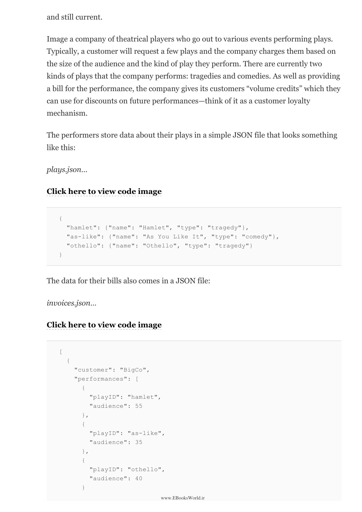
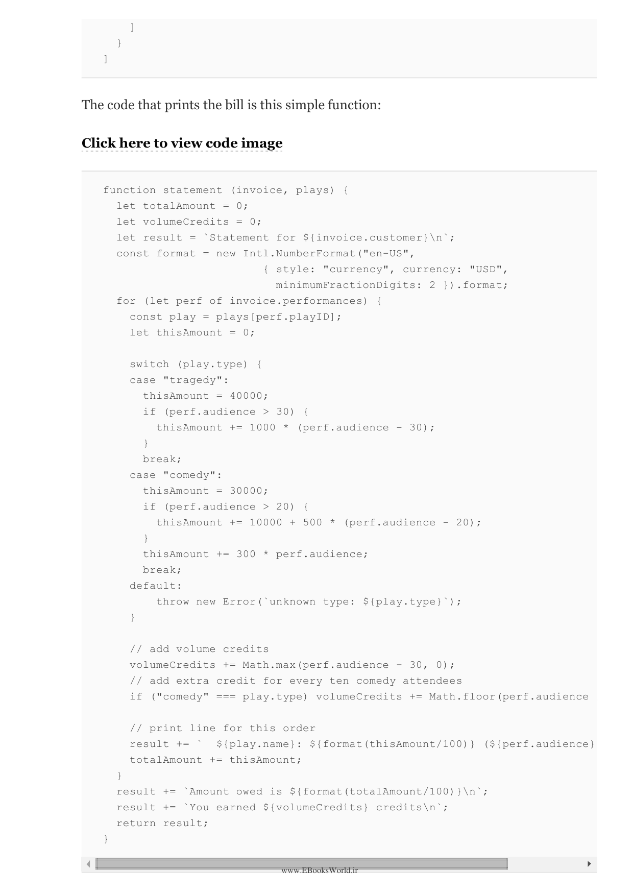
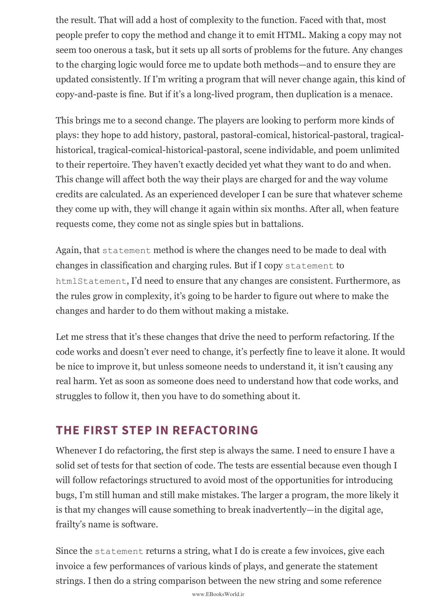
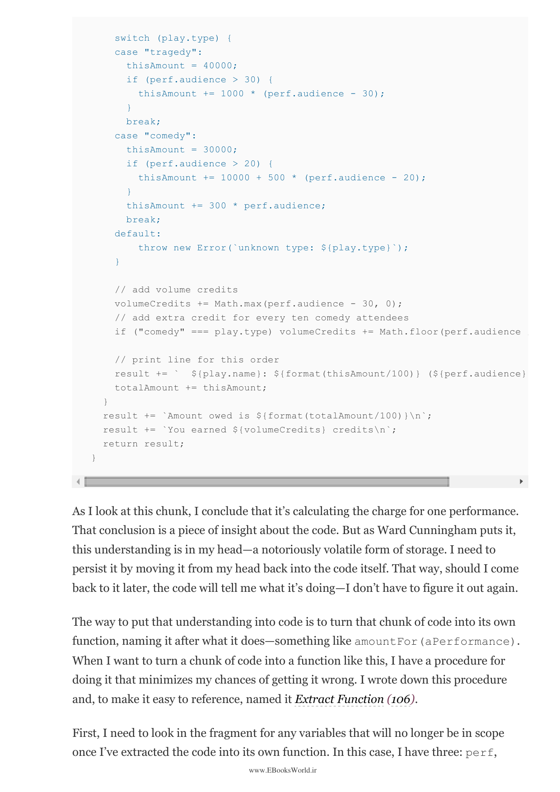
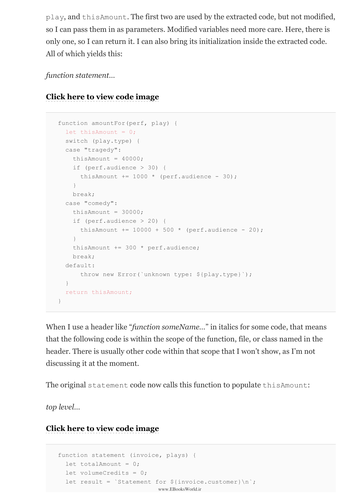
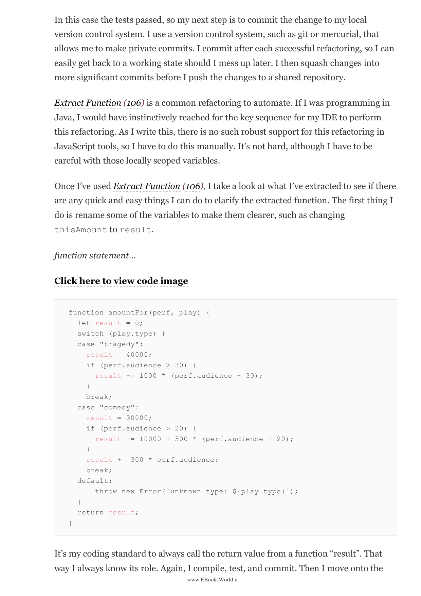

# بازآفرینی کد: بهبود طراحی کدهای موجود

---

**نویسنده:** مارتین فاولر (Martin Fowler)  
**ناشر:** Addison-Wesley Professional  
**سال انتشار:** ۲۰۱۸  
**ویرایش دوم**

---

## فهرست مطالب

- [فصل ۱: بازآفرینی — چیستی و چرایی](#فصل-۱-بازآفرینی)
- [فصل ۲: نمونه‌ای از بازآفرینی](#فصل-۲-نمونه‌ای-از-بازآفرینی)
- [فصل ۳: فرهنگ بازآفرینی](#فصل-۳-فرهنگ-بازآفرینی)
- [فصل ۴: شروع کار](#فصل-۴-شروع-کار)
- [فصل ۵: هوشمندتر عمل کردن](#فصل-۵-هوشمندتر-عمل-کردن)
- [فصل ۶: مجموعه اول بازآفرینی‌ها](#فصل-۶-مجموعه-اول-بازآفرینی‌ها)
- [فصل ۷: محصورسازی داده‌ها](#فصل-۷-محصورسازی-داده‌ها)
- [فصل ۸: انتقال ویژگی‌ها بین اشیاء](#فصل-۸-انتقال-ویژگی‌ها-بین-اشیاء)
- [فصل ۹: سازمان‌دهی داده‌ها](#فصل-۹-سازمان‌دهی-داده‌ها)
- [فصل ۱۰: ساده‌سازی منطق شرطی](#فصل-۱۰-ساده‌سازی-منطق-شرطی)
- [فصل ۱۱: بازآفرینی رابط برنامه‌نویسی](#فصل-۱۱-بازآفرینی-رابط-برنامه‌نویسی)
- [فصل ۱۲: مقابله با وراثت](#فصل-۱۲-مقابله-با-وراثت)

---

# پیش‌گفتار

> This book is about refactoring, specifically about refactoring in JavaScript, presented in a catalog format. Refactoring is a controlled technique for improving the design of an existing code base. Its essence is applying a series of small behavior-preserving transformations, each of which is "too small to be worth doing" on its own. By doing them in small steps you reduce the risk of introducing errors and get a system that is well tested at each step of the transformation.

این کتاب درباره بازآفرینی است، به‌طور خاص درباره بازآفرینی در جاوااسکریپت، ارائه‌شده به‌صورت فهرستی. بازآفرینی یک تکنیک کنترل‌شده برای بهبود طراحی یک پایگاه کد موجود است. ماهیت آن اعمال یک سری از تحولات کوچک حافظ رفتار است که هر یک به‌تنهایی «خیلی کوچک هستند که ارزش انجام داشته باشند». با انجام آن‌ها در گام‌های کوچک، خطر معرفی خطا را کاهش می‌دهید و سیستمی دریافت می‌کنید که در هر مرحله از تحول به‌خوبی آزمایش شده است.

> This book is aimed at two audiences. First, there's the software professional who's already familiar with JavaScript and probably with refactoring in other languages, and wants to learn about refactoring in JavaScript. Second is the developer who already knows refactoring from Fowler's original book, and wants to learn how to apply refactoring in JavaScript, particularly with the new features in ES6 and beyond.

این کتاب برای دو مخاطب نوشته شده است. اول، حرفه‌ای نرم‌افزاری که از قبل با جاوااسکریپت و احتمالاً با بازآفرینی در زبان‌های دیگر آشنا است و می‌خواهد درباره بازآفرینی در جاوااسکریپت بیاموزد. دوم، توسعه‌دهنده‌ای است که از قبل بازآفرینی را از کتاب اصلی فاولر می‌شناسد و می‌خواهد یاد بگیرد چگونه بازآفرینی را در جاوااسکریپت به کار ببندد، به‌ویژه با ویژگی‌های جدید ES6 و پس از آن.

---