# فصل ۱: بازآفرینی — چیستی و چرایی

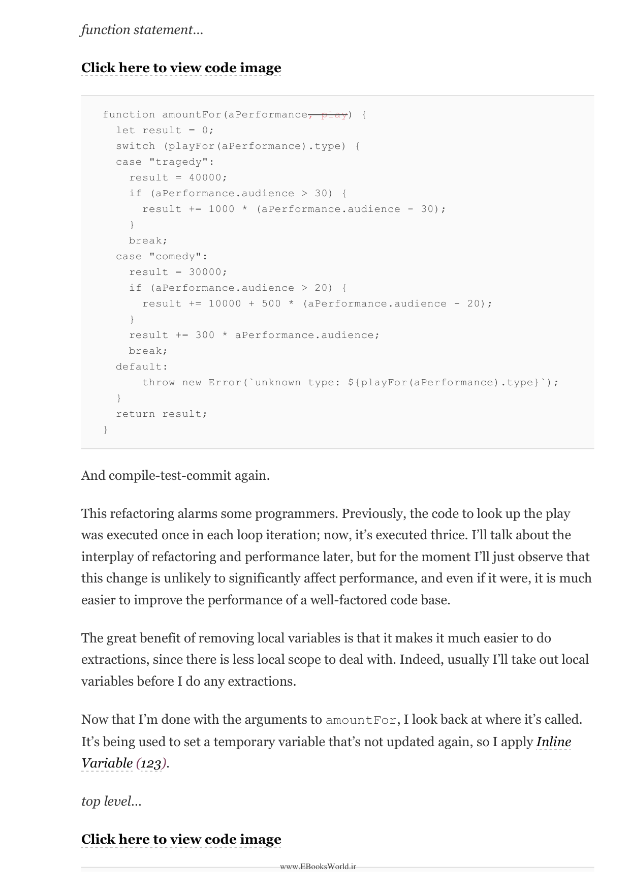

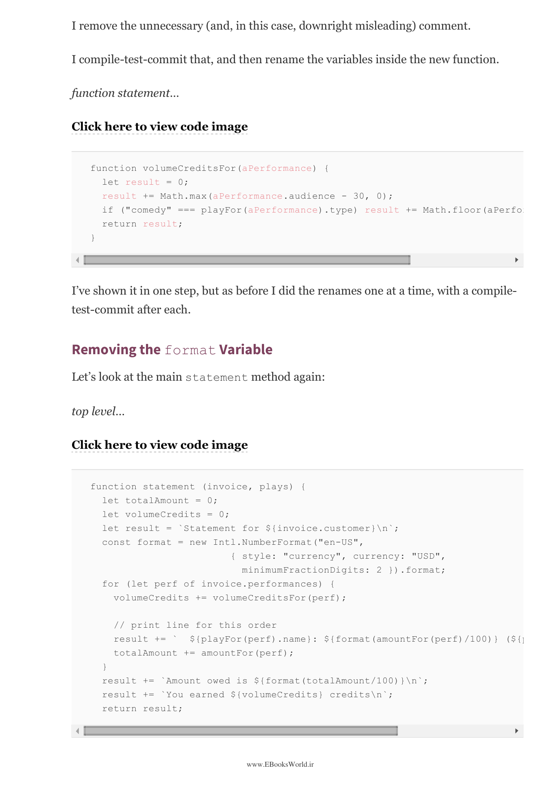

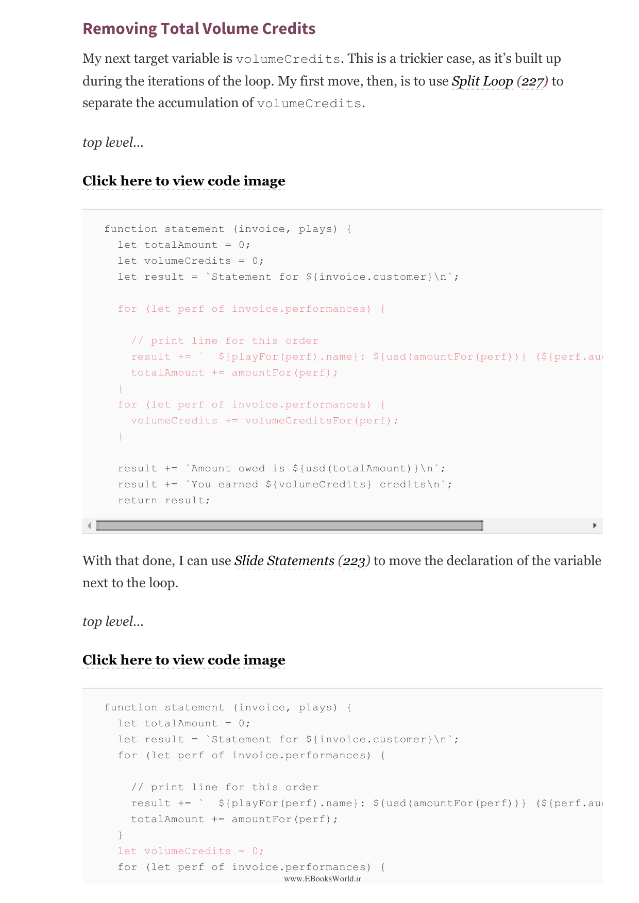

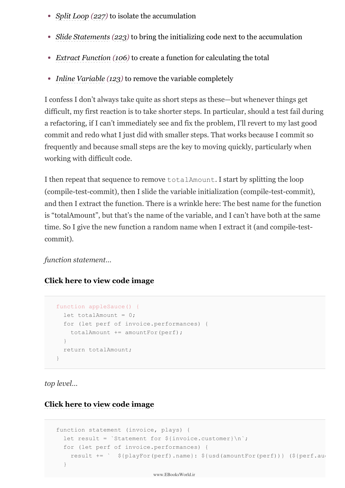

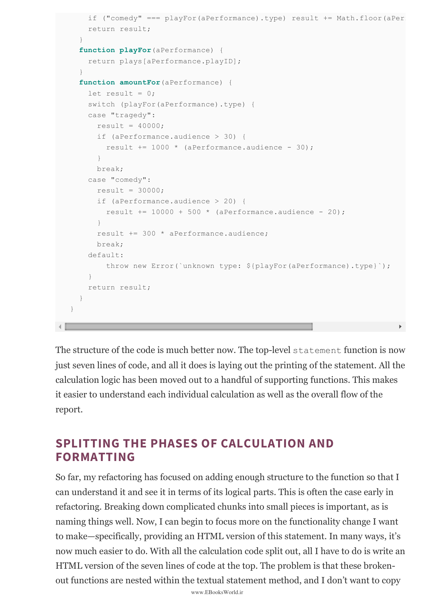

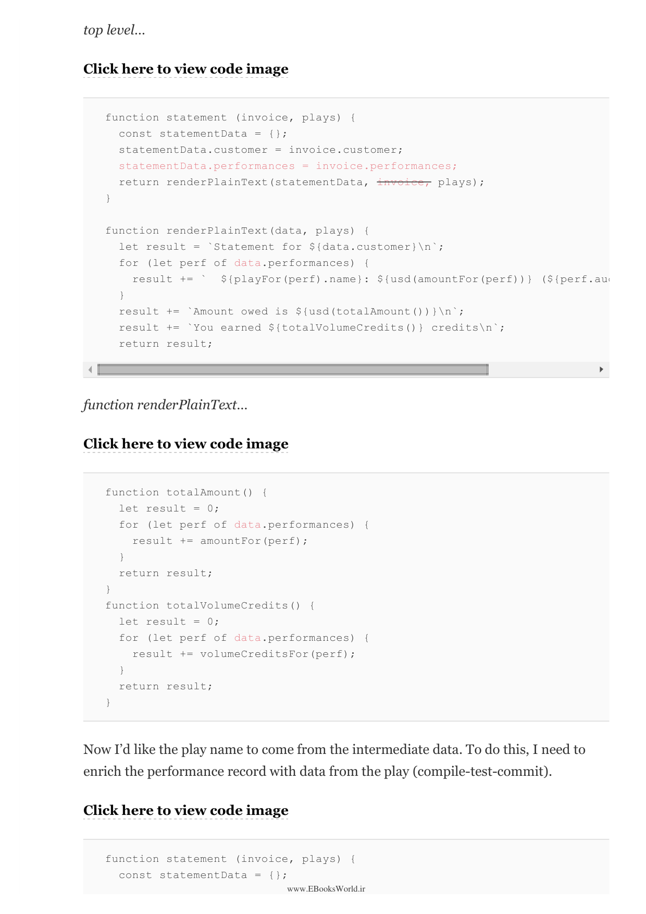

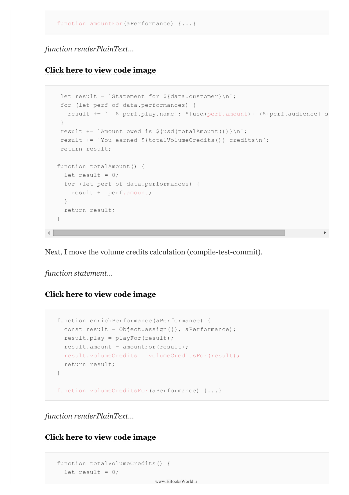

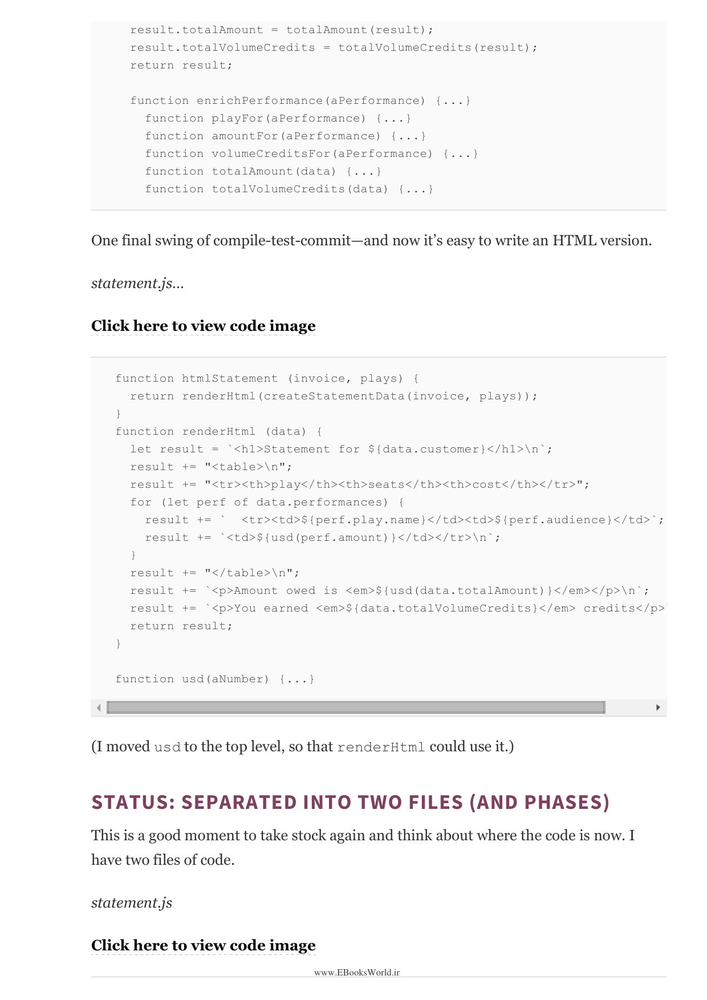

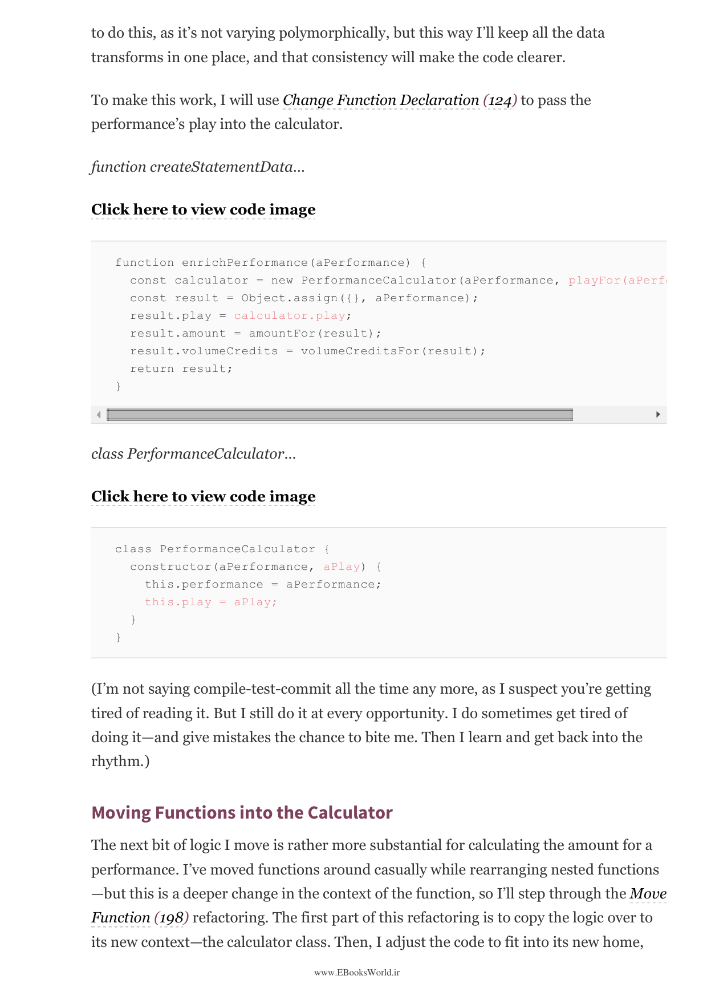

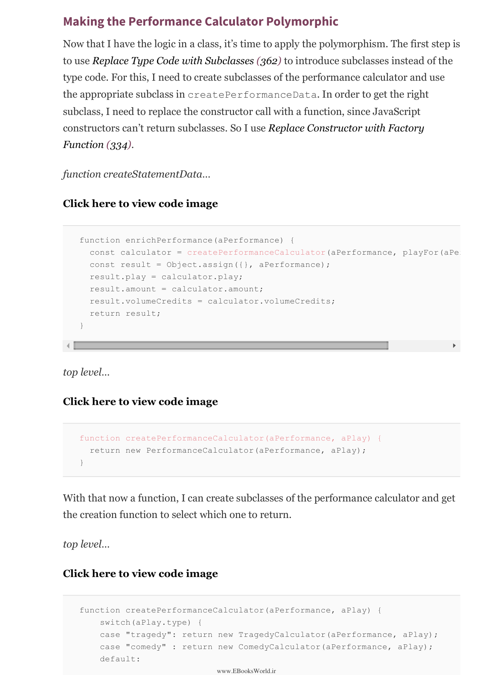

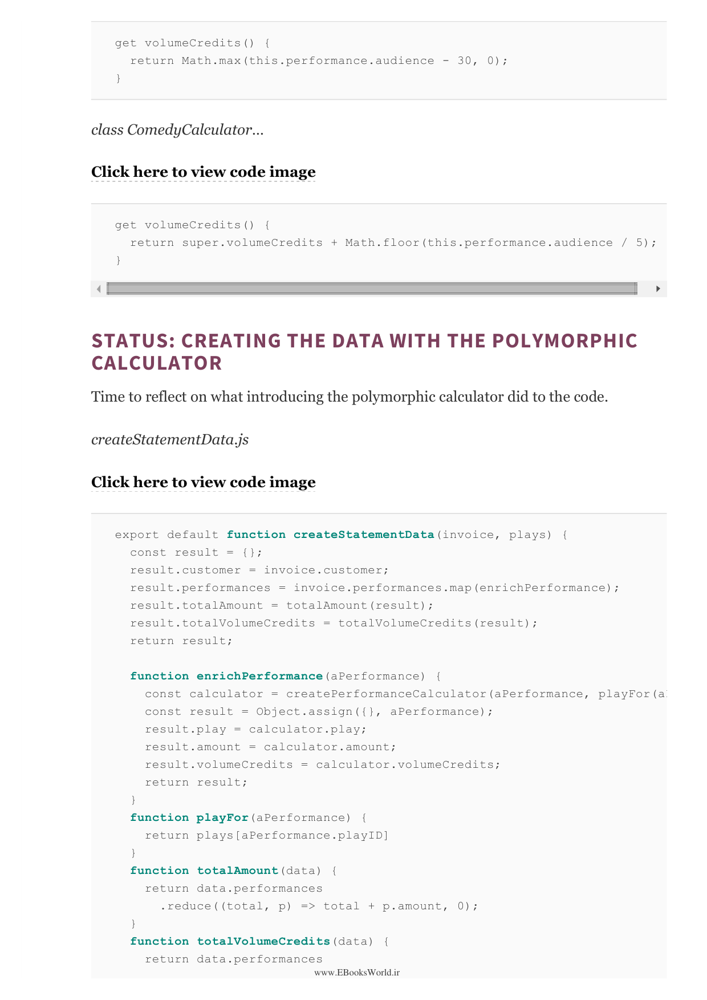

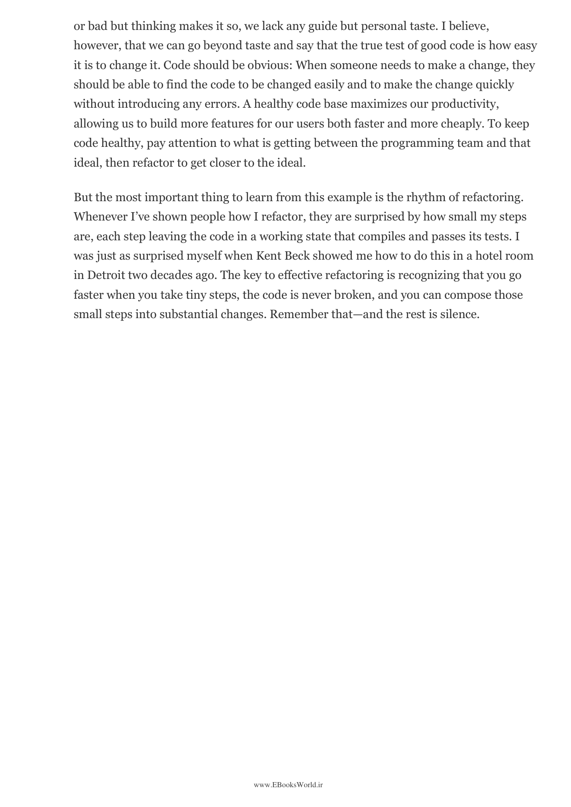

---

⏱️ زمان مطالعه تقریبی: ۲۵ دقیقه

> Refactoring is the process of changing a software system in such a way that it does not alter the external behavior of the code yet improves its internal structure. It is a disciplined way to clean up code that minimizes the chances of introducing bugs. When you refactor software, you generally improve the design of existing code, make it easier to understand, and make it easier to maintain.

بازآفرینی فرآیند تغییر یک سیستم نرم‌افزاری به‌گونه‌ای است که رفتار بیرونی کد را تغییر ندهد اما ساختار درونی آن را بهبود بخشد. این یک روش منضبط برای پاکسازی کد است که احتمال معرفی باگ را به حداقل می‌رساند. هنگامی که نرم‌افزار را بازآفرینی می‌کنید، به‌طور کلی طراحی کد موجود را بهبود می‌بخشید، درک آن را آسان‌تر می‌کنید و نگهداری آن را ساده‌تر می‌سازید.

## چرا بازآفرینی می‌کنیم؟

> There are two additional reasons to refactor: understanding the software and preparing for a feature. The first reason, understanding, comes up whenever I need to change code. I find it hard to make changes to code that I don't understand well. With refactoring, I can improve my understanding of the code. It's a way of saying "I don't understand what's happening here. What does this code do?" and then doing something about it.

دو دلیل اضافی برای بازآفرینی وجود دارد: درک نرم‌افزار و آماده‌سازی برای یک ویژگی. دلیل اول، درک، هر زمانی که نیاز به تغییر کد دارم مطرح می‌شود. درک کدی که به‌خوبی نمی‌فهمم برایم سخت است. با بازآفرینی می‌توانم درکم از کد را بهبود بخشم.

## زمان بازآفرینی

> Don't try to refactor and add functionality at the same time. Make sure you have tests in place before you begin refactoring. The refactoring may change the external behavior, which could break a test. Take short steps and test frequently. Any change that you make to the code is a refactoring. It's a refactoring because it's a small change to the code; it preserves the behavior of the code.

سعی نکنید همزمان بازآفرینی کنید و ویژگی اضافه کنید. مطمئن شوید قبل از شروع بازآفرینی آزمایش‌هایی در جا دارید. بازآفرینی ممکن است رفتار بیرونی را تغییر دهد که می‌تواند یک آزمون را بشکند. گام‌های کوتاه بردارید و به‌طور مکرر آزمایش کنید.

## مشکلات کد بد

> I think of the following as the/7 signs that code needs refactoring:
> 1. Duplicated Code
> 2. Long Function
> 3. Large Class
> 4. Long Parameter List
> 5. Divergent Change
> 6. Shotgun Surgery
> 7. Feature Envy
> 8. Data Clumps
> 9. Primitive Obsession
> 10. Switch Statements
> 11. Parallel Inheritance Hierarchies
> 12. Lazy Class
> 13. Speculative Generality
> 14. Temporary Field
> 15. Message Chains
> 16. Middle Man
> 17. Insider Trading
> 18. Large Switch
> 19. Repetitive Associations

از نشانه‌های نیاز کد به بازآفرینی می‌توان به موارد زیر اشاره کرد: کد تکراری، تابع بلند، کلاس بزرگ، لیست پارامترهای بلند، تغییر واگرا، جراحی شاتگان، حسادت ویژگی، خوشه‌های داده، وسواس اولیه، عبارات سوئیچ، سلسله مراتب‌های وراثت موازی، کلاس تنبل، کلیت سودا، فیلد موقت، زنجیره‌های پیام، مرد میانی، تجارت داخلی، سوئیچ بزرگ و انجمن‌های تکراری.

## بازآفرینی و طراحی

> One of the most valuable things about refactoring is that it allows me to design less. I have always been a believer in design up front, and I still think that it's important to think through the design before you start building it. But design is never perfect. The best designs I know are those that evolve over time as the system is changed.

یکی از ارزشمندترین چیزها درباره بازآفرینی این است که به من اجازه می‌دهد کمتر طراحی کنم. طراحی هیچ‌وقت کامل نیست. بهترین طراحی‌هایی که می‌شناسم آن‌هایی هستند که در طول زمان همگام با تغییر سیستم تکامل می‌یابند.

---