# فصل ۱۱: بازآفرینی رابط برنامه‌نویسی

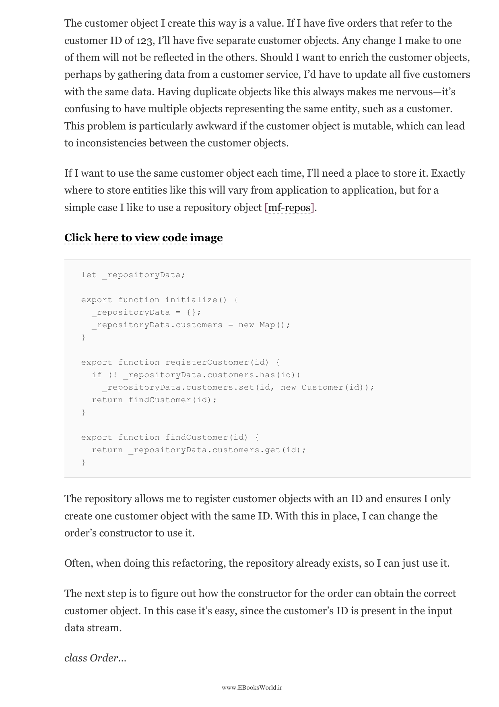

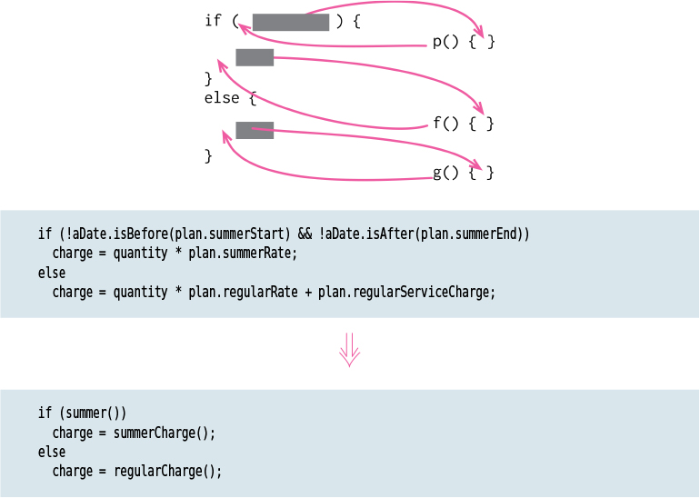

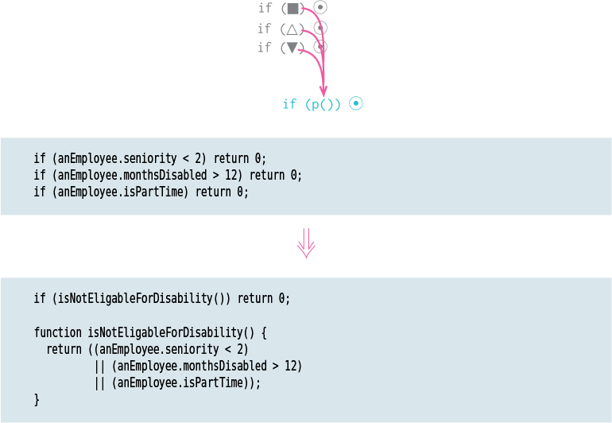

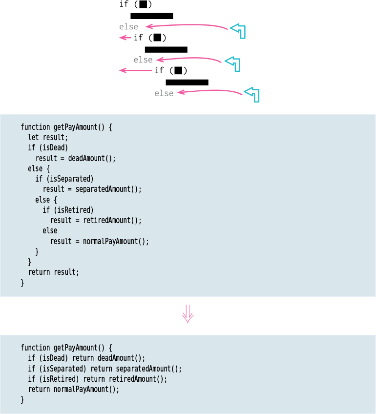

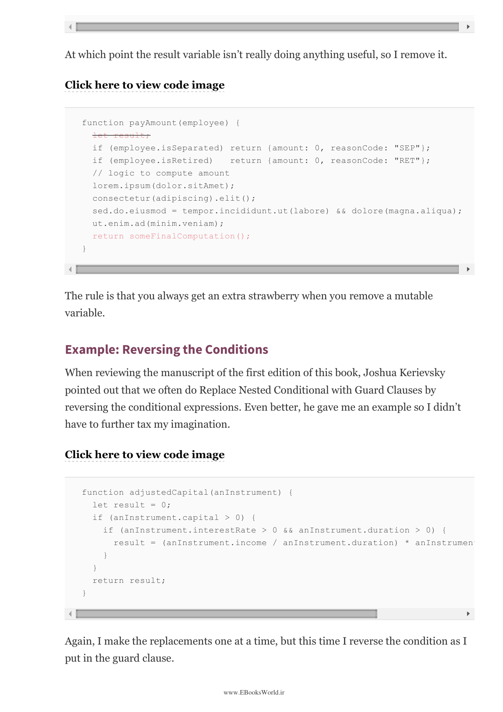

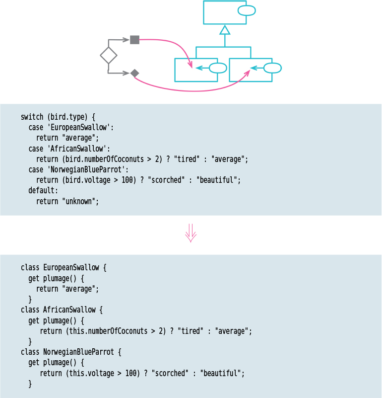

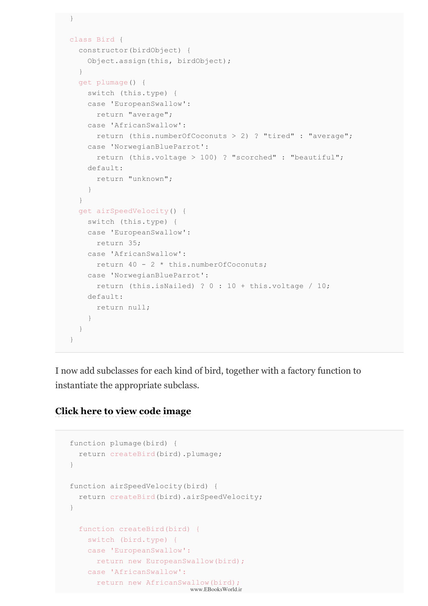

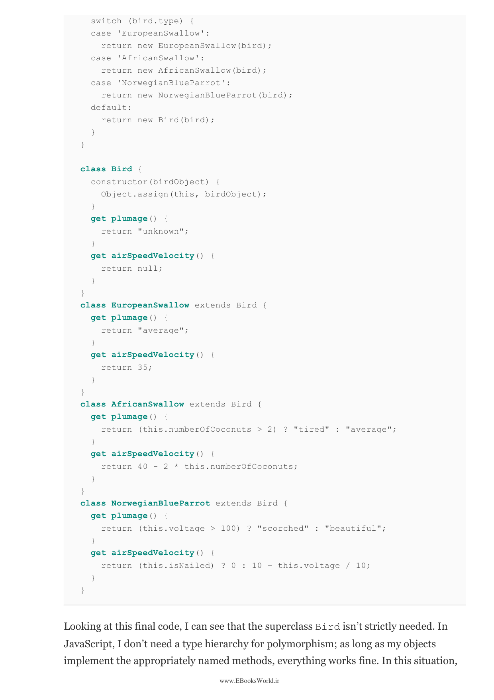

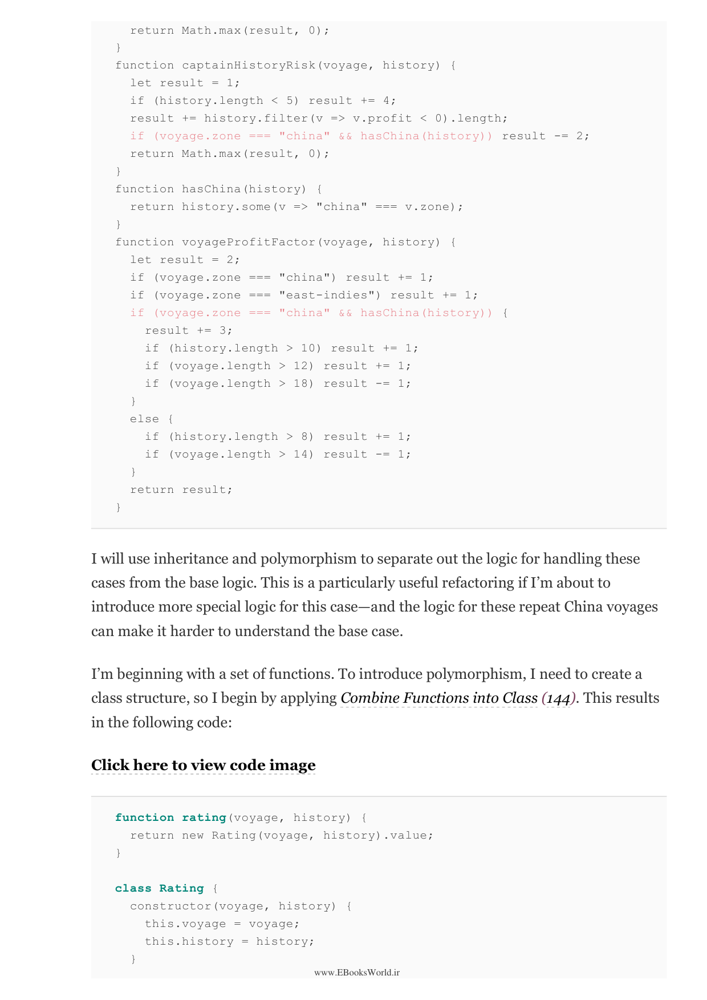

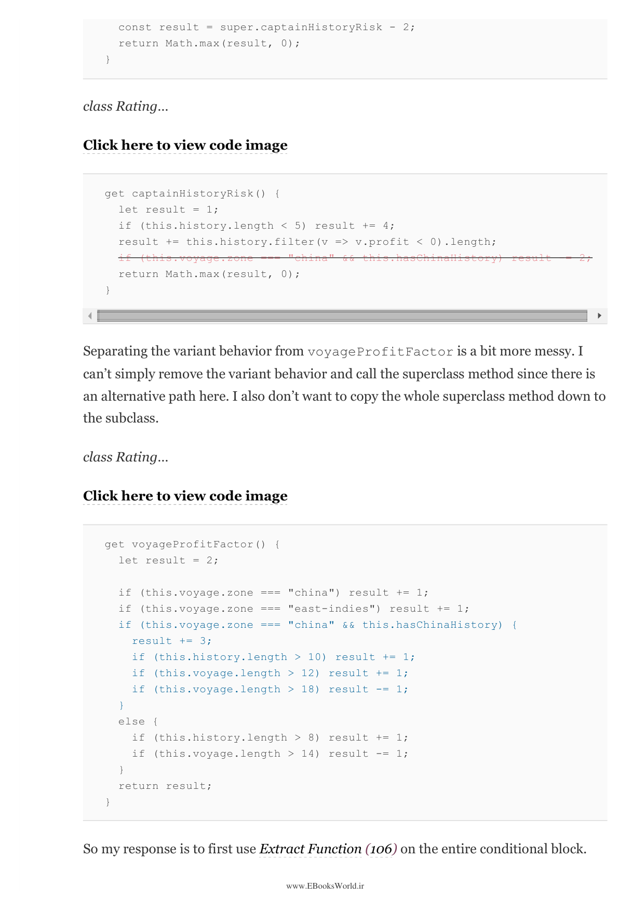

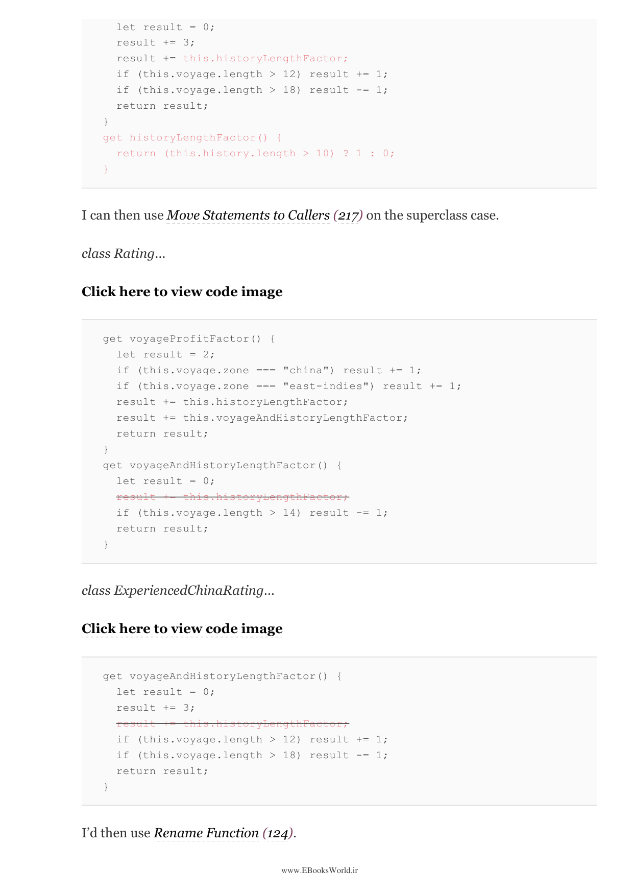

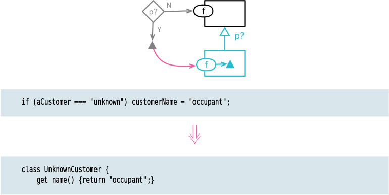

---

⏱️ زمان مطالعه تقریبی: ۵۰ دقیقه

> APIs are the hardest part of a library to change once it's in widespread use. This chapter covers techniques for working with APIs, making them easier to use and evolve. The key insight is that a well-designed API makes refactoring the implementation easier.

رابط‌های برنامه‌نویسی سخت‌ترین بخش یک کتابخانه برای تغییر پس از استفاده گسترده هستند.

---

### 32. جدا کردن جستجو از تغییردهنده — Separate Query from Modifier

> Separates a method that returns a value from one that has a side effect. A function should either answer a question or modify the state of the system—but not both. This is the Command-Query Separation principle. When I find a method that both returns a value and has a side effect, I split it into two methods.

متدی که مقداری برمی‌گرداند را از متدی که اثر جانبی دارد جدا می‌کند. تابع باید یا سؤالی پاسخ دهد یا وضعیت سیستم را تغییر دهد—نه هر دو.

---

### 33. پارامتری کردن تابع — Parameterize Function

> Takes a piece of code that does similar things in slightly different ways and adjusts it to take additional parameters that allow it to be used more widely. Instead of having several functions that differ only in their literal values, I create one function that takes those values as parameters.

یک قطعه کد که کارهای مشابهی را به شیوه‌های کمی متفاوت انجام می‌دهد برمی‌دارد و آن را طوری تنظیم می‌کند که پارامترهای اضافی بگیرد.

---

### 34. حذف پارامتر — Remove Parameter

> Removes a parameter from a function. If a function's parameter is no longer used, I remove it. This simplifies the function's interface. It's a simple refactoring, but I need to make sure no callers are passing that parameter anymore.

یک پارامتر را از تابع حذف می‌کند.

---

### 35. حفظ کل شیء — Preserve Whole Object

> Takes a value from an object and passes it as a parameter instead. This is the inverse of Replace Parameter with Query. Instead of extracting a value from an object to pass to a function, I pass the whole object. This reduces the number of parameters and makes the code more robust to changes.

مقداری را از یک شیء برمی‌دارد و آن را به‌جای آن به‌عنوان پارامتر پاس می‌دهد.

---

### 36. جایگزینی پارامتر با پرس و جو — Replace Parameter with Query

> Replaces a parameter with a query that gets the value. If a function always uses the same value for one of its parameters, I can remove the parameter and call the function that provides that value instead. This simplifies the caller's job.

یک پارامتر را با پرس و جویی که مقدار را دریافت می‌کند جایگزین می‌کند.

---

### 37. جایگزینی پارامتر با مقادیر صریح — Replace Parameter with Explicit Values

> Replaces a parameter with an explicit value. If a function always gets the same value for one of its parameters, I replace the parameter with that value. This makes the call clearer. This is the opposite of Parameterize Function.

یک پارامتر را با مقدار صریح جایگزین می‌کند.

---

### 38. حذف متد تنظیم — Remove Setting Method

> Removes a setting method that shouldn't exist. If a field shouldn't be changed after an object is created, I remove the setter method. For fields that need to be set during construction, I move them to the constructor. This makes the intent clearer—the field is immutable after creation.

متد تنظیمی را حذف می‌کند که نباید وجود داشته باشد. اگر فیلدی نباید پس از ایجاد شیء تغییر کند، متد setter را حذف می‌کنم.

---

### 39. جایگزینی سازنده با تابع کارخانه‌ای — Replace Constructor with Factory Function

> Replaces a constructor call with a factory function. Factory functions are more flexible than constructors—they can return different subtypes, use descriptive names, and don't require the "new" keyword. In JavaScript, factory functions are a common and idiomatic pattern.

فراخوانی سازنده را با تابع کارخانه‌ای جایگزین می‌کند. توابع کارخانه‌ای انعطاف‌پذیرتر از سازنده‌ها هستند—می‌توانند زیرنوع‌های مختلف برگردانند، نام‌های توصیفی استفاده کنند و به کلمه کلیدی "new" نیاز ندارند.

---

### 40. جایگزینی تابع با فرمان — Replace Function with Command

> Turns a function into its own command object. When a function is complex and I need to manipulate its parameters over time, build up its state, or support undo, I turn it into a command object. The command object has an execute method that does the same thing the function did.

تابع را به شیء فرمان خودش تبدیل می‌کند. وقتی تابع پیچیده است و باید پارامترهایش را در طول زمان دستکاری کنم.

---

### 41. جایگزینی فرمان با تابع — Replace Command with Function

> Replaces a command object with a function. This is the inverse of Replace Function with Command. If a command object is simple and I don't need its extra features (like undo, parameter building, etc.), I turn it back into a plain function.

شیء فرمان را با تابع جایگزین می‌کند. این معکوس جایگزینی تابع با فرمان است.

---