# فصل ۱۲: مقابله با وراثت

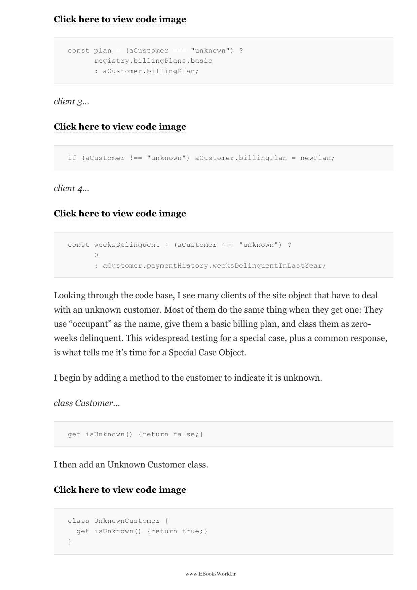

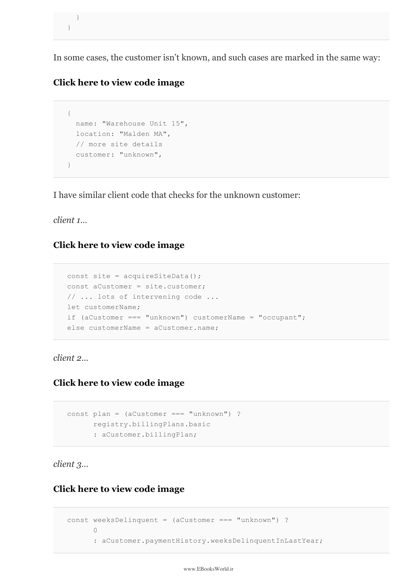

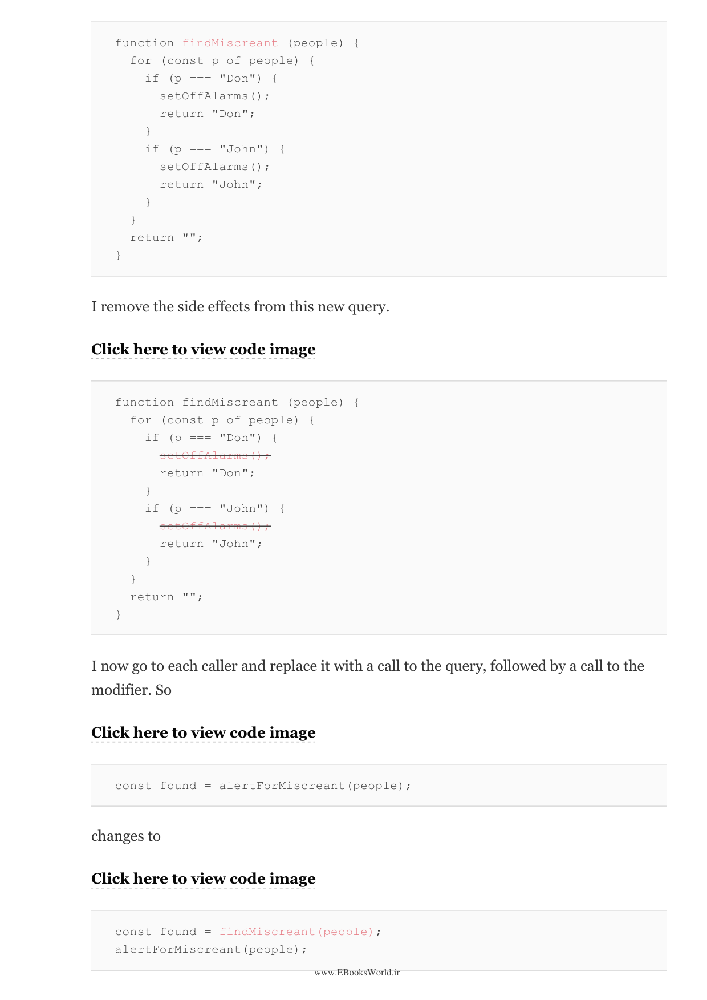

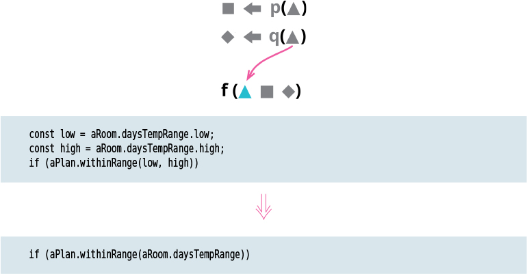

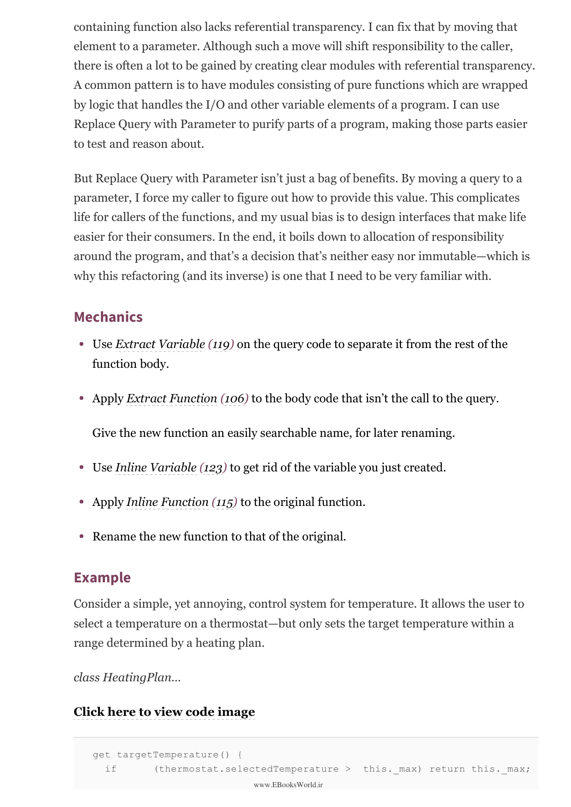

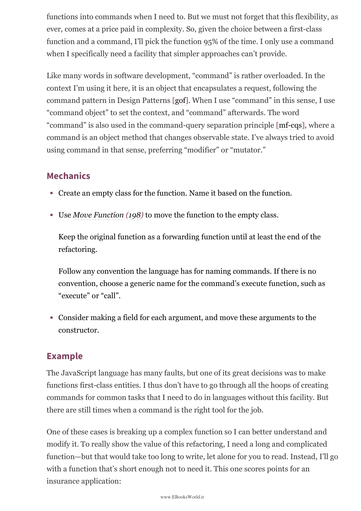

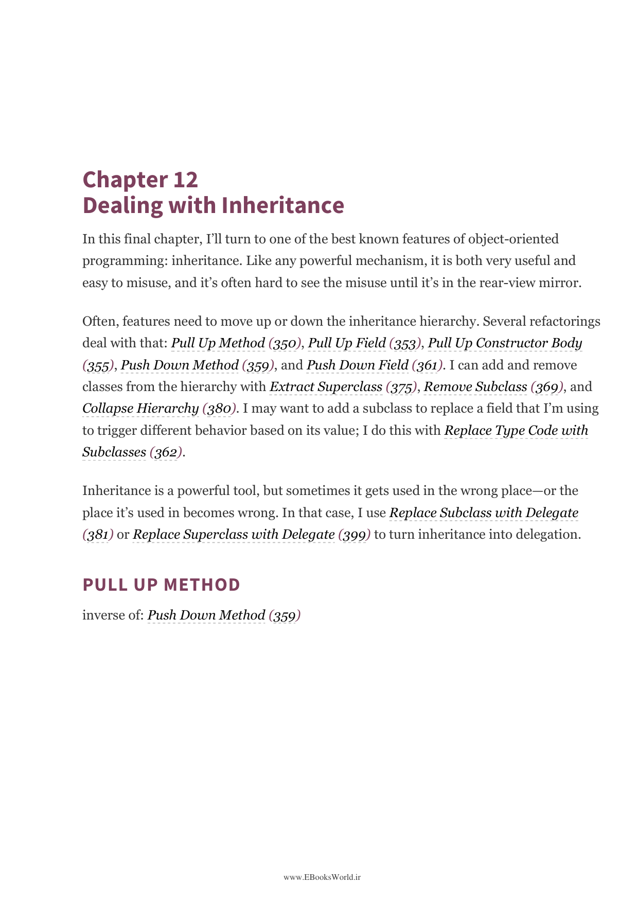

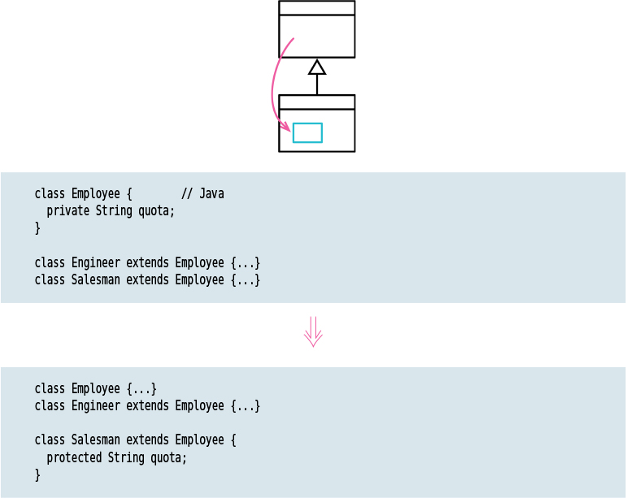

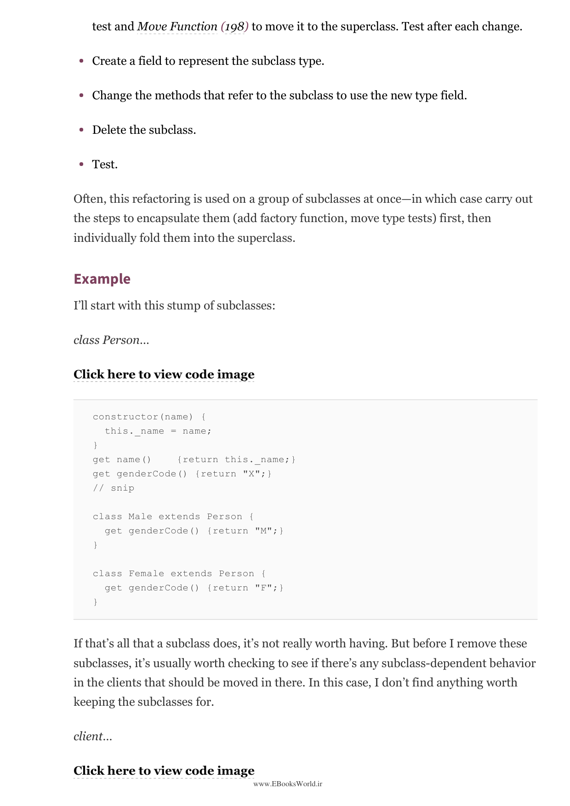

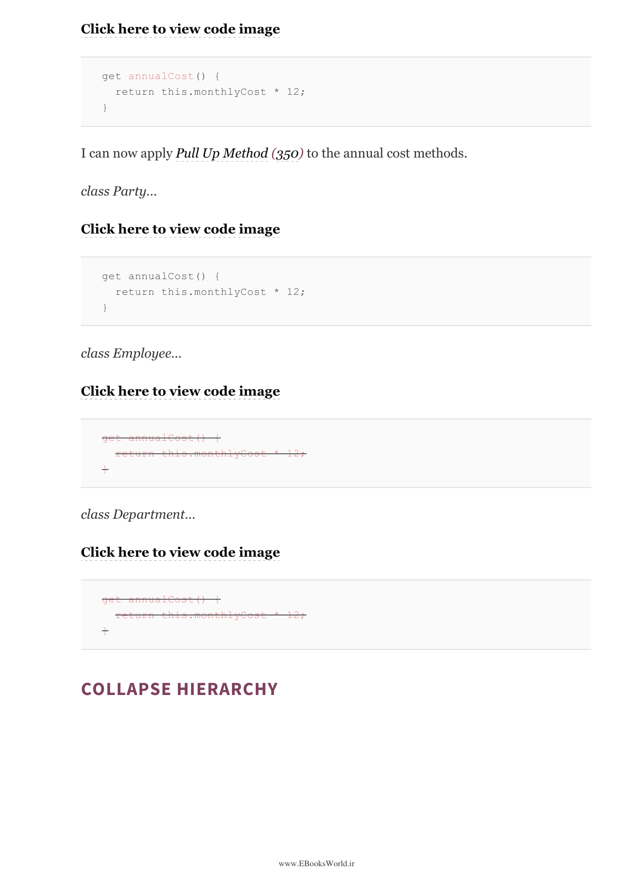

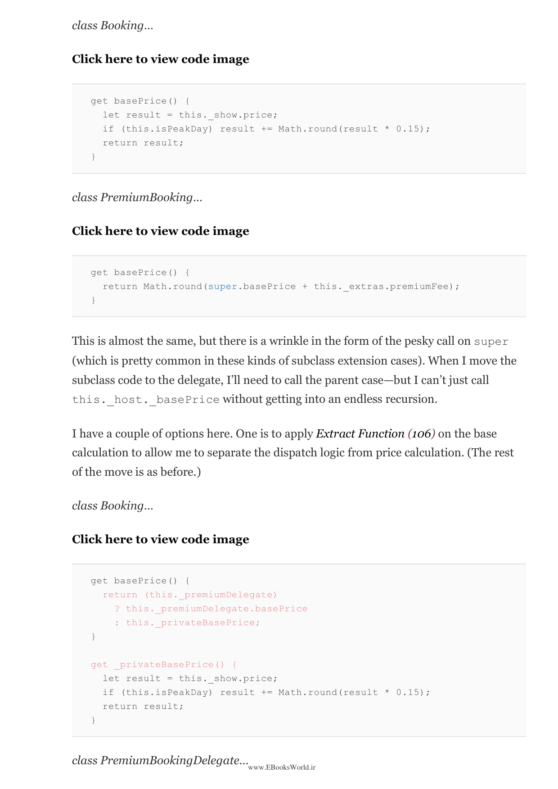

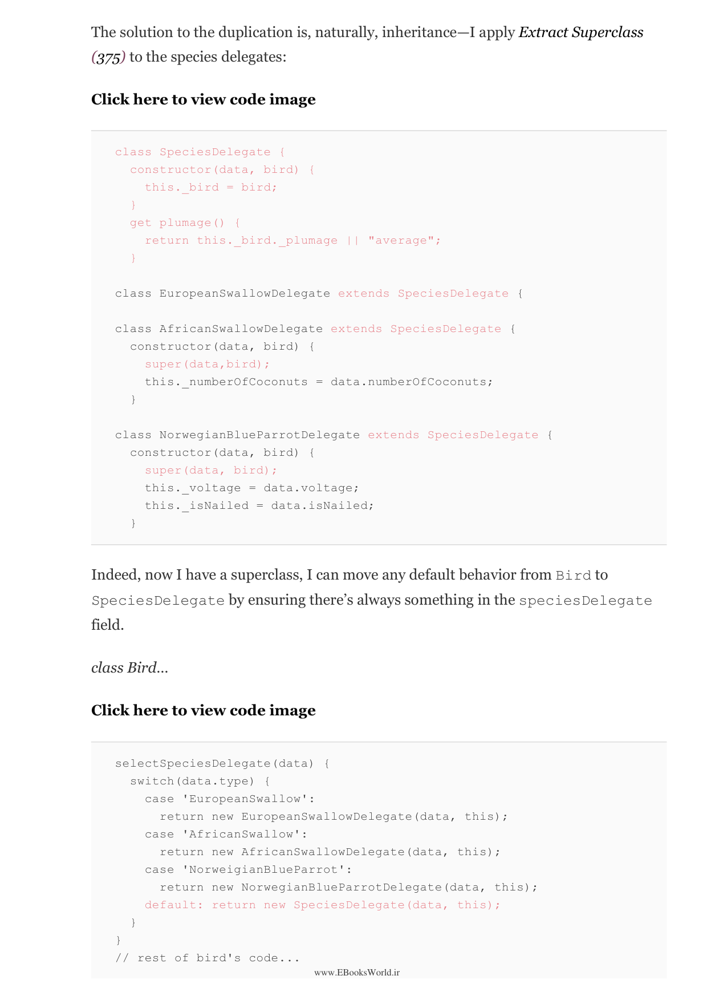

---

⏱️ زمان مطالعه تقریبی: ۶۰ دقیقه

> Inheritance is one of the most well-known features of object-oriented programming. Like any powerful mechanism, it is both very useful and easy to misuse. It's often hard to see the misuse until it's in the rear-view mirror. This chapter covers techniques for working with inheritance hierarchies—moving features up and down the hierarchy, adding and removing classes, and converting inheritance to delegation when it's no longer appropriate.

وراثت یکی از شناخته‌شده‌ترین ویژگی‌های برنامه‌نویسی شیءگرا است. مانند هر مکانیزم قدرتمندی، هم بسیار مفید و هم مستعد سوءاستفاده است.

---

### 42. کشیدن متد به بالا — Pull Up Method

> Moves a method from a subclass into its superclass. This is one of the most common inheritance-related refactorings. When two subclasses have duplicate methods, I move one into the superclass. The key is to ensure that both methods do the same thing before pulling one up. If they differ slightly, I first use Parameterize Function to unify them.

متدی را از یک زیرکلاس به کلاس والد آن منتقل می‌کند. این یکی از رایج‌ترین بازآفرینی‌های مرتبط با وراثت است. وقتی دو زیرکلاس متدهای تکراری دارند، یکی را به کلاس والد منتقل می‌کنم.

---

### 43. کشیدن فیلد به بالا — Pull Up Field

> Moves a field from a subclass to its superclass. When two subclasses have fields with the same meaning (even if named differently), I move one to the superclass. This reduces duplication in the data structure. In dynamic languages, pulling up a field is essentially a consequence of Pull Up Constructor Body.

فیلدی را از زیرکلاس به کلاس والد منتقل می‌کند. وقتی دو زیرکلاس فیلدهایی با معنای یکسان دارند.

---

### 44. کشیدن بدنه سازنده به بالا — Pull Up Constructor Body

> Moves common statements in subclass constructors to the superclass constructor. If I see duplicate code in constructor bodies of subclasses, I extract the common code and put it in the superclass constructor using a super() call.

دستورات مشترک در سازنده‌های زیرکلاس‌ها را به سازنده کلاس والد منتقل می‌کند.

---

### 45. هل دادن متد به پایین — Push Down Method

> Moves a method from a superclass into its subclass. If a method is only relevant to one subclass, it should live in that subclass. This is the inverse of Pull Up Method. This refactoring makes it clear that the method is specialized for a particular subclass.

متدی را از کلاس والد به زیرکلاس آن منتقل می‌کند. اگر متد فقط برای یک زیرکلاس مرتبط است، باید در آن زیرکلاس باشد.

---

### 46. هل دادن فیلد به پایین — Push Down Field

> Moves a field from a superclass to its subclass. If a field is only used by one subclass, it should live in that subclass. This is the inverse of Pull Up Field.

فیلدی را از کلاس والد به زیرکلاس آن منتقل می‌کند.

---

### 47. جایگزینی کد نوع با زیرکلاس‌ها — Replace Type Code with Subclasses

> Replaces a type code field with subclasses. Instead of using a field to indicate the type of an object, I create a subclass for each type. Each subclass overrides behavior that differs by type. I use a factory function to decide which subclass to create based on the type code.

یک فیلد کد نوع را با زیرکلاس‌ها جایگزین می‌کند. به جای استفاده از فیلد برای نشان دادن نوع یک شیء، برای هر نوع زیرکلاسی ایجاد می‌کنم.

---

### 48. حذف زیرکلاس — Remove Subclass

> Replaces a subclass with a field in the superclass. Sometimes subclasses become too small and aren't worth the complexity they add. When a subclass doesn't add enough behavior to justify its existence, I remove it and represent the variation with a field instead.

زیرکلاس را با فیلدی در کلاس والد جایگزین می‌کند. گاهی زیرکلاس‌ها خیلی کوچک می‌شوند و ارزش پیچیدگی‌ای که اضافه می‌کنند را ندارند.

---

### 49. استخراج کلاس والد — Extract Superclass

> Creates a superclass from two classes with similar features. When two classes have common fields and methods, I create a superclass and move the common elements to it using Pull Up Field and Pull Up Method. This is the inheritance alternative to Extract Class.

کلاس والدی را از دو کلاس با ویژگی‌های مشابه ایجاد می‌کند. وقتی دو کلاس فیلدها و متدهای مشترک دارند.

---

### 50. فروپاشی سلسله مراتب — Collapse Hierarchy

> Merges a superclass and one of its subclasses into a single class. When a class and its parent are no longer different enough to be worth keeping separate, I merge them together. I choose which one to keep based on which name makes the most sense for the future.

کلاس والد و یکی از زیرکلاس‌هایش را در یک کلاس واحد ادغام می‌کند.

---

### 51. جایگزینی زیرکلاس با نماینده — Replace Subclass with Delegate

> Replaces inheritance with delegation. This is used when a subclass is used for more than just polymorphic behavior—when I want to change the type at runtime, or when I have more than one reason to vary the behavior. Instead of inheritance, I create a delegate class and have the superclass delegate to it.

وراثت را با نمایندگی جایگزین می‌کند. این زمانی استفاده می‌شود که زیرکلاس بیش از رفتار پلیمورفیک استفاده می‌شود—وقتی می‌خواهم نوع را در زمان اجرا تغییر دهم یا بیش از یک دلیل برای تغییر رفتار دارم.

> There is a popular principle: "Favor object composition over class inheritance." This doesn't mean we should never use inheritance. Inheritance is a valuable mechanism that does the job most of the time. So I reach for it first, and move onto delegation when it starts to become a problem.

اصول محبوبی وجود دارد: «ترجیح ترکیب اشیاء بر وراثت کلاس‌ها». این به این معنی نیست که هرگز نباید از وراثت استفاده کنیم. وراثت مکانیزم ارزشمندی است که بیشتر اوقات کار می‌کند.

---

### 52. جایگزینی کلاس والد با نماینده — Replace Superclass with Delegate

> Replaces inheritance with delegation to a separate object. This is used when the superclass functions don't make sense on the subclass, or when the subclass should not be an instance of the superclass in all cases. For example, making a stack a subclass of list is wrong because not all list operations apply to a stack.

وراثت را با نمایندگی به یک شیء جداگانه جایگزین می‌کند. این زمانی استفاده می‌شود که توابع کلاس والد در زیرکلاس معنا ندارند.

> Even in cases where the subclass is a reasonable modeling, I use Replace Superclass with Delegate because the relationship between a subclass and a superclass is highly coupled, with the subclass easily broken by changes in the superclass. The downside is that I need to write forwarding functions, but fortunately, these are too simple to get wrong.

حتی در مواردی که زیرکلاس مدل‌سازی معقولی است، از جایگزینی کلاس والد با نماینده استفاده می‌کنم زیرا رابطه بین زیرکلاس و کلاس والد بسیار محکم است و زیرکلاس به‌راحتی با تغییرات کلاس والد شکسته می‌شود.

---

# خلاصه فصل ۱۲

وراثت ابزار قدرتمندی است اما باید با احتیاط استفاده شود. کشیدن به بالا و هل دادن به پایین به شما امکان می‌دهند ویژگی‌ها را در سلسله مراتب حرکت دهید. استخراج کلاس والد و فروپاشی سلسله مراتب به شما امکان ساختاربندی مجدد سلسله مراتب را می‌دهند. و جایگزینی با نماینده وقتی استفاده می‌شود که وراثت دیگر بهترین انتخاب نباشد.

---

# پایان کتاب

> This book has covered the major refactorings I've found useful over the years, with examples in JavaScript. The catalog is meant to be used as a reference—each entry describes a specific refactoring with its motivation, mechanics, and examples. When you encounter code smells in your work, refer to the catalog for guidance on how to refactor.

این کتاب بازآفرینی‌های اصلی‌ای را که در طول سال‌ها مفید یافته‌ام، با مثال‌هایی در جاوااسکریپت، پوشش داده است. کاتالوگ به‌عنوان مرجع طراحی شده—هر مدخل یک بازآفرینی خاص را با انگیزه، مکانیک‌ها و مثال‌هایش توصیف می‌کند.

---

*ترجمه کتاب بازآفرینی کد — مارتین فاولر (ویرایش دوم)*  
*تمامی مثال‌های کد به زبان اصلی (جاوااسکریپت) حفظ شده‌اند.*