# فصل ۳: فرهنگ بازآفرینی

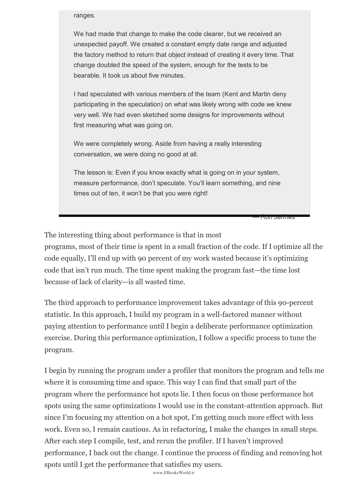

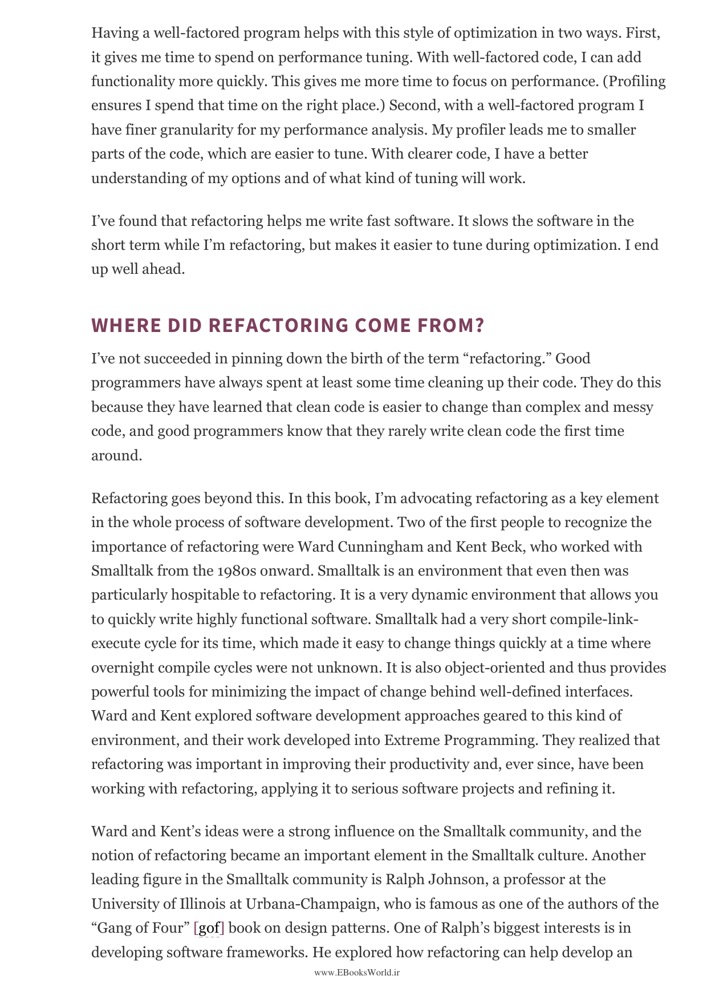

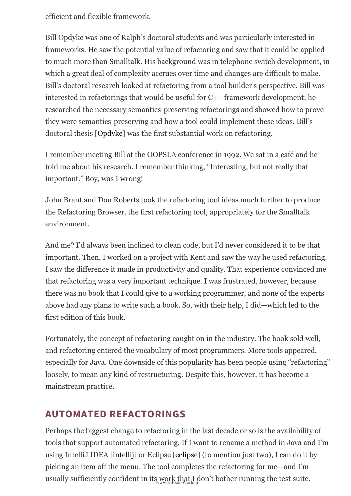

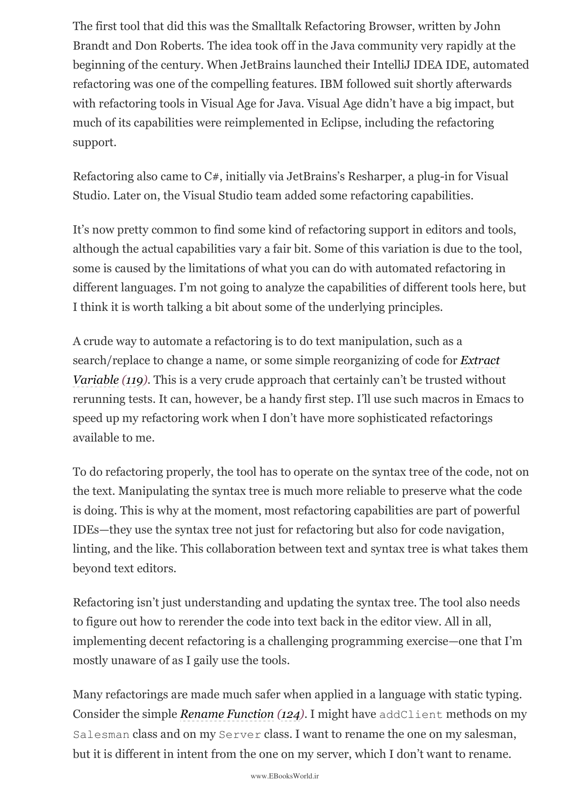

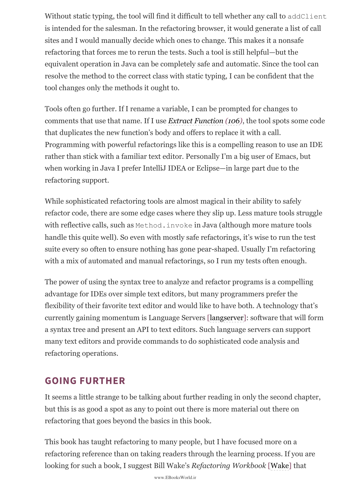

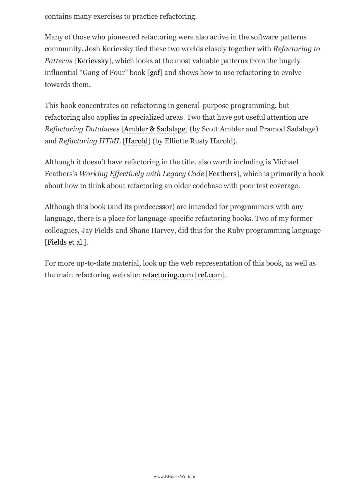

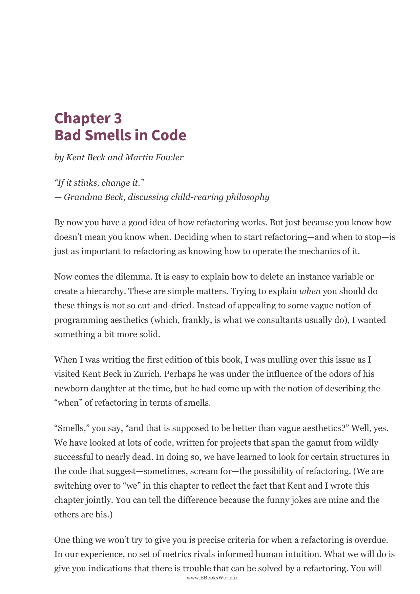

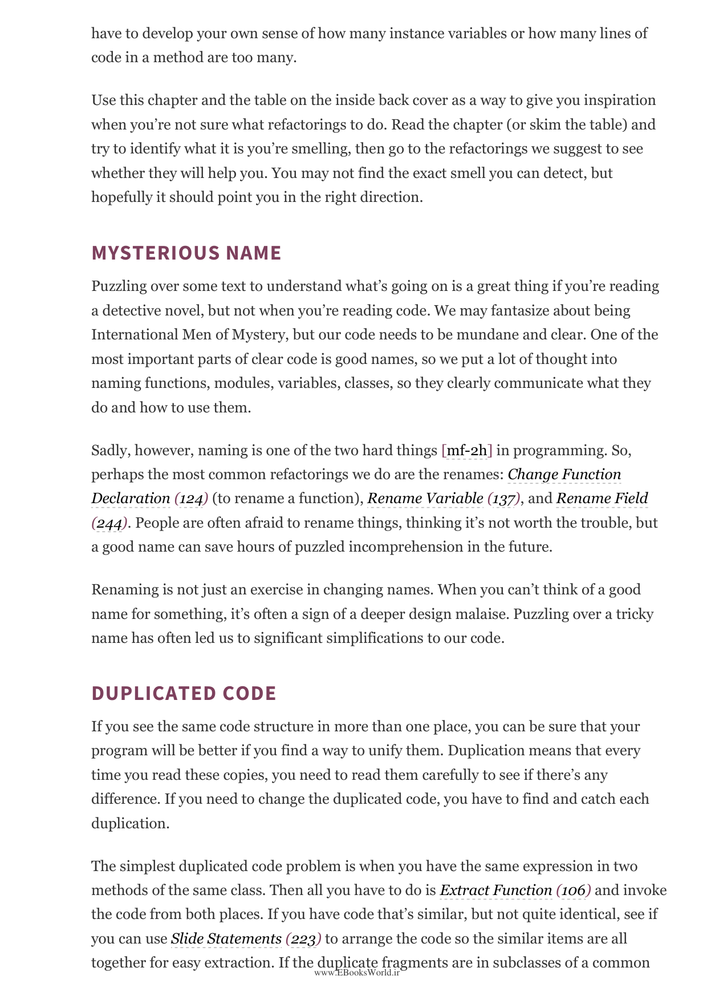

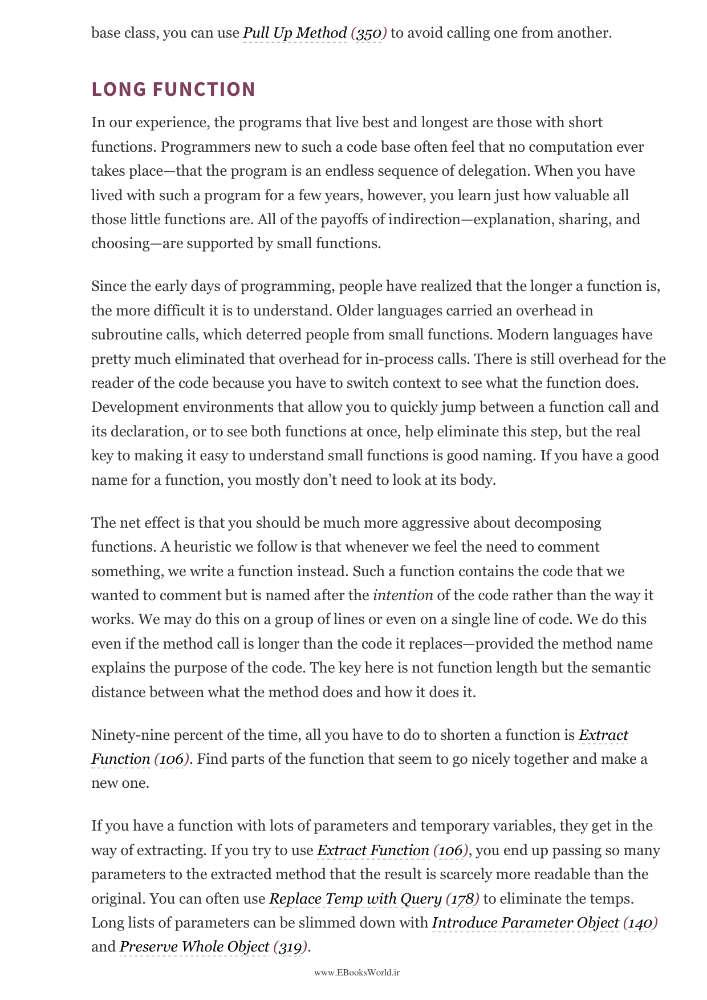

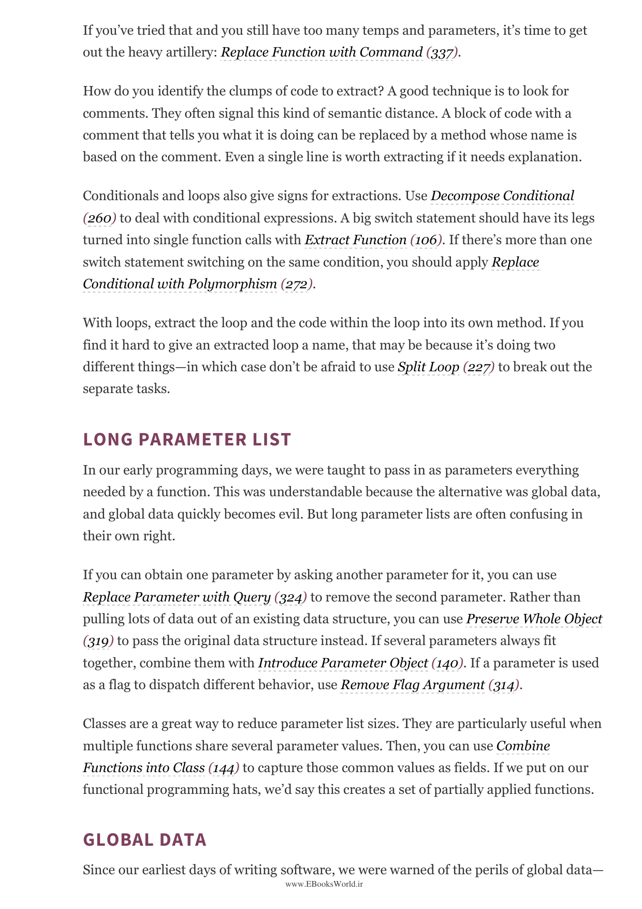

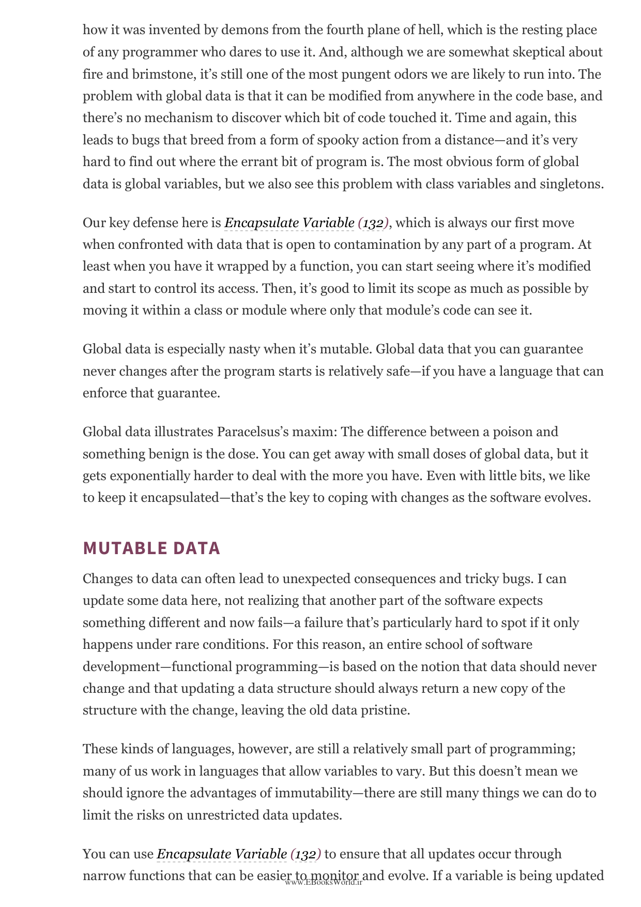

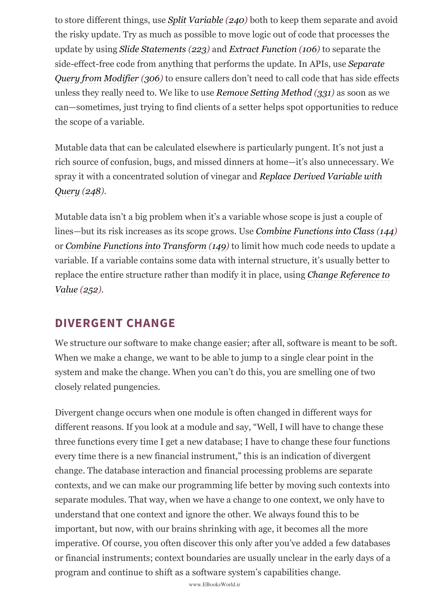

---

⏱️ زمان مطالعه تقریبی: ۲۰ دقیقه

> Refactoring is a powerful tool, but like all tools, it's not a silver bullet. To use it effectively, you need to develop a good sense of how to do it, and to build a culture where refactoring is part of everyday development. The best way to learn refactoring is to have someone experienced guide you through it.

بازآفرینی ابزار قدرتمندی است، اما مانند تمام ابزارها، یک گلوله نقره‌ای نیست. برای استفاده مؤثر از آن، باید حس خوبی از نحوه انجام آن پرورش دهید و فرهنگی بسازید که بازآفرینی بخشی از توسعه روزمره باشد.

## تعداد بازآفرینی‌های اضافه‌شده

> Some refactorings in this book are expanded in coverage from the first edition, and I've added several new ones. Not all of these are major refactorings. Some are simple helper techniques that I've found useful. The catalog is intended to be used as a reference; you don't need to read it from cover to cover.

برخی از بازآفرینی‌های این کتاب نسبت به ویرایش اول گسترش یافته‌اند و چندین مورد جدید اضافه کرده‌ام. کاتالوگ به‌عنوان مرجع در نظر گرفته شده است؛ لازم نیست آن را از اول تا آخر بخوانید.

## قوانین بازآفرینی

> The Rule of Refactoring: When you do refactoring, you should always have a refactoring to do. The first is that the process of refactoring is closely tied to testing. A refactoring change is a very small one; you should test after every such change. If I'm working on a large refactoring and realize I need to make a small change that's not a refactoring, I make that small change, test, then continue with the refactoring.

قانون بازآفرینی: وقتی بازآفرینی می‌کنید، همیشه باید بازآفرینی‌ای برای انجام داشته باشید. فرآیند بازآفرینی با آزمایش کردن پیوند تنگاتنگی دارد. هر تغییر بازآفرینی بسیار کوچک است و باید بعد از هر تغییر آزمایش کنید.

## ارتباط با کلیات (High Level)

> One way I think about refactoring is that it's like work you do on the foundation of a house. You don't change the visible appearance (the facade), but you strengthen the foundation so that you can add new rooms more easily. When you have a strong foundation, you can extend the house in many directions.

یکی از راه‌های فکر کردن درباره بازآفرینی این است که مانند کاری است که روی فونداسیون خانه انجام می‌دهید. ظاهر قابل مشاهده (نمای بیرونی) را تغییر نمی‌دهید، اما فونداسیون را تقویت می‌کنید تا بتوانید اتاق‌های جدید را راحت‌تر اضافه کنید.

---