# فصل ۴: شروع کار

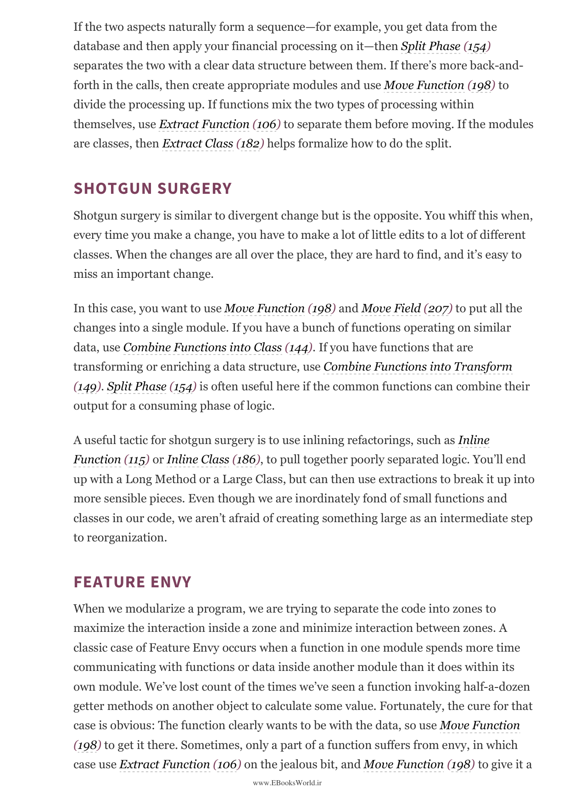

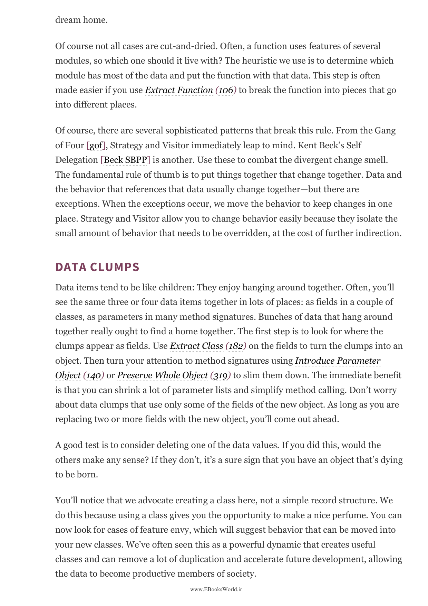

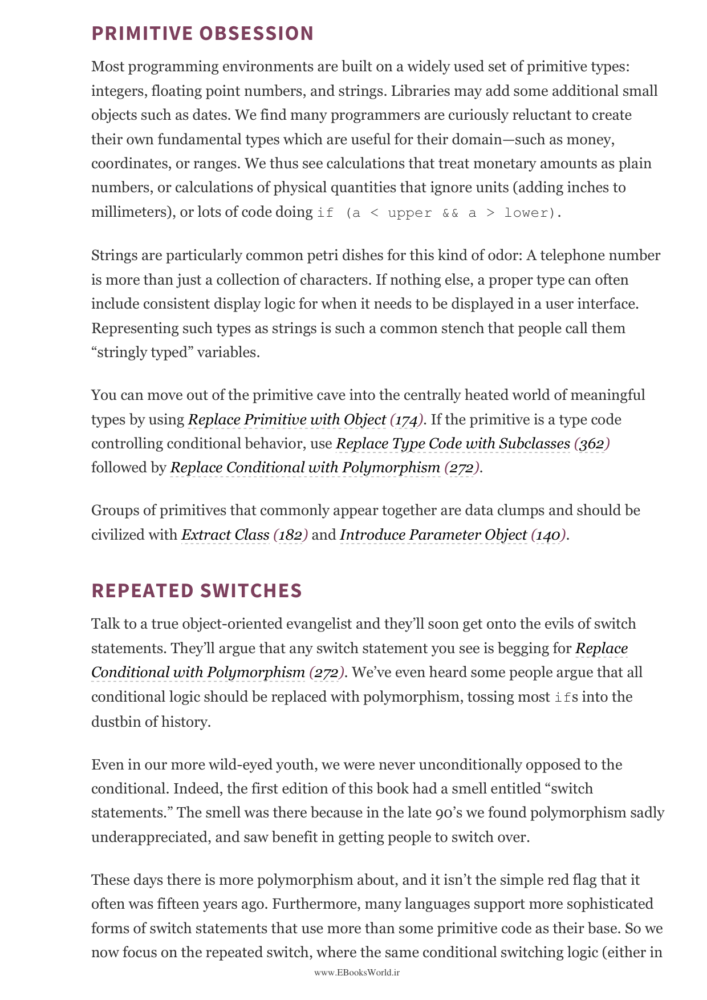

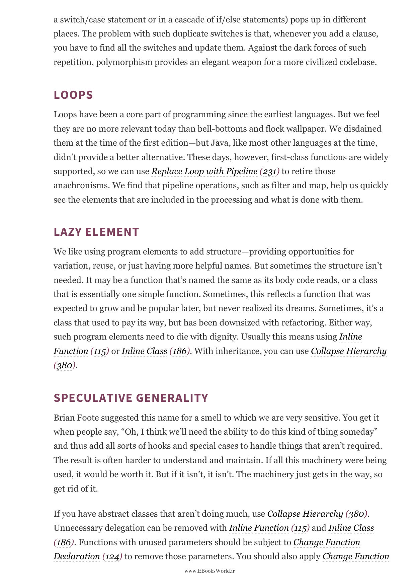

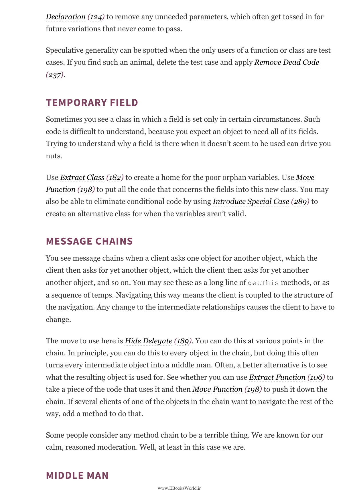

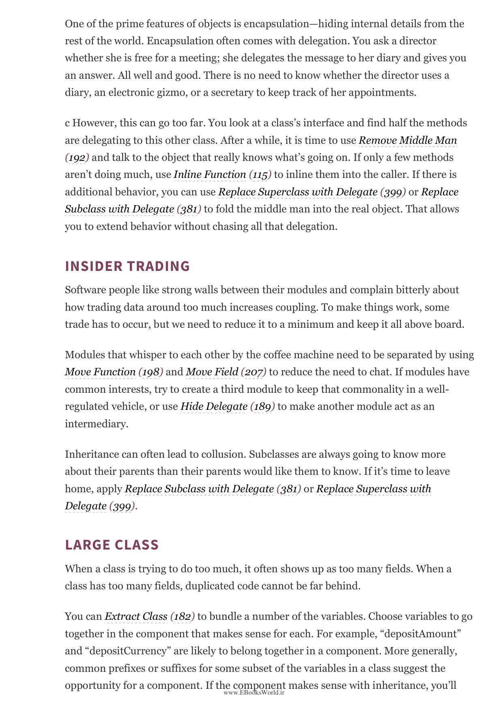

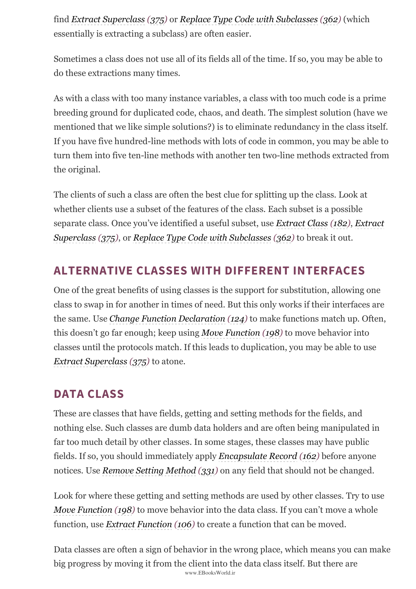

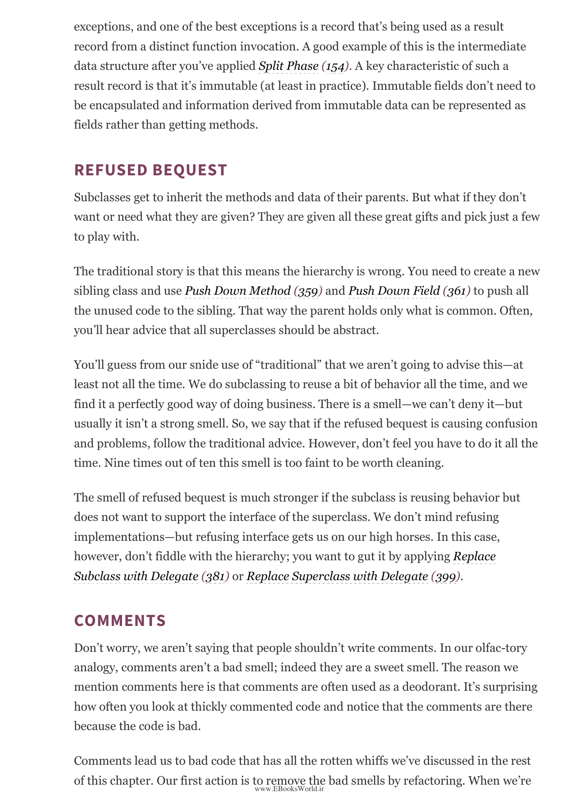

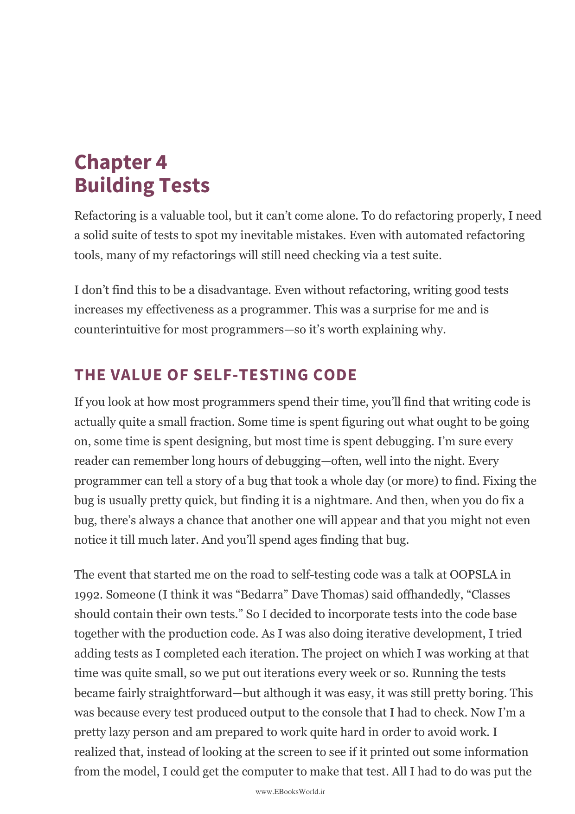

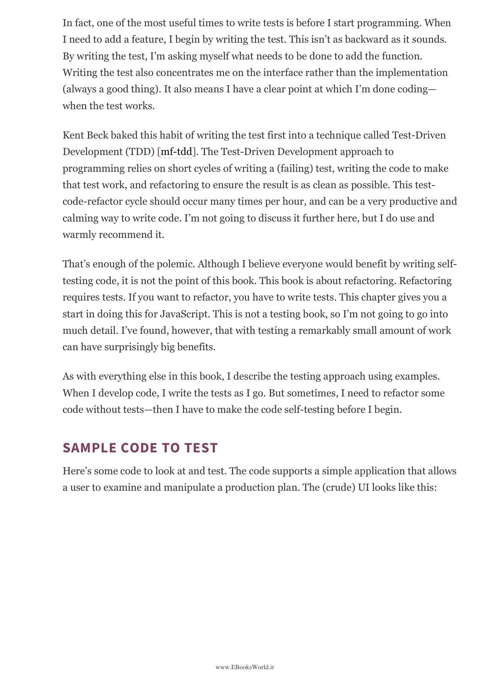

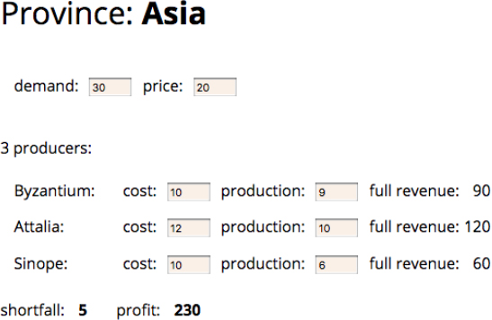

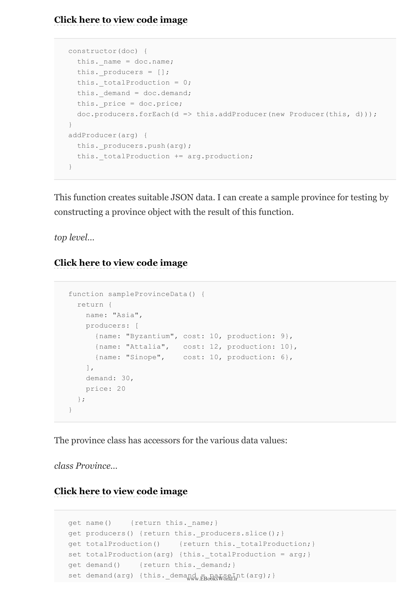

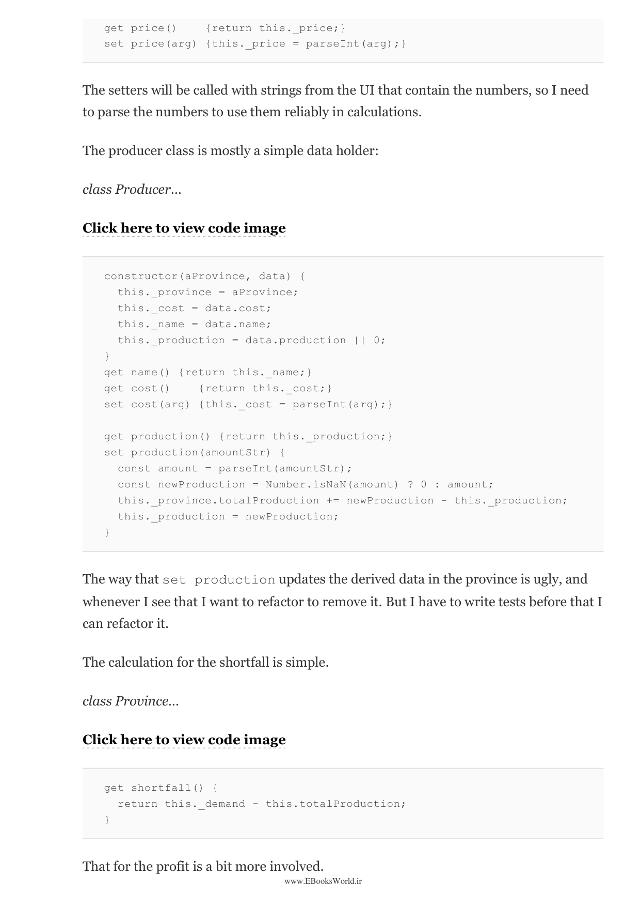

---

⏱️ زمان مطالعه تقریبی: ۱۵ دقیقه

> To start refactoring, you have to do it from a base of understanding. The first step is to look at the code and understand what it does. You need a test suite that checks the code's behavior. Once you have that understanding, you can start to make small, behavior-preserving changes to the code.

برای شروع بازآفرینی، باید از پایه درک شروع کنید. اولین قدم نگاه کردن به کد و فهمیدن این است که چه کار می‌کند. به مجموعه آزمایش‌هایی نیاز دارید که رفتار کد را بررسی کند.

## آزمون‌ها

> If I want to refactor carefully, I must have a suite of tests that I can run quickly and verify that my refactoring has not broken anything. It's important that these tests are self-checking. A test suite is the best safety net when refactoring; without tests, refactoring is a slow and risky process.

اگر می‌خواهم با دقت بازآفرینی کنم، باید مجموعه آزمایش‌هایی داشته باشم که بتوانم به‌سرعت اجرا کنم و بررسی کنم که بازآفرینی‌ام چیزی را نشکسته است. بدون آزمایش‌ها، بازآفرینی فرآیندی کند و پرخطر است.

## یافتن نقطه شروع

> When you're looking to refactor, you're usually looking at a large piece of code. You don't want to try to refactor the entire program at once. Instead, find a small part that you can refactor in isolation. Start with a function that's hard to understand, or a class that's doing too much.

وقتی دنبال بازآفرینی می‌گردید، معمولاً به یک قطعه کد بزرگ نگاه می‌کنید. نمی‌خواهید کل برنامه را یکجا بازآفرینی کنید. در عوض، بخش کوچکی پیدا کنید که بتوانید آن را به‌صورت جداگانه بازآفرینی کنید.

---