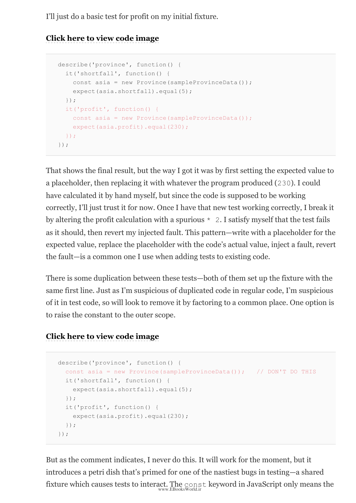

# فصل ۵: هوشمندتر عمل کردن

---

⏱️ زمان مطالعه تقریبی: ۳۰ دقیقه

> Once you've learned the basic refactorings, you'll want to move beyond the individual refactoring techniques. This chapter provides guidance on how to combine refactorings to accomplish more complex changes. The key is to work in small steps, using refactoring techniques to build up to the larger change you want to make.

وقتی بازآفرینی‌های پایه‌ای را یاد گرفتید، می‌خواهید فراتر از تکنیک‌های فردی بازآفرینی حرکت کنید. این فصل راهنمایی درباره نحوه ترکیب بازآفرینی‌ها برای انجام تغییرات پیچیده‌تر ارائه می‌دهد.

## ترکیب بازآفرینی‌ها

> To do refactoring well, you need to build up a habit of combining small refactorings into larger ones. Each individual refactoring is a small step, but they add up to significant improvements in the design of your code.

برای بازآفرینی خوب، باید عادت ترکیب بازآفرینی‌های کوچک به بازآفرینی‌های بزرگ‌تر را پرورش دهید. هر بازآفرینی فردی یک قدم کوچک است، اما مجموع آن‌ها به بهبودهای قابل‌توجهی در طراحی کد شما منجر می‌شود.

## ریشه‌یابی مشکلات

> Often when I see code that needs refactoring, I start with a surface problem (the code is hard to understand) and then find that the real issue is deeper (the abstraction is wrong). As I refactor, I fix surface issues first, which reveals deeper problems that I can then address.

اغلب وقتی کدی می‌بینم که به بازآفرینی نیاز دارد، با یک مشکل سطحی شروع می‌کنم (کد سخت قابل فهم است) و سپس متوجه می‌شوم مشکل واقعی عمیق‌تر است (ابعاد اشتباه است).

---