# فصل ۹: سازمان‌دهی داده‌ها

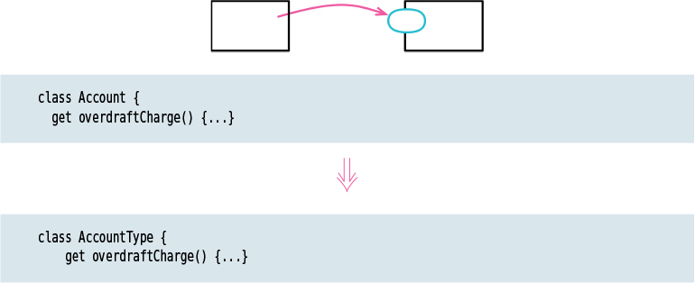

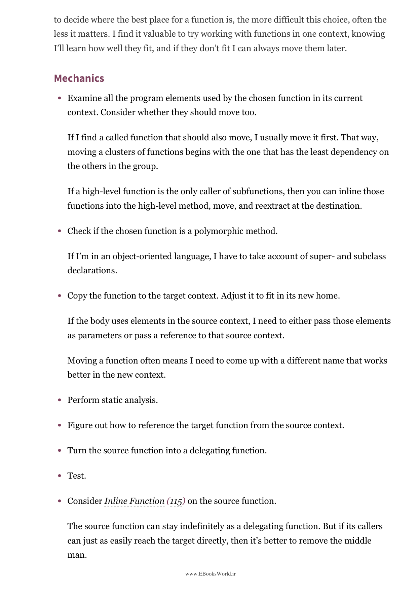

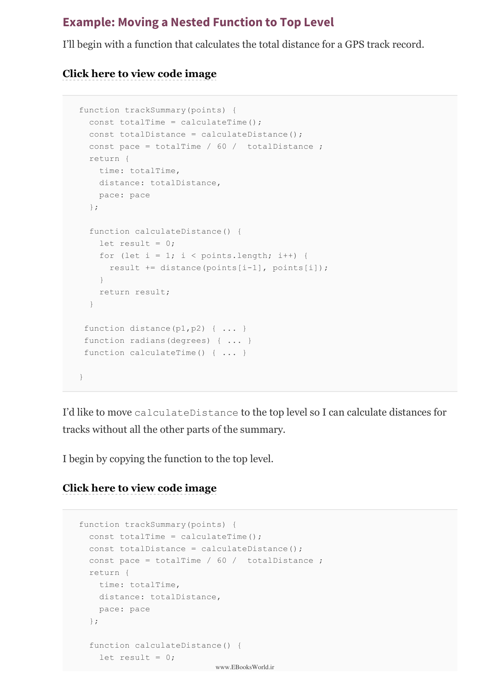

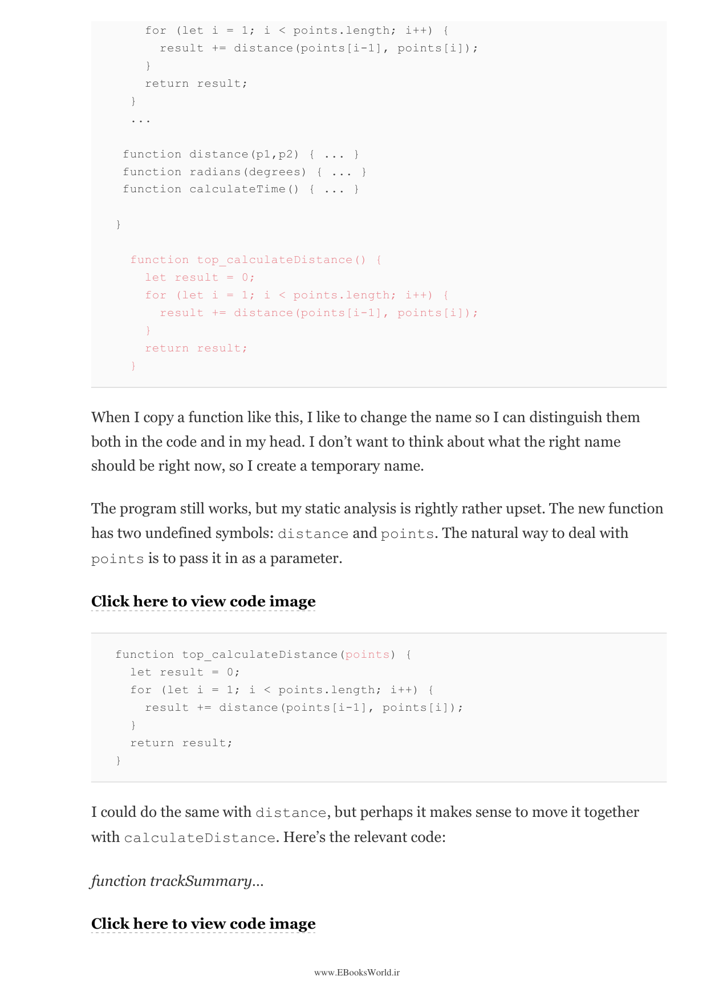

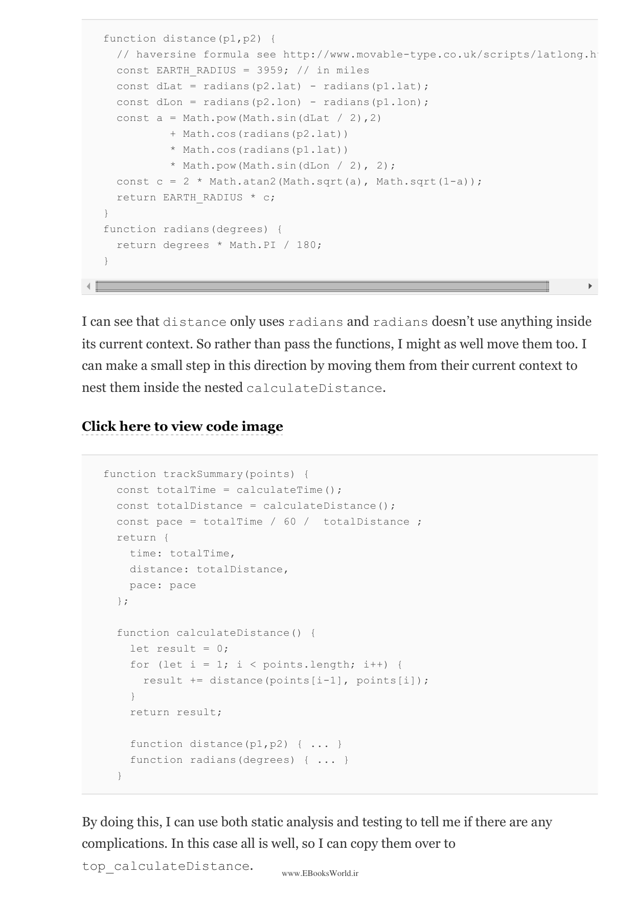

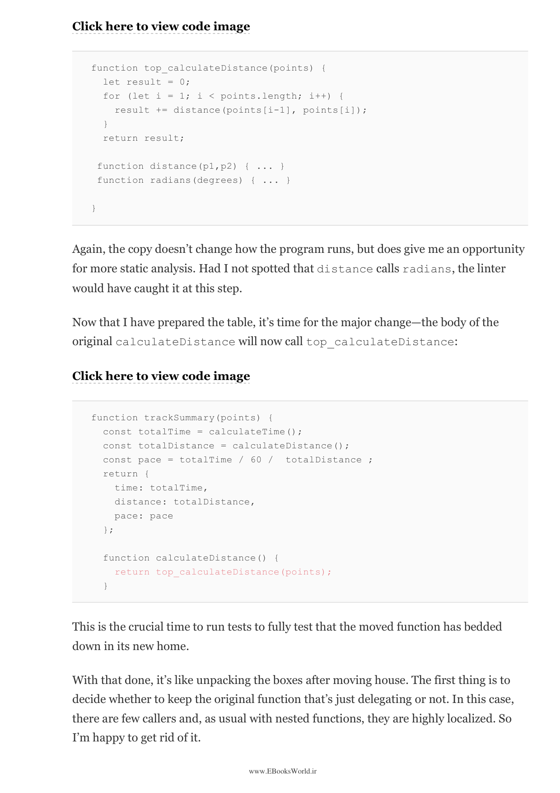

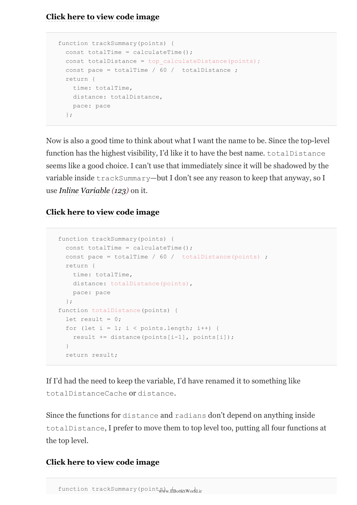

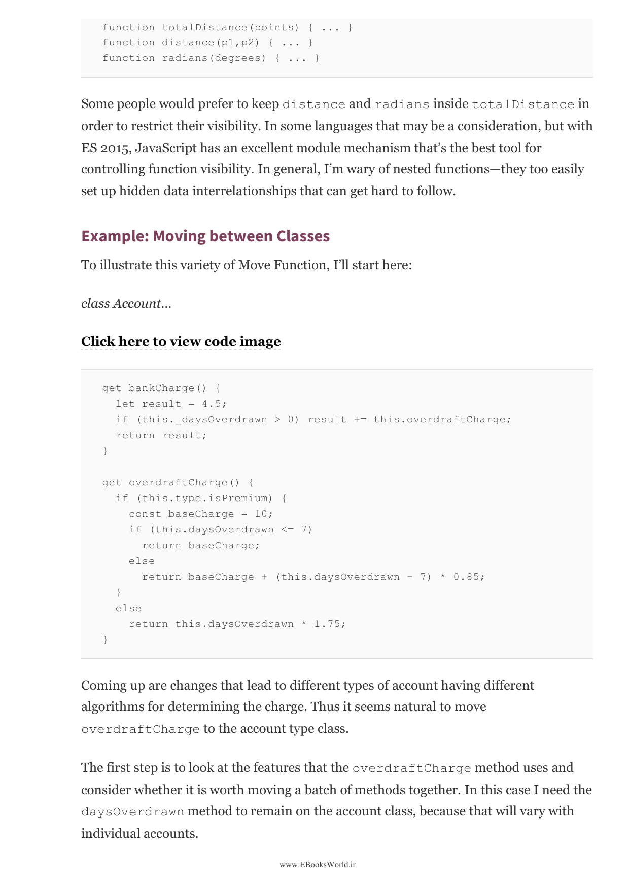

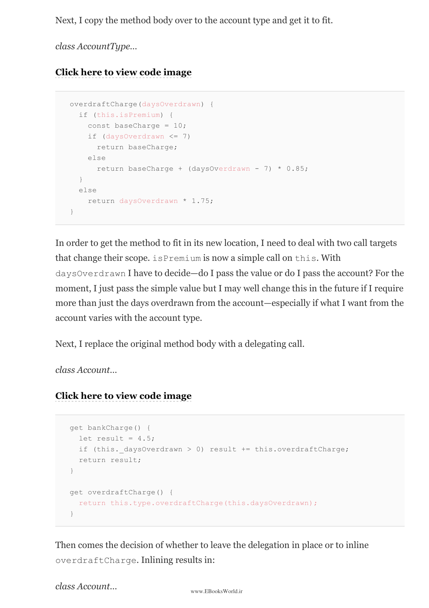

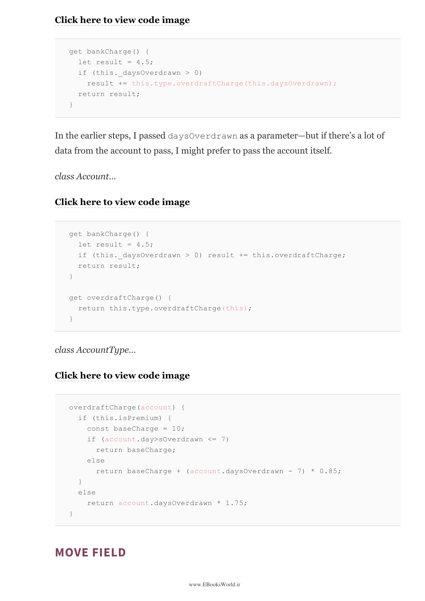

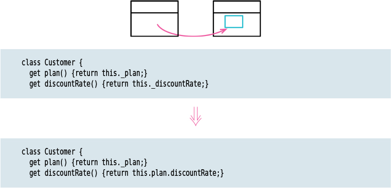

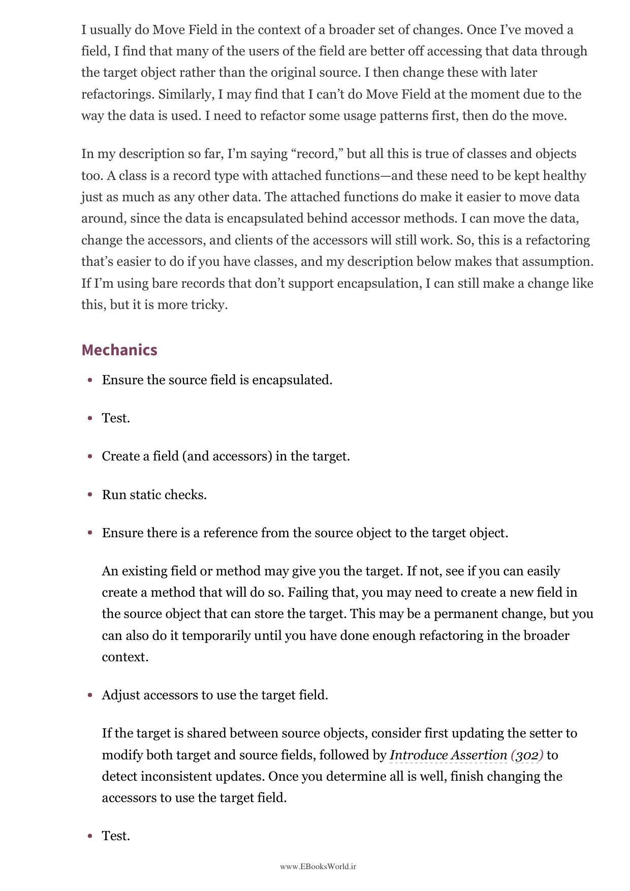

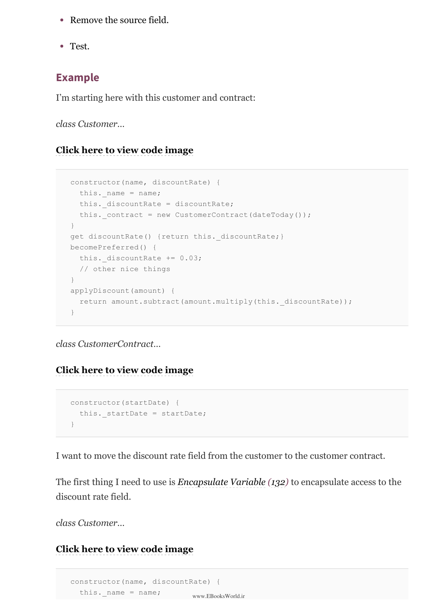

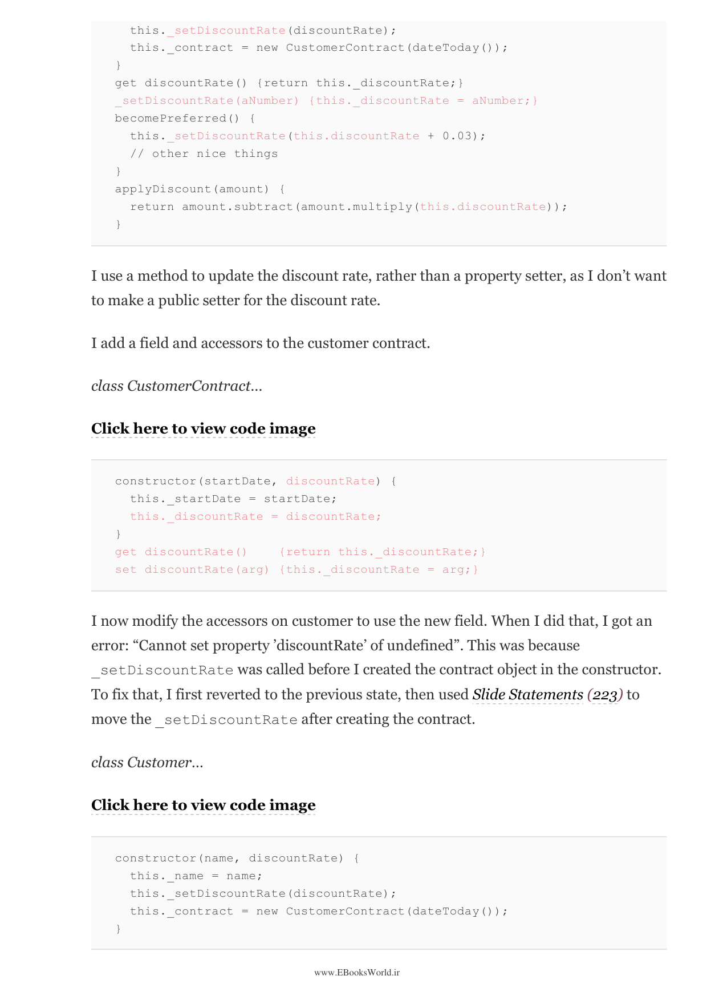

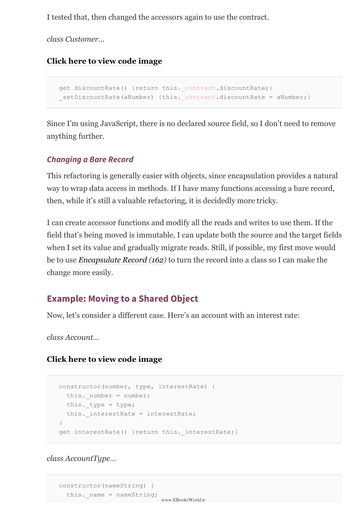

---

⏱️ زمان مطالعه تقریبی: ۳۰ دقیقه

> This chapter covers techniques for better organizing data within your code. Good data organization is critical for keeping code maintainable. These techniques help you avoid problems like dangling references and ensure your data stays consistent.

این فصل تکنیک‌هایی برای سازمان‌دهی بهتر داده‌ها در کد شما را پوشش می‌دهد.

---

### 21. جدا کردن متغیر — Split Variable

> When I have a variable that is used for two different things, I split it into two separate variables. If a variable is assigned to twice, and each assignment has a different reason for existing, I create two separate variables. This makes each variable's purpose clearer.

وقتی متغیری دارم که برای دو چیز مختلف استفاده می‌شود، آن را به دو متغیر جداگانه تقسیم می‌کنم.

---

### 22. تغییر مرجع به مقدار — Change Reference to Value

> Replaces a reference to an object with a value object. If I have a class that references another object, but the reference is never used to distinguish identity, I can convert it to a value—copying the data instead of referencing it. This simplifies the code.

مرجع به یک شیء را با یک شیء مقداری جایگزین می‌کند.

---

### 23. تغییر مقدار به مرجع — Change Value to Reference

> Replaces a value with a reference. When I have several objects that have the same data and I need to treat them as a single object, I convert the value to a reference. This is the opposite of Change Reference to Value.

یک مقدار را با یک مرجع جایگزین می‌کند. وقتی چند شیء دارم که داده یکسانی دارند و باید آن‌ها را به‌عنوان یک شیء واحد در نظر بگیرم.

---

### 24. جایگزینی متغیر مشتق با پرس و جو — Replace Derived Variable with Query

> Replaces a variable that's calculated from other data with a function that calculates it each time. If I have a field that's derived from other fields, and it's kept in sync with them manually, I replace it with a query method that computes it on the fly. This eliminates the risk of the derived data getting out of sync.

متغیری که از سایر داده‌ها محاسبه شده با تابعی جایگزین می‌کند که هر بار آن را محاسبه می‌کند.

---