> **Software Engineering at Google**
> ویراستاران: Titus Winters, Tom Manshreck, Hyrum Wright

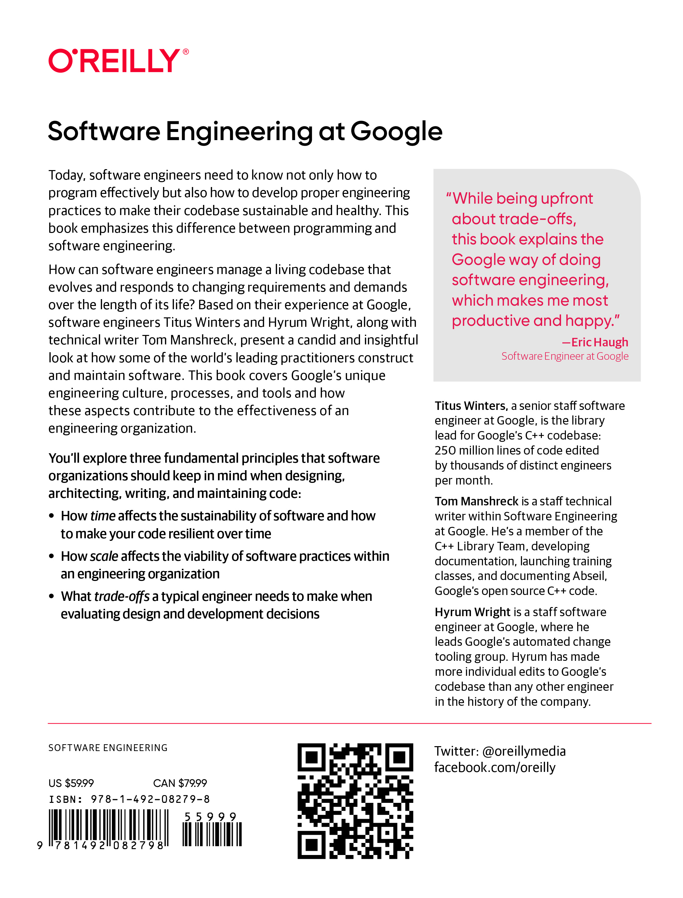

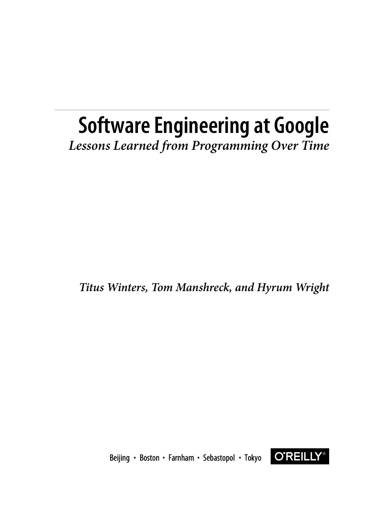

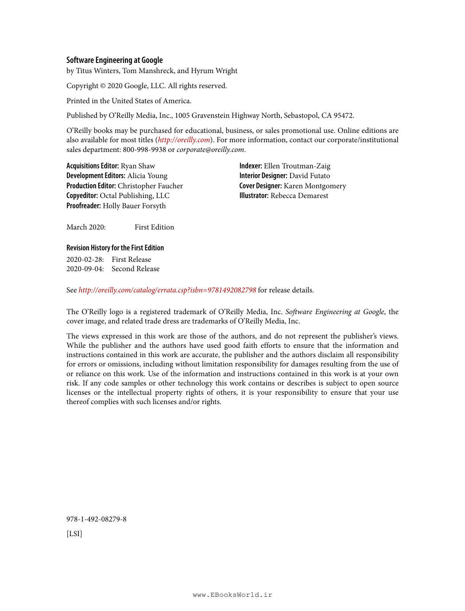

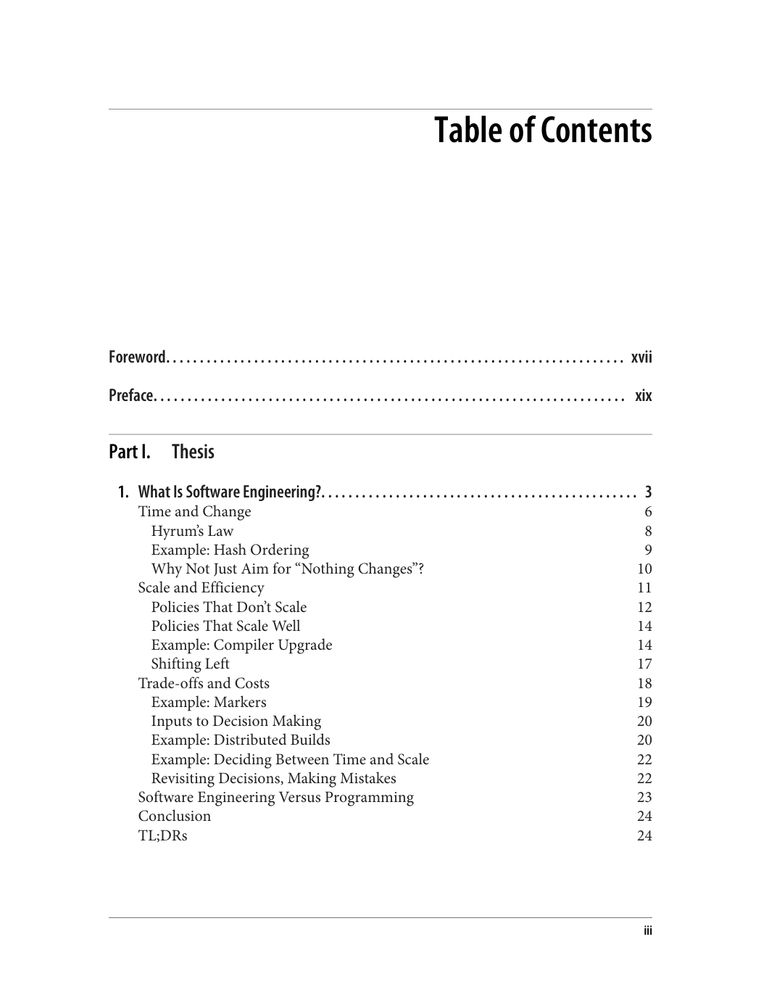

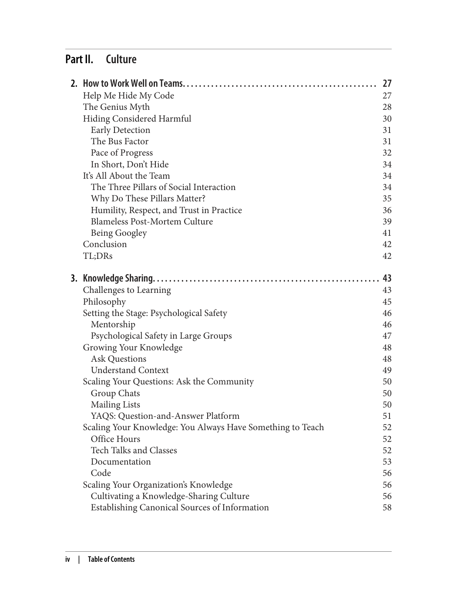

---

###### 📄 صفحه ۷

> **فهرست مطالب**
> ۶. رهبری در مقیاس بزرگ ... ۱۰۷
> تصمیم‌گیری مداوم ... ۱۰۸
> تمثیل هواپیما ... ۱۰۸
> شناسایی محدودیت‌ها ... ۱۰۹
> شناسایی مبادلات کلیدی ... ۱۰۹
> تصمیم‌گیری و سپس تکرار ... ۱۱۰
> همیشه در حال ترک ... ۱۱۲
> ماموریت شما: ساختن یک تیم "خودران" ... ۱۱۲
> تقسیم فضای مسئله ... ۱۱۳
> همیشه در حال مقیاس‌دهی ... ۱۱۶
> چرخه موفقیت ... ۱۱۶
> مهم در برابر فوری ... ۱۱۸
> یادگیری رها کردن توپ‌ها ... ۱۱۹
> محافظت از انرژی شما ... ۱۲۰
> نتیجه‌گیری ... ۱۲۲
> TL;DR ... ۱۲۲
> ۷. اندازه‌گیری بهره‌وری مهندسی ... ۱۲۳
> چرا باید بهره‌وری مهندسی را اندازه بگیریم؟ ... ۱۲۳
> غربالگری: آیا اصلاً ارزش اندازه‌گیری دارد؟ ... ۱۲۵
> انتخاب معیارهای معنادار با اهداف و سیگنال‌ها ... ۱۲۹
> اهداف ... ۱۳۰
> سیگنال‌ها ... ۱۳۲
> معیارها ... ۱۳۲
> استفاده از داده برای اعتبارسنجی معیارها ... ۱۳۳
> اقدام و پیگیری نتایج ... ۱۳۷
> نتیجه‌گیری ... ۱۳۷
> TL;DR ... ۱۳۷
> vi
> |
> فهرست مطالب

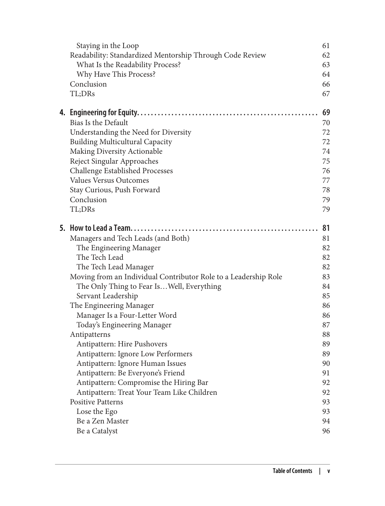

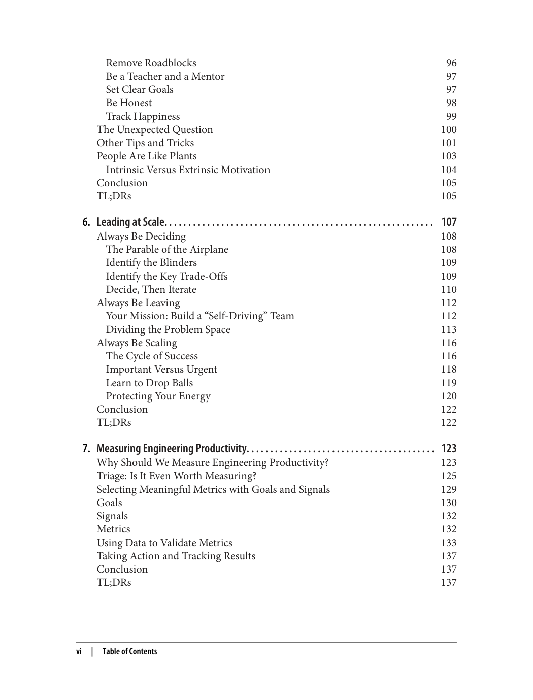

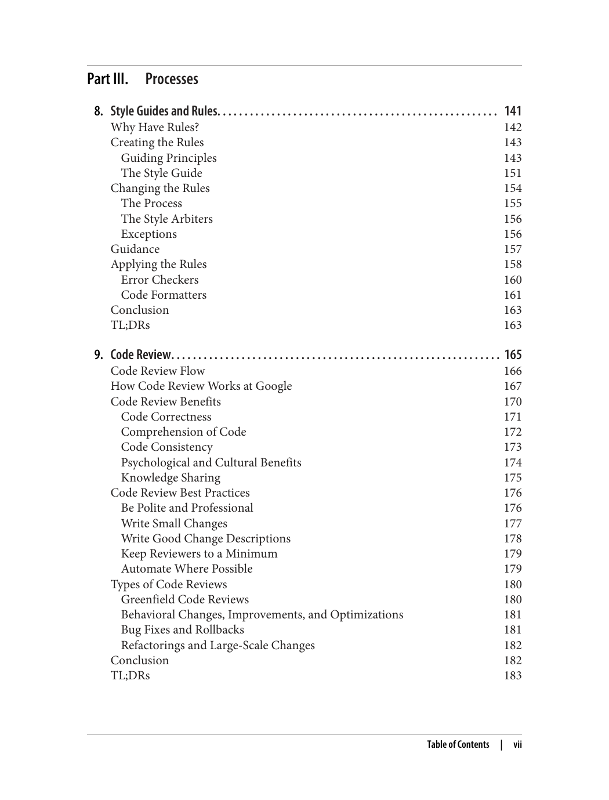

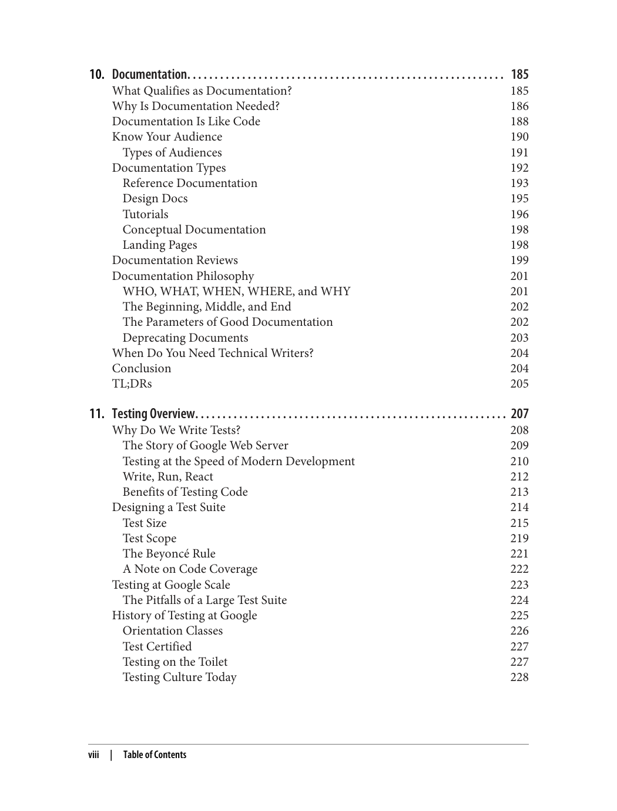

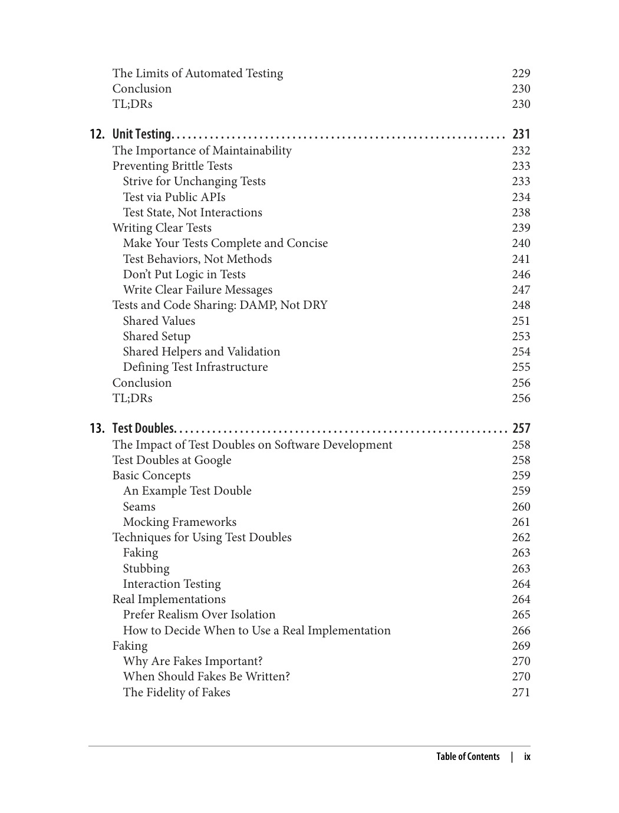

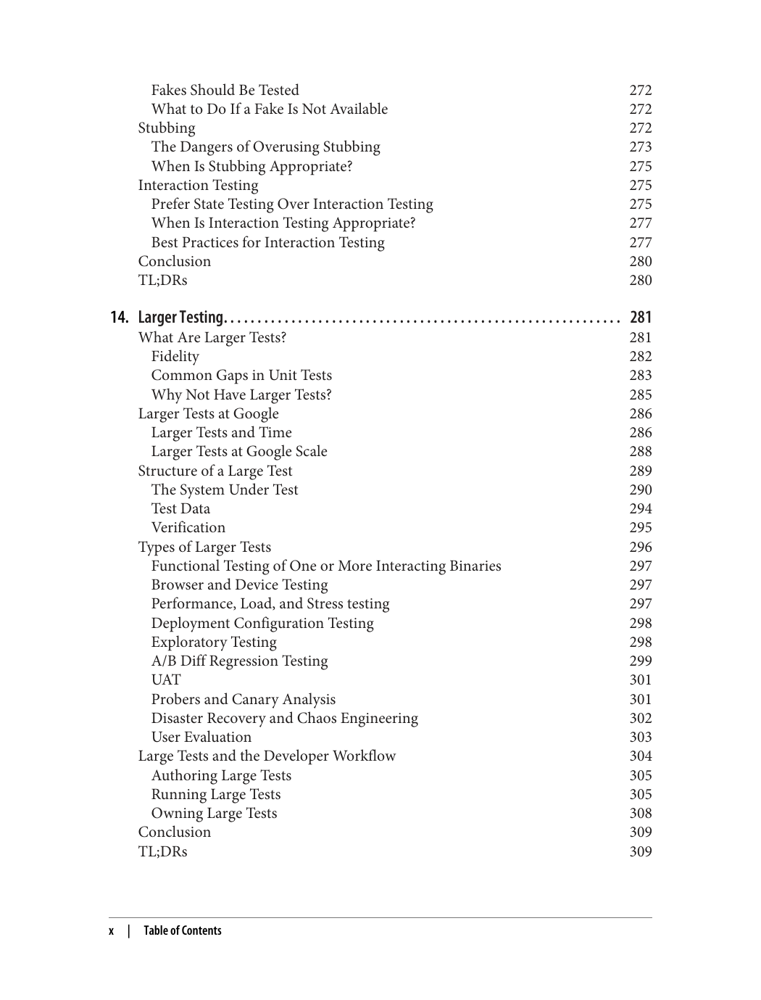

---

###### 📄 صفحه ۱۳

> **فهرست مطالب (ادامه)**
> ۱۷. جستجوی کد ... ۳۵۱
> رابط کاربری جستجوی کد ... ۳۵۲
> گوگلرها چگونه از جستجوی کد استفاده می‌کنند؟ ... ۳۵۳
> کجا؟ ... ۳۵۳
> چه چیزی؟ ... ۳۵۴
> چگونه؟ ... ۳۵۴
> چرا؟ ... ۳۵۴
> چه کسی و چه زمانی؟ ... ۳۵۵
> چرا یک ابزار وب جداگانه؟ ... ۳۵۵
> مقیاس ... ۳۵۵
> نمای کد جهانی بدون راه‌اندازی ... ۳۵۶
> تخصص‌گرایی ... ۳۵۶
> یکپارچه‌سازی با سایر ابزارهای توسعه‌دهنده ... ۳۵۶
> قرارگیری در معرض API ... ۳۵۹
> تأثیر مقیاس بر طراحی ... ۳۵۹
> تأخیر پرس و جوی جستجو ... ۳۵۹
> تأخیر نمایه‌سازی ... ۳۶۰
> پیاده‌سازی گوگل ... ۳۶۱
> نمایه جستجو ... ۳۶۱
> رتبه‌بندی ... ۳۶۳
> مبادلات انتخاب شده ... ۳۶۶
> جامعیت: مخزن در Head ... ۳۶۶
> جامعیت: همه در برابر بیشترین نتایج مرتبط ... ۳۶۶
> جامعیت: Head در برابر شاخه‌ها در برابر کل تاریخچه در برابر فضاهای کاری ... ۳۶۷
> بیانگری: توکن در برابر زیررشته در برابر Regex ... ۳۶۸
> نتیجه‌گیری ... ۳۶۹
> TL;DR ... ۳۷۰
> ۱۸. سیستم‌های Build و فلسفه Build ... ۳۷۱
> هدف یک سیستم Build ... ۳۷۱
> بدون سیستم Build چه اتفاقی می‌افتد؟ ... ۳۷۲
> اما من فقط به یک کامپایلر نیاز دارم! ... ۳۷۳
> اسکریپت‌های Shell به نجات می‌آیند؟ ... ۳۷۳
> سیستم‌های Build مدرن ... ۳۷۵
> همه چیز درباره Dependencies است ... ۳۷۵
> سیستم‌های Build مبتنی بر Task ... ۳۷۶
> سیستم‌های Build مبتنی بر Artifact ... ۳۸۰
> Buildهای توزیع‌شده ... ۳۸۶
> زمان، مقیاس، مبادلات ... ۳۹۰
> xii
> |
> فهرست مطالب

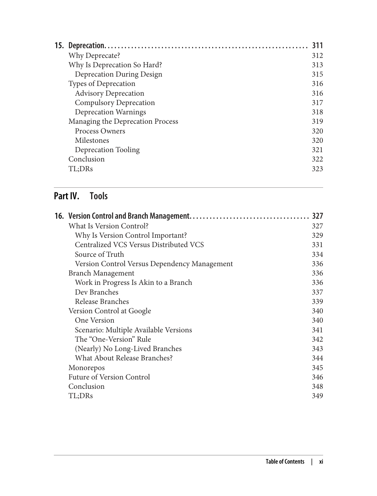

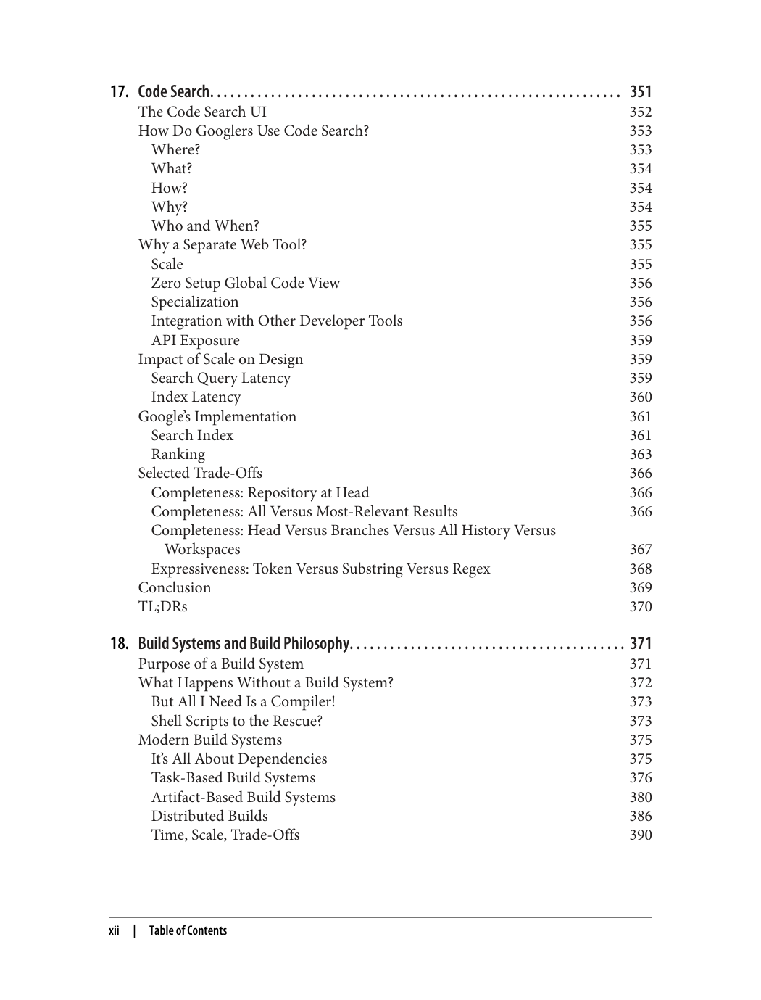

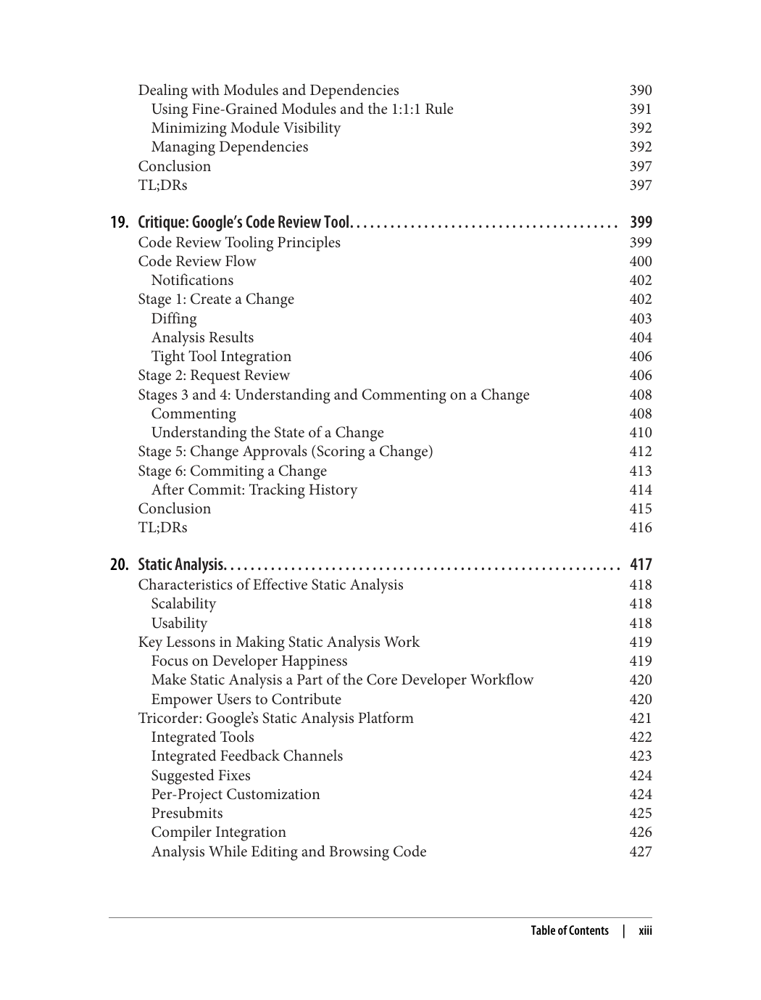

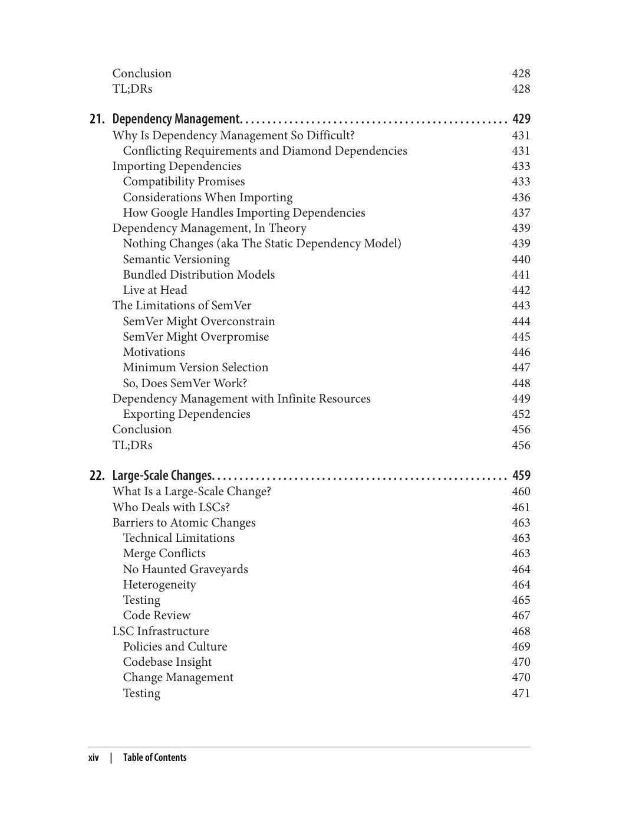

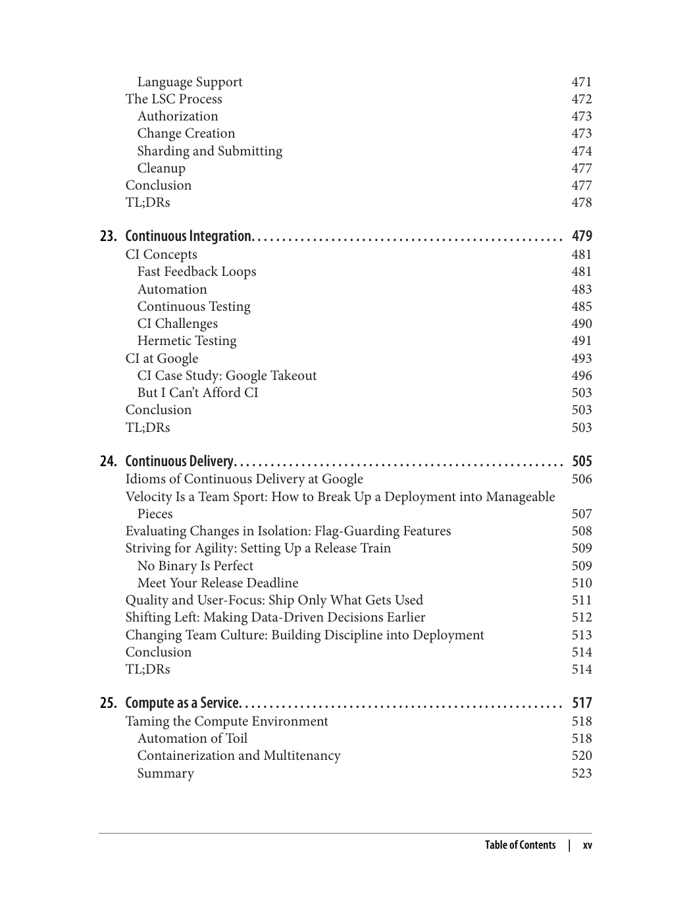

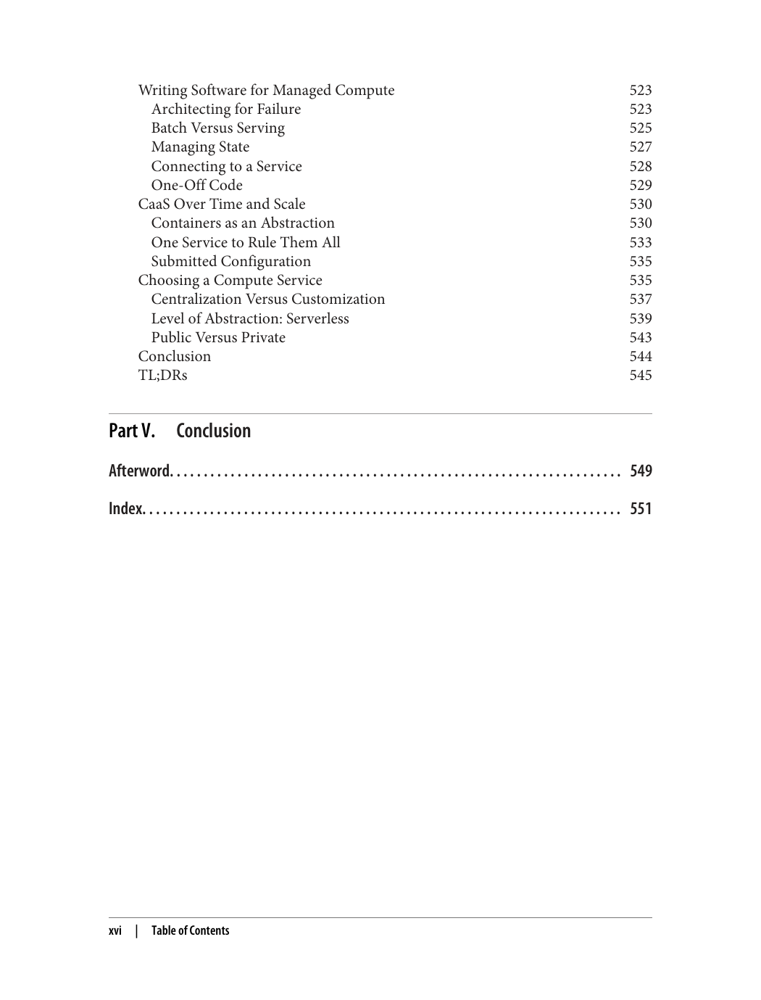

---
