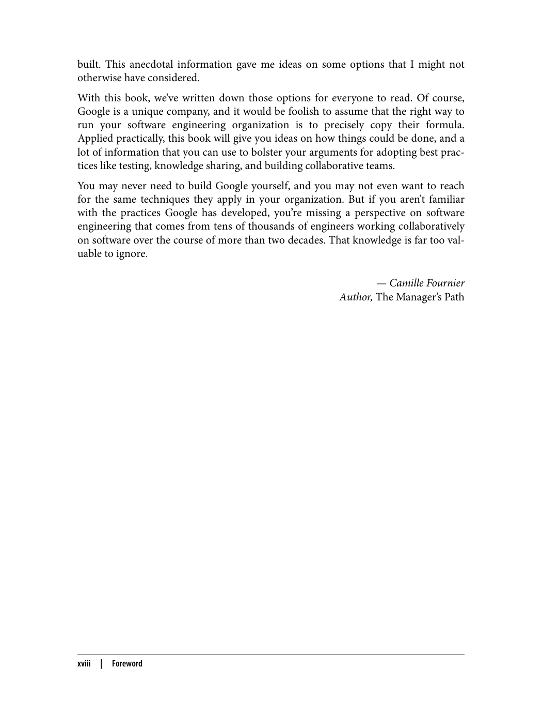
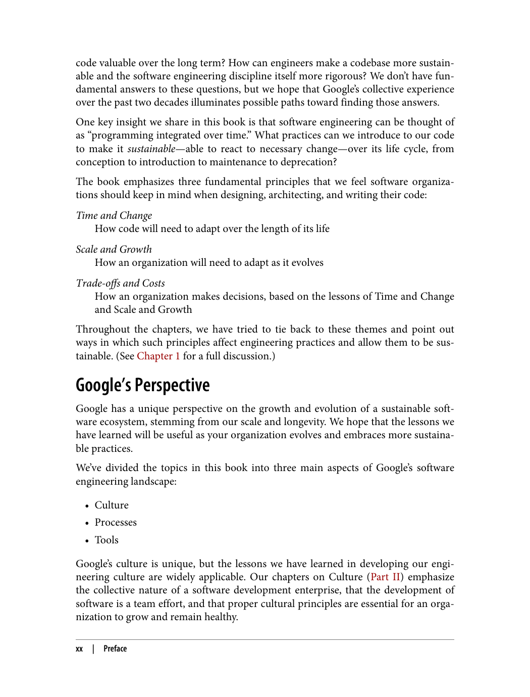
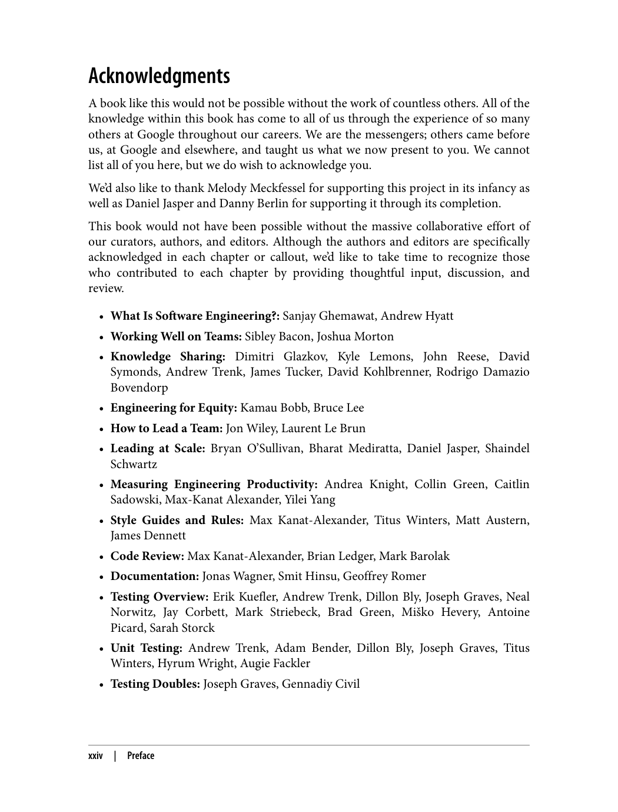
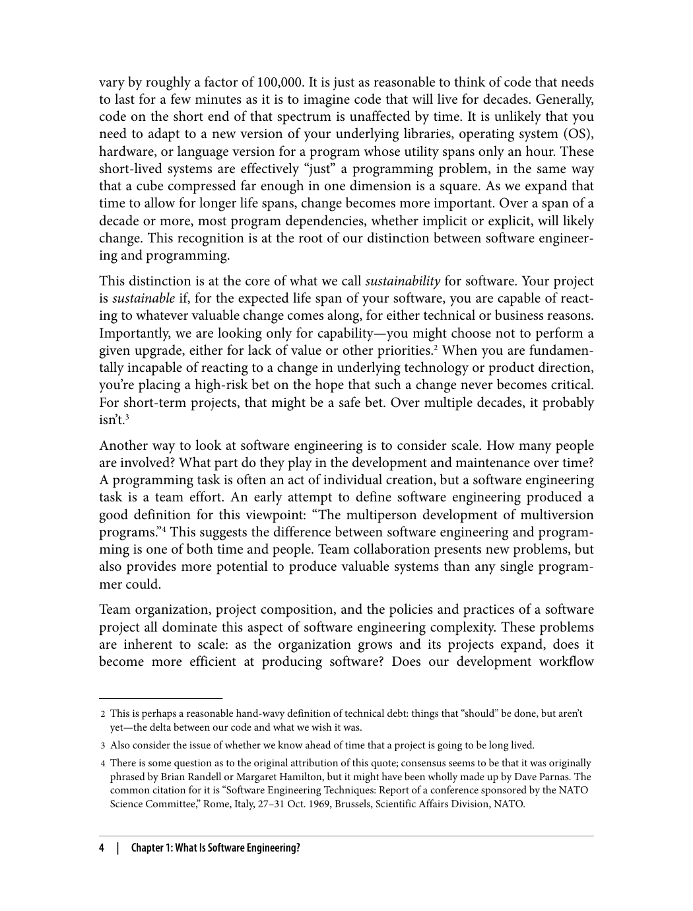
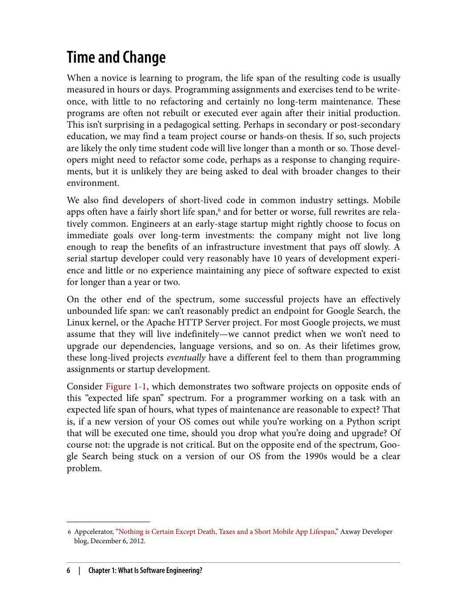
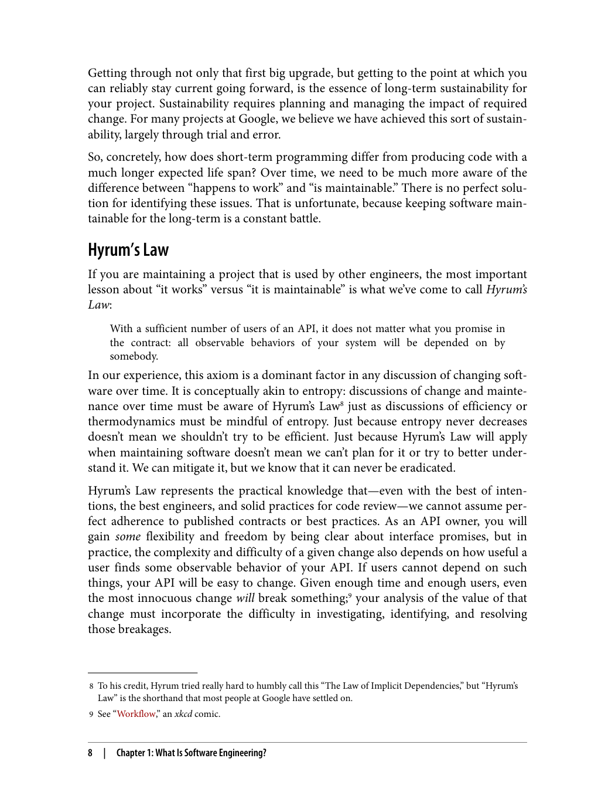
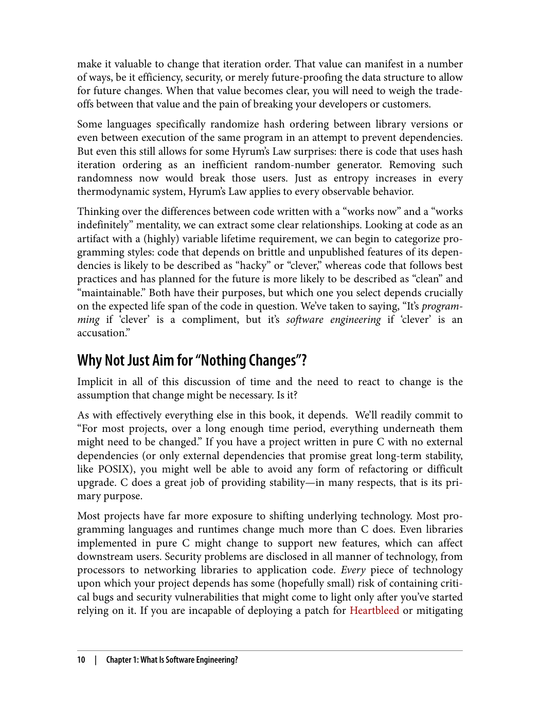
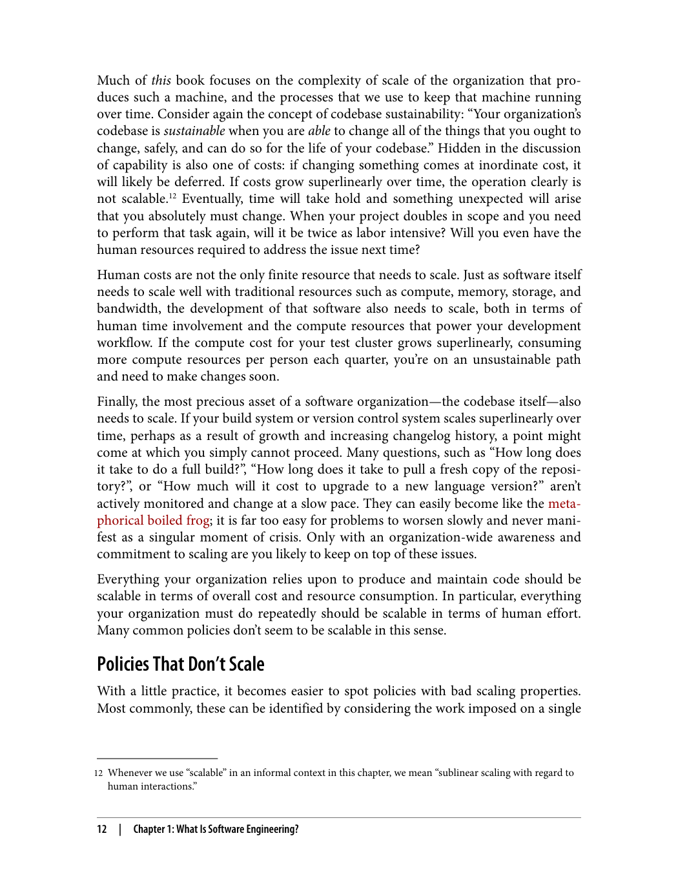
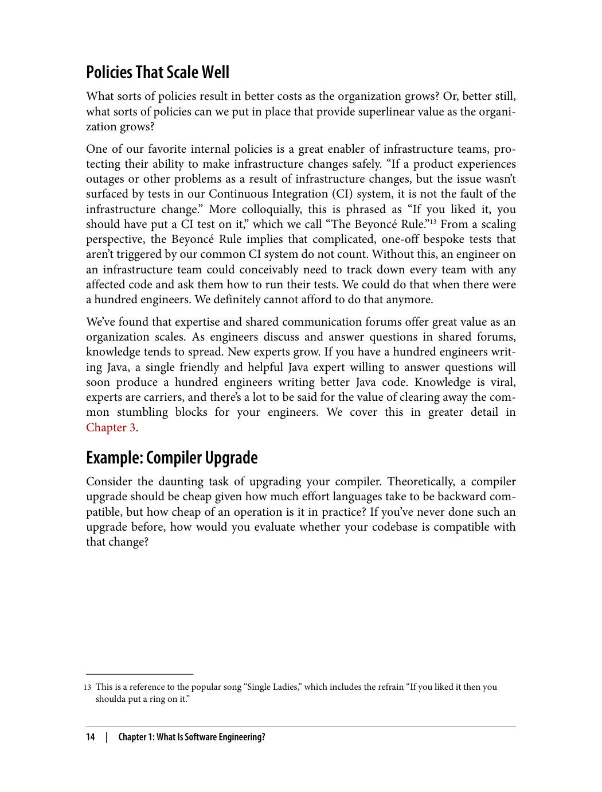

> **راهنمای مطالعه**
>
> در هر بخش، ابتدا متن اصلی کتاب به زبان انگلیسی آورده شده و سپس ترجمه و توضیحات فارسی همان بخش ارائه شده است.

---

###### 📄 صفحه ۱۹

> built. This anecdotal information gave me ideas on some options that I might not
> otherwise have considered.
> With this book, we've written down those options for everyone to read. Of course,
> Google is a unique company, and it would be foolish to assume that the right way to
> run your software engineering organization is to precisely copy their formula.
> Applied practically, this book will give you ideas on how things could be done, and a
> lot of information that you can use to bolster your arguments for adopting best prac‐
> tices like testing, knowledge sharing, and building collaborative teams.
> You may never need to build Google yourself, and you may not even want to reach
> for the same techniques they apply in your organization. But if you aren't familiar
> with the practices Google has developed, you're missing a perspective on software
> engineering that comes from tens of thousands of engineers working collaboratively
> on software over the course of more than two decades. That knowledge is far too val‐
> uable to ignore.
> — Camille Fournier
> Author, The Manager's Path
> xviii
> |
> Foreword

این اطلاعات تجربی به من ایده‌هایی در مورد برخی گزینه‌هایی داد که ممکن بود در غیر این صورت در نظر نگرفته باشم.

با این کتاب، ما آن گزینه‌ها را برای خواندن همه نوشته‌ایم. البته، گوگل یک شرکت منحصربه‌فرد است و این احمقانه خواهد بود که فرض کنیم راه درست اجرای سازمان مهندسی نرم‌افزار شما کپی دقیق فرمول آن‌هاست.

به‌صورت عملی، این کتاب به شما ایده‌هایی می‌دهد در مورد اینکه چگونه می‌توان کارها را انجام داد، و اطلاعات زیادی که می‌توانید برای تقویت استدلال‌هایتان جهت پذیرش بهترین شیوه‌ها (Best Practices) مانند testing، اشتراک‌گذاری دانش (Knowledge Sharing) و ساختن تیم‌های مشارکتی استفاده کنید.

شما ممکن است هرگز نیازی به ساختن گوگل نداشته باشید، و شاید حتی نخواهید به همان تکنیک‌هایی که آن‌ها در سازمان شما به کار می‌برند دست یابید. اما اگر با شیوه‌هایی که گوگل توسعه داده آشنا نیستید، شما یک دیدگاه در مورد مهندسی نرم‌افزار را از دست داده‌اید که از کار مشارکتی ده‌ها هزار مهندس نرم‌افزار در طول بیش از دو دهه به دست آمده است. آن دانش بسیار ارزشمند است تا نادیده گرفته شود.

— Camille Fournier
نویسنده، The Manager's Path

---

###### 📄 صفحه ۲۵

> Acknowledgments
> A book like this would not be possible without the work of countless others. All of the
> knowledge within this book has come to all of us through the experience of so many
> others at Google throughout our careers. We are the messengers; others came before
> us, at Google and elsewhere, and taught us what we now present to you. We cannot
> list all of you here, but we do wish to acknowledge you.
> We'd also like to thank Melody Meckfessel for supporting this project in its infancy as
> well as Daniel Jasper and Danny Berlin for supporting it through its completion.
> This book would not have been possible without the massive collaborative effort of
> our curators, authors, and editors. Although the authors and editors are specifically
> acknowledged in each chapter or callout, we'd like to take time to recognize those
> who contributed to each chapter by providing thoughtful input, discussion, and
> review.
> • What Is Software Engineering?: Sanjay Ghemawat, Andrew Hyatt
> • Working Well on Teams: Sibley Bacon, Joshua Morton
> • Knowledge Sharing: Dimitri Glazkov, Kyle Lemons, John Reese, David
> Symonds, Andrew Trenk, James Tucker, David Kohlbrenner, Rodrigo Damazio
> Bovendorp
> • Engineering for Equity: Kamau Bobb, Bruce Lee
> • How to Lead a Team: Jon Wiley, Laurent Le Brun
> • Leading at Scale: Bryan O'Sullivan, Bharat Mediratta, Daniel Jasper, Shaindel
> Schwartz
> • Measuring Engineering Productivity: Andrea Knight, Collin Green, Caitlin
> Sadowski, Max-Kanat Alexander, Yilei Yang
> • Style Guides and Rules: Max Kanat-Alexander, Titus Winters, Matt Austern,
> James Dennett
> • Code Review: Max Kanat-Alexander, Brian Ledger, Mark Barolak
> • Documentation: Jonas Wagner, Smit Hinsu, Geoffrey Romer
> • Testing Overview: Erik Kuefler, Andrew Trenk, Dillon Bly, Joseph Graves, Neal
> Norwitz, Jay Corbett, Mark Striebeck, Brad Green, Miško Hevery, Antoine
> Picard, Sarah Storck
> • Unit Testing: Andrew Trenk, Adam Bender, Dillon Bly, Joseph Graves, Titus
> Winters, Hyrum Wright, Augie Fackler
> • Testing Doubles: Joseph Graves, Gennadiy Civil
> xxiv
> |
> Preface

کتاب حاضر، رویکرد گوگل به مهندسی نرم‌افزار را توصیف می‌کند. تمرکز اصلی کتاب بر تفاوت‌های بین "برنامه‌نویسی" (Programming) و "مهندسی نرم‌افزار" (Software Engineering) است. برنامه‌نویسی به معنای نوشتن کدی است که توسط کامپایلر (Compiler) اجرا شود، در حالی که مهندسی نرم‌افزار به معنای نوشتن کدی است که توسط انسان‌ها قابل درک و نگهداری (Maintainable) باشد.

---

###### 📄 صفحه ۳۱

> 2 This is perhaps a reasonable hand-wavy definition of technical debt: things that "should" be done, but aren't
> yet—the delta between our code and what we wish it was.
> 3 Also consider the issue of whether we know ahead of time that a project is going to be long lived.
> 4 There is some question as to the original attribution of this quote; consensus seems to be that it was originally
> phrased by Brian Randell or Margaret Hamilton, but it might have been wholly made up by Dave Parnas. The
> common citation for it is "Software Engineering Techniques: Report of a conference sponsored by the NATO
> Science Committee," Rome, Italy, 27–31 Oct. 1969, Brussels, Scientific Affairs Division, NATO.
> vary by roughly a factor of 100,000. It is just as reasonable to think of code that needs
> to last for a few minutes as it is to imagine code that will live for decades. Generally,
> code on the short end of that spectrum is unaffected by time. It is unlikely that you
> need to adapt to a new version of your underlying libraries, operating system (OS),
> hardware, or language version for a program whose utility spans only an hour. These
> short-lived systems are effectively "just" a programming problem, in the same way
> that a cube compressed far enough in one dimension is a square. As we expand that
> time to allow for longer life spans, change becomes more important. Over a span of a
> decade or more, most program dependencies, whether implicit or explicit, will likely
> change. This recognition is at the root of our distinction between software engineer‐
> ing and programming.
> This distinction is at the core of what we call sustainability for software. Your project
> is sustainable if, for the expected life span of your software, you are capable of react‐
> ing to whatever valuable change comes along, for either technical or business reasons.
> Importantly, we are looking only for capability—you might choose not to perform a
> given upgrade, either for lack of value or other priorities.2 When you are fundamen‐
> tally incapable of reacting to a change in underlying technology or product direction,
> you're placing a high-risk bet on the hope that such a change never becomes critical.
> For short-term projects, that might be a safe bet. Over multiple decades, it probably
> isn't.3
> Another way to look at software engineering is to consider scale. How many people
> are involved? What part do they play in the development and maintenance over time?
> A programming task is often an act of individual creation, but a software engineering
> task is a team effort. An early attempt to define software engineering produced a
> good definition for this viewpoint: "The multiperson development of multiversion
> programs."4 This suggests the difference between software engineering and program‐
> ming is one of both time and people. Team collaboration presents new problems, but
> also provides more potential to produce valuable systems than any single program‐
> mer could.
> Team organization, project composition, and the policies and practices of a software
> project all dominate this aspect of software engineering complexity. These problems
> are inherent to scale: as the organization grows and its projects expand, does it
> become more efficient at producing software? Does our development workflow
> 4
> |
> Chapter 1: What Is Software Engineering?

طول عمر کدها می‌تواند تا حدود ۱۰۰,۰۰۰ برابر متفاوت باشد. به همان اندازه منطقی است که به کدی فکر کنیم که باید فقط چند دقیقه دوام بیاورد، همان‌طور که تصور کنیم کدی که ده‌ها سال زنده خواهد ماند. به‌طور کلی، کد در انتهای کوتاه این طیف تحت تأثیر زمان قرار نمی‌گیرد. بعید است که شما نیاز داشته باشید به نسخه جدیدی از کتابخانه‌های پایه، سیستم‌عامل (Operating System)، سخت‌افزار، یا نسخه زبان برنامه‌نویسی برای برنامه‌ای که عمر مفیدش فقط یک ساعت است سازگار شوید. این سیستم‌های کوتاه‌مدت عملاً "فقط" یک مسئله برنامه‌نویسی هستند، به همان شکل که مکعبی که به اندازه کافی در یک بعد فشرده شود مربع می‌شود. با گسترش آن زمان برای اجازه دادن به عمرهای طولانی‌تر، تغییر مهم‌تر می‌شود. در طول یک دهه یا بیشتر، بیشتر وابستگی‌های برنامه (Dependencies)، چه ضمنی و چه صریح، احتمالاً تغییر خواهند کرد. این درک در ریشه تمایز ما بین مهندسی نرم‌افزار و برنامه‌نویسی قرار دارد.

این تمایز در هسته آن چیزی است که ما پایداری نرم‌افزار (Sustainability) می‌نامیم. پروژه شما پایدار است اگر، برای عمر مورد انتظار نرم‌افزار شما، شما قادر به واکنش به هر تغییر ارزشمندی هستید، چه به دلایل فنی و چه به دلایل تجاری. مهم این است که ما فقط به دنبال توانایی هستیم—شما ممکن است انتخاب کنید ارتقای مشخصی را انجام ندهید، چه به دلیل عدم ارزش یا اولویت‌های دیگر. وقتی شما اساساً قادر به واکنش به تغییر در فناوری پایه یا جهت محصول نیستید، شما یک شرط پرخطر با این امید می‌گذارید که چنین تغییری هرگز بحرانی نشود. برای پروژه‌های کوتاه‌مدت، ممکن است یک شرط ایمن باشد. در طول چندین دهه، احتمالاً این‌طور نیست.

یک راه دیگر برای نگاه کردن به مهندسی نرم‌افزار، در نظر گرفتن مقیاس است. چند نفر درگیر هستند؟ چه نقشی در توسعه و نگهداری در طول زمان بازی می‌کنند؟ یک وظیفه برنامه‌نویسی اغلب یک عمل خلق فردی است، اما یک وظیفه مهندسی نرم‌افزار یک تلاش تیمی است. یک تلاش اولیه برای تعریف مهندسی نرم‌افزار یک تعریف خوب برای این دیدگاه ایجاد کرد: "توسعه چندنفره برنامه‌های چندنسخه‌ای." این نشان می‌دهد که تفاوت بین مهندسی نرم‌افزار و برنامه‌نویسی هم در زمان و هم در افراد است. همکاری تیمی مشکلات جدیدی ایجاد می‌کند، اما همچنین پتانسیل بیشتری برای تولید سیستم‌های ارزشمند نسبت به هر برنامه‌نویس منفرد فراهم می‌کند.

سازماندهی تیم، ترکیب پروژه، و سیاست‌ها و شیوه‌های یک پروژه نرم‌افزاری همگی بر این جنبه از پیچیدگی مهندسی نرم‌افزار تسلط دارند. این مشکلات ذاتی مقیاس هستند: با رشد سازمان و گسترش پروژه‌هایش، آیا در تولید نرم‌افزار کارآمدتر می‌شود؟ آیا گردش کار توسعه ما

---

###### 📄 صفحه ۳۷

> make it valuable to change that iteration order. That value can manifest in a number
> of ways, be it efficiency, security, or merely future-proofing the data structure to allow
> for future changes. When that value becomes clear, you will need to weigh the trade-
> offs between that value and the pain of breaking your developers or customers.
> Some languages specifically randomize hash ordering between library versions or
> even between execution of the same program in an attempt to prevent dependencies.
> But even this still allows for some Hyrum's Law surprises: there is code that uses hash
> iteration ordering as an inefficient random-number generator. Removing such
> randomness now would break those users. Just as entropy increases in every
> thermodynamic system, Hyrum's Law applies to every observable behavior.
> Thinking over the differences between code written with a "works now" and a "works
> indefinitely" mentality, we can extract some clear relationships. Looking at code as an
> artifact with a (highly) variable lifetime requirement, we can begin to categorize pro‐
> gramming styles: code that depends on brittle and unpublished features of its depen‐
> dencies is likely to be described as "hacky" or "clever," whereas code that follows best
> practices and has planned for the future is more likely to be described as "clean" and
> "maintainable." Both have their purposes, but which one you select depends crucially
> on the expected life span of the code in question. We've taken to saying, "It's program‐
> ming if 'clever' is a compliment, but it's software engineering if 'clever' is an
> accusation."
> Why Not Just Aim for "Nothing Changes"?
> Implicit in all of this discussion of time and the need to react to change is the
> assumption that change might be necessary. Is it?
> As with effectively everything else in this book, it depends.  We'll readily commit to
> "For most projects, over a long enough time period, everything underneath them
> might need to be changed." If you have a project written in pure C with no external
> dependencies (or only external dependencies that promise great long-term stability,
> like POSIX), you might well be able to avoid any form of refactoring or difficult
> upgrade. C does a great job of providing stability—in many respects, that is its pri‐
> mary purpose.
> Most projects have far more exposure to shifting underlying technology. Most pro‐
> gramming languages and runtimes change much more than C does. Even libraries
> implemented in pure C might change to support new features, which can affect
> downstream users. Security problems are disclosed in all manner of technology, from
> processors to networking libraries to application code. Every piece of technology
> upon which your project depends has some (hopefully small) risk of containing crit‐
> ical bugs and security vulnerabilities that might come to light only after you've started
> relying on it. If you are incapable of deploying a patch for Heartbleed or mitigating
> 10
> |
> Chapter 1: What Is Software Engineering?

این ارزش می‌تواند به روش‌های مختلفی ظاهر شود، چه کارایی (Efficiency)، امنیت (Security)، یا صرفاً آینده‌نگری ساختار داده (Future-proofing) برای اجازه دادن به تغییرات آینده. وقتی آن ارزش واضح می‌شود، شما باید مبادلات (Trade-offs) بین آن ارزش و درد شکستن توسعه‌دهندگان یا مشتریان خود را بسنجید.

برخی زبان‌ها به‌طور خاص ترتیب هش (Hash Ordering) را بین نسخه‌های کتابخانه یا حتی بین اجرای یک برنامه تصادفی می‌کنند تا از وابستگی‌ها جلوگیری کنند. اما حتی این همچنان اجازه می‌دهد برخی سورپرایزهای قانون هایروم (Hyrum's Law) رخ دهد: کدی وجود دارد که از ترتیب تکرار هش به‌عنوان یک تولیدکننده اعداد تصادفی ناکارآمد استفاده می‌کند. حذف چنین تصادفی‌ای در حال حاضر آن کاربران را خراب می‌کند. درست مانند افزایش آنتروپی (Entropy) در هر سیستم ترمودینامیکی، قانون هایروم بر هر رفتار قابل مشاهده‌ای اعمال می‌شود.

با فکر کردن در مورد تفاوت‌های بین کدی که با ذهنیت "الان کار می‌کند" و کدی که با ذهنیت "برای همیشه کار می‌کند" نوشته شده، می‌توانیم رابطه‌های واضحی استخراج کنیم. با نگاه کردن به کد به‌عنوان یک شیء با نیاز عمر (بسیار) متغیر، می‌توانیم شروع به دسته‌بندی سبک‌های برنامه‌نویسی کنیم: کدی که به ویژگی‌های شکننده و منتشر نشده وابستگی‌هایش وابسته است احتمالاً "هکی" یا "هوشمندانه" توصیف می‌شود، در حالی که کدی که بهترین شیوه‌ها را دنبال می‌کند و برای آینده برنامه‌ریزی کرده احتمالاً "تمیز" و "قابل نگهداری" (Maintainable) توصیف می‌شود. هر دو هدف خود را دارند، اما اینکه کدام را انتخاب می‌کنید به‌طور حیاتی به عمر مورد انتظار کد مورد بحث بستگی دارد. ما گفته‌ایم: "اگر 'هوشمندانه' یک تعریف باشد، برنامه‌نویسی است، اما اگر 'هوشمندانه' یک اتهام باشد، مهندسی نرم‌افزار است."

چرا هدف "هیچ چیز تغییر نکند" را دنبال نکنیم؟

ضمن تمام این بحث در مورد زمان و نیاز به واکنش به تغییر، فرض بر این است که ممکن است تغییر ضروری باشد. آیا این‌طور است؟

درست مانند تقریباً هر چیز دیگری در این کتاب، بستگی دارد. ما به‌راحتی متعهد می‌شویم که "برای بیشتر پروژه‌ها، در طول یک بازه زمانی به اندازه کافی طولانی، همه چیز زیر آن‌ها ممکن است نیاز به تغییر داشته باشد." اگر پروژه‌ای به زبان خالص C با هیچ وابستگی خارجی (یا فقط وابستگی‌های خارجی که ثبات بلندمدت عالی قول می‌دهند، مانند POSIX) دارید، ممکن است بتوانید از هر شکلی از بازآفرینی (Refactoring) یا ارتقای دشوار اجتناب کنید. C کار خوبی در ارائه ثبات انجام می‌دهد—از بسیاری جهات، این هدف اصلی آن است.

بیشتر پروژه‌ها در معرض تغییرات فناوری پایه بسیار بیشتری هستند. بیشتر زبان‌های برنامه‌نویسی و محیط‌های اجرایی (Runtime) بسیار بیشتر از C تغییر می‌کنند. حتی کتابخانه‌های پیاده‌سازی شده در خالص C ممکن است برای پشتیبانی از ویژگی‌های جدید تغییر کنند، که می‌تواند بر کاربران پایین‌دستی تأثیر بگذارد. مشکلات امنیتی (Security Vulnerabilities) در انواع مختلف فناوری افشا می‌شوند، از پردازنده‌ها گرفته تا کتابخانه‌های شبکه تا کد برنامه. هر تکه فناوری که پروژه شما به آن وابسته است دارای برخی (امیدواریم کوچک) خطر حاوی باگ‌های بحرانی و آسیب‌پذیری‌های امنیتی است که ممکن است فقط پس از شروع استفاده از آن آشکار شوند. اگر شما قادر به استقرار یک وصله (Patch) برای Heartbleed یا کاهش

---
