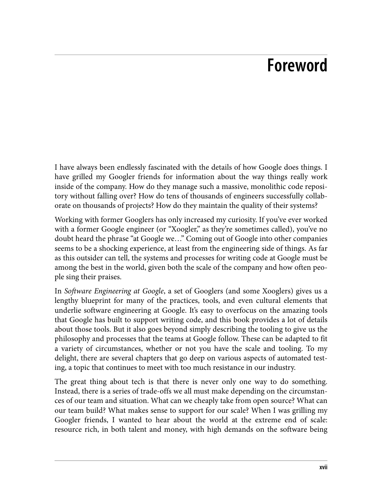
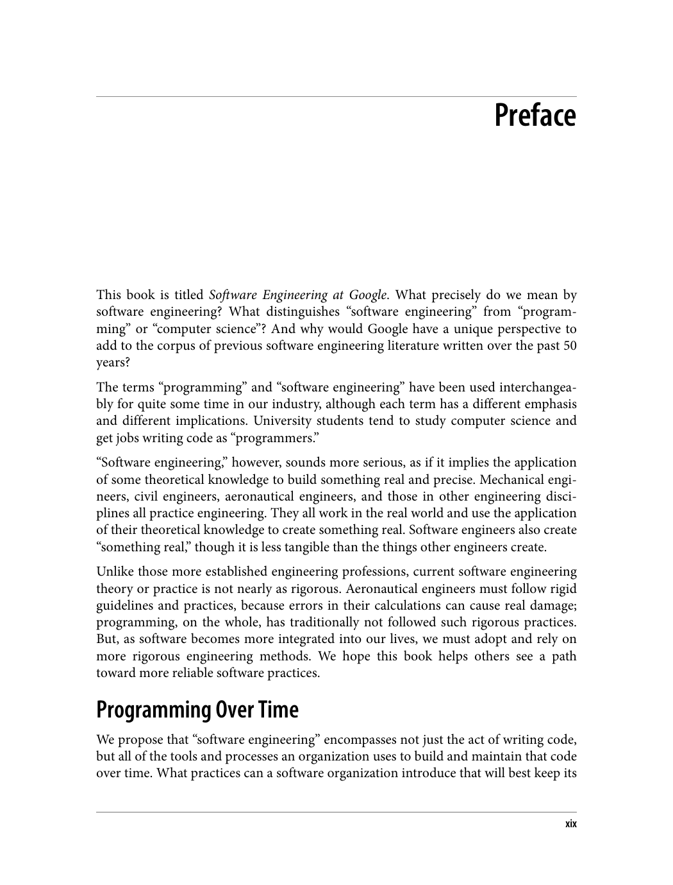
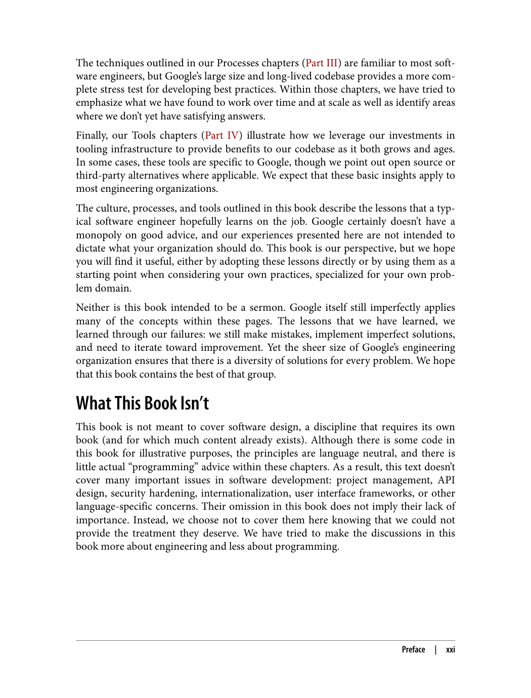
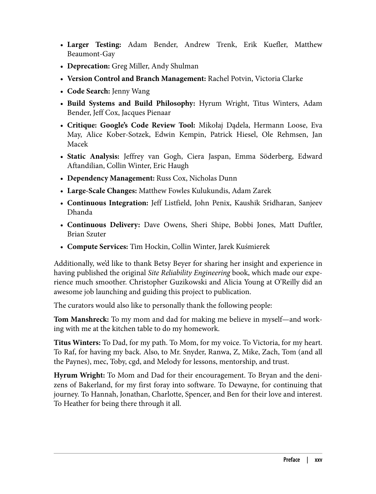
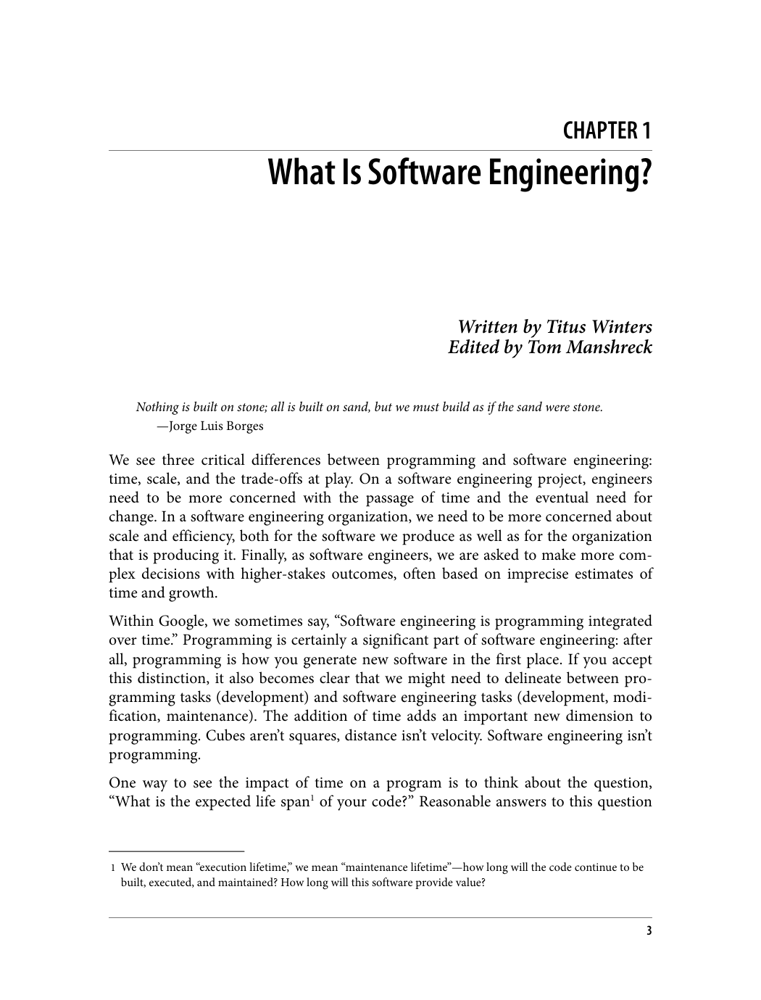
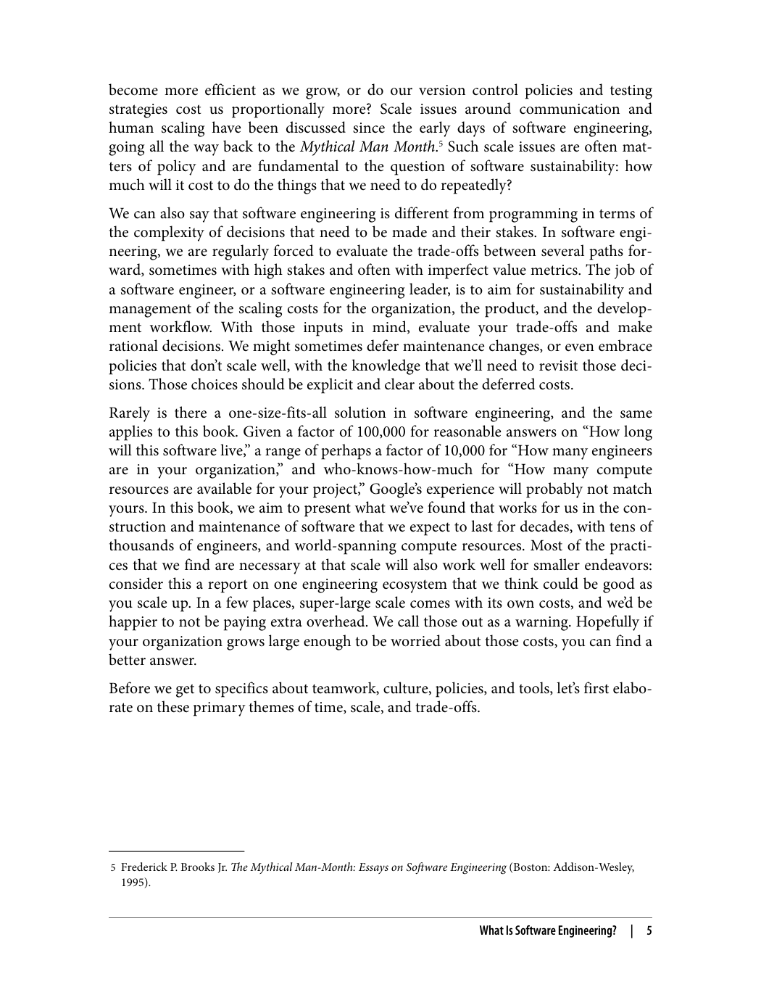
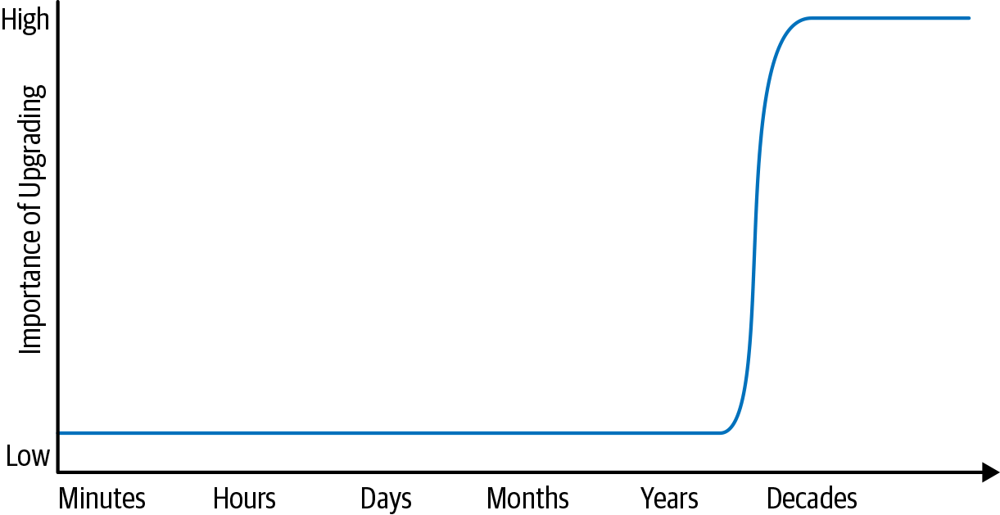
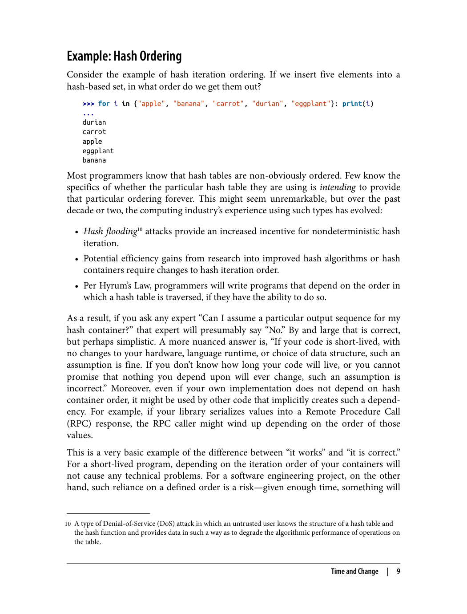
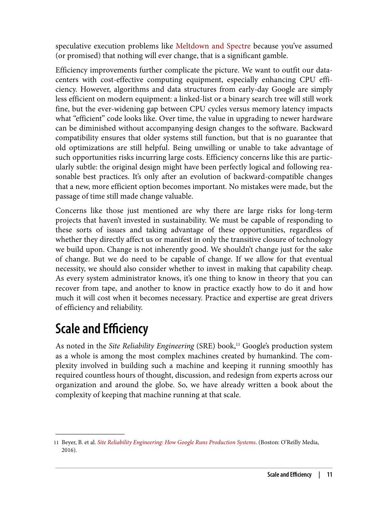
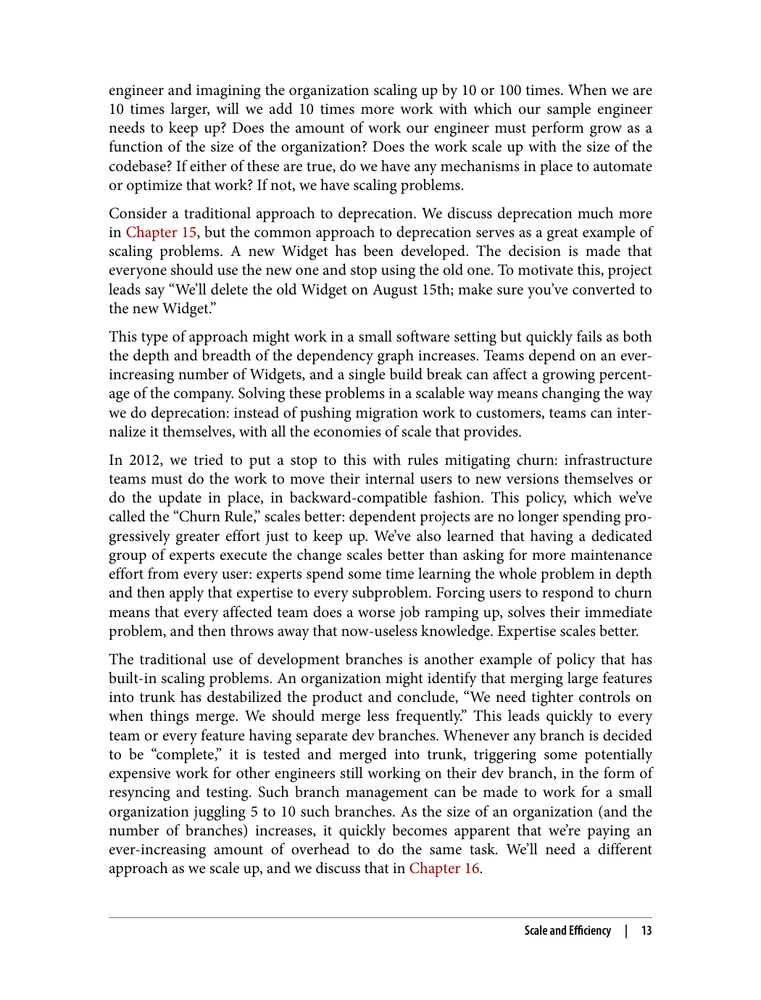

## فصل ۱: مهندسی نرم‌افزار در مقابل برنامه‌نویسی

---

> "برنامه‌نویسی، نوشتن کد برای یک کامپایلر است. مهندسی نرم‌افزار، نوشتن کدی است که توسط انسان‌ها قابل درک و نگهداری باشد."

### تفاوت مهندسی نرم‌افزار با برنامه‌نویسی

> "برنامه‌نویسی، نوشتن کد برای یک کامپایلر است. مهندسی نرم‌افزار، نوشتن کدی است که توسط انسان‌ها قابل درک و نگهداری باشد."

کتاب حاضر، رویکرد گوگل به مهندسی نرم‌افزار را توصیف می‌کند. تمرکز اصلی کتاب بر تفاوت‌های بین "برنامه‌نویسی" و "مهندسی نرم‌افزار" است. برنامه‌نویسی به معنای نوشتن کدی است که توسط کامپایلر اجرا شود، در حالی که مهندسی نرم‌افزار به معنای نوشتن کدی است که توسط انسان‌ها قابل درک و نگهداری باشد.

### مشکل برنامه‌نویسان

> "برنامه‌نویسان معمولاً از فکر کردن درباره کدی که می‌نویسند و چگونگی نگهداری آن توسط دیگران اجتناب می‌کنند."

یکی از مشکلات اصلی در مهندسی نرم‌افزار، تمایل برنامه‌نویسان به استفاده از "ترفند"ها و کدهای "هوشمندانه" است. این کدها ممکن است در کوتاه‌مدت مفید باشند، اما در بلندمدت مشکلات زیادی ایجاد می‌کنند.

### هزینه‌های نگهداری

> "بیشتر هزینه‌های نرم‌افزار در مرحله نگهداری آن است، نه در مرحله توسعه."

هزینه نگهداری نرم‌افزار معمولاً بسیار بیشتر از هزینه توسعه اولیه آن است. این بدان معناست که خوانایی و قابلیت نگهداری کد بسیار مهم‌تر از کوتاهی یا هوشمندی کد است.

### اصول مهندسی نرم‌افزار در گوگل

1. **خوانایی کد**: کد باید توسط دیگران قابل خواندن و درک باشد
2. **نگهداری**: کد باید آسان برای تغییر و به‌روزرسانی باشد
3. **اشتراک‌گذاری دانش**: دانش باید بین اعضای تیم به اشتراک گذاشته شود
4. **استانداردسازی**: از استانداردها و قوانین مشخص پیروی کنید

---