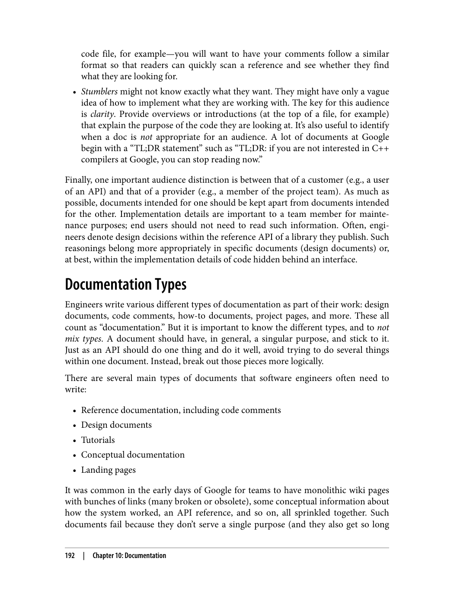
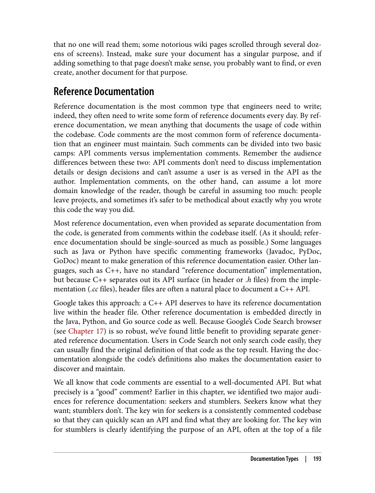
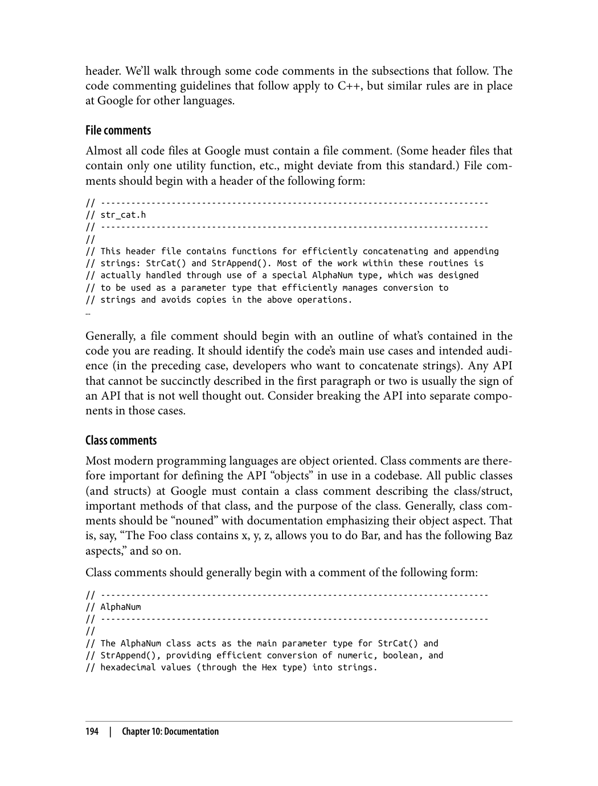
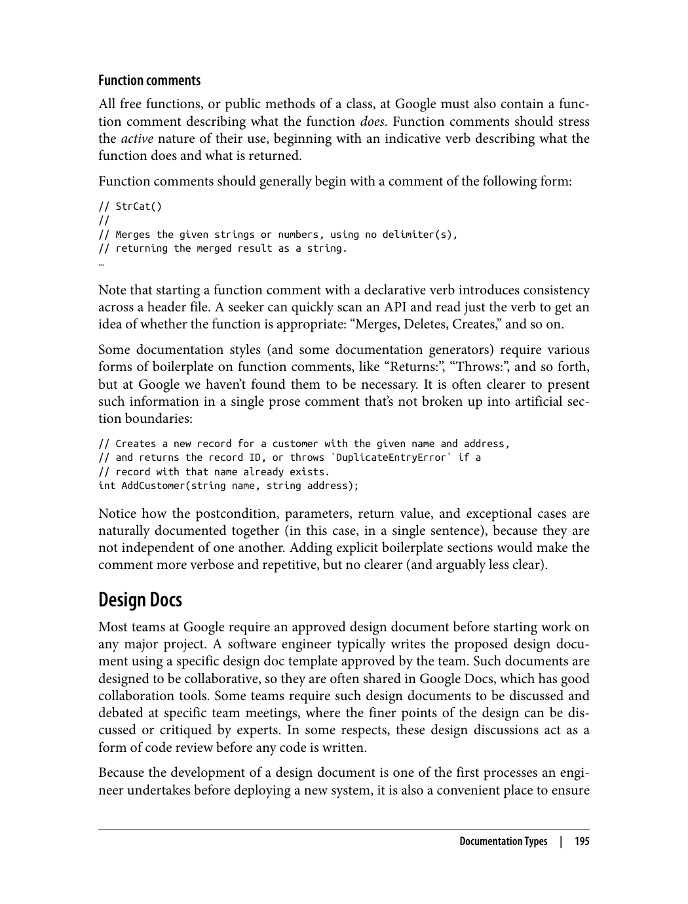
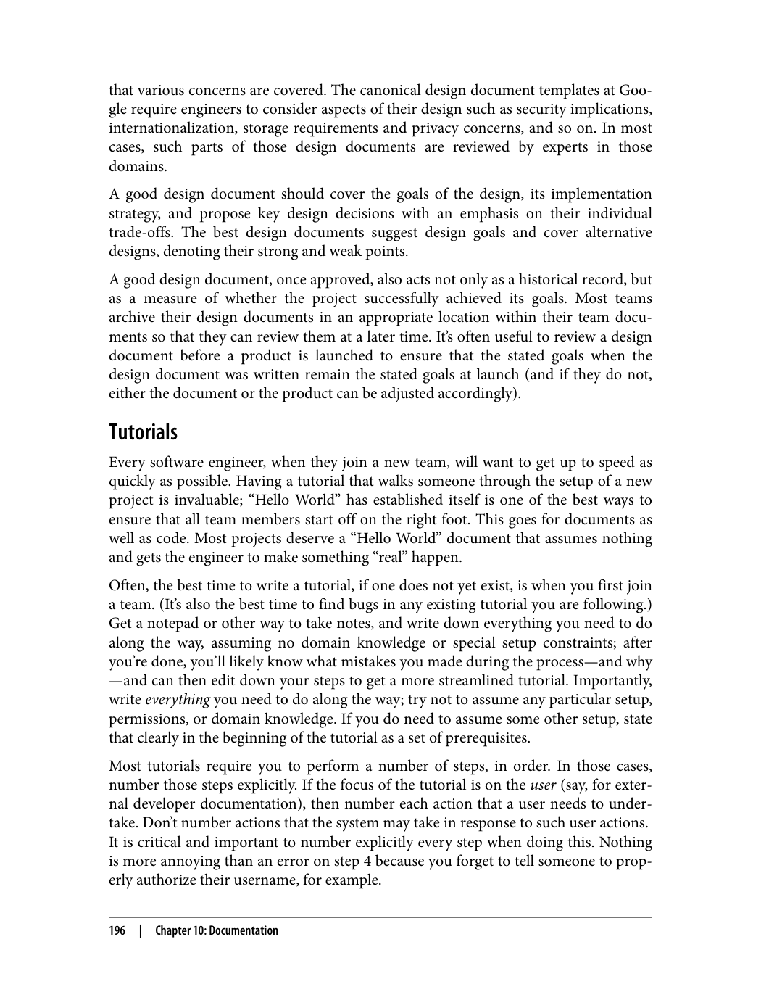
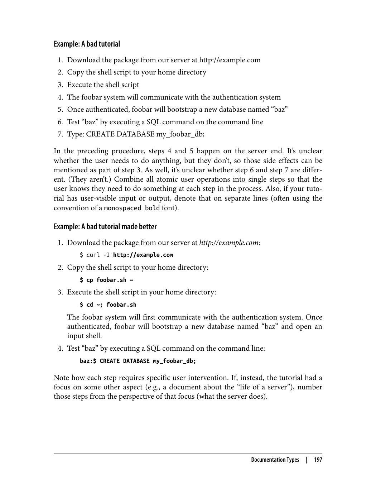
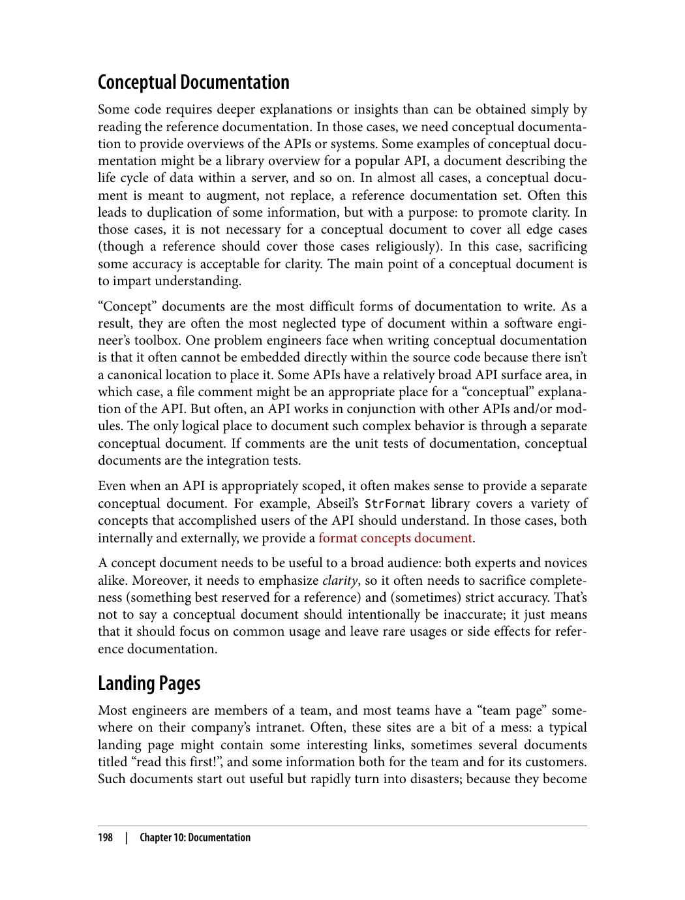

> **راهنمای مطالعه**
>
> در هر بخش، ابتدا متن اصلی کتاب به زبان انگلیسی آورده شده و سپس ترجمه و توضیحات فارسی همان بخش ارائه شده است.

---

###### 📄 صفحه ۲۰۵
> 7 Caitlin Sadowski, Emma Söderberg, Luke Church, Michal Sipko, and Alberto Bacchelli, "Modern code review:
> a case study at Google."
> 8 Ibid.
> Google are expected to be reviewed within about a day.7 (This doesn't necessarily
> mean that the review is over within a day, but that initial feedback is provided within
> a day.) About 35% of the changes at Google are to a single file.8 Being easy on a
> reviewer allows for quicker changes to the codebase and benefits the author as well.
> The author wants a quick review; waiting on an extensive review for a week or so
> would likely impact follow-on changes. A small initial review also can prevent much
> more expensive wasted effort on an incorrect approach further down the line.
> Because code reviews are typically small, it's common for almost all code reviews at
> Google to be reviewed by one and only one person. Were that not the case—if a team
> were expected to weigh in on all changes to a common codebase—there is no way the
> process itself would scale. By keeping the code reviews small, we enable this optimi‐
> zation. It's not uncommon for multiple people to comment on any given change—
> most code reviews are sent to a team member, but also CC'd to appropriate teams—
> but the primary reviewer is still the one whose LGTM is desired, and only one LGTM
> is necessary for any given change. Any other comments, though important, are still
> optional.
> Keeping changes small also allows the "approval" reviewers to more quickly approve
> any given changes. They can quickly inspect whether the primary code reviewer did
> due diligence and focus purely on whether this change augments the codebase while
> maintaining code health over time.
> Write Good Change Descriptions
> A change description should indicate its type of change on the first line, as a sum‐
> mary. The first line is prime real estate and is used to provide summaries within the
> code review tool itself, to act as the subject line in any associated emails, and to
> become the visible line Google engineers see in a history summary within Code
> Search (see Chapter 17), so that first line is important.
> Although the first line should be a summary of the entire change, the description
> should still go into detail on what is being changed and why. A description of "Bug
> fix" is not helpful to a reviewer or a future code archeologist. If several related modifi‐
> cations were made in the change, enumerate them within a list (while still keeping it
> on message and small). The description is the historical record for this change, and
> tools such as Code Search allow you to find who wrote what line in any particular
> change in the codebase. Drilling down into the original change is often useful when
> trying to fix a bug.
> 178
> |
> Chapter 9: Code Review

تغییرات در گوگل معمولاً ظرف حدود یک روز بازبینی می‌شوند.۷ (این لزوماً به این معنا نیست که بازبینی ظرف یک روز تمام می‌شود، بلکه بازخورد اولیه ظرف یک روز ارائه می‌شود.) حدود ۳۵٪ تغییرات در گوگل مربوط به یک فایل واحد است.۸ آسان بودن روی بازبینی‌کننده امکان تغییرات سریع‌تر در پایگاه کد را فراهم می‌کند و به نویسنده نیز سود می‌رساند. نویسنده بازبینی سریع می‌خواهد؛ انتظار برای بازبینی گسترده به مدت یک هفته احتمالاً بر تغییرات بعدی تأثیر می‌گذارد. یک بازبینی اولیه کوچک همچنین می‌تواند از صرف هزینه‌های بسیار بیشتر برای تلاش‌های بیهوده روی رویکرد نادرست در مراحل بعدی جلوگیری کند.

از آنجا که بازبینی‌های کد معمولاً کوچک هستند، رایج است که تقریباً تمام بازبینی‌های کد در گوگل توسط فقط یک نفر بازبینی شوند. اگر این‌طور نبود — اگر انتظار می‌رفت تیمی در تمام تغییرات یک پایگاه کد مشترک نظر دهد — راهی برای مقیاس‌پذیری خود فرآیند وجود نداشت. با کوچک نگه داشتن بازبینی‌های کد، این بهینه‌سازی را ممکن می‌سازیم. غیررایج نیست که چندین نفر در مورد یک تغییر خاص نظر دهند — بیشتر بازبینی‌های کد به یک عضو تیم ارسال می‌شوند، اما همچنین به تیم‌های مناسب CC می‌شوند — اما بازبین‌کننده اصلی همچنان کسی است که LGTM او مورد نظر است، و فقط یک LGTM برای هر تغییر خاص لازم است. سایر نظرات، هرچند مهم، همچنان اختیاری هستند.

کوچک نگه داشتن تغییرات همچنین به بازبینی‌کنندگان «تأیید» اجازه می‌دهد هر تغییر خاصی را سریع‌تر تأیید کنند. آن‌ها می‌توانند به سرعت بررسی کنند که آیا بازبین‌کننده اصلی کد وظیفه خود را به درستی انجام داده و صرفاً روی اینکه آیا این تغییر پایگاه کد را با حفظ سلامت کد در طول زمان افزایش می‌دهد تمرکز کنند.

**توصیف تغییرات خوب بنویسید**

توصیف تغییر باید نوع تغییر را در خط اول به عنوان خلاصه نشان دهد. خط اول فضای ارزشمندی است و برای ارائه خلاصه‌ها در ابزار بازبینی کد، به عنوان خط موضوع در ایمیل‌های مرتبط، و به عنوان خطی که مهندسان گوگل در خلاصه تاریخچه در Code Search (به فصل ۱۷ مراجعه کنید) مشاهده می‌کنند استفاده می‌شود، بنابراین آن خط اول مهم است.

اگرچه خط اول باید خلاصه‌ای از کل تغییر باشد، توصیف همچنان باید جزئیات اینکه چه چیزی تغییر می‌کند و چرا را شرح دهد. توصیف «رفع باگ» نه برای بازبینی‌کننده و نه برای باستان‌شناس آینده کد مفید است. اگر چندین اصلاح مرتبط در تغییر انجام شده، آن‌ها را در یک لیست فهرست کنید (در حالی که همچنان مختصر و مرتبط باقی بمانید). توصیف، سوابق تاریخی این تغییر است و ابزارهایی مانند Code Search به شما امکان می‌دهند پیدا کنید چه کسی چه خطی را در هر تغییر خاصی در پایگاه کد نوشته است. جستجو در تغییر اولیه اغلب هنگام تلاش برای رفع باگ مفید است.

---

###### 📄 صفحه ۲۱۰
> TL;DRs
> • Code review has many benefits, including ensuring code correctness, compre‐
> hension, and consistency across a codebase.
> • Always check your assumptions through someone else; optimize for the reader.
> • Provide the opportunity for critical feedback while remaining professional.
> • Code review is important for knowledge sharing throughout an organization.
> • Automation is critical for scaling the process.
> • The code review itself provides a historical record.
> TL;DRs
> |
> 183

**خلاصه**

• بازبینی کد (Code Review) مزایای بسیاری دارد، از جمله تضمین صحت کد، درک کد و یکپارچگی در سراسر پایگاه کد.
• همیشه فرضیات خود را از طریق شخص دیگری بررسی کنید؛ برای خواننده بهینه‌سازی کنید.
• فرصت بازخورد سازنده اما حرفه‌ای فراهم کنید.
• بازبینی کد برای اشتراک‌گذاری دانش در سراسر سازمان مهم است.
• خودکارسازی برای مقیاس‌پذیر کردن فرآیند حیاتی است.
• خود بازبینی کد یک سوابق تاریخی فراهم می‌کند.

**مزایای اصلی بررسی کد:**
1. **بهبود کیفیت کد**: شناسایی و رفع باگ‌ها قبل از انتشار
2. **اشتراک‌گذاری دانش**: یادگیری از کد دیگران
3. **بهبود خوانایی**: اطمینان از خوانایی کد
4. **ایجاد ثبات**: رعایت استانداردها و قوانین

---

###### 📄 صفحه ۲۱۵
> Documentation Is Like Code
> Software engineers who write in a single, primary programming language still often
> reach for different languages to solve specific problems. An engineer might write shell
> scripts or Python to run command-line tasks, or they might write most of their back‐
> end code in C++ but write some middleware code in Java, and so on. Each language
> is a tool in the toolbox.
> Documentation should be no different: it's a tool, written in a different language (usu‐
> ally English) to accomplish a particular task. Writing documentation is not much dif‐
> ferent than writing code. Like a programming language, it has rules, a particular
> syntax, and style decisions, often to accomplish a similar purpose as that within code:
> enforce consistency, improve clarity, and avoid (comprehension) errors. Within tech‐
> nical documentation, grammar is important not because one needs rules, but to
> standardize the voice and avoid confusing or distracting the reader. Google requires a
> certain comment style for many of its languages for this reason.
> Like code, documents should also have owners. Documents without owners become
> stale and difficult to maintain. Clear ownership also makes it easier to handle docu‐
> mentation through existing developer workflows: bug tracking systems, code review
> tooling, and so forth. Of course, documents with different owners can still conflict
> with one another. In those cases, it is important to designate canonical documenta‐
> tion: determine the primary source and consolidate other associated documents into
> that primary source (or deprecate the duplicates).
> The prevalent usage of "go/ links" at Google (see Chapter 3) makes this process easier.
> Documents with straightforward go/ links often become the canonical source of
> truth. One other way to promote canonical documents is to associate them directly
> with the code they document by placing them directly under source control and
> alongside the source code itself.
> Documentation is often so tightly coupled to code that it should, as much as possible,
> be treated as code. That is, your documentation should:
> • Have internal policies or rules to be followed
> • Be placed under source control
> • Have clear ownership responsible for maintaining the docs
> • Undergo reviews for changes (and change with the code it documents)
> • Have issues tracked, as bugs are tracked in code
> • Be periodically evaluated (tested, in some respect)
> • If possible, be measured for aspects such as accuracy, freshness, etc. (tools have
> still not caught up here)
> 188
> |
> Chapter 10: Documentation

**مستندات مانند کد است**

مهندسان نرم‌افزار که با یک زبان برنامه‌نویسی اصلی کار می‌کنند، باز هم اغلب از زبان‌های مختلف برای حل مشکلات خاص استفاده می‌کنند. یک مهندس ممکن است اسکریپت‌های شل (Shell) یا Python برای اجرای وظایف خط فرمان بنویسد، یا ممکن است بیشتر کد بک‌اند خود را به C++ بنویسد اما بخشی از کد میان‌افزار (Middleware) را به Java بنویسد، و غیره. هر زبان یک ابزار در جعبه ابزار است.

مستندات نباید متفاوت باشد: ابزاری است که به زبان دیگری (معمولاً انگلیسی) نوشته می‌شود تا یک وظیفه خاص را انجام دهد. نوشتن مستندات تفاوت چندانی با نوشتن کد ندارد. مانند یک زبان برنامه‌نویسی، قوانین، نحو (Syntax) خاص و تصمیمات سبک دارد و اغلب برای هدفی مشابه هدف در کد است: اجرای یکپارچگی، بهبود وضوح و جلوگیری از خطاهای (درک). در مستندات فنی، دستور زبان مهم است نه به این دلیل که به قوانین نیاز است، بلکه برای استانداردسازی لحن و جلوگیری از گیج کردن یا منحرف کردن خواننده. گوگل به همین دلیل یک سبک نظر خاص را برای بسیاری از زبان‌های خود الزام می‌کند.

مانند کد، مستندات نیز باید مالک داشته باشند. مستندات بدون مالک فرسوده و دشوار نگهداری می‌شوند. مالکیت روشن همچنین مدیریت مستندات را از طریق جریان کار موجود توسعه‌دهندگان آسان‌تر می‌کند: سیستم‌های ردیابی باگ، ابزارهای بازبینی کد و غیره. البته، مستندات با مالکان مختلف ممکن است همچنان با یکدیگر تعارض داشته باشند. در این موارد، تعیین مستندات اصلی (Canonical) مهم است: تعیین منبع اولیه و ادغام سایر مستندات مرتبط در آن منبع اولیه (یا منسوخ کردن نسخه‌های تکراری).

استفاده رایج از «go/ links» در گوگل (به فصل ۳ مراجعه کنید) این فرآیند را آسان‌تر می‌کند. مستنداتی با go/ links ساده اغلب منبع اصلی حقیقت می‌شوند. یک روش دیگر برای ترویج مستندات اصلی، اتصال مستقیم آن‌ها به کدی است که مستند می‌کنند با قرار دادن مستقیم آن‌ها تحت کنترل نسخه (Source Control) و در کنار خود کد منبع.

مستندات اغلب به شدت با کد جفت شده‌اند و باید تا حد امکان مانند کد رفتار شود. یعنی مستندات شما باید:

• سیاست‌ها یا قوانین داخلی قابل پیروی داشته باشد
• تحت کنترل نسخه قرار گیرد
• مالکیت روشنی مسئول نگهداری مستندات داشته باشد
• برای تغییرات بازبینی شود (و با کدی که مستند می‌کند تغییر کند)
• مشکلات ردیابی شوند، مانند باگ‌ها در کد
• به طور دوره‌ای ارزیابی شود (تست شود، از یک جهت)
• در صورت امکان، معیارهایی مانند دقت، تازگی و غیره اندازه‌گیری شود (ابزارها هنوز در اینجا به سطح مطلوب نرسیده‌اند)

**اصول بررسی کد:**
1. **حرفه‌ای بودن**: بررسی بر اساس کیفیت کد باشد، نه شخص
2. **سازنده بودن**: پیشنهادات بهبود ارائه شود
3. **مختصر بودن**: نظرات کوتاه و مفید باشند
4. **به‌موقع بودن**: بررسی به سرعت انجام شود

---

###### 📄 صفحه ۲۲۰
> that no one will read them; some notorious wiki pages scrolled through several doz‐
> ens of screens). Instead, make sure your document has a singular purpose, and if
> adding something to that page doesn't make sense, you probably want to find, or even
> create, another document for that purpose.
> Reference Documentation
> Reference documentation is the most common type that engineers need to write;
> indeed, they often need to write some form of reference documents every day. By ref‐
> erence documentation, we mean anything that documents the usage of code within
> the codebase. Code comments are the most common form of reference documenta‐
> tion that an engineer must maintain. Such comments can be divided into two basic
> camps: API comments versus implementation comments. Remember the audience
> differences between these two: API comments don't need to discuss implementation
> details or design decisions and can't assume a user is as versed in the API as the
> author. Implementation comments, on the other hand, can assume a lot more
> domain knowledge of the reader, though be careful in assuming too much: people
> leave projects, and sometimes it's safer to be methodical about exactly why you wrote
> this code the way you did.
> Most reference documentation, even when provided as separate documentation from
> the code, is generated from comments within the codebase itself. (As it should; refer‐
> ence documentation should be single-sourced as much as possible.) Some languages
> such as Java or Python have specific commenting frameworks (Javadoc, PyDoc,
> GoDoc) meant to make generation of this reference documentation easier. Other lan‐
> guages, such as C++, have no standard "reference documentation" implementation,
> but because C++ separates out its API surface (in header or .h files) from the imple‐
> mentation (.cc files), header files are often a natural place to document a C++ API.
> Google takes this approach: a C++ API deserves to have its reference documentation
> live within the header file. Other reference documentation is embedded directly in
> the Java, Python, and Go source code as well. Because Google's Code Search browser
> (see Chapter 17) is so robust, we've found little benefit to providing separate gener‐
> ated reference documentation. Users in Code Search not only search code easily, they
> can usually find the original definition of that code as the top result. Having the doc‐
> umentation alongside the code's definitions also makes the documentation easier to
> discover and maintain.
> We all know that code comments are essential to a well-documented API. But what
> precisely is a "good" comment? Earlier in this chapter, we identified two major audi‐
> ences for reference documentation: seekers and stumblers. Seekers know what they
> want; stumblers don't. The key win for seekers is a consistently commented codebase
> so that they can quickly scan an API and find what they are looking for. The key win
> for stumblers is clearly identifying the purpose of an API, often at the top of a file
> Documentation Types
> |
> 193

(اطمینان حاصل کنید) که هیچ‌کس آن‌ها را نخواهد خواند؛ برخی صفحات ویکی مشهور از ده‌ها صفحه نمایش عبور می‌کردند). در عوض، مطمئن شوید مستندات شما هدف واحدی دارد و اگر افزودن چیزی به آن صفحه منطقی نیست، احتمالاً باید یک مستند دیگر برای آن هدف پیدا کنید یا حتی ایجاد کنید.

**مستندات مرجع (Reference Documentation)**

مستندات مرجع رایج‌ترین نوعی است که مهندسان باید بنویسند؛ در واقع، آن‌ها اغلب باید هر روز نوعی مستندات مرجع بنویسند. منظور از مستندات مرجع هر چیزی است که استفاده از کد در پایگاه کد را مستند می‌کند. نظرات کد (Code Comments) رایج‌ترین شکل مستندات مرجع هستند که یک مهندس باید نگهداری کند. چنین نظراتی را می‌توان به دو دسته اصلی تقسیم کرد: نظرات API در مقابل نظرات پیاده‌سازی. تفاوت‌های مخاطب این دو را به خاطر بسپارید: نظرات API نیازی به بحث درباره جزئیات پیاده‌سازی یا تصمیمات طراحی ندارند و نمی‌توانند فرض کنند کاربر به اندازه نویسنده با API آشنا است. نظرات پیاده‌سازی، از طرف دیگر، می‌توانند دانش حوزه‌ای بیشتری از خواننده را فرض کنند، اما مراقب باشید بیش از حد فرض نکنید: افراد پروژه‌ها را ترک می‌کنند و گاهی اوقات ایمن‌تر است که به طور منظم درباره دقیقاً چرا این کد را به این شکل نوشتید توضیح دهید.

بیشتر مستندات مرجع، حتی زمانی که به صورت مستندات جداگانه از کد ارائه می‌شوند، از نظرات درون پایگاه کد تولید می‌شوند. (همان‌طور که باید باشد؛ مستندات مرجع باید تا حد امکان از یک منبع واحد تهیه شوند.) برخی زبان‌ها مانند Java یا Python چارچوب‌های نظردهی خاصی (Javadoc, PyDoc, GoDoc) دارند که برای تسهیل تولید این مستندات مرجع طراحی شده‌اند. سایر زبان‌ها، مانند C++، پیاده‌سازی استاندارد «مستندات مرجع» ندارند، اما از آنجا که C++ سطح API خود (در فایل‌های هدر یا .h) را از پیاده‌سازی (.cc files) جدا می‌کند، فایل‌های هدر اغلب مکان طبیعی برای مستندسازی یک API در C++ هستند. گوگل از این رویکرد استفاده می‌کند: یک API در C++ لایق آن است که مستندات مرجع آن در فایل هدر قرار گیرد. سایر مستندات مرجع نیز مستقیماً در کد منبع Java، Python و Go تعبیه شده‌اند. از آنجا که مرورگر Code Search گوگل (به فصل ۱۷ مراجعه کنید) بسیار قوی است، مزیت کمی در ارائه مستندات مرجع جداگانه تولید شده یافته‌ایم. کاربران در Code Search نه تنها به راحتی کد را جستجو می‌کنند، بلکه معمولاً تعریف اصلی آن کد را به عنوان اولین نتیجه پیدا می‌کنند. قرار دادن مستندات در کنار تعریف‌های کد همچنین کشف و نگهداری مستندات را آسان‌تر می‌کند.

همه می‌دانیم که نظرات کد برای یک API خوب مستند شده ضروری هستند. اما دقیقاً یک نظر «خوب» چیست؟ در ابتدای این فصل، دو مخاطب اصلی برای مستندات مرجع شناسایی کردیم: جستجوگران (Seekers) و تصادف‌کنندگان (Stumblers). جستجوگران می‌دانند چه می‌خواهند؛ تصادف‌کنندگان نمی‌دانند. پیروزی کلیدی برای جستجوگران یک پایگاه کد با نظرات یکپارچه است تا بتوانند به سرعت یک API را اسکن کنند و آنچه را که می‌خواهند پیدا کنند. پیروزی کلیدی برای تصادف‌کنندگان شناسایی واضح هدف یک API است، اغلب در بالای فایل.

**در پروژه‌های بزرگ، بررسی کد به حفظ کیفیت و ثبات کمک می‌کند. همچنین به اشتراک‌گذاری دانش بین اعضای تیم کمک می‌کند.**

---