> **راهنمای مطالعه**
>
> در هر بخش، ابتدا متن اصلی کتاب به زبان انگلیسی آورده شده و سپس ترجمه و توضیحات فارسی همان بخش ارائه شده است.

---
-

###### 📄 صفحه ۲۲۷
> Importantly, if documentation is tied into the engineering workflow, it will often
> improve over time. Most documents at Google now implicitly go through an audi‐
> ence review because at some point, their audience will be using them, and hopefully
> letting you know when they aren’t working (via bugs or other forms of feedback).
> Case Study: The Developer Guide Library
> As mentioned earlier, there were problems associated with having most (almost all)
> engineering documentation contained within a shared wiki: little ownership of
> important documentation, competing documentation, obsolete information, and dif‐
> ficulty in filing bugs or issues with documentation. But this problem was not seen in
> some documents: the Google C++ style guide was owned by a select group of senior
> engineers (style arbiters) who managed it. The document was kept in good shape
> because certain people cared about it. They implicitly owned that document. The
> document was also canonical: there was only one C++ style guide.
> As previously mentioned, documentation that sits directly within source code is one
> way to promote the establishment of canonical documents; if the documentation sits
> alongside the source code, it should usually be the most applicable (hopefully). At
> Google, each API usually has a separate g3doc directory where such documents live
> (written as Markdown files and readable within our Code Search browser). Having
> the documentation exist alongside the source code not only establishes de facto own‐
> ership, it makes the documentation seem more wholly “part” of the code.
> Some documentation sets, however, cannot exist very logically within source code. A
> “C++ developer guide” for Googlers, for example, has no obvious place to sit within
> the source code. There is no master “C++” directory where people will look for such
> information. In this case (and others that crossed API boundaries), it became useful
> to create standalone documentation sets in their own depot. Many of these culled
> together associated existing documents into a common set, with common navigation
> and look-and-feel. Such documents were noted as “Developer Guides” and, like the
> code in the codebase, were under source control in a specific documentation depot,
> with this depot organized by topic rather than API. Often, technical writers managed
> these developer guides, because they were better at explaining topics across API
> boundaries.
> Over time, these developer guides became canonical. Users who wrote competing or
> supplementary documents became amenable to adding their documents to the can‐
> onical document set after it was established, and then deprecating their competing
> documents. Eventually, the C++ style guide became part of a larger “C++ Developer
> Guide.” As the documentation set became more comprehensive and more authorita‐
> tive, its quality also improved. Engineers began logging bugs because they knew
> someone was maintaining these documents. Because the documents were locked
> down under source control, with proper owners, engineers also began sending
> changelists directly to the technical writers.
> 200
> |
> Chapter 10: Documentation

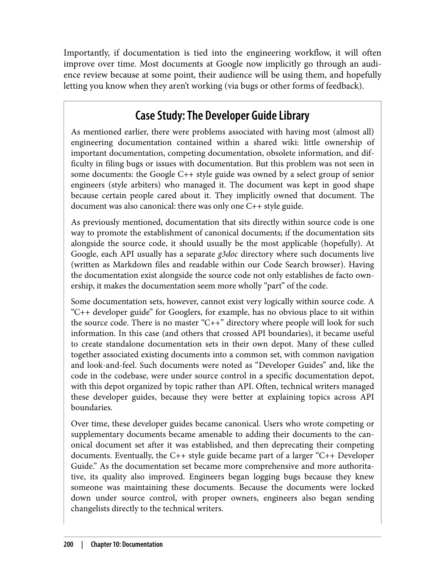

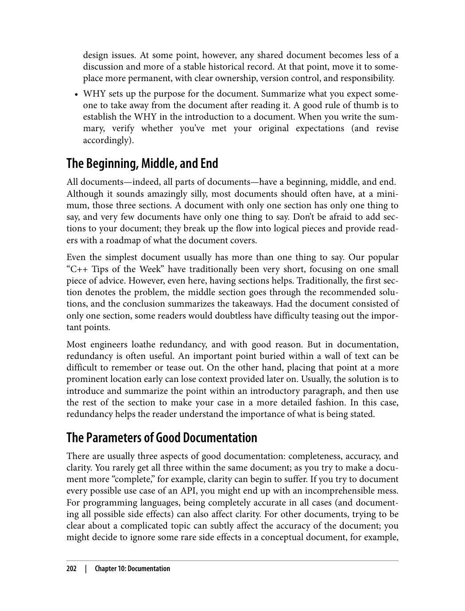

---

###### 📄 صفحه ۲۳۱
> date within the document itself with a byline of “Last reviewed by...” led to increased
> adoption as well.
> When Do You Need Technical Writers?
> When Google was young and growing, there weren’t enough technical writers in soft‐
> ware engineering. (That’s still the case.) Those projects deemed important tended to
> receive a technical writer, regardless of whether that team really needed one. The idea
> was that the writer could relieve the team of some of the burden of writing and main‐
> taining documents and (theoretically) allow the important project to achieve greater
> velocity. This turned out to be a bad assumption.
> We learned that most engineering teams can write documentation for themselves
> (their team) perfectly fine; it’s only when they are writing documents for another
> audience that they tend to need help because it’s difficult to write to another audience.
> The feedback loop within your team regarding documents is more immediate, the
> domain knowledge and assumptions are clearer, and the perceived needs are more
> obvious. Of course, a technical writer can often do a better job with grammar and
> organization, but supporting a single team isn’t the best use of a limited and special‐
> ized resource; it doesn’t scale. It introduced a perverse incentive: become an impor‐
> tant project and your software engineers won’t need to write documents.
> Discouraging engineers from writing documents turns out to be the opposite of what
> you want to do.
> Because they are a limited resource, technical writers should generally focus on tasks
> that software engineers don’t need to do as part of their normal duties. Usually, this
> involves writing documents that cross API boundaries. Project Foo might clearly
> know what documentation Project Foo needs, but it probably has a less clear idea
> what Project Bar needs. A technical writer is better able to stand in as a person unfa‐
> miliar with the domain. In fact, it’s one of their critical roles: to challenge the assump‐
> tions your team makes about the utility of your project. It’s one of the reasons why
> many, if not most, software engineering technical writers tend to focus on this spe‐
> cific type of API documentation.
> Conclusion
> Google has made good strides in addressing documentation quality over the past dec‐
> ade, but to be frank, documentation at Google is not yet a first-class citizen. For com‐
> parison, engineers have gradually accepted that testing is necessary for any code
> change, no matter how small. As well, testing tooling is robust, varied and plugged
> into an engineering workflow at various points. Documentation is not ingrained at
> nearly the same level.
> 204
> |
> Chapter 10: Documentation

بدون سیستم کنترل نسخه، مدیریت تغییرات در پروژه‌های تیمی بسیار دشوار می‌شود. این سیستم به ثبت تغییرات، بازگردانی و هماهنگی بین اعضای تیم کمک می‌کند.

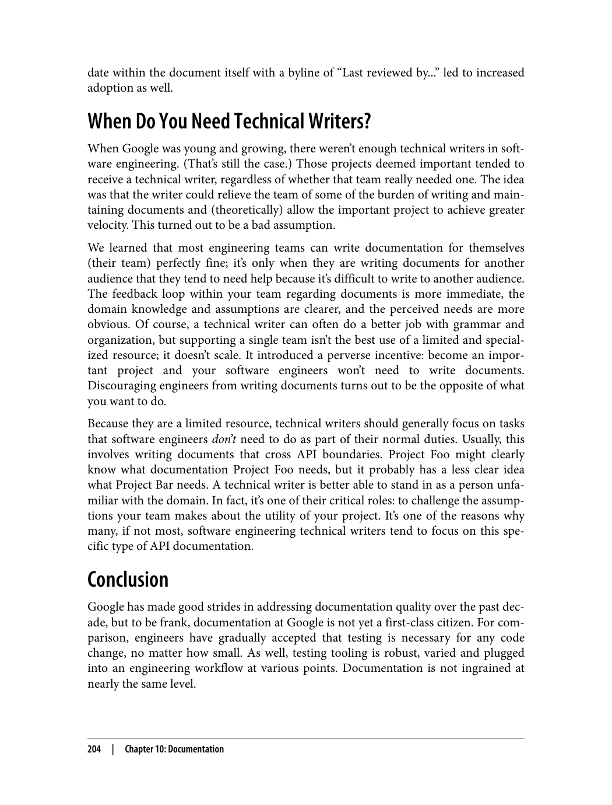

---

###### 📄 صفحه ۲۳۵
> The act of writing tests also improves the design of your systems. As the first clients
> of your code, a test can tell you much about your design choices. Is your system too
> tightly coupled to a database? Does the API support the required use cases? Does
> your system handle all of the edge cases? Writing automated tests forces you to con‐
> front these issues early on in the development cycle. Doing so generally leads to more
> modular software that enables greater flexibility later on.
> Much ink has been spilled about the subject of testing software, and for good reason:
> for such an important practice, doing it well still seems to be a mysterious craft to
> many. At Google, while we have come a long way, we still face difficult problems get‐
> ting our processes to scale reliably across the company. In this chapter, we’ll share
> what we have learned to help further the conversation.
> Why Do We Write Tests?
> To better understand how to get the most out of testing, let’s start from the beginning.
> When we talk about automated testing, what are we really talking about?
> The simplest test is defined by:
> • A single behavior you are testing, usually a method or API that you are calling
> • A specific input, some value that you pass to the API
> • An observable output or behavior
> • A controlled environment such as a single isolated process
> When you execute a test like this, passing the input to the system and verifying the
> output, you will learn whether the system behaves as you expect. Taken in aggregate,
> hundreds or thousands of simple tests (usually called a test suite) can tell you how
> well your entire product conforms to its intended design and, more important, when
> it doesn’t.
> Creating and maintaining a healthy test suite takes real effort. As a codebase grows,
> so too will the test suite. It will begin to face challenges like instability and slowness. A
> failure to address these problems will cripple a test suite. Keep in mind that tests
> derive their value from the trust engineers place in them. If testing becomes a pro‐
> ductivity sink, constantly inducing toil and uncertainty, engineers will lose trust and
> begin to find workarounds. A bad test suite can be worse than no test suite at all.
> In addition to empowering companies to build great products quickly, testing is
> becoming critical to ensuring the safety of important products and services in our
> lives. Software is more involved in our lives than ever before, and defects can cause
> 208
> |
> Chapter 11: Testing Overview

1. **سیستم‌های متمرکز**: مانند SVN، یک مخزن مرکزی دارند
2. **سیستم‌های توزیع‌شده**: مانند Git، هر کاربر یک کپی کامل از مخزن دارد

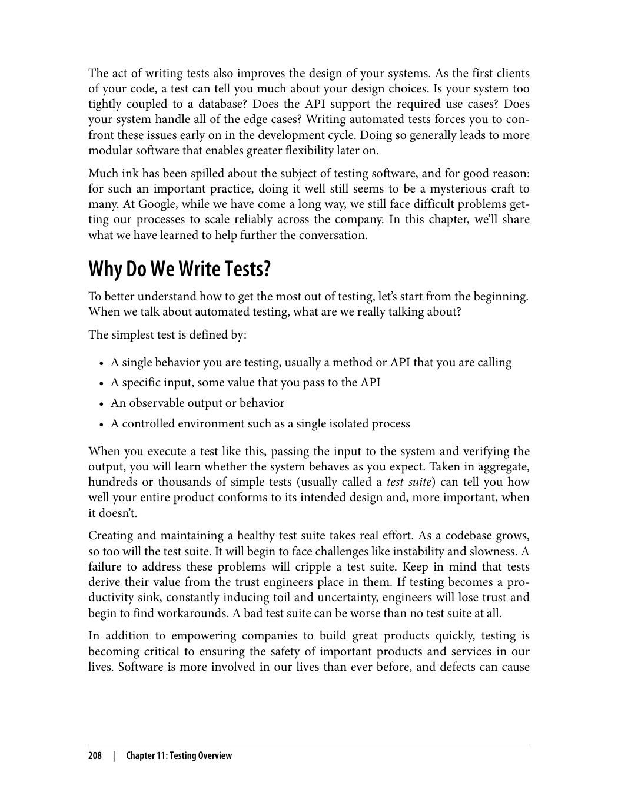

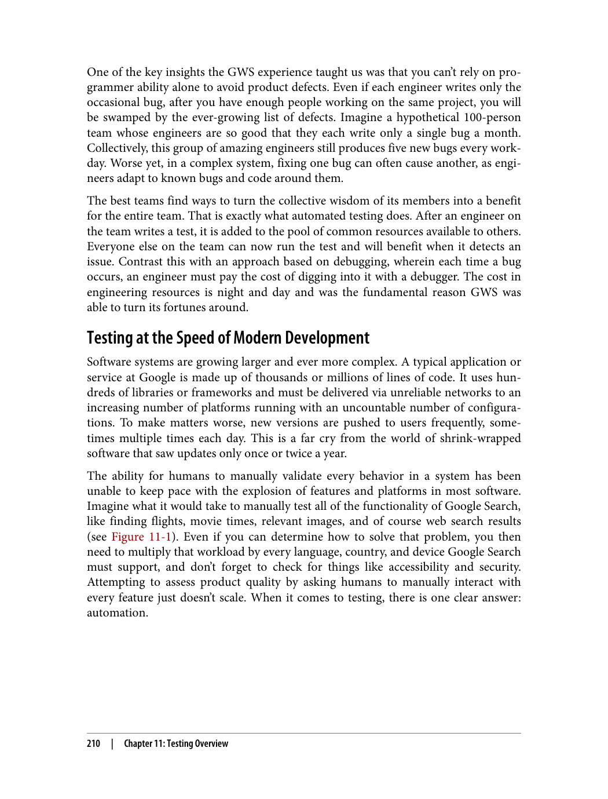

---

###### 📄 صفحه ۲۳۹
> Write, Run, React
> In its purest form, automating testing consists of three activities: writing tests, run‐
> ning tests, and reacting to test failures. An automated test is a small bit of code, usu‐
> ally a single function or method, that calls into an isolated part of a larger system that
> you want to test. The test code sets up an expected environment, calls into the system,
> usually with a known input, and verifies the result. Some of the tests are very small,
> exercising a single code path; others are much larger and can involve entire systems,
> like a mobile operating system or web browser.
> Example 11-1 presents a deliberately simple test in Java using no frameworks or test‐
> ing libraries. This is not how you would write an entire test suite, but at its core every
> automated test looks similar to this very simple example.
> Example 11-1. An example test
> // Verifies a Calculator class can handle negative results.
> public void main(String[] args) {
> Calculator calculator = new Calculator();
> int expectedResult = -3;
> int actualResult = calculator.subtract(2, 5); // Given 2, Subtracts 5.
> assert(expectedResult == actualResult);
> }
> Unlike the QA processes of yore, in which rooms of dedicated software testers pored
> over new versions of a system, exercising every possible behavior, the engineers who
> build systems today play an active and integral role in writing and running automated
> tests for their own code. Even in companies where QA is a prominent organization,
> developer-written tests are commonplace. At the speed and scale that today’s systems
> are being developed, the only way to keep up is by sharing the development of tests
> around the entire engineering staff.
> Of course, writing tests is different from writing good tests. It can be quite difficult to
> train tens of thousands of engineers to write good tests. We will discuss what we have
> learned about writing good tests in the chapters that follow.
> Writing tests is only the first step in the process of automated testing. After you have
> written tests, you need to run them. Frequently. At its core, automated testing con‐
> sists of repeating the same action over and over, only requiring human attention
> when something breaks. We will discuss this Continuous Integration (CI) and testing
> in Chapter 23. By expressing tests as code instead of a manual series of steps, we can
> run them every time the code changes—easily thousands of times per day. Unlike
> human testers, machines never grow tired or bored.
> Another benefit of having tests expressed as code is that it is easy to modularize them
> for execution in various environments. Testing the behavior of Gmail in Firefox
> 212
> |
> Chapter 11: Testing Overview

شاخه‌ها به توسعه‌دهندگان اجازه می‌دهند تا به طور همزمان روی ویژگی‌های مختلف کار کنند. ادغام شاخه‌ها نیز باید به درستی مدیریت شود تا تعارضات حل شوند.

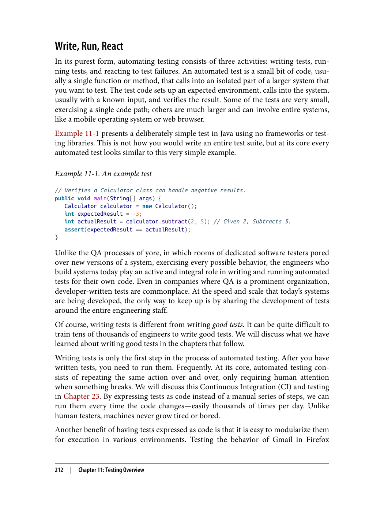

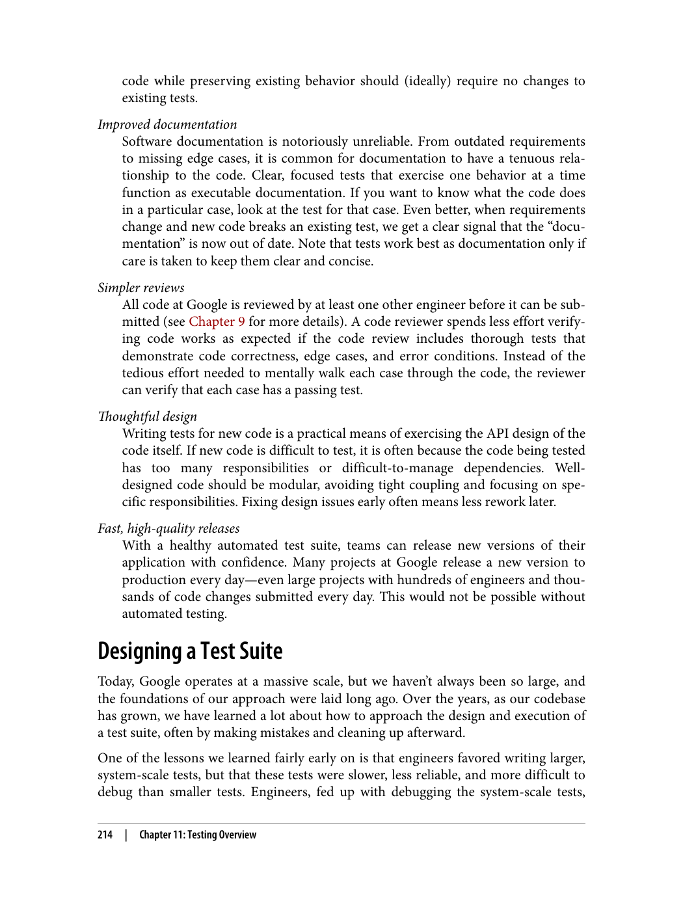

---

###### 📄 صفحه ۲۴۳
> 5 There is a little wiggle room in this policy. Tests are allowed to access a filesystem if they use a hermetic, in-
> memory implementation.
> We make this distinction, as opposed to the more traditional “unit” or “integration,”
> because the most important qualities we want from our test suite are speed and deter‐
> minism, regardless of the scope of the test. Small tests, regardless of the scope, are
> almost always faster and more deterministic than tests that involve more infrastruc‐
> ture or consume more resources. Placing restrictions on small tests makes speed and
> determinism much easier to achieve. As test sizes grow, many of the restrictions are
> relaxed. Medium tests have more flexibility but also more risk of nondeterminism.
> Larger tests are saved for only the most complex and difficult testing scenarios. Let’s
> take a closer look at the exact constraints imposed on each type of test.
> Small tests
> Small tests are the most constrained of the three test sizes. The primary constraint is
> that small tests must run in a single process. In many languages, we restrict this even
> further to say that they must run on a single thread. This means that the code per‐
> forming the test must run in the same process as the code being tested. You can’t run
> a server and have a separate test process connect to it. It also means that you can’t run
> a third-party program such as a database as part of your test.
> The other important constraints on small tests are that they aren’t allowed to sleep,
> perform I/O operations,5 or make any other blocking calls. This means that small
> tests aren’t allowed to access the network or disk. Testing code that relies on these
> sorts of operations requires the use of test doubles (see Chapter 13) to replace the
> heavyweight dependency with a lightweight, in-process dependency.
> The purpose of these restrictions is to ensure that small tests don’t have access to the
> main sources of test slowness or nondeterminism. A test that runs on a single process
> and never makes blocking calls can effectively run as fast as the CPU can handle. It’s
> difficult (but certainly not impossible) to accidentally make such a test slow or non‐
> deterministic. The constraints on small tests provide a sandbox that prevents engi‐
> neers from shooting themselves in the foot.
> These restrictions might seem excessive at first, but consider a modest suite of a cou‐
> ple hundred small test cases running throughout the day. If even a few of them fail
> nondeterministically (often called flaky tests), tracking down the cause becomes a
> serious drain on productivity. At Google’s scale, such a problem could grind our test‐
> ing infrastructure to a halt.
> At Google, we encourage engineers to try to write small tests whenever possible,
> regardless of the scope of the test, because it keeps the entire test suite running fast
> and reliably. For more discussion on small versus unit tests, see Chapter 12.
> 216
> |
> Chapter 11: Testing Overview

گوگل از مونوریپو استفاده می‌کند، در حالی که بسیاری از سازمان‌ها از ریپوزیتوری‌های جداگانه استفاده می‌کنند. هر کدام مزایا و معایب خود را دارند.

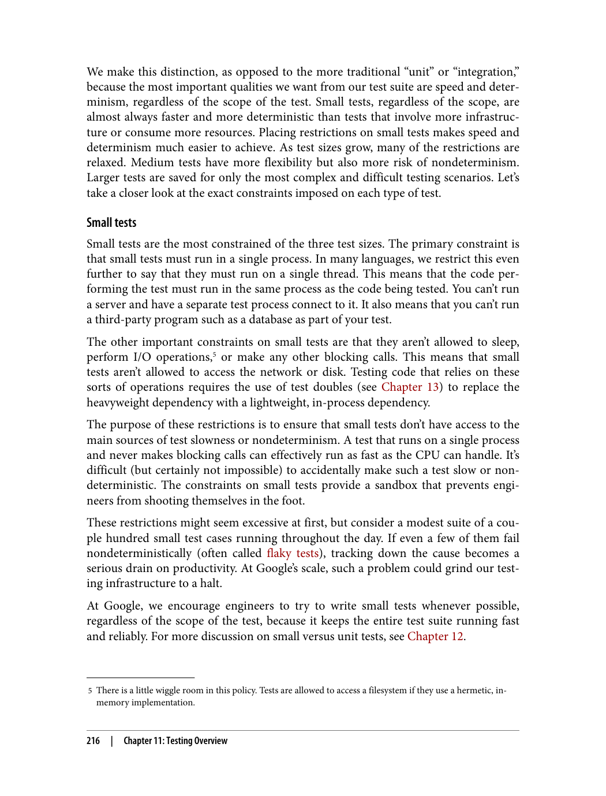

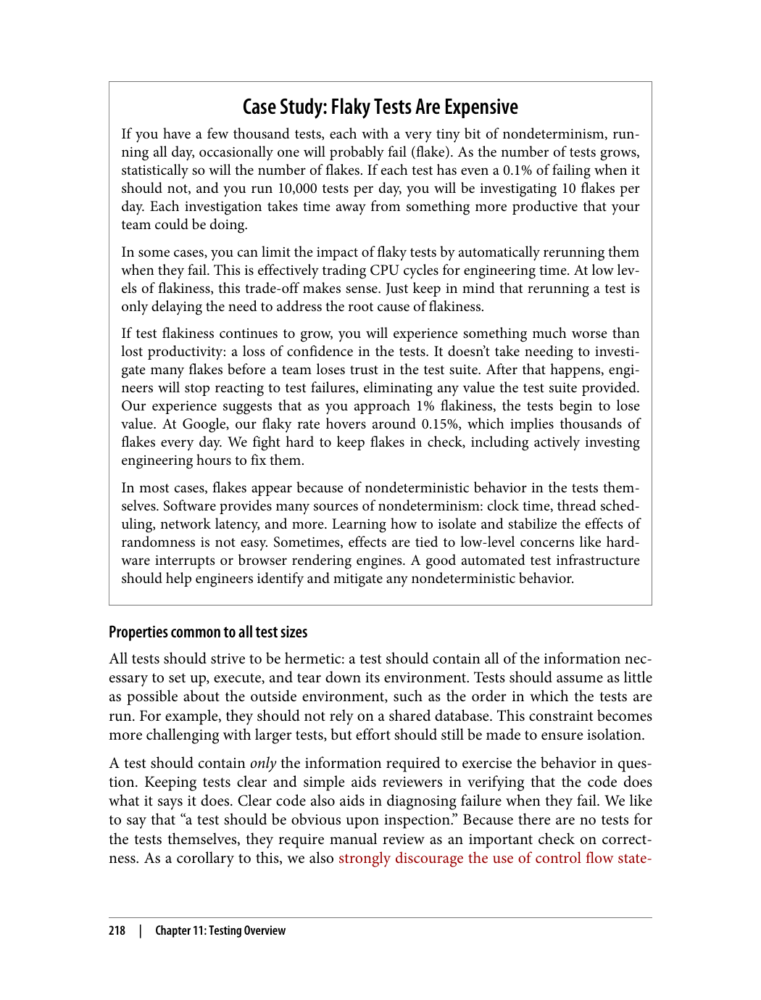

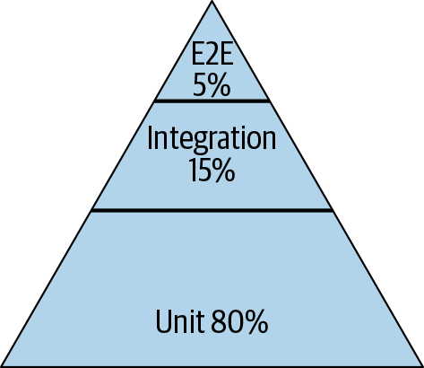

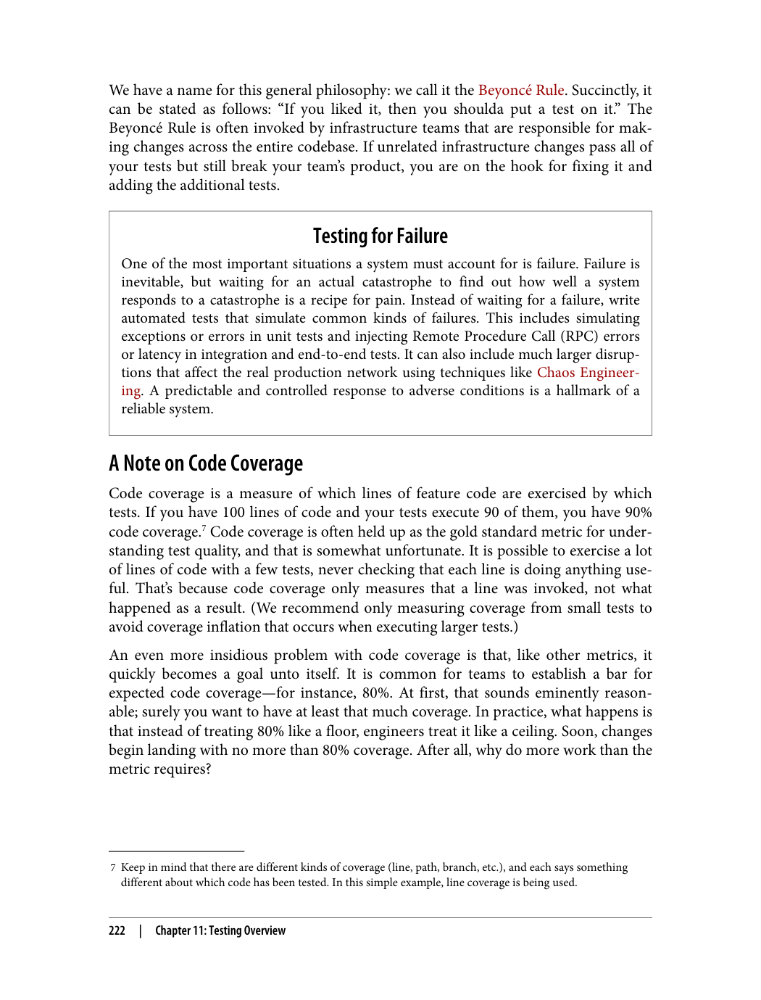

---
