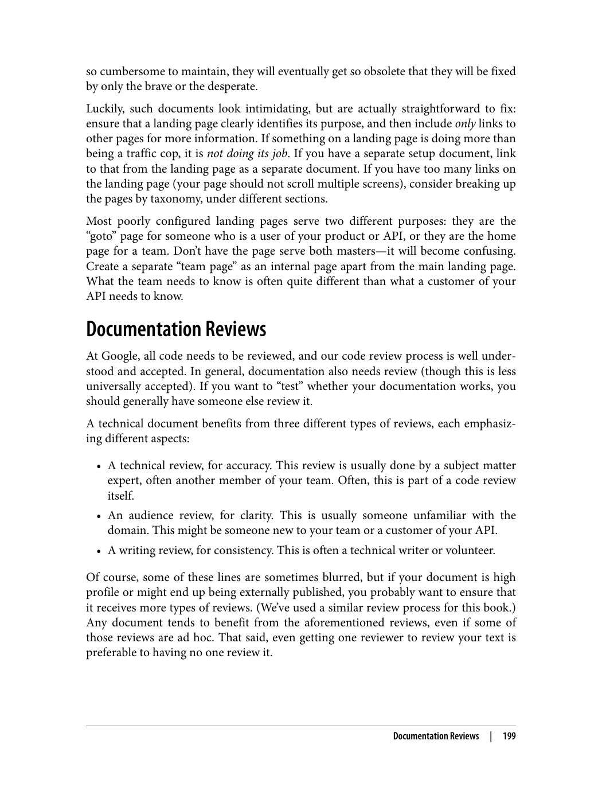
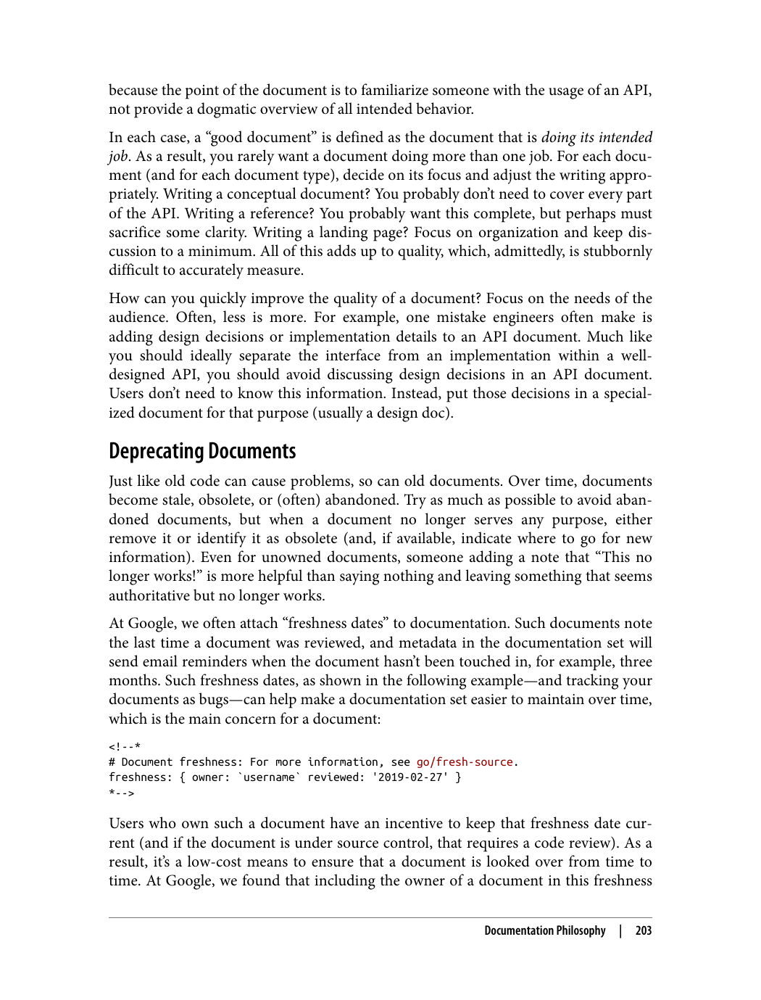
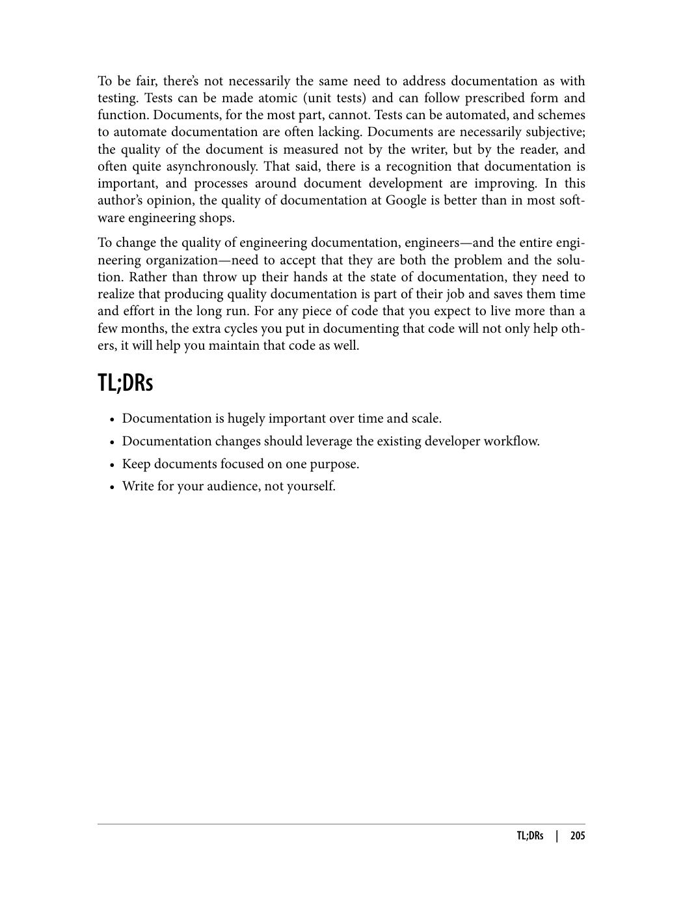
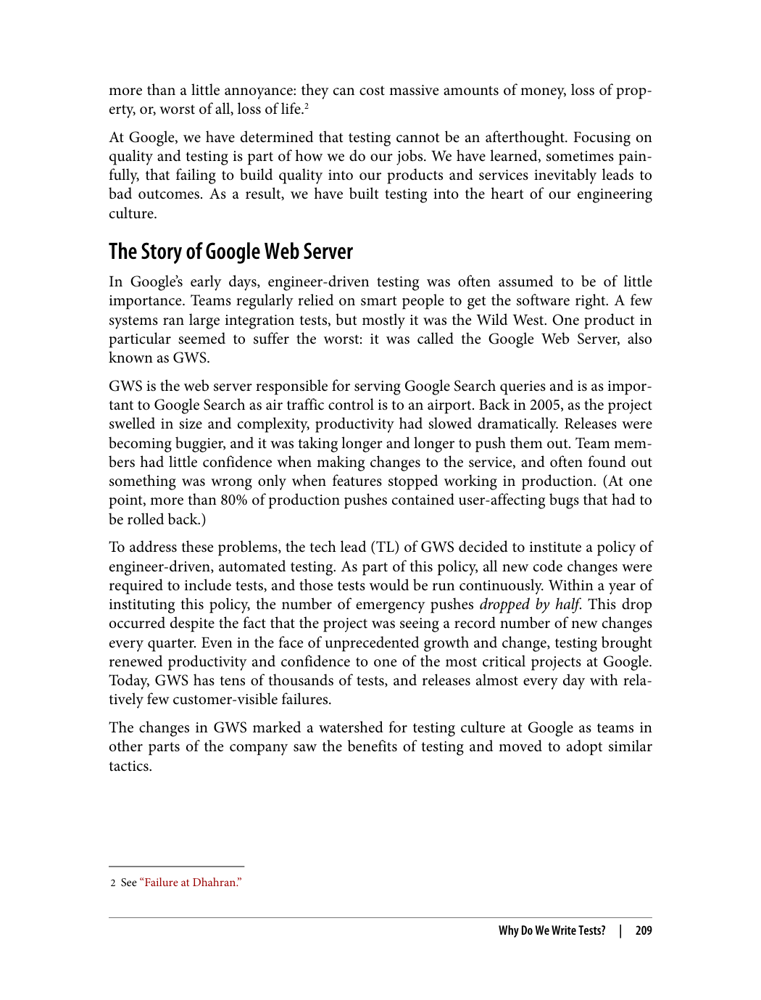
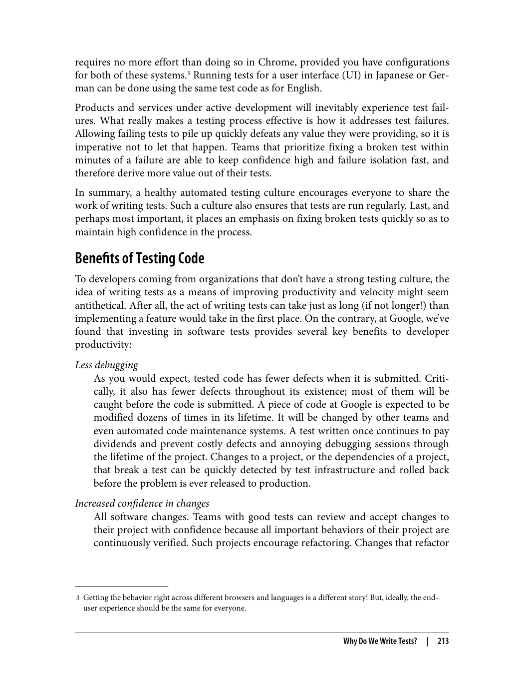
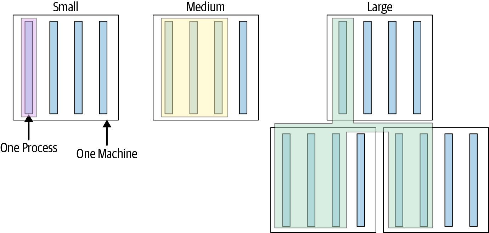
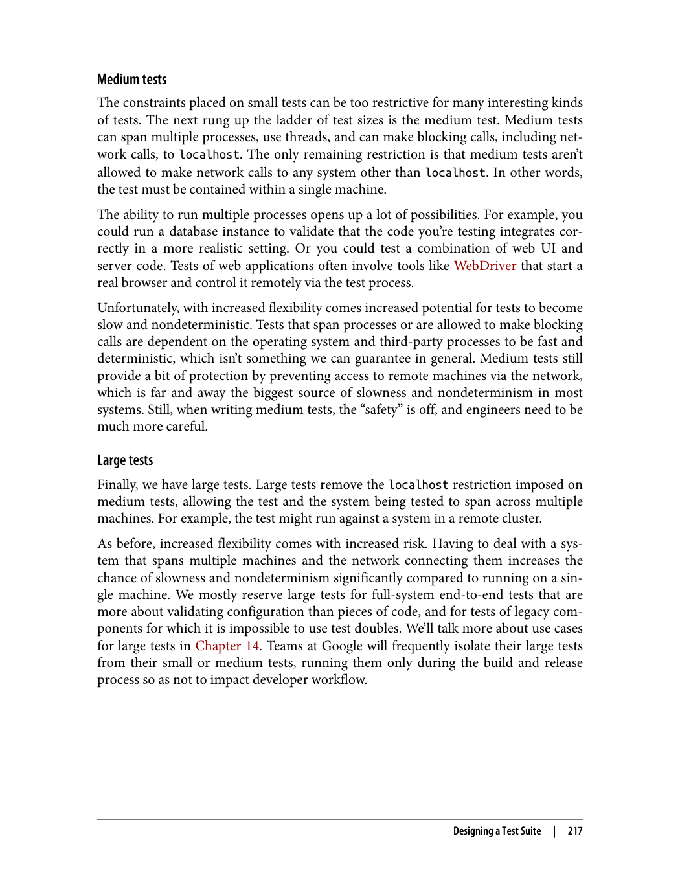
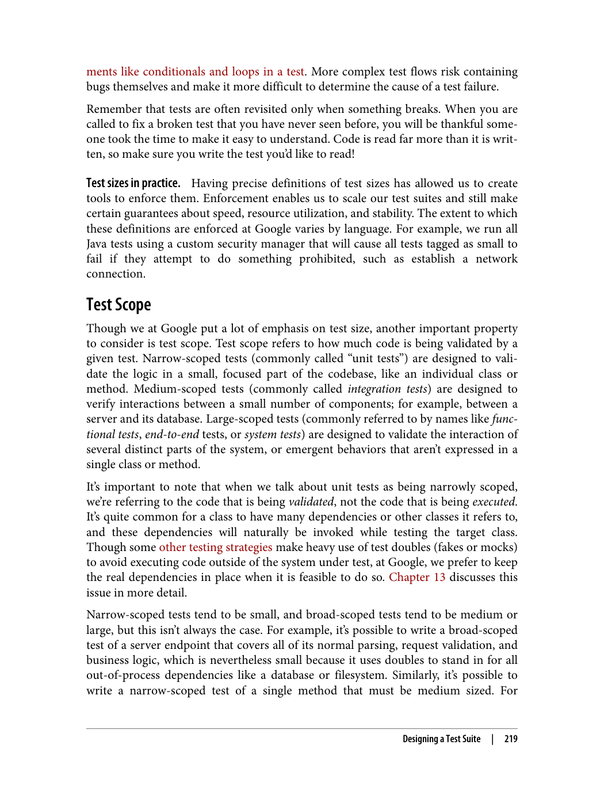
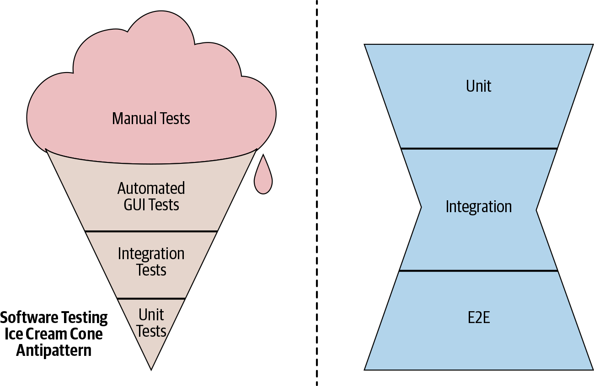

## فصل ۱۱: سیستم‌های کنترل نسخه

---

> "سیستم کنترل نسخه، ابزاری حیاتی برای مدیریت تغییرات در کد است. انتخاب بین سیستم‌های متمرکز و توزیع‌شده، تصمیمی مهم است."

### اهمیت کنترل نسخه

> "کنترل نسخه به مدیریت تغییرات در کد و هماهنگی بین اعضای تیم کمک می‌کند."

بدون سیستم کنترل نسخه، مدیریت تغییرات در پروژه‌های تیمی بسیار دشوار می‌شود. این سیستم به ثبت تغییرات، بازگردانی و هماهنگی بین اعضای تیم کمک می‌کند.

### سیستم‌های متمرکز در مقابل توزیع‌شده

> "سیستم‌های متمرکز و توزیع‌شده هر کدام مزایا و معایب خود را دارند."

1. **سیستم‌های متمرکز**: مانند SVN، یک مخزن مرکزی دارند
2. **سیستم‌های توزیع‌شده**: مانند Git، هر کاربر یک کپی کامل از مخزن دارد

### شاخه‌ها و ادغام

> "مدیریت شاخه‌ها و ادغام تغییرات، یکی از مهم‌ترین جنبه‌های کنترل نسخه است."

شاخه‌ها به توسعه‌دهندگان اجازه می‌دهند تا به طور همزمان روی ویژگی‌های مختلف کار کنند. ادغام شاخه‌ها نیز باید به درستی مدیریت شود تا تعارضات حل شوند.

### مونوریپو در مقابل ریپوزیتوری‌های جداگانه

> "انتخاب بین مونوریپو و ریپوزیتوری‌های جداگانه، تصمیمی مهم در مهندسی نرم‌افزار است."

گوگل از مونوریپو استفاده می‌کند، در حالی که بسیاری از سازمان‌ها از ریپوزیتوری‌های جداگانه استفاده می‌کنند. هر کدام مزایا و معایب خود را دارند.

---