> **راهنمای مطالعه**
>
> در هر بخش، ابتدا متن اصلی کتاب به زبان انگلیسی آورده شده و سپس ترجمه و توضیحات فارسی همان بخش ارائه شده است.

---

###### 📄 صفحه ۲۵۱
> For more information on TAP and our CI philosophy, see
> Chapter 23.
> Whether you are considering our size, our monorepo, or the number of products we
> offer, Google's engineering environment is complex. Every week it experiences mil‐
> lions of changing lines, billions of test cases being run, tens of thousands of binaries
> being built, and hundreds of products being updated—talk about complicated!
> The Pitfalls of a Large Test Suite
> As a codebase grows, you will inevitably need to make changes to existing code.
> When poorly written, automated tests can make it more difficult to make those
> changes. Brittle tests—those that over-specify expected outcomes or rely on extensive
> and complicated boilerplate—can actually resist change. These poorly written tests
> can fail even when unrelated changes are made.
> If you have ever made a five-line change to a feature only to find dozens of unrelated,
> broken tests, you have felt the friction of brittle tests. Over time, this friction can
> make a team reticent to perform necessary refactoring to keep a codebase healthy.
> The subsequent chapters will cover strategies that you can use to improve the robust‐
> ness and quality of your tests.
> Some of the worst offenders of brittle tests come from the misuse of mock objects.
> Google's codebase has suffered so badly from an abuse of mocking frameworks that it
> has led some engineers to declare "no more mocks!" Although that is a strong state‐
> ment, understanding the limitations of mock objects can help you avoid misusing
> them.
> For more information on working effectively with mock objects,
> see Chapter 13.
> In addition to the friction caused by brittle tests, a larger suite of tests will be slower
> to run. The slower a test suite, the less frequently it will be run, and the less benefit it
> provides. We use a number of techniques to speed up our test suite, including paral‐
> lelizing execution and using faster hardware. However, these kinds of tricks are even‐
> tually swamped by a large number of individually slow test cases.
> Tests can become slow for many reasons, like booting significant portions of a sys‐
> tem, firing up an emulator before execution, processing large datasets, or waiting for
> disparate systems to synchronize. Tests often start fast enough but slow down as the
> 224
> |
> Chapter 11: Testing Overview

برای اطلاعات بیشتر درباره TAP و فلسفه CI ما، به فصل ۲۳ مراجعه کنید.

چه اندازه ما، مونوریپو (Monorepo) ما، یا تعداد محصولاتی که ارائه می‌دهیم را در نظر بگیرید، محیط مهندسی گوگل پیچیده است. هر هفته میلیون‌ها خط تغییر، میلیاردها مورد تست، ده‌ها هزار باینری (Binary) ساخته شده و صدها محصول به‌روزرسانی شده را تجربه می‌کند — از پیچیدگی صحبت کنید!

**تله‌های یک مجموعه تست بزرگ**

با رشد پایگاه کد، اجتناب ناپذیر است که نیاز به ایجاد تغییرات در کد موجود داشته باشید. وقتی تست‌ها بد نوشته شده باشند، تست‌های خودکار می‌توانند ایجاد آن تغییرات را دشوارتر کنند. تست‌های شکننده (Brittle Tests) — آن‌هایی که بیش از حد نتایج مورد انتظار را مشخص می‌کنند  به الگوهای گسترده و پیچیده وابسته هستند — در واقع می‌توانند در برابر تغییر مقاومت کنند. این تست‌های بد نوشته حتی وقتی تغییرات بی‌ارتباط انجام می‌شوند می‌توانند شکست بخورند.

اگر تا به حال یک تغییر پنج خطی به یک ویژگی اعمال کرده‌اید و ده‌ها تست شکسته بی‌ارتباط پیدا کرده‌اید، اصطکاک تست‌های شکننده را احساس کرده‌اید. در طول زمان، این اصطکاک می‌تواند تیم را از انجام بازسازی (Refactoring) ضروری برای سالم نگه داشتن پایگاه کد بازدارد. فصل‌های بعدی استراتژی‌هایی را پوشش می‌دهند که می‌توانید برای بهبود استحکام و کیفیت测试‌های خود استفاده کنید.

برخی از بدترین متخلفان测试‌های شکننده از سوءاستفاده از شیءهای Mock (Mock Objects) ناشی می‌شوند. پایگاه کد گوگل آسیب بدی از سوءاستفاده از چارچوب‌های Mocking دیده است که برخی مهندسان را به اعلام «دیگر Mock نه!» سوق داده است. اگرچه این بیانیه قوی‌ای است، درک محدودیت‌های Mock Objects می‌تواند به شما کمک کند از سوءاستفاده از آن‌ها جلوگیری کنید.

برای اطلاعات بیشتر درباره کار مؤثر با Mock Objects، به فصل ۱۳ مراجعه کنید.

علاوه بر اصطکاک ناشی از测试‌های شکننده، مجموعه测试 بزرگ‌تر کندتر اجرا می‌شود. هرچه م集合ه测试 کندتر باشد، کمتر اجرا می‌شود و سود کمتری ارائه می‌دهد. ما از تکنیک‌های مختلفی برای سرعت بخشیدن به م集合ه测试 خود استفاده می‌کنیم، از جمله موازی‌سازی اجرا و استفاده از سخت‌افزار سریع‌تر. با این حال، این نوع ترفندها در نهایت با تعداد زیادی از موارد测试 کند منفرد غرق می‌شوند.

تست‌ها می‌توانند به دلایل زیادی کند شوند، مانند راه‌اندازی بخش‌های قابل توجهی از یک سیستم، روشن کردن یک شبیه‌ساز قبل از اجرا، پردازش مجموعه داده‌های بزرگ یا انتظار برای هماهنگی سیستم‌های مختلف. تست‌ها اغلب به اندازه کافی سریع شروع می‌شوند اما کند می‌شوند.


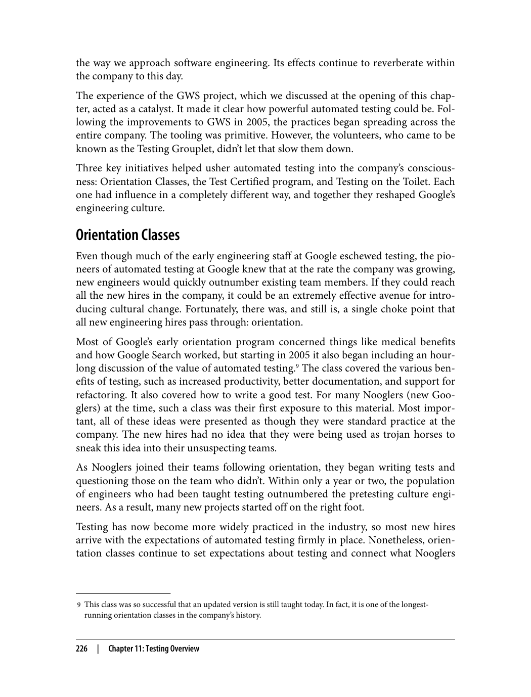


---

###### 📄 صفحه ۲۵۶
> Over time, testing has become an integral part of Google's engineering culture. We
> have myriad ways to reinforce its value to engineers across the company. Through a
> combination of training, gentle nudges, mentorship, and, yes, even a little friendly
> competition, we have created the clear expectation that testing is everyone's job.
> Why didn't we start by mandating the writing of tests?
> The Testing Grouplet had considered asking for a testing mandate from senior lead‐
> ership but quickly decided against it. Any mandate on how to develop code would be
> seriously counter to Google culture and likely slow the progress, independent of the
> idea being mandated. The belief was that successful ideas would spread, so the focus
> became demonstrating success.
> If engineers were deciding to write tests on their own, it meant that they had fully
> accepted the idea and were likely to keep doing the right thing—even if no one was
> compelling them to.
> The Limits of Automated Testing
> Automated testing is not suitable for all testing tasks. For example, testing the quality
> of search results often involves human judgment. We conduct targeted, internal stud‐
> ies using Search Quality Raters who execute real queries and record their impres‐
> sions. Similarly, it is difficult to capture the nuances of audio and video quality in an
> automated test, so we often use human judgment to evaluate the performance of tel‐
> ephony or video-calling systems.
> In addition to qualitative judgements, there are certain creative assessments at which
> humans excel. For example, searching for complex security vulnerabilities is some‐
> thing that humans do better than automated systems. After a human has discovered
> and understood a flaw, it can be added to an automated security testing system like
> Google's Cloud Security Scanner where it can be run continuously and at scale.
> A more generalized term for this technique is Exploratory Testing. Exploratory Test‐
> ing is a fundamentally creative endeavor in which someone treats the application
> under test as a puzzle to be broken, maybe by executing an unexpected set of steps or
> by inserting unexpected data. When conducting an exploratory test, the specific
> problems to be found are unknown at the start. They are gradually uncovered by
> probing commonly overlooked code paths or unusual responses from the application.
> As with the detection of security vulnerabilities, as soon as an exploratory test discov‐
> ers an issue, an automated test should be added to prevent future regressions.
> The Limits of Automated Testing
> |
> 229

در طول زمان،测试 به بخش جدایی‌ناپذیری از فرهنگ مهندسی گوگل تبدیل شده است. راه‌های بی‌شماری برای تقویت ارزش آن برای مهندسان در سراسر شرکت داریم. از طریق ترکیبی از آموزش، تشویق‌های ملایم، منتورینگ و بله، حتی کمی رقابت دوستانه، انتظار روشنی ایجاد کرده‌ایم که测试 وظیفه همه است.

**چرا با الزام نوشتن测试 شروع نکردیم؟**

گروه تست (Testing Grouplet) درخواست الزام تست از رهبری ارشد را در نظر گرفته بود اما به سرعت تصمیم گرفت این کار را نکند. هر الزامی درباره نحوه توسعه کد به شدت با فرهنگ گوگل مغایر بود و احتمالاً پیشرفت را کند می‌کرد، صرف نظر از ایده‌ای که الزام می‌شد. باور این بود که ایده‌های موفق گسترش خواهند یافت، بنابراین تمرکز بر نشان دادن موفقیت شد.

اگر مهندسان خودشان تصمیم به نوشتن测试 بگیرند، به این معناست که ایده را کاملاً پذیرفته‌اند و احتمالاً به انجام کار درست ادامه خواهند داد — حتی اگر هیچ‌کس آن‌ها را مجبور نکند.

**محدودیت‌های测试 خودکار**

测试 خودکار برای تمام وظایف测试 مناسب نیست. به عنوان مثال،测试 کیفیت نتایج جستجو اغلب شامل قضاوت انسانی است. ما مطالعات داخلی هدفمندی با استفاده از ارزیاب‌های کیفیت جستجو (Search Quality Raters) انجام می‌دهیم که جستجوهای واقعی اجرا می‌کنند و برداشت‌های خود را ثبت می‌کنند. به طور مشابه، ثبت ظرافت‌های کیفیت صدا و تصویر در یک测试 خودکار دشوار است، بنابراین اغلب از قضاوت انسانی برای ارزیابی عملکرد سیستم‌های تلفنی یا ویدیوکال استفاده می‌کنیم.

علاوه بر قضاوت‌های کیفی، ارزیابی‌های خلاقانه‌ای وجود دارند که انسان‌ها در آن‌ها برتری دارند. به عنوان مثال، جستجوی آسیب‌پذیری‌های امنیتی پیچیده کاری است که انسان‌ها بهتر از سیستم‌های خودکار انجام می‌دهند. پس از اینکه یک انسان یک نقص را کشف و درک کرد، می‌تواند به یک سیستم测试 امنیتی خودکار مانند Cloud Security Scanner گوگل اضافه شود که در آن می‌تواند به طور مداوم و در مقیاس بزرگ اجرا شود.

یک اصطلاح عمومی‌تر برای این تکنیک，测试 اکتشافی (Exploratory Testing) است.测试 اکتشافی یک تلاش بنیاداً خلاقانه است که در آن شخص برنامه تحت测试 را به عنوان یک پازل برای شکستن در نظر می‌گیرد، شاید با اجرای مجموعه‌ای غیرمنتظره از مراحل یا با درج داده‌های غیرمنتظره. هنگام اجرای یک测试 اکتشافی، مشکلات خاصی که باید یافت شوند در ابتدا ناشناخته هستند. آن‌ها به تدریج با کاوش مسیرهای کدی که اغلب نادیده گرفته می‌شوند یا پاسخ‌های غیرعادی از برنامه کشف می‌شوند. مانند شناسایی آسیب‌پذیری‌های امنیتی، به محض اینکه یک测试 اکتشافی یک مشکل را کشف کرد، باید یک测试 خودکار اضافه شود تا از Regressions آینده جلوگیری شود.

**ویژگی‌های سیستم ساخت خوب:**
1. **سرعت**: ساخت باید سریع انجام شود
2. **قابلیت اطمینان**: ساخت باید قابل اطمینان باشد
3. **قابلیت تکرار**: ساخت باید قابل تکرار باشد
4. **مقیاس‌پذیری**: سیستم باید بتواند با افزایش حجم کار مقیاس پیدا کند

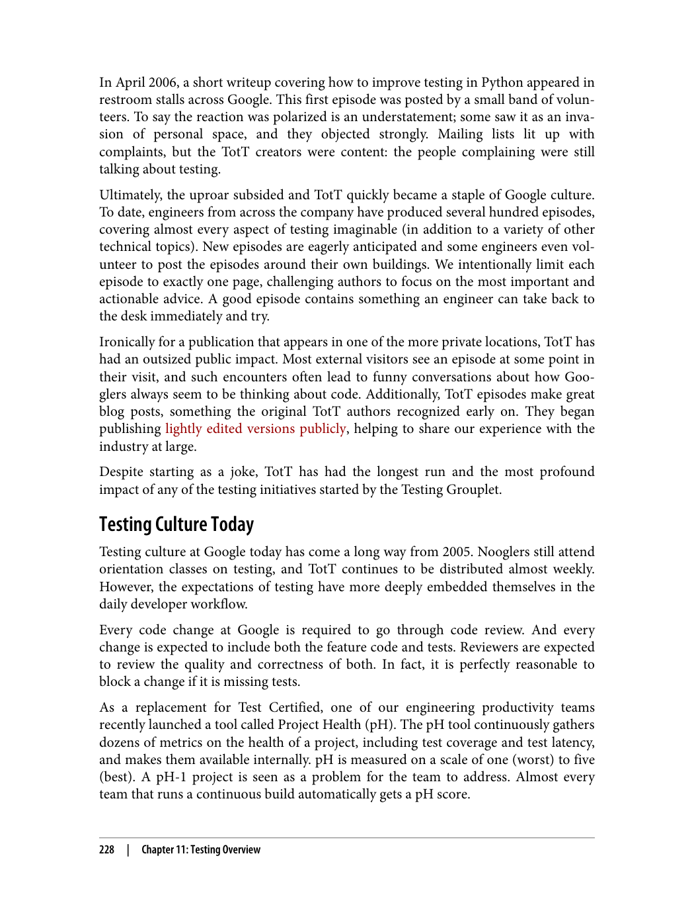


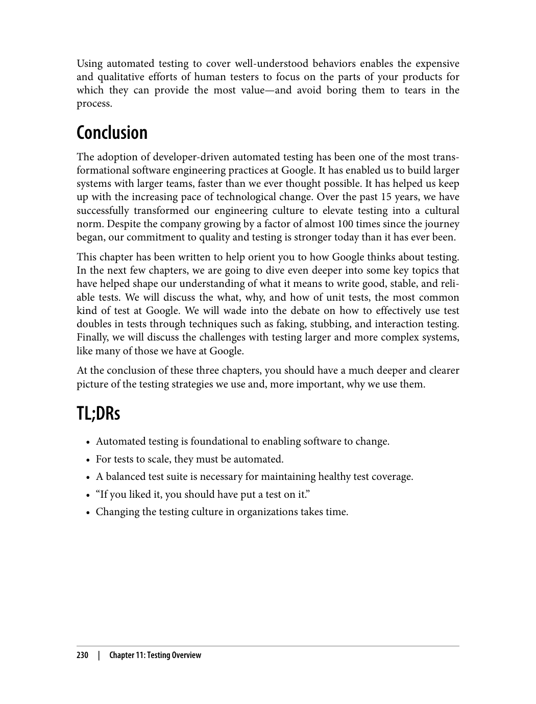


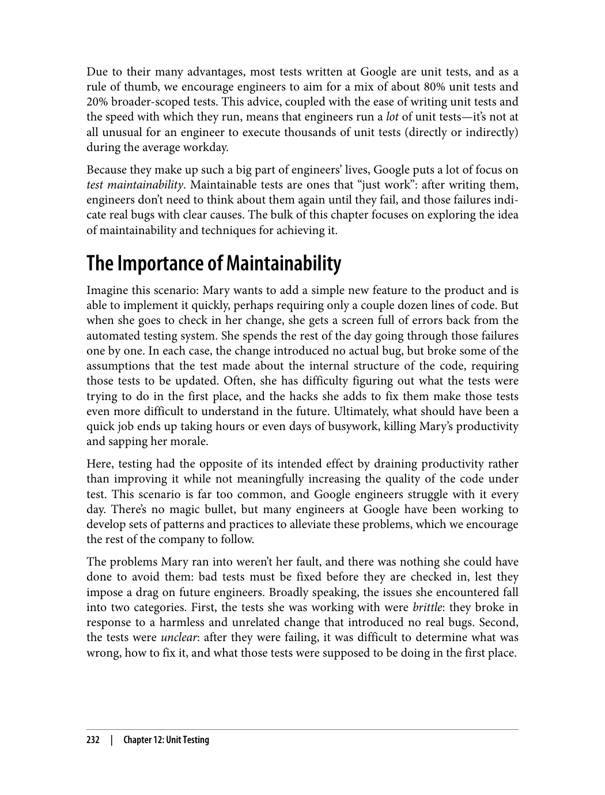

---

###### 📄 صفحه ۲۶۱
> of abstraction. Google's reliance on large-scale changes (described in Chapter 22)
> to do such refactorings makes this case particularly important for us.
> New features
> When an engineer adds new features or behaviors to an existing system, the sys‐
> tem's existing behaviors should remain unaffected. The engineer must write new
> tests to cover the new behaviors, but they shouldn't need to change any existing
> tests. As with refactorings, a change to existing tests when adding new features
> suggest unintended consequences of that feature or inappropriate tests.
> Bug fixes
> Fixing a bug is much like adding a new feature: the presence of the bug suggests
> that a case was missing from the initial test suite, and the bug fix should include
> that missing test case. Again, bug fixes typically shouldn't require updates to
> existing tests.
> Behavior changes
> Changing a system's existing behavior is the one case when we expect to have to
> make updates to the system's existing tests. Note that such changes tend to be sig‐
> nificantly more expensive than the other three types. A system's users are likely to
> rely on its current behavior, and changes to that behavior require coordination
> with those users to avoid confusion or breakages. Changing a test in this case
> indicates that we're breaking an explicit contract of the system, whereas changes
> in the previous cases indicate that we're breaking an unintended contract. Low-
> level libraries will often invest significant effort in avoiding the need to ever make
> a behavior change so as not to break their users.
> The takeaway is that after you write a test, you shouldn't need to touch that test again
> as you refactor the system, fix bugs, or add new features. This understanding is what
> makes it possible to work with a system at scale: expanding it requires writing only a
> small number of new tests related to the change you're making rather than potentially
> having to touch every test that has ever been written against the system. Only break‐
> ing changes in a system's behavior should require going back to change its tests, and
> in such situations, the cost of updating those tests tends to be small relative to the cost
> of updating all of the system's users.
> Test via Public APIs
> Now that we understand our goal, let's look at some practices for making sure that
> tests don't need to change unless the requirements of the system being tested change.
> By far the most important way to ensure this is to write tests that invoke the system
> being tested in the same way its users would; that is, make calls against its public API
> rather than its implementation details. If tests work the same way as the system's
> users, by definition, change that breaks a test might also break a user. As an addi‐
> tional bonus, such tests can serve as useful examples and documentation for users.
> 234
> |
> Chapter 12: Unit Testing

tamam.
-abstraction.
وابستگی گوگل به تغییرات در مقیاس بزرگ (توصیف شده در فصل ۲۲) برای انجام چنین بازسازی‌هایی این مورد را برای ما به طور ویژه مهم می‌سازد.

**ویژگی‌های جدید**

وقتی یک مهندس ویژگی‌ها یا رفتارهای جدیدی به یک سیستم موجود اضافه می‌کند، رفتارهای موجود سیستم باید بدون تغییر باقی بمانند. مهندس باید تست‌های جدیدی برای پوشش رفتارهای جدید بنویسد، اما نباید نیاز به تغییر هیچ测试 موجودی داشته باشد. مانند بازسازی‌ها، تغییر در测试‌های موجود هنگام افزودن ویژگی‌های جدید نشان‌دهنده پیامدهای ناخواسته آن ویژگی یا测试‌های نامناسب است.

**رفع باگ‌ها**

رفع یک باگ بسیار شبیه افزودن یک ویژگی جدید است: وجود باگ نشان می‌دهد که یک مورد از م集合ه测试 اولیه جامانده و رفع باگ باید آن مورد测试 جامانده را شامل شود. دوباره، رفع باگ‌ها معمولاً نباید نیاز به به‌روزرسانی测试‌های موجود داشته باشند.

**تغییرات رفتاری**

تغییر رفتار موجود یک سیستم تنها موردی است که انتظار داریم مجبور به به‌روزرسانی测试‌های موجود سیستم باشیم. توجه کنید که چنین تغییراتی معمولاً بسیار پرهزینه‌تر از سه نوع دیگر هستند. کاربران یک سیستم احتمالاً به رفتار فعلی آن وابسته هستند و تغییرات آن رفتار نیاز به هماهنگی با آن کاربران برای جلوگیری از سردرگمی یا شکست‌ها دارد. تغییر یک测试 در این مورد نشان می‌دهد که ما یک قرارداد صریح سیستم را نقض می‌کنیم، در حالی که تغییرات در موارد قبلی نشان می‌دهند که ما یک قرارداد ناخواسته را نقض می‌کنیم. کتابخانه‌های سطح پایین اغلب تلاش قابل توجهی برای جلوگیری از نیاز به ایجاد هرگونه تغییر رفتاری سرمایه‌گذاری می‌کنند تا کاربران خود را نشکنند.

نکته کلیدی این است که پس از نوشتن یک测试، نباید نیازی به دست زدن دوباره آن测试 داشته باشید در حالی که سیستم را بازسازی می‌کنید، باگ‌ها را رفع می‌کنید یا ویژگی‌های جدید اضافه می‌کنید. این درک همان چیزی است که کار با یک سیستم در مقیاس بزرگ را ممکن می‌سازد: گسترش آن فقط نیاز به نوشتن تعداد کمی测试 جدید مرتبط با تغییری که اعمال می‌کنید دارد و نه لزوماً دست زدن به هر测试ی که تا به حال برای سیستم نوشته شده. فقط تغییرات شکننده در رفتار یک سیستم باید نیاز به بازگشت و تغییر测试‌های آن داشته باشند و در چنین شرایطی، هزینه به‌روزرسانی آن测试‌ها معمولاً در مقایسه با هزینه به‌روزرسانی تمام کاربران سیستم کم است.

**测试 از طریق API‌های عمومی**

حال که هدف خود را درک کردیم، بیایید به برخی شیوه‌ها برای اطمینان از اینکه测试‌ها نیازی به تغییر نداشته باشند مگر اینکه نیازمندی‌های سیستم تحت测试 تغییر کنند، نگاه کنیم. مهم‌ترین راه برای تضمین این امر تا به اینجا، نوشتن测试‌هایی است که سیستم تحت测试 را دقیقاً همان‌طور که کاربرانش فراخوانی می‌کنند؛ یعنی فراخوانی‌هایی علیه API عمومی آن به جای جزئیات پیاده‌سازی‌اش انجام دهند. اگر测试‌ها به همان شکلی که کاربران سیستم عمل می‌کنند، عمل کنند، به تعریف، تغییری که یک测试 را می‌شکند ممکن است یک کاربر را نیز بشکند. به عنوان یک مزیت اضافی، چنین测试‌هایی می‌توانند به عنوان مثال‌ها و مستندات مفیدی برای کاربران خدمت کنند.


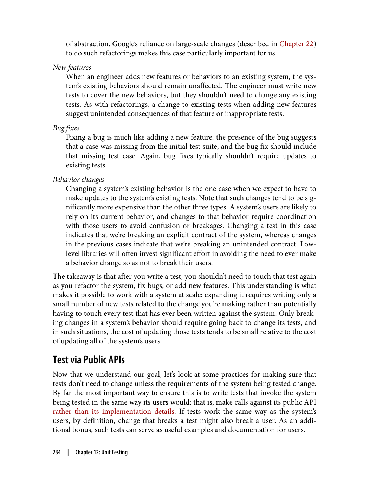


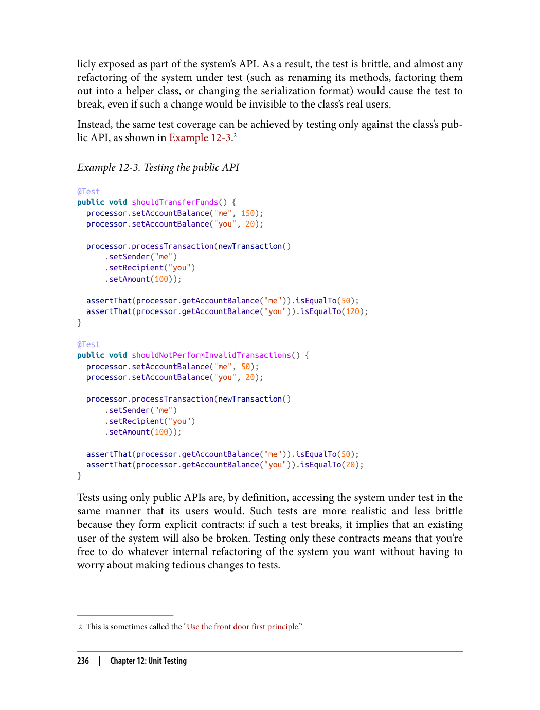


---

###### 📄 صفحه ۲۶۶
> 3 These are also the same two reasons that a test can be "flaky." Either the system under test has a nondetermin‐
> istic fault, or the test is flawed such that it sometimes fails when it should pass.
> The most common reason for problematic interaction tests is an over reliance on
> mocking frameworks. These frameworks make it easy to create test doubles that
> record and verify every call made against them, and to use those doubles in place of
> real objects in tests. This strategy leads directly to brittle interaction tests, and so we
> tend to prefer the use of real objects in favor of mocked objects, as long as the real
> objects are fast and deterministic.
> For a more extensive discussion of test doubles and mocking
> frameworks, when they should be used, and safer alternatives, see
> Chapter 13.
> Writing Clear Tests
> Sooner or later, even if we've completely avoided brittleness, our tests will fail. Failure
> is a good thing—test failures provide useful signals to engineers, and are one of the
> main ways that a unit test provides value.
> Test failures happen for one of two reasons:3
> • The system under test has a problem or is incomplete. This result is exactly what
> tests are designed for: alerting you to bugs so that you can fix them.
> • The test itself is flawed. In this case, nothing is wrong with the system under test,
> but the test was specified incorrectly. If this was an existing test rather than one
> that you just wrote, this means that the test is brittle. The previous section dis‐
> cussed how to avoid brittle tests, but it's rarely possible to eliminate them entirely.
> When a test fails, an engineer's first job is to identify which of these cases the failure
> falls into and then to diagnose the actual problem. The speed at which the engineer
> can do so depends on the test's clarity. A clear test is one whose purpose for existing
> and reason for failing is immediately clear to the engineer diagnosing a failure. Tests
> fail to achieve clarity when their reasons for failure aren't obvious or when it's difficult
> to figure out why they were originally written. Clear tests also bring other benefits,
> such as documenting the system under test and more easily serving as a basis for new
> tests.
> Test clarity becomes significant over time. Tests will often outlast the engineers who
> wrote them, and the requirements and understanding of a system will shift subtly as
> it ages. It's entirely possible that a failing test might have been written years ago by an
> Writing Clear Tests
> |
> 239

۳. این‌ها همچنین همان دو دلیلی هستند که یک测试 می‌تواند «ناپایدار (Flaky)» باشد. یا سیستم تحت测试 دارای یک خطای غیرقطعی است، یا测试 دارای نقص است به طوری که گاهی وقتی باید عبور کند شکست می‌خورد.

رایج‌ترین دلیل测试‌های تعاملی مشکل‌دار اتکای بیش از حد به چارچوب‌های Mocking است. این چارچوب‌ها ایجاد جایگزین‌های تست (Test Doubles) را آسان می‌کنند که هر فراخوانی انجام شده علیه آن‌ها را ضبط و تأیید می‌کنند و از آن جایگزین‌ها به جای اشیاء واقعی در测试‌ها استفاده می‌کنند. این استراتژی مستقیماً به测试‌های تعاملی شکننده منجر می‌شود و بنابراین ما ترجیح می‌دهیم از اشیاء واقعی به جای اشیاء Mock شده استفاده کنیم، به شرطی که اشیاء واقعی سریع و قطعی باشند.

برای بحث گسترده‌تر درباره Test Doubles و چارچوب‌های Mocking، زمانی که باید استفاده شوند و جایگزین‌های ایمن‌تر، به فصل ۱۳ مراجعه کنید.

**نوشتن测试‌های شفاف**

زود یا دیر، حتی اگر کاملاً از شکنندگی اجتناب کرده باشیم，测试‌های ما شکست خواهند خورد. شکست چیز خوبی است — شکست测试‌ها سیگنال‌های مفیدی به مهندسان می‌دهند و یکی از راه‌های اصلی است که یک测试 واحد ارزش ایجاد می‌کند.

شکست测试‌ها به یکی از دو دلیل اتفاق می‌افتد:۳

• سیستم تحت测试 مشکل دارد یا ناقص است. این دقیقاً همان چیزی است که测试‌ها برای آن طراحی شده‌اند: هشدار دادن به شما درباره باگ‌ها تا بتوانید آن‌ها را رفع کنید.

• خود测试 دارای نقص است. در این مورد， هیچ مشکلی با سیستم تحت测试 وجود ندارد， اما测试 به درستی مشخص نشده. اگر این یک测试 موجود بود نه یکی که تازه نوشتید， به این معناست که测试 شکننده است. بخش قبلی درباره نحوه جلوگیری از测试‌های شکننده بحث کرد， اما به ندرت ممکن است آن‌ها را به طور کامل حذف کنید.

وقتی یک测试 شکست می‌خورد， اولین کار مهندس این است که تشخیص دهد شکست در کدام یک از این موارد قرار می‌گیرد و سپس مشکل واقعی را تشخیص دهد. سرعتی که مهندس می‌تواند این کار را انجام دهد به وضوح测试 بستگی دارد. یک测试 شفاف测试ی است که هدف آن از وجود و دلیل شکست آن فوراً برای مهندسی که شکست را تشخیص می‌دهد واضح باشد.测试‌ها در دستیابی به وضوح شکست می‌خورند وقتی دلایل شکست آن‌ها آشکار نباشد یا وقتی دشوار باشد بفهمید چرا اصلاً نوشته شده بودند.测试‌های شفاف مزایای دیگری نیز دارند， مانند مستندسازی سیستم تحت测试 و راحت‌تر به عنوان پایه برای测试‌های جدید خدمت کردن.

شفافیت测试 در طول زمان مهم می‌شود.测试‌ها اغلب بیشتر از مهندسانی که آن‌ها را نوشته‌اند عمر می‌کنند و نیازها و درک یک سیستم به تدریج با افزایش سن آن تغییر می‌کند. کاملاً ممکن است که یک测试 شکست خورده ممکن است سال‌ها پیش توسط یک

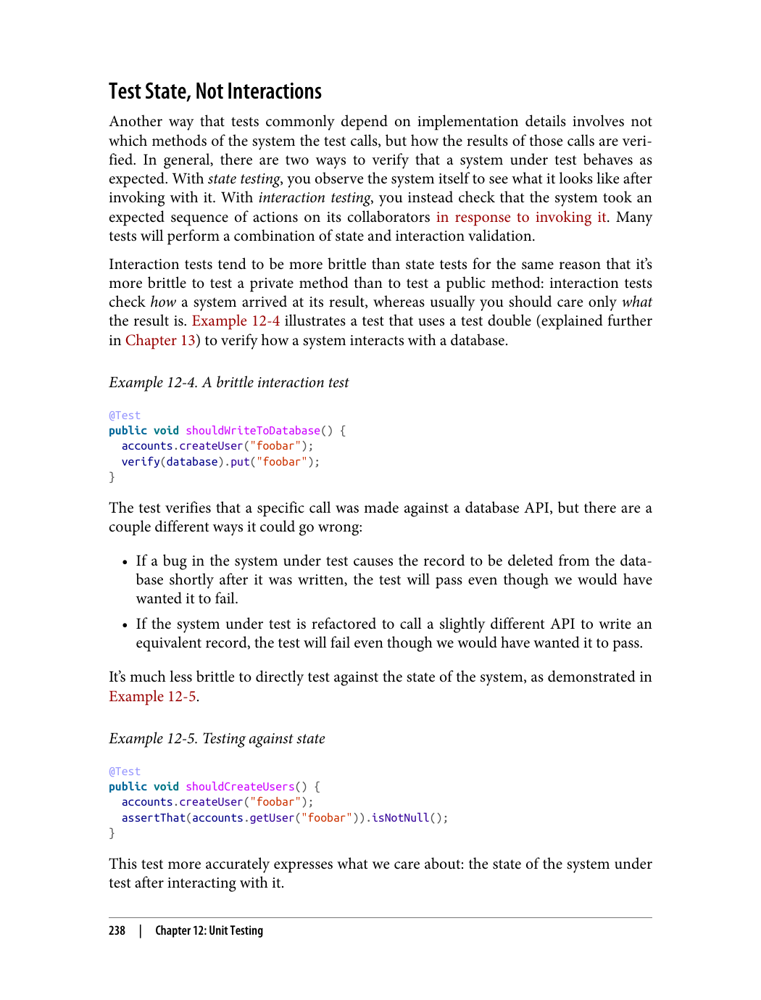


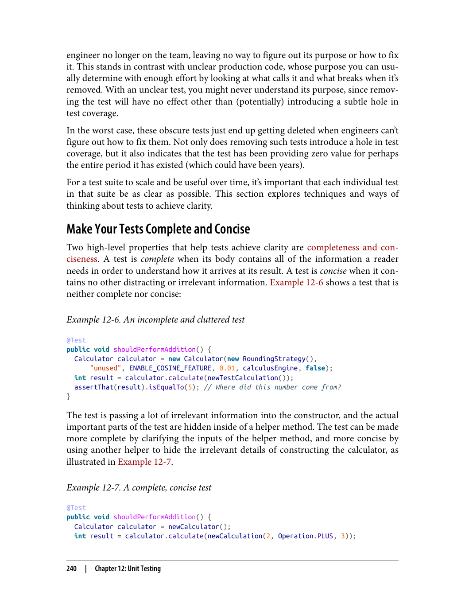


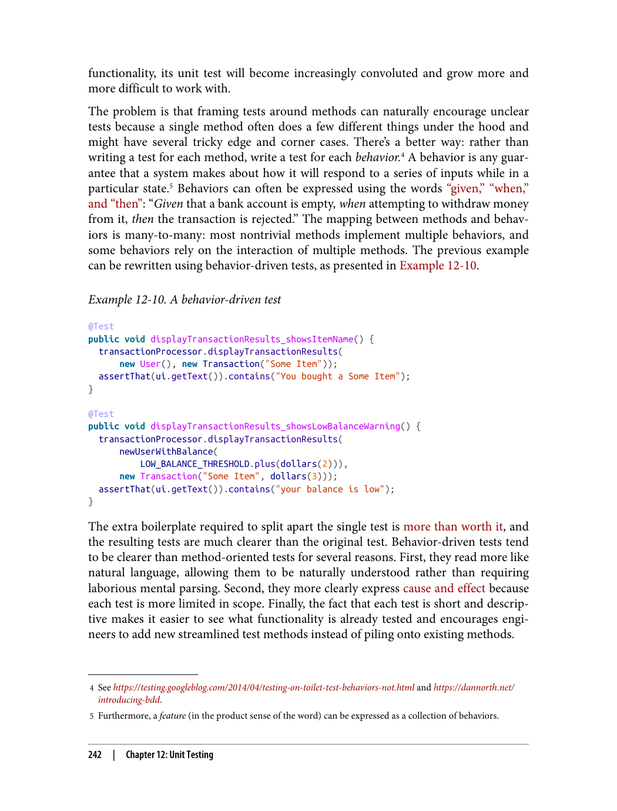

---

###### 📄 صفحه ۲۷۱
> the "then" and "when" blocks in this way can make the test less clear because it makes
> it difficult to distinguish the action being performed from the expected result.
> When a test does want to validate each step in a multistep process, it's acceptable to
> define alternating sequences of when/then blocks. Long blocks can also be made
> more descriptive by splitting them up with the word "and." Example 12-12 shows
> what a relatively complex, behavior-driven test might look like.
> Example 12-12. Alternating when/then blocks within a test
> @Test
> public void shouldTimeOutConnections() {
> // Given two users
> User user1 = newUser();
> User user2 = newUser();
> // And an empty connection pool with a 10-minute timeout
> Pool pool = newPool(Duration.minutes(10));
> // When connecting both users to the pool
> pool.connect(user1);
> pool.connect(user2);
> // Then the pool should have two connections
> assertThat(pool.getConnections()).hasSize(2);
> // When waiting for 20 minutes
> clock.advance(Duration.minutes(20));
> // Then the pool should have no connections
> assertThat(pool.getConnections()).isEmpty();
> // And each user should be disconnected
> assertThat(user1.isConnected()).isFalse();
> assertThat(user2.isConnected()).isFalse();
> }
> When writing such tests, be careful to ensure that you're not inadvertently testing
> multiple behaviors at the same time. Each test should cover only a single behavior,
> and the vast majority of unit tests require only one "when" and one "then" block.
> Name tests after the behavior being tested
> Method-oriented tests are usually named after the method being tested (e.g., a test for
> the updateBalance method is usually called testUpdateBalance). With more focused
> behavior-driven tests, we have a lot more flexibility and the chance to convey useful
> information in the test's name. The test name is very important: it will often be the
> first or only token visible in failure reports, so it's your best opportunity to communi‐
> 244
> |
> Chapter 12: Unit Testing

بلاک‌های «then» و «when» را به این شکل می‌تواند test را کمتر شفاف کند زیرا تشخیص عمل در حال انجام از نتیجه مورد انتظار را دشوار می‌کند.

وقتی یک test واقعاً می‌خواهد هر مرحله را در یک فرآیند چند مرحله‌ای اعتبارسنجی کند， تعریف توالی‌های متناوب بلاک‌های when/then قابل قبول است. بلاک‌های طولانی همچنین می‌توانند با جدا کردن آن‌ها با کلمه «and» توصیفی‌تر شوند. مثال ۱۲-۱۲ نشان می‌دهد یک test رفتارمحور (Behavior-Driven Test) نسبتاً پیچیده چگونه به نظر می‌رسد.

مثال ۱۲-۱۲. بلاک‌های متناوب when/then درون یک test
```java
@Test
public void shouldTimeOutConnections() {
    // Given two users
    User user1 = newUser();
    User user2 = newUser();
    // And an empty connection pool with a 10-minute timeout
    Pool pool = newPool(Duration.minutes(10));
    // When connecting both users to the pool
    pool.connect(user1);
    pool.connect(user2);
    // Then the pool should have two connections
    assertThat(pool.getConnections()).hasSize(2);
    // When waiting for 20 minutes
    clock.advance(Duration.minutes(20));
    // Then the pool should have no connections
    assertThat(pool.getConnections()).isEmpty();
    // And each user should be disconnected
    assertThat(user1.isConnected()).isFalse();
    assertThat(user2.isConnected()).isFalse();
}
```

هنگام نوشتن چنین test‌هایی، مراقب باشید که ناخواسته چندین رفتار را همزمان test نکنید. هر test فقط باید یک رفتار واحد را پوشش دهد و اکثریت قریب به اتفاق test‌های واحد فقط به یک بلاک «when» و یک بلاک «then» نیاز دارند.

**test‌ها را بر اساس رفتار مورد test نامگذاری کنید**

test‌های متدمحور معمولاً بر اساس متدی که test می‌شود نامگذاری می‌شوند (مثلاً یک test برای متد updateBalance معمولاً testUpdateBalance نام دارد). با test‌های رفتارمحور متمرکزتر， انعطاف‌پذیری بیشتری و فرصت انتقال اطلاعات مفید در نام test داریم. نام test بسیار مهم است: اغلب اولین یا تنها نشانه‌ای است که در گزارش‌های شکست قابل مشاهده است， بنابراین بهترین فرصت شما برای برقراری ارتباط


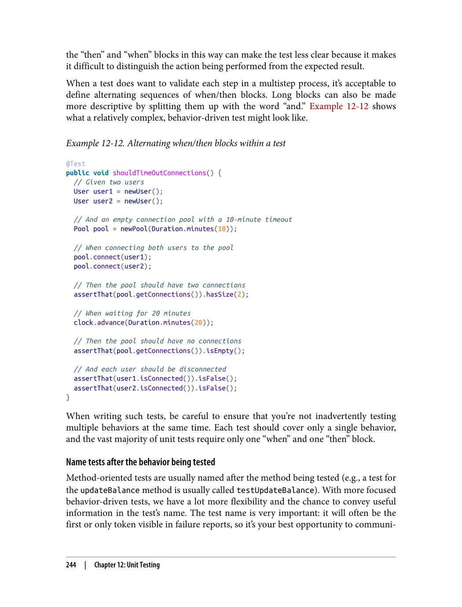


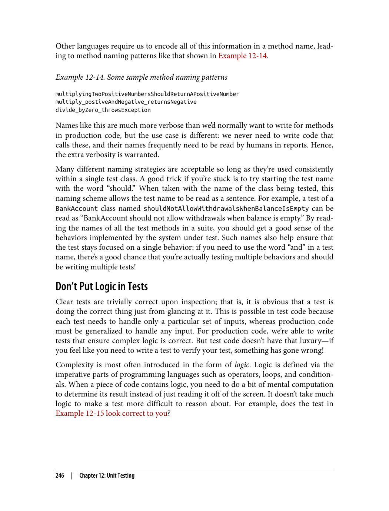


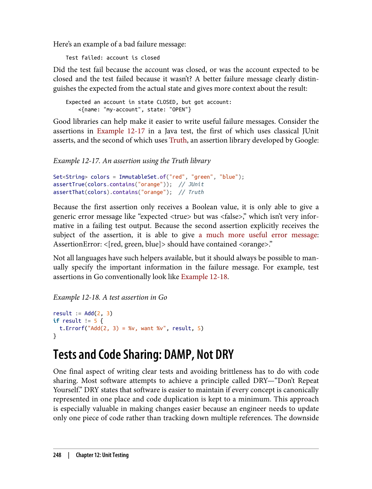

---