## فصل ۱۲: سیستم‌های ساخت

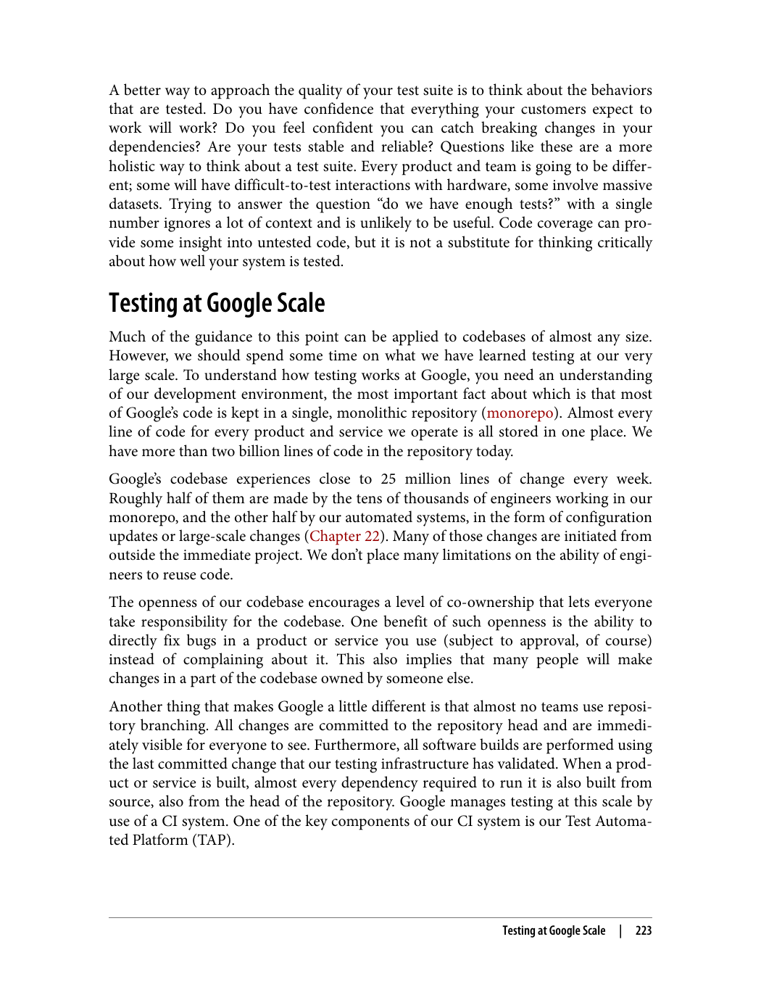

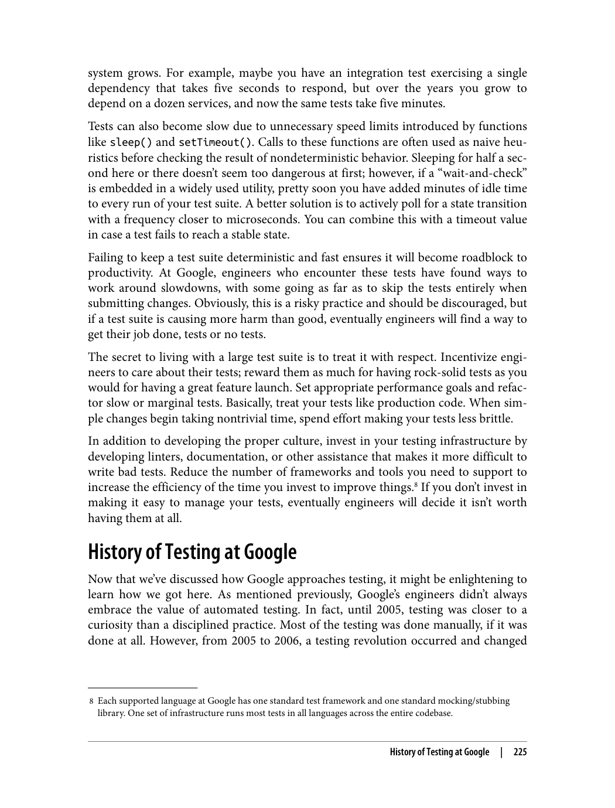

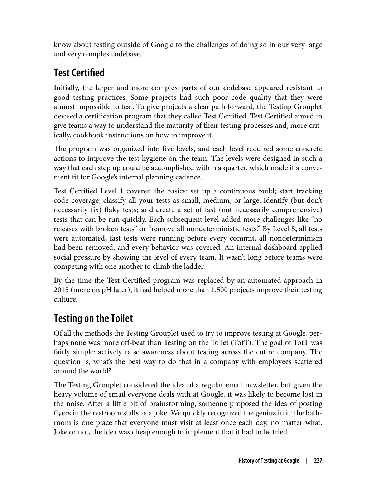

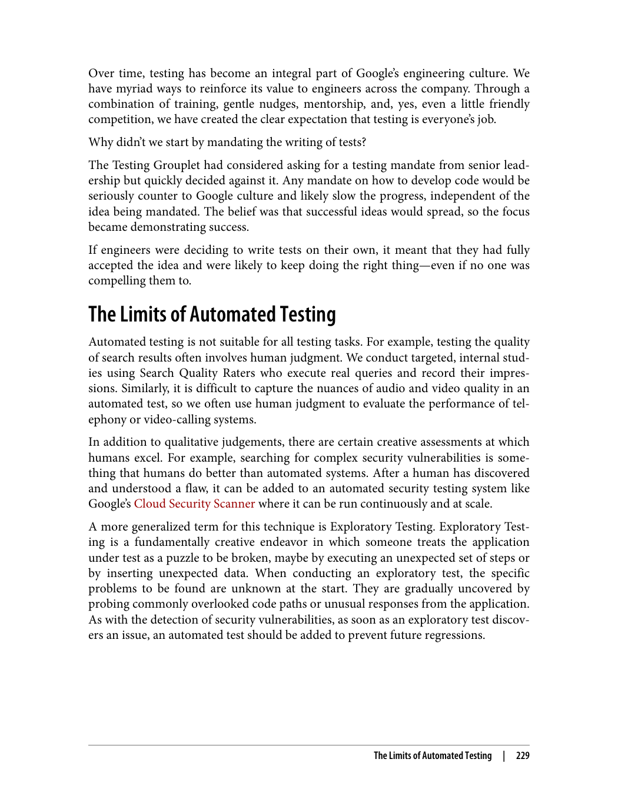

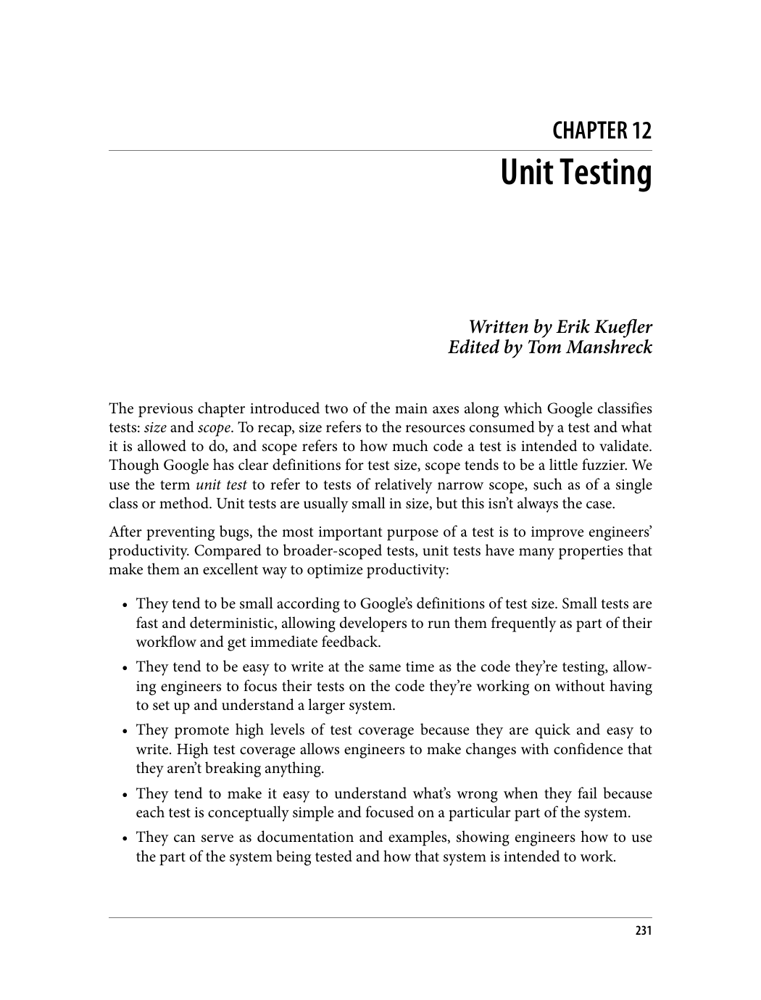

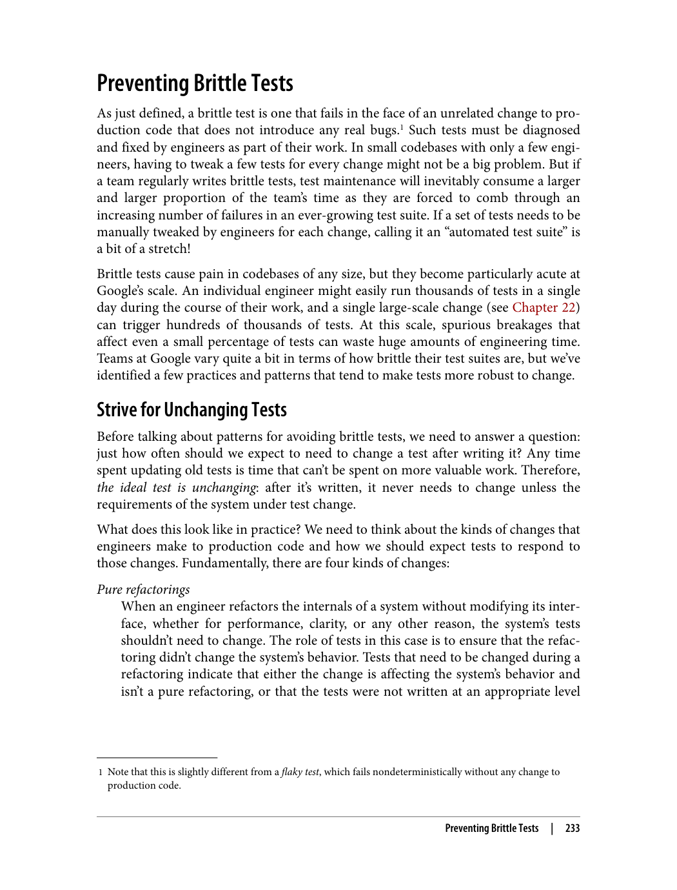

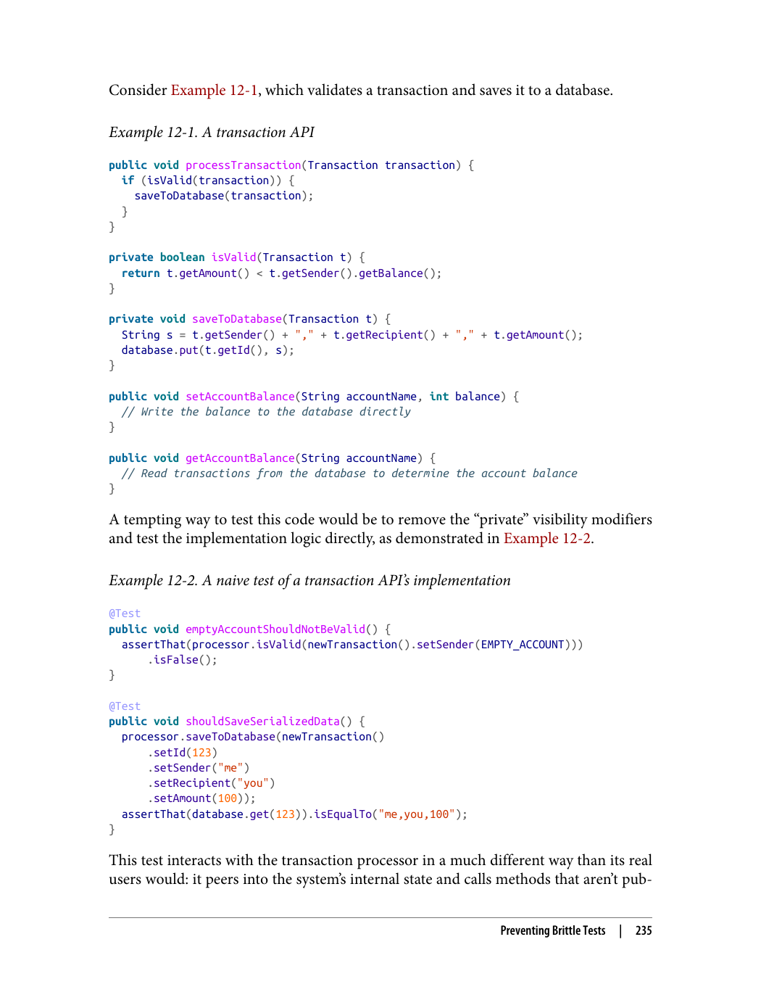

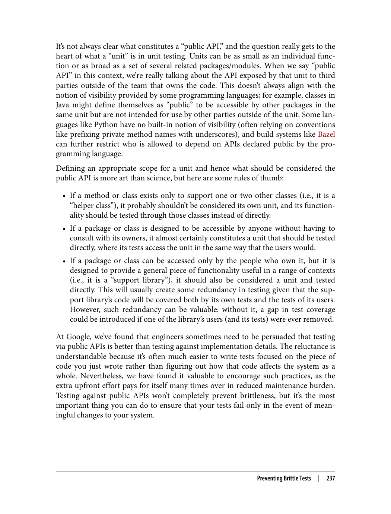

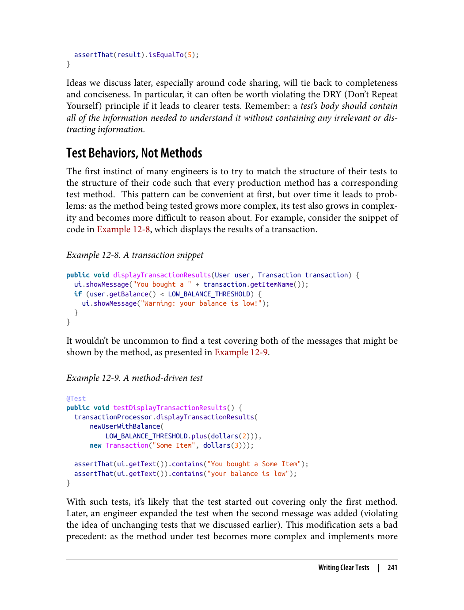

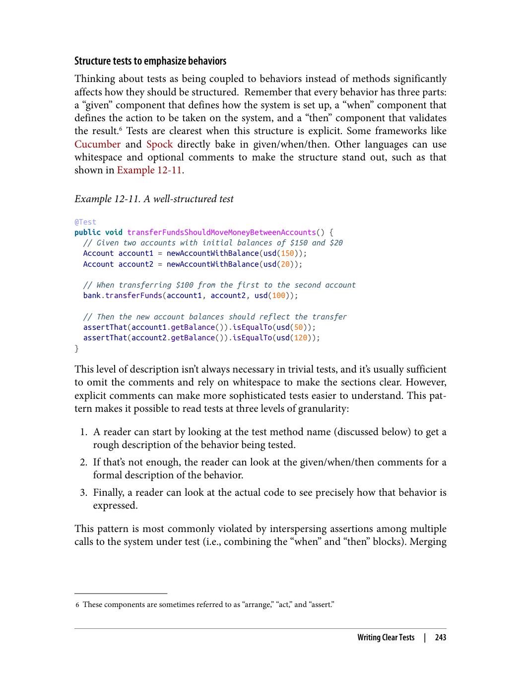

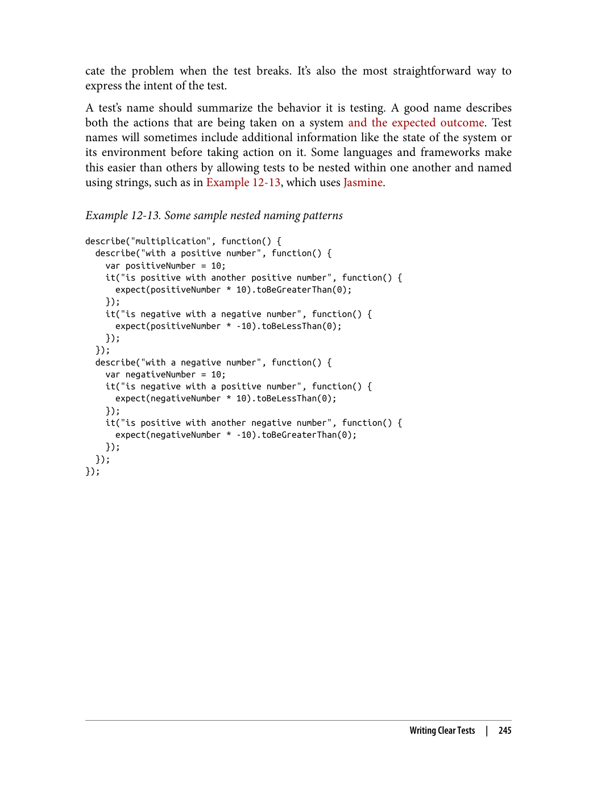

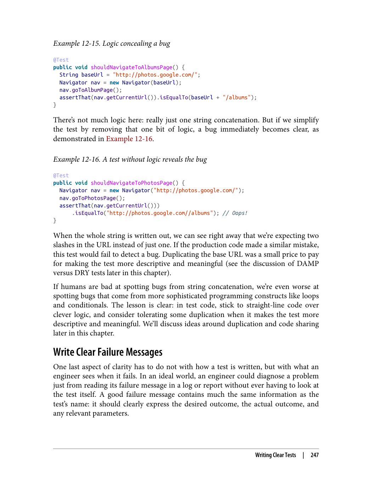

---

> "سیستم ساخت، فرآیند تبدیل کد منبع به نرم‌افزار قابل اجرا را مدیریت می‌کند. سیستم‌های مدرن باید سریع، قابل اطمینان و قابل تکرار باشند."

### اهمیت سیستم ساخت

> "سیستم ساخت خوب به بهبود کارایی و کاهش خطاها کمک می‌کند."

سیستم ساخت نقش مهمی در فرآیند توسعه نرم‌افزار دارد. سیستم ساخت خوب می‌تواند زمان ساخت را کاهش دهد و خطاها را کم کند.

### سیستم‌های ساخت مدرن

> "سیستم‌های ساخت مدرن باید سریع، قابل اطمینان و قابل تکرار باشند."

ویژگی‌های سیستم ساخت خوب:
1. **سرعت**: ساخت باید سریع انجام شود
2. **قابلیت اطمینان**: ساخت باید قابل اطمینان باشد
3. **قابلیت تکرار**: ساخت باید قابل تکرار باشد
4. **مقیاس‌پذیری**: سیستم باید بتواند با افزایش حجم کار مقیاس پیدا کند

### سیستم‌های ساخت توزیع‌شده

> "سیستم‌های ساخت توزیع‌شده می‌توانند زمان ساخت را به طور قابل توجهی کاهش دهند."

با استفاده از منابع محاسباتی توزیع‌شده، می‌توان مراحل ساخت را به طور همزمان اجرا کرد و زمان ساخت را کاهش داد.

### قوانین ساخت

> "قوانین ساخت باید به دقت تعریف شوند تا از تکرار و خطا جلوگیری شود."

قوانین سYST ساخت به سیستم می‌گویند چگونه کد را بسازد. این قوانین باید شفاف و قابل درک باشند.

---