> **راهنمای مطالعه**
>
> در هر بخش، ابتدا متن اصلی کتاب به زبان انگلیسی آورده شده و سپس ترجمه و توضیحات فارسی همان بخش ارائه شده است.

---
-

###### 📄 صفحه ۲۷۷
> for (User user : users) {
> try {
> forum.register(user);
> } catch(BannedUserException ignored) {}
> }
> return forum;
> }
> private static void validateForumAndUsers(Forum forum, List<User> users) {
> assertThat(forum.isReachable()).isTrue();
> for (User user : users) {
> assertThat(forum.hasRegisteredUser(user))
> .isEqualTo(user.getState() == State.BANNED);
> }
> }
> The problems in this code should be apparent based on the previous discussion of
> clarity. For one, although the test bodies are very concise, they are not complete:
> important details are hidden away in helper methods that the reader can’t see without
> having to scroll to a completely different part of the file. Those helpers are also full of
> logic that makes them more difficult to verify at a glance (did you spot the bug?). The
> test becomes much clearer when it’s rewritten to use DAMP, as shown in
> Example 12-20.
> Example 12-20. Tests should be DAMP
> @Test
> public void shouldAllowMultipleUsers() {
> User user1 = newUser().setState(State.NORMAL).build();
> User user2 = newUser().setState(State.NORMAL).build();
> Forum forum = new Forum();
> forum.register(user1);
> forum.register(user2);
> assertThat(forum.hasRegisteredUser(user1)).isTrue();
> assertThat(forum.hasRegisteredUser(user2)).isTrue();
> }
> @Test
> public void shouldNotRegisterBannedUsers() {
> User user = newUser().setState(State.BANNED).build();
> Forum forum = new Forum();
> try {
> forum.register(user);
> } catch(BannedUserException ignored) {}
> assertThat(forum.hasRegisteredUser(user)).isFalse();
> }
> 250
> |
> Chapter 12: Unit Testing

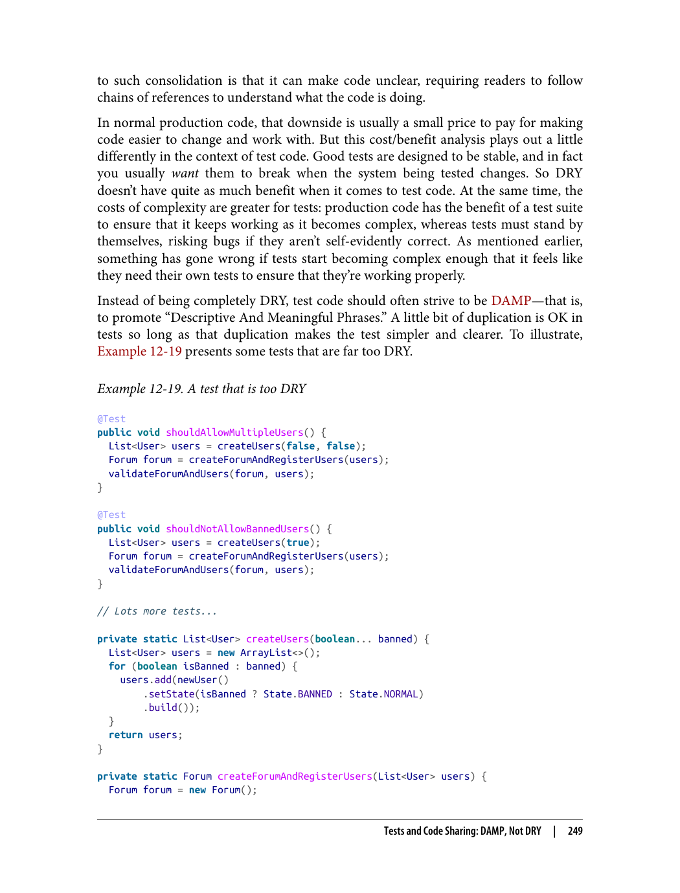

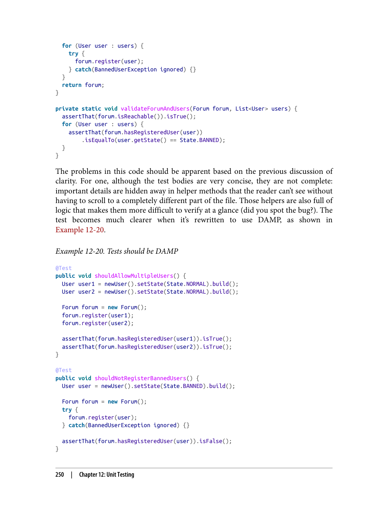

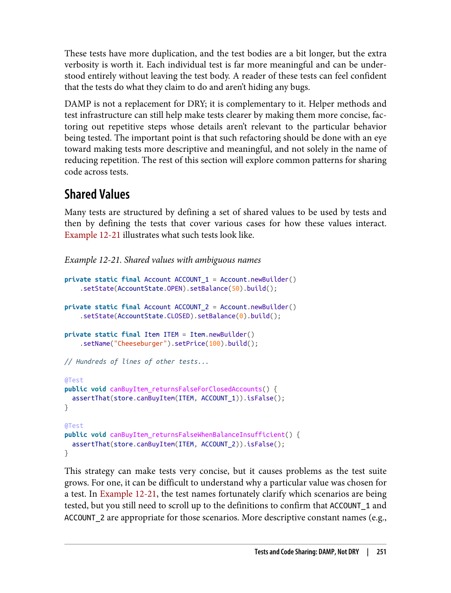

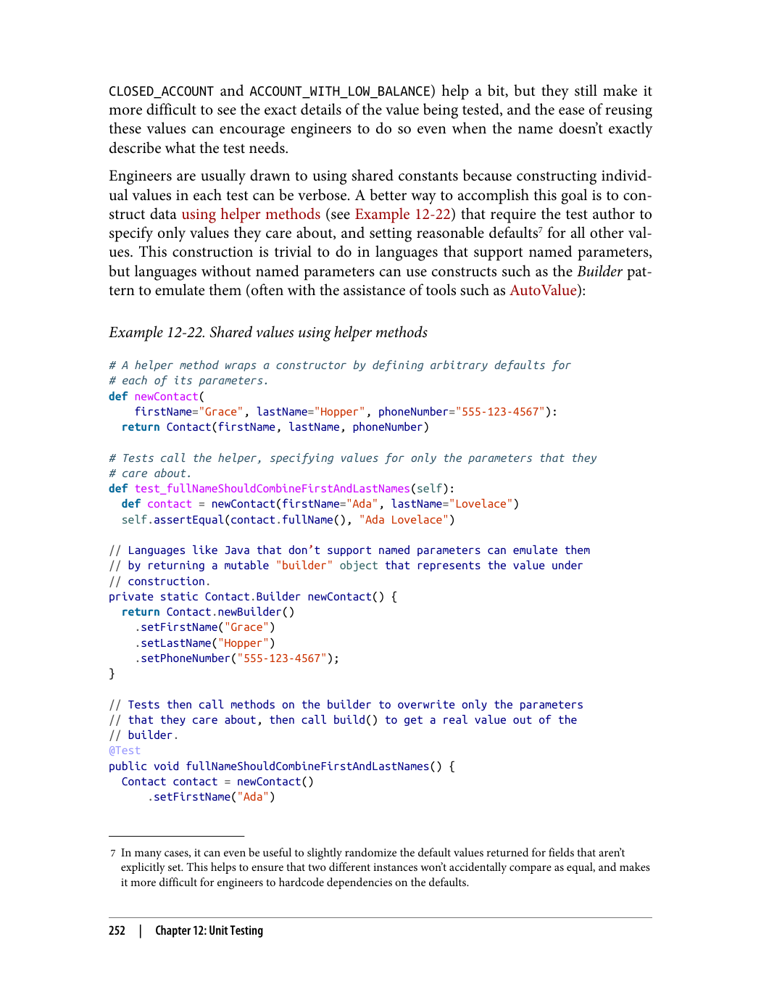

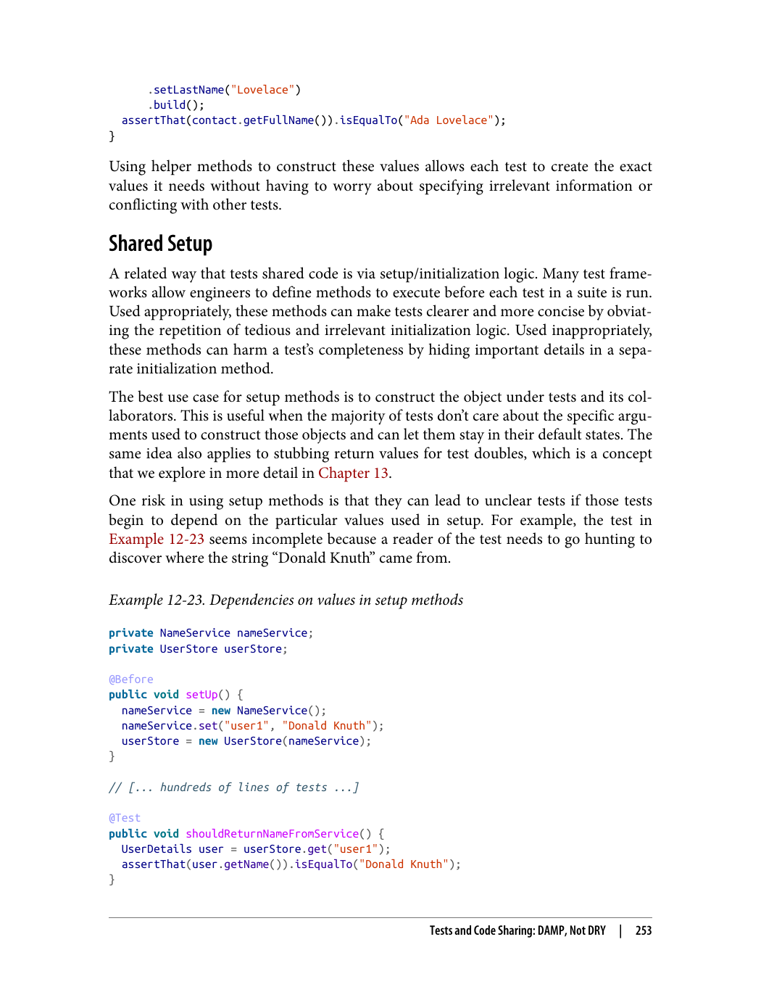

---

###### 📄 صفحه ۲۸۲
> More focused validation methods can still be useful, however. The best validation
> helper methods assert a single conceptual fact about their inputs, in contrast to
> general-purpose validation methods that cover a range of conditions. Such methods
> can be particularly helpful when the condition that they are validating is conceptually
> simple but requires looping or conditional logic to implement that would reduce
> clarity were it included in the body of a test method. For example, the helper method
> in Example 12-25 might be useful in a test covering several different cases around
> account access.
> Example 12-25. A conceptually simple test
> private void assertUserHasAccessToAccount(User user, Account account) {
> for (long userId : account.getUsersWithAccess()) {
> if (user.getId() == userId) {
> return;
> }
> }
> fail(user.getName() + " cannot access " + account.getName());
> }
> Defining Test Infrastructure
> The techniques we’ve discussed so far cover sharing code across methods in a single
> test class or suite. Sometimes, it can also be valuable to share code across multiple test
> suites. We refer to this sort of code as test infrastructure. Though it is usually more
> valuable in integration or end-to-end tests, carefully designed test infrastructure can
> make unit tests much easier to write in some circumstances.
> Custom test infrastructure must be approached more carefully than the code sharing
> that happens within a single test suite. In many ways, test infrastructure code is more
> similar to production code than it is to other test code given that it can have many
> callers that depend on it and can be difficult to change without introducing break‐
> ages. Most engineers aren’t expected to make changes to the common test infrastruc‐
> ture while testing their own features. Test infrastructure needs to be treated as its own
> separate product, and accordingly, test infrastructure must always have its own tests.
> Of course, most of the test infrastructure that most engineers use comes in the form
> of well-known third-party libraries like JUnit. A huge number of such libraries are
> available, and standardizing on them within an organization should happen as early
> and universally as possible. For example, Google many years ago mandated Mockito
> as the only mocking framework that should be used in new Java tests and banned
> new tests from using other mocking frameworks. This edict produced some grum‐
> bling at the time from people comfortable with other frameworks, but today, it’s uni‐
> versally seen as a good move that made our tests easier to understand and work with.
> Tests and Code Sharing: DAMP, Not DRY
> |
> 255

چالش‌های اصلی:
1. **تعارض الزامات**: وابستگی‌های مختلف ممکن است الزامات متفاوتی داشته باشند
2. **وابستگی‌های الماسی**: وقتی دو وابستگی به نسخه‌های مختلف یک کتابخانه نیاز دارند
3. **وارد کردن وابستگی‌ها**: نحوه وارد کردن کتابخانه‌های خارجی

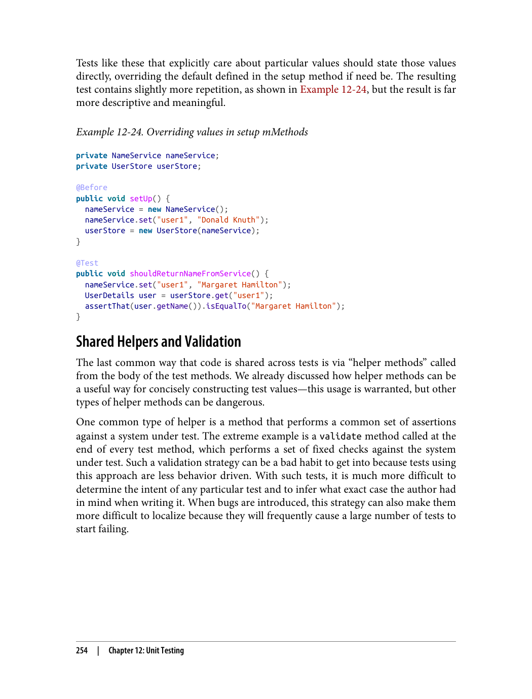

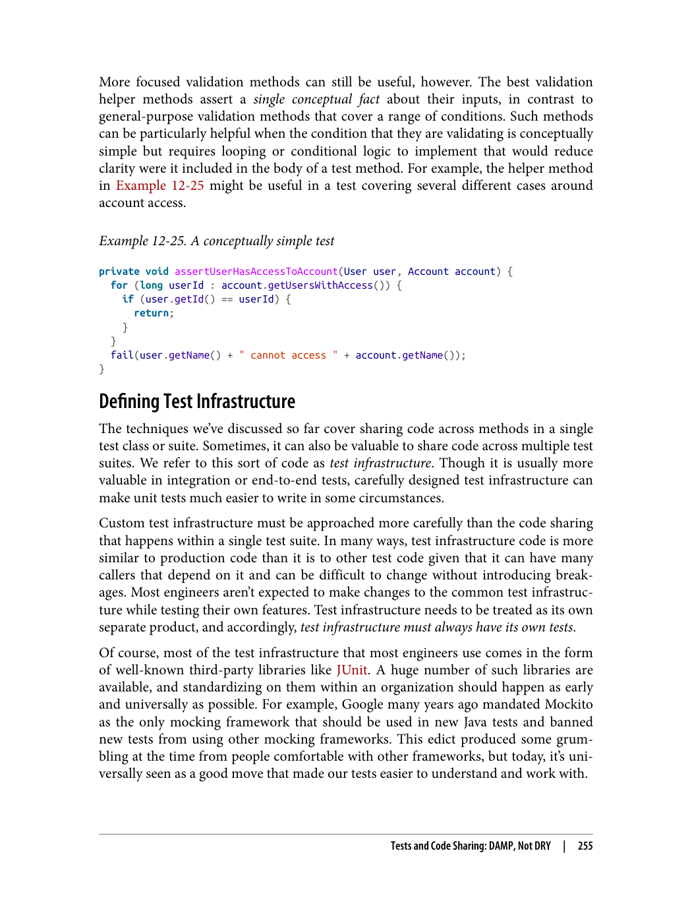

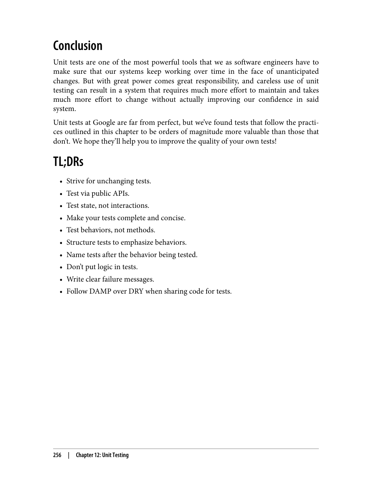

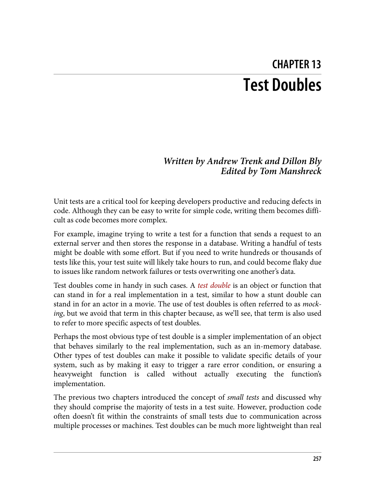

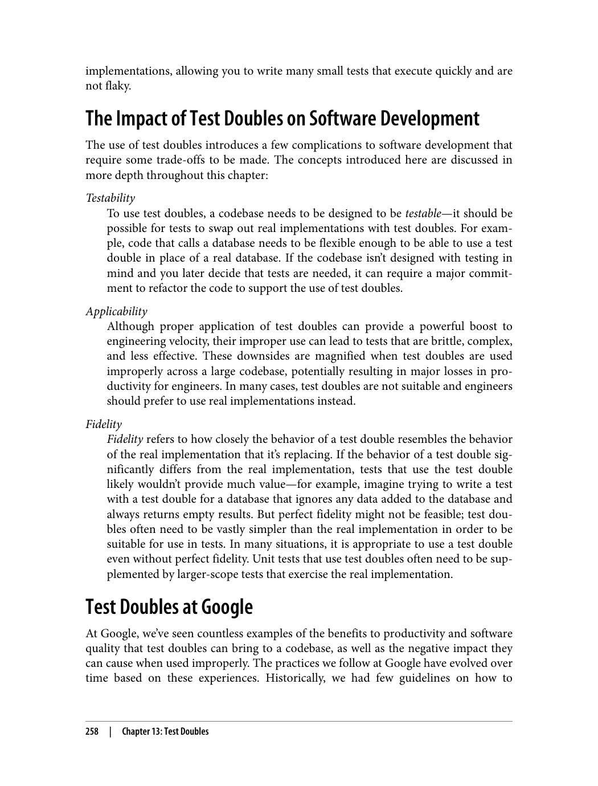

---

###### 📄 صفحه ۲۸۷
> It would be infeasible to use a real credit card service in a test (imagine all the trans‐
> action fees from running the test!), but a test double could be used in its place to
> simulate the behavior of the real system. The code in Example 13-2 shows an
> extremely simple test double.
> Example 13-2. A trivial test double
> class TestDoubleCreditCardService implements CreditCardService {
> @Override
> public boolean chargeCreditCard(CreditCard creditCard, Money amount) {
> return true;
> }
> }
> Although this test double doesn’t look very useful, using it in a test still allows us to
> test some of the logic in the makePayment() method. For example, in Example 13-3,
> we can validate that the method behaves properly when the credit card is expired
> because the code path that the test exercises doesn’t rely on the behavior of the credit
> card service.
> Example 13-3. Using the test double
> @Test public void cardIsExpired_returnFalse() {
> boolean success = paymentProcessor.makePayment(EXPIRED_CARD, AMOUNT);
> assertThat(success).isFalse();
> }
> The following sections in this chapter will discuss how to make use of test doubles in
> more complex situations than this one.
> Seams
> Code is said to be testable if it is written in a way that makes it possible to write unit
> tests for the code. A seam is a way to make code testable by allowing for the use of test
> doubles—it makes it possible to use different dependencies for the system under test
> rather than the dependencies used in a production environment.
> Dependency injection is a common technique for introducing seams. In short, when a
> class utilizes dependency injection, any classes it needs to use (i.e., the class’s depen‐
> dencies) are passed to it rather than instantiated directly, making it possible for these
> dependencies to be substituted in tests.
> Example 13-4 shows an example of dependency injection. Rather than the construc‐
> tor creating an instance of CreditCardService, it accepts an instance as a parameter.
> 260
> |
> Chapter 13: Test Doubles

وعده‌های سازگاری به توسعه‌دهندگان کمک می‌کند تا بدانند آیا می‌توانند کتابخانه را ارتقا دهند یا نه.

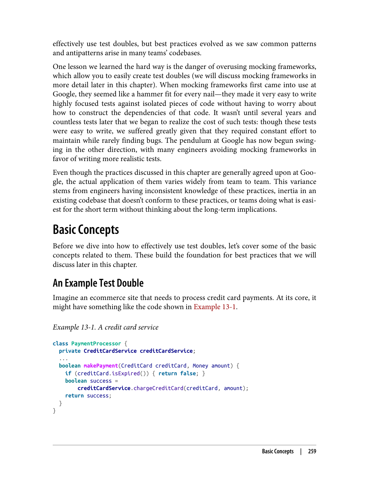

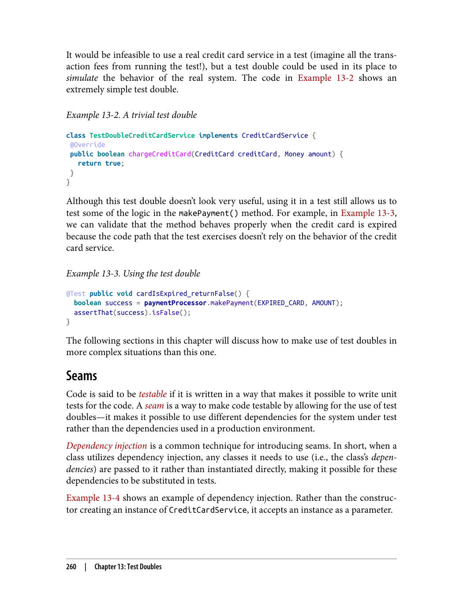

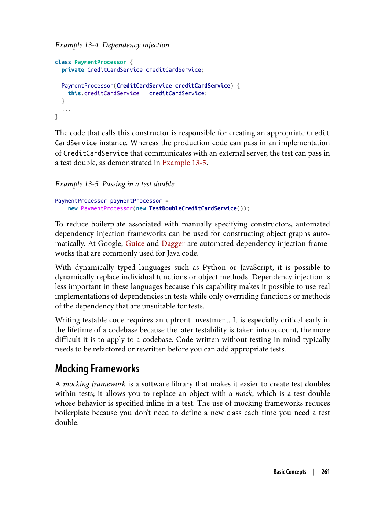

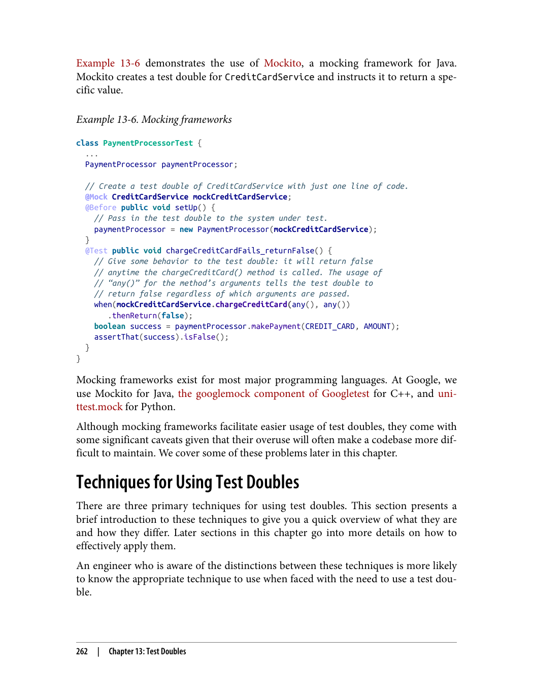

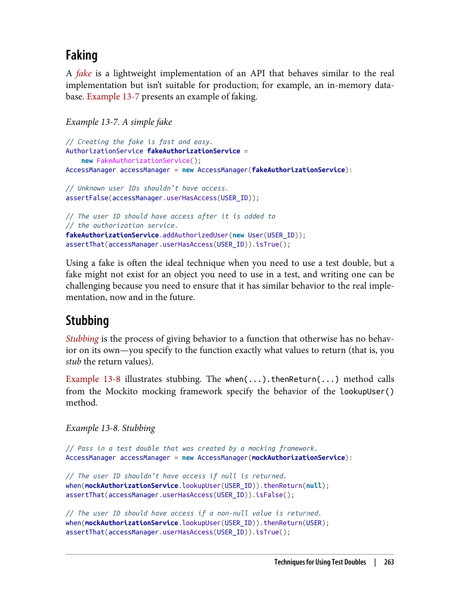

---

###### 📄 صفحه ۲۹۲
> they execute code as it will be executed in production, and using real implementa‐
> tions helps accomplish this.
> At Google, the preference for real implementations developed over time as we saw
> that overuse of mocking frameworks had a tendency to pollute tests with repetitive
> code that got out of sync with the real implementation and made refactoring difficult.
> We’ll look at this topic in more detail later in this chapter.
> Preferring real implementations in tests is known as classical testing. There is also a
> style of testing known as mockist testing, in which the preference is to use mocking
> frameworks instead of real implementations. Even though some people in the soft‐
> ware industry practice mockist testing (including the creators of the first mocking
> frameworks), at Google, we have found that this style of testing is difficult to scale. It
> requires engineers to follow strict guidelines when designing the system under test,
> and the default behavior of most engineers at Google has been to write code in a way
> that is more suitable for the classical testing style.
> Prefer Realism Over Isolation
> Using real implementations for dependencies makes the system under test more real‐
> istic given that all code in these real implementations will be executed in the test. In
> contrast, a test that utilizes test doubles isolates the system under test from its depen‐
> dencies so that the test does not execute code in the dependencies of the system
> under test.
> We prefer realistic tests because they give more confidence that the system under test
> is working properly. If unit tests rely too much on test doubles, an engineer might
> need to run integration tests or manually verify that their feature is working as
> expected in order to gain this same level of confidence. Carrying out these extra tasks
> can slow down development and can even allow bugs to slip through if engineers skip
> these tasks entirely when they are too time consuming to carry out compared to run‐
> ning unit tests.
> Replacing all dependencies of a class with test doubles arbitrarily isolates the system
> under test to the implementation that the author happens to put directly into the class
> and excludes implementation that happens to be in different classes. However, a good
> test should be independent of implementation—it should be written in terms of the
> API being tested rather than in terms of how the implementation is structured.
> Using real implementations can cause your test to fail if there is a bug in the real
> implementation. This is good! You want your tests to fail in such cases because it
> indicates that your code won’t work properly in production. Sometimes, a bug in a
> real implementation can cause a cascade of test failures because other tests that use
> the real implementation might fail, too. But with good developer tools, such as a
> Real Implementations
> |
> 265

گوگل از یک سیستم مدیریت وابستگی داخلی استفاده می‌کند که به آن اجازه می‌دهد وابستگی‌ها را به طور مؤثر مدیریت کند.

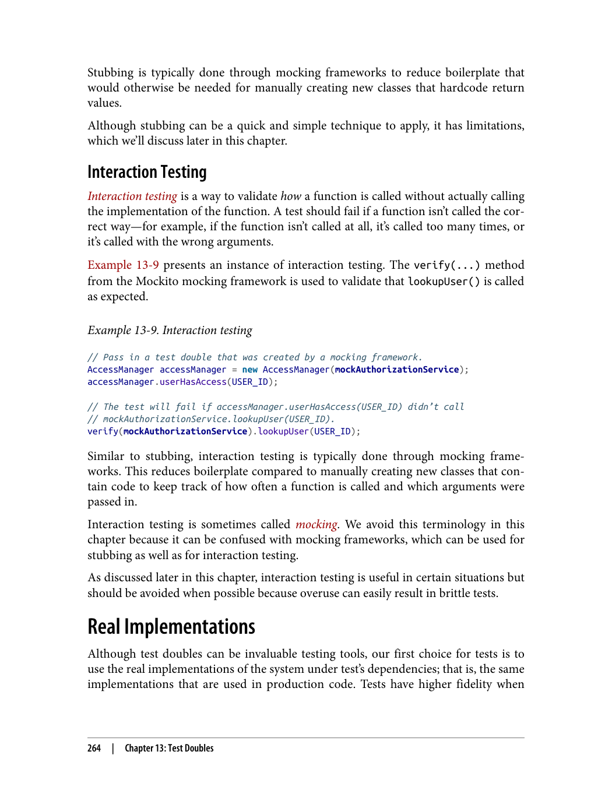

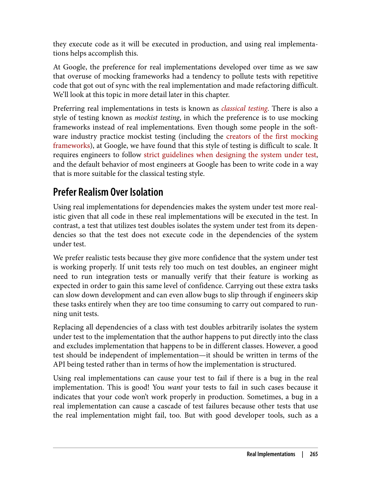

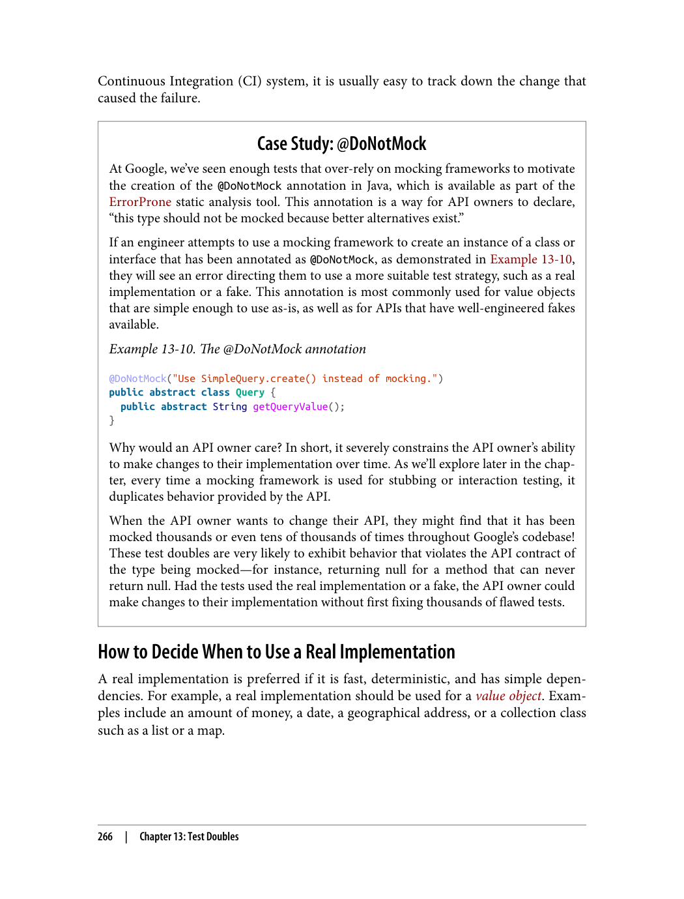

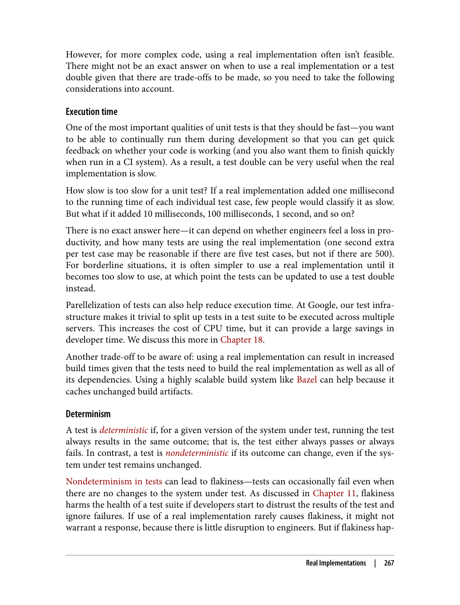

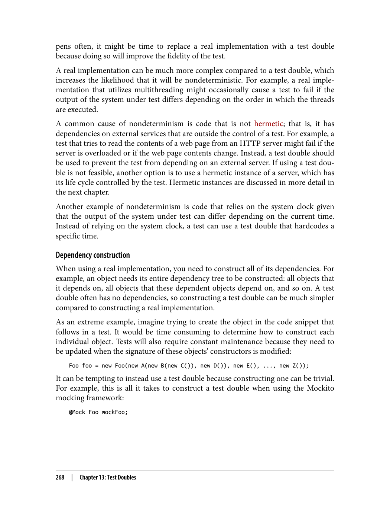

---

###### 📄 صفحه ۲۹۷
> Why Are Fakes Important?
> Fakes can be a powerful tool for testing: they execute quickly and allow you to effec‐
> tively test your code without the drawbacks of using real implementations.
> A single fake has the power to radically improve the testing experience of an API. If
> you scale that to a large number of fakes for all sorts of APIs, fakes can provide an
> enormous boost to engineering velocity across a software organization.
> At the other end of the spectrum, in a software organization where fakes are rare,
> velocity will be slower because engineers can end up struggling with using real imple‐
> mentations that lead to slow and flaky tests. Or engineers might resort to other test
> double techniques such as stubbing or interaction testing, which, as we’ll examine
> later in this chapter, can result in tests that are unclear, brittle, and less effective.
> When Should Fakes Be Written?
> A fake requires more effort and more domain experience to create because it needs to
> behave similarly to the real implementation. A fake also requires maintenance: when‐
> ever the behavior of the real implementation changes, the fake must also be updated
> to match this behavior. Because of this, the team that owns the real implementation
> should write and maintain a fake.
> If a team is considering writing a fake, a trade-off needs to be made on whether the
> productivity improvements that will result from the use of the fake outweigh the costs
> of writing and maintaining it. If there are only a handful of users, it might not be
> worth their time, whereas if there are hundreds of users, it can result in an obvious
> productivity improvement.
> To reduce the number of fakes that need to be maintained, a fake should typically be
> created only at the root of the code that isn’t feasible for use in tests. For example, if a
> database can’t be used in tests, a fake should exist for the database API itself rather
> than for each class that calls the database API.
> Maintaining a fake can be burdensome if its implementation needs to be duplicated
> across programming languages, such as for a service that has client libraries that
> allow the service to be invoked from different languages. One solution for this case is
> to create a single fake service implementation and have tests configure the client
> libraries to send requests to this fake service. This approach is more heavyweight
> compared to having the fake written entirely in memory because it requires the test to
> communicate across processes. However, it can be a reasonable trade-off to make, as
> long as the tests can still execute quickly.
> 270
> |
> Chapter 13: Test Doubles

عوامل مهم:
1. **سازگاری**: آیا وابستگی با سایر وابستگی‌ها سازگار است؟
2. **امنیت**: آیا وابستگی امن است؟
3. **قابلیت اطمینان**: آیا وابستگی قابل اطمینان است؟
4. **نگهداری**: آیا وابستگی به طور منظم به‌روز می‌شود؟

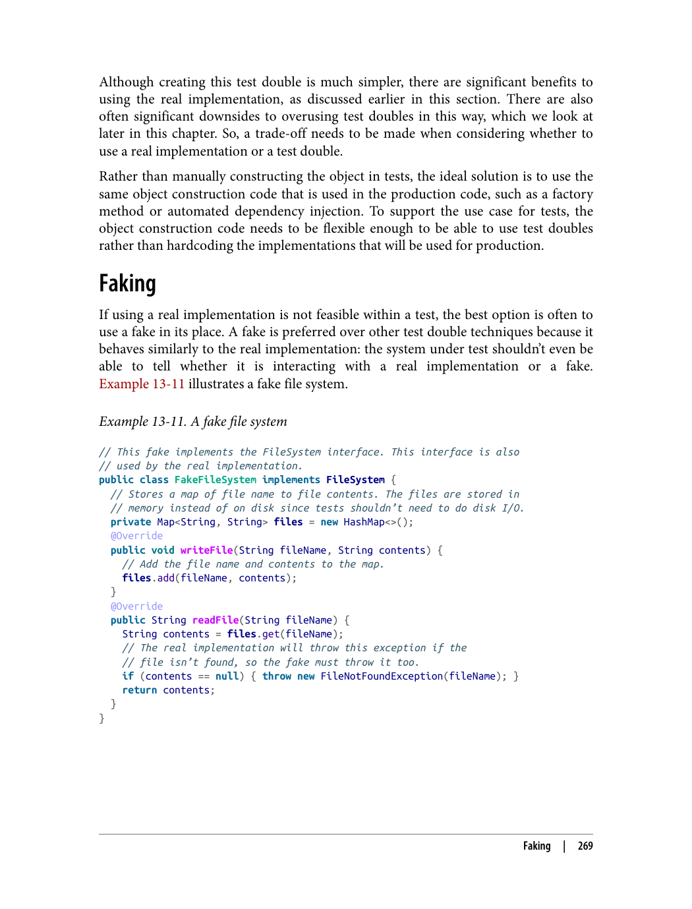

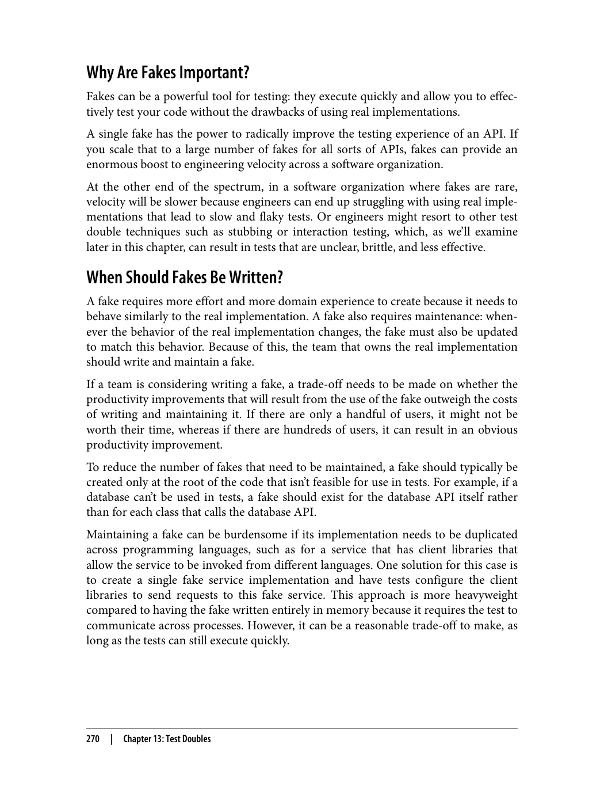

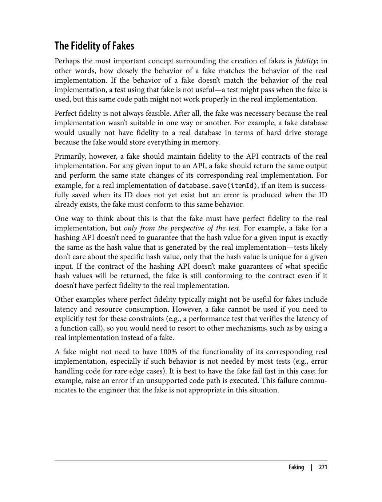

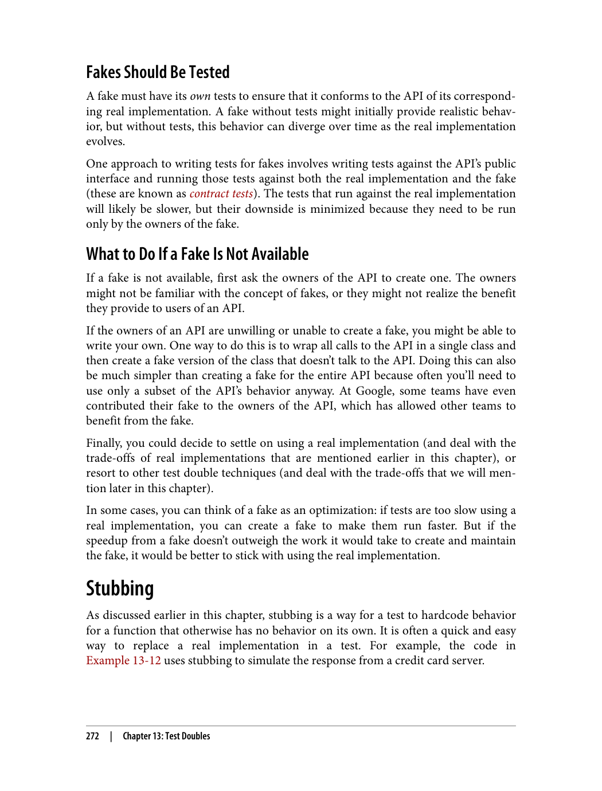

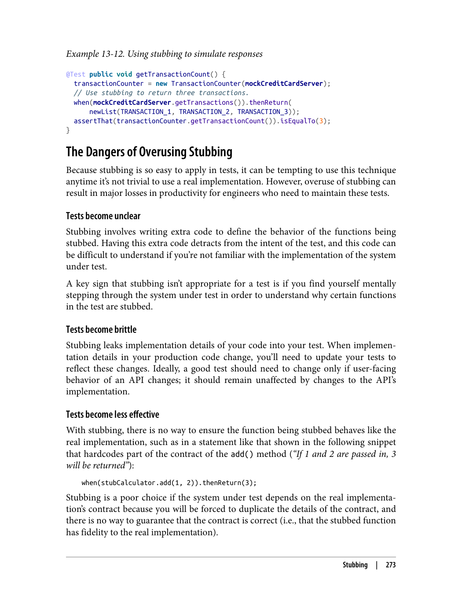

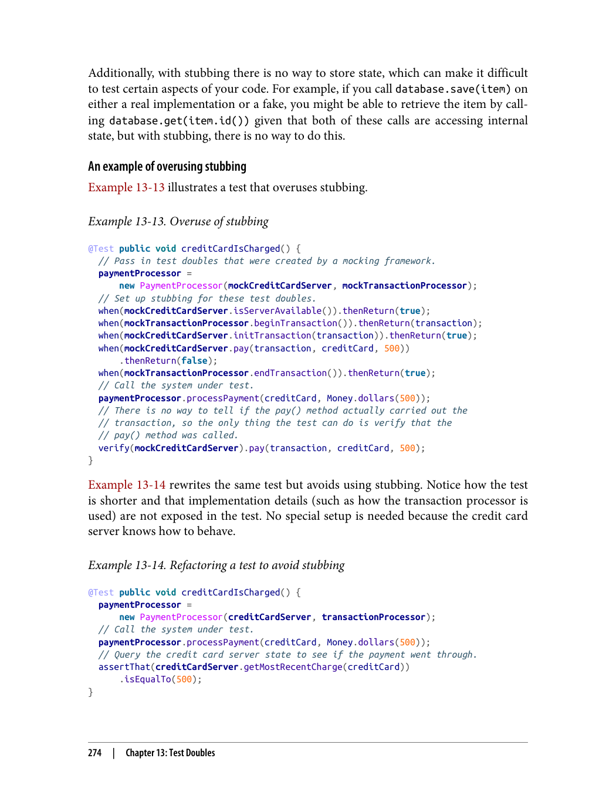

---
