> **راهنمای مطالعه**
>
> در هر بخش، ابتدا متن اصلی کتاب به زبان انگلیسی آورده شده و سپس ترجمه و توضیحات فارسی همان بخش ارائه شده است.

---
-

###### 📄 صفحه ۳۰۳
> Example 13-15. State testing
> @Test public void sortNumbers() {
> NumberSorter numberSorter = new NumberSorter(quicksort, bubbleSort);
> // Call the system under test.
> List sortedList = numberSorter.sortNumbers(newList(3, 1, 2));
> // Validate that the returned list is sorted. It doesn’t matter which
> // sorting algorithm is used, as long as the right result was returned.
> assertThat(sortedList).isEqualTo(newList(1, 2, 3));
> }
> Example 13-16 illustrates a similar test scenario but instead uses interaction testing.
> Note how it’s impossible for this test to determine that the numbers are actually sor‐
> ted, because the test doubles don’t know how to sort the numbers—all it can tell you
> is that the system under test tried to sort the numbers.
> Example 13-16. Interaction testing
> @Test public void sortNumbers_quicksortIsUsed() {
> // Pass in test doubles that were created by a mocking framework.
> NumberSorter numberSorter =
> new NumberSorter(mockQuicksort, mockBubbleSort);
> // Call the system under test.
> numberSorter.sortNumbers(newList(3, 1, 2));
> // Validate that numberSorter.sortNumbers() used quicksort. The test
> // will fail if mockQuicksort.sort() is never called (e.g., if
> // mockBubbleSort is used) or if it’s called with the wrong arguments.
> verify(mockQuicksort).sort(newList(3, 1, 2));
> }
> At Google, we’ve found that emphasizing state testing is more scalable; it reduces test
> brittleness, making it easier to change and maintain code over time.
> The primary issue with interaction testing is that it can’t tell you that the system
> under test is working properly; it can only validate that certain functions are called as
> expected. It requires you to make an assumption about the behavior of the code; for
> example, “If database.save(item) is called, we assume the item will be saved to the
> database.” State testing is preferred because it actually validates this assumption (such
> as by saving an item to a database and then querying the database to validate that the
> item exists).
> Another downside of interaction testing is that it utilizes implementation details of
> the system under test—to validate that a function was called, you are exposing to the
> test that the system under test calls this function. Similar to stubbing, this extra code
> makes tests brittle because it leaks implementation details of your production code
> into tests. Some people at Google jokingly refer to tests that overuse interaction
> 276
> |
> Chapter 13: Test Doubles

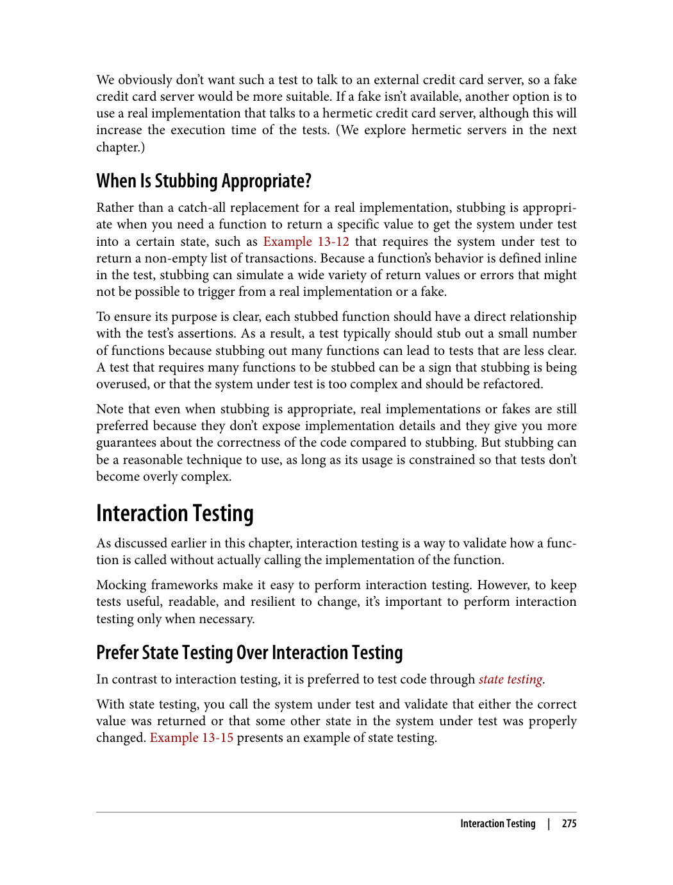

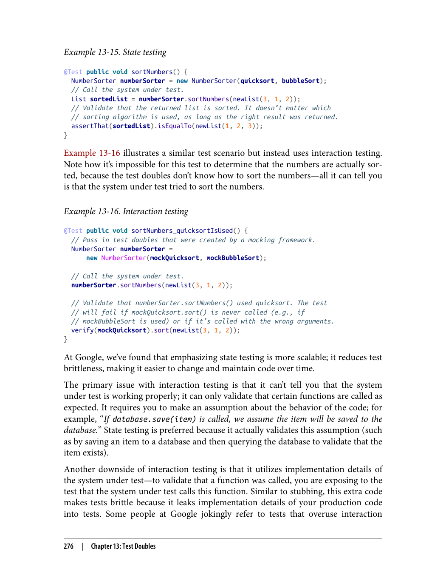

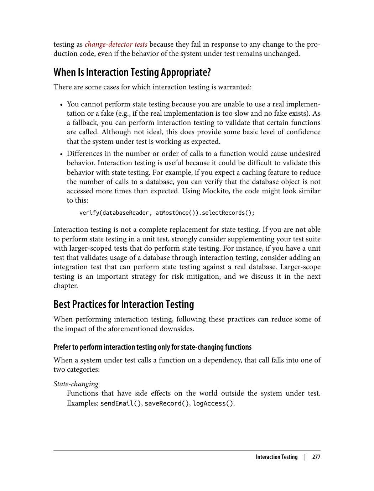

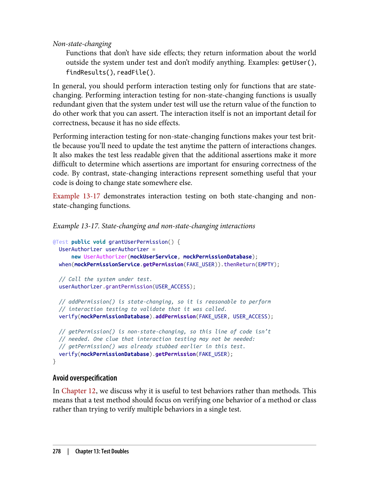

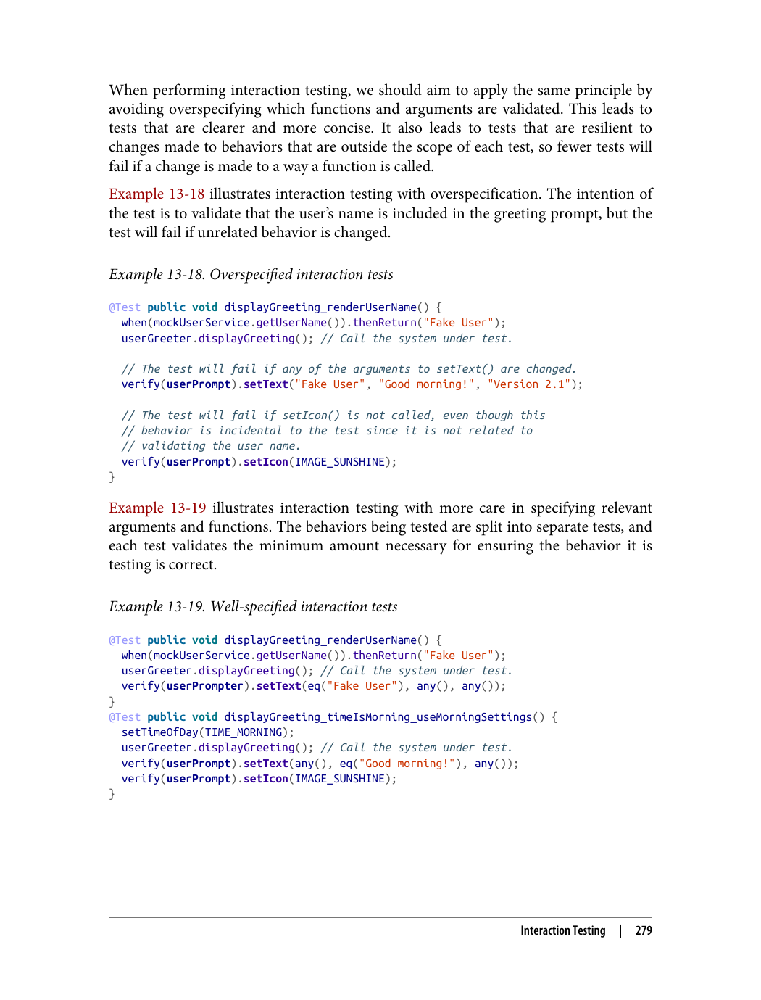

---

###### 📄 صفحه ۳۰۸
> CHAPTER 14
> Larger Testing
> Written by Joseph Graves
> Edited by Tom Manshreck
> In previous chapters, we have recounted how a testing culture was established at
> Google and how small unit tests became a fundamental part of the developer work‐
> flow. But what about other kinds of tests? It turns out that Google does indeed use
> many larger tests, and these comprise a significant part of the risk mitigation strategy
> necessary for healthy software engineering. But these tests present additional chal‐
> lenges to ensure that they are valuable assets and not resource sinks. In this chapter,
> we’ll discuss what we mean by “larger tests,” when we execute them, and best practi‐
> ces for keeping them effective.
> What Are Larger Tests?
> As mentioned previously, Google has specific notions of test size. Small tests are
> restricted to one thread, one process, one machine. Larger tests do not have the same
> restrictions. But Google also has notions of test scope. A unit test necessarily is of
> smaller scope than an integration test. And the largest-scoped tests (sometimes called
> end-to-end or system tests) typically involve several real dependencies and fewer test
> doubles.
> Larger tests are many things that small tests are not. They are not bound by the same
> constraints; thus, they can exhibit the following characteristics:
> • They may be slow. Our large tests have a default timeout of 15 minutes or 1 hour,
> but we also have tests that run for multiple hours or even days.
> • They may be nonhermetic. Large tests may share resources with other tests and
> traffic.
> 281

در پایگاه‌های کد بزرگ، پیدا کردن کد مورد نیاز بدون ابزار جستجو بسیار دشوار است. جستجوی کد به توسعه‌دهندگان کمک می‌کند تا کد مورد نظر خود را سریع پیدا کنند.

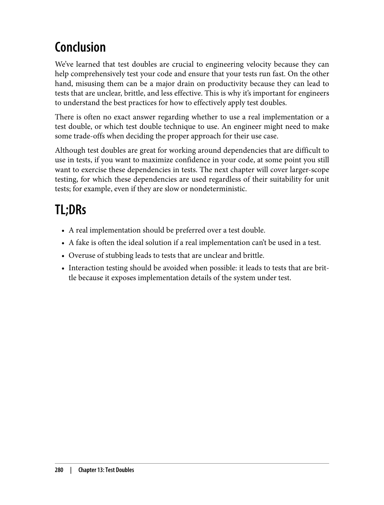

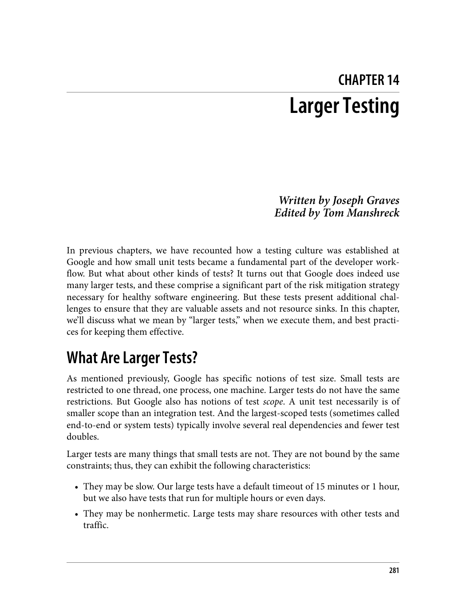

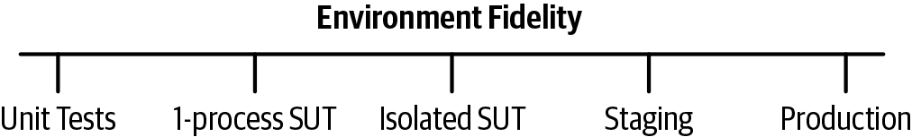

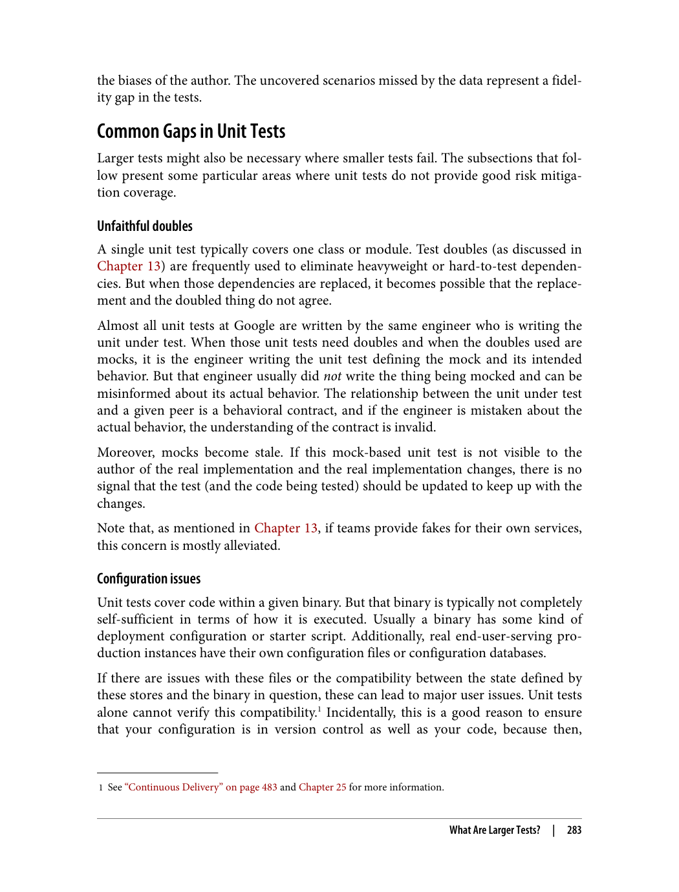

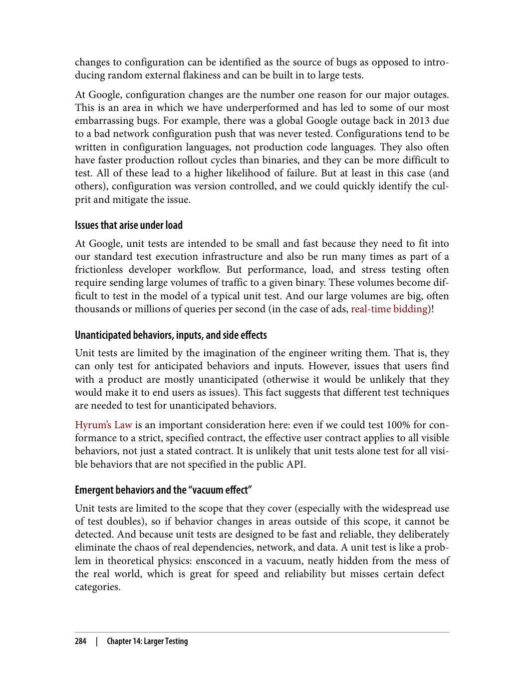

---

###### 📄 صفحه ۳۱۳
> single approach to Nooglers (new Googlers) or even more experienced engineers,
> which both perpetuates the situation and also leads to a lack of understanding about
> the motivations of such tests.
> Larger Tests at Google
> When we discussed the history of testing at Google earlier (see Chapter 11), we men‐
> tioned how Google Web Server (GWS) mandated automated tests in 2003 and how
> this was a watershed moment. However, we actually had automated tests in use before
> this point, but a common practice was using automated large and enormous tests. For
> example, AdWords created an end-to-end test back in 2001 to validate product sce‐
> narios. Similarly, in 2002, Search wrote a similar “regression test” for its indexing
> code, and AdSense (which had not even publicly launched yet) created its variation
> on the AdWords test.
> Other “larger” testing patterns also existed circa 2002. The Google search frontend
> relied heavily on manual QA—manual versions of end-to-end test scenarios. And
> Gmail got its version of a “local demo” environment—a script to bring up an end-to-
> end Gmail environment locally with some generated test users and mail data for local
> manual testing.
> When C/J Build (our first continuous build framework) launched, it did not distin‐
> guish between unit tests and other tests, but there were two critical developments that
> led to a split. First, Google focused on unit tests because we wanted to encourage the
> testing pyramid and to ensure the vast majority of written tests were unit tests. Sec‐
> ond, when TAP replaced C/J Build as our formal continuous build system, it was only
> able to do so for tests that met TAP’s eligibility requirements: hermetic tests buildable
> at a single change that could run on our build/test cluster within a maximum time
> limit. Although most unit tests satisfied this requirement, larger tests mostly did not.
> However, this did not stop the need for other kinds of tests, and they have continued
> to fill the coverage gaps. C/J Build even stuck around for years specifically to handle
> these kinds of tests until newer systems replaced it.
> Larger Tests and Time
> Throughout this book, we have looked at the influence of time on software engineer‐
> ing, because Google has built software running for more than 20 years. How are
> larger tests influenced by the time dimension? We know that certain activities make
> more sense the longer the expected lifespan of code, and testing of various forms is an
> activity that makes sense at all levels, but the test types that are appropriate change
> over the expected lifetime of code.
> As we pointed out before, unit tests begin to make sense for software with an
> expected lifespan from hours on up. At the minutes level (for small scripts), manual
> 286
> |
> Chapter 14: Larger Testing

سوالاتی که جستجوی کد به آن‌ها پاسخ می‌دهد:
1. **کجا**: کجا می‌توانم کد مشابه پیدا کنم؟
2. **چه کسی**: چه کسی این کد را نوشته است؟
3. **چرا**: چرا کد به این شکل نوشته شده است؟
4. **چگونه**: دیگران چگونه مشابه این مشکل را حل کرده‌اند؟

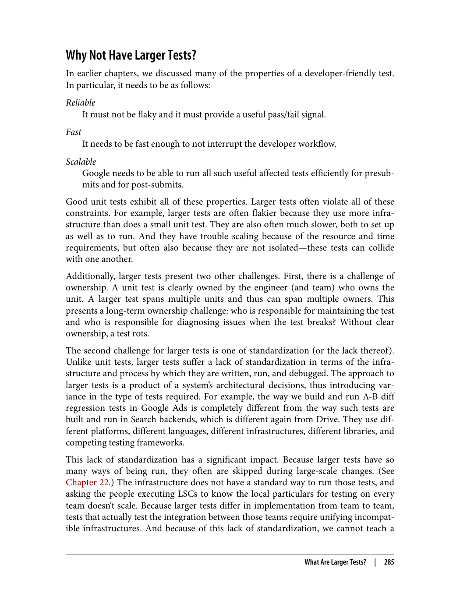

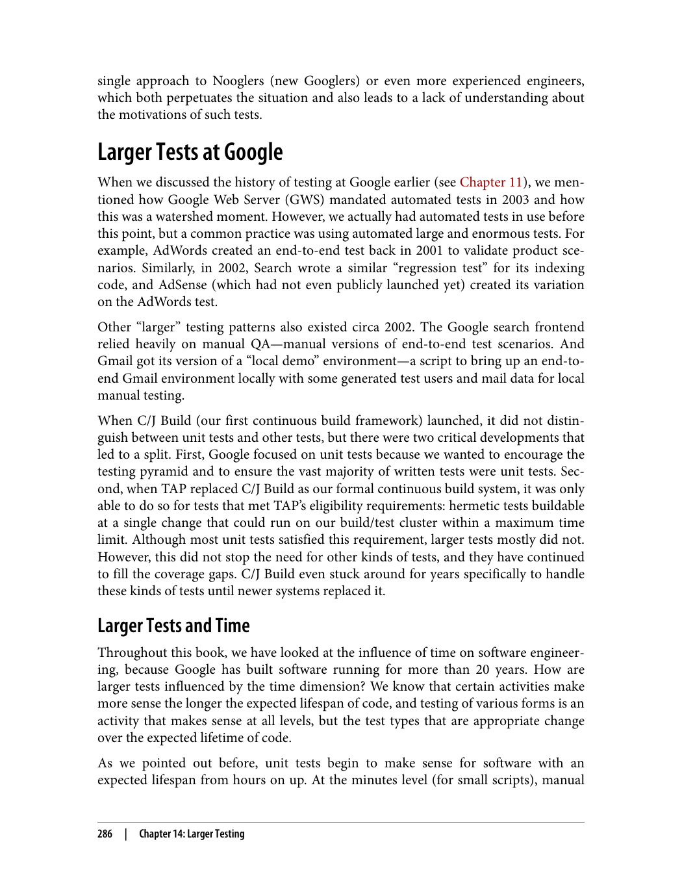

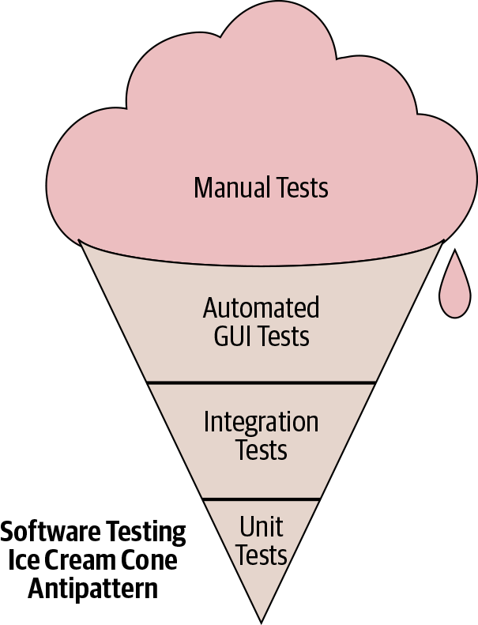

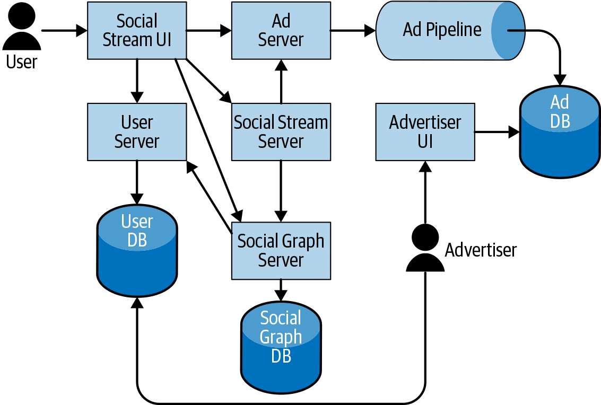

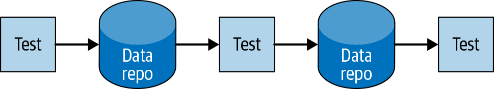

---

###### 📄 صفحه ۳۱۸
> Single-machine SUT
> The system under test consists of one or more separate binaries (same as produc‐
> tion) and the test is its own binary. But everything runs on one machine. This is
> used for “medium” tests. Ideally, we use the production launch configuration of
> each binary when running those binaries locally for increased fidelity.
> Multimachine SUT
> The system under test is distributed across multiple machines (much like a pro‐
> duction cloud deployment). This is even higher fidelity than the single-machine
> SUT, but its use makes tests “large” size and the combination is susceptible to
> increased network and machine flakiness.
> Shared environments (staging and production)
> Instead of running a standalone SUT, the test just uses a shared environment.
> This has the lowest cost because these shared environments usually already exist,
> but the test might conflict with other simultaneous uses and one must wait for
> the code to be pushed to those environments. Production also increases the risk
> of end-user impact.
> Hybrids
> Some SUTs represent a mix: it might be possible to run some of the SUT but have
> it interact with a shared environment. Usually the thing being tested is explicitly
> run but its backends are shared. For a company as expansive as Google, it is prac‐
> tically impossible to run multiple copies of all of Google’s interconnected serv‐
> ices, so some hybridization is required.
> The benefits of hermetic SUTs
> The SUT in a large test can be a major source of both unreliability and long turn‐
> around time. For example, an in-production test uses the actual production system
> deployment. As mentioned earlier, this is popular because there is no extra overhead
> cost for the environment, but production tests cannot be run until the code reaches
> that environment, which means those tests cannot themselves block the release of the
> code to that environment—the SUT is too late, essentially.
> The most common first alternative is to create a giant shared staging environment
> and to run tests there. This is usually done as part of some release promotion process,
> but it again limits test execution to only when the code is available. As an alternative,
> some teams will allow engineers to “reserve” time in the staging environment and to
> use that time window to deploy pending code and to run tests, but this does not scale
> with a growing number of engineers or a growing number of services, because the
> environment, its number of users, and the likelihood of user conflicts all quickly
> grow.
> Structure of a Large Test
> |
> 291

چالش‌های اصلی:
1. **تأخیر ایندکس**: زمان مورد نیاز برای ایندکس کردن کد جدید
2. **تأخیر جستجو**: زمان مورد نیاز برای اجرای جستجو
3. **دقت نتایج**: اطمینان از دقیق بودن نتایج جستجو

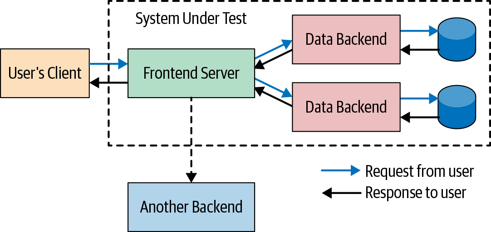

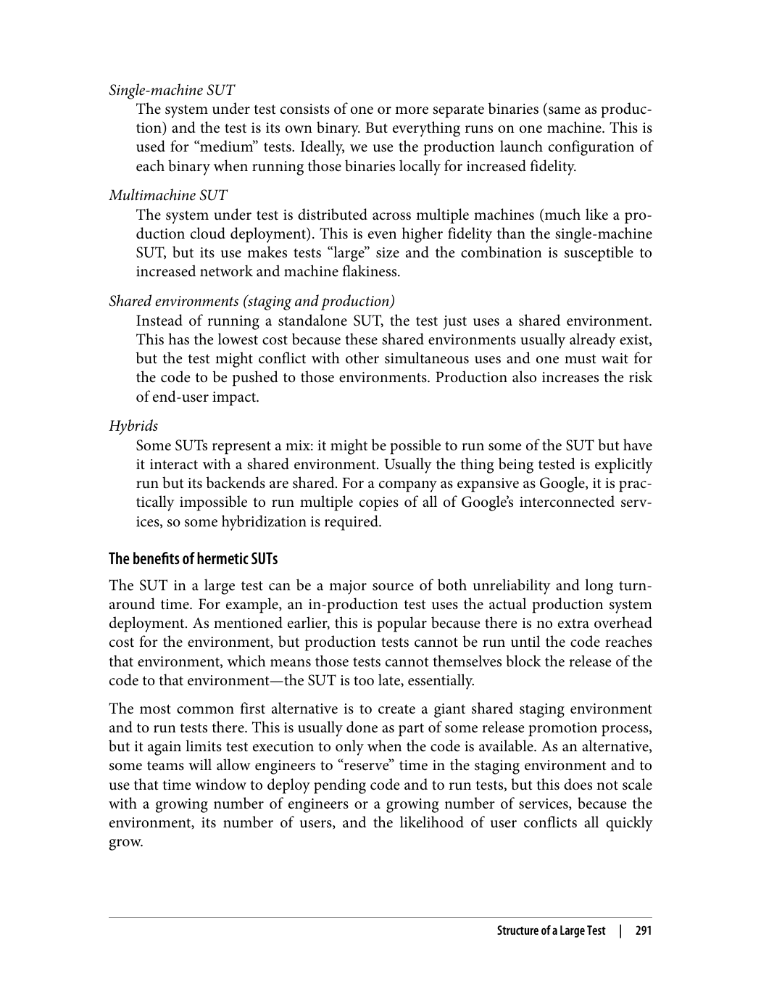

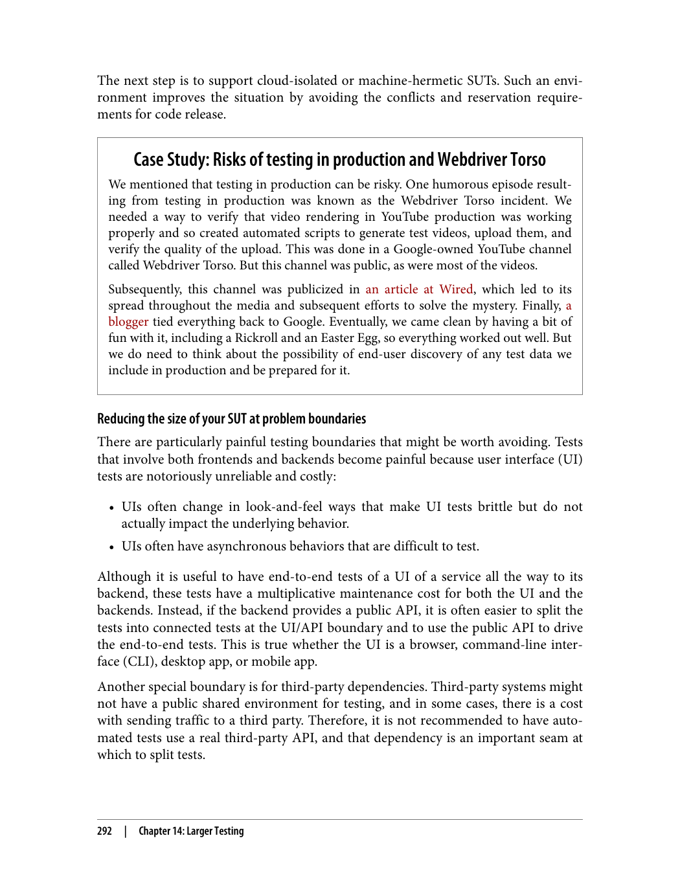

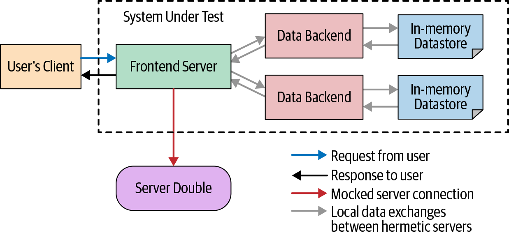

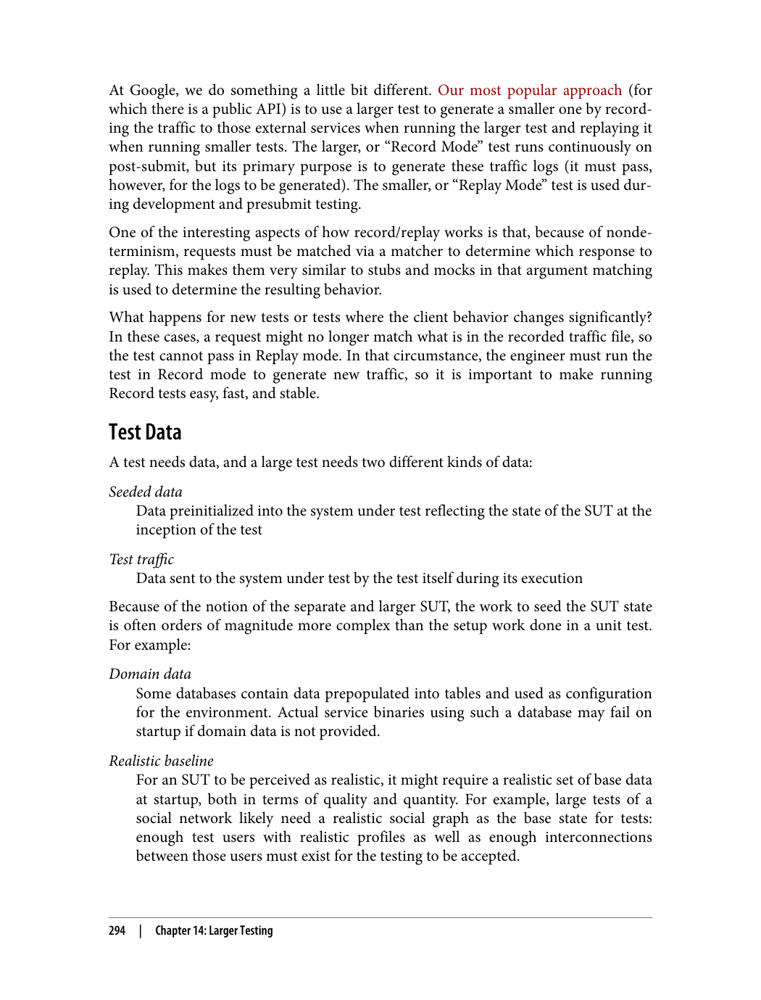

---

###### 📄 صفحه ۳۲۳
> A/B comparison (differential)
> Instead of defining explicit assertions, A/B testing involves running two copies of
> the SUT, sending the same data, and comparing the output.  The intended behav‐
> ior is not explicitly defined: a human must manually go through the differences
> to ensure any changes are intended.
> Types of Larger Tests
> We can now combine these different approaches to the SUT, data, and assertions to
> create different kinds of large tests. Each test then has different properties as to which
> risks it mitigates; how much toil is required to write, maintain, and debug it; and how
> much it costs in terms of resources to run.
> What follows is a list of different kinds of large tests that we use at Google, how they
> are composed, what purpose they serve, and what their limitations are:
> • Functional testing of one or more binaries
> • Browser and device testing
> • Performance, load, and stress testing
> • Deployment configuration testing
> • Exploratory testing
> • A/B diff (regression) testing
> • User acceptance testing (UAT)
> • Probers and canary analysis
> • Disaster recovery and chaos engineering
> • User evaluation
> Given such a wide number of combinations and thus a wide range of tests, how do we
> manage what to do and when? Part of designing software is drafting the test plan, and
> a key part of the test plan is a strategic outline of what types of testing are needed and
> how much of each. This test strategy identifies the primary risk vectors and the nec‐
> essary testing approaches to mitigate those risk vectors.
> At Google, we have a specialized engineering role of “Test Engineer,” and one of the
> things we look for in a good test engineer is the ability to outline a test strategy for
> our products.
> 296
> |
> Chapter 14: Larger Testing

معاملات اصلی:
1. **完整性**: آیا همه نتایج نشان داده شوند یا فقط مرتبط‌ترین‌ها؟
2. **بیان‌گری**: آیا جستجو بر اساس توکن، زیررشته یا عبارت باشد؟
3. **رابط کاربری**: رابط کاربری باید ساده و قابل استفاده باشد

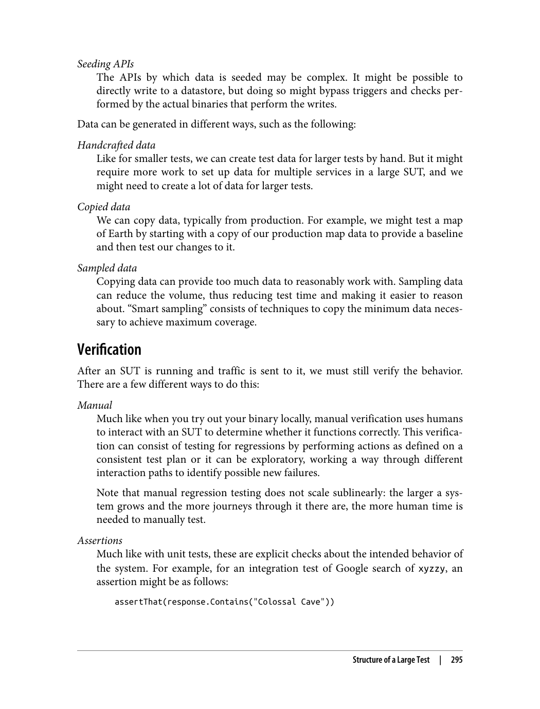

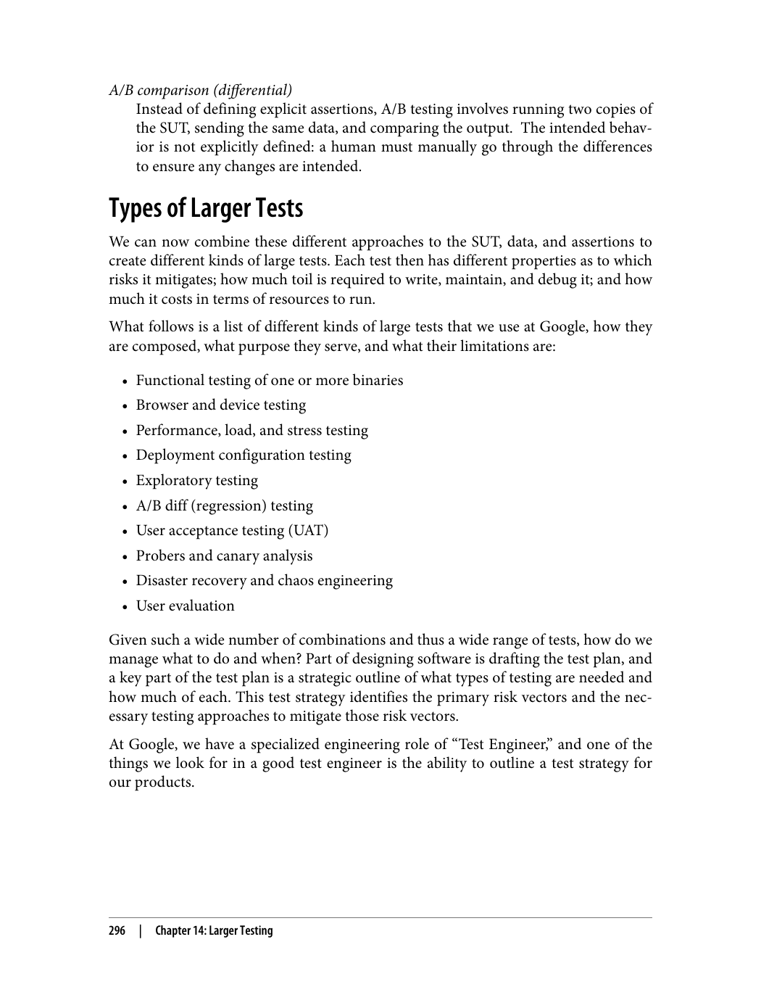

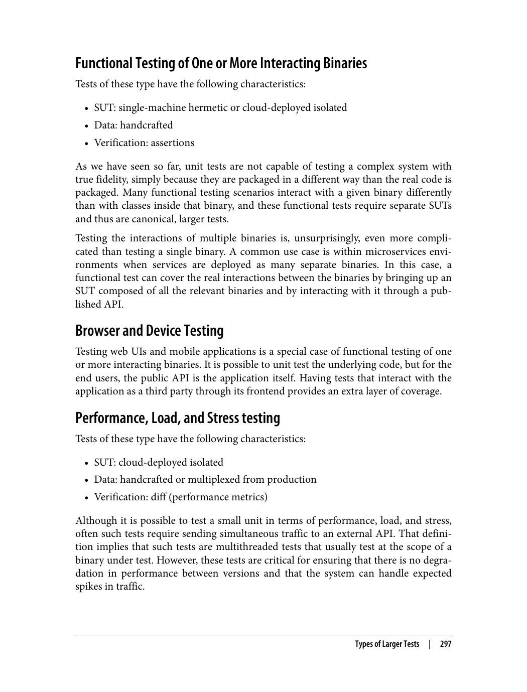

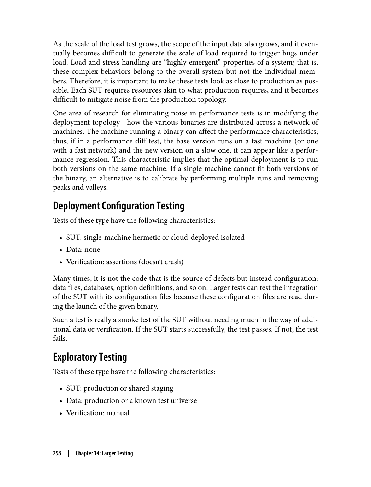

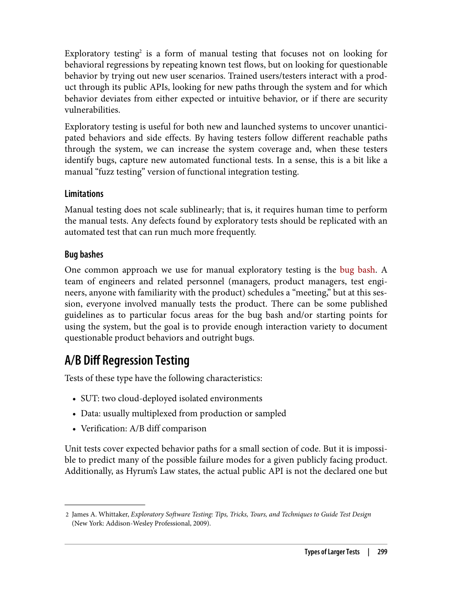

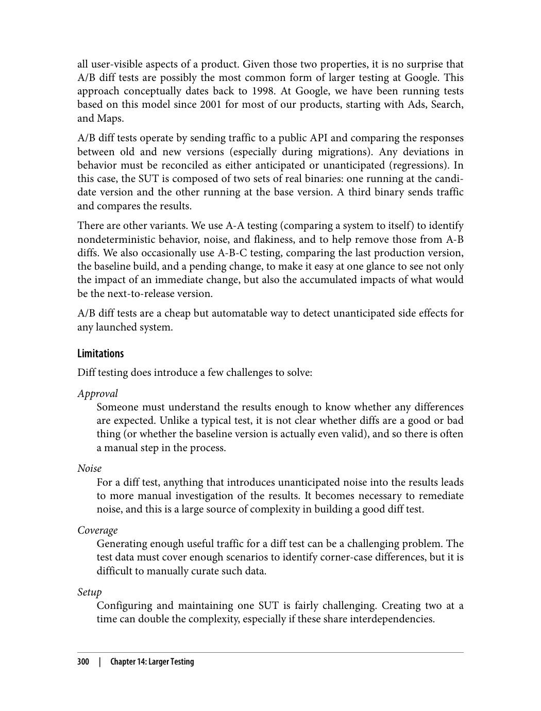

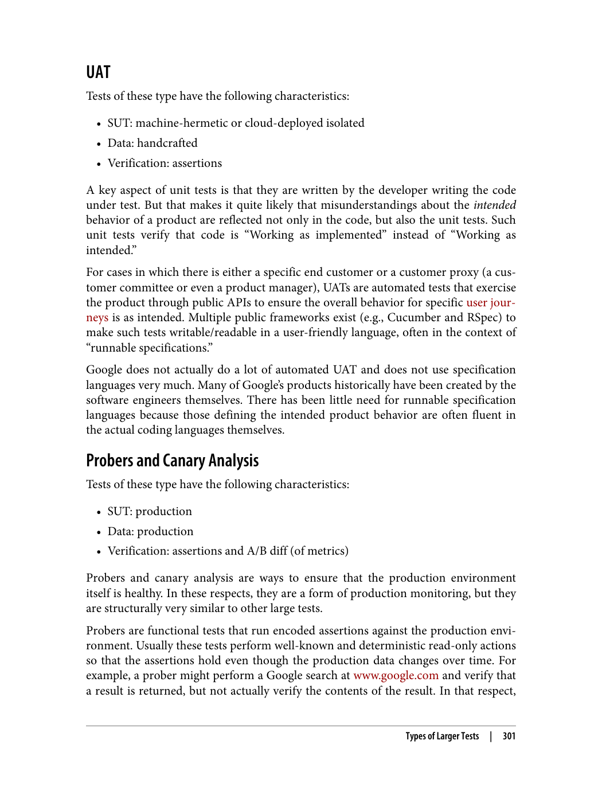

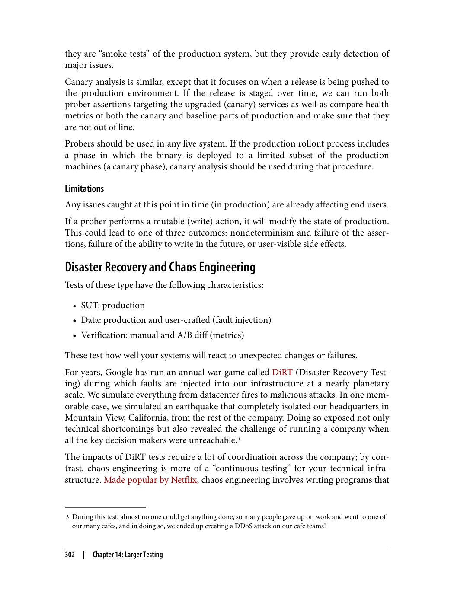

---
