> **راهنمای مطالعه**
>
> در هر بخش، ابتدا متن اصلی کتاب به زبان انگلیسی آورده شده و سپس ترجمه و توضیحات فارسی همان بخش ارائه شده است.

---
-

###### 📄 صفحه ۳۳۱
> had a limited experiment changing the way video upvotes worked (eliminating
> the downvote), and only a portion of the user base saw this change.
> This is a massively important approach for Google. One of the first stories a Noo‐
> gler hears upon joining the company is about the time Google launched an
> experiment changing the background shading color for AdWords ads in Google
> Search and noticed a significant increase in ad clicks for users in the experimen‐
> tal group versus the control group.
> Rater evaluation
> Human raters are presented with results for a given operation and choose which
> one is “better” and why. This feedback is then used to determine whether a given
> change is positive, neutral, or negative. For example, Google has historically used
> rater evaluation for search queries (we have published the guidelines we give our
> raters). In some cases, the feedback from this ratings data can help determine
> launch go/no-go for algorithm changes. Rater evaluation is critical for nondeter‐
> ministic systems like machine learning systems for which there is no clear correct
> answer, only a notion of better or worse.
> Large Tests and the Developer Workflow
> We’ve talked about what large tests are, why to have them, when to have them, and
> how much to have, but we have not said much about the who. Who writes the tests?
> Who runs the tests and investigates the failures? Who owns the tests? And how do we
> make this tolerable?
> Although standard unit test infrastructure might not apply, it is still critical to inte‐
> grate larger tests into the developer workflow. One way of doing this is to ensure that
> automated mechanisms for presubmit and post-submit execution exist, even if these
> are different mechanisms than the unit test ones. At Google, many of these large tests
> do not belong in TAP. They are nonhermetic, too flaky, and/or too resource intensive.
> But we still need to keep them from breaking or else they provide no signal and
> become too difficult to triage. What we do, then, is to have a separate post-submit
> continuous build for these. We also encourage running these tests presubmit, because
> that provides feedback directly to the author.
> A/B diff tests that require manual blessing of diffs can also be incorporated into such
> a workflow. For presubmit, it can be a code-review requirement to approve any diffs
> in the UI before approving the change. One such test we have files release-blocking
> bugs automatically if code is submitted with unresolved diffs.
> In some cases, tests are so large or painful that presubmit execution adds too much
> developer friction. These tests still run post-submit and are also run as part of the
> release process. The drawback to not running these presubmit is that the taint makes
> it into the monorepo and we need to identify the culprit change to roll it back. But we
> 304
> |
> Chapter 14: Larger Testing

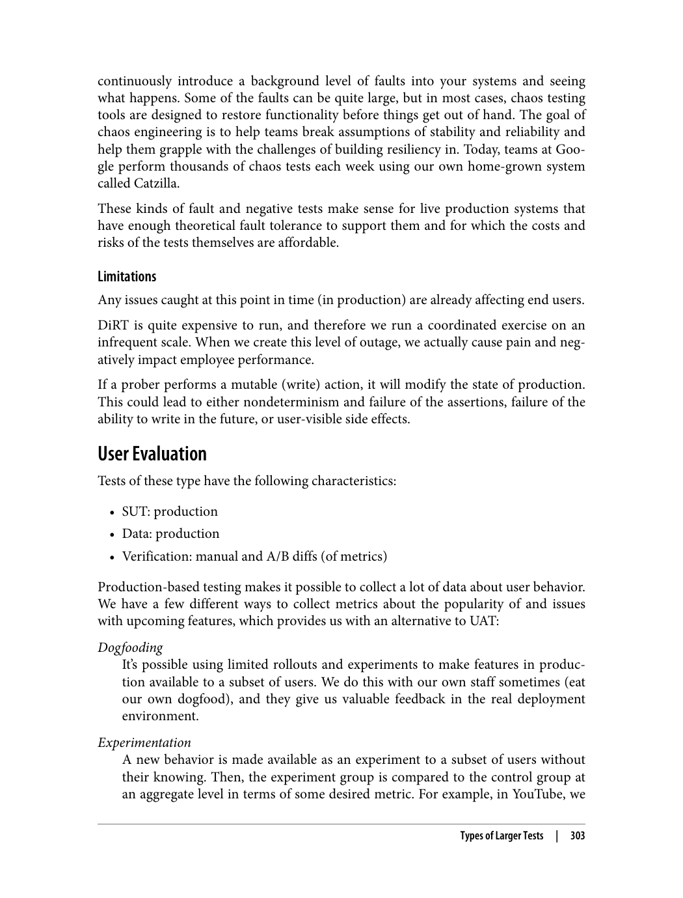

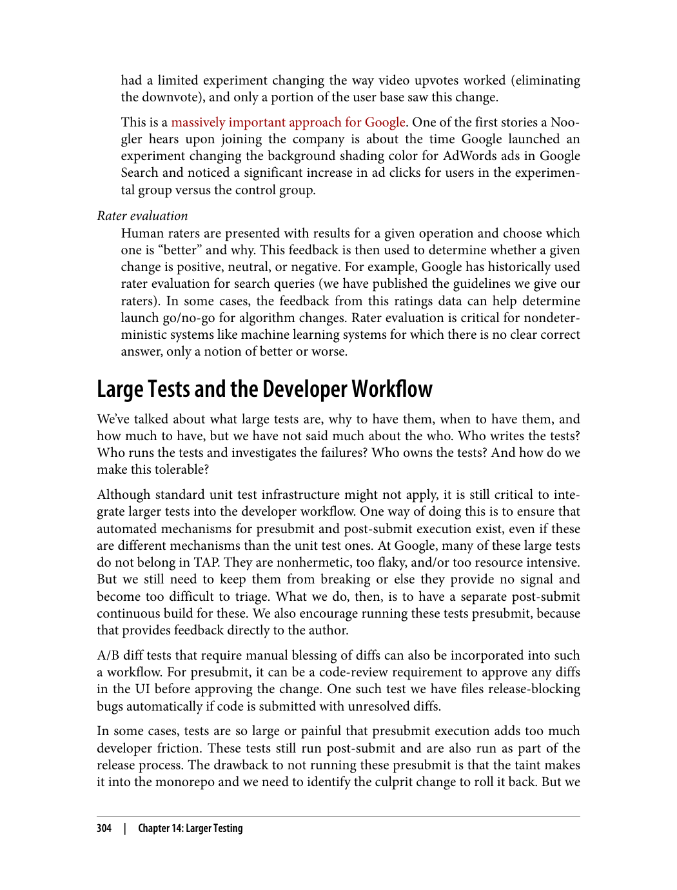

---

###### 📄 صفحه ۳۳۳
> The best way to speed up a test is often to reduce its scope or to split a large test into
> two smaller tests that can run in parallel. But there are some other tricks that you can
> do to speed up larger tests.
> Some naive tests will use time-based sleeps to wait for nondeterministic action to
> occur, and this is quite common in larger tests. However, these tests do not have
> thread limitations, and real production users want to wait as little as possible, so it is
> best for tests to react the way real production users would. Approaches include the
> following:
> • Polling for a state transition repeatedly over a time window for an event to com‐
> plete with a frequency closer to microseconds. You can combine this with a time‐
> out value in case a test fails to reach a stable state.
> • Implementing an event handler.
> • Subscribing to a notification system for an event completion.
> Note that tests that rely on sleeps and timeouts will all start failing when the fleet run‐
> ning those tests becomes overloaded, which spirals because those tests need to be
> rerun more often, increasing the load further.
> Lower internal system timeouts and delays
> A production system is usually configured assuming a distributed deployment
> topology, but an SUT might be deployed on a single machine (or at least a cluster
> of colocated machines). If there are hardcoded timeouts or (especially) sleep
> statements in the production code to account for production system delay, these
> should be made tunable and reduced when running tests.
> Optimize test build time
> One downside of our monorepo is that all of the dependencies for a large test are
> built and provided as inputs, but this might not be necessary for some larger
> tests. If the SUT is composed of a core part that is truly the focus of the test and
> some other necessary peer binary dependencies, it might be possible to use pre‐
> built versions of those other binaries at a known good version. Our build system
> (based on the monorepo) does not support this model easily, but the approach is
> actually more reflective of production in which different services release at differ‐
> ent versions.
> Driving out flakiness
> Flakiness is bad enough for unit tests, but for larger tests, it can make them unusable.
> A team should view eliminating flakiness of such tests as a high priority. But how can
> flakiness be removed from such tests?
> 306
> |
> Chapter 14: Larger Testing

تحلیل ایستا می‌تواند مشکلاتی مانند باگ‌ها، مشکلات امنیتی و مشکلات عملکرد را بدون اجرای کد شناسایی کند.

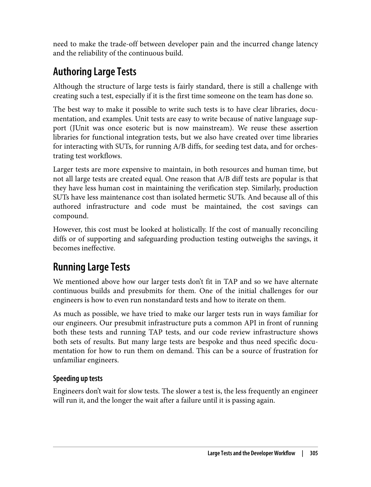

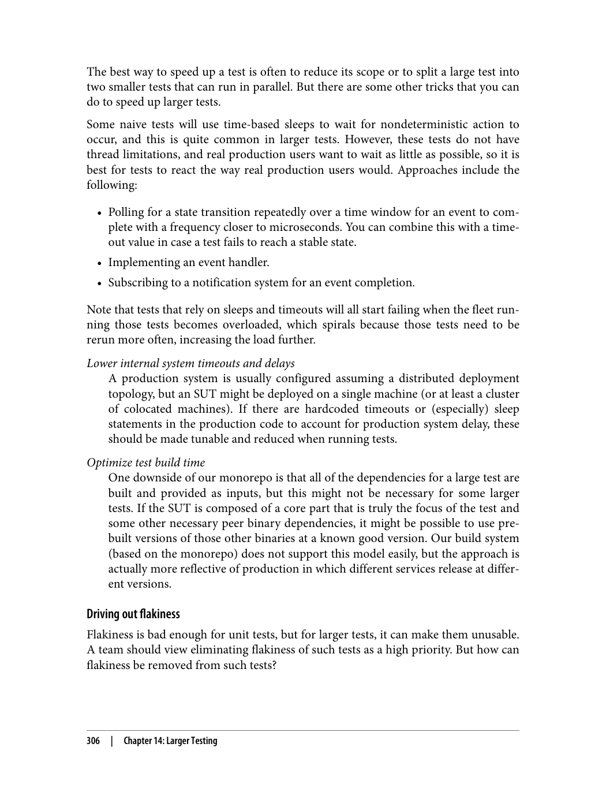

---

###### 📄 صفحه ۳۳۵
> Minimize the effort necessary to identify the root cause of the discrepancy
> A stack trace is not useful for larger tests because the call chain can span multiple
> process boundaries. Instead, it’s necessary to produce a trace across the call chain
> or to invest in automation that can narrow down the culprit. The test should pro‐
> duce some kind of artifact to this effect. For example, Dapper is a framework
> used by Google to associate a single request ID with all the requests in an RPC
> call chain, and all of the associated logs for that request can be correlated by that
> ID to facilitate tracing.
> Provide support and contact information.
> It should be easy for the test runner to get help by making the owners and sup‐
> porters of the test easy to contact.
> Owning Large Tests
> Larger tests must have documented owners—engineers who can adequately review
> changes to the test and who can be counted on to provide support in the case of test
> failures. Without proper ownership, a test can fall victim to the following:
> • It becomes more difficult for contributors to modify and update the test
> • It takes longer to resolve test failures
> And the test rots.
> Integration tests of components within a particular project should be owned by the
> project lead. Feature-focused tests (tests that cover a particular business feature across
> a set of services) should be owned by a “feature owner”; in some cases, this owner
> might be a software engineer responsible for the feature implementation end to end;
> in other cases it might be a product manager or a “test engineer” who owns the
> description of the business scenario. Whoever owns the test must be empowered to
> ensure its overall health and must have both the ability to support its maintenance
> and the incentives to do so.
> It is possible to build automation around test owners if this information is recorded
> in a structured way. Some approaches that we use include the following:
> Regular code ownership
> In many cases, a larger test is a standalone code artifact that lives in a particular
> location in our codebase. In that case, we can use the OWNERS (Chapter 9)
> information already present in the monorepo to hint to automation that the
> owner(s) of a particular test are the owners of the test code.
> Per-test annotations
> In some cases, multiple test methods can be added to a single test class or mod‐
> ule, and each of these test methods can have a different feature owner. We use
> 308
> |
> Chapter 14: Larger Testing

ویژگی‌های اصلی:
1. **مقیاس‌پذیری**: باید بتواند با پایگاه‌های کد بزرگ کار کند
2. **قابلیت استفاده**: باید آسان برای استفاده باشد
3. **دقت**: باید نتایج دقیق ارائه دهد
4. **سرعت**: باید سریع اجرا شود

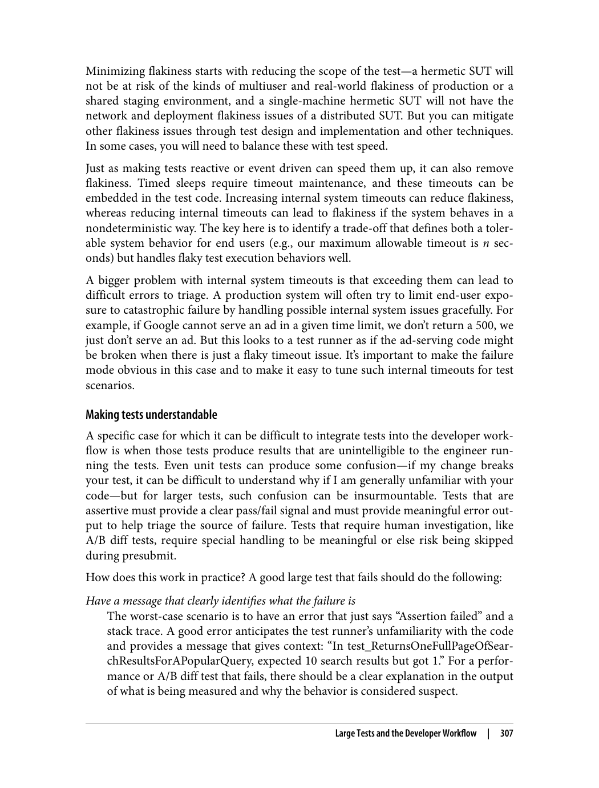

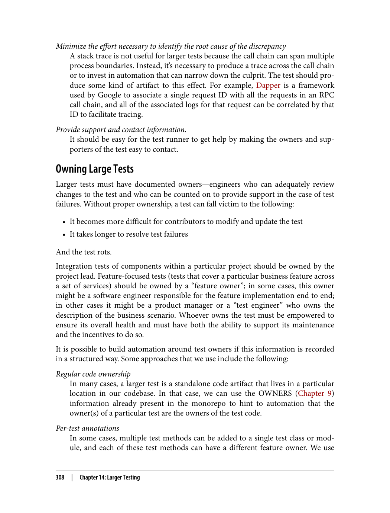

---

###### 📄 صفحه ۳۳۷

درس‌های اصلی:
1. **تمرکز بر خوشحالی توسعه‌دهنده**: ابزارها باید مفید و آسان باشند
2. **بخشی از گردش کار توسعه**: تحلیل ایستا باید بخشی طبیعی از گردش کار باشد
3. **توانمندسازی کاربران**: کاربران باید بتوانند مشارکت کنند

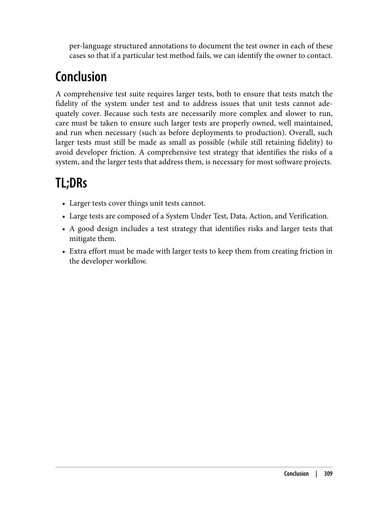

---

###### 📄 صفحه ۳۳۹
> the lessons we’ve learned as we’ve deprecated large and heavily used internal systems.
> Sometimes, it works as expected, and sometimes it doesn’t, but the general problem
> of removing obsolete systems remains a difficult and evolving concern in the indus‐
> try.
> This chapter primarily deals with deprecating technical systems, not end-user prod‐
> ucts. The distinction is somewhat arbitrary given that an external-facing API is just
> another sort of product, and an internal API may have consumers that consider
> themselves end users. Although many of the principles apply to turning down a pub‐
> lic product, we concern ourselves here with the technical and policy aspects of depre‐
> cating and removing obsolete systems where the system owner has visibility into its
> use.
> Why Deprecate?
> Our discussion of deprecation begins from the fundamental premise that code is a lia‐
> bility, not an asset. After all, if code were an asset, why should we even bother spend‐
> ing time trying to turn down and remove obsolete systems? Code has costs, some of
> which are borne in the process of creating a system, but many other costs are borne as
> a system is maintained across its lifetime. These ongoing costs, such as the opera‐
> tional resources required to keep a system running or the effort to continually update
> its codebase as surrounding ecosystems evolve, mean that it’s worth evaluating the
> trade-offs between keeping an aging system running or working to turn it down.
> The age of a system alone doesn’t justify its deprecation. A system could be finely
> crafted over several years to be the epitome of software form and function. Some soft‐
> ware systems, such as the LaTeX typesetting system, have been improved over the
> course of decades, and even though changes still happen, they are few and far
> between. Just because something is old, it does not follow that it is obsolete.
> Deprecation is best suited for systems that are demonstrably obsolete and a replace‐
> ment exists that provides comparable functionality. The new system might use
> resources more efficiently, have better security properties, be built in a more sustaina‐
> ble fashion, or just fix bugs. Having two systems to accomplish the same thing might
> not seem like a pressing problem, but over time, the costs of maintaining them both
> can grow substantially. Users may need to use the new system, but still have depen‐
> dencies that use the obsolete one.
> The two systems might need to interface with each other, requiring complicated
> transformation code. As both systems evolve, they may come to depend on each
> other, making eventual removal of either more difficult. In the long run, we’ve discov‐
> ered that having multiple systems performing the same function also impedes the
> evolution of the newer system because it is still expected to maintain compatibility
> 312
> |
> Chapter 15: Deprecation

ویژگی‌های Tricorder:
1. **تحلیل در حین ویرایش**: تحلیل کد در حین نوشتن
2. **یکپارچه‌سازی با کامپایلر**: ادغام با کامپایلر
3. **بازخورد یکپارچه**: ارائه بازخورد در محیط توسعه
4. **ابزارهای یکپارچه**: ابزارهای مختلف در یک پلتفرم

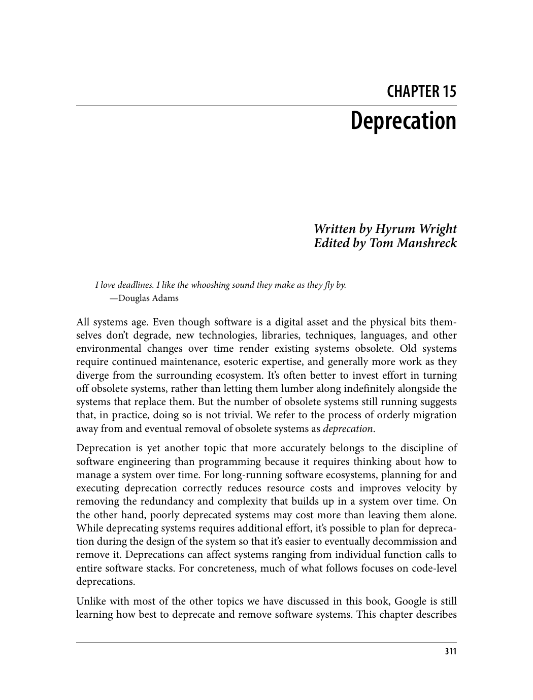

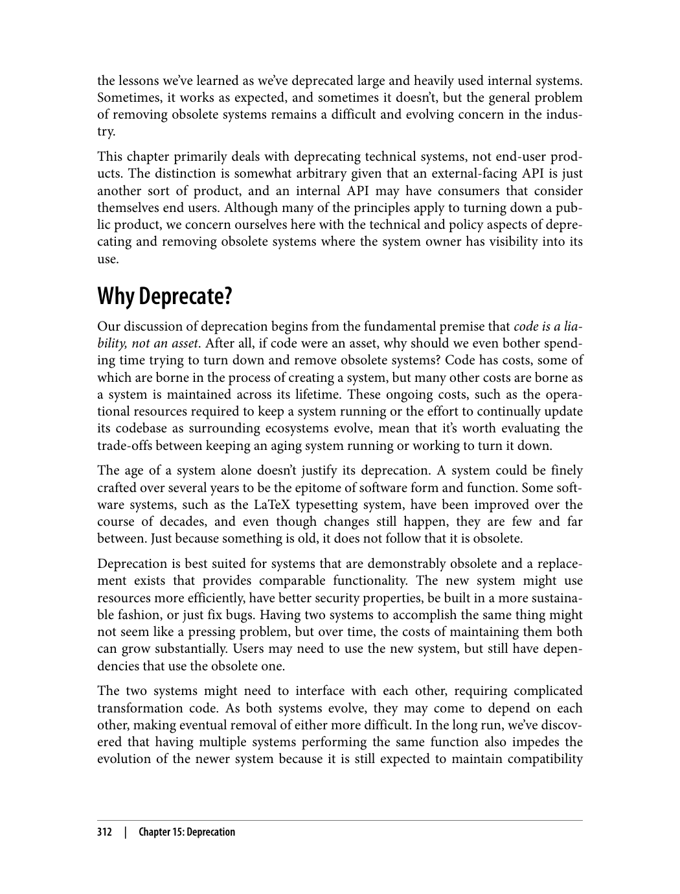

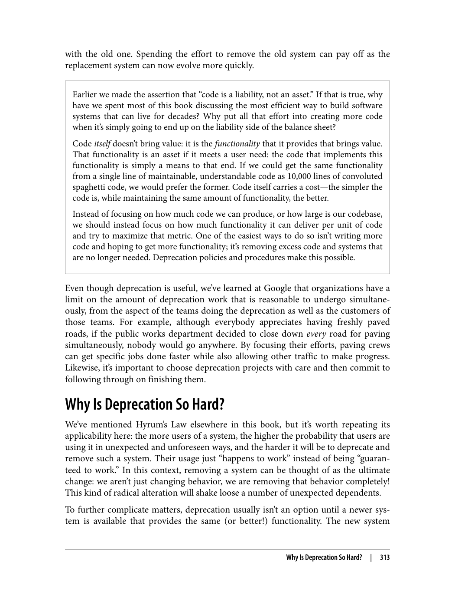

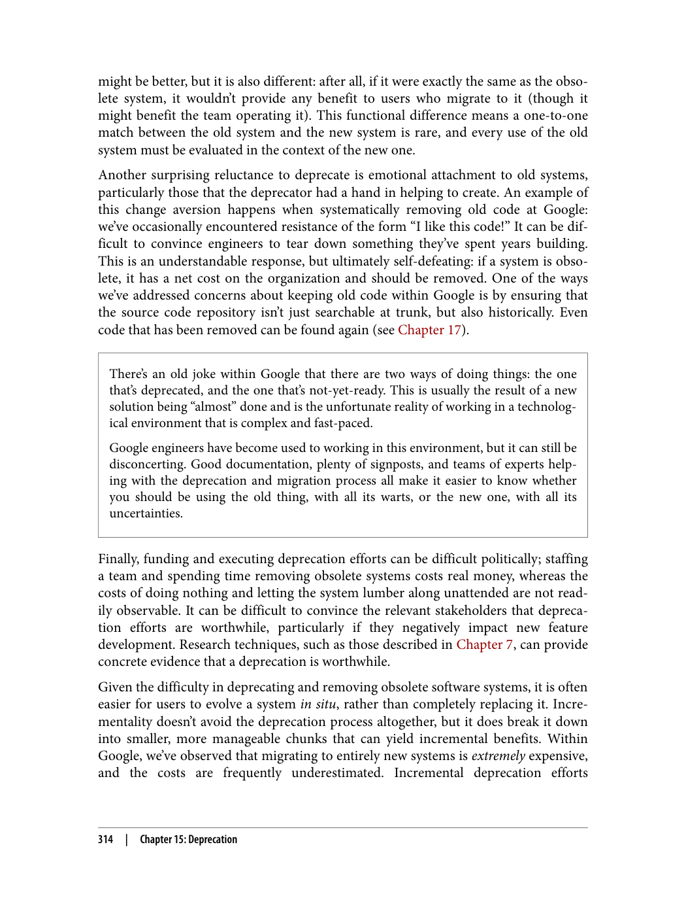

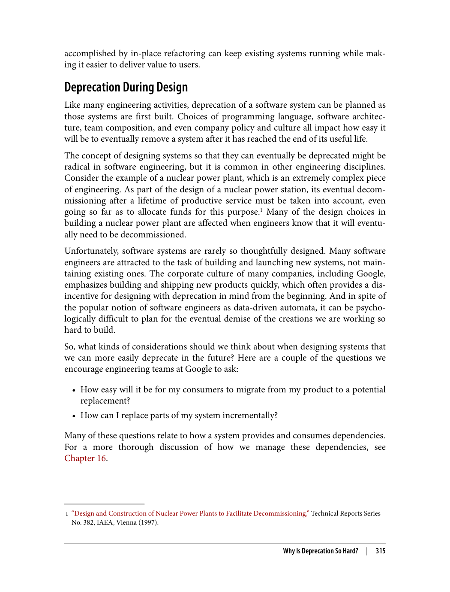

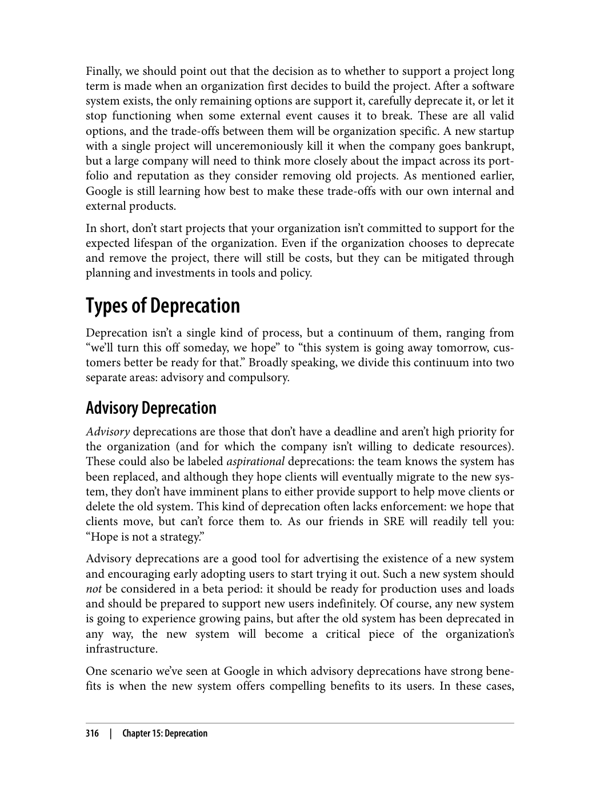

---
