## فصل ۱۶: آزمایش نرم‌افزار

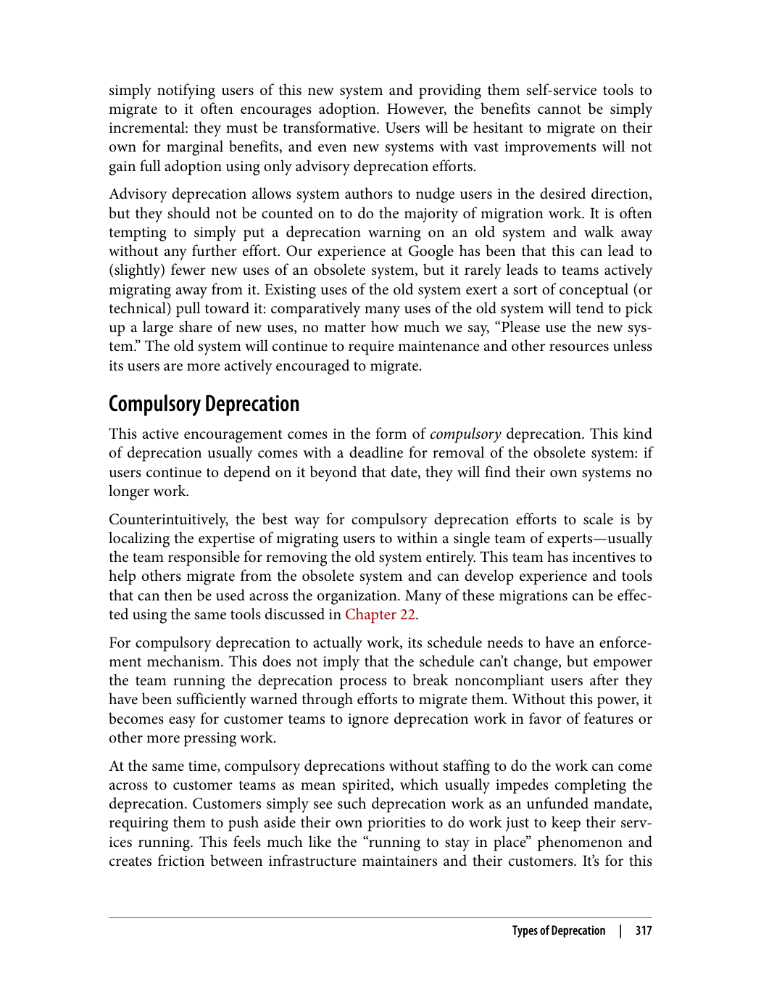

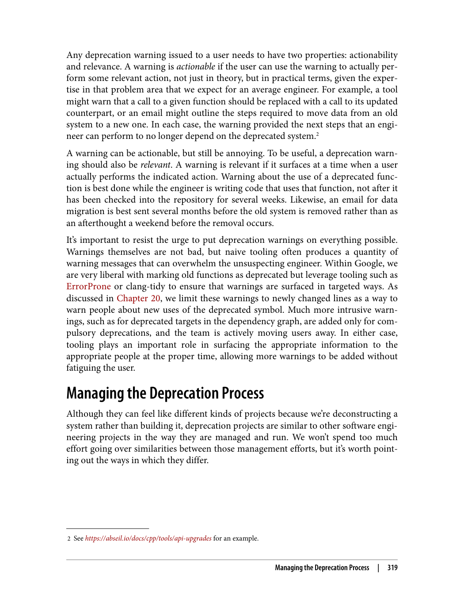

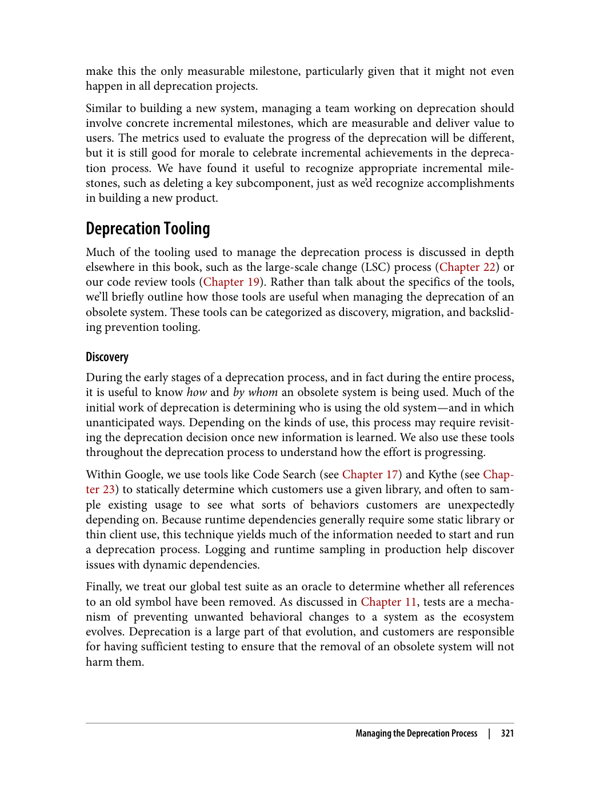

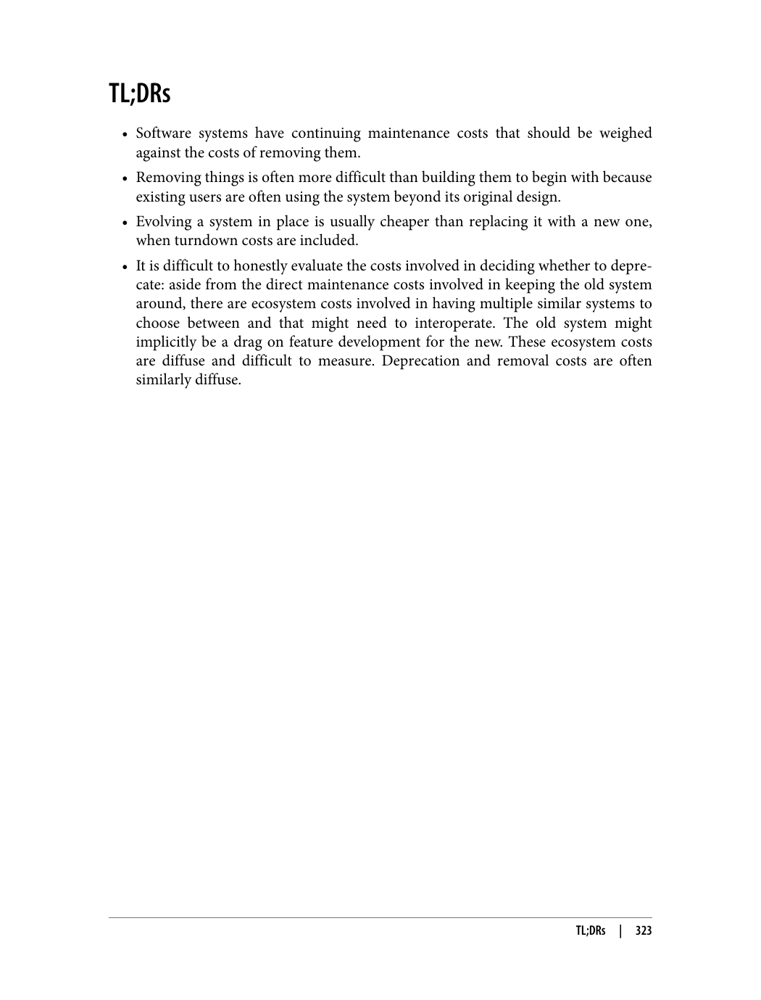

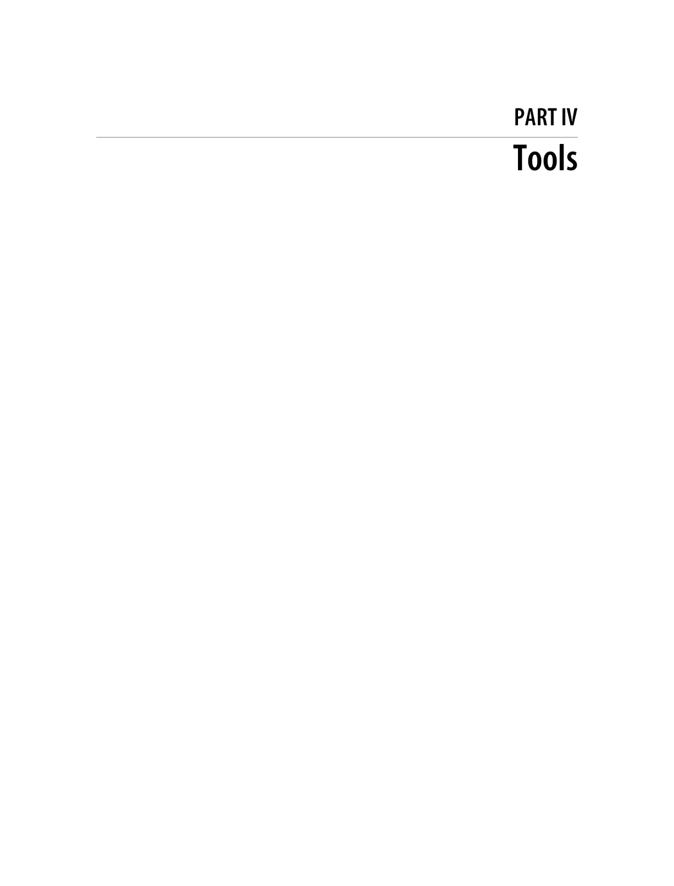

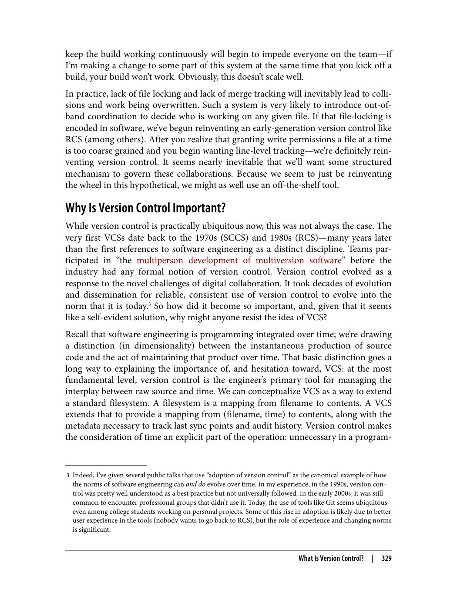

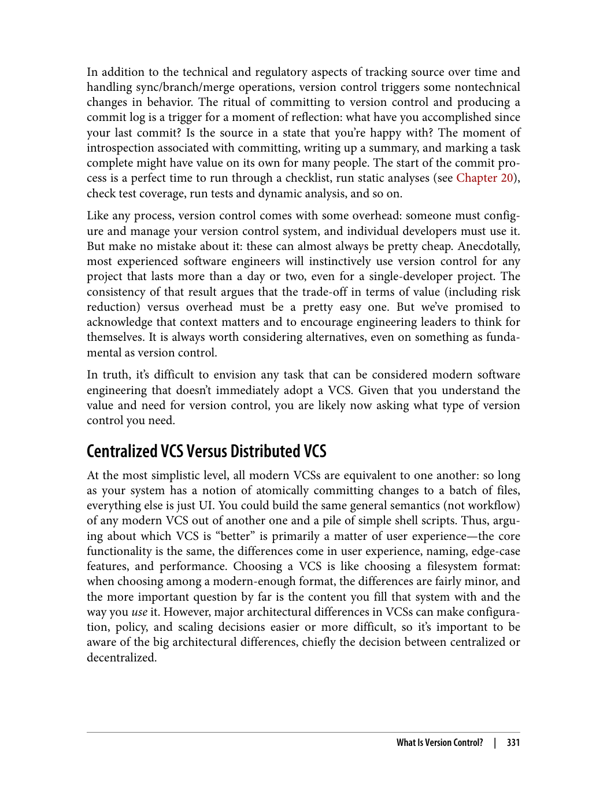

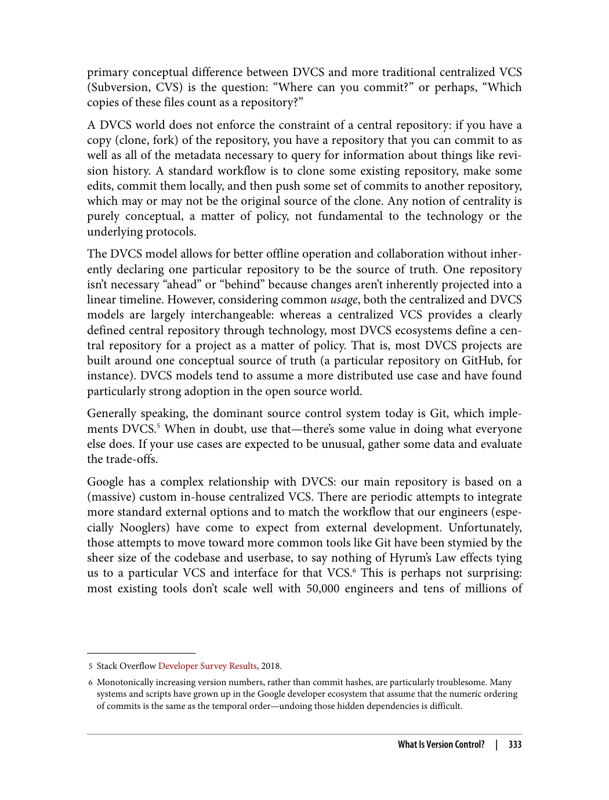

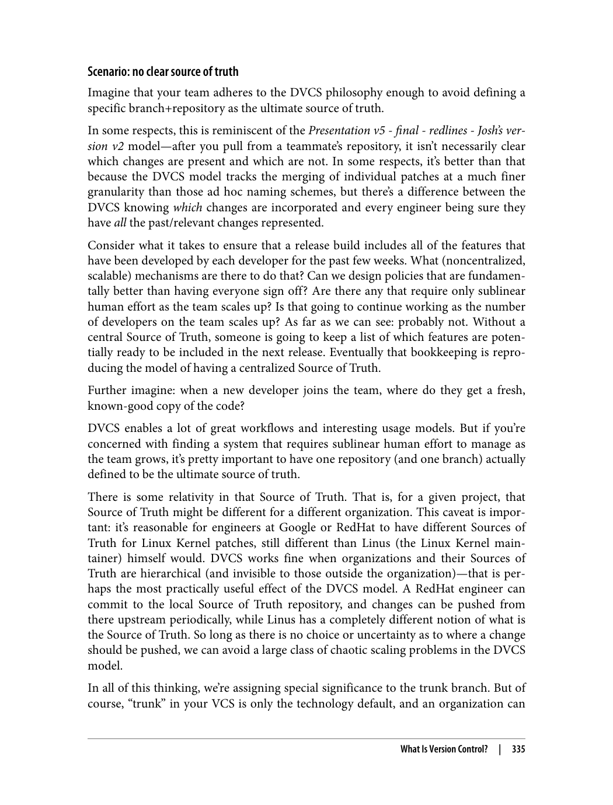

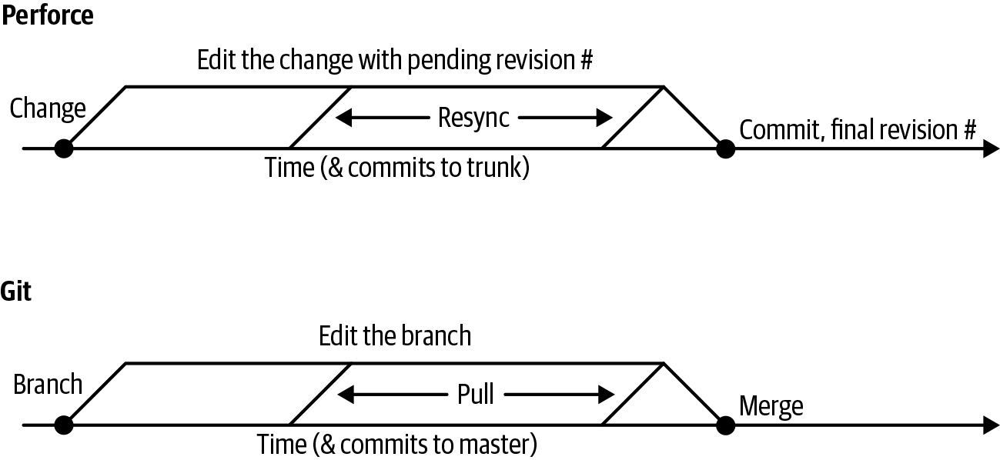

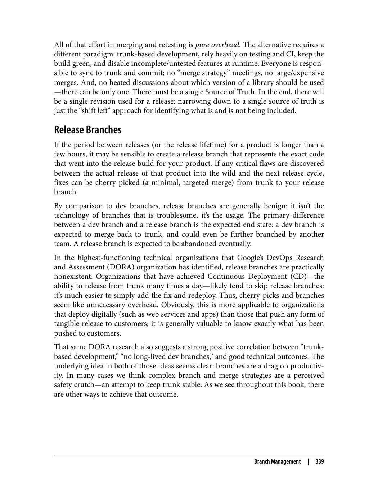

---

> "آزمایش نرم‌افزار، فرآیند تأیید درستی و عملکرد نرم‌افزار است. تست‌ها باید خودکار، قابل اطمینان و نگهداری باشند."

### چرا نرم‌افزار را تست می‌کنیم؟

> "تست نرم‌افزار به شناسایی باگ‌ها و اطمینان از کیفیت کمک می‌کند."

دلایل اصلی تست نرم‌افزار:
1. **شناسایی باگ‌ها**: قبل از انتشار، باگ‌ها را شناسایی کنید
2. **اطمینان از کیفیت**: اطمینان از اینکه نرم‌افزار درست کار می‌کند
3. **بازخورد سریع**: بازخورد سریع به توسعه‌دهندگان ارائه دهید
4. **مستندسازی رفتار**: مستند کردن رفتار مورد انتظار نرم‌افزار

### اندازه‌گیری تست‌ها

> "تست‌ها می‌توانند اندازه‌های مختلفی داشته باشند، از کوچک تا بزرگ."

اندازه‌های اصلی تست:
1. **تست‌های کوچک**: تست‌های سریع و ساده
2. **تست‌های متوسط**: تست‌های با پیچیدگی متوسط
3. **تست‌های بزرگ**: تست‌های پیچیده و جامع

### طراحی مجموعه تست

> "مجموعه تست باید به دقت طراحی شود تا مؤثر باشد."

اصول طراحی:
1. **پوشش کد**: چه بخش‌هایی از کد پوشش داده شوند
2. **دامنه تست**: چه چیزی تست شود
3. **اندازه تست**: تست‌ها چه اندازه‌ای باشند

### قانون بیانسه

> "قانون بیانسه بیان می‌کند که هر رفتاری که قبلاً مشاهده شده، باید تست شود."

این قانون به اطمینان از اینکه رفتارهای موجود شکسته نمی‌شوند کمک می‌کند.

---