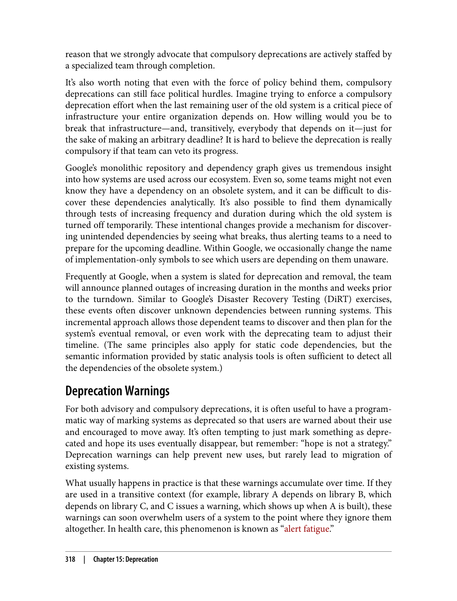
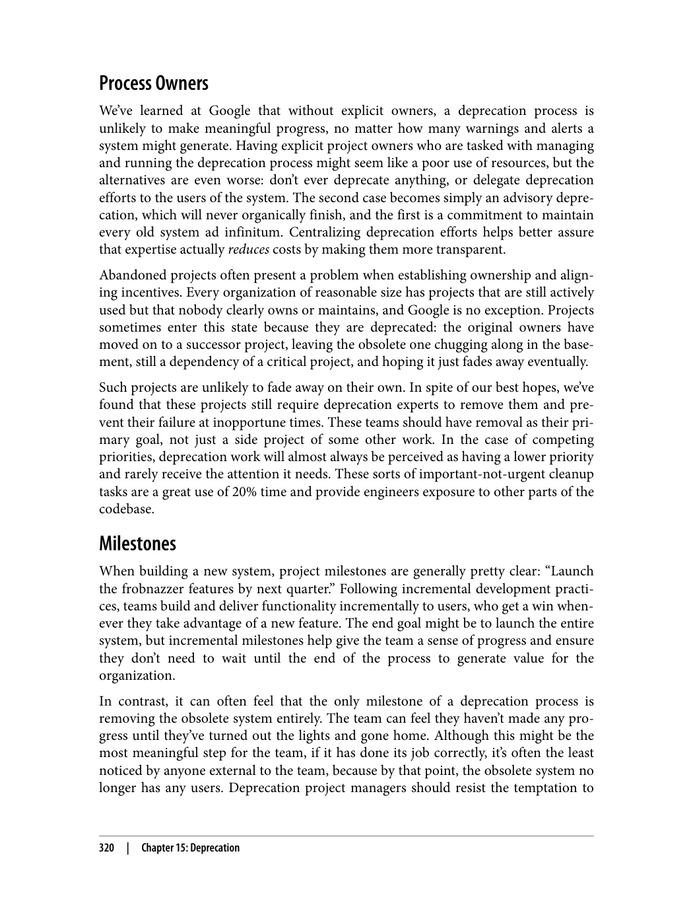
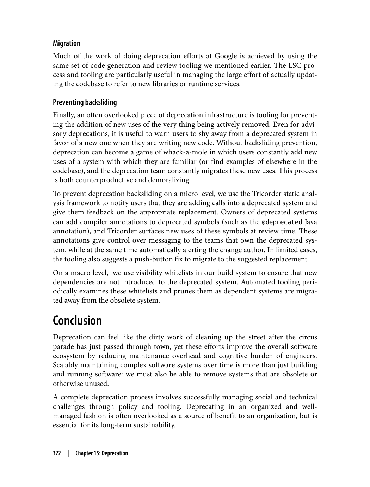
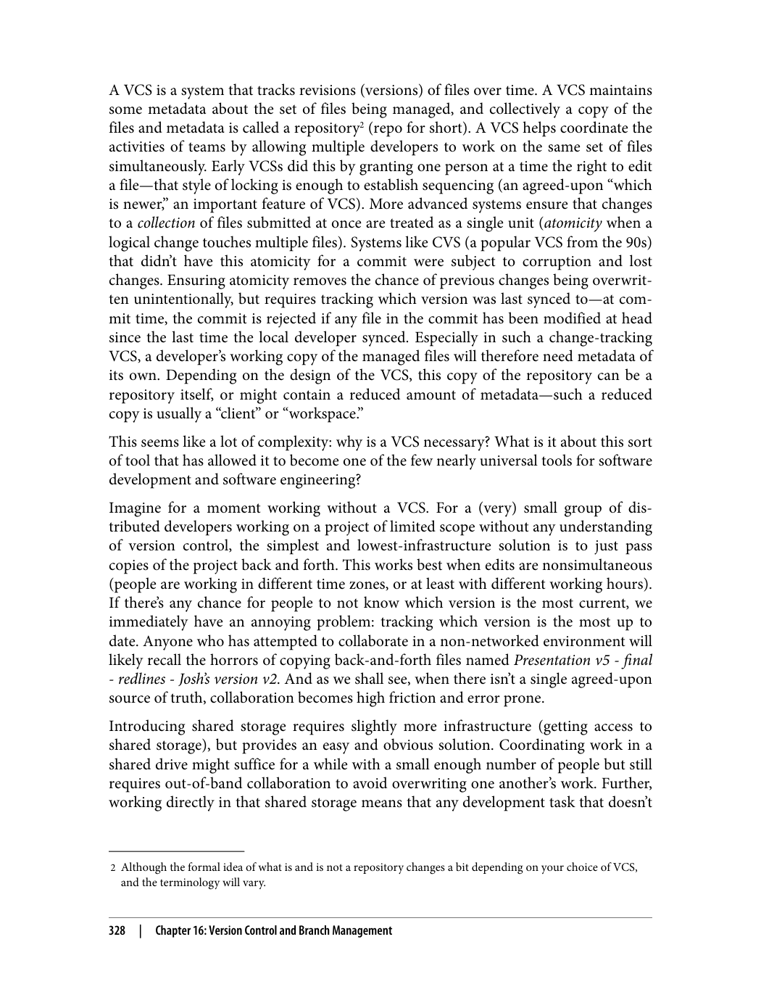
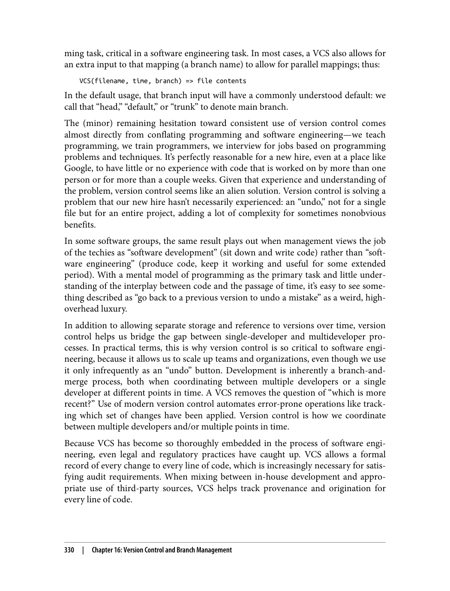
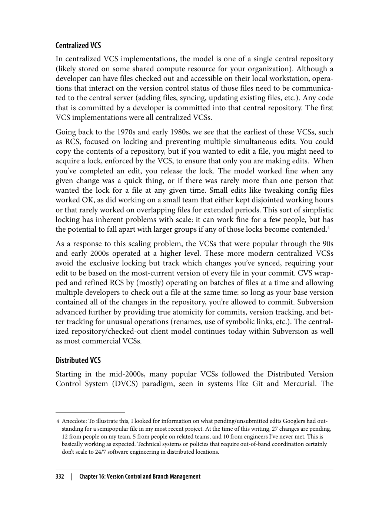
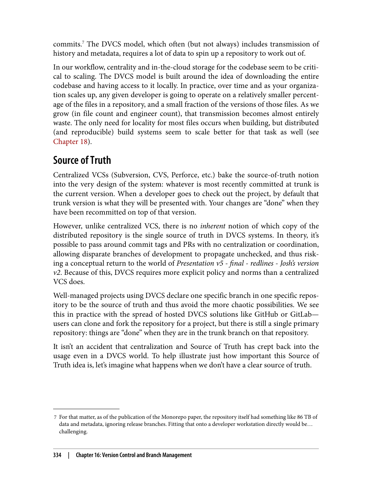
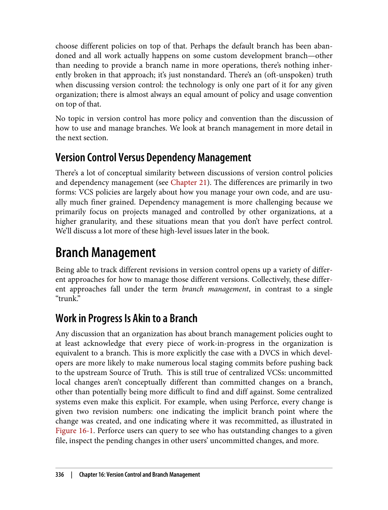
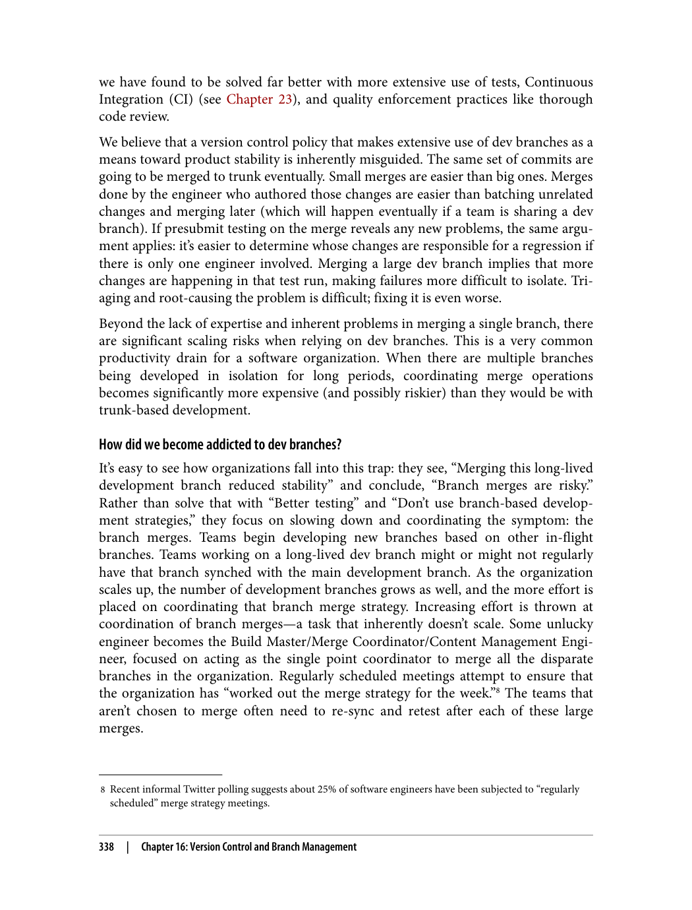
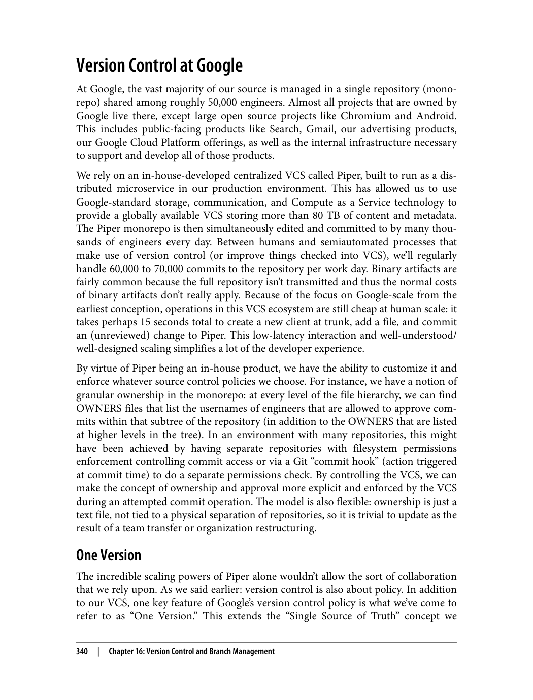

> **راهنمای مطالعه**
>
> در هر بخش، ابتدا متن اصلی کتاب به زبان انگلیسی آورده شده و سپس ترجمه و توضیحات فارسی همان بخش ارائه شده است.

---
-

###### 📄 صفحه ۳۴۵
> reason that we strongly advocate that compulsory deprecations are actively staffed by
> a specialized team through completion.
> It’s also worth noting that even with the force of policy behind them, compulsory
> deprecations can still face political hurdles. Imagine trying to enforce a compulsory
> deprecation effort when the last remaining user of the old system is a critical piece of
> infrastructure your entire organization depends on. How willing would you be to
> break that infrastructure—and, transitively, everybody that depends on it—just for
> the sake of making an arbitrary deadline? It is hard to believe the deprecation is really
> compulsory if that team can veto its progress.
> Google’s monolithic repository and dependency graph gives us tremendous insight
> into how systems are used across our ecosystem. Even so, some teams might not even
> know they have a dependency on an obsolete system, and it can be difficult to dis‐
> cover these dependencies analytically. It’s also possible to find them dynamically
> through tests of increasing frequency and duration during which the old system is
> turned off temporarily. These intentional changes provide a mechanism for discover‐
> ing unintended dependencies by seeing what breaks, thus alerting teams to a need to
> prepare for the upcoming deadline. Within Google, we occasionally change the name
> of implementation-only symbols to see which users are depending on them unaware.
> Frequently at Google, when a system is slated for deprecation and removal, the team
> will announce planned outages of increasing duration in the months and weeks prior
> to the turndown. Similar to Google’s Disaster Recovery Testing (DiRT) exercises,
> these events often discover unknown dependencies between running systems. This
> incremental approach allows those dependent teams to discover and then plan for the
> system’s eventual removal, or even work with the deprecating team to adjust their
> timeline. (The same principles also apply for static code dependencies, but the
> semantic information provided by static analysis tools is often sufficient to detect all
> the dependencies of the obsolete system.)
> Deprecation Warnings
> For both advisory and compulsory deprecations, it is often useful to have a program‐
> matic way of marking systems as deprecated so that users are warned about their use
> and encouraged to move away. It’s often tempting to just mark something as depre‐
> cated and hope its uses eventually disappear, but remember: “hope is not a strategy.”
> Deprecation warnings can help prevent new uses, but rarely lead to migration of
> existing systems.
> What usually happens in practice is that these warnings accumulate over time. If they
> are used in a transitive context (for example, library A depends on library B, which
> depends on library C, and C issues a warning, which shows up when A is built), these
> warnings can soon overwhelm users of a system to the point where they ignore them
> altogether. In health care, this phenomenon is known as “alert fatigue.”
> 318
> |
> Chapter 15: Deprecation

---

###### 📄 صفحه ۳۴۹
> Migration
> Much of the work of doing deprecation efforts at Google is achieved by using the
> same set of code generation and review tooling we mentioned earlier. The LSC pro‐
> cess and tooling are particularly useful in managing the large effort of actually updat‐
> ing the codebase to refer to new libraries or runtime services.
> Preventing backsliding
> Finally, an often overlooked piece of deprecation infrastructure is tooling for prevent‐
> ing the addition of new uses of the very thing being actively removed. Even for advi‐
> sory deprecations, it is useful to warn users to shy away from a deprecated system in
> favor of a new one when they are writing new code. Without backsliding prevention,
> deprecation can become a game of whack-a-mole in which users constantly add new
> uses of a system with which they are familiar (or find examples of elsewhere in the
> codebase), and the deprecation team constantly migrates these new uses. This process
> is both counterproductive and demoralizing.
> To prevent deprecation backsliding on a micro level, we use the Tricorder static anal‐
> ysis framework to notify users that they are adding calls into a deprecated system and
> give them feedback on the appropriate replacement. Owners of deprecated systems
> can add compiler annotations to deprecated symbols (such as the @deprecated Java
> annotation), and Tricorder surfaces new uses of these symbols at review time. These
> annotations give control over messaging to the teams that own the deprecated sys‐
> tem, while at the same time automatically alerting the change author. In limited cases,
> the tooling also suggests a push-button fix to migrate to the suggested replacement.
> On a macro level,  we use visibility whitelists in our build system to ensure that new
> dependencies are not introduced to the deprecated system. Automated tooling peri‐
> odically examines these whitelists and prunes them as dependent systems are migra‐
> ted away from the obsolete system.
> Conclusion
> Deprecation can feel like the dirty work of cleaning up the street after the circus
> parade has just passed through town, yet these efforts improve the overall software
> ecosystem by reducing maintenance overhead and cognitive burden of engineers.
> Scalably maintaining complex software systems over time is more than just building
> and running software: we must also be able to remove systems that are obsolete or
> otherwise unused.
> A complete deprecation process involves successfully managing social and technical
> challenges through policy and tooling. Deprecating in an organized and well-
> managed fashion is often overlooked as a source of benefit to an organization, but is
> essential for its long-term sustainability.
> 322
> |
> Chapter 15: Deprecation

دلایل اصلی تست نرم‌افزار:
1. **شناسایی باگ‌ها**: قبل از انتشار، باگ‌ها را شناسایی کنید
2. **اطمینان از کیفیت**: اطمینان از اینکه نرم‌افزار درست کار می‌کند
3. **بازخورد سریع**: بازخورد سریع به توسعه‌دهندگان ارائه دهید
4. **مستندسازی رفتار**: مستند کردن رفتار مورد انتظار نرم‌افزار

---

###### 📄 صفحه ۳۵۳

اندازه‌های اصلی تست:
1. **تست‌های کوچک**: تست‌های سریع و ساده
2. **تست‌های متوسط**: تست‌های با پیچیدگی متوسط
3. **تست‌های بزرگ**: تست‌های پیچیده و جامع

---

###### 📄 صفحه ۳۵۷
> ming task, critical in a software engineering task. In most cases, a VCS also allows for
> an extra input to that mapping (a branch name) to allow for parallel mappings; thus:
> VCS(filename, time, branch) => file contents
> In the default usage, that branch input will have a commonly understood default: we
> call that “head,” “default,” or “trunk” to denote main branch.
> The (minor) remaining hesitation toward consistent use of version control comes
> almost directly from conflating programming and software engineering—we teach
> programming, we train programmers, we interview for jobs based on programming
> problems and techniques. It’s perfectly reasonable for a new hire, even at a place like
> Google, to have little or no experience with code that is worked on by more than one
> person or for more than a couple weeks. Given that experience and understanding of
> the problem, version control seems like an alien solution. Version control is solving a
> problem that our new hire hasn’t necessarily experienced: an “undo,” not for a single
> file but for an entire project, adding a lot of complexity for sometimes nonobvious
> benefits.
> In some software groups, the same result plays out when management views the job
> of the techies as “software development” (sit down and write code) rather than “soft‐
> ware engineering” (produce code, keep it working and useful for some extended
> period). With a mental model of programming as the primary task and little under‐
> standing of the interplay between code and the passage of time, it’s easy to see some‐
> thing described as “go back to a previous version to undo a mistake” as a weird, high-
> overhead luxury.
> In addition to allowing separate storage and reference to versions over time, version
> control helps us bridge the gap between single-developer and multideveloper pro‐
> cesses. In practical terms, this is why version control is so critical to software engi‐
> neering, because it allows us to scale up teams and organizations, even though we use
> it only infrequently as an “undo” button. Development is inherently a branch-and-
> merge process, both when coordinating between multiple developers or a single
> developer at different points in time. A VCS removes the question of “which is more
> recent?” Use of modern version control automates error-prone operations like track‐
> ing which set of changes have been applied. Version control is how we coordinate
> between multiple developers and/or multiple points in time.
> Because VCS has become so thoroughly embedded in the process of software engi‐
> neering, even legal and regulatory practices have caught up. VCS allows a formal
> record of every change to every line of code, which is increasingly necessary for satis‐
> fying audit requirements. When mixing between in-house development and appro‐
> priate use of third-party sources, VCS helps track provenance and origination for
> every line of code.
> 330
> |
> Chapter 16: Version Control and Branch Management

اصول طراحی:
1. **پوشش کد**: چه بخش‌هایی از کد پوشش داده شوند
2. **دامنه تست**: چه چیزی تست شود
3. **اندازه تست**: تست‌ها چه اندازه‌ای باشند

---

###### 📄 صفحه ۳۶۱
> 7 For that matter, as of the publication of the Monorepo paper, the repository itself had something like 86 TB of
> data and metadata, ignoring release branches. Fitting that onto a developer workstation directly would be…
> challenging.
> commits.7 The DVCS model, which often (but not always) includes transmission of
> history and metadata, requires a lot of data to spin up a repository to work out of.
> In our workflow, centrality and in-the-cloud storage for the codebase seem to be criti‐
> cal to scaling. The DVCS model is built around the idea of downloading the entire
> codebase and having access to it locally. In practice, over time and as your organiza‐
> tion scales up, any given developer is going to operate on a relatively smaller percent‐
> age of the files in a repository, and a small fraction of the versions of those files. As we
> grow (in file count and engineer count), that transmission becomes almost entirely
> waste. The only need for locality for most files occurs when building, but distributed
> (and reproducible) build systems seem to scale better for that task as well (see
> Chapter 18).
> Source of Truth
> Centralized VCSs (Subversion, CVS, Perforce, etc.) bake the source-of-truth notion
> into the very design of the system: whatever is most recently committed at trunk is
> the current version. When a developer goes to check out the project, by default that
> trunk version is what they will be presented with. Your changes are “done” when they
> have been recommitted on top of that version.
> However, unlike centralized VCS, there is no inherent notion of which copy of the
> distributed repository is the single source of truth in DVCS systems. In theory, it’s
> possible to pass around commit tags and PRs with no centralization or coordination,
> allowing disparate branches of development to propagate unchecked, and thus risk‐
> ing a conceptual return to the world of Presentation v5 - final - redlines - Josh’s version
> v2. Because of this, DVCS requires more explicit policy and norms than a centralized
> VCS does.
> Well-managed projects using DVCS declare one specific branch in one specific repos‐
> itory to be the source of truth and thus avoid the more chaotic possibilities. We see
> this in practice with the spread of hosted DVCS solutions like GitHub or GitLab—
> users can clone and fork the repository for a project, but there is still a single primary
> repository: things are “done” when they are in the trunk branch on that repository.
> It isn’t an accident that centralization and Source of Truth has crept back into the
> usage even in a DVCS world. To help illustrate just how important this Source of
> Truth idea is, let’s imagine what happens when we don’t have a clear source of truth.
> 334
> |
> Chapter 16: Version Control and Branch Management

این قانون به اطمینان از اینکه رفتارهای موجود شکسته نمی‌شوند کمک می‌کند.

---
