> **راهنمای مطالعه**
>
> در هر بخش، ابتدا متن اصلی کتاب به زبان انگلیسی آورده شده و سپس ترجمه و توضیحات فارسی همان بخش ارائه شده است.

---
-

###### 📄 صفحه ۳۹۱
> 14 In programming languages, a symbol such as a function “Alert” often is defined in a particular scope, such as
> a class (“Monitor”) or namespace (“absl”). The qualified name might then be absl::Monitor::Alert, and this is
> findable, even if it doesn’t occur in the actual text.
> dependencies (library/module level references) and down to functions and classes.
> This global relevance is often referred to as the document’s “priority.”
> When using references for ranking, one must be aware of two challenges. First, you
> must be able to extract reference information reliably. In the early days, Google’s
> Code Search extracted include/import statements with simple regular expressions
> and then applied heuristics to convert them into full file paths. With the growing
> complexity of a codebase, such heuristics became error prone and challenging to
> maintain. Internally, we replaced this part with correct information from the Kythe
> graph.
> Large-scale refactorings, such as open sourcing core libraries, present a second chal‐
> lenge. Such changes don’t happen atomically in a single code update; rather, they need
> to be rolled out in multiple stages. Typically, indirections are introduced, hiding, for
> example, the move of files from usages. These kinds of indirections reduce the page
> rank of moved files and make it more difficult for developers to discover the new
> location. Additionally, file views usually become lost when files are moved, making
> the situation even worse. Because such global restructurings of the codebase are com‐
> paratively rare (most interfaces move rarely), the simplest solution is to manually
> boost files during such transition periods. (Or wait until the migration completes and
> for the natural processes to up-rank the file in its new location.)
> Query dependent signals
> Query independent signals can be computed offline, so computational cost isn’t a
> major concern, although it can be high. For example, for the “page” rank, the signal
> depends on the whole corpus and requires a MapReduce-like batch processing to cal‐
> culate. Query dependent signals, which must be calculated for each query, should be
> cheap to compute. This means that they are restricted to the query and information
> quickly accessible from the index.
> Unlike web search, we don’t just match on tokens. However, if there are clean token
> matches (that is, the search term matches with content with some form of breaks,
> such as whitespace, around it), a further boost is applied and case sensitivity is con‐
> sidered. This means, for example, a search for “Point” will score higher against "Point
> *p” than against “appointed to the council.”
> For convenience, a default search matches filename and qualified symbols14 in addi‐
> tion to the actual file content. A user can specify the particular kind of match, but
> they don’t need to. The scoring boosts symbol and filename matches over normal
> 364
> |
> Chapter 17: Code Search

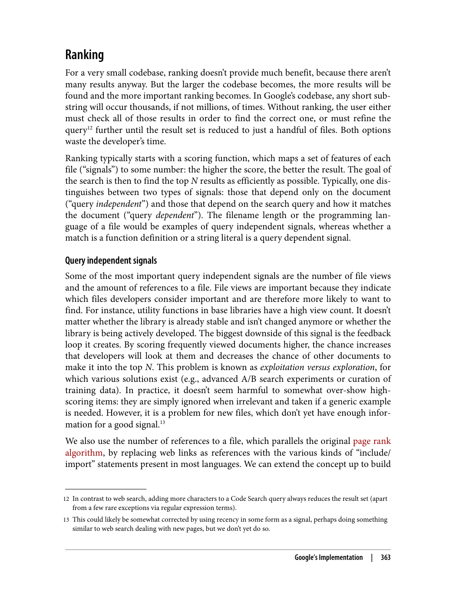

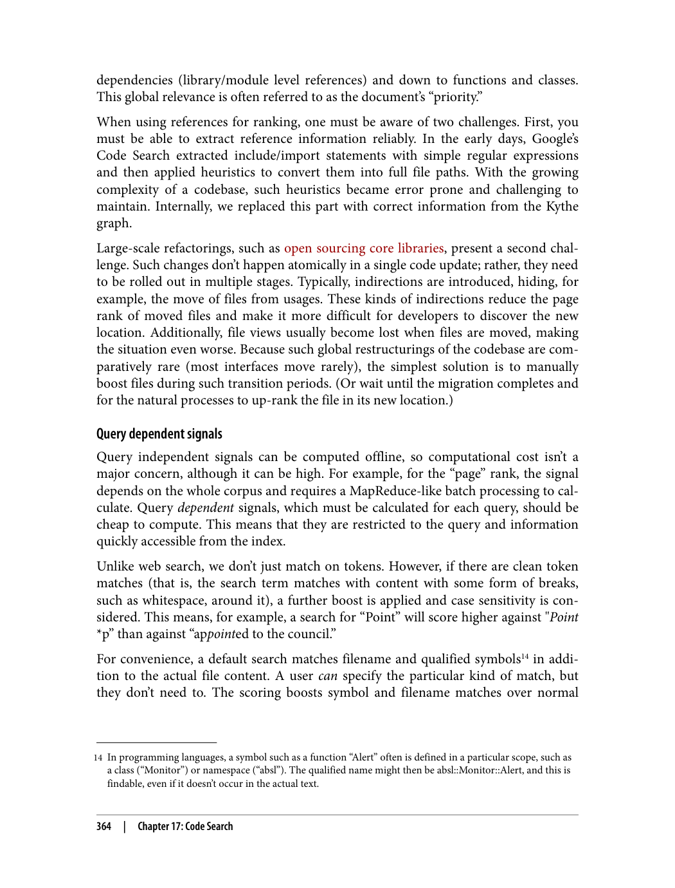

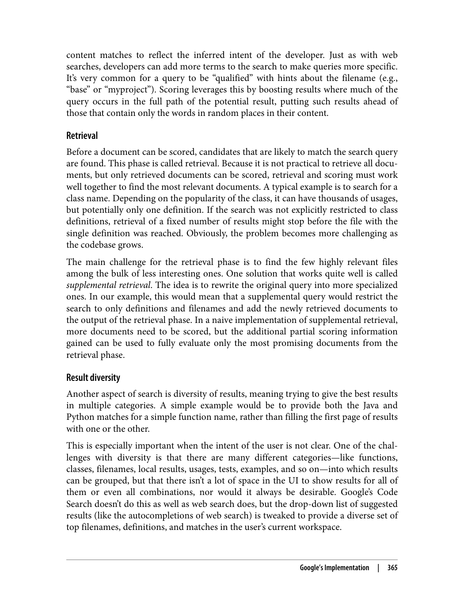

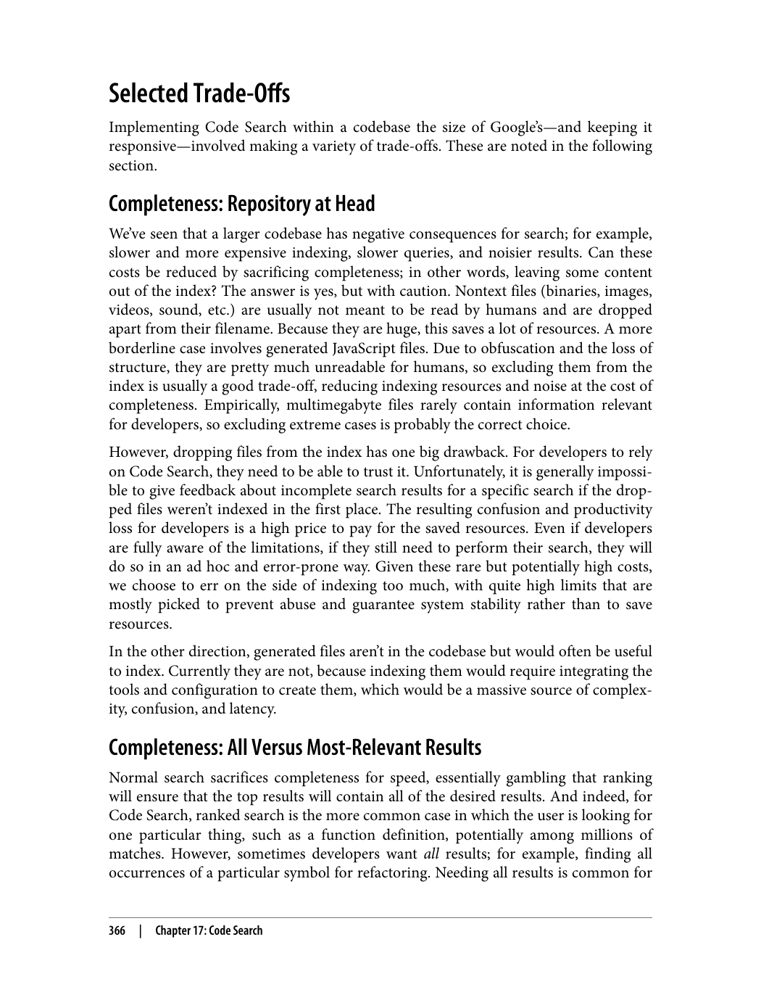

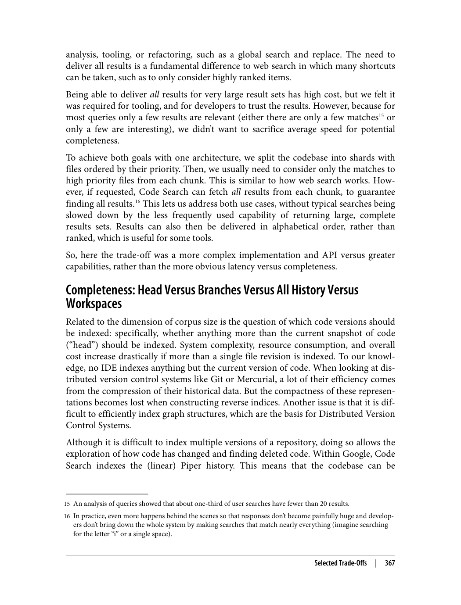

---

###### 📄 صفحه ۳۹۶
> 17 There are other intermediate varieties, such as building a prefix/suffix index, but generally they provide less
> expressiveness in search queries while still having high complexity and indexing costs.
> 18 Russ Cox, “Regular Expression Matching with a Trigram Index or How Google Code Search Worked.”
> Tokenization also typically doesn’t care about the case of letters (“r” versus “R”), and
> will often blur words; for example, reducing “searching” and “searched” to the same
> stem token search. This lack of precision is a significant problem when searching
> code. Finally, tokenization makes it impossible to search on whitespace or other word
> delimiters (commas, parentheses), which can be very important in code.
> A next step up17 in searching power is full substring search in which any sequence of
> characters can be searched for. One fairly efficient way to provide this is via a
> trigram-based index.18 In its simplest form, the resulting index size is still much
> smaller than the original source code size. However, the small size comes at the cost
> of relatively low recall accuracy compared to other substring indices. This means
> slower queries because the nonmatches need to be filtered out of the result set. This is
> where a good compromise between index size, search latency, and resource consump‐
> tion must be found that depends heavily on codebase size, resource availability, and
> searches per second.
> If a substring index is available, it’s easy to extend it to allow regular expression
> searches. The basic idea is to convert the regular expression automaton into a set of
> substring searches. This conversion is straightforward for a trigram index and can be
> generalized to other substring indices. Because there is no perfect regular expression
> index, it will always be possible to construct queries that result in a brute-force
> search. However, given that only a small fraction of user queries are complex regular
> expressions, in practice, the approximation via substring indices works very well.
> Conclusion
> Code Search grew from an organic replacement for grep into a central tool boosting
> developer productivity, leveraging Google’s web search technology along the way.
> What does this mean for you, though? If you are on a small project that easily fits in
> your IDE, probably not much. If you are responsible for the productivity of engineers
> on a larger codebase, there are probably some insights to be gained.
> The most important one is perhaps obvious: understanding code is key to developing
> and maintaining it, and this means that investing in understanding code will yield
> dividends that might be difficult to measure, but are real. Every feature we added to
> Code Search was and is used by developers to help them in their daily work (admit‐
> tedly some more than others). Two of the most important features, Kythe integration
> (i.e., adding semantic code understanding) and finding working examples, are also
> the most clearly tied to understanding code (versus, for example, finding it, or seeing
> Conclusion
> |
> 369

مزایای اصلی:
1. **پوشش رفتار**: تست رفتارهایی که چندین واحد را در بر می‌گیرد
2. **شبیه‌سازی کاربر**: شبیه‌سازی نحوه استفاده کاربران از نرم‌افزار
3. **تست یکپارچگی**: تست یکپارچگی بین اجزای مختلف

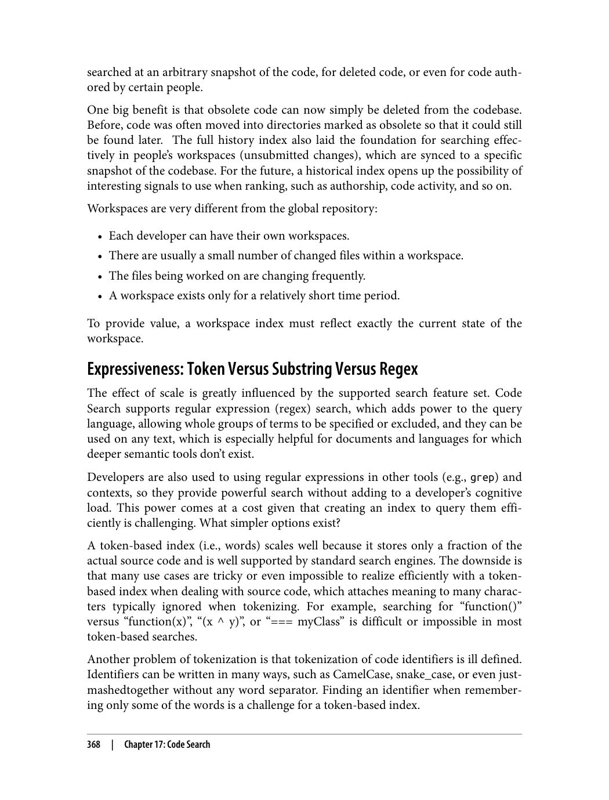

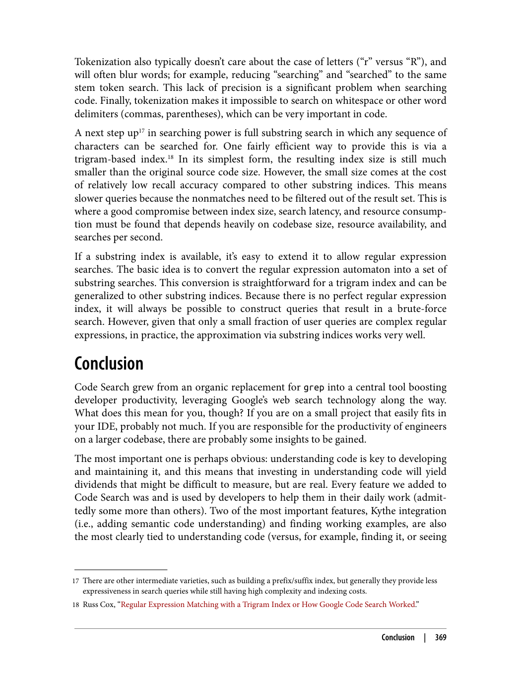

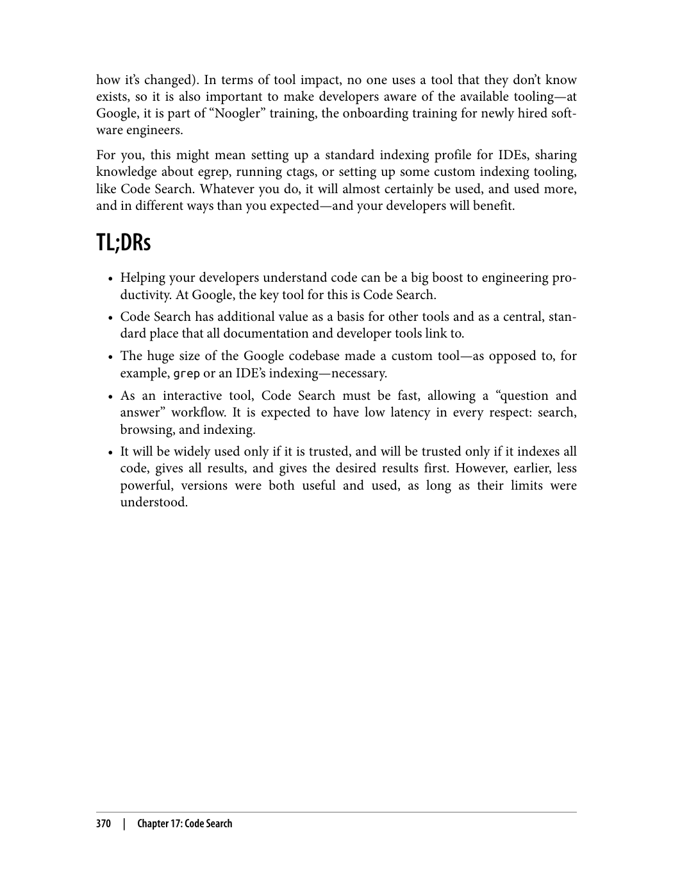

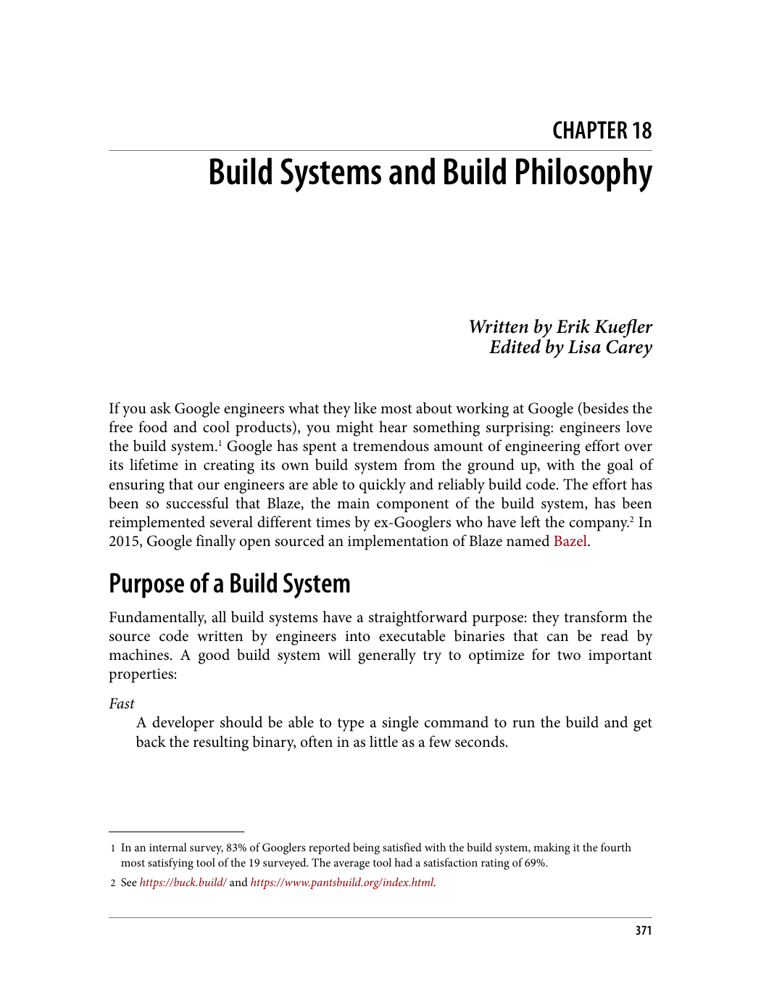

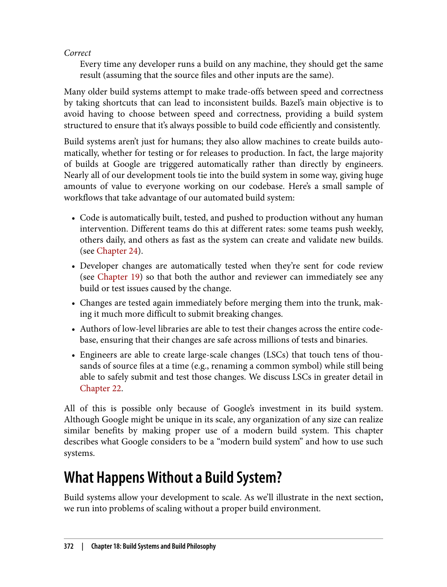

---

###### 📄 صفحه ۴۰۱
> • It becomes tedious. As your system grows more complex, you begin spending
> almost as much time working on your build scripts as on real code. Debugging
> shell scripts is painful, with more and more hacks being layered on top of one
> another.
> • It’s slow. To make sure you weren’t accidentally relying on stale libraries, you have
> your build script build every dependency in order every time you run it. You
> think about adding some logic to detect which parts need to be rebuilt, but that
> sounds awfully complex and error prone for a script. Or you think about specify‐
> ing which parts need to be rebuilt each time, but then you’re back to square one.
> • Good news: it’s time for a release! Better go figure out all the arguments you need
> to pass to the jar command to make your final build. And remember how to
> upload it and push it out to the central repository. And build and push the docu‐
> mentation updates, and send out a notification to users. Hmm, maybe this calls
> for another script...
> • Disaster! Your hard drive crashes, and now you need to recreate your entire sys‐
> tem. You were smart enough to keep all of your source files in version control,
> but what about those libraries you downloaded? Can you find them all again and
> make sure they were the same version as when you first downloaded them? Your
> scripts probably depended on particular tools being installed in particular places
> —can you restore that same environment so that the scripts work again? What
> about all those environment variables you set a long time ago to get the compiler
> working just right and then forgot about?
> • Despite the problems, your project is successful enough that you’re able to begin
> hiring more engineers. Now you realize that it doesn’t take a disaster for the pre‐
> vious problems to arise—you need to go through the same painful bootstrapping
> process every time a new developer joins your team. And despite your best
> efforts, there are still small differences in each person’s system. Frequently, what
> works on one person’s machine doesn’t work on another’s, and each time it takes
> a few hours of debugging tool paths or library versions to figure out where the
> difference is.
> • You decide that you need to automate your build system. In theory, this is as sim‐
> ple as getting a new computer and setting it up to run your build script every
> night using cron. You still need to go through the painful setup process, but now
> you don’t have the benefit of a human brain being able to detect and resolve
> minor problems. Now, every morning when you get in, you see that last night’s
> build failed because yesterday a developer made a change that worked on their
> system but didn’t work on the automated build system. Each time it’s a simple fix,
> but it happens so often that you end up spending a lot of time each day discover‐
> ing and applying these simple fixes.
> 374
> |
> Chapter 18: Build Systems and Build Philosophy

چالش‌های اصلی:
1. **پیچیدگی**: تست‌ها پیچیده‌تر هستند
2. **زمان اجرا**: تست‌ها زمان بیشتری نیاز دارند
3. **نگهداری**: نگهداری تست‌ها دشوارتر است
4. **خوانایی**: درک تست‌ها دشوارتر است

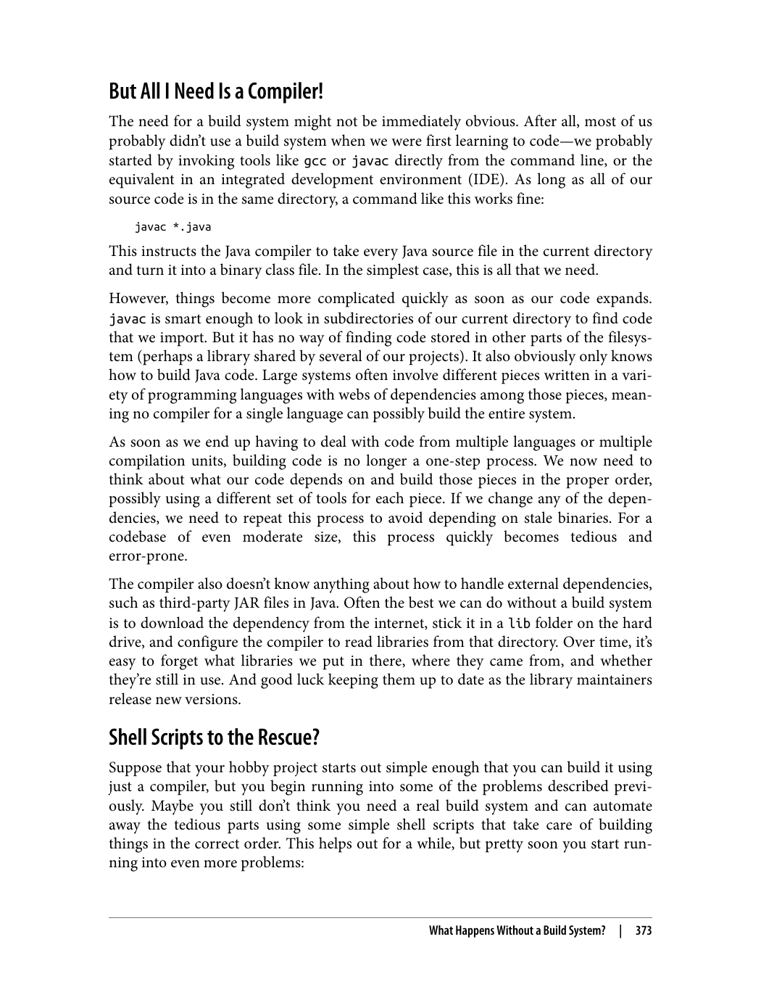

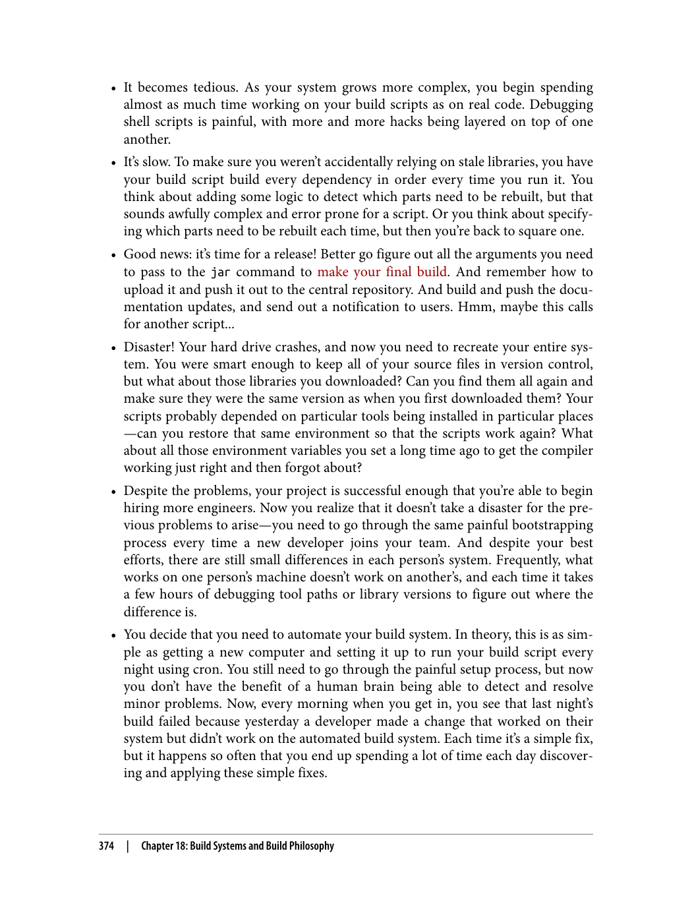

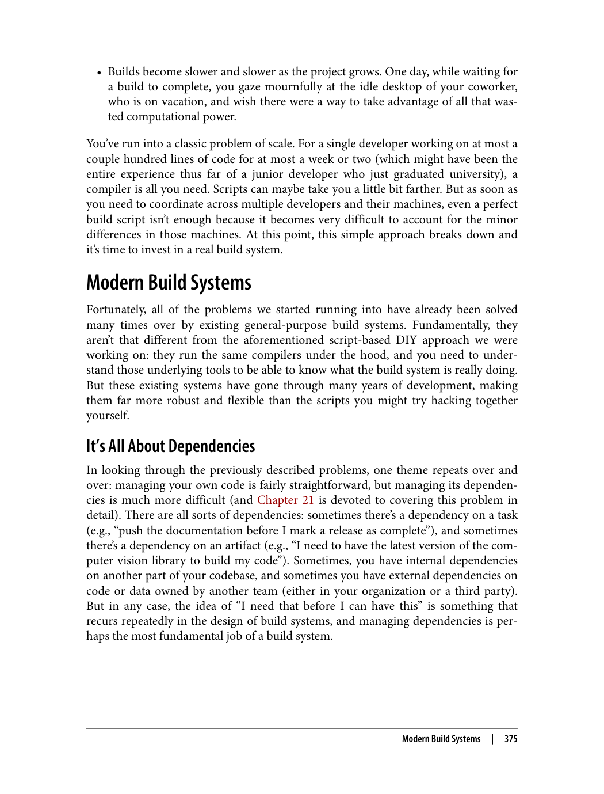

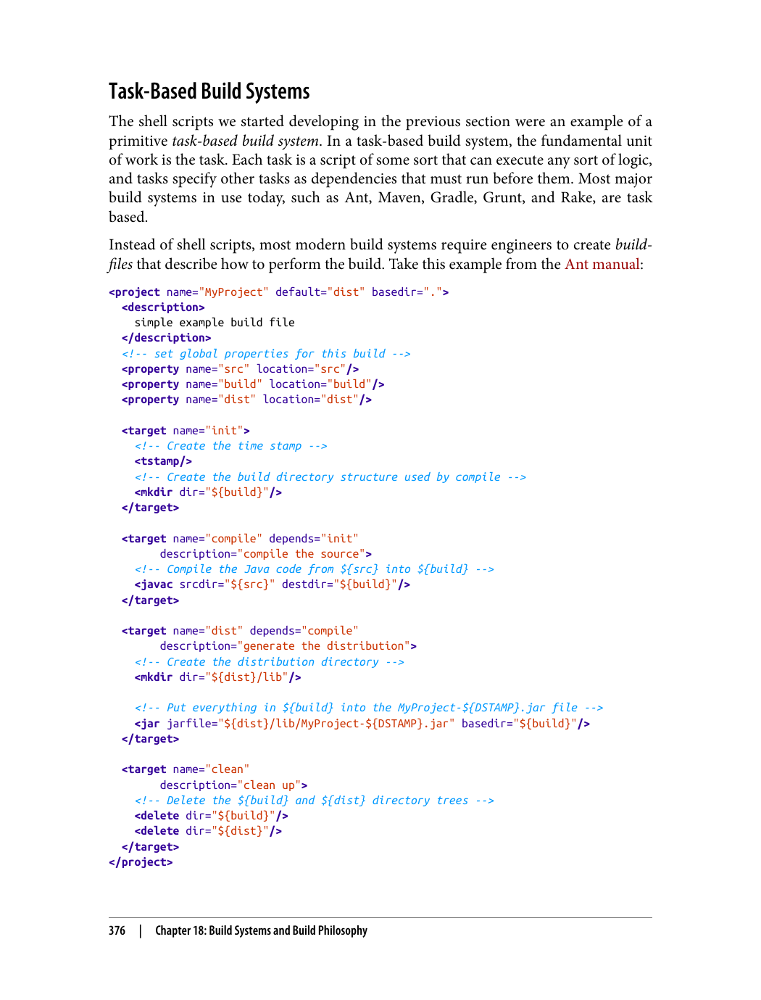

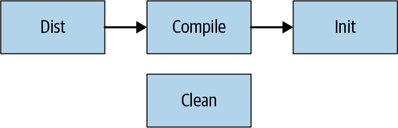

---

###### 📄 صفحه ۴۰۶
> Difficulty performing incremental builds.    A good build system will allow engineers to
> perform reliable incremental builds such that a small change doesn’t require the
> entire codebase to be rebuilt from scratch. This is especially important if the build
> system is slow and unable to parallelize build steps for the aforementioned reasons.
> But unfortunately, task-based build systems struggle here, too. Because tasks can do
> anything, there’s no way in general to check whether they’ve already been done. Many
> tasks simply take a set of source files and run a compiler to create a set of binaries;
> thus, they don’t need to be rerun if the underlying source files haven’t changed. But
> without additional information, the system can’t say this for sure—maybe the task
> downloads a file that could have changed, or maybe it writes a timestamp that could
> be different on each run. To guarantee correctness, the system typically must rerun
> every task during each build.
> Some build systems try to enable incremental builds by letting engineers specify the
> conditions under which a task needs to be rerun. Sometimes this is feasible, but often
> it’s a much trickier problem than it appears. For example, in languages like C++ that
> allow files to be included directly by other files, it’s impossible to determine the entire
> set of files that must be watched for changes without parsing the input sources. Engi‐
> neers will often end up taking shortcuts, and these shortcuts can lead to rare and
> frustrating problems where a task result is reused even when it shouldn’t be. When
> this happens frequently, engineers get into the habit of running clean before every
> build to get a fresh state, completely defeating the purpose of having an incremental
> build in the first place. Figuring out when a task needs to be rerun is surprisingly sub‐
> tle, and is a job better handled by machines than humans.
> Difficulty maintaining and debugging scripts.    Finally, the build scripts imposed by task-
> based build systems are often just difficult to work with. Though they often receive
> less scrutiny, build scripts are code just like the system being built, and are easy places
> for bugs to hide. Here are some examples of bugs that are very common when work‐
> ing with a task-based build system:
> • Task A depends on task B to produce a particular file as output. The owner of
> task B doesn’t realize that other tasks rely on it, so they change it to produce out‐
> put in a different location. This can’t be detected until someone tries to run task
> A and finds that it fails.
> • Task A depends on task B, which depends on task C, which is producing a partic‐
> ular file as output that’s needed by task A. The owner of task B decides that it
> doesn’t need to depend on task C any more, which causes task A to fail even
> though task B doesn’t care about task C at all!
> • The developer of a new task accidentally makes an assumption about the
> machine running the task, such as the location of a tool or the value of particular
> Modern Build Systems
> |
> 379

انواع اصلی:
1. **تست‌های عملکردی**: تست عملکرد سیستم
2. **تست‌های بار**: تست رفتار سیستم تحت بار
3. **تست‌های استرس**: تست رفتار سیستم در شرایط سخت
4. **تست‌های بازگشتی**: تست اینکه رفتار قبلی شکسته نشده است

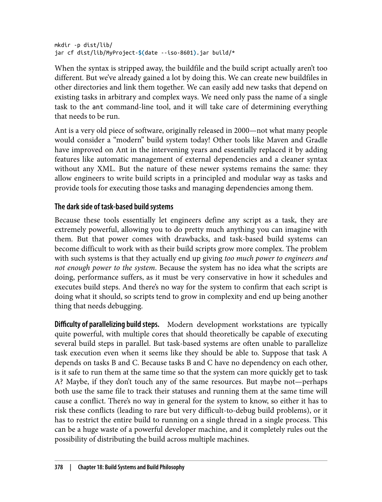

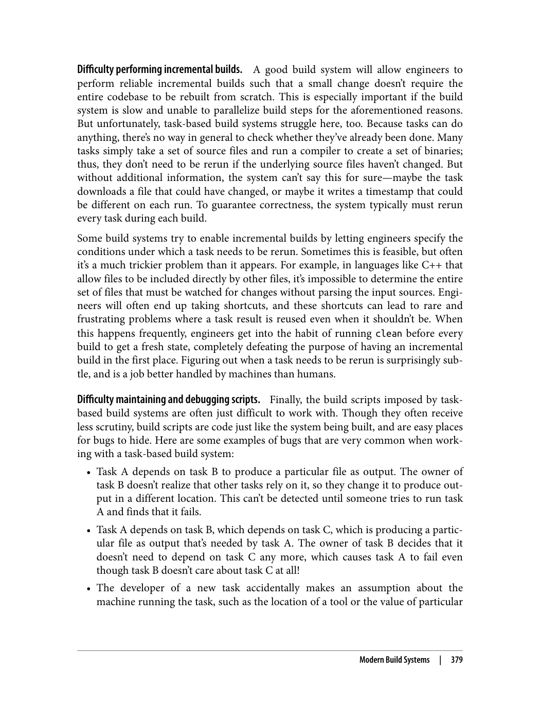

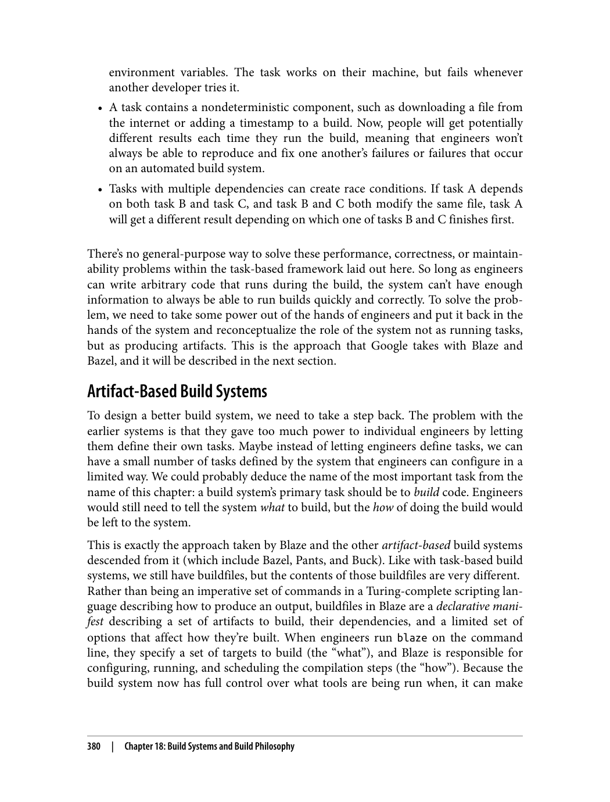

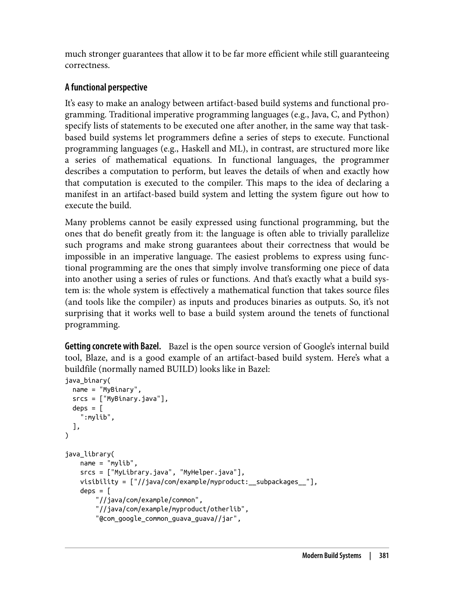

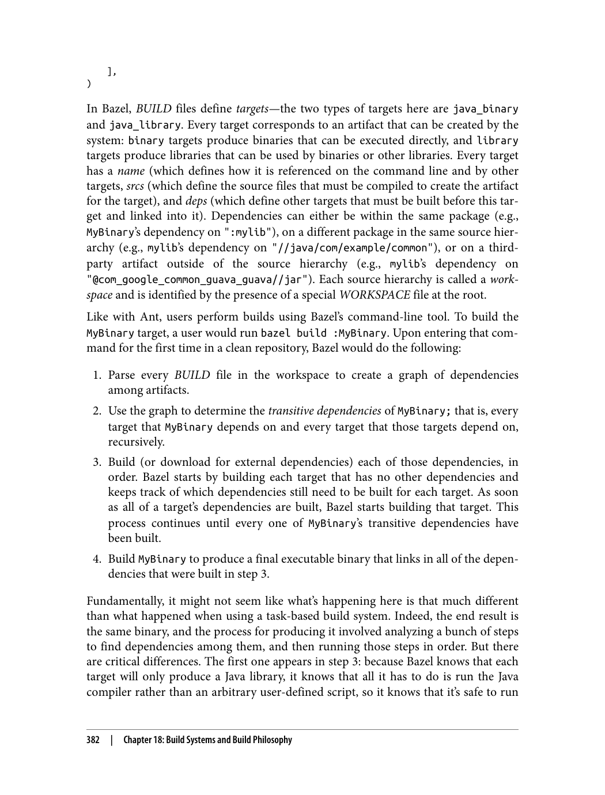

---

###### 📄 صفحه ۴۱۱
> workspace level. Whenever Blaze builds a java_library, it checks to make sure that
> the specified compiler is available at a known location and downloads it if not. Just
> like any other dependency, if the Java compiler changes, every artifact that was depen‐
> dent upon it will need to be rebuilt. Every type of target defined in Bazel uses this
> same strategy of declaring the tools it needs to run, ensuring that Bazel is able to
> bootstrap them no matter what exists on the system where it runs.
> Bazel solves the second part of the problem, platform independence, by using tool‐
> chains. Rather than having targets depend directly on their tools, they actually
> depend on types of toolchains. A toolchain contains a set of tools and other proper‐
> ties defining how a type of target is built on a particular platform. The workspace can
> define the particular toolchain to use for a toolchain type based on the host and target
> platform. For more details, see the Bazel manual.
> Extending the build system.    Bazel comes with targets for several popular programming
> languages out of the box, but engineers will always want to do more—part of the ben‐
> efit of task-based systems is their flexibility in supporting any kind of build process,
> and it would be better not to give that up in an artifact-based build system. Fortu‐
> nately, Bazel allows its supported target types to be extended by adding custom rules.
> To define a rule in Bazel, the rule author declares the inputs that the rule requires (in
> the form of attributes passed in the BUILD file) and the fixed set of outputs that the
> rule produces. The author also defines the actions that will be generated by that rule.
> Each action declares its inputs and outputs, runs a particular executable or writes a
> particular string to a file, and can be connected to other actions via its inputs and out‐
> puts. This means that actions are the lowest-level composable unit in the build system
> —an action can do whatever it wants so long as it uses only its declared inputs and
> outputs, and Bazel will take care of scheduling actions and caching their results as
> appropriate.
> The system isn’t foolproof given that there’s no way to stop an action developer from
> doing something like introducing a nondeterministic process as part of their action.
> But this doesn’t happen very often in practice, and pushing the possibilities for abuse
> all the way down to the action level greatly decreases opportunities for errors. Rules
> supporting many common languages and tools are widely available online, and most
> projects will never need to define their own rules. Even for those that do, rule defini‐
> tions only need to be defined in one central place in the repository, meaning most
> engineers will be able to use those rules without ever having to worry about their
> implementation.
> Isolating the environment.    Actions sound like they might run into the same problems
> as tasks in other systems—isn’t it still possible to write actions that both write to the
> same file and end up conflicting with one another? Actually, Bazel makes these
> conflicts impossible by using sandboxing. On supported systems, every action is iso‐
> 384
> |
> Chapter 18: Build Systems and Build Philosophy

اصول گردش کار:
1. **نوشتن تست**: تست‌ها باید در مراحل اولیه نوشته شوند
2. **اجرا**: تست‌ها باید به طور منظم اجرا شوند
3. **نگهداری**: تست‌ها باید به طور منظم نگهداری شوند

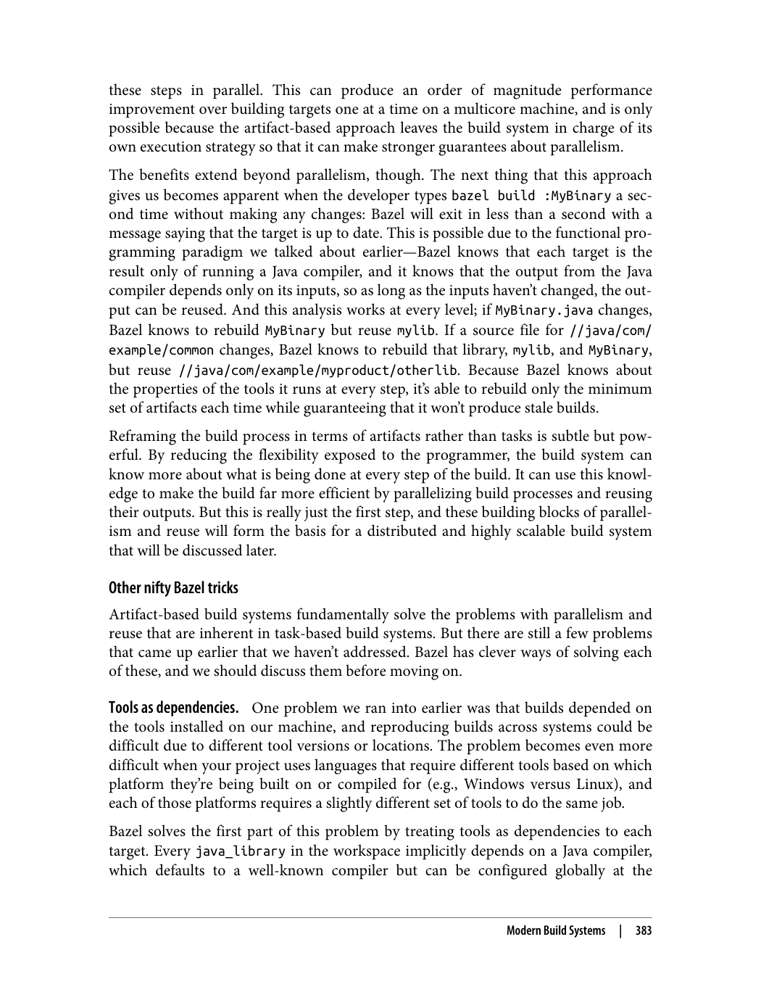

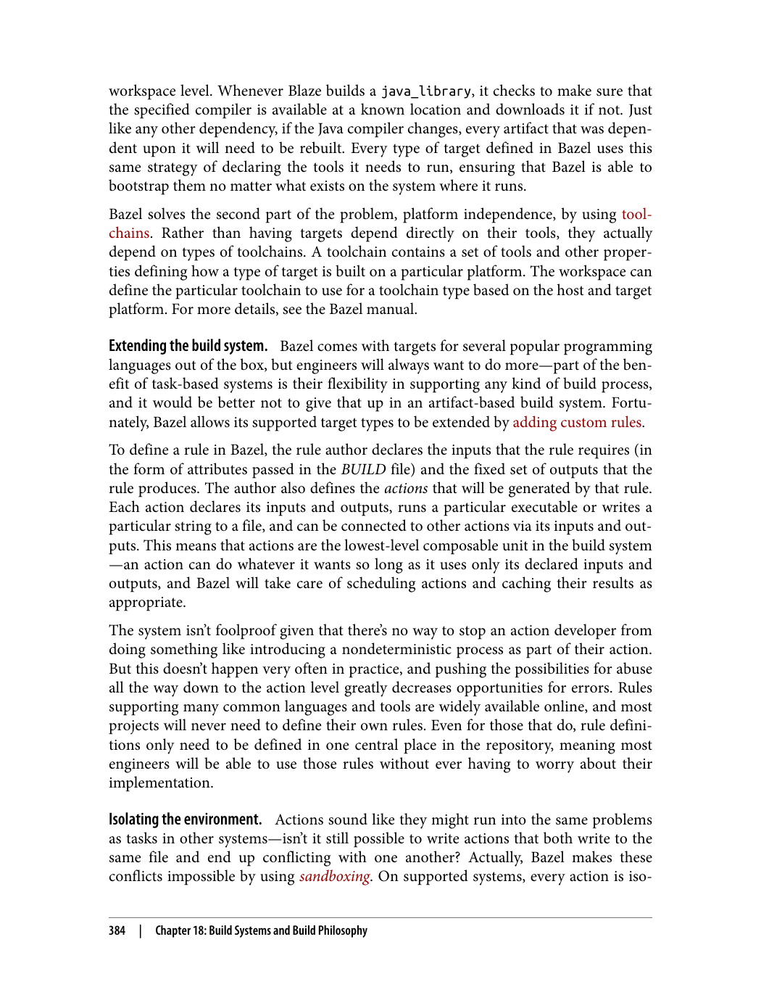

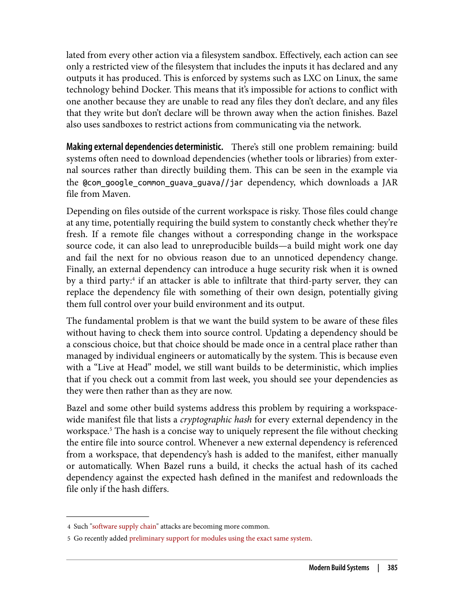

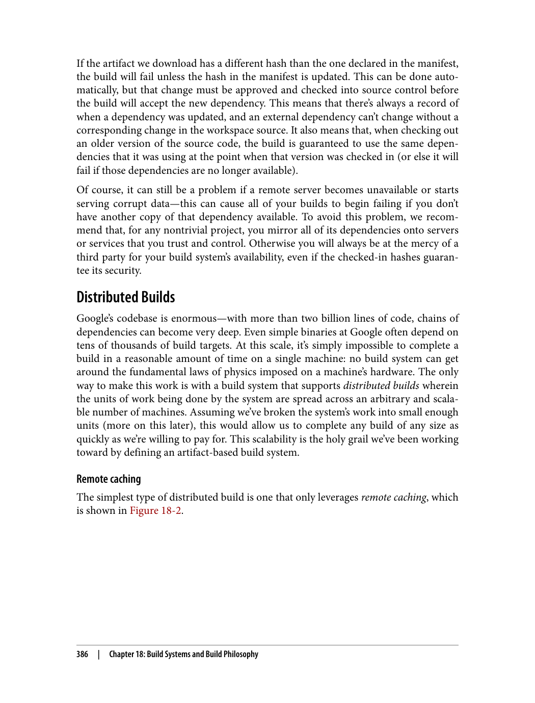

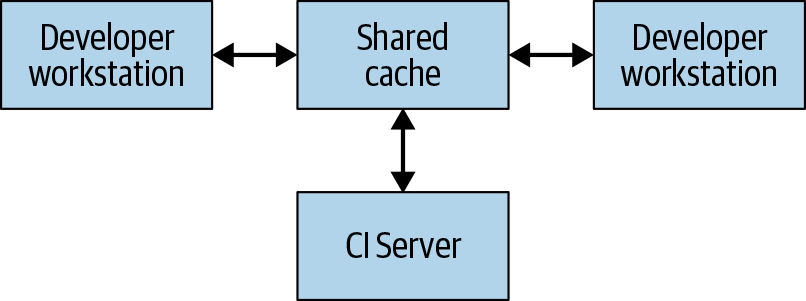

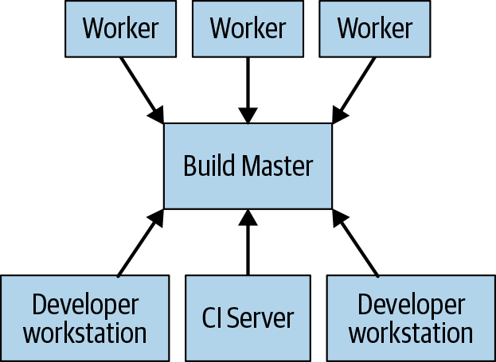

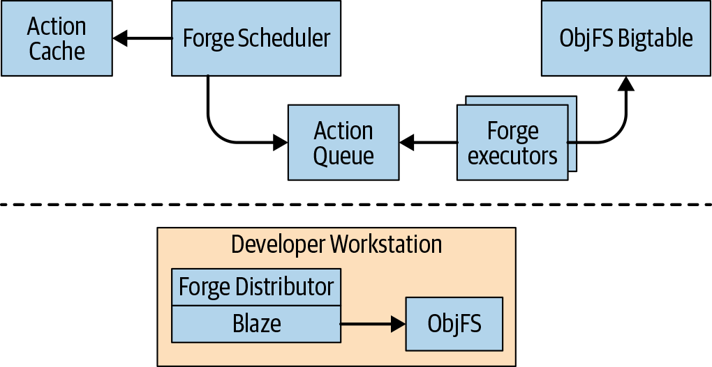

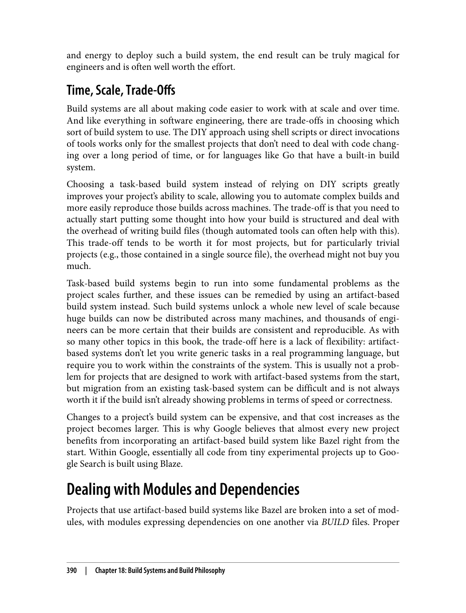

---
