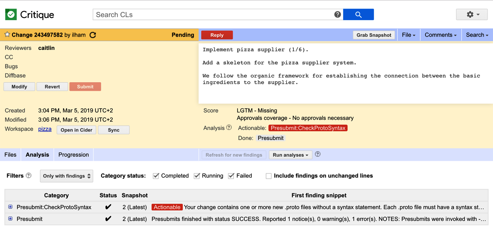
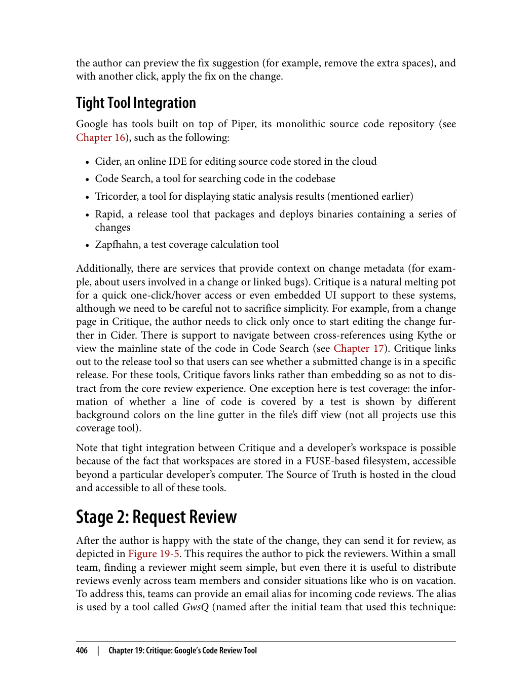
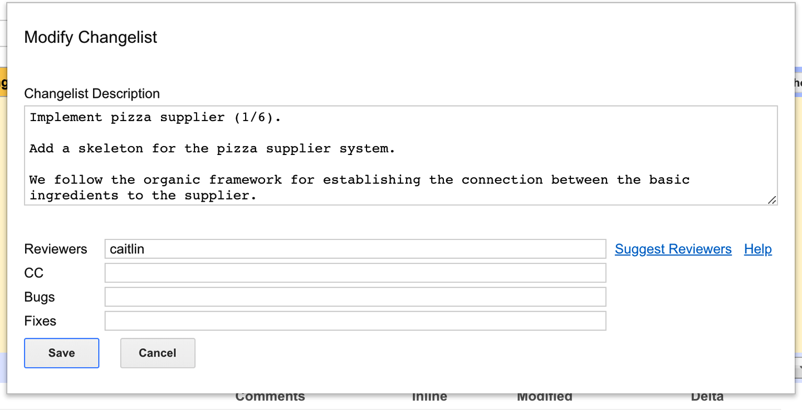
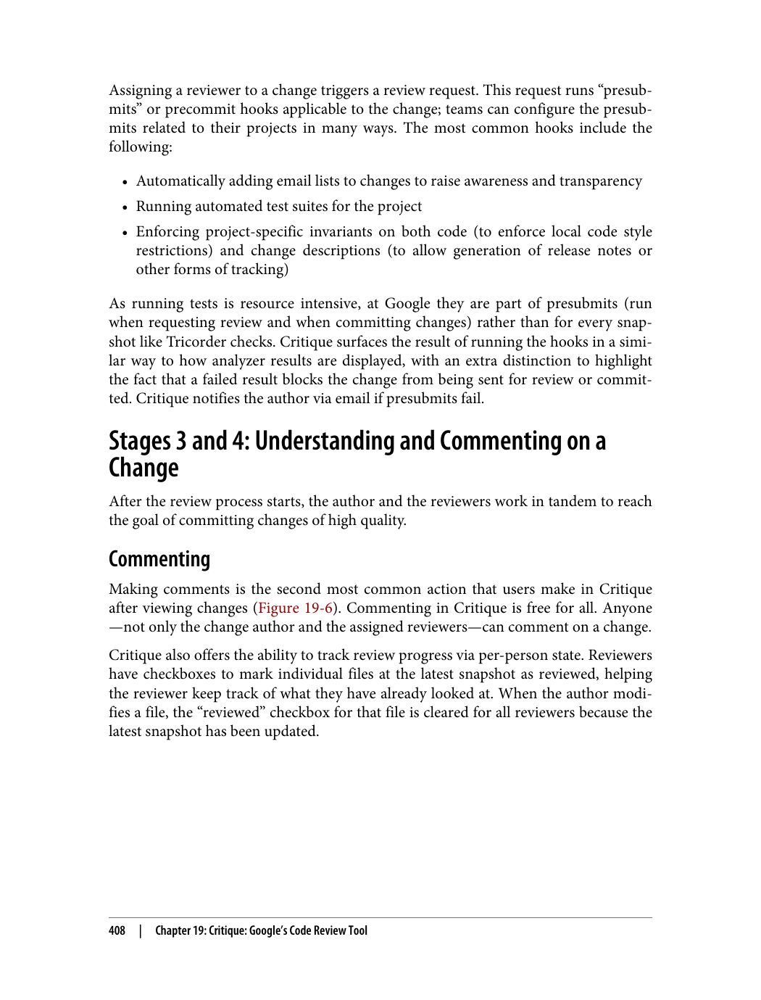
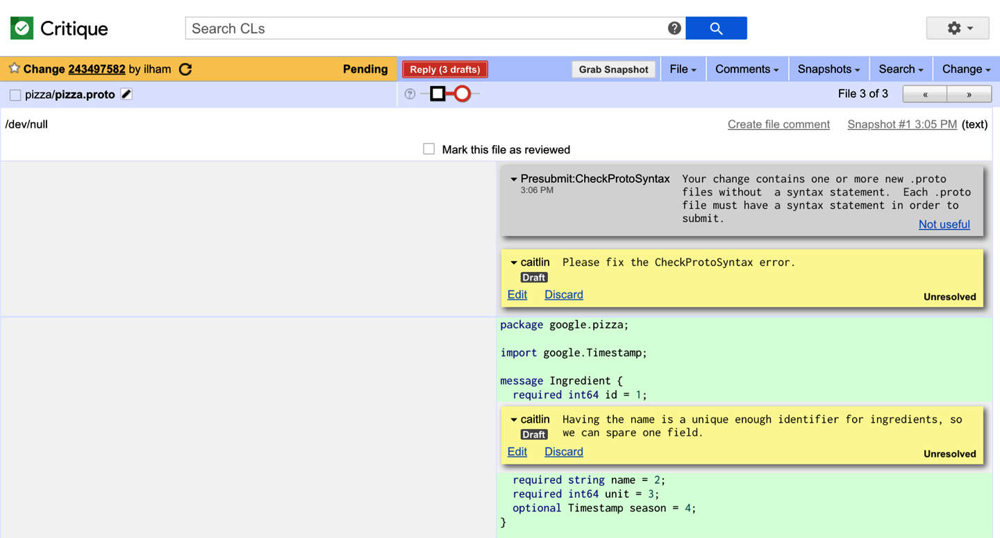
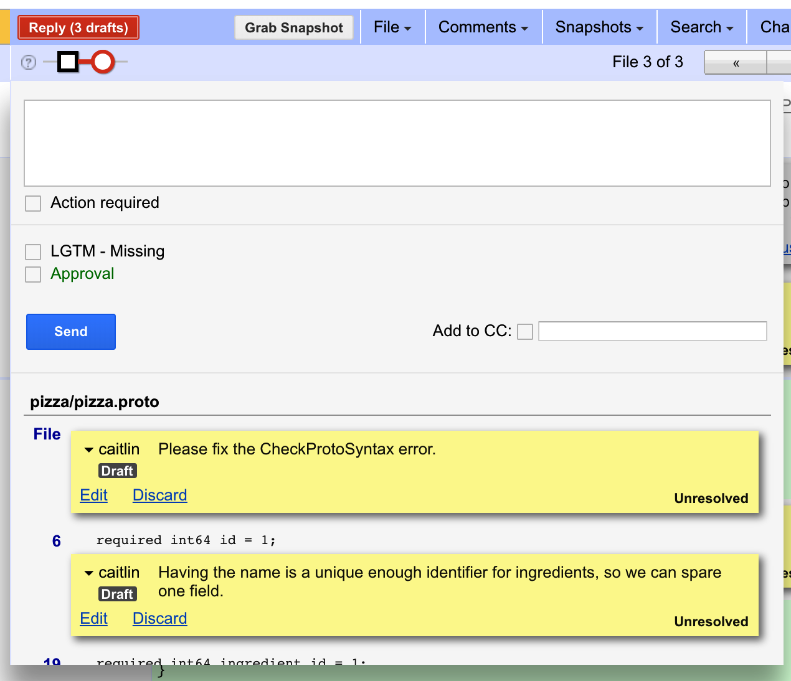

> **راهنمای مطالعه**
>
> در هر بخش، ابتدا متن اصلی کتاب به زبان انگلیسی آورده شده و سپس ترجمه و توضیحات فارسی همان بخش ارائه شده است.

---
-

###### 📄 صفحه ۴۱۹
> Minimizing Module Visibility
> Bazel and other build systems allow each target to specify a visibility: a property that
> specifies which other targets may depend on it. Targets can be public, in which case
> they can be referenced by any other target in the workspace; private, in which case
> they can be referenced only from within the same BUILD file; or visible to only an
> explicitly defined list of other targets. A visibility is essentially the opposite of a
> dependency: if target A wants to depend on target B, target B must make itself visible
> to target A.
> Just like in most programming languages, it is usually best to minimize visibility as
> much as possible. Generally, teams at Google will make targets public only if those
> targets represent widely used libraries available to any team at Google. Teams that
> require others to coordinate with them before using their code will maintain a white‐
> list of customer targets as their target's visibility. Each team's internal implementation
> targets will be restricted to only directories owned by the team, and most BUILD files
> will have only one target that isn't private.
> Managing Dependencies
> Modules need to be able to refer to one another. The downside of breaking a code‐
> base into fine-grained modules is that you need to manage the dependencies among
> those modules (though tools can help automate this). Expressing these dependencies
> usually ends up being the bulk of the content in a BUILD file.
> Internal dependencies
> In a large project broken into fine-grained modules, most dependencies are likely to
> be internal; that is, on another target defined and built in the same source repository.
> Internal dependencies differ from external dependencies in that they are built from
> source rather than downloaded as a prebuilt artifact while running the build. This
> also means that there's no notion of "version" for internal dependencies—a target and
> all of its internal dependencies are always built at the same commit/revision in the
> repository.
> One issue that should be handled carefully with regard to internal dependencies is
> how to treat transitive dependencies (Figure 18-5). Suppose target A depends on target
> B, which depends on a common library target C. Should target A be able to use
> classes defined in target C?
> Figure 18-5. Transitive dependencies
> 392
> |
> Chapter 18: Build Systems and Build Philosophy

**کاهش نمایان بودن ماژول‌ها (Minimizing Module Visibility)**

سیستم‌هایی مانند Bazel و سایر ابزارهای ساخت به هر target اجازه می‌دهند visibility را مشخص کند: ویژگی‌ای که تعیین می‌کند کدام target‌های دیگر می‌توانند به آن وابسته باشند. Target‌ها می‌توانند public باشند، که در این صورت توسط هر target دیگری در workspace قابل ارجاع هستند؛ private باشند، که در این صورت فقط از درون همان BUILD file قابل ارجاع هستند؛ یا فقط برای لیست مشخصی از target‌های دیگر قابل مشاهده باشند. Visibility در واقع متضاد dependency است: اگر target A بخواهد به target B وابسته باشد، target B باید خود را برای target A قابل مشاهده کند.

مانند اکثر زبان‌های برنامه‌نویسی، معمولاً بهتر است visibility را تا حد امکان کاهش دهیم. به طور کلی، تیم‌ها در گوگل target‌ها را فقط زمانی public می‌کنند که آن target‌ها کتابخانه‌های پرکاربردی باشند که برای هر تیمی در گوگل در دسترس هستند. تیم‌هایی که نیاز دارند دیگران قبل از استفاده از کدشان با آن‌ها هماهنگ کنند، لیست سفیدی از target‌های مشتریان را به عنوان visibility target خود نگهداری می‌کنند. target‌های داخلی هر تیم فقط به پوشه‌هایی محدود می‌شوند که متعلق به همان تیم هستند، و اکثر BUILD file‌ها فقط یک target دارند که private نیست.

**مدیریت وابستگی‌ها (Managing Dependencies)**

ماژول‌ها باید بتوانند به یکدیگر ارجاع دهند. نقطه ضعف تقسیم یک پایگاه کد به ماژول‌های ریز این است که باید وابستگی‌های بین آن ماژول‌ها را مدیریت کنید (هرچند ابزارها می‌توانند به خودکارسازی این فرآیند کمک کنند). بیان این وابستگی‌ها معمولاً بخش عمده‌ای از محتوای یک BUILD file را تشکیل می‌دهد.

**وابستگی‌های داخلی (Internal Dependencies)**

در یک پروژه بزرگ که به ماژول‌های ریز تقسیم شده است، اکثر وابستگی‌ها احتمالاً داخلی هستند؛ یعنی به target دیگری وابسته هستند که در همان مخزن منبع تعریف و ساخته شده است. وابستگی‌های داخلی با وابستگی‌های خارجی تفاوت دارند از این جهت که از منبع ساخته می‌شوند و نه به صورت یک artifact از پیش ساخته شده در حین ساخت دانلود می‌شوند. این همچنین به این معنی است که مفهوم «نسخه» برای وابستگی‌های داخلی وجود ندارد — یک target و تمام وابستگی‌های داخلی آن همیشه در همان commit/revision در مخزن ساخته می‌شوند.

مساله‌ای که باید در مورد وابستگی‌های داخلی با دقت مدیریت شود، نحوه برخورد با وابستگی‌های transitive (شکل ۱۸-۵) است. فرض کنید target A به target B وابسته است و target B به یک کتابخانه مشترک target C وابسته است. آیا target A باید بتواند از کلاس‌های تعریف شده در target C استفاده کند؟

---

###### 📄 صفحه ۴۲۳
> repository, and clients need to ensure that they stay up to date with the latest version.
> Debugging also becomes much more difficult because different parts of the system
> will have been built from different points in the repository, and there is no longer a
> consistent view of the source tree.
> A better way to solve the problem of artifacts taking a long time to build is to use a
> build system that supports remote caching, as described earlier. Such a build system
> will save the resulting artifacts from every build to a location that is shared across
> engineers, so if a developer depends on an artifact that was recently built by someone
> else, the build system will automatically download it instead of building it. This pro‐
> vides all of the performance benefits of depending directly on artifacts while still
> ensuring that builds are as consistent as if they were always built from the same
> source. This is the strategy used internally by Google, and Bazel can be configured to
> use a remote cache.
> Security and reliability of external dependencies.    Depending on artifacts from third-
> party sources is inherently risky. There's an availability risk if the third-party source
> (e.g., an artifact repository) goes down, because your entire build might grind to a
> halt if it's unable to download an external dependency. There's also a security risk: if
> the third-party system is compromised by an attacker, the attacker could replace the
> referenced artifact with one of their own design, allowing them to inject arbitrary
> code into your build.
> Both problems can be mitigated by mirroring any artifacts you depend on onto
> servers you control and blocking your build system from accessing third-party arti‐
> fact repositories like Maven Central. The trade-off is that these mirrors take effort
> and resources to maintain, so the choice of whether to use them often depends on the
> scale of the project. The security issue can also be completely prevented with little
> overhead by requiring the hash of each third-party artifact to be specified in the
> source repository, causing the build to fail if the artifact is tampered with.
> Another alternative that completely sidesteps the issue is to vendor your project's
> dependencies. When a project vendors its dependencies, it checks them into source
> control alongside the project's source code, either as source or as binaries. This effec‐
> tively means that all of the project's external dependencies are converted to internal
> dependencies. Google uses this approach internally, checking every third-party
> library referenced throughout Google into a third_party directory at the root of Goo‐
> gle's source tree. However, this works at Google only because Google's source control
> system is custom built to handle an extremely large monorepo, so vendoring might
> not be an option for other organizations.
> 396
> |
> Chapter 18: Build Systems and Build Philosophy

**معماری از راه دور و قابلیت اطمینان وابستگی‌های خارجی**

راه بهتری برای حل مشکل زمان‌بر بودن ساخت artifact‌ها استفاده از سیستم ساختی است که از remote caching پشتیبانی کند، همان‌طور که قبلاً توضیح داده شد. چنین سیستم ساختی artifact‌های حاصل از هر ساخت را در مکانی ذخیره می‌کند که بین مهندسان مشترک است؛ بنابراین اگر یک توسعه‌دهنده به artifact‌ای وابسته باشد که اخیراً توسط شخص دیگری ساخته شده، سیستم ساخت آن را به جای ساخت مجدد به طور خودکار دانلود می‌کند. این تمام مزایای عملکردی وابسته بودن مستقیم به artifact‌ها را فراهم می‌کند و در عین حال تضمین می‌کند که ساختها به همان اندازه سازگار هستند که گویی همیشه از همان منبع ساخته شده‌اند. این استراتژی‌ای است که گوگل به صورت داخلی از آن استفاده می‌کند و Bazel می‌تواند برای استفاده از remote cache پیکربندی شود.

**امنیت و قابلیت اطمینان وابستگی‌های خارجی (Security and Reliability of External Dependencies)**

وابسته بودن به artifact‌هایی از منابع شخص ثالث ذاتاً ریسک‌دار است. ریسک در دسترس بودن وجود دارد اگر منبع شخص ثالث (مثلاً یک مخزن artifact) از کار بیفتد، زیرا ممکن است کل فرآیند ساخت شما متوقف شود اگر نتواند یک وابستگی خارجی را دانلود کند. همچنین ریسک امنیتی وجود دارد: اگر سیستم شخص ثالث توسط یک مهاجم به خطر بیفتد، مهاجم می‌تواند artifact ارجاع شده را با یک artifact طراحی شده توسط خود جایگزین کند و بدین ترتیب کد دلخواه را در فرآیند ساخت شما تزریق کند.

هر دو مشکل را می‌توان با آینه‌سازی (mirroring) تمام artifact‌هایی که به آن‌ها وابسته هستید روی سرورهایی که خودتان کنترل می‌کنید و مسدود کردن دسترسی سیستم ساخت شما به مخازن artifact شخص ثالث مانند Maven Central کاهش داد. نقطه ضعف این روش این است که نگهداری این آینه‌ها به تلاش و منابع نیاز دارد، بنابراین انتخاب استفاده یا عدم استفاده از آن‌ها اغلب به مقیاس پروژه بستگی دارد. مساله امنیتی همچنین می‌تواند با هزینه بسیار کم به طور کامل با مشخص کردن هش هر artifact شخص ثالث در مخزن منبع جلوگیری شود، به طوری که اگر artifact دستکاری شود، ساخت با خطا مواجه شود.

یک جایگزین دیگر که مساله را به طور کامل کنار می‌زند، vendoring کردن وابستگی‌های پروژه است. وقتی یک پروژه وابستگی‌های خود را vendor می‌کند، آن‌ها را در کنار کد منبع پروژه در سیستم کنترل نسخه بررسی (check in) می‌کند، چه به صورت منبع و چه به صورت باینری. این عمداً به این معنی است که تمام وابستگی‌های خارجی پروژه به وابستگی‌های داخلی تبدیل می‌شوند. گوگل از این رویکرد به صورت داخلی استفاده می‌کند و هر کتابخانه شخص ثالثی که در سراسر گوگل به آن ارجاع داده شده را در پوشه third_party در ریشه درخت منبع گوگل بررسی می‌کند. با این حال، این کار در گوگل فقط به این دلیل امکان‌پذیر است که سیستم کنترل نسخه گوگل به صورت سفارشی برای مدیریت یک monorepo فوق‌العاده بزرگ ساخته شده است، بنابراین vendoring ممکن است برای سایر سازمان‌ها گزینه مناسبی نباشد.

---

###### 📄 صفحه ۴۲۷
> Simplicity
> Critique's user interface (UI) is based around making it easy to do code review
> without a lot of unnecessary choices, and with a smooth interface. The UI loads
> fast, navigation is easy and hotkey supported, and there are clear visual markers
> for the overall state of whether a change has been reviewed.
> Foundation of trust
> Code review is not for slowing others down; instead, it is for empowering others.
> Trusting colleagues as much as possible makes it work. This might mean, for
> example, trusting authors to make changes and not requiring an additional
> review phase to double check that minor comments are actually addressed. Trust
> also plays out by making changes openly accessible (for viewing and reviewing)
> across Google.
> Generic communication
> Communication problems are rarely solved through tooling. Critique prioritizes
> generic ways for users to comment on the code changes, instead of complicated
> protocols. Critique encourages users to spell out what they want in their com‐
> ments or even suggests some edits instead of making the data model and process
> more complex. Communication can go wrong even with the best code review
> tool because the users are humans.
> Workflow integration
> Critique has a number of integration points with other core software develop‐
> ment tools. Developers can easily navigate to view the code under review in our
> code search and browsing tool, edit code in our web-based code editing tool, or
> view test results associated with a code change.
> Across these guiding principles, simplicity has probably had the most impact on the
> tool. There were many interesting features we considered adding, but we decided not
> to make the model more complicated to support a small set of users.
> Simplicity also has an interesting tension with workflow integration. We considered
> but ultimately decided against creating a "Code Central" tool with code editing,
> reviewing, and searching in one tool. Although Critique has many touchpoints with
> other tools, we consciously decided to keep code review as the primary focus. Fea‐
> tures are linked from Critique but implemented in different subsystems.
> Code Review Flow
> Code reviews can be executed at many stages of software development, as illustrated
> in Figure 19-1. Critique reviews typically take place before a change can be commit‐
> ted to the codebase, also known as precommit reviews. Although Chapter 9 contains a
> brief description of the code review flow, here we expand it to describe key aspects of
> 400
> |
> Chapter 19: Critique: Google's Code Review Tool

**سادگی (Simplicity)**

رابط کاربری (UI) Critique حول محور آسان کردن بررسی کد بدون انتخاب‌های غیرضروری زیاد و با رابطی روان طراحی شده است. رابط کاربری سریع بارگذاری می‌شود، ناوبری آسان و با پشتیبانی از کلیدهای میانبر است، و نشانگرهای بصری واضحی برای وضعیت کلی اینکه آیا یک تغییر بررسی شده یا خیر وجود دارد.

**پایه اعتماد (Foundation of Trust)**

بررسی کد برای کند کردن دیگران نیست؛ بلکه برای توانمندسازی دیگران است. اعتماد حداکثری به همکاران باعث موفقیت آن می‌شود. این ممکن است به این معنی باشد که به نویسندگان اعتماد کنیم و نیازی به مرحله بررسی اضافی برای بررسی مجدد اینکه آیا نظرات جزئی واقعاً رسیدگی شده‌اند نداشته باشیم. اعتماد همچنین با دسترسی آزاد تغییرات (برای مشاهده و بررسی) در سراسر گوگل نمود پیدا می‌کند.

**ارتباطات عمومی (Generic Communication)**

مشکلات ارتباطی به ندرت از طریق ابزارها حل می‌شوند. Critique راه‌های عمومی برای نظر دادن کاربران در مورد تغییرات کد را در اولویت قرار می‌دهد، به جای پروتکل‌های پیچیده. Critique به کاربران توصیه می‌کند خواسته‌های خود را در نظراتشان به صورت واضح بیان کنند یا حتی ویرایش‌هایی پیشنهاد دهد، به جای پیچیده‌تر کردن مدل داده و فرآیند. ارتباطات حتی با بهترین ابزار بررسی کد هم می‌توانند به خطا بروند زیرا کاربران انسان هستند.

**یکپارچه‌سازی با گردش کار (Workflow Integration)**

Critique نقاط یکپارچه‌سازی متعددی با سایر ابزارهای اصلی توسعه نرم‌افزار دارد. توسعه‌دهندگان می‌توانند به راحتی کد در حال بررسی را در ابزار جستجو و مرور کد مشاهده کنند، کد را در ابزار ویرایش کد مبتنی بر وب ویرایش کنند، یا نتایج تست مرتبط با یک تغییر کد را مشاهده کنند.

در میان این اصول راهنما، سادگی احتمالاً بیشترین تأثیر را بر روی ابزار داشته است. ویژگی‌های جالب زیادی بود که اضافه کردنشان را در نظر گرفتیم، اما تصمیم گرفتیم مدل را برای پشتیبانی از تعداد کمی کاربر پیچیده‌تر نکنیم.

سادگی همچنین تنش جالبی با یکپارچه‌سازی گردش کار دارد. ما ایجاد ابزار «Code Central» با ویرایش کد، بررسی و جستجو در یک ابزار را در نظر گرفتیم اما در نهایت تصمیم گرفتیم این کار را انجام ندهیم. اگرچه Critique نقاط تماس زیادی با سایر ابزارها دارد، ما آگاهانه تصمیم گرفتیم بررسی کد را به عنوان تمرکز اصلی حفظ کنیم. ویژگی‌ها از Critique پیوند داده می‌شوند اما در زیرسیستم‌های مختلف پیاده‌سازی می‌شوند.

**جریان بررسی کد (Code Review Flow)**

بررسی‌های کد می‌توانند در مراحل مختلف توسعه نرم‌افزار اجرا شوند، همان‌طور که در شکل ۱۹-۱ نشان داده شده است. بررسی‌های Critique معمولاً قبل از اینکه بتوان یک تغییر را در پایگاه کد commit کرد انجام می‌شوند، که به عنوان precommit reviews نیز شناخته می‌شوند. اگرچه فصل ۹ توصیف مختصری از جریان بررسی کد ارائه می‌دهد، در اینجا ما آن را گسترش می‌دهیم تا جنبه‌های کلیدی را توصیف کنیم.

---

###### 📄 صفحه ۴۳۱
> Users can also view the diff in various different modes, such as overlay and side by
> side. When developing Critique, we decided that it was important to have side-by-
> side diffs to make the review process easier. Side-by-side diffs take a lot of space: to
> make them a reality, we had to simplify the diff view structure, so there is no border,
> no padding—just the diff and line numbers. We also had to play around with a vari‐
> ety of fonts and sizes until we had a diff view that accommodates even for Java's 100-
> character line limit for the typical screen-width resolution when Critique launched
> (1,440 pixels).
> Critique further supports a variety of custom tools that provide diffs of artifacts pro‐
> duced by a change, such as a screenshot diff of the UI modified by a change or con‐
> figuration files generated by a change.
> To make the process of navigating diffs smooth, we were careful not to waste space
> and spent significant effort ensuring that diffs load quickly, even for images and large
> files and/or changes. We also provide keyboard shortcuts to quickly navigate through
> files while visiting only modified sections.
> When users drill down to the file level, Critique provides a UI widget with a compact
> display of the chain of snapshot versions of a file; users can drag and drop to select
> which versions to compare. This widget automatically collapses similar snapshots,
> drawing focus to important snapshots. It helps the user understand the evolution of a
> file within a change; for example, which snapshots have test coverage, have already
> been reviewed, or have comments. To address concerns of scale, Critique prefetches
> everything, so loading different snapshots is very quick.
> Analysis Results
> Uploading a snapshot of the change triggers code analyzers (see Chapter 20). Critique
> displays the analysis results on the change page, summarized by analyzer status chips
> shown below the change description, as depicted in Figure 19-3, and detailed in the
> Analysis tab, as illustrated in Figure 19-4.
> Analyzers can mark specific findings to highlight in red for increased visibility. Ana‐
> lyzers that are still in progress are represented by yellow chips, and gray chips are dis‐
> played otherwise. For the sake of simplicity, Critique offers no other options to mark
> or highlight findings—actionability is a binary option. If an analyzer produces some
> results ("findings"), clicking the chip opens up the findings. Like comments, findings
> can be displayed inside the diff but styled differently to make them easily distinguish‐
> able. Sometimes, the findings also include fix suggestions, which the author can pre‐
> view and choose to apply from Critique.
> 404
> |
> Chapter 19: Critique: Google's Code Review Tool

**نمای diff و نتایج تحلیل (Diff View and Analysis Results)**

کاربران همچنین می‌توانند diff را در حالت‌های مختلف مختلف مشاهده کنند، مانند overlay و side-by-side. هنگام توسعه Critique، تصمیم گرفتیم که داشتن diffهای side-by-side برای آسان‌تر کردن فرآیند بررسی مهم است. Diffهای side-by-side فضای زیادی اشغال می‌کنند: برای عملی کردن آن‌ها، مجبور شدیم ساختار نمای diff را ساده کنیم، بنابراین حاشیه‌ای، حاشیه داخلی‌ای وجود ندارد — فقط diff و شماره خطوط. همچنین مجبور شدیم با انواع فونت‌ها و اندازه‌ها آزمایش کنیم تا نمای diffای داشته باشیم که حتی محدودیت ۱۰۰ کاراکتری خطوط جاوا را در وضوح عرض صفحه نمایش معمولی هنگام راه‌اندازی Critique (۱,۴۴۰ پیکسل) پوشش دهد.

Critique همچنین از ابزارهای سفارشی مختلفی پشتیبانی می‌کند که diffهای artifact‌های تولید شده توسط یک تغییر را فراهم می‌کنند، مانند diff اسکرین‌شات رابط کاربری اصلاح شده توسط یک تغییر یا فایل‌های پیکربندی تولید شده توسط یک تغییر.

برای هموار کردن فرآیند ناوبری در diffها، مراقب بودیم فضا را هدر ندهیم و تلاش قابل توجهی کردیم تا مطمئن شویم diffها به سرعت بارگذاری می‌شوند، حتی برای تصاویر و فایل‌های بزرگ و/یا تغییرات بزرگ. ما همچنین میانبرهای صفحه کلید را برای ناوبری سریع در فایل‌ها فراهم می‌کنیم در حالی که فقط بخش‌های تغییر یافته را بازدید می‌کنیم.

هنگامی که کاربران به سطح فایل می‌رسند، Critique یک ابزار رابط کاربری با نمای فشرده زنجیره نسخه‌های snapshot یک فایل ارائه می‌دهد؛ کاربران می‌توانند با کشیدن و رها کردن انتخاب کنند کدام نسخه‌ها مقایسه شوند. این ابزار به طور خودکار snapshotهای مشابه را جمع‌بندی می‌کند و تمرکز را به snapshotهای مهم جلب می‌کند. این به کاربر کمک می‌کند تکامل یک فایل در یک تغییر را درک کند؛ برای مثال، کدام snapshotها پوشش تست دارند، قبلاً بررسی شده‌اند، یا نظراتی دارند. برای رسیدگی به نگرانی‌های مقیاس، Critique همه چیز را از پیش بارگذاری می‌کند، بنابراین بارگذاری snapshotهای مختلف بسیار سریع است.

**نتایج تحلیل (Analysis Results)**

آپلود کردن snapshot یک تغییر، تحلیلگرهای کد را فعال می‌کند (نگاه کنید به فصل ۲۰). Critique نتایج تحلیل را در صفحه تغییر نمایش می‌دهد که توسط status chipهای تحلیلگر خلاصه شده و در زیر توضیحات تغییر نشان داده می‌شوند، همان‌طور که در شکل ۱۹-۳ نشان داده شده و در تب Analysis به تفصیل آورده شده، همان‌طور که در شکل ۱۹-۴ نشان داده شده است.

تحلیلگرها می‌توانند یافته‌های خاصی را برای برجسته کردن به رنگ قرمز علامت‌گذاری کنند تا دید بیشتری داشته باشند. تحلیلگرهایی که هنوز در حال انجام هستند با chipهای زرد نشان داده می‌شوند و chipهای خاکستری در غیر این صورت نمایش داده می‌شوند. به خاطر سادگی، Critique گزینه‌های دیگری برای علامت‌گذاری یا برجسته کردن یافته‌ها ارائه نمی‌دهد — قابلیت عمل یک گزینه دودویی است. اگر یک تحلیلگر نتایجی («یافته‌ها») تولید کند، روی chip کلیک کردن یافته‌ها را باز می‌کند. مانند نظرات، یافته‌ها می‌توانند داخل diff نمایش داده شوند اما با استایل متفاوتی تا به راحتی قابل تشخیص باشند. گاهی اوقات، یافته‌ها همچنین شامل پیشنهادات اصلاحی هستند که نویسنده می‌تواند پیش‌نمایش آن‌ها را ببیند و انتخاب کند از Critique اعمال شوند.

---

###### 📄 صفحه ۴۳۵
> Assigning a reviewer to a change triggers a review request. This request runs "presub‐
> mits" or precommit hooks applicable to the change; teams can configure the presub‐
> mits related to their projects in many ways. The most common hooks include the
> following:
> • Automatically adding email lists to changes to raise awareness and transparency
> • Running automated test suites for the project
> • Enforcing project-specific invariants on both code (to enforce local code style
> restrictions) and change descriptions (to allow generation of release notes or
> other forms of tracking)
> As running tests is resource intensive, at Google they are part of presubmits (run
> when requesting review and when committing changes) rather than for every snap‐
> shot like Tricorder checks. Critique surfaces the result of running the hooks in a simi‐
> lar way to how analyzer results are displayed, with an extra distinction to highlight
> the fact that a failed result blocks the change from being sent for review or commit‐
> ted. Critique notifies the author via email if presubmits fail.
> Stages 3 and 4: Understanding and Commenting on a
> Change
> After the review process starts, the author and the reviewers work in tandem to reach
> the goal of committing changes of high quality.
> Commenting
> Making comments is the second most common action that users make in Critique
> after viewing changes (Figure 19-6). Commenting in Critique is free for all. Anyone
> —not only the change author and the assigned reviewers—can comment on a change.
> Critique also offers the ability to track review progress via per-person state. Reviewers
> have checkboxes to mark individual files at the latest snapshot as reviewed, helping
> the reviewer keep track of what they have already looked at. When the author modi‐
> fies a file, the "reviewed" checkbox for that file is cleared for all reviewers because the
> latest snapshot has been updated.
> 408
> |
> Chapter 19: Critique: Google's Code Review Tool

**درخواست‌های بررسی و پیش‌ارسال (Review Requests and Presubmits)**

تخصیص یک بررسی‌کننده به یک تغییر، یک درخواست بررسی ایجاد می‌کند. این درخواست «presubmits» یا precommit hookهایی را اجرا می‌کند که برای تغییر اعمال می‌شوند؛ تیم‌ها می‌توانند presubmitهای مرتبط با پروژه‌های خود را به روش‌های مختلفی پیکربندی کنند. رایج‌ترین hookها شامل موارد زیر هستند:

• اضافه خودکار لیست‌های ایمیل به تغییرات برای افزایش آگاهی و شفافیت
• اجرای مجموعه تست‌های خودکار پروژه
• اعمال invariantهای خاص پروژه بر روی هر دو کد (برای اعمال محدودیت‌های سبک کد محلی) و توضیحات تغییر (برای اجازه تولید release notes یا اشکال دیگر ردیابی)

از آنجا که اجرای تست‌ها به منابع زیادی نیاز دارد، در گوگل آن‌ها بخشی از presubmitها هستند (هنگام درخواست بررسی و هنگام commit کردن تغییرات اجرا می‌شوند) نه برای هر snapshot مانند بررسی‌های Tricorder. Critique نتیجه اجرای hookها را به شیوه‌ای مشابه نحوه نمایش نتایج تحلیلگر نشان می‌دهد، با تمایز اضافی برای برجسته کردن این واقعیت که یک نتیجه ناموفق مانع از ارسال تغییر برای بررسی یا commit شدن می‌شود. Critique نویسنده را از طریق ایمیل در صورت ناموفق بودن presubmitها مطلع می‌کند.

**مراحل ۳ و ۴: درک و نظر دادن در مورد یک تغییر (Stages 3 and 4: Understanding and Commenting on a Change)**

پس از شروع فرآیند بررسی، نویسنده و بررسی‌کنندگان با همکاری یکدیگر برای رسیدن به هدف commit کردن تغییرات با کیفیت بالا کار می‌کنند.

**نظر دادن (Commenting)**

نظر دادن دومین عمل رایجی است که کاربران در Critique انجام می‌دهند پس از مشاهده تغییرات (شکل ۱۹-۶). نظر دادن در Critique برای همه آزاد است. هر کسی —نه فقط نویسنده تغییر و بررسی‌کنندگان تعیین شده— می‌تواند در مورد یک تغییر نظر دهد. Critique همچنین قابلیت ردیابی پیشرفت بررسی از طریق وضعیت فردی را ارائه می‌دهد. بررسی‌کنندگان checkboxهایی برای علامت‌گذاری فایل‌های جداگانه در آخرین snapshot به عنوان بررسی شده دارند، که به بررسی‌کننده کمک می‌کند ردیابی کند قبلاً چه چیزهایی را بررسی کرده است. وقتی نویسنده یک فایل را تغییر می‌دهد، checkbox «بررسی شده» آن فایل برای همه بررسی‌کنندگان پاک می‌شود زیرا آخرین snapshot به‌روز شده است.

---