## فصل ۱۹: ادغام مداوم

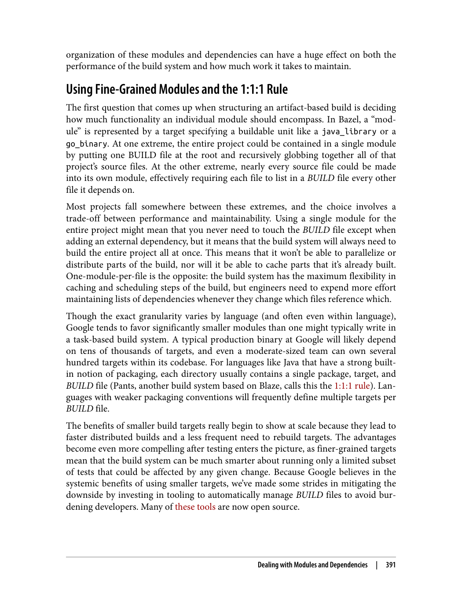

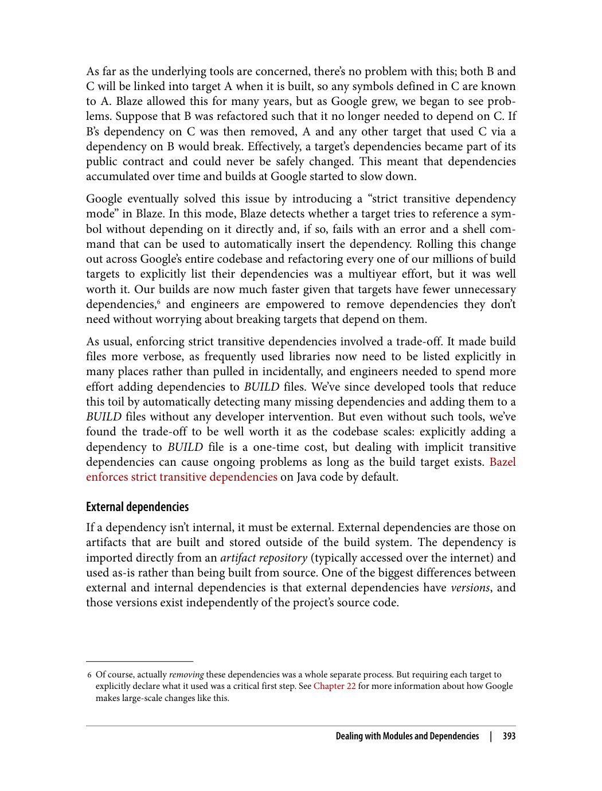

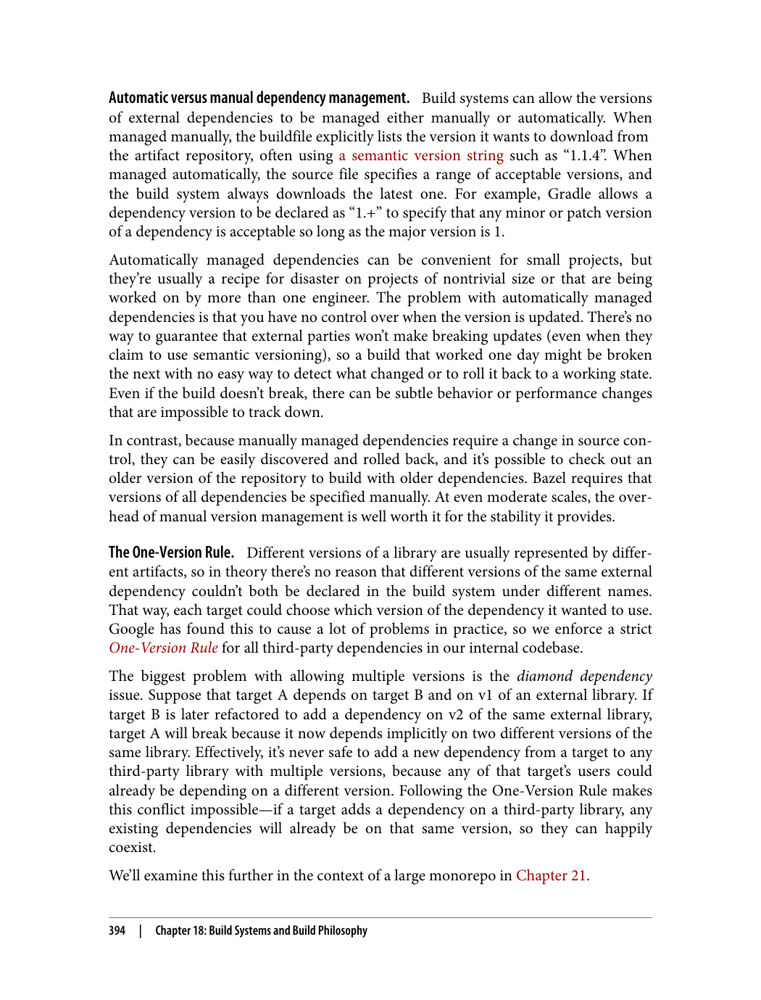

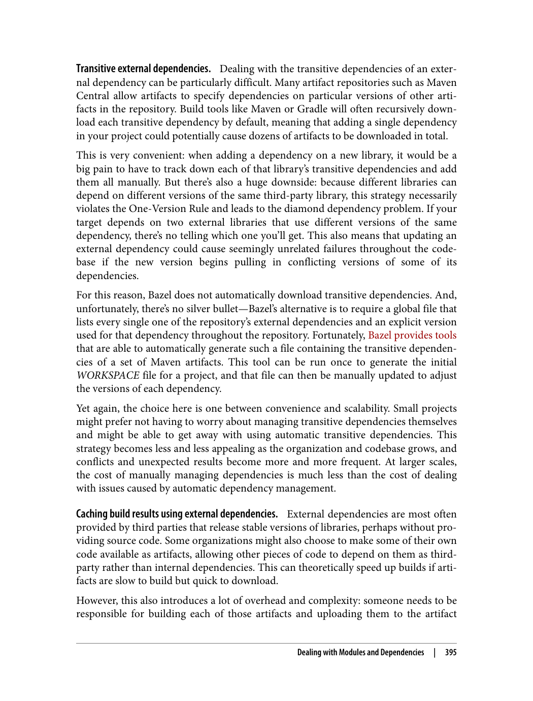

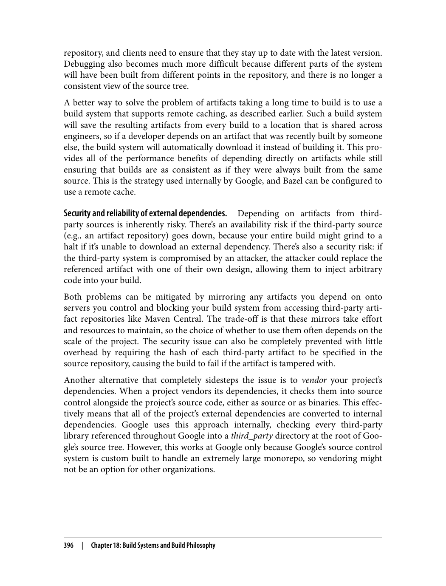

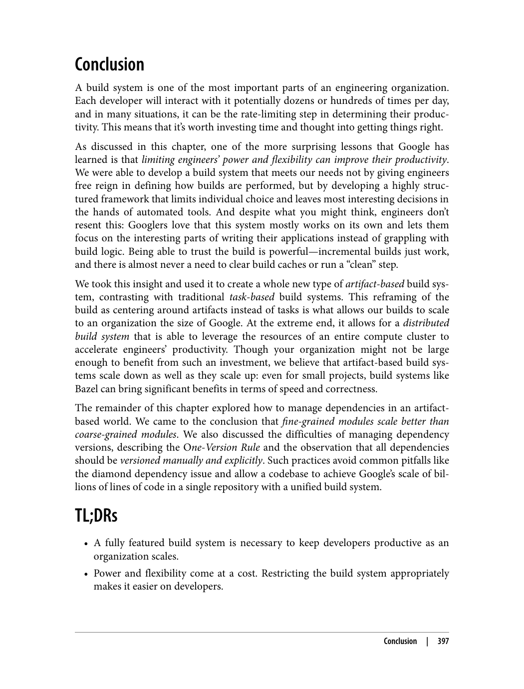

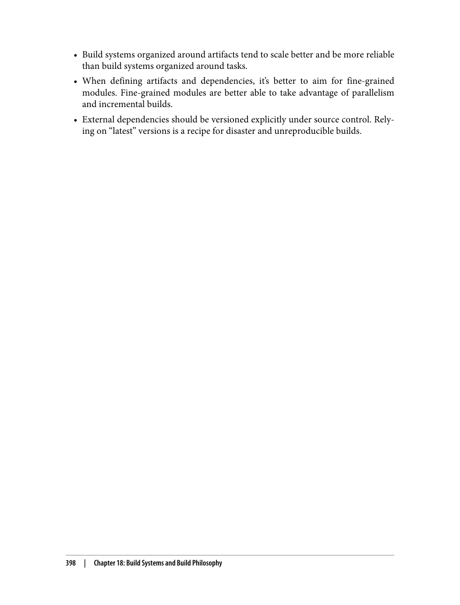

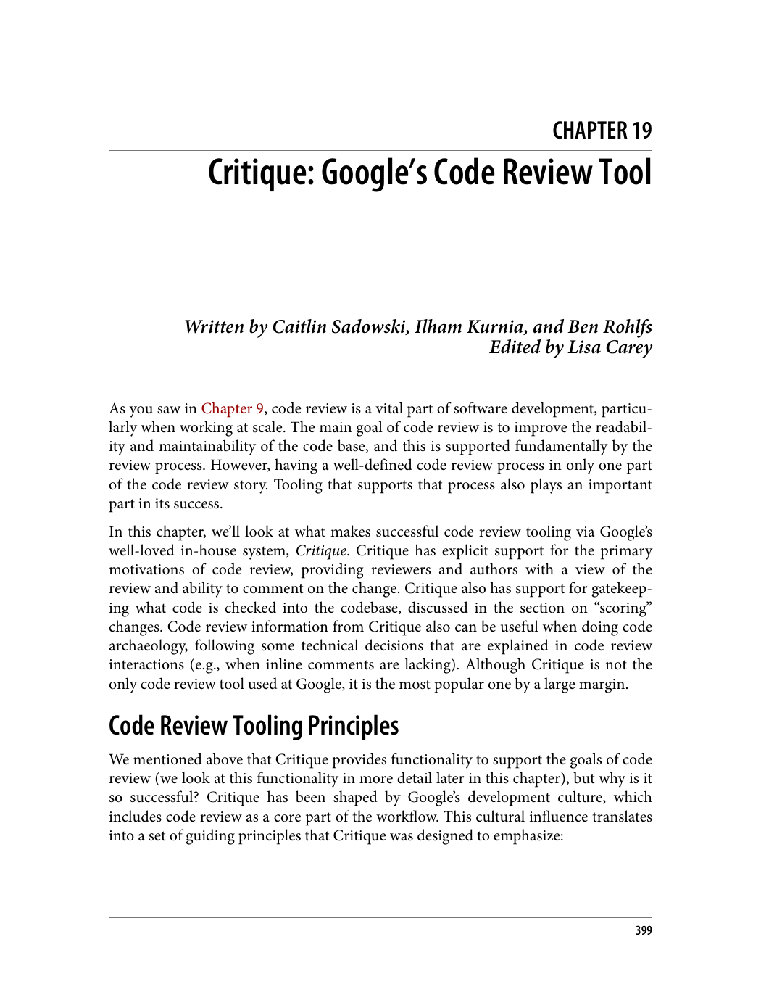

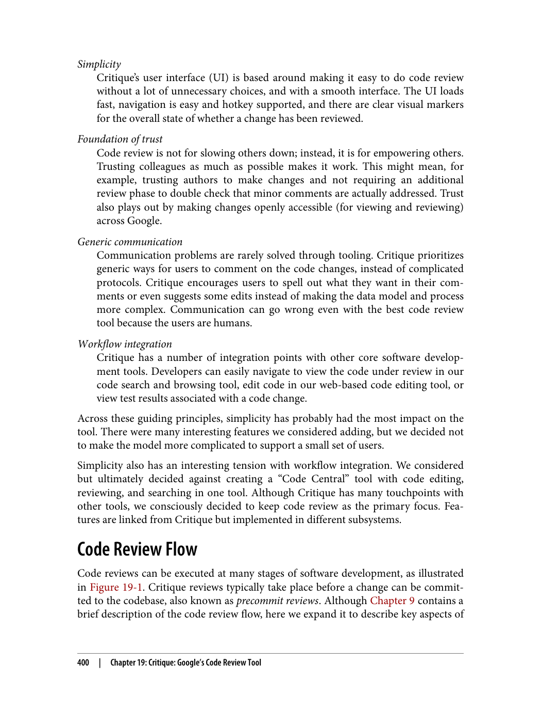

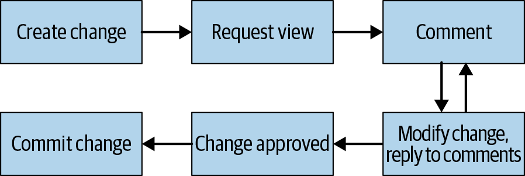

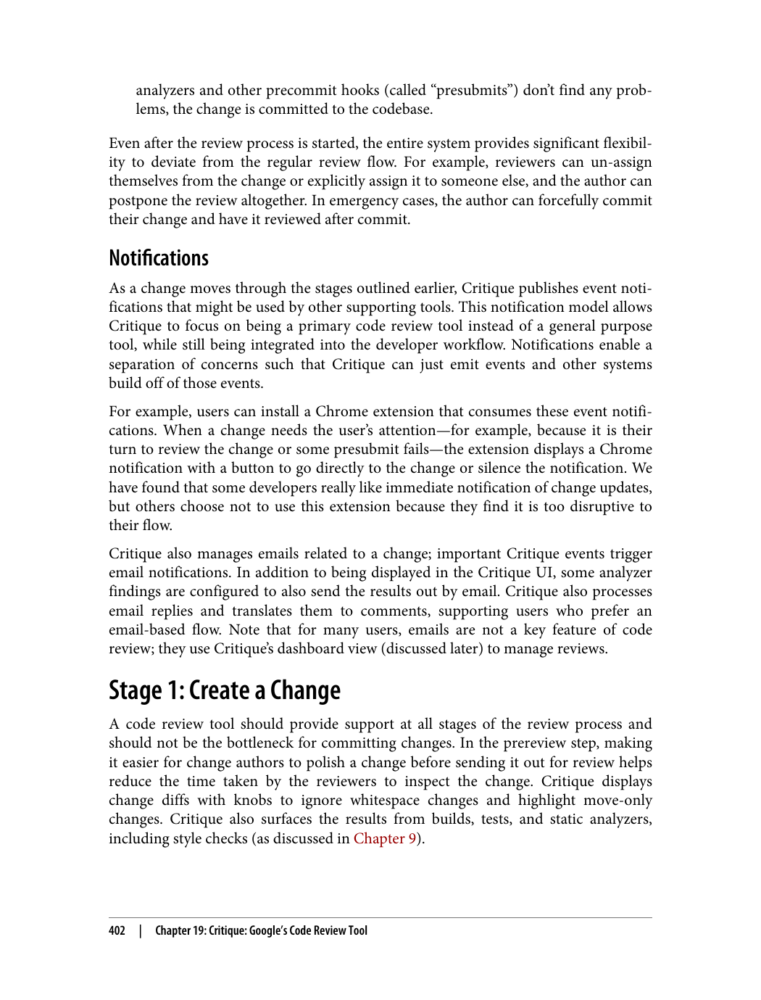

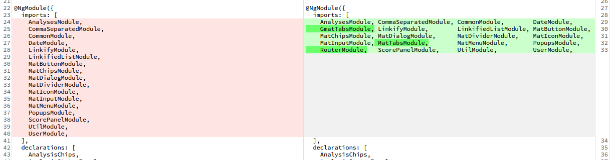

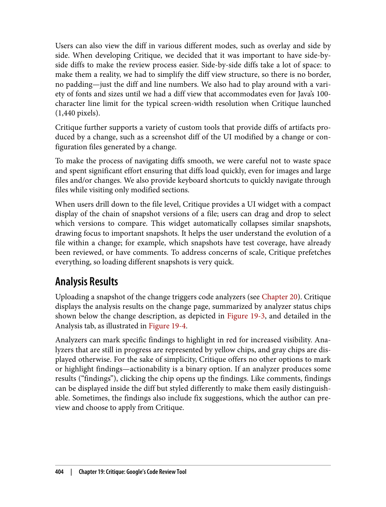

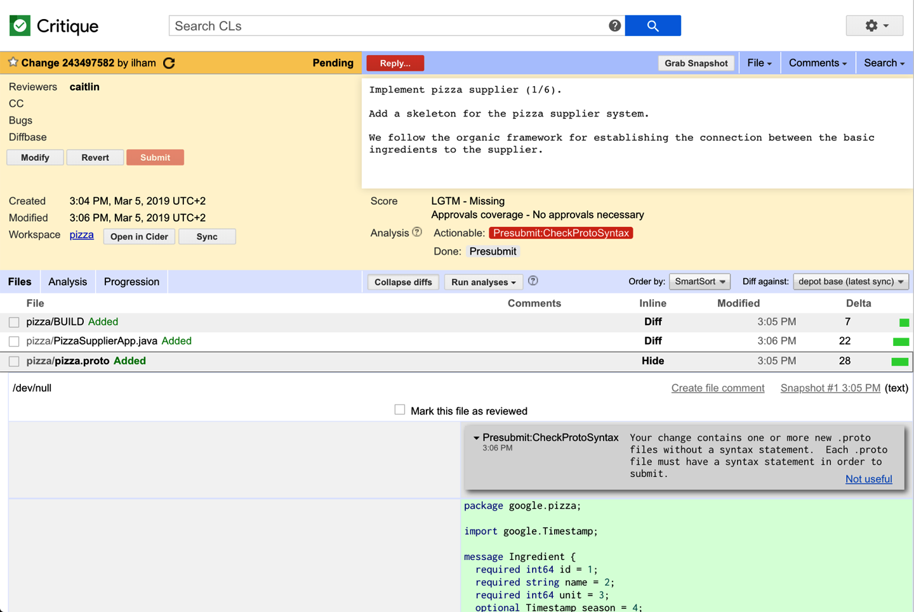

---

> "ادغام مداوم، فرآیند ادغام مکرر تغییرات کد در شاخه اصلی است. این فرآیند بازخورد سریع و شناسایی زودهنگام مشکلات را ممکن می‌سازد."

### مفهوم ادغام مداوم

> "ادغام مداوم به معنای ادغام مکرر تغییرات کد در شاخه اصلی است."

در ادغام مداوم، توسعه‌دهندگان تغییرات خود را به طور مکرر در شاخه اصلی ادغام می‌کنند. این به شناسایی سریع مشکلات و کاهش تعارضات کمک می‌کند.

### اصول ادغام مداوم

> "ادغام مداوم اصول خاص خود را دارد."

اصول اصلی:
1. **اتوماسیون**: فرآیندها باید خودکار باشند
2. **بازخورد سریع**: بازخورد باید سریع ارائه شود
3. **تست مداوم**: تست‌ها باید به طور مداوم اجرا شوند
4. **عدم شکستن ساخت**: ساخت اصلی نباید شکسته شود

### چالش‌های ادغام مداوم

> "ادغام مداوم چالش‌های خاص خود را دارد."

چالش‌های اصلی:
1. **محدودیت‌های منابع**: منابع محاسباتی محدود هستند
2. **زمان اجرا**: زمان اجرای تست‌ها ممکن است زیاد باشد
3. ** quản lý شکست‌ها**: شکست‌ها باید به درستی مدیریت شوند

### پلتفرم Test Automation Platform (TAP)

> "TAP پلتفرم تست خودکار گوگل است که فرآیند تست را مدیریت می‌کند."

ویژگی‌های TAP:
1. **مدیریت شکست‌ها**: شناسایی و مدیریت شکست‌ها
2. **پیدا کردن مقصر**: شناسایی علت شکست
3. **بهینه‌سازی پیش‌ارسال**: بهینه‌سازی تست‌های پیش‌ارسال

---