> **راهنمای مطالعه**
>
> در هر بخش، ابتدا متن اصلی کتاب به زبان انگلیسی آورده شده و سپس ترجمه و توضیحات فارسی همان بخش ارائه شده است.

---

###### 📄 صفحه ۴۳

> 15 Beyer et al. Site Reliability Engineering: How Google Runs Production Systems, Chapter 5, "Eliminating Toil."
> 16 In our experience, an average software engineer (SWE) produces a pretty constant number of lines of code
> per unit time. For a fixed SWE population, a codebase grows linearly—proportional to the count of SWE-
> months over time. If your tasks require effort that scales with lines of code, that's concerning.
> Through this and other experiences, we've discovered many factors that affect the
> flexibility of a codebase:
> Expertise
> We know how to do this; for some languages, we've now done hundreds of com‐
> pilot upgrades across many platforms.
> Stability
> There is less change between releases because we adopt releases more regularly;
> for some languages, we're now deploying compiler upgrades every week or two.
> Conformity
> There is less code that hasn't been through an upgrade already, again because we
> are upgrading regularly.
> Familiarity
> Because we do this regularly enough, we can spot redundancies in the process of
> performing an upgrade and attempt to automate. This overlaps significantly with
> SRE views on toil.15
> Policy
> We have processes and policies like the Beyoncé Rule. The net effect of these pro‐
> cesses is that upgrades remain feasible because infrastructure teams do not need
> to worry about every unknown usage, only the ones that are visible in our CI
> systems.
> The underlying lesson is not about the frequency or difficulty of compiler upgrades,
> but that as soon as we became aware that compiler upgrade tasks were necessary, we
> found ways to make sure to perform those tasks with a constant number of engineers,
> even as the codebase grew.16 If we had instead decided that the task was too expensive
> and should be avoided in the future, we might still be using a decade-old compiler
> version. We would be paying perhaps 25% extra for computational resources as a
> result of missed optimization opportunities. Our central infrastructure could be vul‐
> nerable to significant security risks given that a 2006-era compiler is certainly not
> helping to mitigate speculative execution vulnerabilities. Stagnation is an option, but
> often not a wise one.
> 16
> |
> Chapter 1: What Is Software Engineering?

از طریق این تجربه و تجربه‌های دیگر، ما عوامل زیادی را کشف کرده‌ایم که بر انعطاف‌پذیری (Flexibility) یک پایگاه کد (Codebase) تأثیر می‌گذارند:

**تخصص (Expertise):** ما می‌دانیم چگونه این کار را انجام دهیم؛ برای برخی زبان‌ها، ما تاکنون صدها ارتقای کامپایلر (Compiler Upgrade) را در پلتفرم‌های مختلف انجام داده‌ایم.

**ثبات (Stabillity):** تغییرات بین نسخه‌های کمتر است زیرا ما نسخه‌ها را منظم‌تر منتشر می‌کنیم؛ برای برخی زبان‌ها، ما اکنون ارتقاهای کامپایلر را هر هفته یا دو هفته یکبار مستقر می‌کنیم.

**انطباق (Conformity):** کد کمتری وجود دارد که قبلاً از ارتقا عبور نکرده باشد، دوباره به این دلیل که ما به‌طور منظم ارتقا می‌دهیم.

**آشنایی (Familiarity):** زیرا ما این کار را به اندازه کافی منظم انجام می‌دهیم، می‌توانیم در فرآیند انجام یک ارتقا، موارد اضافی را شناسایی کرده و تلاش کنیم آن‌ها را خودکار (Automate) کنیم. این به‌طور قابل توجهی با دیدگاه‌های SRE در مورد Toil همپوشانی دارد.

**سیاست (Policy):** ما فرآیندها و سیاست‌هایی مانند قانون بیانسه (Beyoncé Rule) داریم. تأثیر خالص این فرآیندها این است که ارتقاها همچنان امکان‌پذیر باقی می‌مانند زیرا تیم‌های زیرساخت نیازی به نگرانی در مورد هر استفاده ناشناخته ندارند، فقط مواردی که در سیستم‌های CI ما قابل مشاهده هستند.

درس اصلی در مورد فرکانس یا دشواری ارتقاهای کامپایلر نیست، بلکه این است که به محض اینکه ما آگاه شدیم که وظایف ارتقای کامپایلر ضروری هستند، راه‌هایی پیدا کردیم تا مطمئن شویم آن وظایف را با تعداد ثابتی از مهندسان انجام می‌دهیم، حتی با رشد پایگاه کد. اگر به‌جای آن تصمیم می‌گرفتیم که این کار بسیار گران است و باید در آینده از آن اجتناب شود، ممکن بود همچنان از نسخه کامپایلری که ده سال قدمت دارد استفاده کنیم. ممکن بود ۲۵٪ بیشتر برای منابع محاسباتی به‌عنوان نتیجه فرصت‌های بهینه‌سازی از دست رفته بپردازیم. زیرساخت مرکزی ما ممکن بود در معرض خطرات امنیتی قابل توجهی باشد، با توجه به اینکه کامپایلری از دوره ۲۰۰۶ قطعاً به کاهش آسیب‌پذیری‌های اجرای تصادفی (Speculative Execution Vulnerabilities) کمک نمی‌کند. رکود یک گزینه است، اما اغلب یک گزینه عاقلانه نیست.

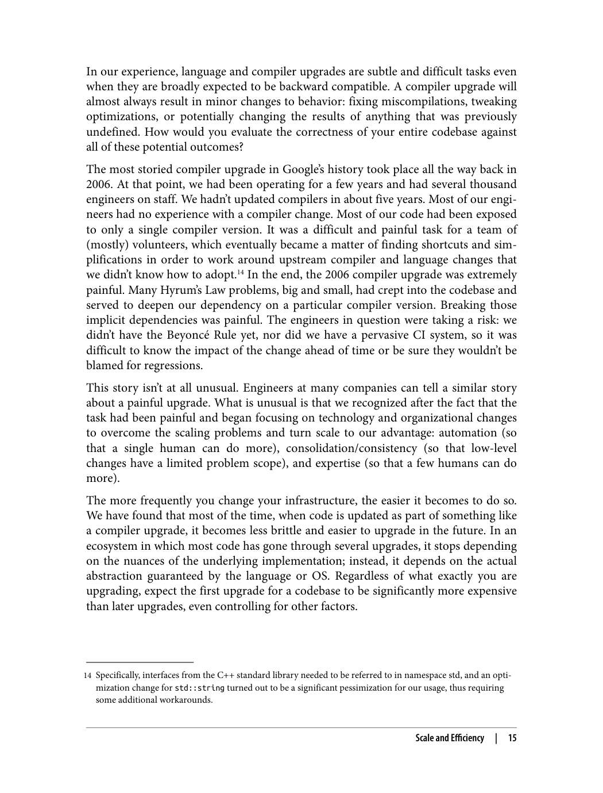

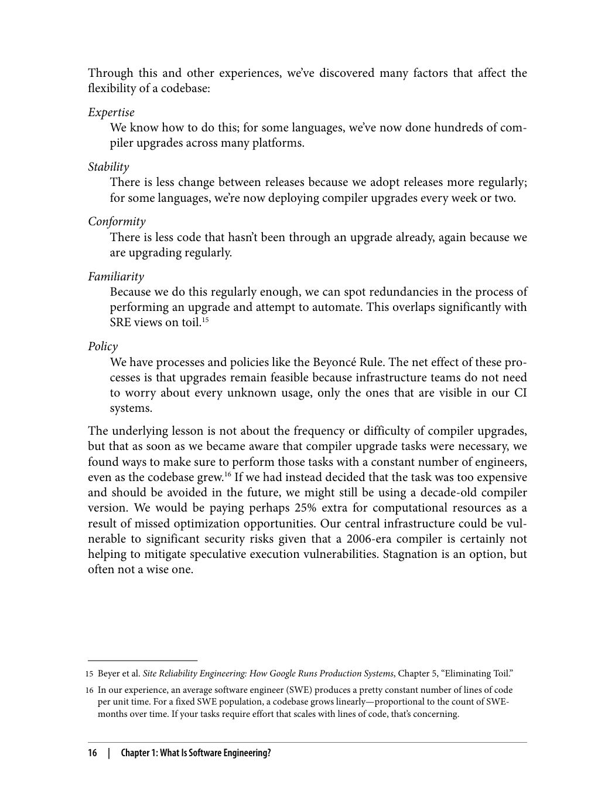

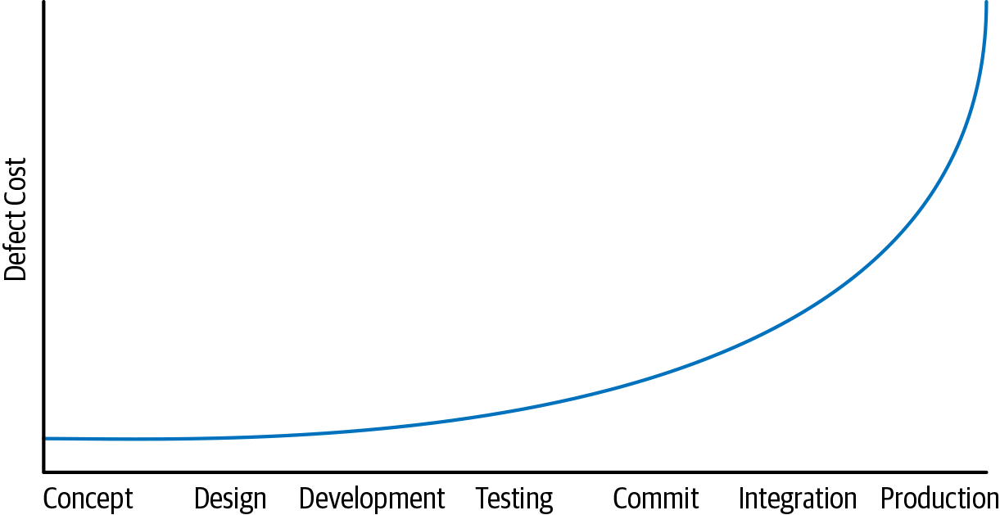

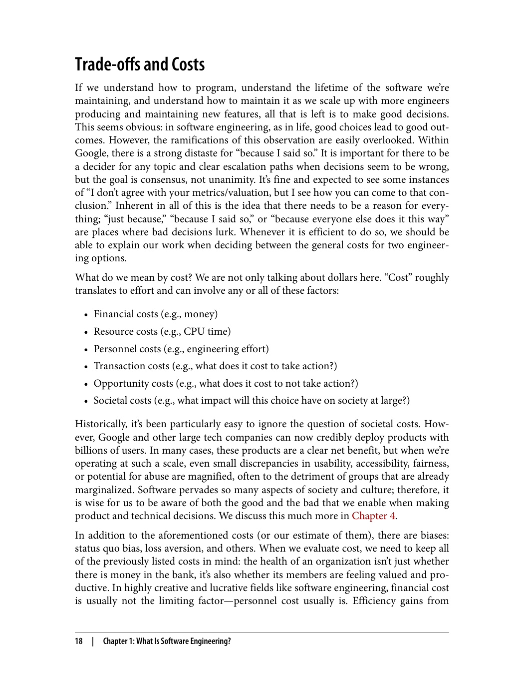

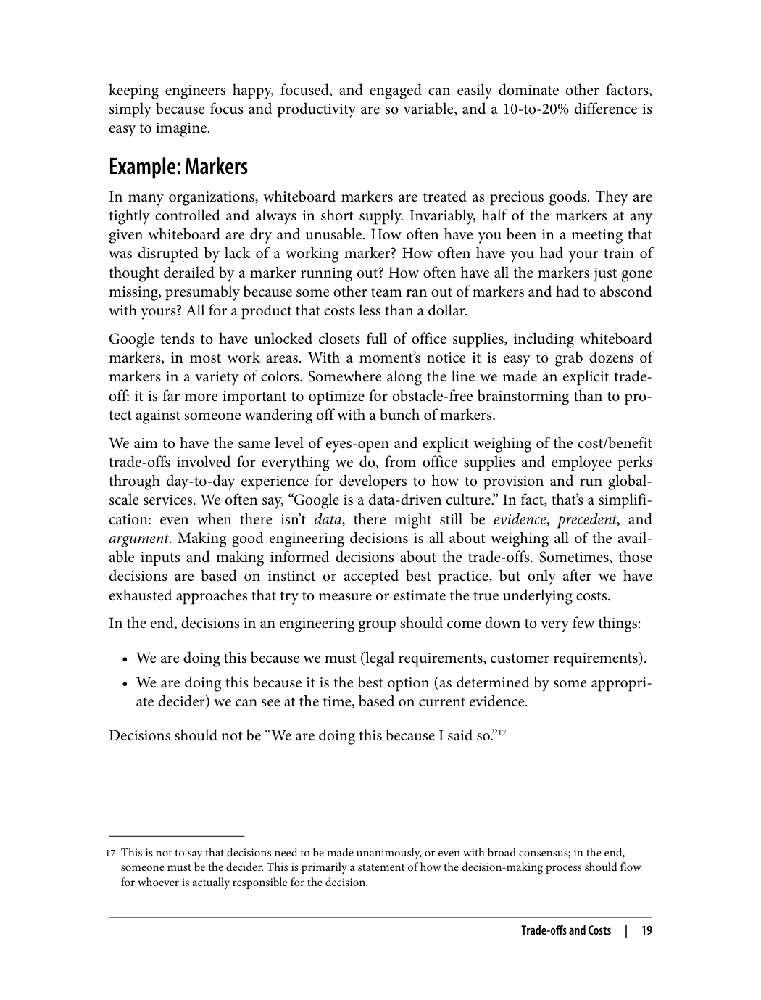

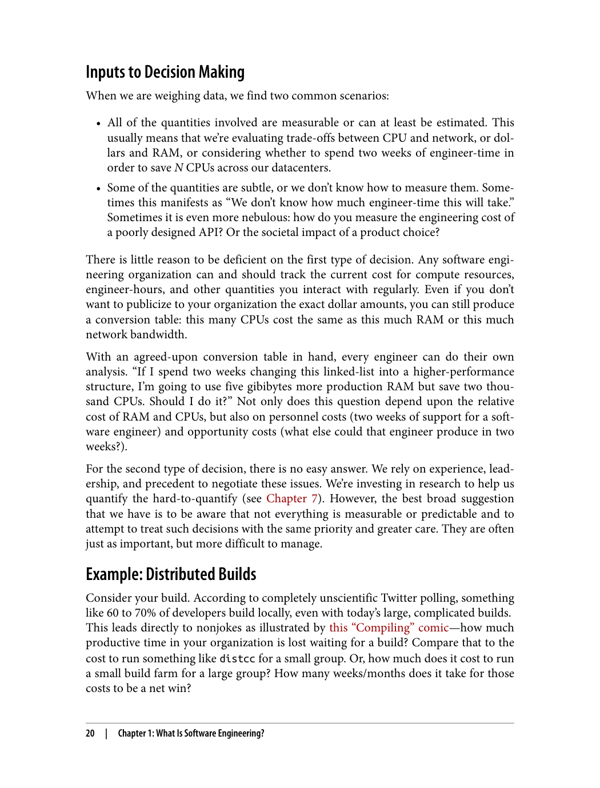

---

###### 📄 صفحه ۴۹

> Example: Deciding Between Time and Scale
> Much of the time, our major themes of time and scale overlap and work in conjunc‐
> tion. A policy like the Beyoncé Rule scales well and helps us maintain things over
> time. A change to an OS interface might require many small refactorings to adapt to,
> but most of those changes will scale well because they are of a similar form: the OS
> change doesn't manifest differently for every caller and every project.
> Occasionally time and scale come into conflict, and nowhere so clearly as in the basic
> question: should we add a dependency or fork/reimplement it to better suit our local
> needs?
> This question can arise at many levels of the software stack because it is regularly the
> case that a bespoke solution customized for your narrow problem space may outper‐
> form the general utility solution that needs to handle all possibilities. By forking or
> reimplementing utility code and customizing it for your narrow domain, you can add
> new features with greater ease, or optimize with greater certainty, regardless of
> whether we are talking about a microservice, an in-memory cache, a compression
> routine, or anything else in our software ecosystem. Perhaps more important, the
> control you gain from such a fork isolates you from changes in your underlying
> dependencies: those changes aren't dictated by another team or third-party provider.
> You are in control of how and when to react to the passage of time and necessity to
> change.
> On the other hand, if every developer forks everything used in their software project
> instead of reusing what exists, scalability suffers alongside sustainability. Reacting to a
> security issue in an underlying library is no longer a matter of updating a single
> dependency and its users: it is now a matter of identifying every vulnerable fork of
> that dependency and the users of those forks.
> As with most software engineering decisions, there isn't a one-size-fits-all answer to
> this situation. If your project life span is short, forks are less risky. If the fork in ques‐
> tion is provably limited in scope, that helps, as well—avoid forks for interfaces that
> could operate across time or project-time boundaries (data structures, serialization
> formats, networking protocols). Consistency has great value, but generality comes
> with its own costs, and you can often win by doing your own thing—if you do it
> carefully.
> Revisiting Decisions, Making Mistakes
> One of the unsung benefits of committing to a data-driven culture is the combined
> ability and necessity of admitting to mistakes. A decision will be made at some point,
> based on the available data—hopefully based on good data and only a few assump‐
> tions, but implicitly based on currently available data. As new data comes in, contexts
> change, or assumptions are dispelled, it might become clear that a decision was in
> 22
> |
> Chapter 1: What Is Software Engineering?

**مثال: تصمیم‌گیری بین زمان و مقیاس**

در بیشتر مواقع، موضوعات اصلی ما زمان و مقیاس همپوشانی دارند و با هم کار می‌کنند. سیاستی مانند قانون بیانسه به‌خوبی مقیاس‌پذیر است و به ما کمک می‌کند چیزها را در طول زمان حفظ کنیم. تغییر در یک رابط سیستم‌عامل (OS Interface) ممکن است نیازمند بازآفرینی‌های کوچک زیادی برای سازگاری باشد، اما بیشتر آن تغییرات به‌خوبی مقیاس‌پذیر هستند زیرا فرم مشابهی دارند: تغییر OS برای هر فراخواننده (Caller) و هر پروژه به شکل متفاوتی ظاهر نمی‌شود.

گاهی اوقات زمان و مقیاس با هم تداخل پیدا می‌کنند، و هیچ‌جا به اندازه سؤال اساسی زیر واضح نیست: آیا باید یک وابستگی (Dependency) اضافه کنیم یا آن را Fork/بازپیاده‌سازی (Reimplement) کنیم تا بهتر با نیازهای محلی ما سازگار شود؟

این سؤال می‌تواند در سطوح مختلفی از پشته نرم‌افزار (Software Stack) رخ دهد، زیرا اغلب این‌طور است که یک راه‌حل سفارشی (Bespoke Solution) سفارشی‌شده برای فضای مسئله محدود شما ممکن است از راه‌حل عمومی که باید همه احتمالات را مدیریت کند، عملکرد بهتری داشته باشد. با Fork کردن یا بازپیاده‌سازی کد عمومی و سفارشی‌سازی آن برای دامنه محدود خود، می‌توانید ویژگی‌های جدید را با سهولت بیشتری اضافه کنید، یا با اطمینان بیشتری بهینه‌سازی کنید، صرف‌نظر از اینکه درباره یک Microservice، یک حافظه داخلی (In-memory Cache)، یک روتین فشرده‌سازی (Compression Routine) یا هر چیز دیگری در اکوسیستم نرم‌افزاری ما صحبت کنیم. شاید مهم‌تر از آن، کنترلی که از چنین Forkی به دست می‌آورید شما را از تغییرات در وابستگی‌های پایه‌تان ایزوله می‌کند: آن تغییرات توسط یک تیم دیگر یا ارائه‌دهنده ثالث دیکته نمی‌شوند. شما کنترل نحوه و زمان واکنش به گذشت زمان و ضرورت تغییر را در دست دارید.

از طرف دیگر، اگر هر توسعه‌دهنده همه چیز مورد استفاده در پروژه نرم‌افزاری خود را به‌جای استفاده مجدد از آنچه وجود دارد Fork کند، مقیاس‌پذیری در کنار پایداری (Sustainability) آسیب می‌بیند. واکنش به یک مشکل امنیتی در یک کتابخانه پایه دیگر فقط به‌روزرسانی یک وابستگی و کاربران آن نیست: اکنون مسئله شناسایی هر Fork آسیب‌پذیر آن وابستگی و کاربران آن Forkها است.

مانند بیشتر تصمیمات مهندسی نرم‌افزار، پاسخ واحدی برای این وضعیت وجود ندارد. اگر عمر پروژه شما کوتاه است، Forkها کمتر ریسک‌دار هستند. اگر Fork مورد بحث به‌طور قابل اثبات محدود به دامنه باشد، این هم کمک می‌کند—از Fork کردن رابط‌هایی که می‌توانند از مرزهای زمان یا پروژه-زمان عبور کنند (ساختارهای داده، فرمت‌های Serialization، پروتکل‌های شبکه) اجتناب کنید. سازگاری (Consistency) ارزش زیادی دارد، اما عمومی بودن (Generality) هزینه‌های خاص خود را دارد، و اغلب می‌توانید با انجام کار خودتان برنده شوید—اگر آن را با دقت انجام دهید.

**بازبینی تصمیمات، اشتباه کردن**

یکی از مزایای ناشناخته تعهد به یک فرهنگ داده‌محور (Data-driven Culture)، توانایی و ضرورت ترکیبی اعتراف به اشتباهات است. یک تصمیم در نقطه‌ای بر اساس داده‌های موجود گرفته خواهد شد—امیدواریم بر اساس داده‌های خوب و فقط چند فرض، اما به‌طور ضمنی بر اساس داده‌های فعلی موجود. با ورود داده‌های جدید، زمینه‌ها تغییر می‌کنند، یا فرض‌ها رد می‌شوند، ممکن است واضح شود که یک تصمیم

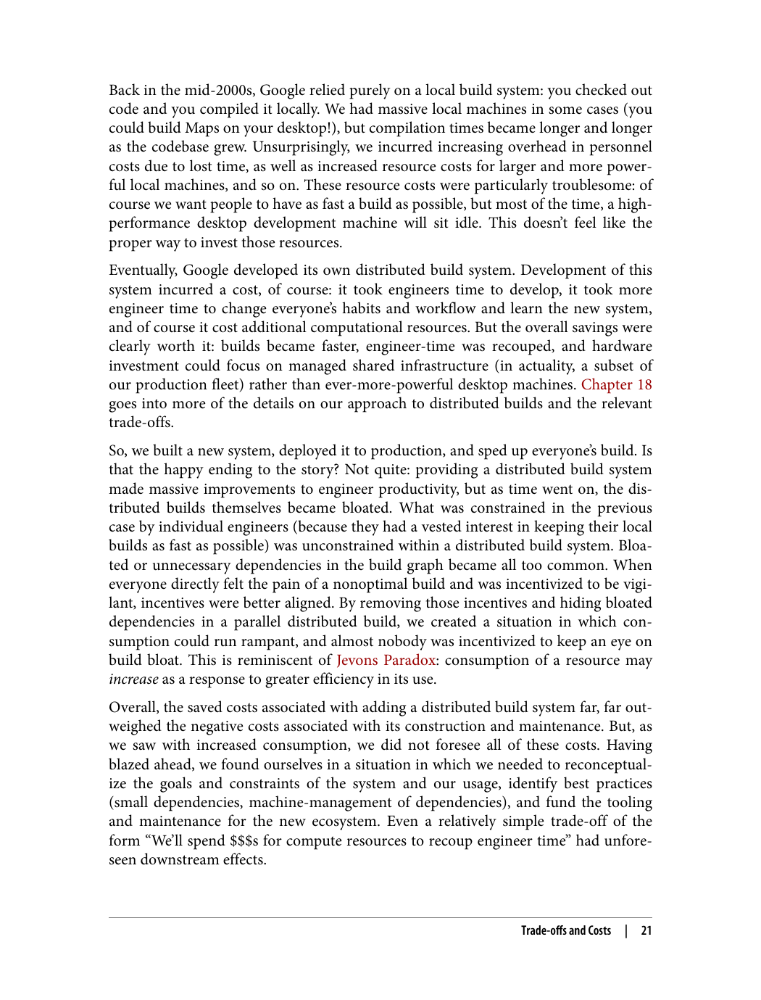

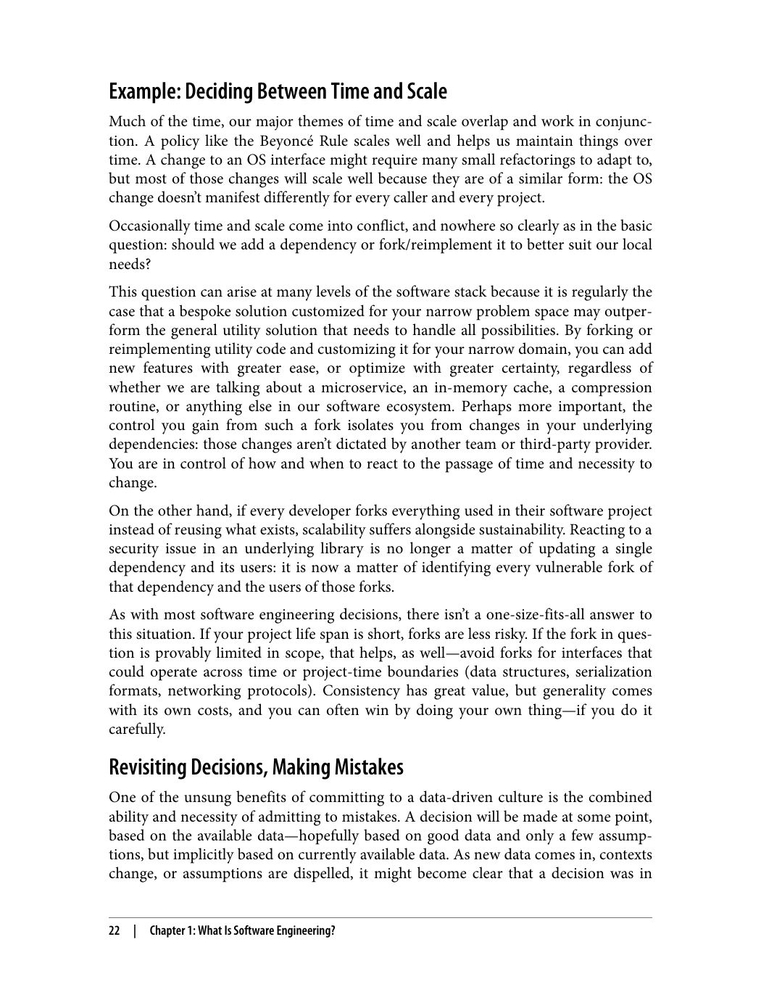

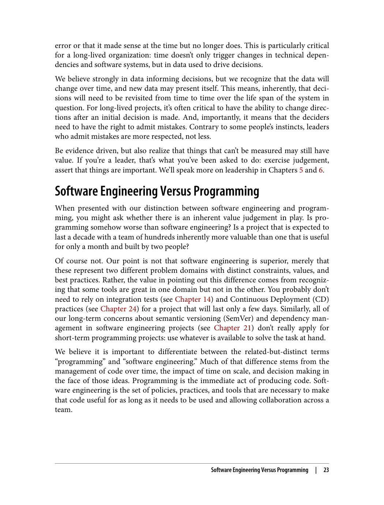

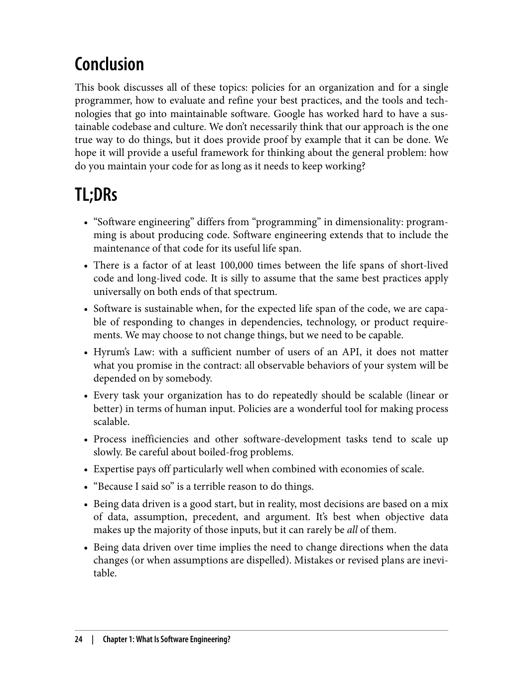

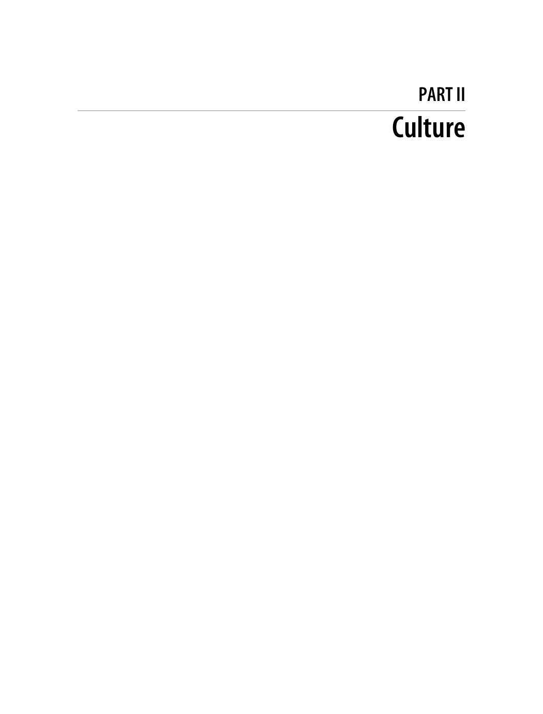

---

###### 📄 صفحه ۵۵

> Hosting service, and at first, we used to get lots of questions and requests about the
> product. But around mid-2008, we began to notice a trend in the sort of requests we
> were getting:
> "Can you please give Subversion on Google Code the ability to hide specific branches?"
> "Can you make it possible to create open source projects that start out hidden to the
> world and then are revealed when they're ready?"
> "Hi, I want to rewrite all my code from scratch, can you please wipe all the history?"
> Can you spot a common theme to these requests?
> The answer is insecurity. People are afraid of others seeing and judging their work in
> progress. In one sense, insecurity is just a part of human nature—nobody likes to be
> criticized, especially for things that aren't finished. Recognizing this theme tipped us
> off to a more general trend within software development: insecurity is actually a
> symptom of a larger problem.
> The Genius Myth
> Many humans have the instinct to find and worship idols.  For software engineers,
> those might be Linus Torvalds, Guido Van Rossum, Bill Gates—all heroes who
> changed the world with heroic feats. Linus wrote Linux by himself, right?
> Actually, what Linus did was write just the beginnings of a proof-of-concept Unix-
> like kernel and show it to an email list. That was no small accomplishment, and it was
> definitely an impressive achievement, but it was just the tip of the iceberg. Linux is
> hundreds of times bigger than that initial kernel and was developed by thousands of
> smart people. Linus' real achievement was to lead these people and coordinate their
> work; Linux is the shining result not of his original idea, but of the collective labor  of
> the community. (And Unix itself was not entirely written by Ken Thompson and
> Dennis Ritchie, but by a group of smart people at Bell Labs.)
> On that same note, did Guido Van Rossum personally write all of Python? Certainly,
> he wrote the first version. But hundreds of others were responsible for contributing
> to subsequent versions, including ideas, features, and bug fixes. Steve Jobs led an
> entire team that built the Macintosh, and although Bill Gates is known for writing a
> BASIC interpreter for early home computers, his bigger achievement was building a
> successful company around MS-DOS. Yet they all became leaders and symbols of the
> collective achievements of their communities. The Genius Myth is the tendency that
> we as humans need to ascribe the success of a team to a single person/leader.
> And what about Michael Jordan?
> It's the same story. We idolized him, but the fact is that he didn't win every basketball
> game by himself. His true genius was in the way he worked with his team. The team's
> coach, Phil Jackson, was extremely clever, and his coaching techniques are legendary.
> 28
> |
> Chapter 2: How to Work Well on Teams

سرویس میزبانی (Hosting Service) بود، و در ابتدا، ما سؤالات و درخواست‌های زیادی در مورد محصول دریافت می‌کردیم. اما حدود اواسط ۲۰۰۸، شروع به مشاهده روندی در نوع درخواست‌هایی که دریافت می‌کردیم کردیم:

"آیا می‌توانید به Subversion در Google Code امکان پنهان کردن شاخه‌های خاص را بدهید؟"
"آیا می‌توانید امکان ایجاد پروژه‌های متن‌باز (Open Source) را فراهم کنید که ابتدا برای جهان پنهان باشند و سپس وقتی آماده شدند فاش شوند؟"
"سلام، من می‌خواهم تمام کدم را از صفر بازنویسی کنم، آیا می‌توانید تمام تاریخچه را پاک کنید؟"

آیا می‌توانید یک موضوع مشترک در این درخواست‌ها پیدا کنید؟

پاسخ عدم اعتماد به نفس (Insecurity) است. مردم از دیده شدن و قضاوت شدن کار در حال انجامشان توسط دیگران می‌ترسند. از یک نظر، عدم اعتماد به نفس فقط بخشی از طبیعت انسان است—هیچ‌کس دوست ندارد مورد انتقاد قرار گیرد، به‌ویژه برای چیزهایی که تمام نشده‌اند. شناختن این موضوع ما را به یک روند عمومی‌تر در توسعه نرم‌افزار رساند: عدم اعتماد به نفس در واقع نشانه یک مشکل بزرگ‌تر است.

**اسطوره نابغه (The Genius Myth)**

بسیاری از انسان‌ها غریزه پیدا کردن و پرستش بت‌ها را دارند. برای مهندسان نرم‌افزار، آن‌ها ممکن است Linus Torvalds، Guido Van Rossum، Bill Gates باشند—همه قهرمانانی که با شاهکارهای قهرمانانه جهان را تغییر دادند. Linus خودش Linux را نوشت، درست؟

در واقع، کاری که Linus کرد فقط نوشتن ابتدای یک Proof-of-concept شبه-یونیکس (Unix-like Kernel) و نشان دادن آن به یک لیست ایمیل بود. این دستاورد کوچکی نبود، و قطعاً یک دستیاری چشمگیر بود، اما فقط نوک کوه یخ بود. Linux صدها برابر بزرگ‌تر از آن هسته اولیه است و توسط هزاران نفر باهوش توسعه یافته است. دستیاری واقعی Linus رهبری این افراد و هماهنگ‌سازی کار آن‌ها بود؛ Linux نتیجه درخشان نه ایده اصلی او، بلکه کار جمعی جامعه است. (و خود Unix توسط Ken Thompson و Dennis Ritchie به‌طور کامل نوشته نشده، بلکه توسط گروهی از افراد باهوش در Bell Labs نوشته شده است.)

در همین راستا، آیا Guido Van Rossum شخصاً تمام Python را نوشت؟ مطمئناً، او نسخه اول را نوشت. اما صدها نفر دیگر مسئول مشارکت در نسخه‌های بعدی بودند، از جمله ایده‌ها، ویژگی‌ها و رفع باگ‌ها. Steve Jobs تیمی را رهبری کرد که Macintosh را ساخت، و اگرچه Bill Gates به نوشتن یک مفسر BASIC برای کامپیوترهای خانگی اولیه شناخته شده، دستیاری بزرگتر او ساختن یک شرکت موفق حول MS-DOS بود. با این حال، آن‌ها همه رهبران و نمادهای دستیاری‌های جمعی جامعه خود شدند. اسطوره نابغه تمایلی است که ما به‌عنوان انسان نیاز داریم موفقیت یک تیم را به یک نفر/رهبر نسبت دهیم.

و مایکل جردن چطور؟

داستان مشابهی است. ما او را ستایش می‌کردیم، اما واقعیت این است که او هر بازی بسکتبال را به‌تنهایی برنده نشد. نابغه واقعی او در نحوه کار با تیمش بود. مربی تیم، Phil Jackson، بسیار باهوش بود و تکنیک‌های مربیگری او افسانه‌ای است.

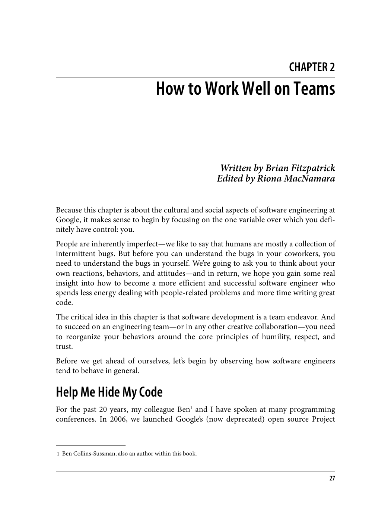

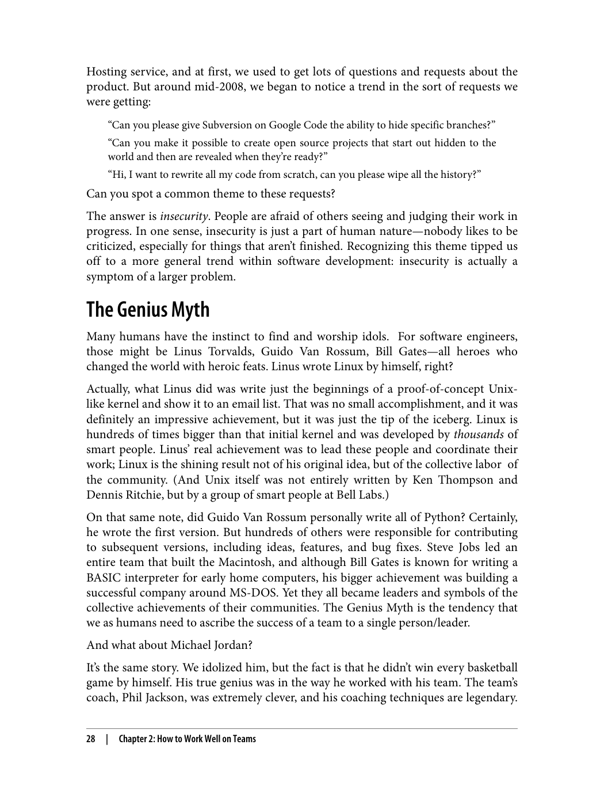

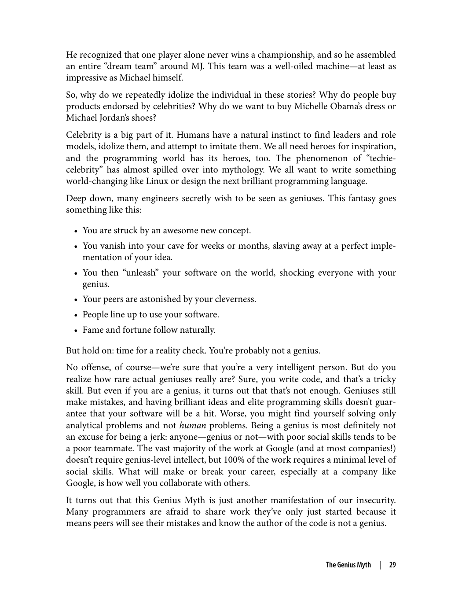

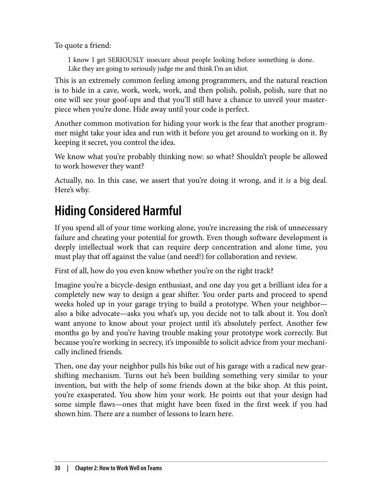

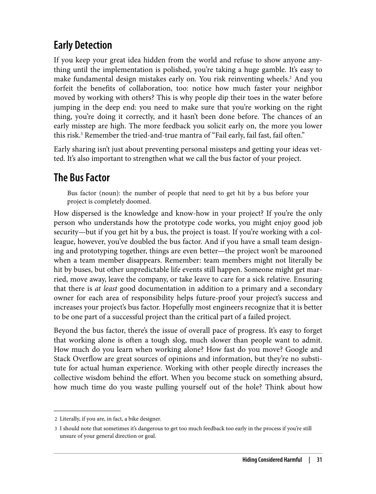

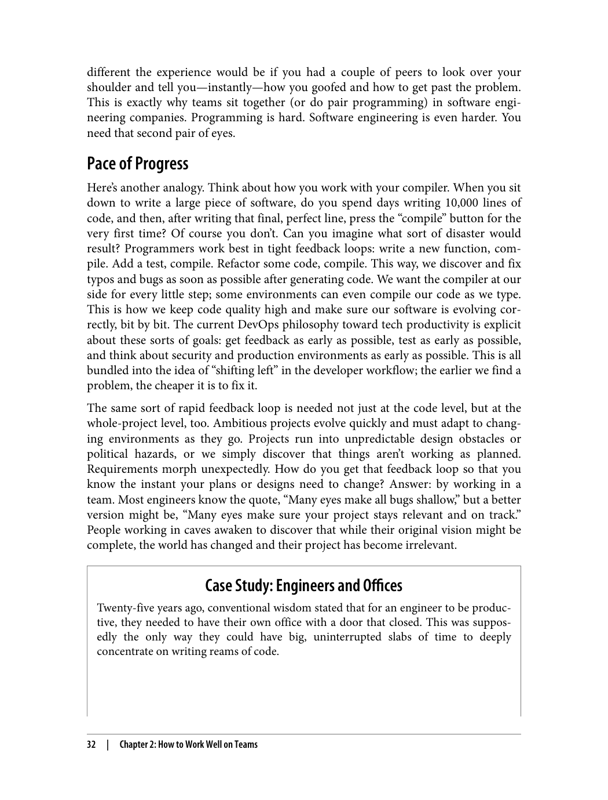

---
