> **راهنمای مطالعه**
>
> در هر بخش، ابتدا متن اصلی کتاب به زبان انگلیسی آورده شده و سپس ترجمه و توضیحات فارسی همان بخش ارائه شده است.

---
-

###### 📄 صفحه ۴۳۹
> 1 Centralized "global" reviewers for large-scale changes (LSCs) are particularly prone to customizing this dash‐
> board to avoid flooding it during an LSC (see Chapter 22).
> expression–based queries. Each dashboard section is defined by a query to Changelist
> Search. We have spent time ensuring Changelist Search is fast enough for interactive
> use; everything is indexed quickly so that authors and reviewers are not slowed down,
> despite the fact that we have an extremely large number of concurrent changes hap‐
> pening simultaneously at Google.
> To optimize the user experience (UX), Critique's default dashboard setting is to have
> the first section display the changes that need a user's attention, although this is cus‐
> tomizable. There is also a search bar for making custom queries over all changes and
> browsing the results. As a reviewer, you mostly just need the attention set. As an
> author, you mostly just need to take a look at what is still waiting for review to see if
> you need to ping any changes. Although we have shied away from customizability in
> some other parts of the Critique UI, we found that users like to set up their dash‐
> boards differently without detracting from the fundamental experience, similar to the
> way everyone organizes their emails differently.1
> Stage 5: Change Approvals (Scoring a Change)
> Showing whether a reviewer thinks a change is good boils down to providing con‐
> cerns and suggestions via comments. There also needs to be some mechanism for
> providing a high-level "OK" on a change. At Google, the scoring for a change is divi‐
> ded into three parts:
> • LGTM ("looks good to me")
> • Approval
> • The number of unresolved comments
> An LGTM stamp from a reviewer means that "I have reviewed this change, believe
> that it meets our standards, and I think it is okay to commit it after addressing unre‐
> solved comments." An Approval stamp from a reviewer means that "as a gatekeeper, I
> allow this change to be committed to the codebase." A reviewer can mark comments
> as unresolved, meaning that the author will need to act upon them. When the change
> has at least one LGTM, sufficient approvals and no unresolved comments, the author
> can then commit the change. Note that every change requires an LGTM regardless of
> approval status, ensuring that at least two pairs of eyes viewed the change. This sim‐
> ple scoring rule allows Critique to inform the author when a change is ready to com‐
> mit (shown prominently as a green page header).
> 412
> |
> Chapter 19: Critique: Google's Code Review Tool

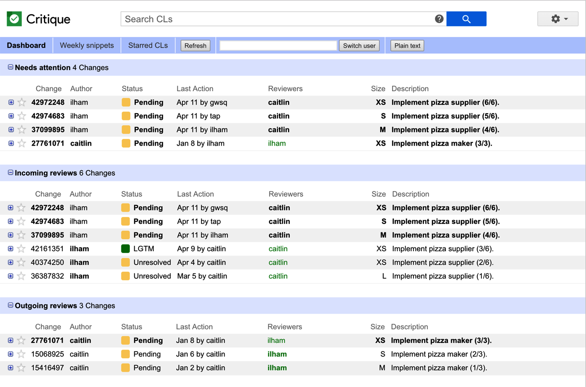

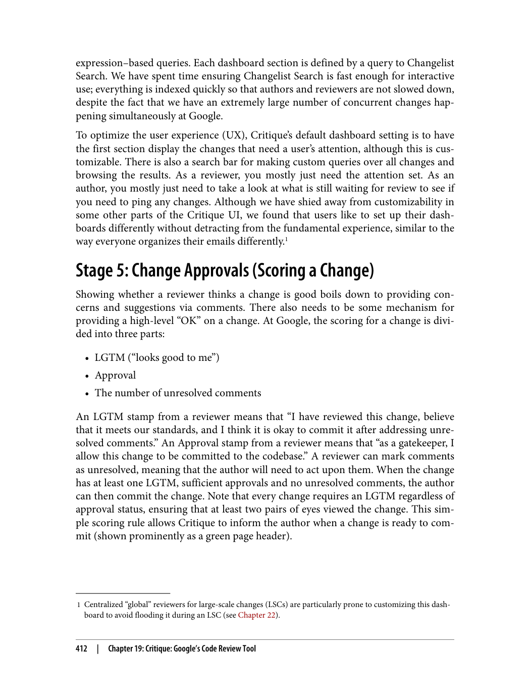

---

###### 📄 صفحه ۴۴۱
> After Commit: Tracking History
> In addition to the core use of Critique as a tool for reviewing source code changes
> before they are committed to the repository, Critique is also used as a tool for change
> archaeology. For most files, developers can view a list of the past history of changes
> that modified a particular file in the Code Search system (see Chapter 17), or navigate
> directly to a change. Anyone at Google can browse the history of a change to gener‐
> ally viewable files, including the comments on and evolution of the change. This ena‐
> bles future auditing and is used to understand more details about why changes were
> made or how bugs were introduced. Developers can also use this feature to learn how
> changes were engineered, and code review data in aggregate is used to produce
> trainings.
> Critique also supports the ability to comment after a change is committed; for exam‐
> ple, when a problem is discovered later or additional context might be useful for
> someone investigating the change at another time. Critique also supports the ability
> to roll back changes and see whether a particular change has already been rolled back.
> Case Study: Gerrit
> Although Critique is the most commonly used review tool at Google, it is not the only
> one. Critique is not externally available due to its tight interdependencies with our
> large monolithic repository and other internal tools. Because of this, teams at Google
> that work on open source projects (including Chrome and Android) or internal
> projects that can't or don't want to be hosted in the monolithic repository use a differ‐
> ent code review tool: Gerrit.
> Gerrit is a standalone, open source code review tool that is tightly integrated with the
> Git version control system. As such, it offers a web UI to many Git features including
> code browsing, merging branches, cherry-picking commits, and, of course, code
> review. In addition, Gerrit has a fine-grained permission model that we can use to
> restrict access to repositories and branches.
> Both Critique and Gerrit have the same model for code reviews in that each commit
> is reviewed separately. Gerrit supports stacking commits and uploading them for
> individual review. It also allows the chain to be committed atomically after it's
> reviewed.
> Being open source, Gerrit accommodates more variants and a wider range of use
> cases; Gerrit's rich plug-in system enables a tight integration into custom environ‐
> ments. To support these use cases, Gerrit also supports a more sophisticated scoring
> system. A reviewer can veto a change by placing a –2 score, and the scoring system is
> highly configurable.
> 414
> |
> Chapter 19: Critique: Google's Code Review Tool

**پیگیری تاریخچه پس از Commit و مطالعه موردی Gerrit**

علاوه بر استفاده اصلی Critique به عنوان ابزاری برای بررسی تغییرات کد منبع قبل از commit شدن در مخزن، Critique همچنین به عنوان ابزاری برای باستان‌شناسی تغییرات (change archaeology) استفاده می‌شود. برای اکثر فایل‌ها، توسعه‌دهندگان می‌توانند لیستی از تاریخچه تغییرات گذشته که یک فایل خاص را تغییر داده‌اند را در سیستم Code Search (نگاه کنید به فصل ۱۷) مشاهده کنند، یا مستقیماً به یک تغییر ناوبری کنند. هر کسی در گوگل می‌تواند تاریخچه تغییرات فایل‌های عمومی قابل مشاهده را مرور کند، از جمله نظرات و تکامل تغییرات. این امکان ممیزی آینده را فراهم می‌کند و برای درک جزئیات بیشتر در مورد اینکه چرا تغییرات انجام شده‌اند یا چگونه باگ‌ها معرفی شده‌اند استفاده می‌شود. توسعه‌دهندگان همچنین می‌توانند از این ویژگی برای یادگیری نحوه مهندسی تغییرات استفاده کنند، و داده‌های بررسی کد به صورت تجمیعی برای تولید آموزش‌ها استفاده می‌شوند.

Critique همچنین از قابلیت نظر دادن پس از commit شدن یک تغییر پشتیبانی می‌کند؛ برای مثال، زمانی که مشکلی بعداً کشف شود یا زمینه اضافی برای کسی که تغییر را در زمان دیگری بررسی می‌کند مفید باشد. Critique همچنین از قابلیت بازگردانی تغییرات و مشاهده اینکه آیا یک تغییر خاص قبلاً بازگردانی شده یا خیر پشتیبانی می‌کند.

**مطالعه موردی: Gerrit (Case Study: Gerrit)**

اگرچه Critique رایج‌ترین ابزار بررسی در گوگل است، تنها ابزار موجود نیست. Critique به دلیل وابستگی‌های متقاطع قوی با مخزن monolithic بزرگ و سایر ابزارهای داخلی ما، به صورت خارجی در دسترس نیست. به همین دلیل، تیم‌های گوگل که روی پروژه‌های متن‌باز (از جمله Chrome و Android) یا پروژه‌های داخلی کار می‌کنند و نمی‌خواهند یا نمی‌توانند در مخزن monolithic میزبانی شوند، از ابزار بررسی کد متفاوتی استفاده می‌کنند: Gerrit.

Gerrit یک ابزار بررسی کد متن‌باز مستقل است که به طور قوی با سیستم کنترل نسخه Git یکپارچه شده است. به همین ترتیب، یک رابط وب برای بسیاری از ویژگی‌های Git ارائه می‌دهد، از جمله مرور کد، ادغام شاخه‌ها، انتخاب commits (cherry-picking)، و البته بررسی کد. علاوه بر این، Gerrit یک مدل مجوز دقیق دارد که می‌توانیم برای محدود کردن دسترسی به مخازن و شاخه‌ها استفاده کنیم.

هر دو Critique و Gerrit مدل یکسانی برای بررسی کد دارند به این صورت که هر commit به صورت جداگانه بررسی می‌شود. Gerrit از پشته‌سازی commits و آپلود آن‌ها برای بررسی جداگانه پشتیبانی می‌کند. همچنین اجازه می‌دهد زنجیره commits پس از بررسی به صورت اتمیک commit شود.

با بودن متن‌باز، Gerrit تنوع‌ها و طیف گسترده‌تری از موارد استفاده را پوشش می‌دهد؛ سیستم پلاگین غنی Gerrit امکان یکپارچه‌سازی قوی در محیط‌های سفارشی را فراهم می‌کند. برای پشتیبانی از این موارد استفاده، Gerrit همچنین از سیستم امتیازدهی پیشرفته‌تری پشتیبانی می‌کند. یک بررسی‌کننده می‌تواند با قرار دادن امتیاز -2 یک تغییر را وتو کند، و سیستم امتیازدهی بسیار قابل پیکربندی است.

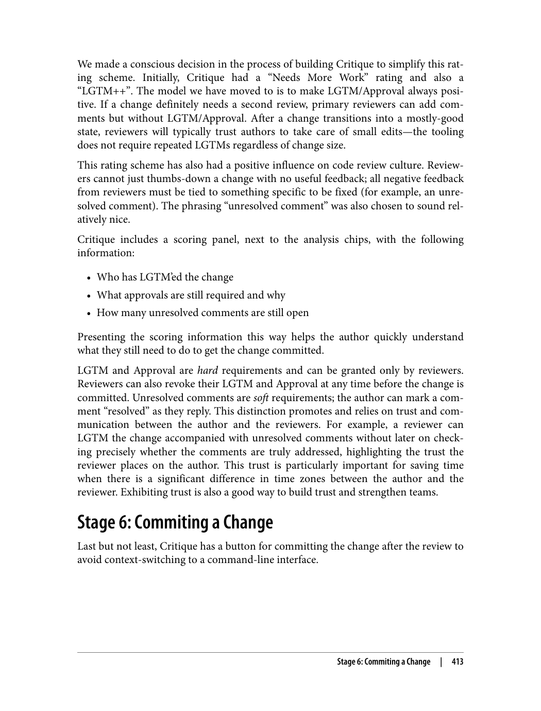

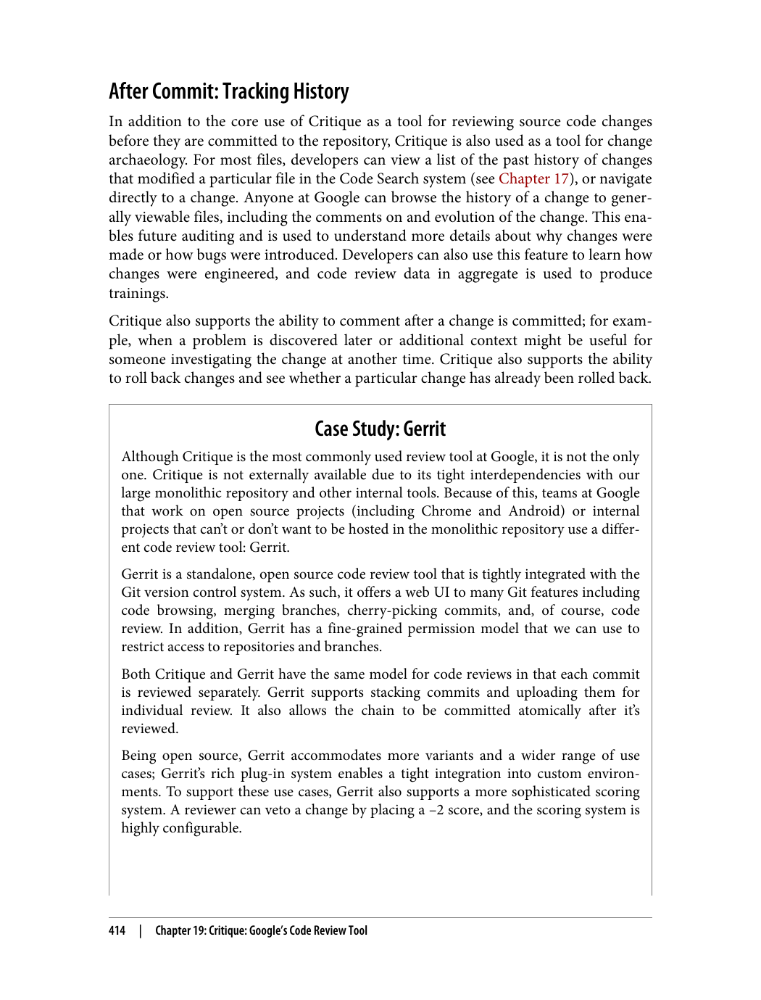

---

###### 📄 صفحه ۴۴۳
> Trust and communication are core to the code review process. A tool can enhance the
> experience, but can't replace them. Tight integration with other tools has also been a
> key factor in Critique's success.
> TL;DRs
> • Trust and communication are core to the code review process. A tool can
> enhance the experience, but it can't replace them.
> • Tight integration with other tools is key to great code review experience.
> • Small workflow optimizations, like the addition of an explicit "attention set," can
> increase clarity and reduce friction substantially.
> 416
> |
> Chapter 19: Critique: Google's Code Review Tool

**نتیجه‌گیری Critique**

اعتماد و ارتباطات هسته فرآیند بررسی کد هستند. یک ابزار می‌تواند تجربه را بهبود بخشد، اما نمی‌تواند جایگزین آن‌ها شود. یکپارچه‌سازی قوی با سایر ابزارها نیز عامل کلیدی در موفقیت Critique بوده است.

**خلاصه‌ها (TL;DRs)**

• اعتماد و ارتباطات هسته فرآیند بررسی کد هستند. یک ابزار می‌تواند تجربه را بهبود بخشد، اما نمی‌تواند جایگزین آن‌ها شود.
• یکپارچه‌سازی قوی با سایر ابزارها کلید تجربه عالی بررسی کد است.
• بهینه‌سازی‌های کوچک گردش کار، مانند اضافه کردن یک «مجموعه توجه» (attention set) صریح، می‌تواند وضوح را به طور قابل توجهی افزایش دهد و اصطکاک را کاهش دهد.

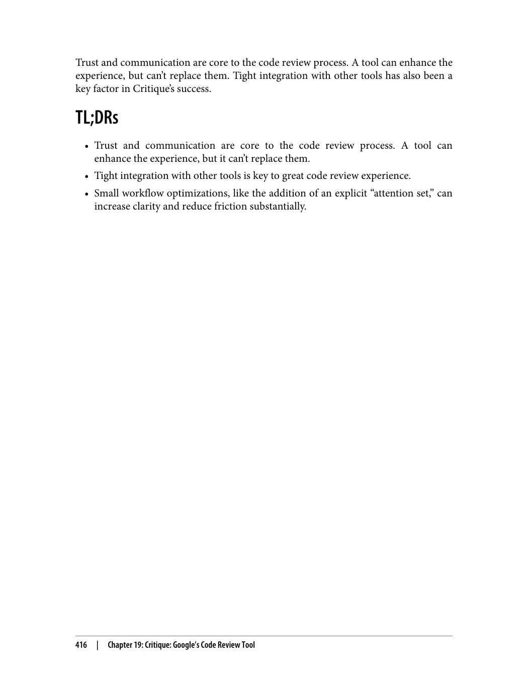

---

###### 📄 صفحه ۴۴۵
> 3 A good academic reference for static analysis theory is: Flemming Nielson et al. Principles of Program Analysis
> (Gernamy: Springer, 2004).
> In this chapter, we'll look at what makes effective static analysis, some of the lessons
> we at Google have learned about making static analysis work, and how we imple‐
> mented these best practices in our static analysis tooling and processes.3
> Characteristics of Effective Static Analysis
> Although there have been decades of static analysis research focused on developing
> new analysis techniques and specific analyses, a focus on approaches for improving
> scalability and usability of static analysis tools has been a relatively recent
> development.
> Scalability
> Because modern software has become larger, analysis tools must explicitly address
> scaling in order to produce results in a timely manner, without slowing down the
> software development process. Static analysis tools at Google must scale to the size of
> Google's multibillion-line codebase. To do this, analysis tools are shardable and incre‐
> mental. Instead of analyzing entire large projects, we focus analyses on files affected
> by a pending code change, and typically show analysis results only for edited files or
> lines. Scaling also has benefits: because our codebase is so large, there is a lot of low-
> hanging fruit in terms of bugs to find. In addition to making sure analysis tools can
> run on a large codebase, we also must scale up the number and variety of analyses
> available. Analysis contributions are solicited from throughout the company. Another
> component to static analysis scalability is ensuring the process is scalable. To do this,
> Google static analysis infrastructure avoids bottlenecking analysis results by showing
> them directly to relevant engineers.
> Usability
> When thinking about analysis usability, it is important to consider the cost-benefit
> trade-off for static analysis tool users. This "cost" could either be in terms of devel‐
> oper time or code quality. Fixing a static analysis warning could introduce a bug. For
> code that is not being frequently modified, why "fix" code that is running fine in pro‐
> duction? For example, fixing a dead code warning by adding a call to the previously
> dead code could result in untested (possibly buggy) code suddenly running. There is
> unclear benefit and potentially high cost. For this reason, we generally focus on newly
> introduced warnings; existing issues in otherwise working code are typically only
> worth highlighting (and fixing) if they are particularly important (security issues, sig‐
> nificant bug fixes, etc.). Focusing on newly introduced warnings (or warnings on
> 418
> |
> Chapter 20: Static Analysis

**موثر بودن تحلیل ایستا (Effective Static Analysis)**

در این فصل، بررسی می‌کنیم چه چیزی تحلیل ایستا (static analysis) مؤثر را می‌سازد، برخی از درس‌هایی که ما در گوگل در مورد عملی کردن تحلیل ایستا آموخته‌ایم، و چگونه این بهترین شیوه‌ها را در ابزارها و فرآیندهای تحلیل ایستا خود پیاده‌سازی کرده‌ایم.

**ویژگی‌های تحلیل ایستای مؤثر (Characteristics of Effective Static Analysis)**

اگرچه دهه‌ها تحقیق در مورد تحلیل ایستا بر توسعه تکنیک‌های تحلیل جدید و تحلیل‌های خاص متمرکز بوده، تمرکز بر رویکردهای بهبود مقیاس‌پذیری و قابلیت استفاده ابزارهای تحلیل ایستا نسبتاً اخیراً رخ داده است.

**مقیاس‌پذیری (Scalability)**

از آنجا که نرم‌افزار مدرن بزرگ‌تر شده است، ابزارهای تحلیل باید به طور صریح به مقیاس‌پذیری بپردازند تا نتایج را به موقع و بدون کند کردن فرآیند توسعه نرم‌افزار تولید کنند. ابزارهای تحلیل ایستا در گوگل باید با اندازه پایگاه کد چند میلیارد خطی گوگل مقیاس‌پذیر باشند. برای انجام این کار، ابزارهای تحلیل قابل خرد شدن و تکاملی هستند. به جای تحلیل پروژه‌های بزرگ به طور کامل، تحلیل‌ها را بر فایل‌هایی متمرکز می‌کنیم که تحت تأثیر یک تغییر کد در انتظار قرار دارند، و معمولاً فقط نتایج تحلیل را برای فایل‌ها یا خطوط ویرایش شده نشان می‌دهیم. مقیاس‌پذیری مزایایی هم دارد: از آنجا که پایگاه کد ما بسیار بزرگ است، میوه‌های آویزان زیادی (low-hanging fruit) از نظر باگ‌های قابل کشف وجود دارد. علاوه بر اطمینان از اینکه ابزارهای تحلیل می‌توانند روی پایگاه کد بزرگ اجرا شوند، همچنین باید تعداد و تنوع تحلیل‌های موجود را افزایش دهیم. مشارکت‌های تحلیل از سراسر شرکت درخواست می‌شوند. جزء دیگری از مقیاس‌پذیری تحلیل ایستا اطمینان از مقیاس‌پذیر بودن فرآیند است. برای انجام این کار، زیرساخت تحلیل ایستای گوگل از ایجاد bottleneck برای نتایج تحلیل با نمایش مستقیم آن‌ها به مهندسان مرتبط اجتناب می‌کند.

**قابلیت استفاده (Usability)**

هنگام فکر کردن در مورد قابلیت استفاده تحلیل، مهم است که trade-off هزینه-فایده برای کاربران ابزار تحلیل ایستا را در نظر بگیریم. این «هزینه» می‌تواند از نظر زمان توسعه‌دهنده یا کیفیت کد باشد. رفع یک هشدار تحلیل ایستا می‌تواند یک باگ معرفی کند. برای کدی که اغلب تغییر نمی‌کند، چرا کدی را که در production به خوبی کار می‌کند «اصلاح» کنیم؟ برای مثال، رفع یک هشدار dead code با اضافه کردن فراخوانی به کد قبلاً مرده می‌تواند منجر به اجرای ناگهانی کد آزمایش نشده (احتمالاً دارای باگ) شود. فایده نامشخص و هزینه بالقوه بالایی وجود دارد. به همین دلیل، ما معمولاً بر هشدارهای جدیداً معرفی شده تمرکز می‌کنیم؛ مشکلات موجود در کدی که در غیر این صورت کار می‌کند معمولاً فقط ارزش برجسته کردن (و رفع کردن) را دارند اگر به ویژه مهم باشند (مسائل امنیتی، رفع باگ‌های مهم و غیره).

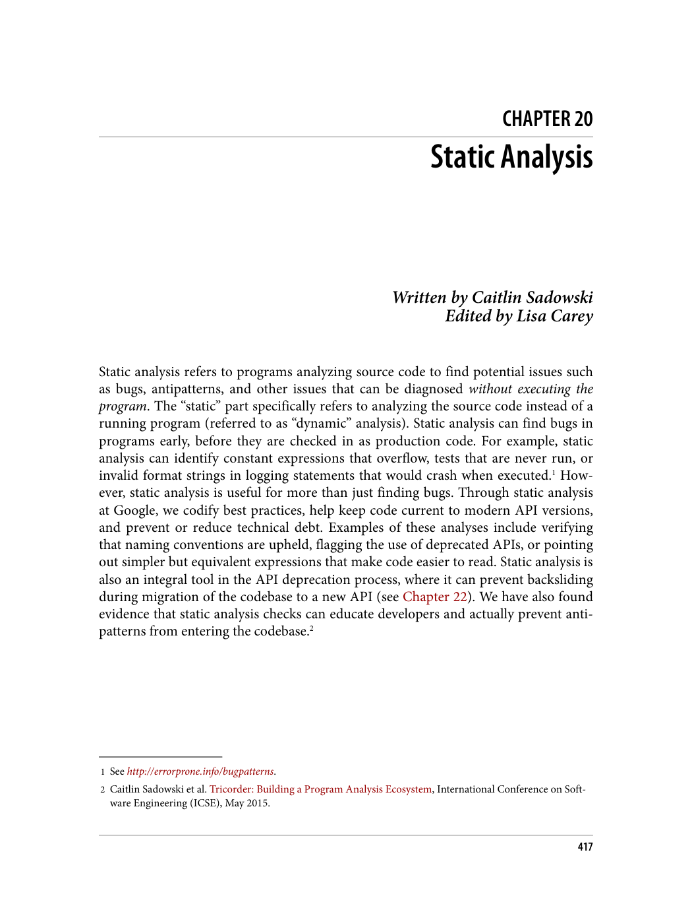

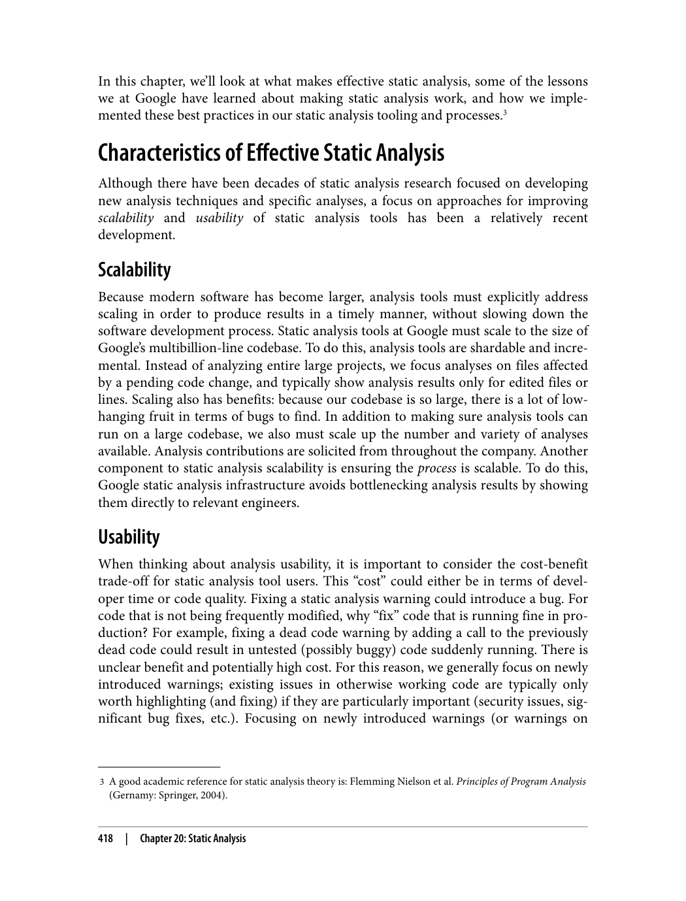

---

###### 📄 صفحه ۴۴۷
> 4 Note that there are some specific analyses for which reviewers might be willing to tolerate a much higher
> false-positive rate: one example is security analyses that identify critical problems.
> 5 See later in this chapter for more information on additional integration points when editing and browsing
> code.
> rates are often critical for developers to actually want to use a tool—who wants to
> wade through hundreds of false reports in search of a few true ones?4
> Furthermore, perception is a key aspect of the false-positive rate. If a static analysis
> tool is producing warnings that are technically correct but misinterpreted by users as
> false positives (e.g., due to confusing messages), users will react the same as if those
> warnings were in fact false positives. Similarly, warnings that are technically correct
> but unimportant in the grand scheme of things provoke the same reaction. We call
> the user-perceived false-positive rate the "effective false positive" rate. An issue is an
> "effective false positive" if developers did not take some positive action after seeing
> the issue. This means that if an analysis incorrectly reports an issue, yet the developer
> happily makes the fix anyway to improve code readability or maintainability, that is
> not an effective false positive. For example, we have a Java analysis that flags cases in
> which a developer calls the contains method on a hash table (which is equivalent to
> containsValue) when they actually meant to call containsKey—even if the developer
> correctly meant to check for the value, calling containsValue instead is clearer. Simi‐
> larly, if an analysis reports an actual fault, yet the developer did not understand the
> fault and therefore took no action, that is an effective false positive.
> Make Static Analysis a Part of the Core Developer Workflow
> At Google, we integrate static analysis into the core workflow via integration with
> code review tooling. Essentially all code committed at Google is reviewed before
> being committed; because developers are already in a change mindset when they send
> code for review, improvements suggested by static analysis tools can be made without
> too much disruption. There are other benefits to code review integration. Developers
> typically context switch after sending code for review, and are blocked on reviewers—
> there is time for analyses to run, even if they take several minutes to do so. There is
> also peer pressure from reviewers to address static analysis warnings. Furthermore,
> static analysis can save reviewer time by highlighting common issues automatically;
> static analysis tools help the code review process (and the reviewers) scale. Code
> review is a sweet spot for analysis results.5
> Empower Users to Contribute
> There are many domain experts at Google whose knowledge could improve code
> produced. Static analysis is an opportunity to leverage expertise and apply it at scale
> by having domain experts write new analysis tools or individual checks within a tool.
> 420
> |
> Chapter 20: Static Analysis

**نرخ مثبت کاذب مؤثر (Effective False Positive Rate) و یکپارچه‌سازی در گردش کار**

نرخ‌ها اغلب برای توسعه‌دهندگان در واقع خواستن استفاده از یک ابزار حیاتی هستند — چه کسی می‌خواهد در میان صدها گزارش نادرست به دنبال چند گزارش درست بگردد؟

علاوه بر این، ادراک جنبه کلیدی نرخ مثبت کاذب است. اگر یک ابزار تحلیل ایستا هشدارهایی تولید کند که از نظر فنی درست هستند اما توسط کاربران به عنوان مثبت‌های کاذب تفسیر نادرست شوند (مثلاً به دلیل پیام‌های گیج‌کننده)، کاربران واکنشی مشابه زمانی نشان می‌دهند که آن هشدارها واقعاً مثبت کاذب باشند. به همین ترتیب، هشدارهایی که از نظر فنی درست اما در طرح بزرگتر بی‌اهمیت هستند، واکشن مشابهی ایجاد می‌کنند. ما نرخ مثبت کاذب ادراک شده توسط کاربر را «نرخ مثبت کاذب مؤثر» (effective false positive rate) می‌نامیم. یک مشکل «مثبت کاذب مؤثر» است اگر توسعه‌دهندگان پس از دیدن مشکل اقدام مثبتی انجام ندهند. این به این معنی است که اگر تحلیلی به طور نادرست مشکلی را گزارش کند، اما توسعه‌دهنده با کمال میل اصلاح را برای بهبود خوانایی یا نگهداری کد انجام دهد، این مثبت کاذب مؤثر نیست. برای مثال، ما یک تحلیل جاوا داریم که مواردی را پرچم‌گذاری می‌کند که در آن توسعه‌دهنده متد contains را روی hash table فراخوانی می‌کند (که معادل containsValue است) در حالی که در واقع می‌خواسته containsKey را فراخوانی کند — حتی اگر توسعه‌دهنده درست می‌خواسته مقدار را بررسی کند، فراخوانی containsValue به جای آن واضح‌تر است. به همین ترتیب، اگر تحلیلی خطای واقعی را گزارش کند، اما توسعه‌دهنده خطای را درک نکرده و در نتیجه اقدامی نکرده باشد، این مثبت کاذب مؤثر است.

**تبدیل تحلیل ایستا به بخشی از گردش کار اصلی توسعه‌دهنده (Make Static Analysis a Part of the Core Developer Workflow)**

در گوگل، ما تحلیل ایستا را از طریق یکپارچه‌سازی با ابزارهای بررسی کد در گردش کار اصلی ادغام می‌کنیم. تقریباً تمام کدهایی که در گوگل commit می‌شوند قبل از commit شدن بررسی می‌شوند؛ از آنجا که توسعه‌دهندگان در حال حاضر در ذهنیت تغییر هستند وقتی کد را برای بررسی ارسال می‌کنند، بهبودهای پیشنهاد شده توسط ابزارهای تحلیل ایستا می‌توانند بدون اختلال زیاد اعمال شوند. مزایای دیگری برای یکپارچه‌سازی با بررسی کد وجود دارد. توسعه‌دهندگان معمولاً پس از ارسال کد برای بررسی، تغییر زمینه می‌دهند و منتظر بررسی‌کنندگان هستند — زمانی برای اجرای تحلیل‌ها وجود دارد، حتی اگر چندین دقیقه طول بکشد. همچنین فشار همتایان از سوی بررسی‌کنندگان برای رسیدگی به هشدارهای تحلیل ایستا وجود دارد. علاوه بر این، تحلیل ایستا می‌تواند با برجسته کردن خودکار مشکلات رایج، زمان بررسی‌کننده را ذخیره کند؛ ابزارهای تحلیل ایستا به فرآیند بررسی کد (و بررسی‌کنندگان) کمک می‌کنند تا مقیاس‌پذیر باشند. بررسی کد نقطه بهینه‌ای برای نتایج تحلیل است.

**توانمندسازی کاربران برای مشارکت (Empower Users to Contribute)**

کارشناسان حوزه‌ای زیادی در گوگل وجود دارند که دانش آن‌ها می‌تواند کد تولید شده را بهبود بخشد. تحلیل ایستا فرصتی است برای بهره‌برداری از تخصص و اعمال آن در مقیاس با داشتن کارشناسان حوزه‌ای که ابزارهای تحلیل جدید یا بررسی‌های جداگانه در یک ابزار بنویسند.

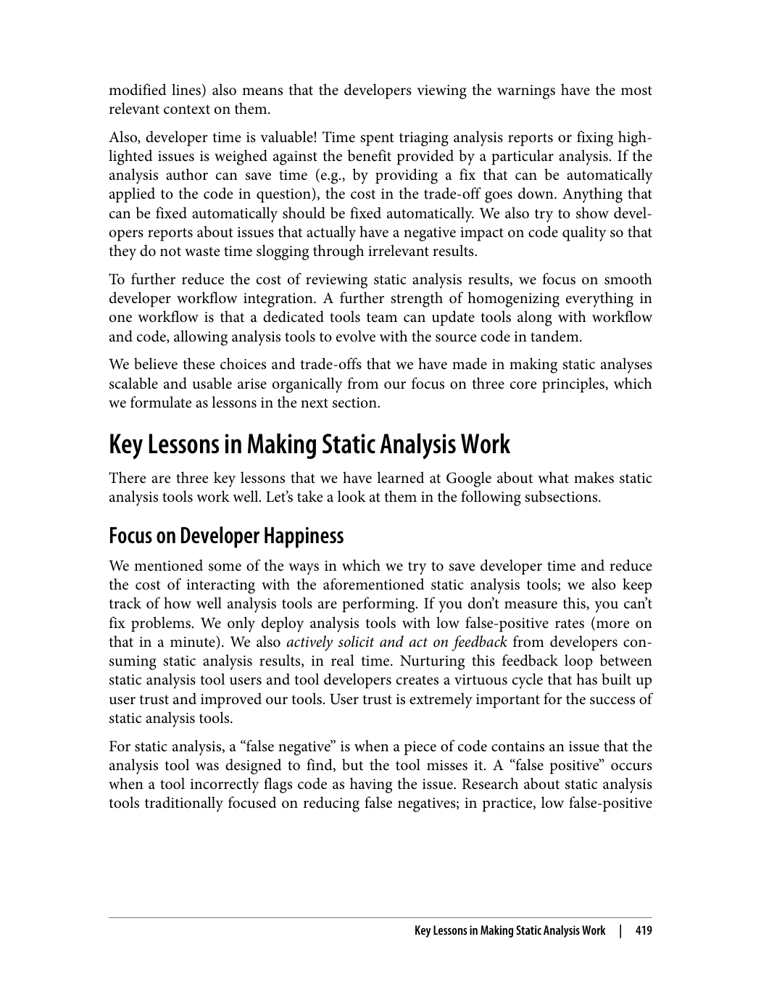

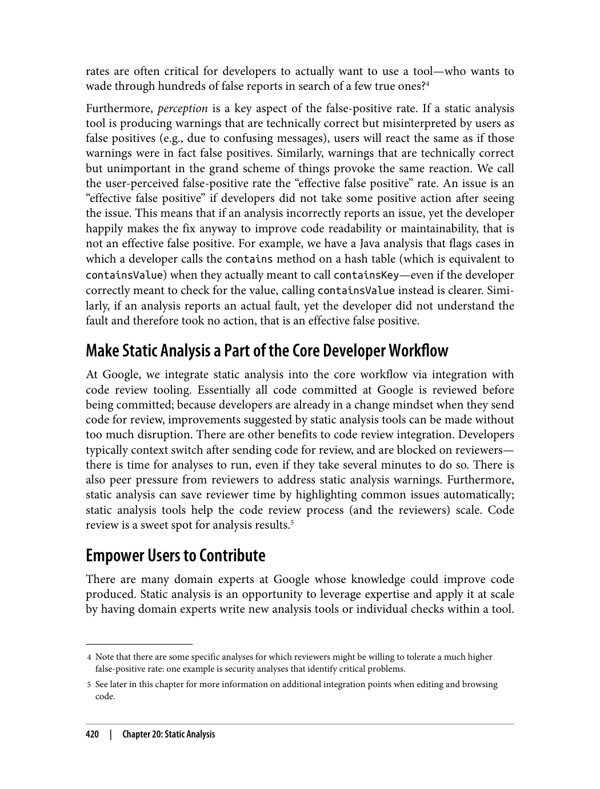

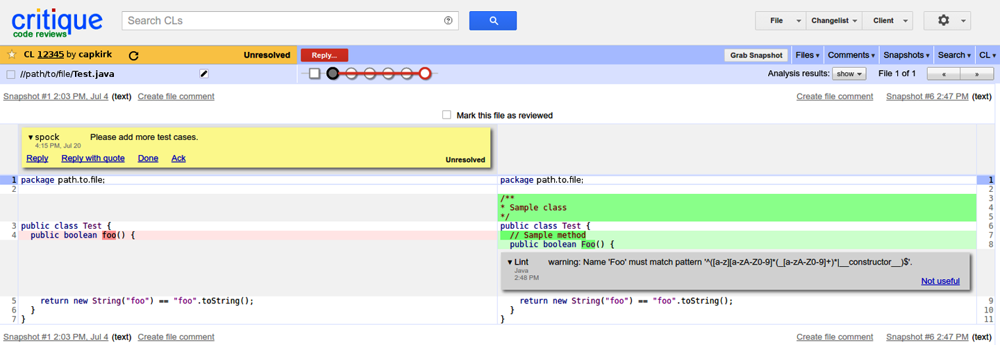

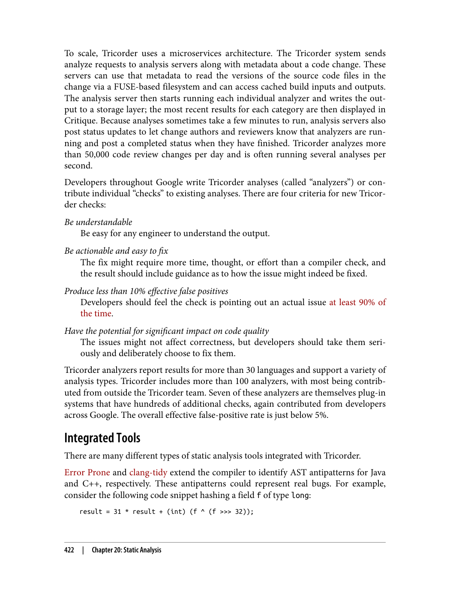

---