> **راهنمای مطالعه**
>
> در هر بخش، ابتدا متن اصلی کتاب به زبان انگلیسی آورده شده و سپس ترجمه و توضیحات فارسی همان بخش ارائه شده است.

---
-

###### 📄 صفحه ۴۵۱
> And sometimes the fix is pretty simple—such as updating the text of the message an
> analyzer outputs! For example, we once rolled out an Error Prone check that flagged
> when too many arguments were being passed to a printf-like function in Guava that
> accepted only %s (and no other printf specifiers). The Error Prone team received
> weekly “Not useful” bug reports claiming the analysis was incorrect because the num‐
> ber of format specifiers matched the number of arguments—all due to users trying to
> pass specifiers other than %s. After the team changed the diagnostic text to state
> directly that the function accepts only the %s placeholder, the influx of bug reports
> stopped. Improving the message produced by an analysis provides an explanation of
> what is wrong, why, and how to fix it exactly at the point where that is most relevant
> and can make the difference for developers learning something when they read the
> message.
> Suggested Fixes
> Tricorder checks also, when possible, provide fixes, as shown in Figure 20-2.
> Figure 20-2. View of an example static analysis fix in Critique
> Automated fixes serve as an additional documentation source when the message is
> unclear and, as mentioned earlier, reduce the cost to addressing static analysis issues.
> Fixes can be applied directly from within Critique, or over an entire code change via a
> command-line tool. Although not all analyzers provide fixes, many do. We take the
> approach that style issues in particular should be fixed automatically; for example, by
> formatters that automatically reformat source code files. Google has style guides for
> each language that specify formatting issues; pointing out formatting errors is not a
> good use of a human reviewer’s time. Reviewers click “Please Fix” thousands of times
> per day, and authors apply the automated fixes approximately 3,000 times per day.
> And Tricorder analyzers received “Not useful” clicks 250 times per day.
> Per-Project Customization
> After we had built up a foundation of user trust by showing only high-confidence
> analysis results, we added the ability to run additional “optional” analyzers to specific
> projects in addition to the on-by-default ones. The Proto Best Practices analyzer is an
> example of an optional analyzer. This analyzer highlights potentially breaking data
> 424
> |
> Chapter 20: Static Analysis

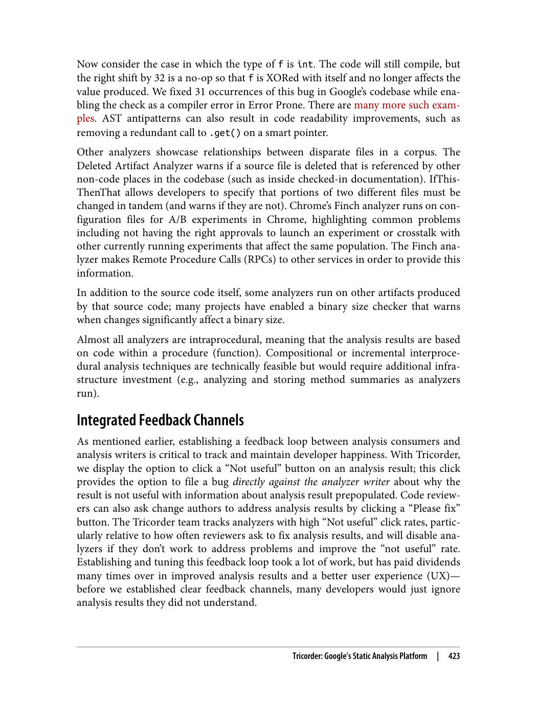

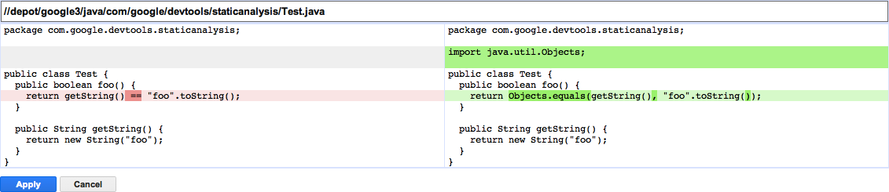

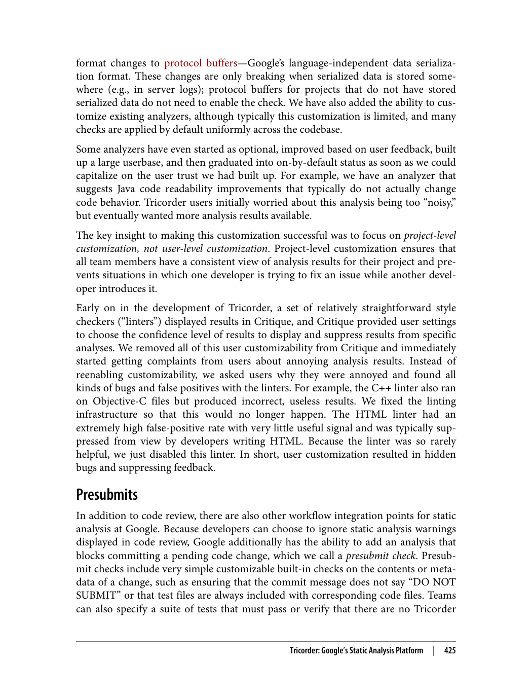

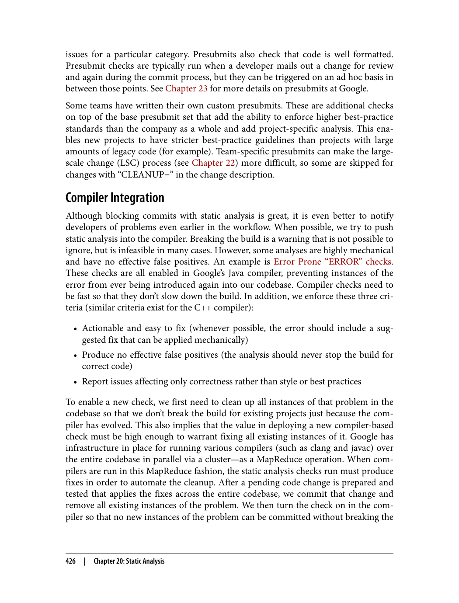

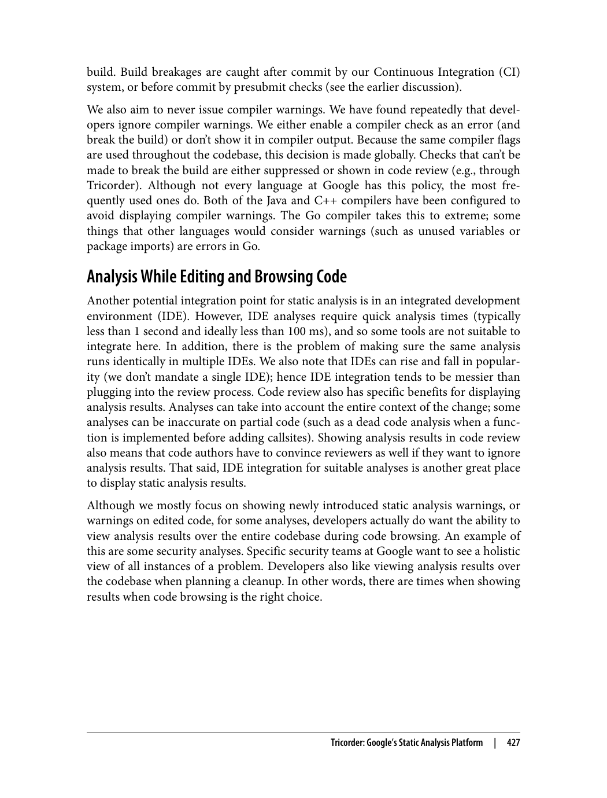

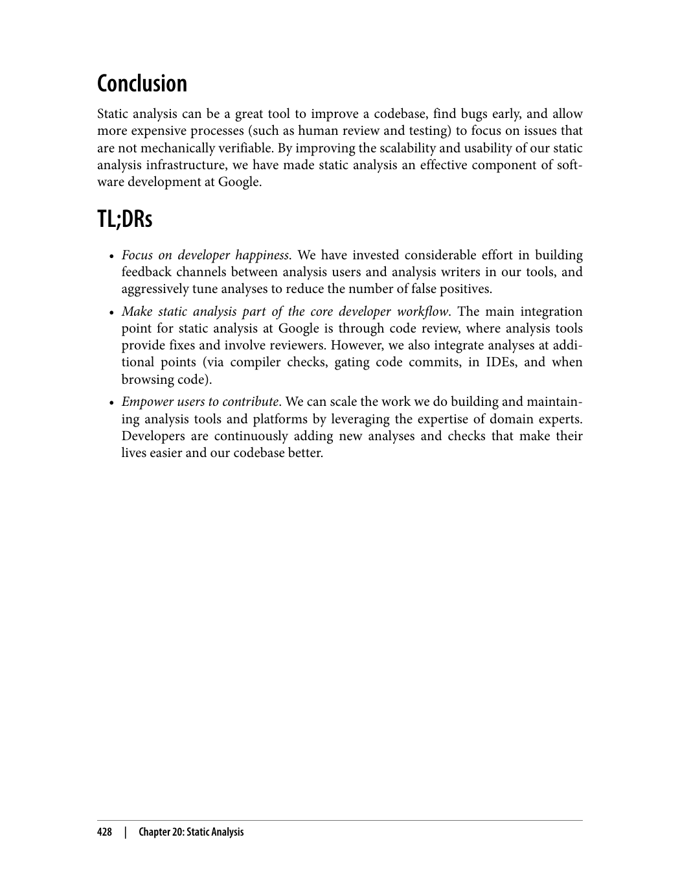

---

###### 📄 صفحه ۴۵۷
> 1 This could be any of language version, version of a lower-level library, hardware version, operating system,
> compiler flag, compiler version, and so on.
> Scale makes all of these questions more complex, with the realization that we aren’t
> really talking about single dependency imports, and in the general case that we’re
> depending on an entire network of external dependencies. When we begin dealing
> with a network, it is easy to construct scenarios in which your organization’s use of
> two dependencies becomes unsatisfiable at some point in time. Generally, this hap‐
> pens because one dependency stops working without some requirement,1 whereas the
> other is incompatible with the same requirement. Simple solutions about how to
> manage a single outside dependency usually fail to account for the realities of manag‐
> ing a large network. We’ll spend much of this chapter discussing various forms of
> these conflicting requirement problems.
> Source control and dependency management are related issues separated by the ques‐
> tion: “Does our organization control the development/update/management of this
> subproject?” For example, if every team in your company has separate repositories,
> goals, and development practices, the interaction and management of code produced
> by those teams is going to have more to do with dependency management than
> source control. On the other hand, a large organization with a (virtual?) single reposi‐
> tory (monorepo) can scale up significantly farther with source control policies—this
> is Google’s approach. Separate open source projects certainly count as separate organ‐
> izations: interdependencies between unknown and not-necessarily-collaborating
> projects are a dependency management problem. Perhaps our strongest single piece
> of advice on this topic is this: All else being equal, prefer source control problems over
> dependency-management problems. If you have the option to redefine “organization”
> more broadly (your entire company rather than just one team), that’s very often a
> good trade-off. Source control problems are a lot easier to think about and a lot
> cheaper to deal with than dependency-management ones.
> As the Open Source Software (OSS) model continues to grow and expand into new
> domains, and the dependency graph for many popular projects continues to expand
> over time, dependency management is perhaps becoming the most important prob‐
> lem in software engineering policy. We are no longer disconnected islands built on
> one or two layers outside an API. Modern software is built on towering pillars of
> dependencies; but just because we can build those pillars doesn’t mean we’ve yet fig‐
> ured out how to keep them standing and stable over time.
> In this chapter, we’ll look at the particular challenges of dependency management,
> explore solutions (common and novel) and their limitations, and look at the realities
> of working with dependencies, including how we’ve handled things in Google. It is
> important to preface all of this with an admission: we’ve invested a lot of thought into
> this problem and have extensive experience with refactoring and maintenance issues
> 430
> |
> Chapter 21: Dependency Management

مثال‌ها:
1. **Error Prone**: ابزار جاوا برای شناسایی باگ‌ها
2. **clang-tidy**: ابزار C++ برای شناسایی مشکلات
3. ** pylint**: ابزار پایتون برای شناسایی مشکلات

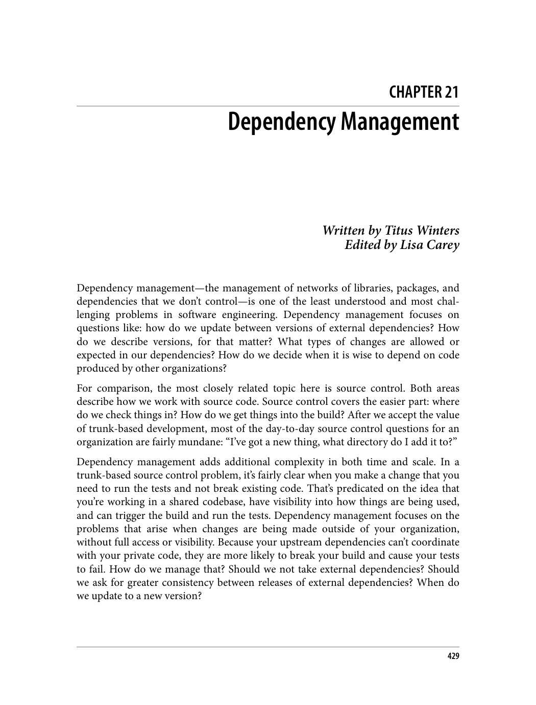

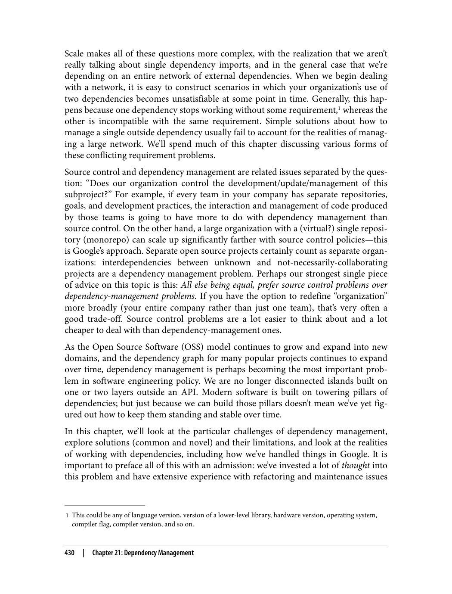

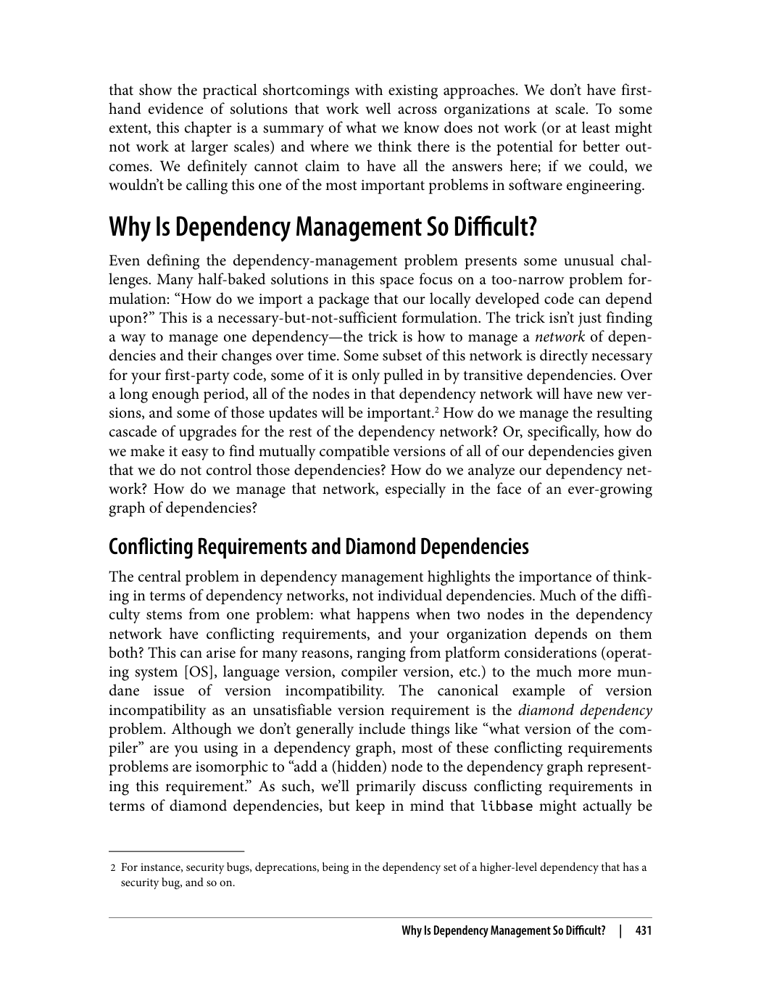

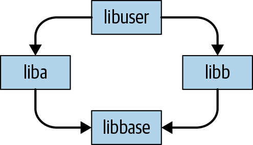

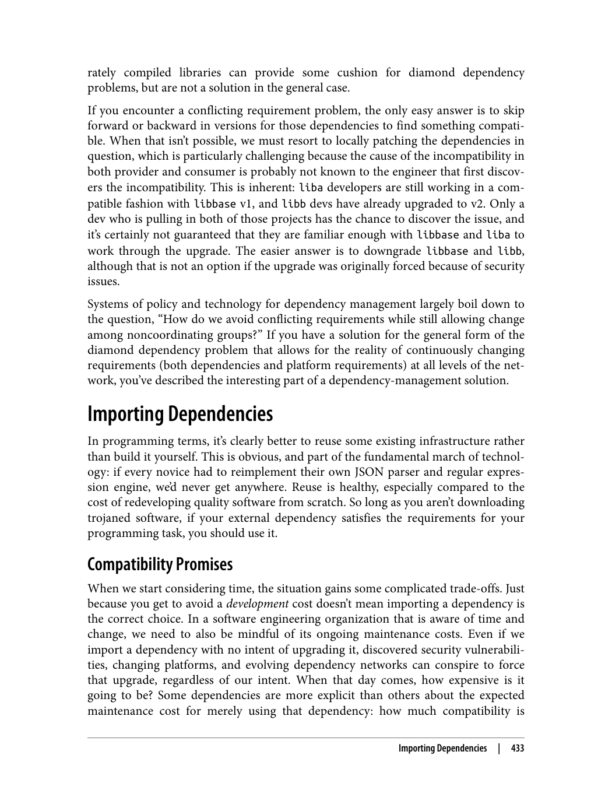

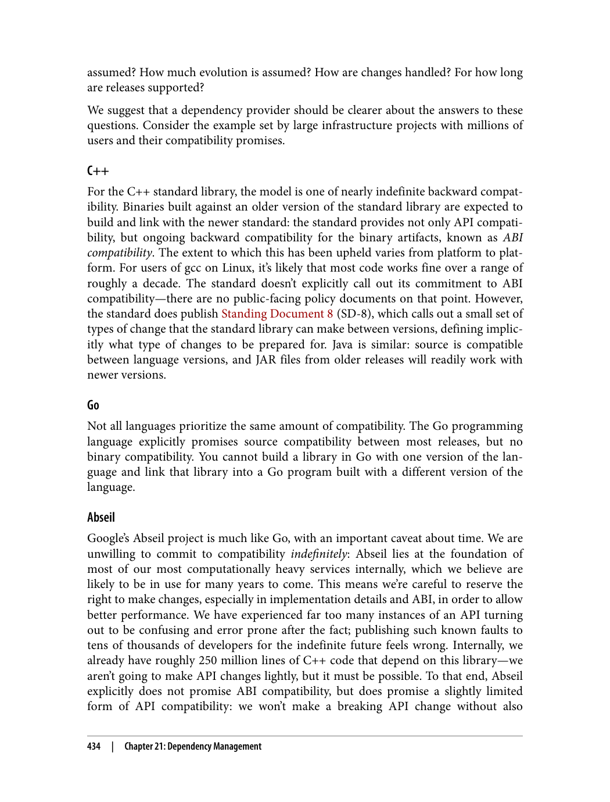

---

###### 📄 صفحه ۴۶۳
> dependencies as you like with no thought of how to use them responsibly or plan for
> upgrades. Getting your program to work today by violating everything in SD-8 and
> also relying on binary compatibility from Boost and Abseil works fine…so long as
> you never upgrade the standard library, Boost, or Abseil, and neither does anything
> that depends on you.
> Considerations When Importing
> Importing a dependency for use in a programming project is nearly free: assuming
> that you’ve taken the time to ensure that it does what you need and isn’t secretly a
> security hole, it is almost always cheaper to reuse than to reimplement functionality.
> Even if that dependency has taken the step of clarifying what compatibility promise it
> will make, so long as we aren’t ever upgrading, anything you build on top of that
> snapshot of your dependency is fine, no matter how many rules you violate in con‐
> suming that API. But when we move from programming to software engineering,
> those dependencies become subtly more expensive, and there are a host of hidden
> costs and questions that need to be answered. Hopefully, you consider these costs
> before importing, and, hopefully, you know when you’re working on a programming
> project versus working on a software engineering project.
> When engineers at Google try to import dependencies, we encourage them to ask this
> (incomplete) list of questions first:
> • Does the project have tests that you can run?
> • Do those tests pass?
> • Who is providing that dependency? Even among “No warranty implied” OSS
> projects, there is a significant range of experience and skill set—it’s a very differ‐
> ent thing to depend on compatibility from the C++ standard library or Java’s
> Guava library than it is to select a random project from GitHub or npm. Reputa‐
> tion isn’t everything, but it is worth investigating.
> • What sort of compatibility is the project aspiring to?
> • Does the project detail what sort of usage is expected to be supported?
> • How popular is the project?
> • How long will we be depending on this project?
> • How often does the project make breaking changes?
> Add to this a short selection of internally focused questions:
> • How complicated would it be to implement that functionality within Google?
> • What incentives will we have to keep this dependency up to date?
> • Who will perform an upgrade?
> 436
> |
> Chapter 21: Dependency Management

ویژگی‌های اصلی:
1. **مقیاس‌پذیری**: باید با پایگاه‌های کد بزرگ کار کند
2. **قابلیت استفاده**: باید آسان برای استفاده باشد
3. **دقت**: باید نتایج دقیق ارائه دهد
4. **سرعت**: باید سریع اجرا شود

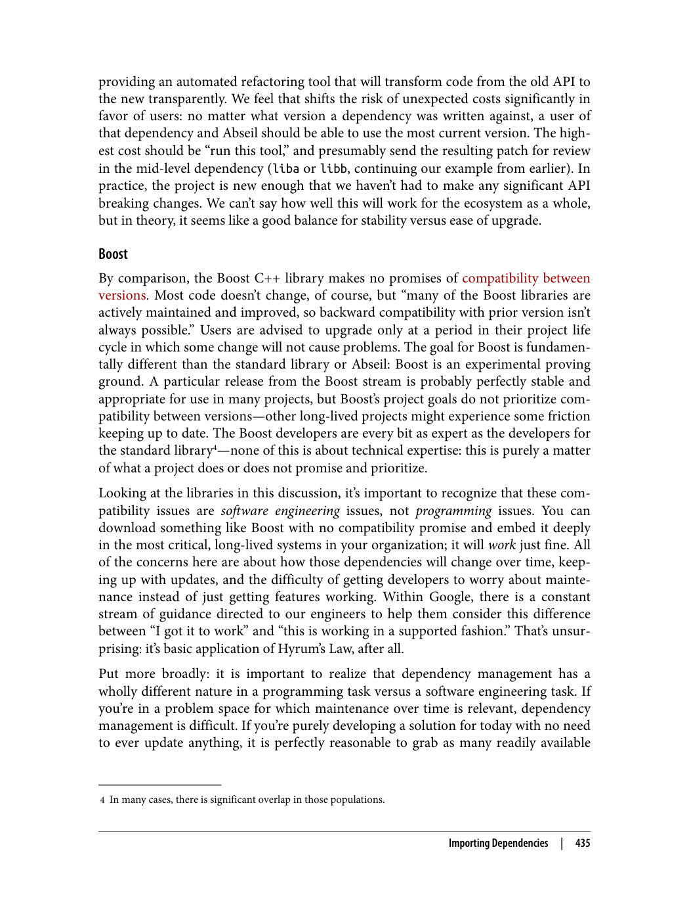

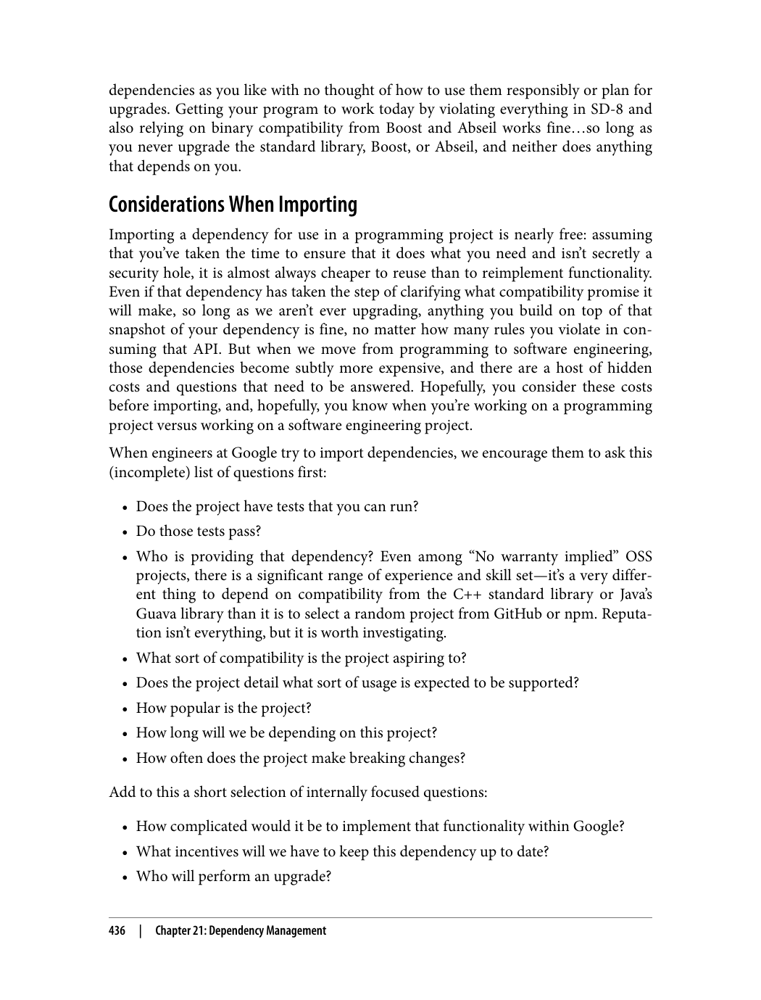

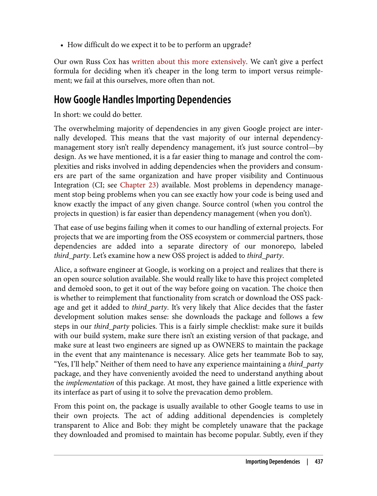

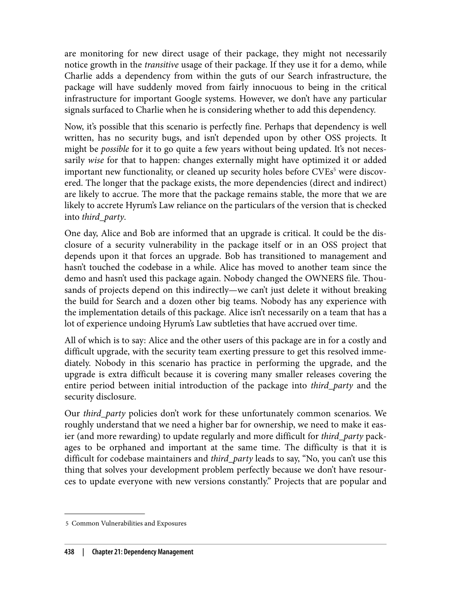

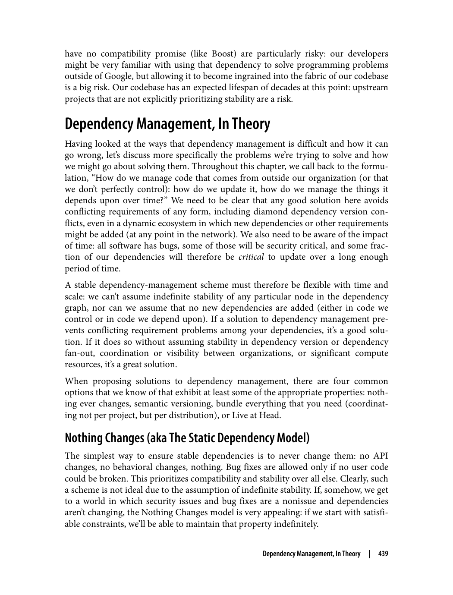

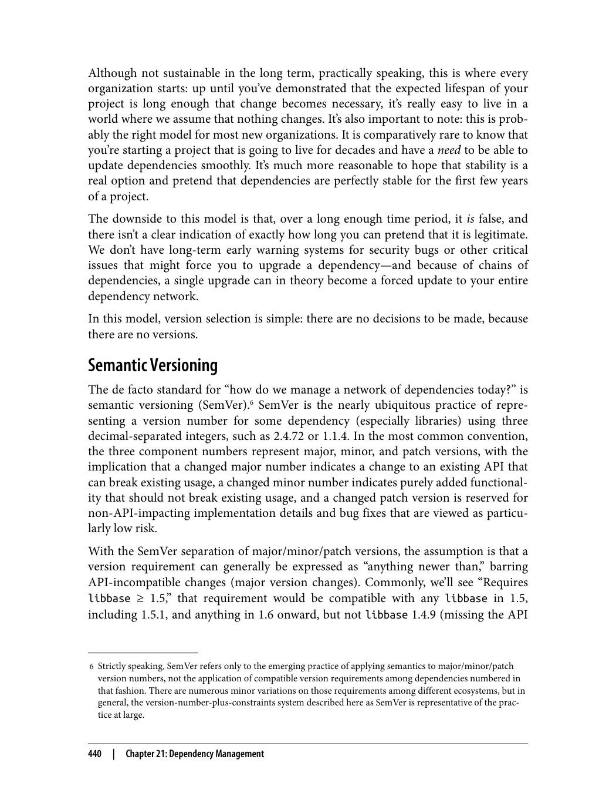

---

###### 📄 صفحه ۴۶۹
> 8 Especially the author and others in the Google C++ community.
> that the various pieces that are included in a distro are cut from the same point in
> time. In fact, it’s somewhat more likely that the lower-level dependencies are some‐
> what older than the higher-level ones, just to account for the time it takes to integrate
> them.
> This “draw a bigger box around it all and release that collection” model introduces
> entirely new actors: the distributors. Although the maintainers of all of the individual
> dependencies may have little or no knowledge of the other dependencies, these
> higher-level distributors are involved in the process of finding, patching, and testing a
> mutually compatible set of versions to include. Distributors are the engineers respon‐
> sible for proposing a set of versions to bundle together, testing those to find bugs in
> that dependency tree, and resolving any issues.
> For an outside user, this works great, so long as you can properly rely on only one of
> these bundled distributions. This is effectively the same as changing a dependency
> network into a single aggregated dependency and giving that a version number.
> Rather than saying, “I depend on these 72 libraries at these versions,” this is, “I
> depend on RedHat version N,” or, “I depend on the pieces in the NPM graph at time
> T.”
> In the bundled distribution approach, version selection is handled by dedicated
> distributors.
> Live at Head
> The model that some of us at Google8 have been pushing for is theoretically sound,
> but places new and costly burdens on participants in a dependency network. It’s
> wholly unlike the models that exist in OSS ecosystems today, and it is not clear how
> to get from here to there as an industry. Within the boundaries of an organization
> like Google, it is costly but effective, and we feel that it places most of the costs and
> incentives into the correct places. We call this model “Live at Head.” It is viewable as
> the dependency-management extension of trunk-based development: where trunk-
> based development talks about source control policies, we’re extending that model to
> apply to upstream dependencies as well.
> Live at Head presupposes that we can unpin dependencies, drop SemVer, and rely on
> dependency providers to test changes against the entire ecosystem before commit‐
> ting. Live at Head is an explicit attempt to take time and choice out of the issue of
> dependency management: always depend on the current version of everything, and
> never change anything in a way in which it would be difficult for your dependents to
> adapt. A change that (unintentionally) alters API or behavior will in general be caught
> by CI on downstream dependencies, and thus should not be committed. For cases in
> 442
> |
> Chapter 21: Dependency Management

درس‌های اصلی:
1. **تمرکز بر خوشحالی توسعه‌دهنده**: ابزارها باید مفید و آسان باشند
2. **بخشی از گردش کار توسعه**: تحلیل ایستا باید بخشی طبیعی از گردش کار باشد
3. **توانمندسازی کاربران**: کاربران باید بتوانند مشارکت کنند

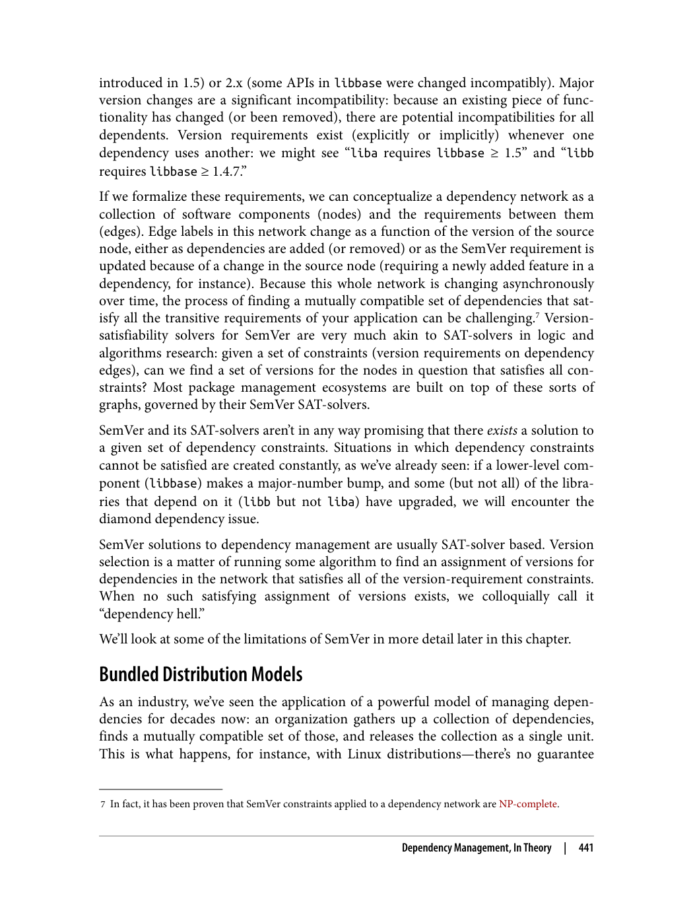

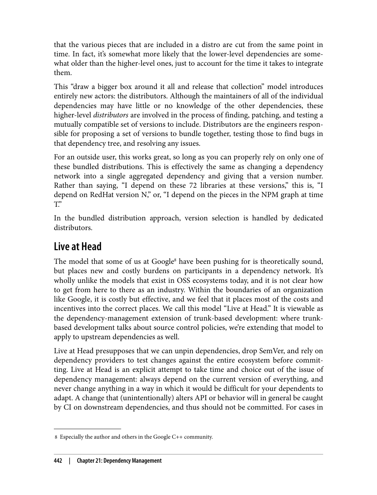

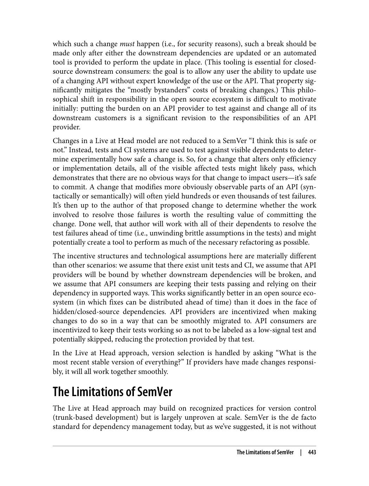

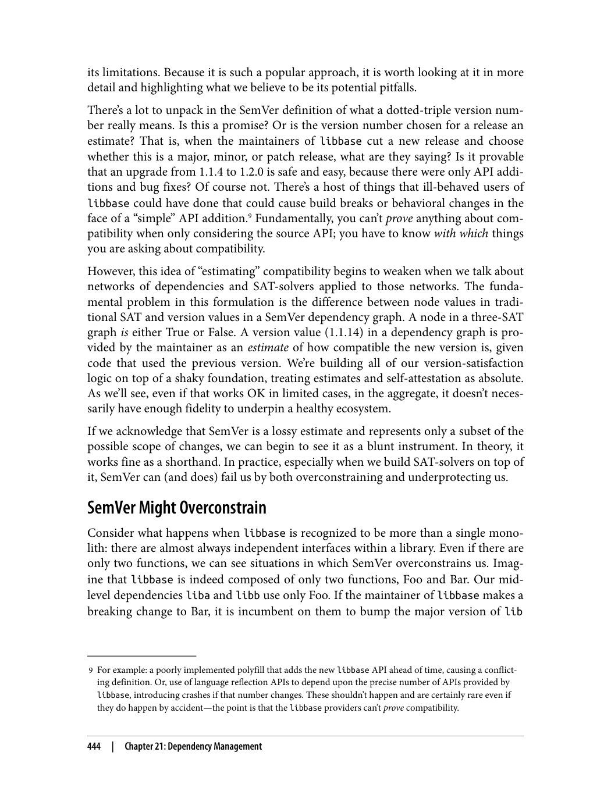

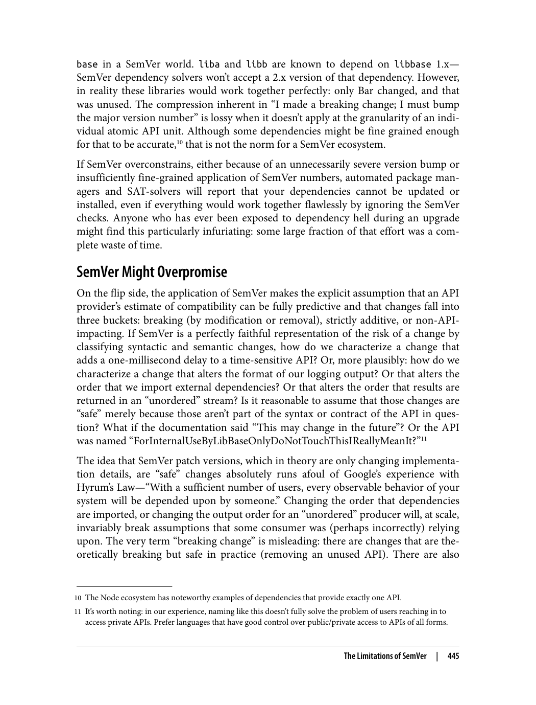

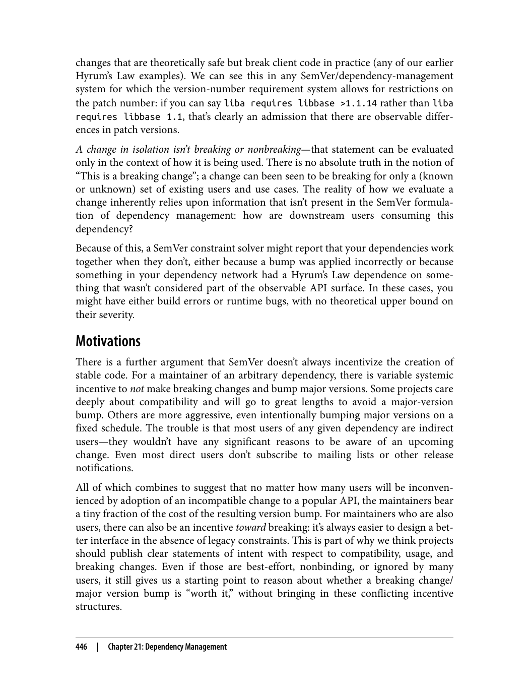

---

###### 📄 صفحه ۴۷۵
> 14 Russ Cox, “Minimal Version Selection,” February 21, 2018, https://research.swtch.com/vgo-mvs.
> 15 If that assumption doesn’t hold, you should really stop depending on liba.
> author developed against.”14 There is a critically important truth revealed in this
> point: when liba says it requires libbase ≥1.7, that almost certainly means that the
> developer of liba had libbase 1.7 installed. Assuming that the maintainer per‐
> formed even basic testing before publishing,15 we have at least anecdotal evidence of
> interoperability testing for that version of liba and version 1.7 of libbase. It’s not CI
> or proof that everything has been unit tested together, but it’s something.
> Absent accurate input constraints derived from 100% accurate prediction of the
> future, it’s best to make the smallest jump forward possible. Just as it’s usually safer to
> commit an hour of work to your project instead of dumping a year of work all at
> once, smaller steps forward in your dependency updates are safer. MVS just walks
> forward each affected dependency only as far as is required and says, “OK, I’ve
> walked forward far enough to get what you asked for (and not farther). Why don’t
> you run some tests and see if things are good?”
> Inherent in the idea of MVS is the admission that a newer version might introduce an
> incompatibility in practice, even if the version numbers in theory say otherwise. This
> is recognizing the core concern with SemVer, using MVS or not: there is some loss of
> fidelity in this compression of software changes into version numbers. MVS gives
> some additional practical fidelity, trying to produce selected versions closest to those
> that have presumably been tested together. This might be enough of a boost to make a
> larger set of dependency networks function properly. Unfortunately, we haven’t found
> a good way to empirically verify that idea. The jury is still out on whether MVS makes
> SemVer “good enough” without fixing the basic theoretical and incentive problems
> with the approach, but we still believe it represents a manifest improvement in the
> application of SemVer constraints as they are used today.
> So, Does SemVer Work?
> SemVer works well enough in limited scales. It’s deeply important, however, to recog‐
> nize what it is actually saying and what it cannot. SemVer will work fine provided
> that:
> • Your dependency providers are accurate and responsible (to avoid human error
> in SemVer bumps)
> • Your dependencies are fine grained (to avoid falsely overconstraining when
> unused/unrelated APIs in your dependencies are updated, and the associated risk
> of unsatisfiable SemVer requirements)
> 448
> |
> Chapter 21: Dependency Management

ویژگی‌های Tricorder:
1. **تحلیل در حین ویرایش**: تحلیل کد در حین نوشتن
2. **یکپارچه‌سازی با کامپایلر**: ادغام با کامپایلر
3. **بازخورد یکپارچه**: ارائه بازخورد در محیط توسعه
4. **ابزارهای یکپارچه**: ابزارهای مختلف در یک پلتفرم

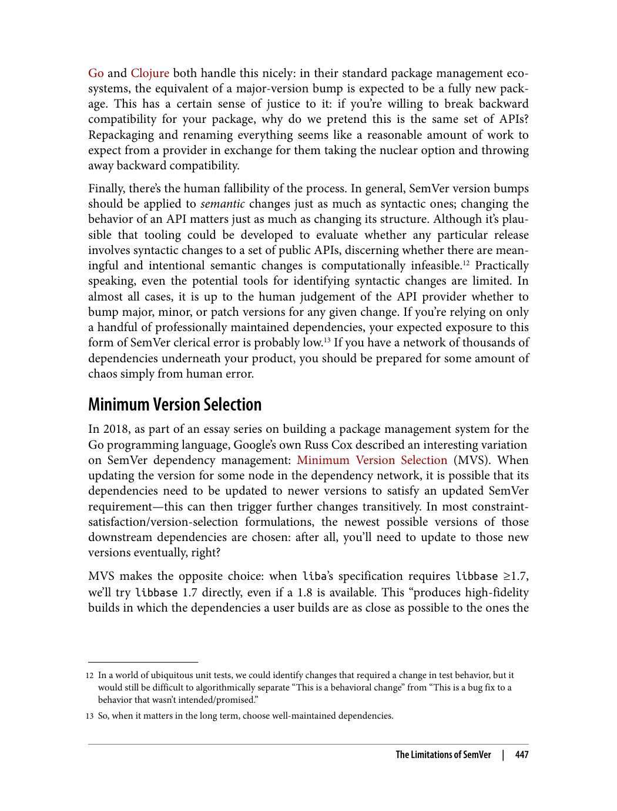

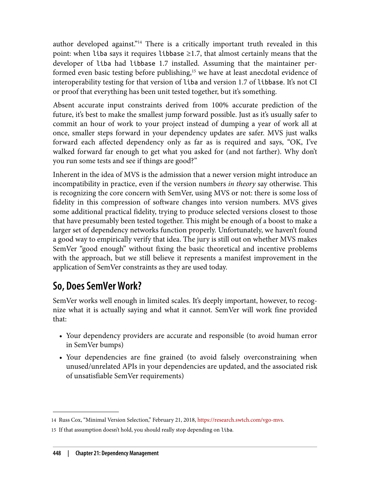

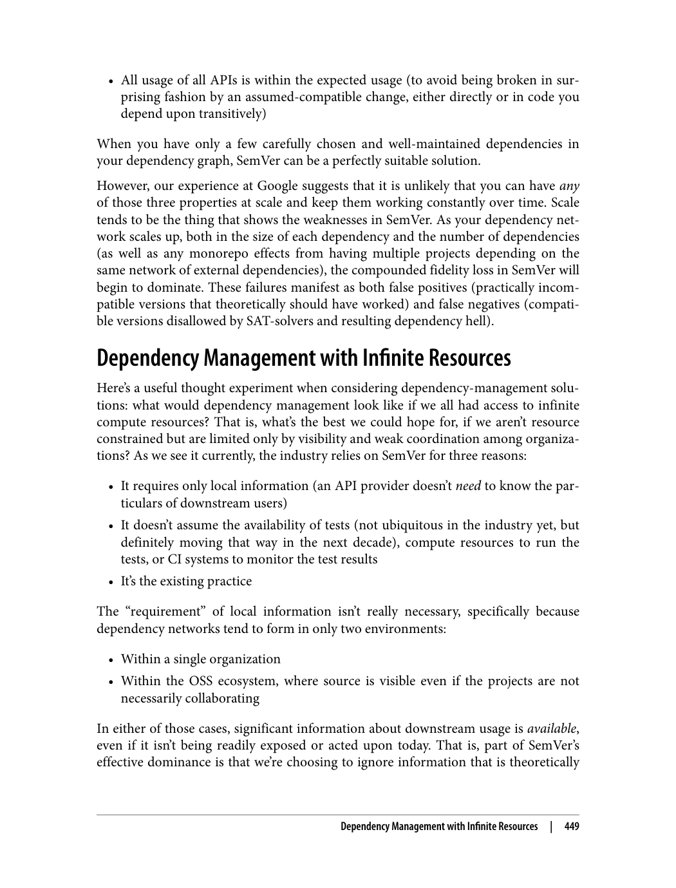

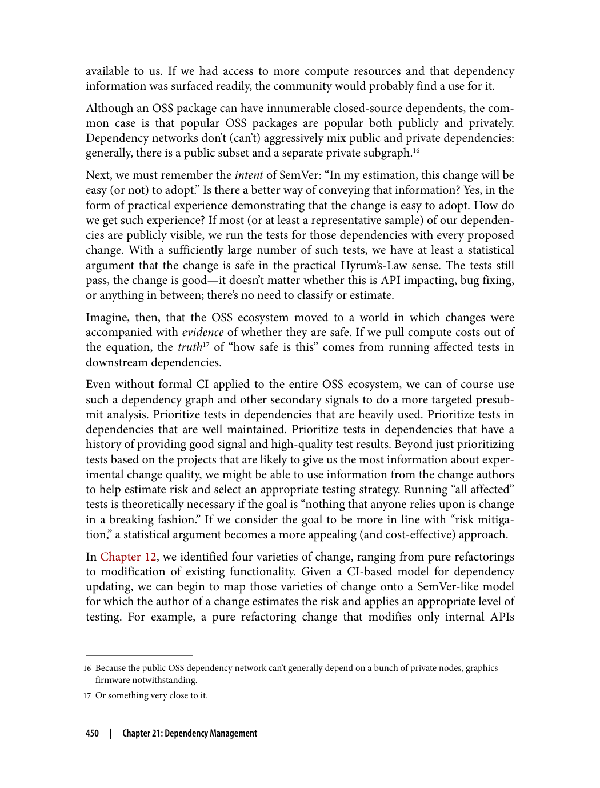

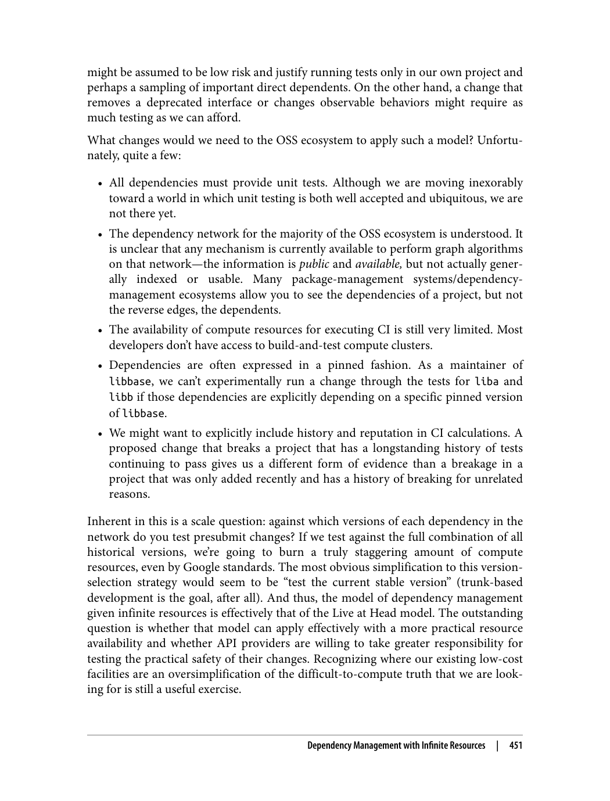

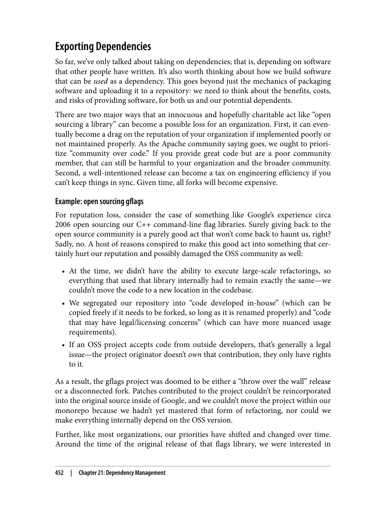

---
