> **راهنمای مطالعه**
>
> در هر بخش، ابتدا متن اصلی کتاب به زبان انگلیسی آورده شده و سپس ترجمه و توضیحات فارسی همان بخش ارائه شده است.

---
-

###### 📄 صفحه ۴۸۱
> 19 Often through trial and error.
> Above and beyond the nebulous “We look bad,” there are also parts of this story that
> illustrate how we can be subject to technical problems stemming from poorly
> released/poorly maintained external dependencies. Although the flags library was
> shared but ignored, there were still some Google-backed open source projects, or
> projects that needed to be shareable outside of our monorepo ecosystem. Unsurpris‐
> ingly, the authors of those other projects were able to identify19 the common API sub‐
> set between the internal and external forks of that library. Because that common
> subset stayed fairly stable between the two versions for a long period, it silently
> became “the way to do this” for the rare teams that had unusual portability require‐
> ments between roughly 2008 and 2017. Their code could build in both internal and
> external ecosystems, switching out forked versions of the flags library depending on
> environment.
> Then, for unrelated reasons, C++ library teams began tweaking observable-but-not-
> documented pieces of the internal flag implementation. At that point, everyone who
> was depending on the stability and equivalence of an unsupported external fork
> started screaming that their builds and releases were suddenly broken. An optimiza‐
> tion opportunity worth some thousands of aggregate CPUs across Google’s fleet was
> significantly delayed, not because it was difficult to update the API that 250 million
> lines of code depended upon, but because a tiny handful of projects were relying on
> unpromised and unexpected things. Once again, Hyrum’s Law affects software
> changes, in this case even for forked APIs maintained by separate organizations.
> Case Study: AppEngine
> A more serious example of exposing ourselves to greater risk of unexpected technical
> dependency comes from publishing Google’s AppEngine service. This service allows
> users to write their applications on top of an existing framework in one of several
> popular programming languages. So long as the application is written with a proper
> storage/state management model, the AppEngine service allows those applications to
> scale up to huge usage levels: backing storage and frontend management are managed
> and cloned on demand by Google’s production infrastructure.
> Originally, AppEngine’s support for Python was a 32-bit build running with an older
> version of the Python interpreter. The AppEngine system itself was (of course) imple‐
> mented in our monorepo and built with the rest of our common tools, in Python and
> in C++ for backend support. In 2014 we started the process of doing a major update
> to the Python runtime alongside our C++ compiler and standard library installations,
> with the result being that we effectively tied “code that builds with the current C++
> compiler” to “code that uses the updated Python version”—a project that upgraded
> one of those dependencies inherently upgraded the other at the same time. For most
> 454
> |
> Chapter 21: Dependency Management

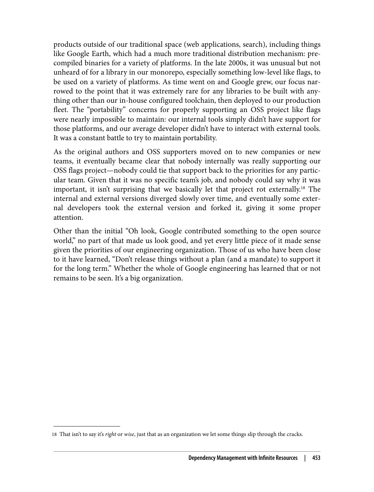

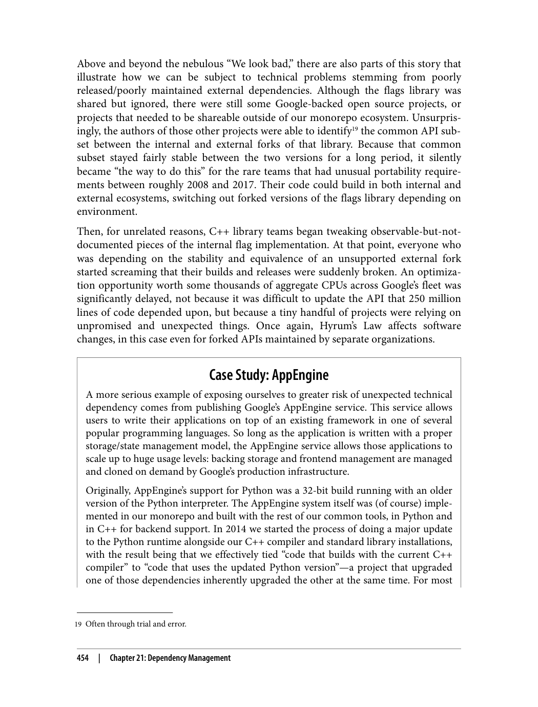

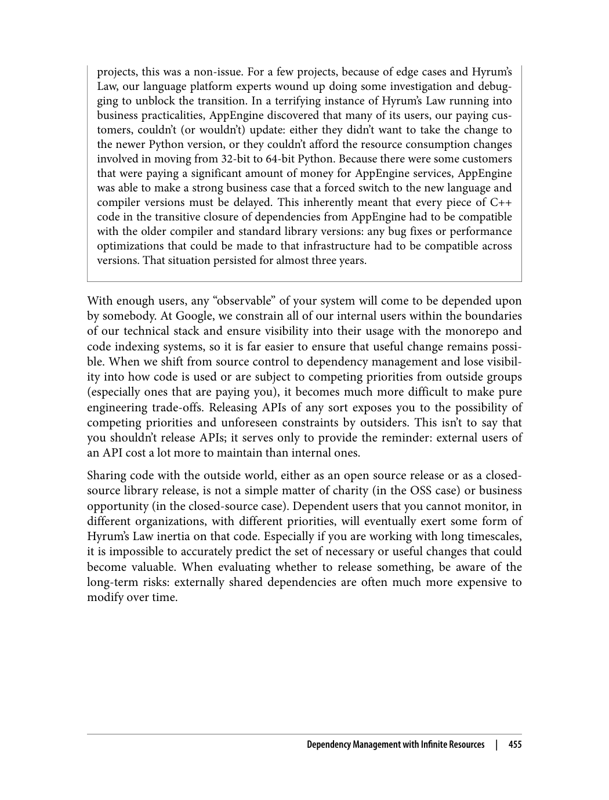

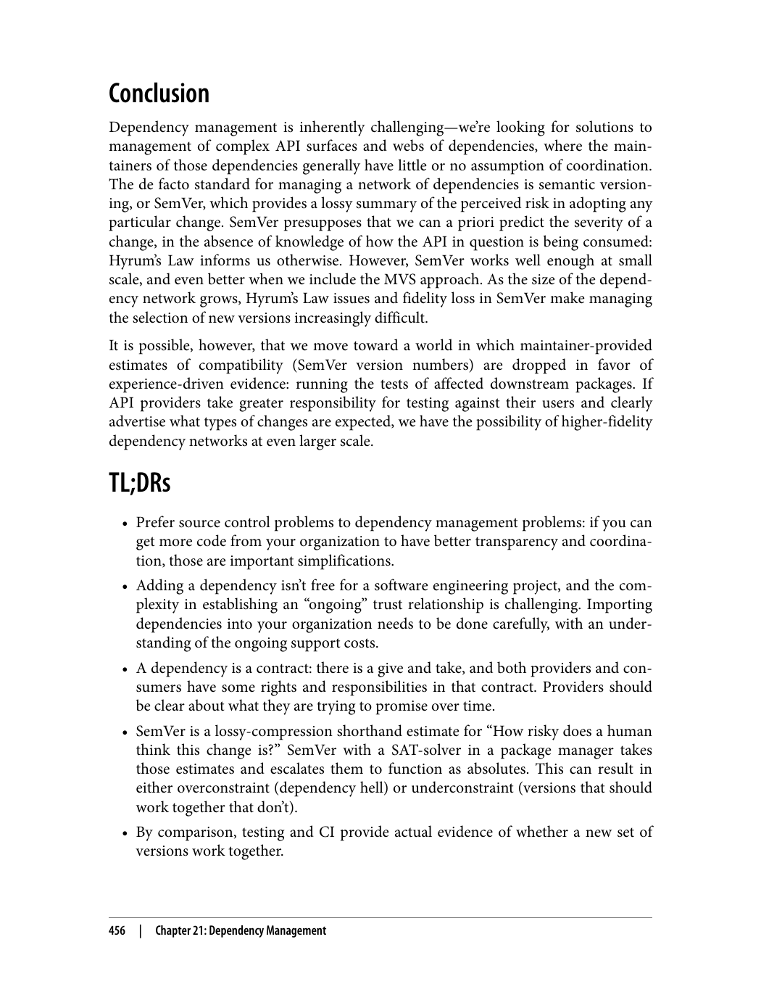

---

###### 📄 صفحه ۴۸۵

ویژگی‌های Critique:
1. **ایجاد تغییرات**: ایجاد تغییرات جدید در کد
2. **بررسی و نظر دادن**: بررسی تغییرات و ارائه نظرات
3. **تایید و ادغام**: تایید تغییرات و ادغام آن‌ها

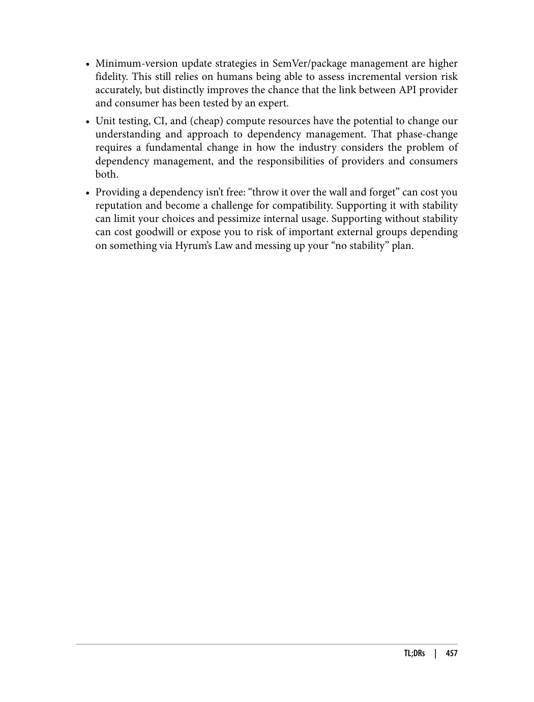

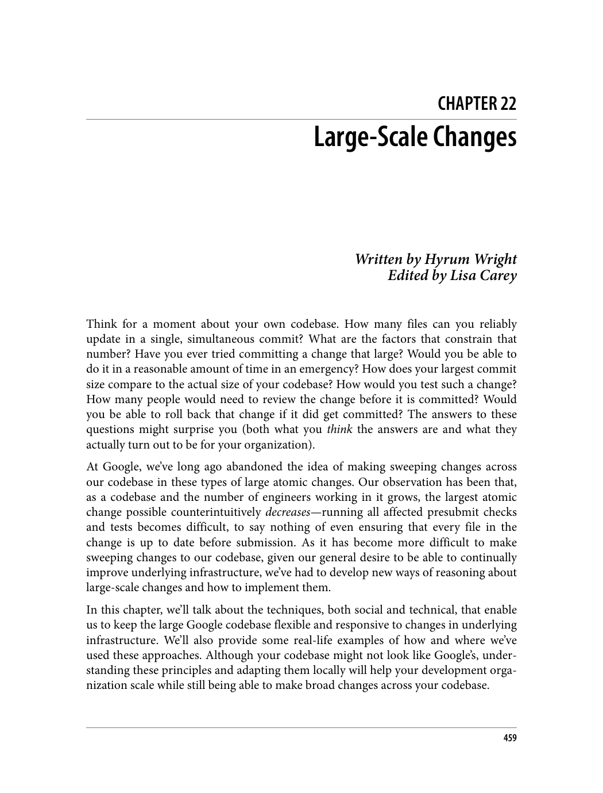

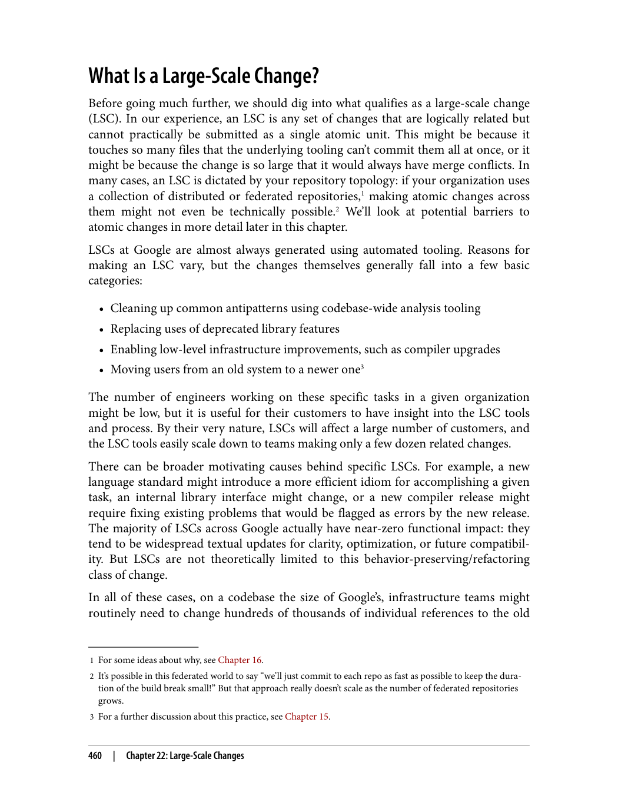

---

###### 📄 صفحه ۴۸۹
> the costs of migration will be borne somewhere in the organization. Centralizing the
> migration and accounting for its costs is almost always faster and cheaper than
> depending on individual teams to organically migrate.
> Additionally, having teams that own the systems requiring LSCs helps align incen‐
> tives to ensure the change gets done. In our experience, organic migrations are
> unlikely to fully succeed, in part because engineers tend to use existing code as exam‐
> ples when writing new code. Having a team that has a vested interest in removing the
> old system responsible for the migration effort helps ensure that it actually gets done.
> Although funding and staffing a team to run these kinds of migrations can seem like
> an additional cost, it is actually just internalizing the externalities that an unfunded
> mandate creates, with the additional benefits of economies of scale.
> Case Study: Filling Potholes
> Although the LSC systems at Google are used for high-priority migrations, we’ve also
> discovered that just having them available opens up opportunities for various small
> fixes across our codebase, which just wouldn’t have been possible without them.
> Much like transportation infrastructure tasks consist of building new roads as well as
> repairing old ones, infrastructure groups at Google spend a lot of time fixing existing
> code, in addition to developing new systems and moving users to them.
> For example, early in our history, a template library emerged to supplement the C++
> Standard Template Library. Aptly named the Google Template Library, this library
> consisted of several header files’ worth of implementation. For reasons lost in the
> mists of time, one of these header files was named stl_util.h and another was named
> map-util.h (note the different separators in the file names). In addition to driving the
> consistency purists nuts, this difference also led to reduced productivity, and engi‐
> neers had to remember which file used which separator, and only discovered when
> they got it wrong after a potentially lengthy compile cycle.
> Although fixing this single-character change might seem pointless, particularly across
> a codebase the size of Google’s, the maturity of our LSC tooling and process enabled
> us to do it with just a couple weeks’ worth of background-task effort. Library authors
> could find and apply this change en masse without having to bother end users of
> these files, and we were able to quantitatively reduce the number of build failures
> caused by this specific issue. The resulting increases in productivity (and happiness)
> more than paid for the time to make the change.
> As the ability to make changes across our entire codebase has improved, the diversity
> of changes has also expanded, and we can make some engineering decisions knowing
> that they aren’t immutable in the future. Sometimes, it’s worth the effort to fill a few
> potholes.
> 462
> |
> Chapter 22: Large-Scale Changes

مزایای اصلی:
1. **بهبود کیفیت کد**: شناسایی و رفع باگ‌ها قبل از انتشار
2. **اشتراک‌گذاری دانش**: یادگیری از کد دیگران
3. **بهبود خوانایی**: اطمینان از خوانایی کد
4. **ایجاد ثبات**: رعایت استانداردها و قوانین

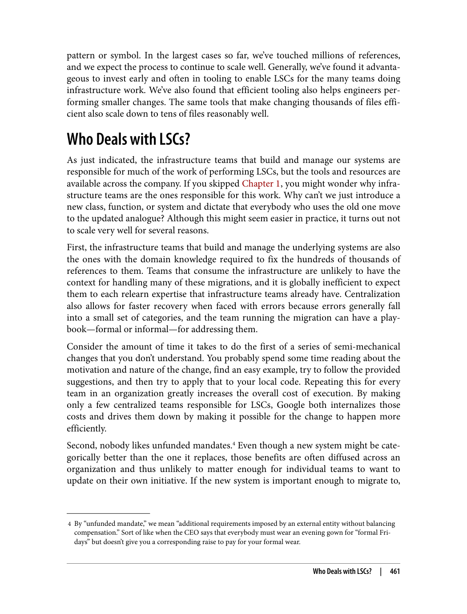

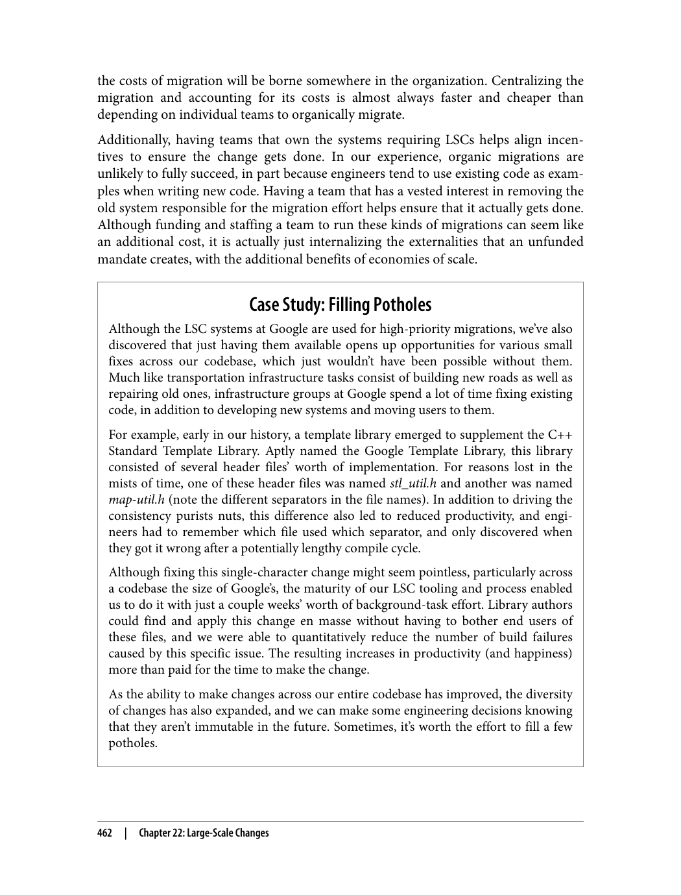

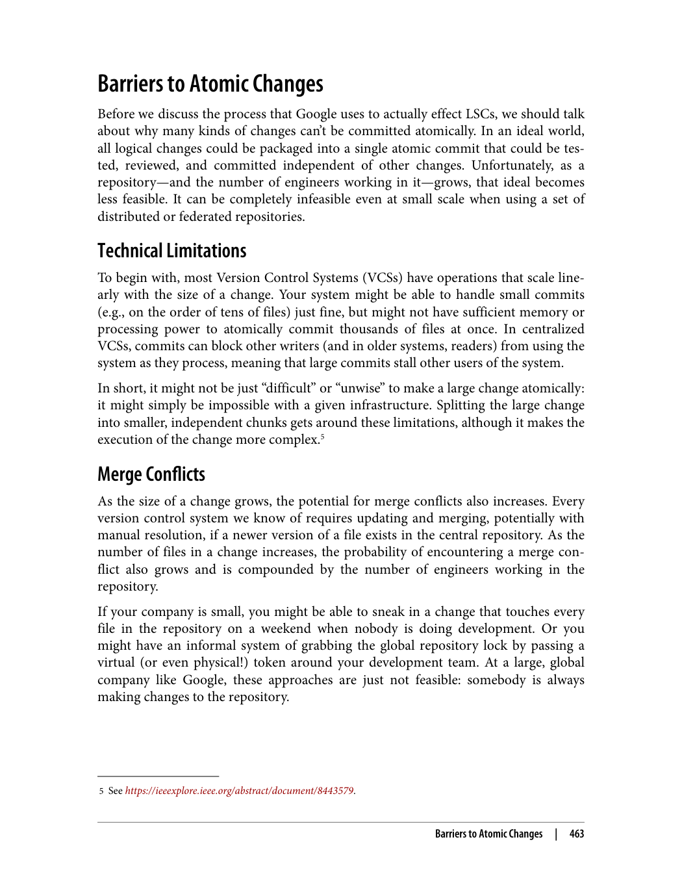

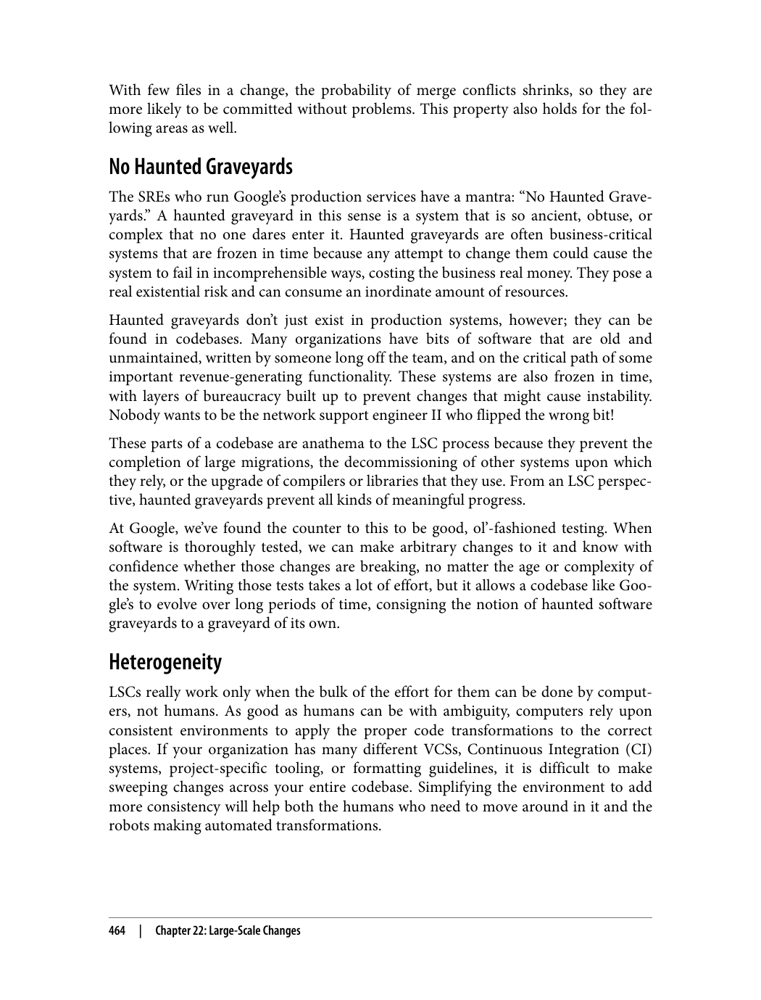

---

###### 📄 صفحه ۴۹۳
> 7 The largest series of LSCs ever executed removed more than one billion lines of code from the repository over
> the course of three days. This was largely to remove an obsolete part of the repository that had been migrated
> to a new home; but still, how confident do you have to be to delete one billion lines of code?
> 8 LSCs are usually supported by tools that make finding, making, and reviewing changes relatively straight
> forward.
> Case Study: Testing LSCs
> Adam Bender
> Today it is common for a double-digit percentage (10% to 20%) of the changes in a
> project to be the result of LSCs, meaning a substantial amount of code is changed in
> projects by people whose full-time job is unrelated to those projects. Without good
> tests, such work would be impossible, and Google’s codebase would quickly atrophy
> under its own weight. LSCs enable us to systematically migrate our entire codebase to
> newer APIs, deprecate older APIs, change language versions, and remove popular but
> dangerous practices.
> Even a simple one-line signature change becomes complicated when made in a thou‐
> sand different places across hundreds of different products and services.7 After the
> change is written, you need to coordinate code reviews across dozens of teams. Lastly,
> after reviews are approved, you need to run as many tests as you can to be sure the
> change is safe.8 We say “as many as you can,” because a good-sized LSC could trigger a
> rerun of every single test at Google, and that can take a while. In fact, many LSCs have
> to plan time to catch downstream clients whose code backslides while the LSC makes
> its way through the process.
> Testing an LSC can be a slow and frustrating process. When a change is sufficiently
> large, your local environment is almost guaranteed to be permanently out of sync
> with head as the codebase shifts like sand around your work. In such circumstances,
> it is easy to find yourself running and rerunning tests just to ensure your changes
> continue to be valid. When a project has flaky tests or is missing unit test coverage, it
> can require a lot of manual intervention and slow down the entire process. To help
> speed things up, we use a strategy called the TAP (Test Automation Platform) train.
> Riding the TAP Train
> The core insight to LSCs is that they rarely interact with one another, and most affec‐
> ted tests are going to pass for most LSCs. As a result, we can test more than one
> change at a time and reduce the total number of tests executed. The train model has
> proven to be very effective for testing LSCs.
> The TAP train takes advantage of two facts:
> • LSCs tend to be pure refactorings and therefore very narrow in scope, preserving
> local semantics.
> 466
> |
> Chapter 22: Large-Scale Changes

اصول بررسی کد:
1. **حرفه‌ای بودن**: بررسی بر اساس کیفیت کد باشد، نه شخص
2. **سازنده بودن**: پیشنهادات بهبید ارائه شود
3. **مختصر بودن**: نظرات کوتاه و مفید باشند
4. **به‌موقع بودن**: بررسی به سرعت انجام شود

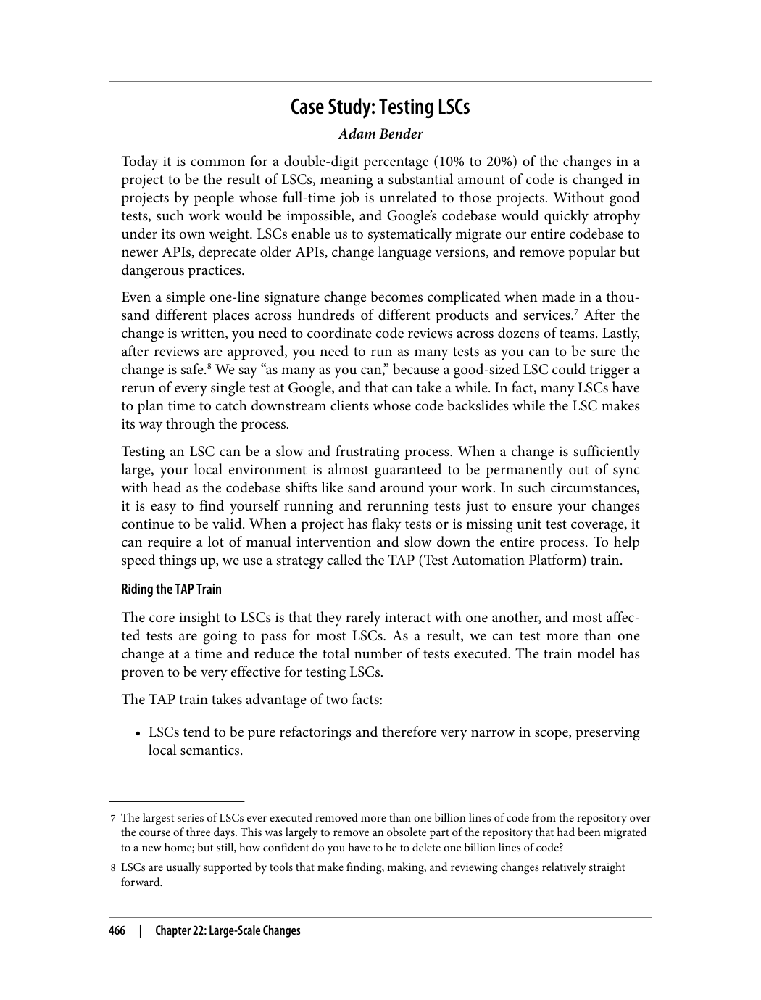

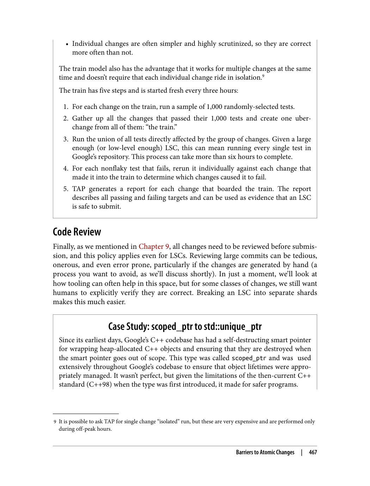

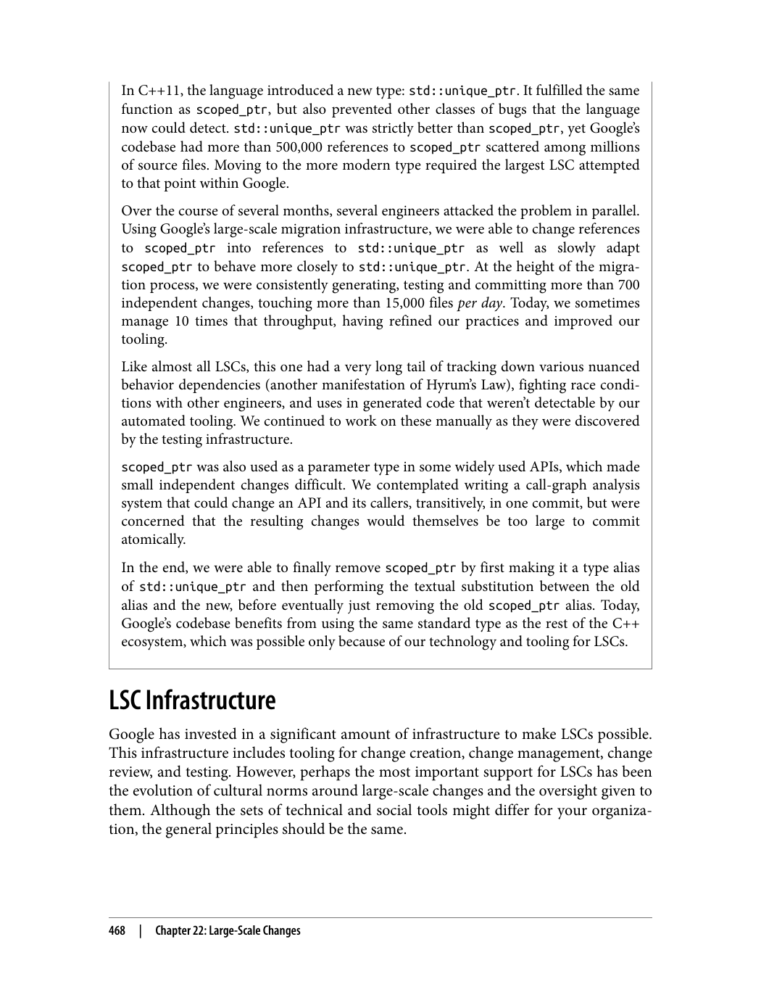

---

###### 📄 صفحه ۴۹۷
> a solid historic track record of improvements have generated widespread endorse‐
> ment of LSCs throughout Google.
> Codebase Insight
> To do LSCs, we’ve found it invaluable to be able to do large-scale analysis of our code‐
> base, both on a textual level using traditional tools, as well as on a semantic level. For
> example, Google’s use of the semantic indexing tool Kythe provides a complete map
> of the links between parts of our codebase, allowing us to ask questions such as
> “Where are the callers of this function?” or “Which classes derive from this one?”
> Kythe and similar tools also provide programmatic access to their data so that they
> can be incorporated into refactoring tools. (For further examples, see Chapters 17 and
> 20.)
> We also use compiler-based indices to run abstract syntax tree-based analysis and
> transformations over our codebase. Tools such as ClangMR, JavacFlume, or Refaster,
> which can perform transformations in a highly parallelizable way, depend on these
> insights as part of their function. For smaller changes, authors can use specialized,
> custom tools, perl or sed, regular expression matching, or even a simple shell script.
> Whatever tool your organization uses for change creation, it’s important that its
> human effort scale sublinearly with the codebase; in other words, it should take
> roughly the same amount of human time to generate the collection of all required
> changes, no matter the size of the repository. The change creation tooling should also
> be comprehensive across the codebase, so that an author can be assured that their
> change covers all of the cases they’re trying to fix.
> As with other areas in this book, an early investment in tooling usually pays off in the
> short to medium term. As a rule of thumb, we’ve long held that if a change requires
> more than 500 edits, it’s usually more efficient for an engineer to learn and execute
> our change-generation tools rather than manually execute that edit. For experienced
> “code janitors,” that number is often much smaller.
> Change Management
> Arguably the most important piece of large-scale change infrastructure is the set of
> tooling that shards a master change into smaller pieces and manages the process of
> testing, mailing, reviewing, and committing them independently. At Google, this tool
> is called Rosie, and we discuss its use more completely in a few moments when we
> examine our LSC process. In many respects, Rosie is not just a tool, but an entire
> platform for making LSCs at Google scale. It provides the ability to split the large sets
> of comprehensive changes produced by tooling into smaller shards, which can be tes‐
> ted, reviewed, and submitted independently.
> 470
> |
> Chapter 22: Large-Scale Changes

مراحل اصلی:
1. **ایجاد تغییر**: ایجاد تغییر جدید در کد
2. **درخواست بررسی**: درخواست بررسی از همکاران
3. **بررسی و نظر**: بررسی تغییر و ارائه نظرات
4. **تایید**: تایید تغییر توسط بررسی‌کنندگان
5. **ادغام**: ادغام تغییر در شاخه اصلی

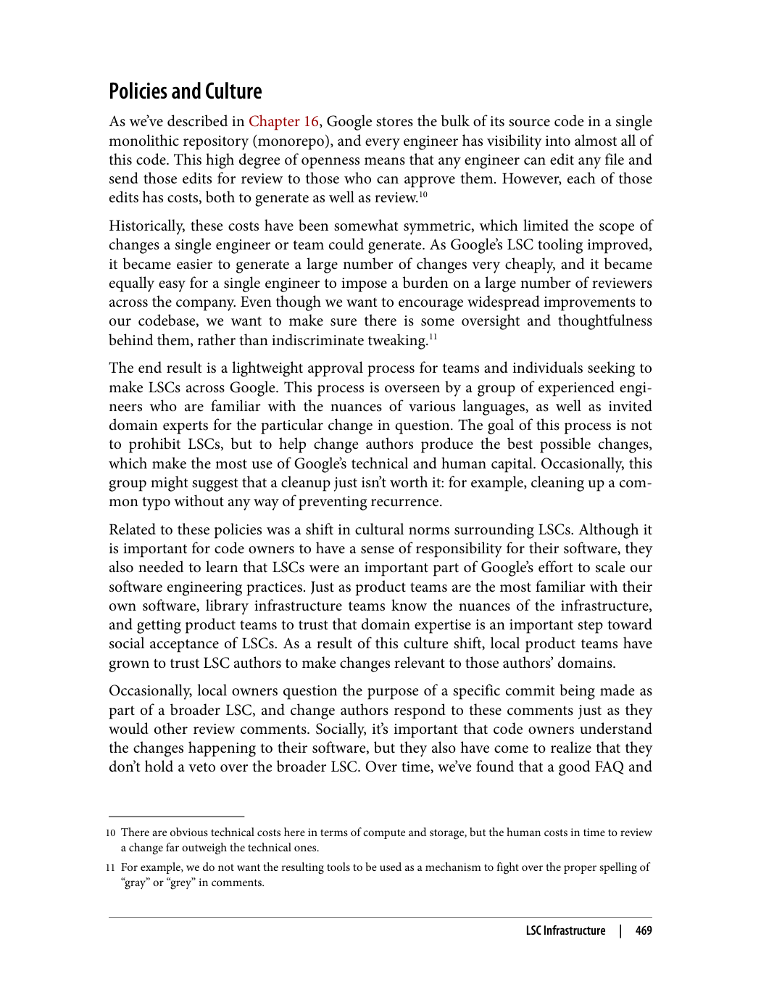

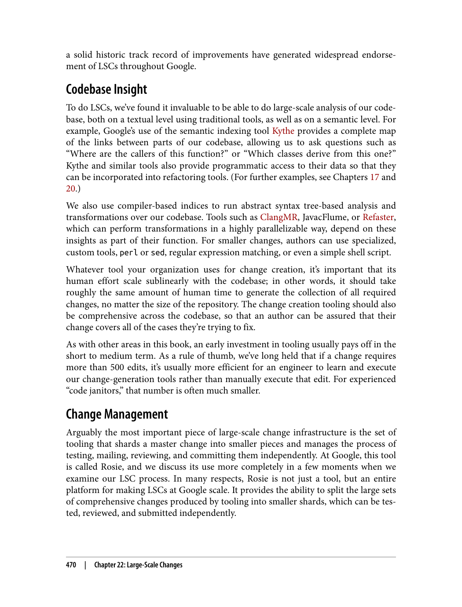

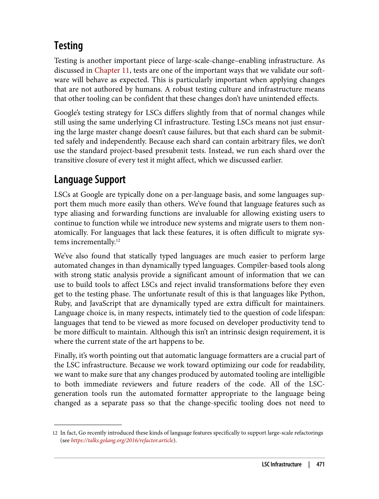

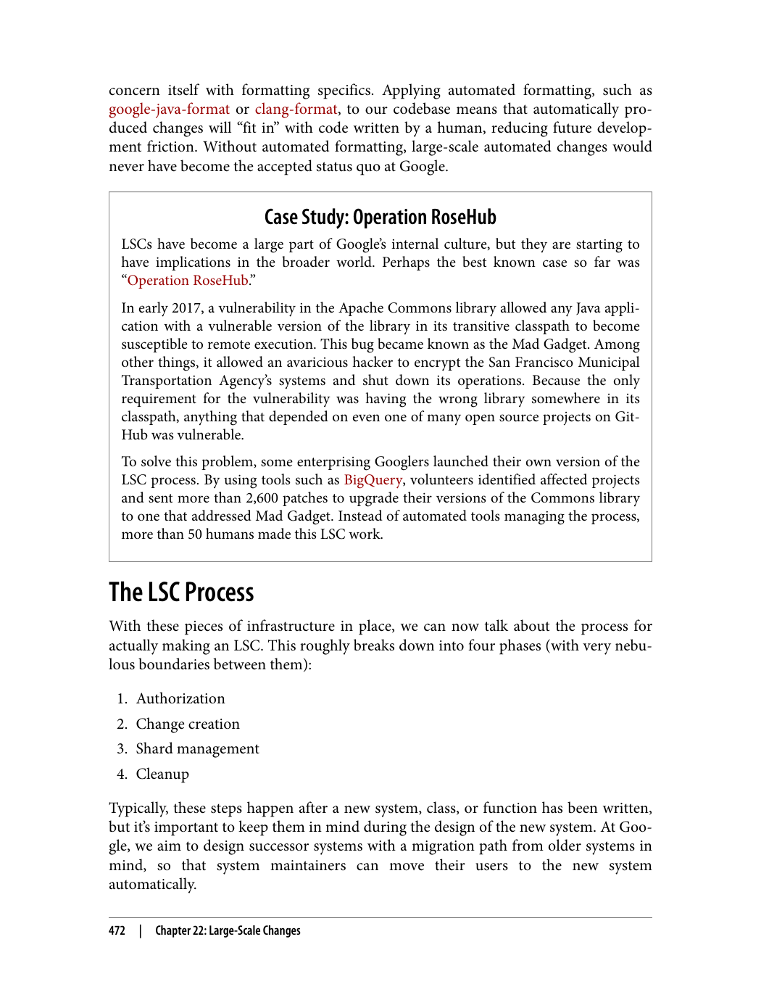

---
