> **راهنمای مطالعه**
>
> در هر بخش، ابتدا متن اصلی کتاب به زبان انگلیسی آورده شده و سپس ترجمه و توضیحات فارسی همان بخش ارائه شده است.

---
-

###### 📄 صفحه ۵۰۱
> 14 This happens for many reasons: copy-and-paste from existing examples, committing changes that have been
> in development for some time, or simply reliance on old habits.
> 15 In actuality, this is the reasoning behind the original work on clang-format for C++.
> The change generation process should be as automated as possible so that the parent
> change can be updated as users backslide into old uses14 or textual merge conflicts
> occur in the changed code. Occasionally, for the rare case in which technical tools
> aren’t able to generate the global change, we have sharded change generation across
> humans (see “Case Study: Operation RoseHub” on page 472). Although much more
> labor intensive than automatically generating changes, this allows global changes to
> happen much more quickly for time-sensitive applications.
> Keep in mind that we optimize for human readability of our codebase, so whatever
> tool generates changes, we want the resulting changes to look as much like human-
> generated changes as possible. This requirement leads to the necessity of style guides
> and automatic formatting tools (see Chapter 8).15
> Sharding and Submitting
> After a global change has been generated, the author then starts running Rosie. Rosie
> takes a large change and shards it based upon project boundaries and ownership
> rules into changes that can be submitted atomically. It then puts each individually
> sharded change through an independent test-mail-submit pipeline. Rosie can be a
> heavy user of other pieces of Google’s developer infrastructure, so it caps the number
> of outstanding shards for any given LSC, runs at lower priority, and communicates
> with the rest of the infrastructure about how much load it is acceptable to generate on
> our shared testing infrastructure.
> We talk more about the specific test-mail-submit process for each shard below.
> Cattle Versus Pets
> We often use the “cattle and pets” analogy when referring to individual machines in a
> distributed computing environment, but the same principles can apply to changes
> within a codebase.
> At Google, as at most organizations, typical changes to the codebase are handcrafted
> by individual engineers working on specific features or bug fixes. Engineers might
> spend days or weeks working through the creation, testing, and review of a single
> change. They come to know the change intimately, and are proud when it is finally
> committed to the main repository. The creation of such a change is akin to owning
> and raising a favorite pet.
> 474
> |
> Chapter 22: Large-Scale Changes

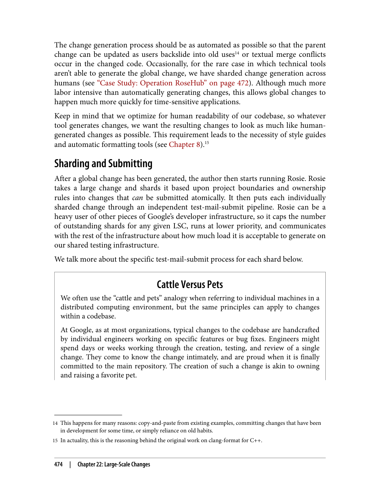

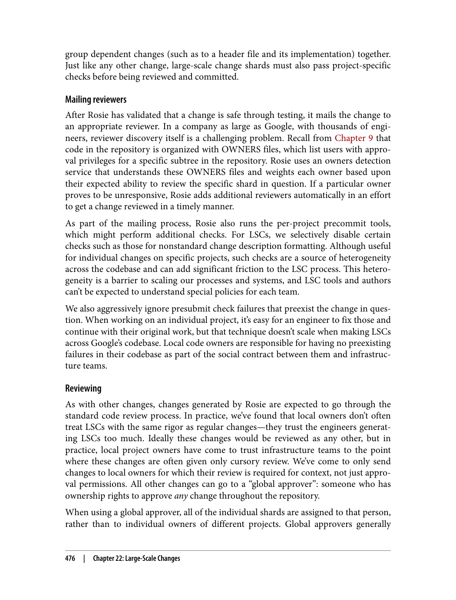

---

###### 📄 صفحه ۵۰۵
> sistent, spatially and temporally. And all of this happens with only a few dozen
> engineers supporting tens of thousands of others.
> No matter the size of your organization, it’s reasonable to think about how you would
> make these kinds of sweeping changes across your collection of source code. Whether
> by choice or by necessity, having this ability will allow greater flexibility as your orga‐
> nization scales while keeping your source code malleable over time.
> TL;DRs
> • An LSC process makes it possible to rethink the immutability of certain technical
> decisions.
> • Traditional models of refactoring break at large scales.
> • Making LSCs means making a habit of making LSCs.
> 478
> |
> Chapter 22: Large-Scale Changes

دلایل اصلی:
1. **یافتن کد**: پیدا کردن کد مشابه یا مرتبط
2. **درک کد**: درک نحوه عملکرد کد
3. **یادگیری**: یادگیری از کد دیگران
4. **اشتراک‌گذاری**: اشتراک‌گذاری دانش

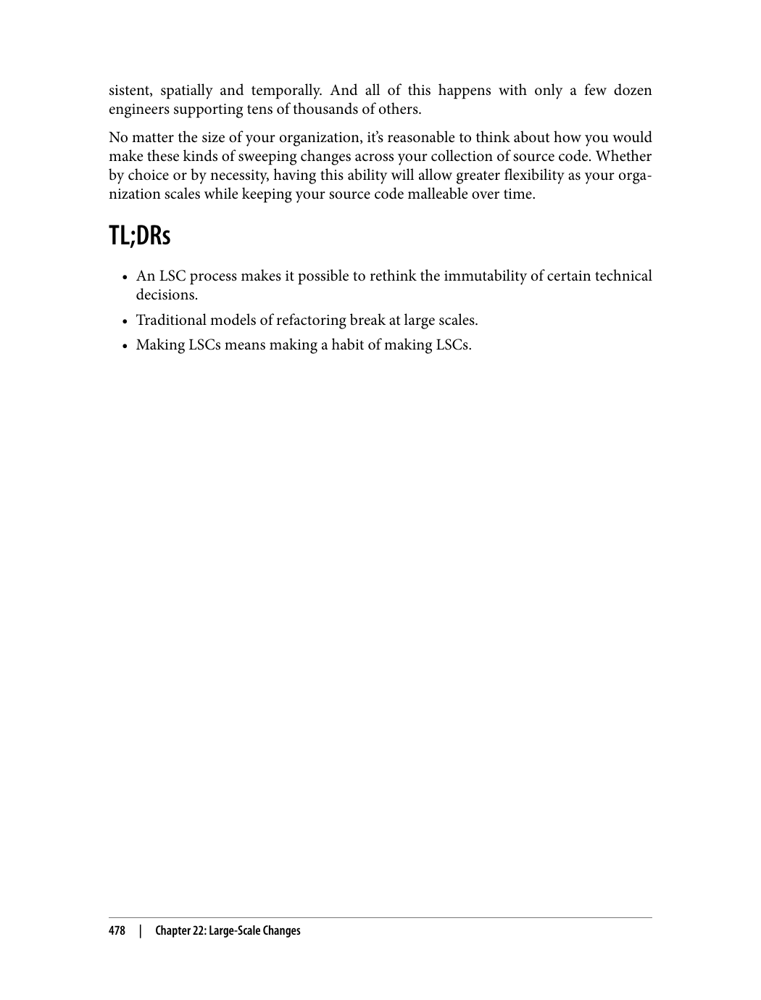

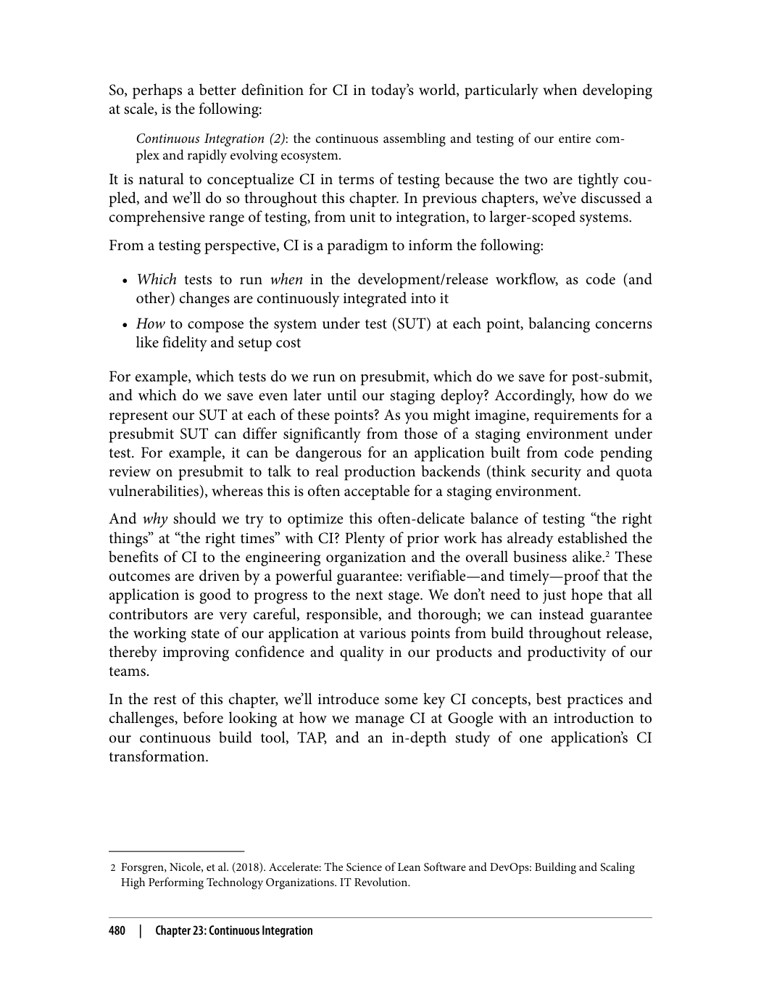

---

###### 📄 صفحه ۵۰۹
> • An incompatibility between our project and an upstream microservice depend‐
> ency, detected by a QA tester in our staging environment, when the upstream
> service deploys its latest changes
> • Bug reports by internal users who are opted in to a feature before external users
> • Bug or outage reports by external users or the press
> Canarying—or deploying to a small percentage of production first—can help mini‐
> mize issues that do make it to production, with a subset-of-production initial feed‐
> back loop preceding all-of-production. However, canarying can cause problems, too,
> particularly around compatibility between deployments when multiple versions are
> deployed at once. This is sometimes known as version skew, a state of a distributed
> system in which it contains multiple incompatible versions of code, data, and/or con‐
> figuration. Like many issues we look at in this book, version skew is another example
> of a challenging problem that can arise when trying to develop and manage software
> over time.
> Experiments and feature flags are extremely powerful feedback loops. They reduce
> deployment risk by isolating changes within modular components that can be
> dynamically toggled in production. Relying heavily on feature-flag-guarding is a
> common paradigm for Continuous Delivery, which we explore further in Chapter 24.
> Accessible and actionable feedback
> It’s also important that feedback from CI be widely accessible. In addition to our open
> culture around code visibility, we feel similarly about our test reporting. We have a
> unified test reporting system in which anyone can easily look up a build or test run,
> including all logs (excluding user Personally Identifiable Information [PII]), whether
> for an individual engineer’s local run or on an automated development or staging
> build.
> Along with logs, our test reporting system provides a detailed history of when build
> or test targets began to fail, including audits of where the build was cut at each run,
> where it was run, and by whom. We also have a system for flake classification, which
> uses statistics to classify flakes at a Google-wide level, so engineers don’t need to fig‐
> ure this out for themselves to determine whether their change broke another project’s
> test (if the test is flaky: probably not).
> Visibility into test history empowers engineers to share and collaborate on feedback,
> an essential requirement for disparate teams to diagnose and learn from integration
> failures between their systems. Similarly, bugs (e.g., tickets or issues) at Google are
> open with full comment history for all to see and learn from (with the exception,
> again, of customer PII).
> Finally, any feedback from CI tests should not just be accessible but actionable—easy
> to use to find and fix problems. We’ll look at an example of improving user-
> 482
> |
> Chapter 23: Continuous Integration

سوالات اصلی:
1. **کجا**: کجا می‌توانم کد مشابه پیدا کنم؟
2. **چه کسی**: چه کسی این کد را نوشته است؟
3. **چرا**: چرا کد به این شکل نوشته شده است؟
4. **چگونه**: دیگران چگونه مشابه این مشکل را حل کرده‌اند؟

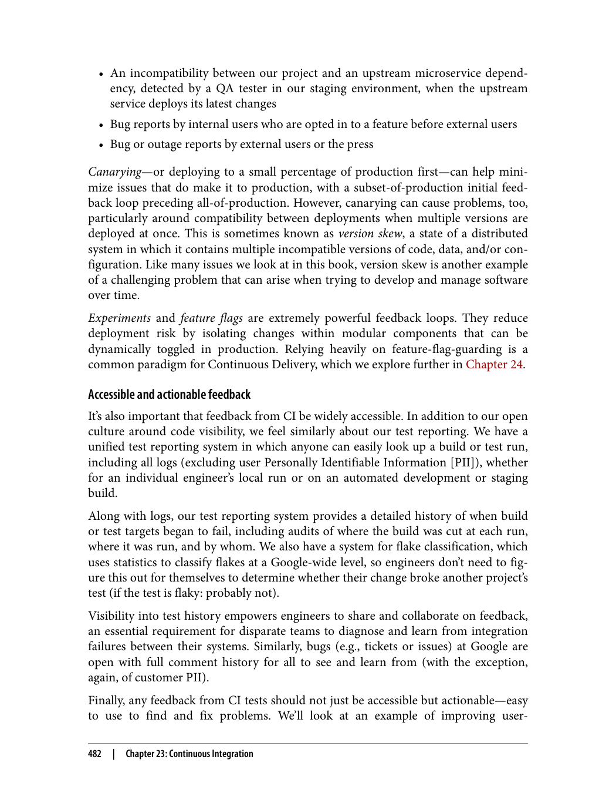

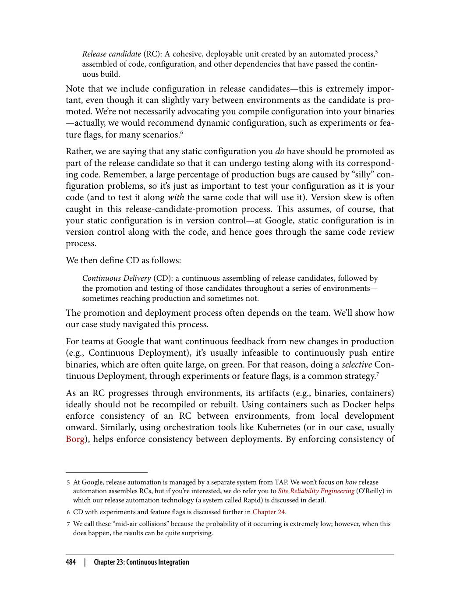

---

###### 📄 صفحه ۵۱۳
> 8 Each team at Google configures a subset of its project’s tests to run on presubmit (versus post-submit). In
> reality, our continuous build actually optimizes some presubmit tests to be saved for post-submit, behind the
> scenes. We’ll further discuss this later on in this chapter.
> and though generally rare, it happens most days at our scale. CI systems for smaller
> repositories or projects can avoid this problem by serializing submits so that there is
> no difference between what is about to enter and what just did.
> Presubmit versus post-submit
> So, which tests should be run on presubmit? Our general rule of thumb is: only fast,
> reliable ones. You can accept some loss of coverage on presubmit, but that means you
> need to catch any issues that slip by on post-submit, and accept some number of roll‐
> backs. On post-submit, you can accept longer times and some instability, as long as
> you have proper mechanisms to deal with it.
> We’ll show how TAP and our case study handle failure manage‐
> ment in “CI at Google” on page 493.
> We don’t want to waste valuable engineer productivity by waiting too long for slow
> tests or for too many tests—we typically limit presubmit tests to just those for the
> project where the change is happening. We also run tests concurrently, so there is a
> resource decision to consider as well. Finally, we don’t want to run unreliable tests on
> presubmit, because the cost of having many engineers affected by them, debugging
> the same problem that is not related to their code change, is too high.
> Most teams at Google run their small tests (like unit tests) on presubmit8—these are
> the obvious ones to run as they tend to be the fastest and most reliable. Whether and
> how to run larger-scoped tests on presubmit is the more interesting question, and
> this varies by team. For teams that do want to run them, hermetic testing is a proven
> approach to reducing their inherent instability. Another option is to allow large-
> scoped tests to be unreliable on presubmit but disable them aggressively when they
> start failing.
> Release candidate testing
> After a code change has passed the CB (this might take multiple cycles if there were
> failures), it will soon encounter CD and be included in a pending release candidate.
> As CD builds RCs, it will run larger tests against the entire candidate. We test a
> release candidate by promoting it through a series of test environments and testing it
> at each deployment. This can include a combination of sandboxed, temporary envi‐
> 486
> |
> Chapter 23: Continuous Integration

ویژگی‌های پیاده‌سازی:
1. **ایندکس جستجو**: ایندکس کردن کد برای جستجوی سریع
2. **رتبه‌بندی**: رتبه‌بندی نتایج بر اساس ارتباط
3. **رابط کاربری**: رابط کاربری ساده و قابل استفاده

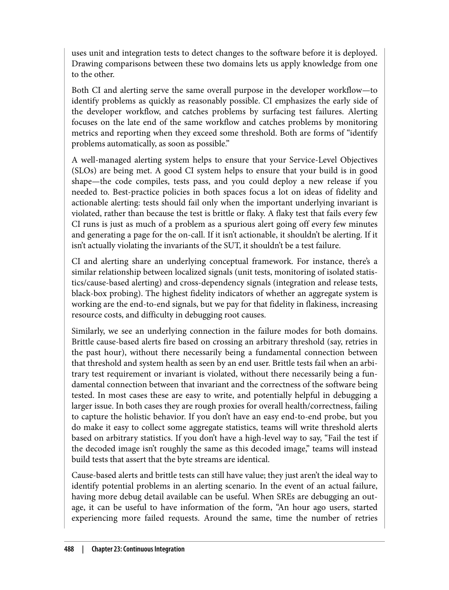

---

###### 📄 صفحه ۵۱۷
> CI Challenges
> We’ve discussed some of the established best practices in CI and have introduced
> some of the challenges involved, such as the potential disruption to engineer produc‐
> tivity of unstable, slow, conflicting, or simply too many tests at presubmit. Some com‐
> mon additional challenges when implementing CI include the following:
> • Presubmit optimization, including which tests to run at presubmit time given the
> potential issues we’ve already described, and how to run them.
> • Culprit finding and failure isolation: Which code or other change caused the
> problem, and which system did it happen in? “Integrating upstream microservi‐
> ces” is one approach to failure isolation in a distributed architecture, when you
> want to figure out whether a problem originated in your own servers or a back‐
> end. In this approach, you stage combinations of your stable servers along with
> upstream microservices’ new servers. (Thus, you are integrating the microservi‐
> ces’ latest changes into your testing.) This approach can be particularly challeng‐
> ing due to version skew: not only are these environments often incompatible, but
> you’re also likely to encounter false positives—problems that occur in a particular
> staged combination that wouldn’t actually be spotted in production.
> • Resource constraints: Tests need resources to run, and large tests can be very
> expensive. In addition, the cost for the infrastructure for inserting automated
> testing throughout the process can be considerable.
> There’s also the challenge of failure management—what to do when tests fail.
> Although smaller problems can usually be fixed quickly, many of our teams find that
> it’s extremely difficult to have a consistently green test suite when large end-to-end
> tests are involved. They inherently become broken or flaky and are difficult to debug;
> there needs to be a mechanism to temporarily disable and keep track of them so that
> the release can go on. A common technique at Google is to use bug “hotlists” filed by
> an on-call or release engineer and triaged to the appropriate team. Even better is
> when these bugs can be automatically generated and filed—some of our larger prod‐
> ucts, like Google Web Server (GWS) and Google Assistant, do this. These hotlists
> should be curated to make sure any release-blocking bugs are fixed immediately.
> Nonrelease blockers should be fixed, too; they are less urgent, but should also be pri‐
> oritized so the test suite remains useful and is not simply a growing pile of disabled,
> old tests. Often, the problems caught by end-to-end test failures are actually with tests
> rather than code.
> Flaky tests pose another problem to this process. They erode confidence similar to a
> broken test, but finding a change to roll back is often more difficult because the fail‐
> ure won’t happen all the time. Some teams rely on a tool to remove such flaky tests
> from presubmit temporarily while the flakiness is investigated and fixed. This keeps
> confidence high while allowing for more time to fix the problem.
> 490
> |
> Chapter 23: Continuous Integration

معاملات اصلی:
1. **完整性**: آیا همه نتایج نشان داده شوند یا فقط مرتبط‌ترین‌ها؟
2. **بیان‌گری**: آیا جستجو بر اساس توکن، زیررشته یا عبارت باشد؟
3. **رابط کاربری**: رابط کاربری باید ساده و قابل استفاده باشد

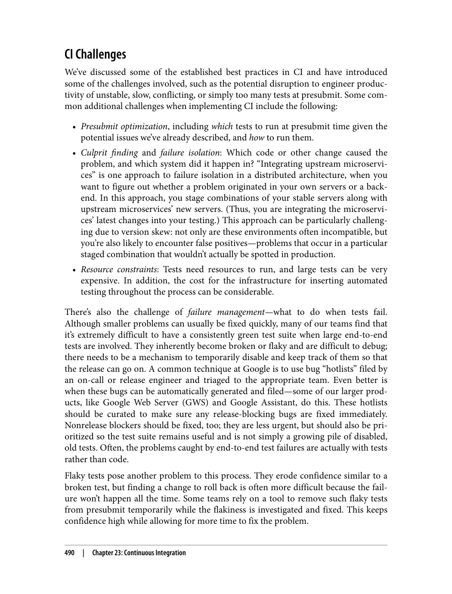

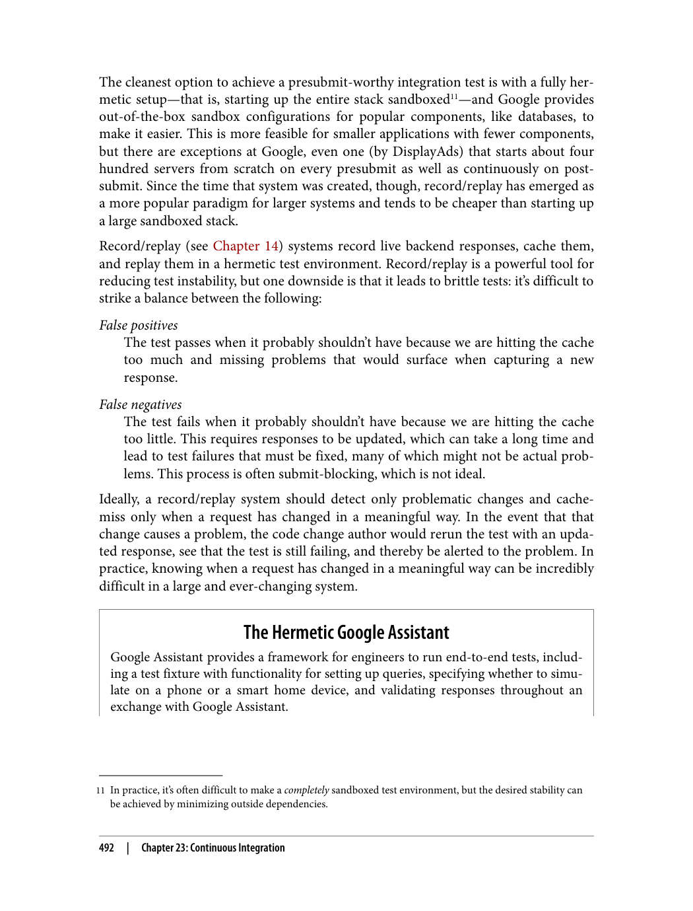

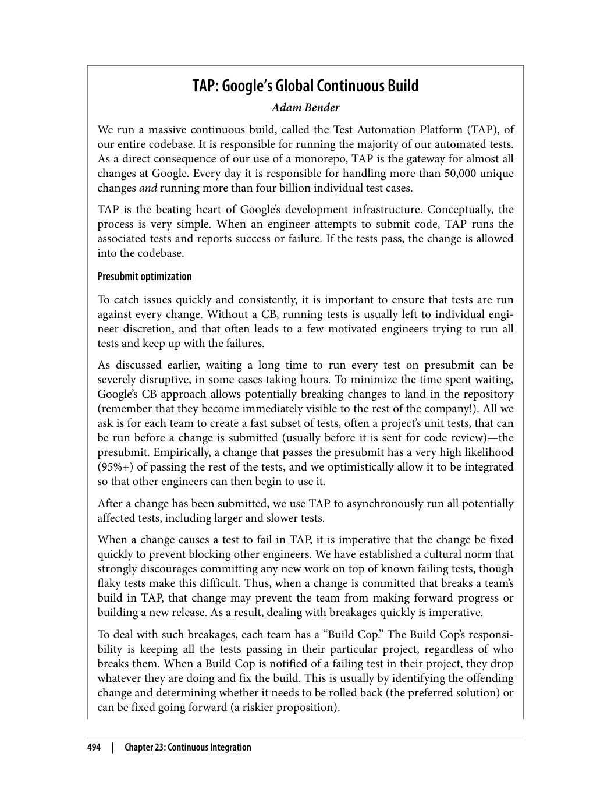

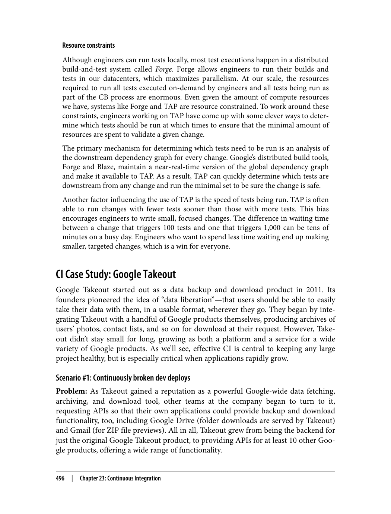

---
