## فصل ۲۳: جستجوی کد

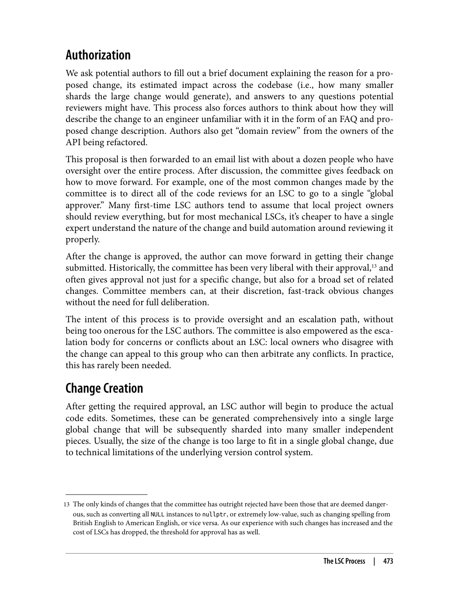

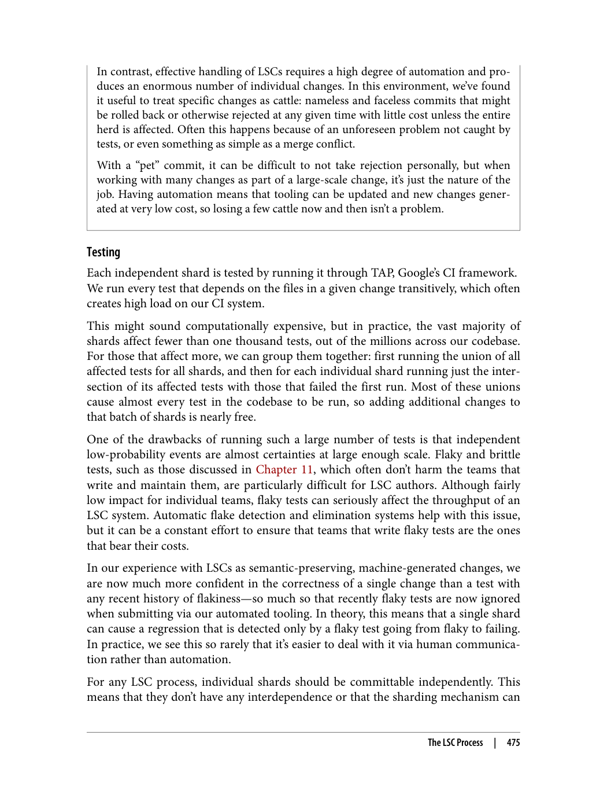

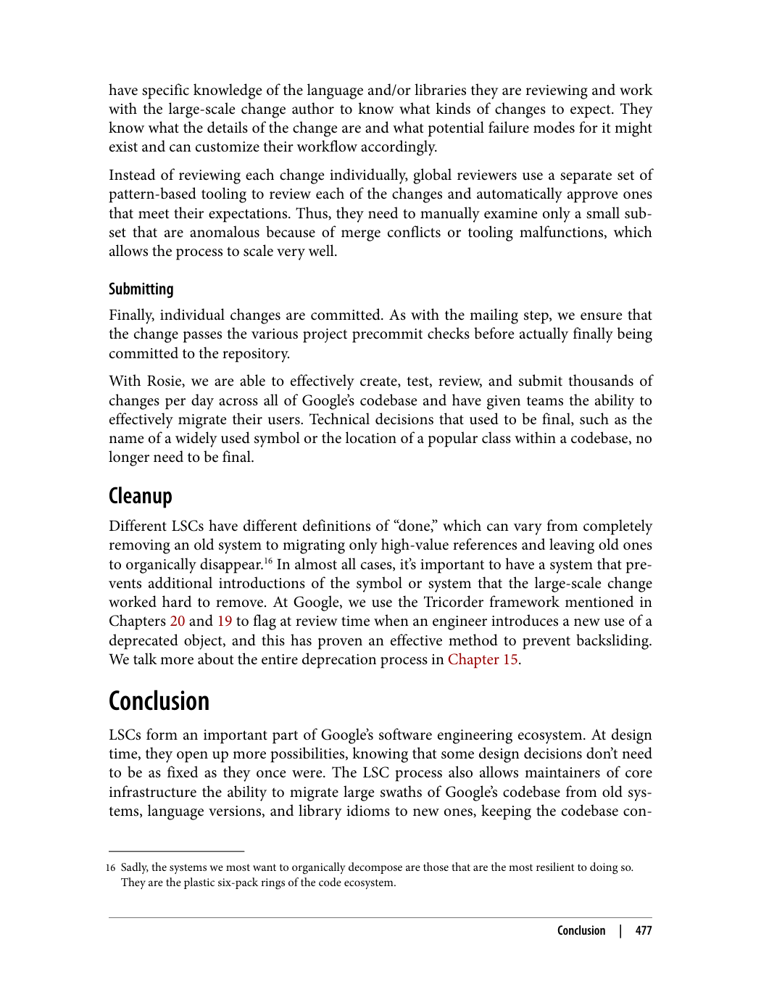

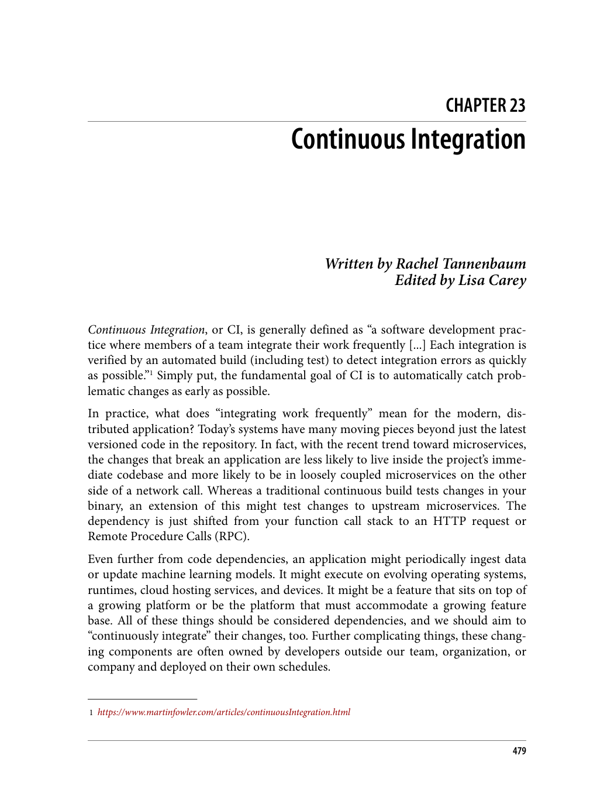

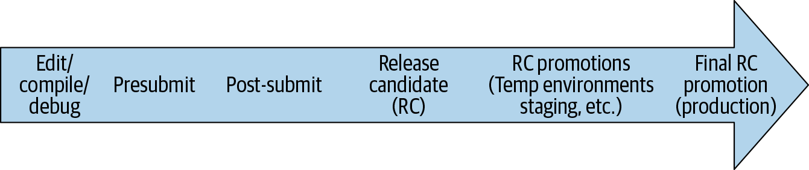

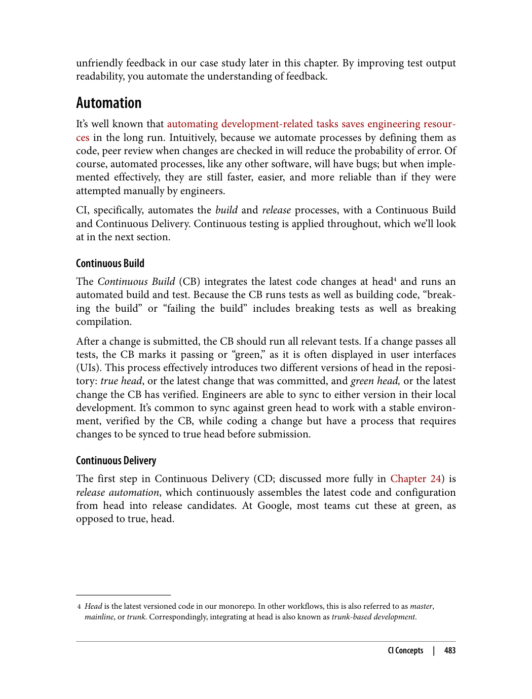

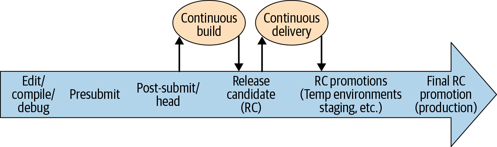

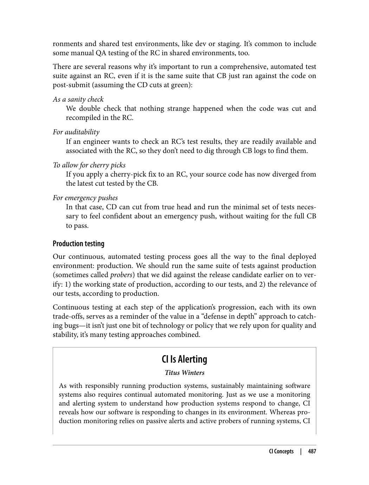

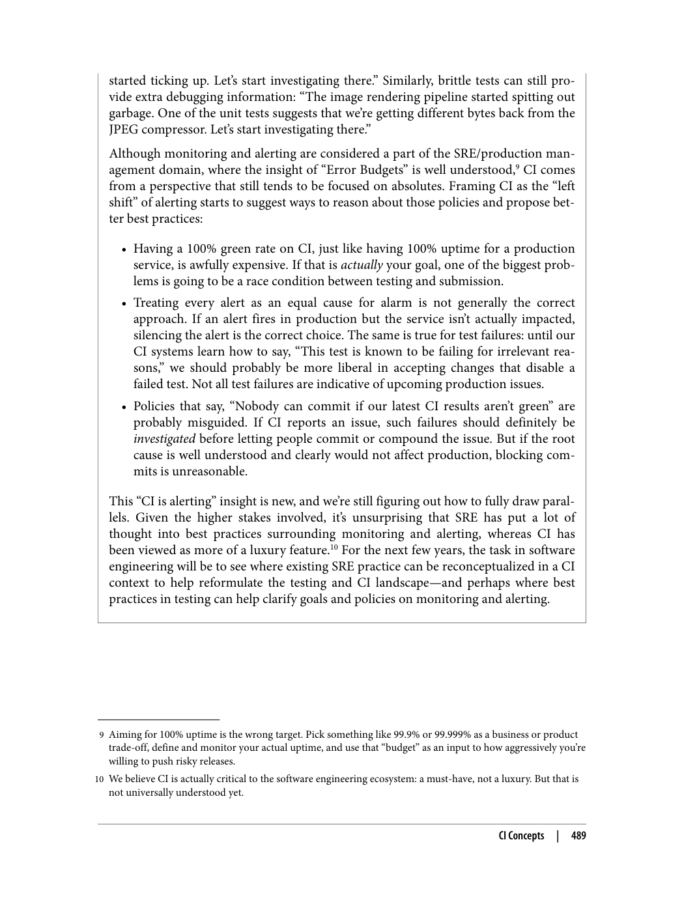

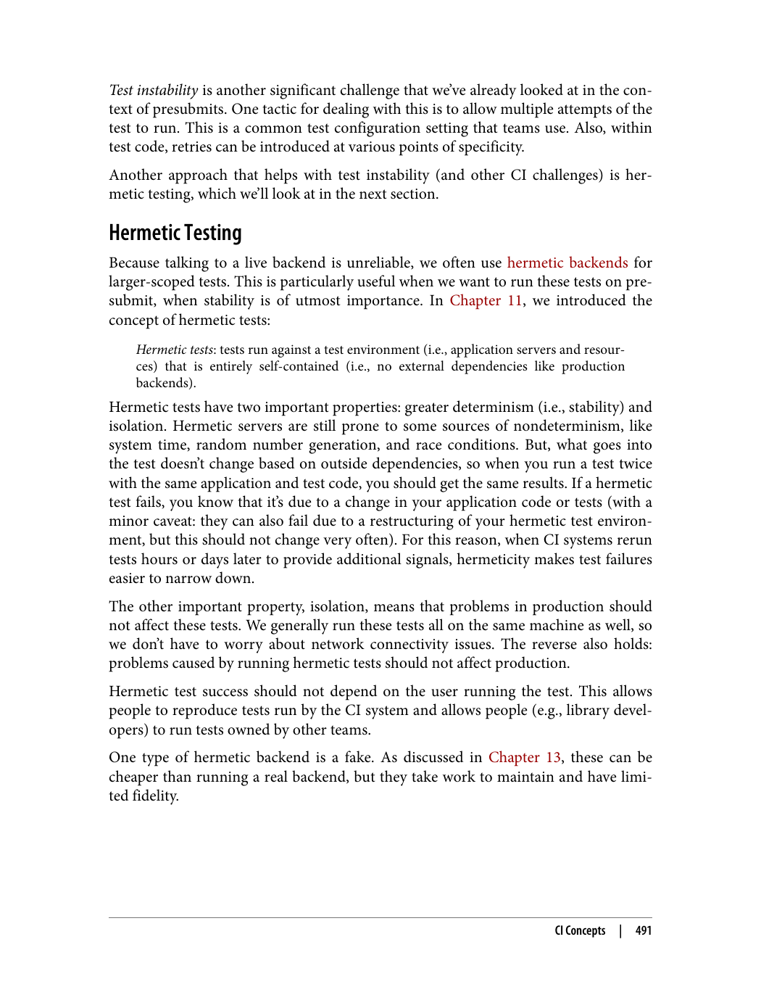

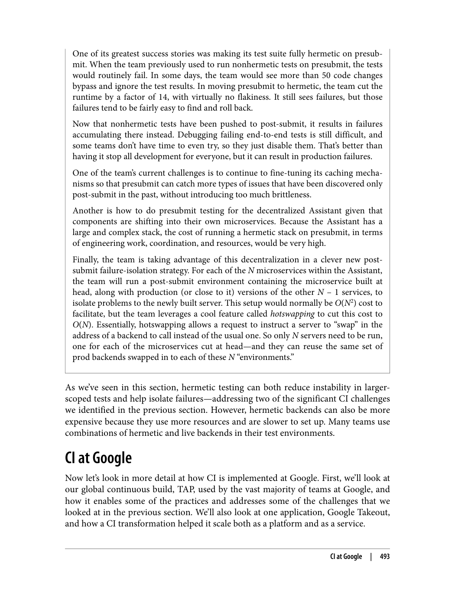

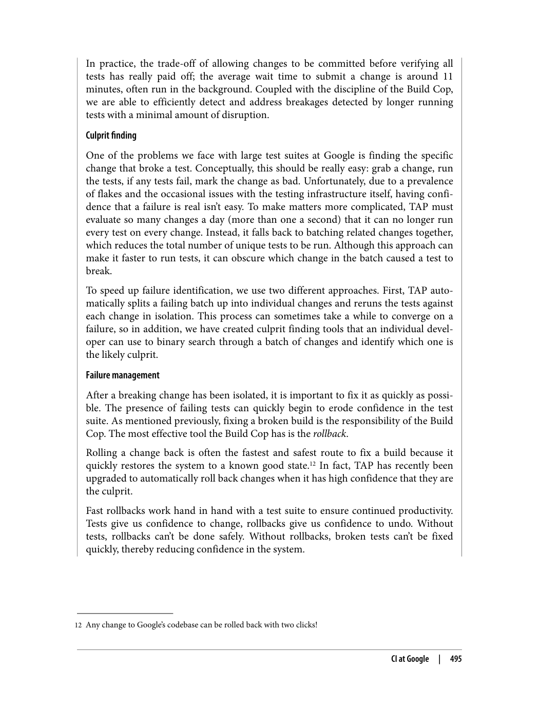

---

> "جستجوی کد، ابزاری برای ناوبری و درک پایگاه کد بزرگ است. این ابزار باید سریع، دقیق و قابل استفاده باشد."

### چرا جستجوی کد؟

> "جستجوی کد به توسعه‌دهندگان کمک می‌کند تا کد مورد نظر خود را سریع پیدا کنند."

دلایل اصلی:
1. **یافتن کد**: پیدا کردن کد مشابه یا مرتبط
2. **درک کد**: درک نحوه عملکرد کد
3. **یادگیری**: یادگیری از کد دیگران
4. **اشتراک‌گذاری**: اشتراک‌گذاری دانش

### نحوه استفاده گوگل از جستجوی کد

> "گوگل از جستجوی کد برای پاسخ به سوالات مختلف استفاده می‌کند."

سوالات اصلی:
1. **کجا**: کجا می‌توانم کد مشابه پیدا کنم؟
2. **چه کسی**: چه کسی این کد را نوشته است؟
3. **چرا**: چرا کد به این شکل نوشته شده است؟
4. **چگونه**: دیگران چگونه مشابه این مشکل را حل کرده‌اند؟

### پیاده‌سازی جستجوی کد گوگل

> "گوگل پیاده‌سازی خاصی برای جستجوی کد دارد."

ویژگی‌های پیاده‌سازی:
1. **ایندکس جستجو**: ایندکس کردن کد برای جستجوی سریع
2. **رتبه‌بندی**: رتبه‌بندی نتایج بر اساس ارتباط
3. **رابط کاربری**: رابط کاربری ساده و قابل استفاده

### معاملات در پیاده‌سازی

> "پیاده‌سازی جستجوی کد نیازمند معاملات بین ویژگی‌های مختلف است."

معاملات اصلی:
1. **完整性**: آیا همه نتایج نشان داده شوند یا فقط مرتبط‌ترین‌ها؟
2. **بیان‌گری**: آیا جستجو بر اساس توکن، زیررشته یا عبارت باشد؟
3. **رابط کاربری**: رابط کاربری باید ساده و قابل استفاده باشد

---