> **راهنمای مطالعه**
>
> در هر بخش، ابتدا متن اصلی کتاب به زبان انگلیسی آورده شده و سپس ترجمه و توضیحات فارسی همان بخش ارائه شده است.

---
-

###### 📄 صفحه ۵۲۵
> been approved), so the end-to-end tests could be run there. The post-submit CI runs
> every two hours, grabbing the latest code and configuration from green head, creates
> an RC, and runs the same end-to-end test suite against it that is already run in dev.
> Lesson learned.    Faster feedback loops prevent problems in dev deploys:
> • Moving tests for different Takeout products from "after nightly deploy" to pre‐
> submit prevented 95% of broken servers from bad configuration and reduced
> nightly deployment failures by 50%.
> • Though end-to-end tests couldn't be moved all the way to presubmit, they were
> still moved from "after nightly deploy" to "post-submit within two hours." This
> effectively cut the "culprit set" by 12 times.
> Scenario #2: Indecipherable test logs
> Problem: As Takeout incorporated more Google products, it grew into a mature plat‐
> form that allowed product teams to insert plug-ins, with product-specific data-
> fetching code, directly into Takeout's binary. For example, the Google Photos plug-in
> knows how to fetch photos, album metadata, and the like. Takeout expanded from its
> original "handful" of products to now integrate with more than 90.
> Takeout's end-to-end tests dumped its failures to a log, and this approach didn't scale
> to 90 product plug-ins. As more products integrated, more failures were introduced.
> Even though the team was running the tests earlier and more often with the addition
> of the post-submit CI, multiple failures would still pile up inside and were easy to
> miss. Going through these logs became a frustrating time sink, and the tests were
> almost always failing.
> What the team did.    The team refactored the tests into a dynamic, configuration-based
> suite (using a parameterized test runner) that reported results in a friendlier UI,
> clearly showing individual test results as green or red: no more digging through logs.
> They also made failures much easier to debug, most notably, by displaying failure
> information, with links to logs, directly in the error message. For example, if Takeout
> failed to fetch a file from Gmail, the test would dynamically construct a link that
> searched for that file's ID in the Takeout logs and include it in the test failure message.
> This automated much of the debugging process for product plug-in engineers and
> required less of the Takeout team's assistance in sending them logs, as demonstrated
> in Figure 23-3.
> 498
> |
> Chapter 23: Continuous Integration

**درس‌های آموخته Takeout و لاگ‌های test**

حلقه‌های بازخورد سریع‌تر از مشکلات در استقرارهای dev جلوگیری می‌کنند:
• انتقال تست‌های محصولات مختلف Takeout از «بعد از استقرار شبانه» به presubmit از ۹۵٪ سرورهای شکسته ناشی از پیکربندی بد جلوگیری کرد و شکست‌های استقرار شبانه را ۵۰٪ کاهش داد.
• اگرچه تست‌های end-to-end نمی‌توانستند کاملاً به presubmit منتقل شوند، اما همچنان از «بعد از استقرار شبانه» به «post-submit در عرض دو ساعت» منتقل شدند. این به طور مؤثر «مجموعه مقصر» را ۱۲ برابر کاهش داد.

**سناریوی ۲: لاگ‌های test غیرقابل خواندن**

مشکل: Takeout محصولات بیشتری از گوگل را در خود جای داد و به یک پلتفرم بالغ تبدیل شد که به تیم‌های محصول اجازه می‌داد پلاگین‌ها را با کد واکشی داده‌های خاص محصول مستقیماً در باینری Takeout درج کنند. برای مثال، پلاگین Google Photos نحوه واکشی عکس‌ها، متاداده آلبوم‌ها و مانند آن را می‌داند. Takeout از تعداد «اندکی» محصول اصلی به بیش از ۹۰ محصول گسترش یافت.

تست‌های end-to-end Takeout شکست‌های خود را در یک لاگ ریخت و این رویکرد برای ۹۰ پلاگین محصول مقیاس‌پذیر نبود. با یکپارچه شدن محصولات بیشتر، شکست‌های بیشتری معرفی شد. اگرچه تیم تست‌ها را زودتر و بیشتر با اضافه کردن post-submit CI اجرا می‌کرد، شکست‌های متعدد هنوز در داخل انباشته می‌شدند و به راحتی قابل چشم پوشی بودند. مرور این لاگ‌ها به یک حفره زمانی ناامیدکننده تبدیل شد و تست‌ها تقریباً همیشه شکست می‌خوردند.

**کاری که تیم انجام داد**

تیم تست‌ها را به یک مجموعه پویا و مبتنی بر پیکربندی بازآرایی کرد (با استفاده از یک test runner پارامتری) که نتایج را در یک رابط کاربری دوستانه‌تر گزارش می‌داد و به وضوح نتایج تست‌های جداگانه را به رنگ سبز یا قرمز نشان می‌داد: دیگر نیازی به کندن لاگ‌ها نبود. آن‌ها همچنین شکست‌ها را بسیار آسان‌تر برای دیباگ کردن ساختند، به ویژه با نمایش اطلاعات شکست، با پیوندهایی به لاگ‌ها، مستقیماً در پیام خطا. برای مثال، اگر Takeout نمی‌توانست فایلی را از Gmail واکشی کند، تست به طور پویا پیوندی می‌ساخت که شناسه آن فایل را در لاگ‌های Takeout جستجو می‌کرد و آن را در پیام شکست تست شامل می‌کرد. این بخش زیادی از فرآیند دیباگ را برای مهندسان پلاگین محصول خودکار کرد و به کمتری کمک تیم Takeout در ارسال لاگ‌ها نیاز داشت.

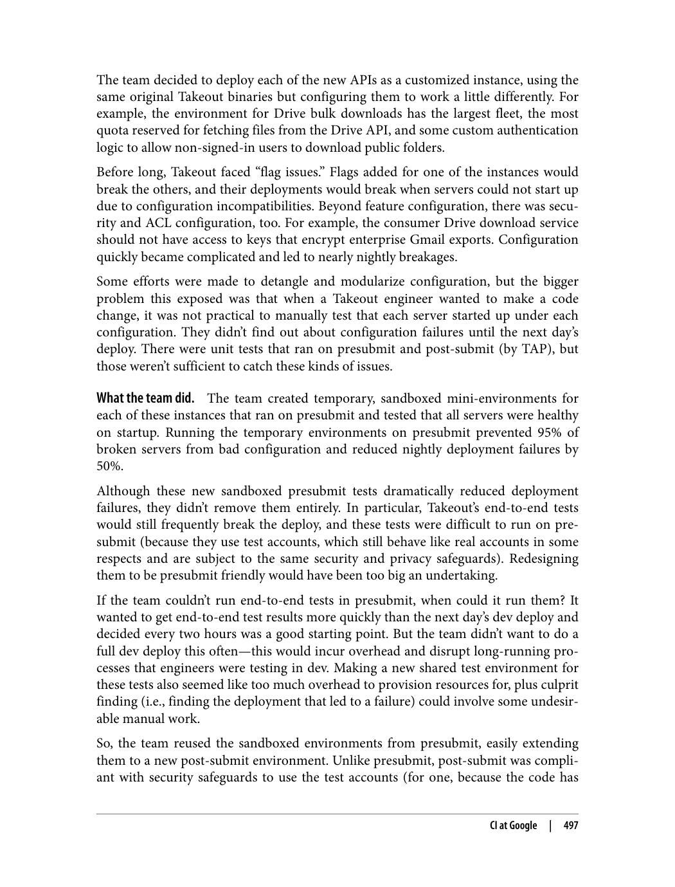

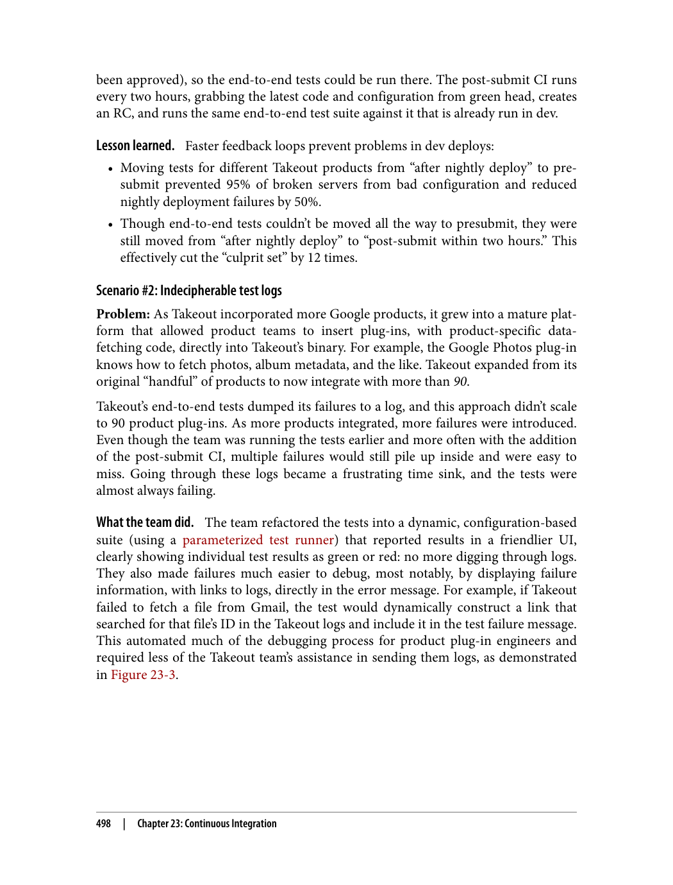

---

###### 📄 صفحه ۵۲۷
> Remaining challenge.    Going forward, the burden of testing "all of Google" (obviously,
> this is an exaggeration, as most product problems are caught by their respective
> teams) grows as Takeout integrates with more products and as those products
> become more complex. Manual comparisons between this CI and prod are an expen‐
> sive use of the Build Cop's time.
> Future improvement.    This presents an interesting opportunity to try hermetic testing
> with record/replay in Takeout's post-submit CI. In theory, this would eliminate fail‐
> ures from backend product APIs surfacing in Takeout's CI, which would make the
> suite more stable and effective at catching failures in the last two hours of Takeout
> changes—which is its intended purpose.
> Scenario #4: Keeping it green
> Problem: As the platform supported more product plug-ins, which each included
> end-to-end tests, these tests would fail and the end-to-end test suites were nearly
> always broken. The failures could not all be immediately fixed. Many were due to
> bugs in product plug-in binaries, which the Takeout team had no control over. And
> some failures mattered more than others—low-priority bugs and bugs in the test
> code did not need to block a release, whereas higher-priority bugs did. The team
> could easily disable tests by commenting them out, but that would make the failures
> too easy to forget about.
> One common source of failures: tests would break when product plug-ins were roll‐
> ing out a feature. For example, a playlist-fetching feature for the YouTube plug-in
> might be enabled for testing in dev for a few months before being enabled in prod.
> The Takeout tests only knew about one result to check, so that often resulted in the
> test needing to be disabled in particular environments and manually curated as the
> feature rolled out.
> What the team did.    The team came up with a strategic way to disable failing tests by
> tagging them with an associated bug and filing that off to the responsible team (usu‐
> ally a product plug-in team). When a failing test was tagged with a bug, the team's
> testing framework would suppress its failure. This allowed the test suite to stay green
> and still provide confidence that everything else, besides the known issues, was pass‐
> ing, as illustrated in Figure 23-4.
> 500
> |
> Chapter 23: Continuous Integration

**چالش‌های باقیمانده و حفظ سبز بودن مجموعه تست**

چالش باقیمانده: در ادامه، بار تست کردن «تمام گوگل» (که واضح است اغراق است زیرا بیشتر مشکلات محصول توسط تیم‌های مربوطه شناسایی می‌شوند) با یکپارچه شدن Takeout با محصولات بیشتر و پیچیده‌تر شدن آن محصولات افزایش می‌یابد. مقایسه‌های دستی بین این CI و production استفاده پرهزینه‌ای از زمان Build Cop است.

بهبود آینده: این فرصت جالبی برای آزمایش تست hermetic با record/replay در post-submit CI Takeout فراهم می‌کند. از نظر تئوری، این شکست‌های ناشی از APIهای محصول backend را که در CI Takeout ظاهر می‌شوند حذف می‌کند، که مجموعه را پایدارتر و مؤثرتر در شکار شکست‌ها در دو ساعت آخر تغییرات Takeout می‌کند — که هدف مورد نظر آن است.

**سناریوی ۴: حفظ سبز بودن (Keeping it Green)**

مشکل: با پشتیبانی پلتفرم از پلاگین‌های محصول بیشتر که هر کدام تست‌های end-to-end داشتند، این تست‌ها شکست می‌خوردند و مجموعه تست‌های end-to-end تقریباً همیشه شکسته بود. شکست‌ها نمی‌توانستند همه فوراً رفع شوند. بسیاری به دلیل باگ‌هایی در باینری پلاگین‌های محصول بود که تیم Takeout هیچ کنترلی روی آن‌ها نداشت. و برخی شکست‌ها مهم‌تر از بقیه بودند — باگ‌های کم‌اولویت و باگ‌های در کد تست نیازی به مسدود کردن انتشار نداشتند، در حالی که باگ‌های با اولویت بالاتر نیاز داشتند.

یک منبع رایج شکست‌ها: تست‌ها زمانی شکست می‌خوردند که پلاگین‌های محصول در حال استقرار یک ویژگی بودند. برای مثال، ویژگی واکشی playlist برای پلاگین YouTube ممکن است چندین ماه برای تست در dev فعال باشد قبل از اینکه در production فعال شود. تست‌های Takeout فقط یک نتیجه برای بررسی می‌دانستند و این اغلب منجر به نیاز به غیرفعال کردن تست در محیط‌های خاص و مدیریت دستی آن با پیشرفت ویژگی می‌شد.

**کاری که تیم انجام داد**

تیم راهبردی برای غیرفعال کردن تست‌های شکست خورده با برچسب زدن آن‌ها با باگ مرتبط و ارسال آن به تیم مسئول (معمولاً تیم پلاگین محصول) ابداع کرد. وقتی یک تست شکست خورده با باگ برچسب زده می‌شد، چارچوب تست تیم شکست آن را سرکوب می‌کرد. این به مجموعه تست اجازه می‌داد سبز باقی بماند و همچنان اطمینان ایجاد کند که همه چیزهای دیگر، به جز مشکلات شناخته شده، رد شده‌اند.

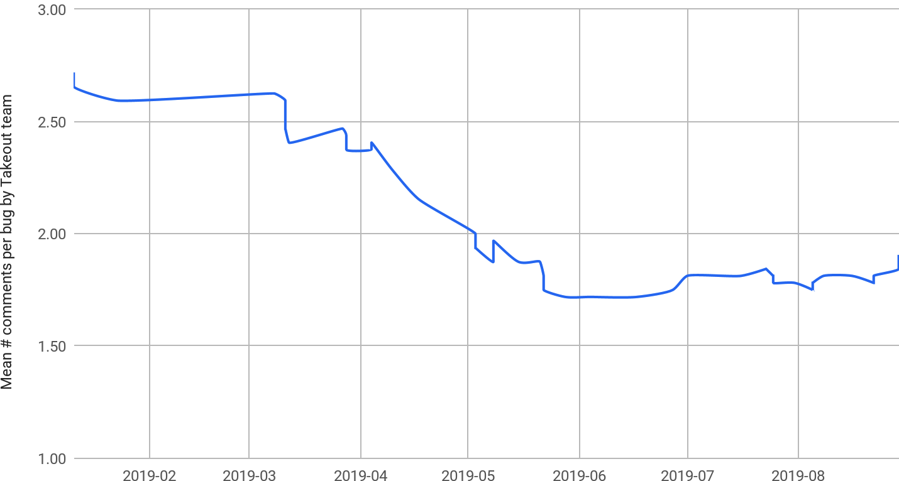

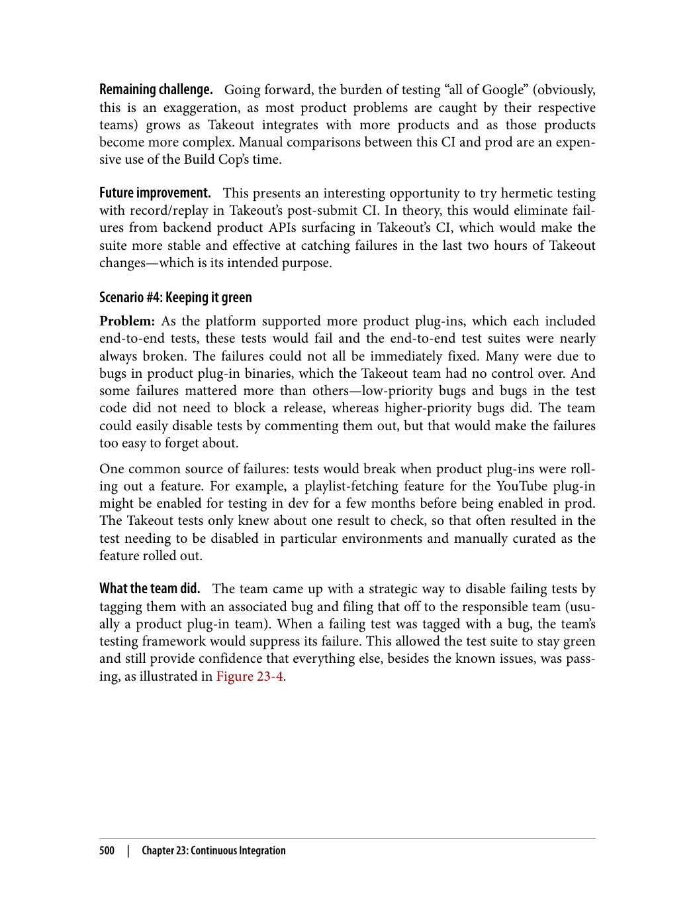

---

###### 📄 صفحه ۵۲۹
> Figure 23-5. Mean time to close bug, after fix submitted
> Lessons learned.    Disabling failing tests that can't be immediately fixed is a practical
> approach to keeping your suite green, which gives confidence that you're aware of all
> test failures. Also, automating the test suite's maintenance, including rollout manage‐
> ment and updating tracking bugs for fixed tests, keeps the suite clean and prevents
> technical debt. In DevOps parlance, we could call the metric in Figure 23-5 MTTCU:
> mean time to clean up.
> Future improvement.    Automating the filing and tagging of bugs would be a helpful
> next step. This is still a manual and burdensome process. As mentioned earlier, some
> of our larger teams already do this.
> Further challenges.    The scenarios we've described are far from the only CI challenges
> faced by Takeout, and there are still more problems to solve. For example, we men‐
> tioned the difficulty of isolating failures from upstream services in "CI Challenges" on
> page 490. This is a problem that Takeout still faces with rare breakages originating
> with upstream services, such as when a security update in the streaming infrastruc‐
> ture used by Takeout's "Drive folder downloads" API broke archive decryption when
> it deployed to production. The upstream services are staged and tested themselves,
> but there is no simple way to automatically check with CI if they are compatible with
> Takeout after they're launched into production. An initial solution involved creating
> an "upstream staging" CI environment to test production Takeout binaries against
> the staged versions of their upstream dependencies. However, this proved difficult to
> maintain, with additional compatibility issues between staging and production
> versions.
> 502
> |
> Chapter 23: Continuous Integration

**درس‌های آموخته و چالش‌های بیشتر**

درس‌های آموخته: غیرفعال کردن تست‌های شکست خورده‌ای که نمی‌توانند فوراً رفع شوند رویکردی عملی برای سبز نگه داشتن مجموعه شماست، که اطمینان ایجاد می‌کند که از تمام شکست‌های تست آگاه هستید. همچنین، خودکارسازی نگهداری مجموعه تست، از جمله مدیریت استقرار و به‌روزرسانی باگ‌های ردیابی برای تست‌های رفع شده، مجموعه را تمیز نگه می‌دارد و از بدهی فنی جلوگیری می‌کند. به زبان DevOps، می‌توانیم معیار در شکل ۲۳-۵ را MTTCU بنامیم: میانگین زمان برای پاکسازی.

بهبود آینده: خودکارسازی ثبت و برچسب زدن باگ‌ها گام مفید بعدی خواهد بود. این هنوز یک فرآیند دستی و طاقت‌فرساست. همان‌طور که قبلاً ذکر شد، برخی از تیم‌های بزرگتر ما قبلاً این کار را انجام می‌دهند.

**چالش‌های بیشتر**

سناریوهایی که توصیف کرده‌ایم تنها چالش‌های CI مواجه شده توسط Takeout نیستند و هنوز مشکلات بیشتری برای حل وجود دارد. برای مثال، ما دشواری ایزوله کردن شکست‌ها از سرویس‌های upstream را در «چالش‌های CI» ذکر کردیم. این مشکلی است که Takeout هنوز با شکست‌های نادری که از سرویس‌های upstream نشأت می‌گیرند با آن مواجه است، مانند زمانی که به‌روزرسانی امنیتی در زیرساخت streaming که توسط API «دانلود پوشه Drive» Takeout استفاده می‌شود رمزگشایی آرشیو را هنگام استقرار در production شکست. سرویس‌های upstream خودشان آماده‌سازی و تست می‌شوند، اما راه ساده‌ای برای بررسی خودکار با CI وجود ندارد که آیا پس از راه‌اندازی در production با Takeout سازگار هستند یا خیر.

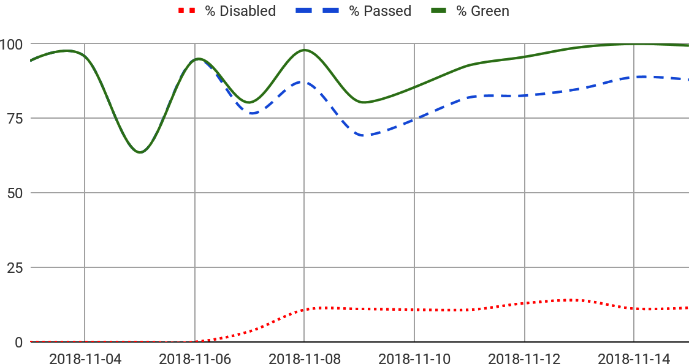

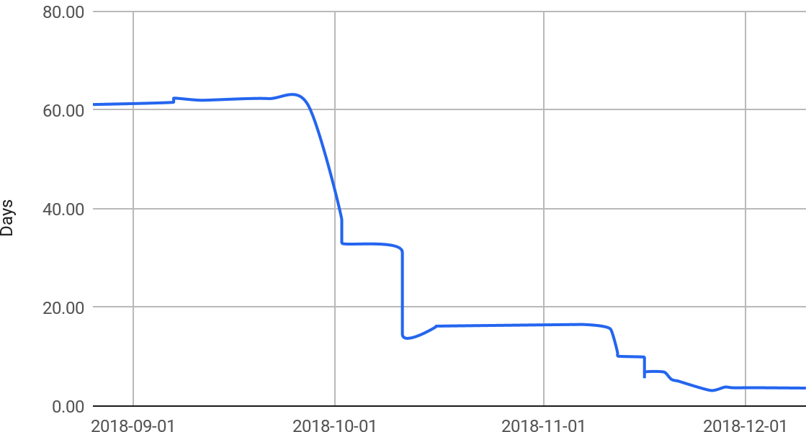

---

###### 📄 صفحه ۵۳۱

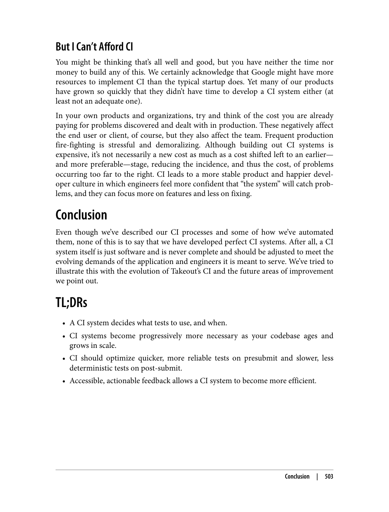

---

###### 📄 صفحه ۵۳۳
> time between "code complete" and user feedback minimizes the cost of work that is in
> progress.
> You get extraordinary outcomes by realizing that the launch never lands but that it
> begins a learning cycle where you then fix the next most important thing, measure how
> it went, fix the next thing, etc.—and it is never complete.
> —David Weekly, Former Google product manager
> At Google, the practices we describe in this book allow hundreds (or in some cases
> thousands) of engineers to quickly troubleshoot problems, to independently work on
> new features without worrying about the release, and to understand the effectiveness
> of new features through A/B experimentation. This chapter focuses on the key levers
> of rapid innovation, including managing risk, enabling developer velocity at scale,
> and understanding the cost and value trade-off of each feature you launch.
> Idioms of Continuous Delivery at Google
> A core tenet of Continuous Delivery (CD) as well as of Agile methodology is that
> over time, smaller batches of changes result in higher quality; in other words, faster is
> safer. This can seem deeply controversial to teams at first glance, especially if the pre‐
> requisites for setting up CD—for example, Continuous Integration (CI) and testing—
> are not yet in place. Because it might take a while for all teams to realize the ideal of
> CD, we focus on developing various aspects that deliver value independently en route
> to the end goal. Here are some of these:
> Agility
> Release frequently and in small batches
> Automation
> Reduce or remove repetitive overhead of frequent releases
> Isolation
> Strive for modular architecture to isolate changes and make troubleshooting eas‐
> ier
> Reliability
> Measure key health indicators like crashes or latency and keep improving them
> Data-driven decision making
> Use A/B testing on health metrics to ensure quality
> Phased rollout
> Roll out changes to a few users before shipping to everyone
> At first, releasing new versions of software frequently might seem risky. As your user‐
> base grows, you might fear the backlash from angry users if there are any bugs that
> you didn't catch in testing, and you might quite simply have too much new code in
> 506
> |
> Chapter 24: Continuous Delivery

**اصول تحویل مداوم در گوگل**

یک اصل اساسی تحویل مداوم (CD) و همچنین متدولوژی Agile این است که با گذشت زمان، دسته‌های کوچکتر تغییرات به کیفیت بالاتر منجر می‌شوند؛ به عبارت دیگر، سریع‌تر ایمن‌تر است. این ممکن است در نگاه اول برای تیم‌ها بحث‌برانگیز به نظر برسد، به ویژه اگر پیش‌نیازهای راه‌اندازی CD — مانند Continuous Integration (CI) و تست — هنوز در جای خود قرار نگرفته باشند. از آنجا که ممکن است مدتی طول بکشد تا همه تیم‌ها آرمان CD را درک کنند، ما بر توسعه جنبه‌های مختلفی که به طور مستقل در مسیر هدف نهایی ارزش ایجاد می‌کنند تمرکز می‌کنیم. برخی از اینها:

**چابکی (Agility)**: به طور مکرر و در دسته‌های کوچک منتشر کنید

**اتوماسیون (Automation)**: هزینه‌های تکراری انتشارهای مکرر را کاهش یا حذف کنید

**ایزوله‌سازی (Isolation)**: به دنبال معماری ماژولار برای ایزوله کردن تغییرات و آسان‌تر کردن عیب‌یابی باشید

**قابلیت اطمینان (Reliability)**: معیارهای سلامت کلیدی مانند crashها یا latency را اندازه‌گیری کنید و به بهبود آن‌ها ادامه دهید

**تصمیم‌گیری مبتنی بر داده (Data-driven Decision Making)**: از A/B testing روی معیارهای سلامت برای تضمین کیفیت استفاده کنید

**استقرار تدریجی (Phased Rollout)**: تغییرات را قبل از ارسال به همه، به تعداد کمی از کاربران ارائه دهید

در ابتدا، انتشار مکرر نسخه‌های جدید نرم‌افزار ممکن است پرخطر به نظر برسد. با رشد پایگاه کاربری شما، ممکن است از واکنش کاربران عصبانی بترسید اگر باگ‌هایی وجود داشته باشد که در تست شکار نکرده‌اید، و ممکن است به سادگی کد جدید بیش از حد زیادی در کد خود داشته باشید که آن را در تست پوشش نداده‌اید.

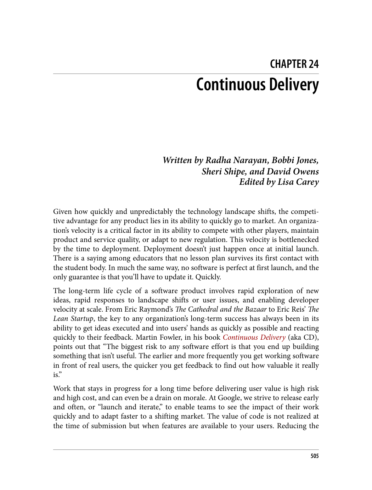

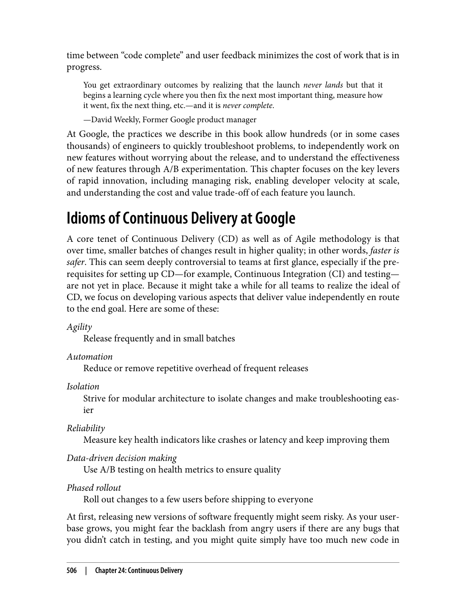

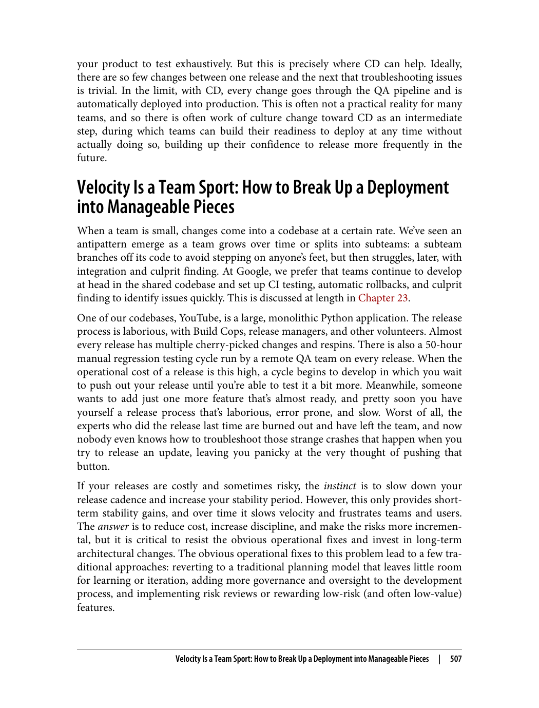

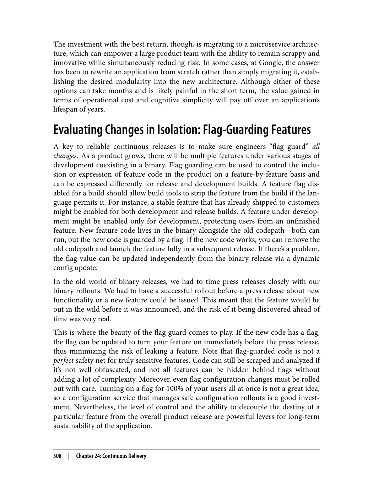

---