## فصل ۲۵: محاسبات به‌عنوان سرویس

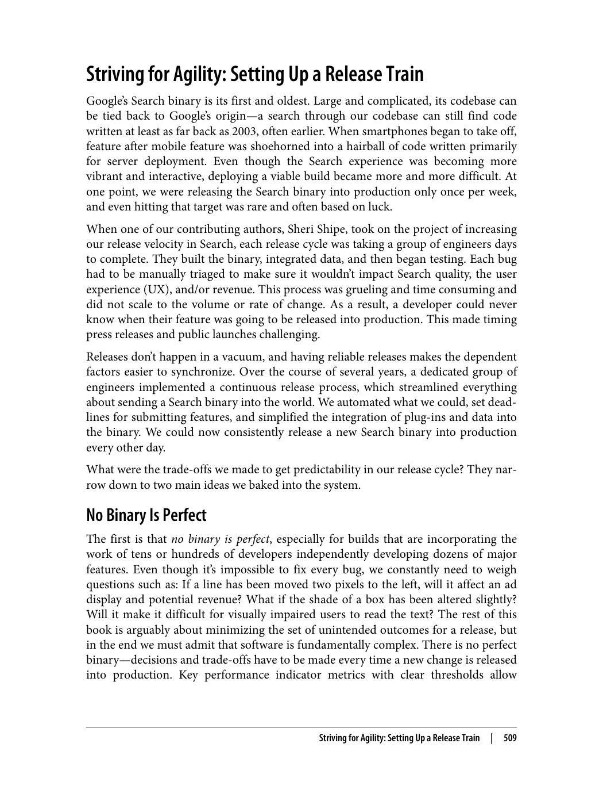

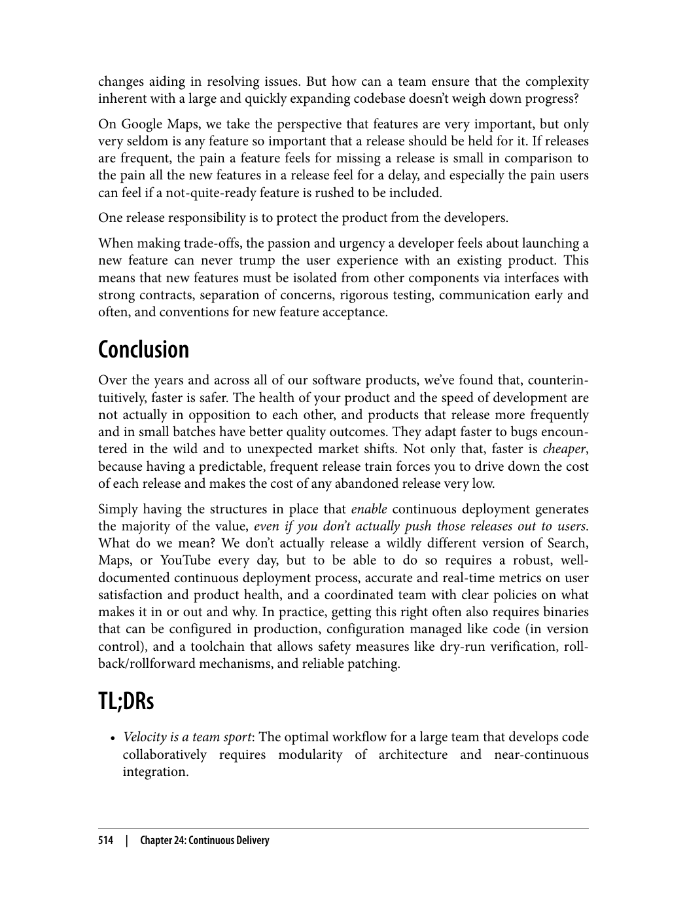

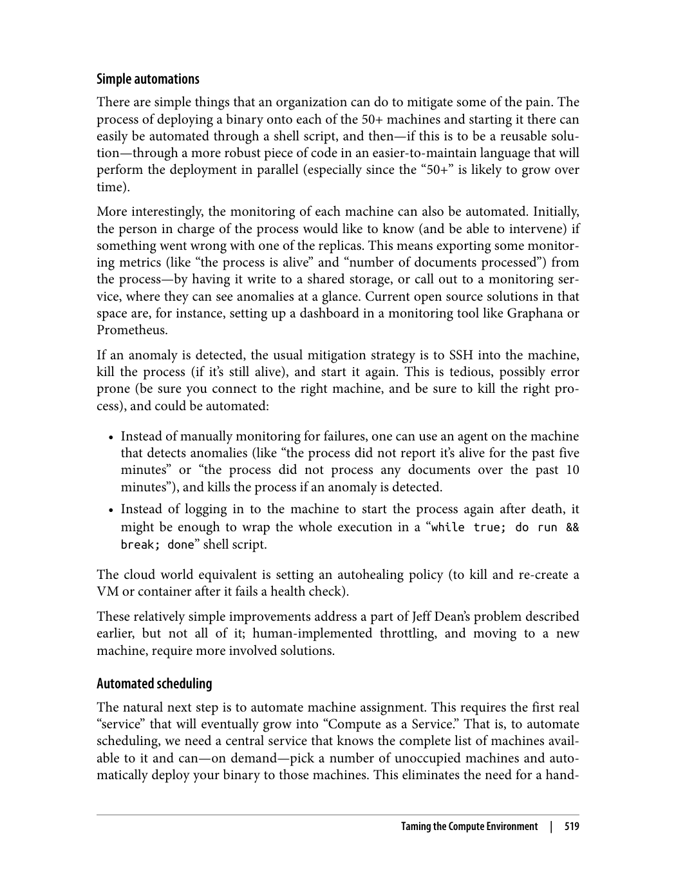

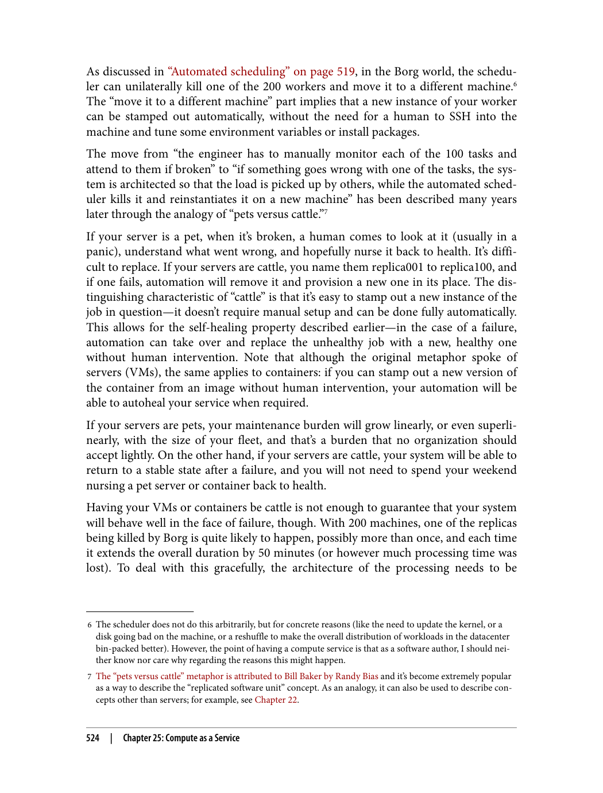

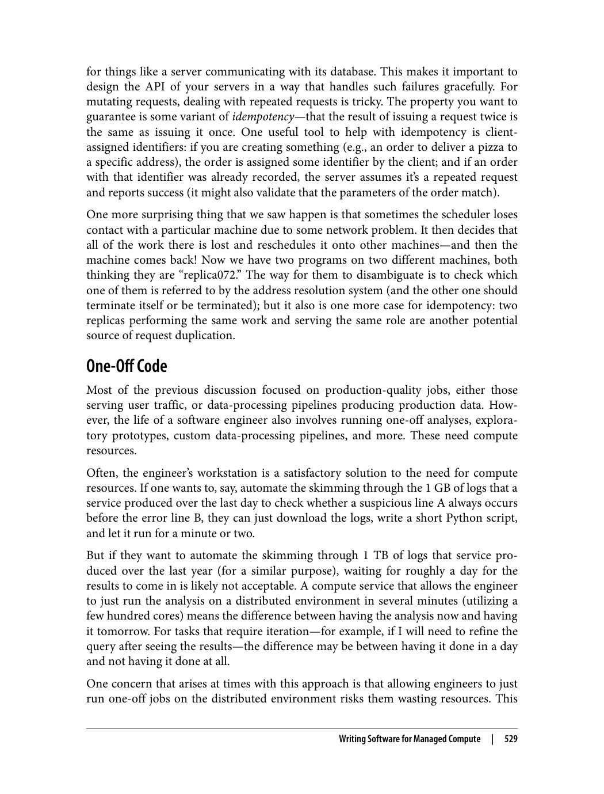

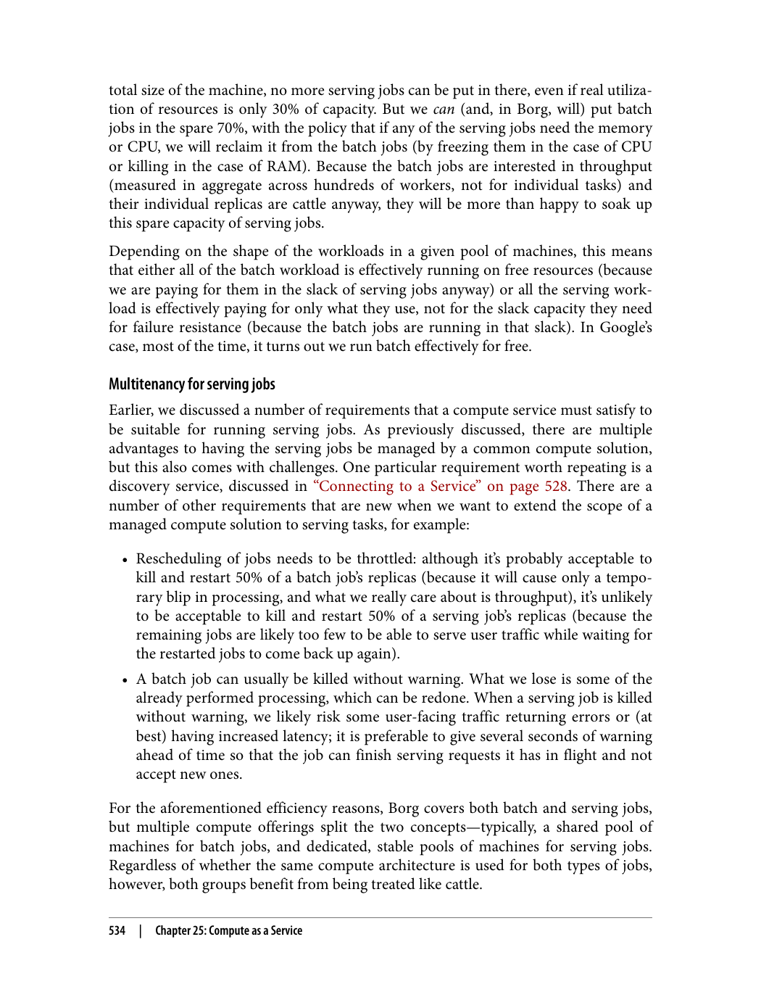

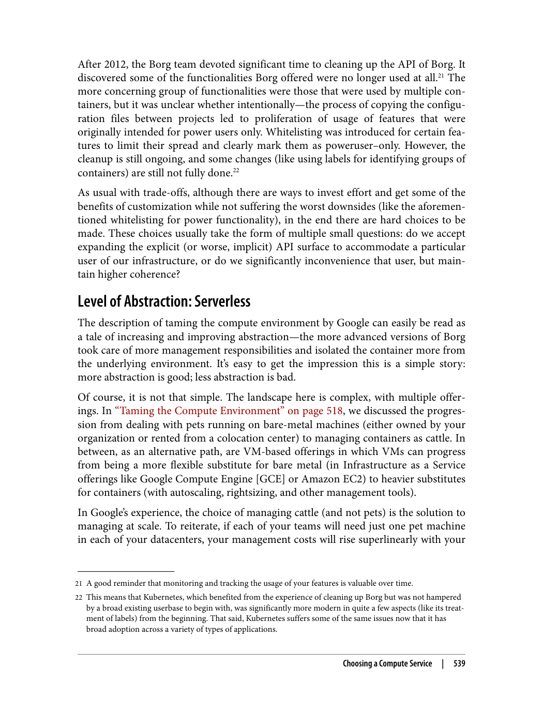

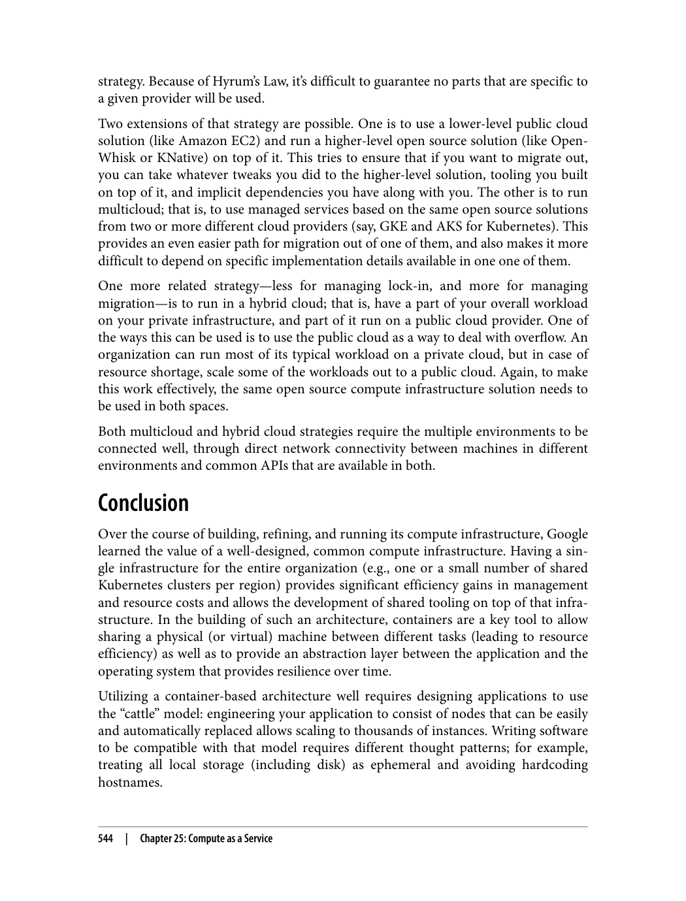

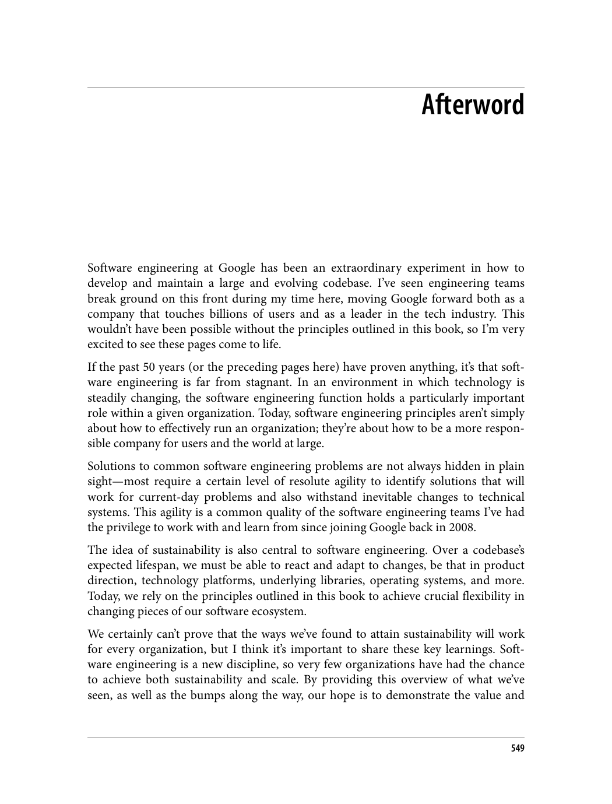

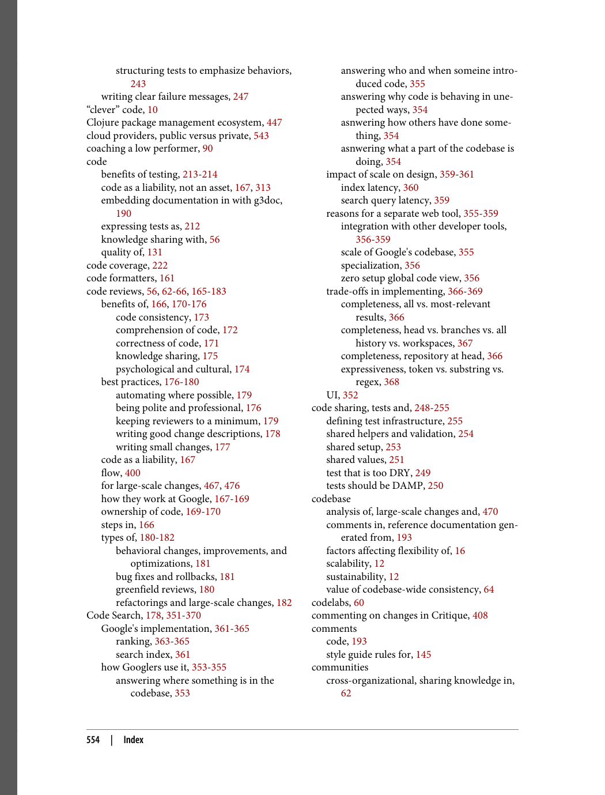

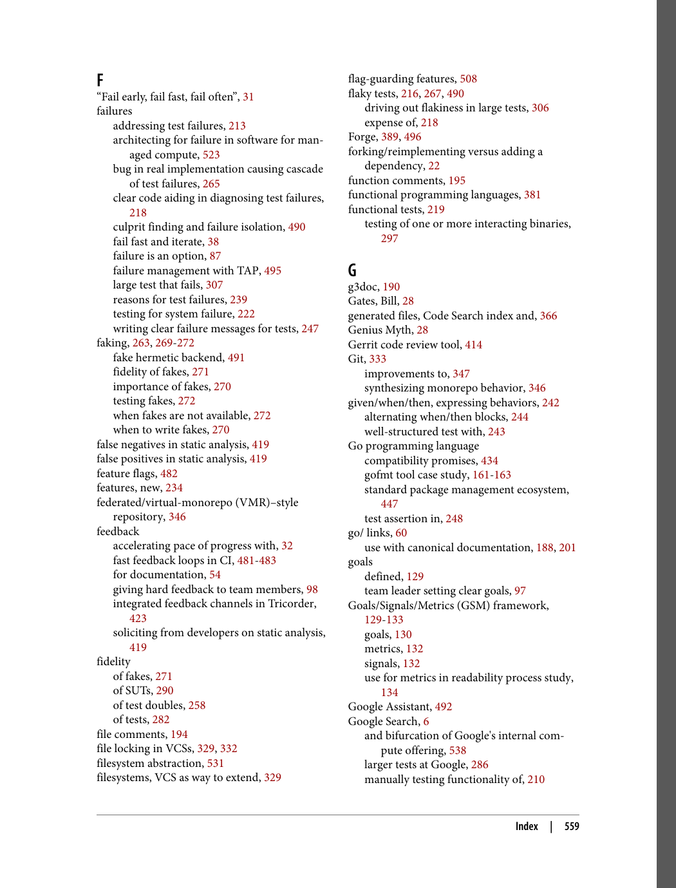

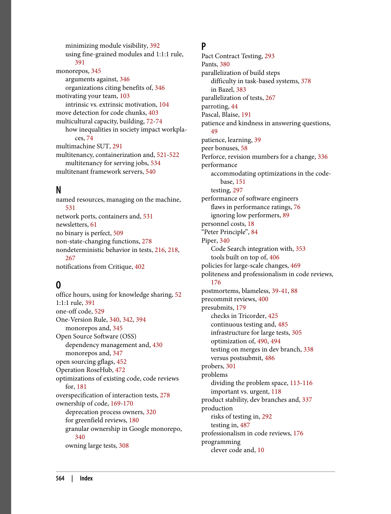

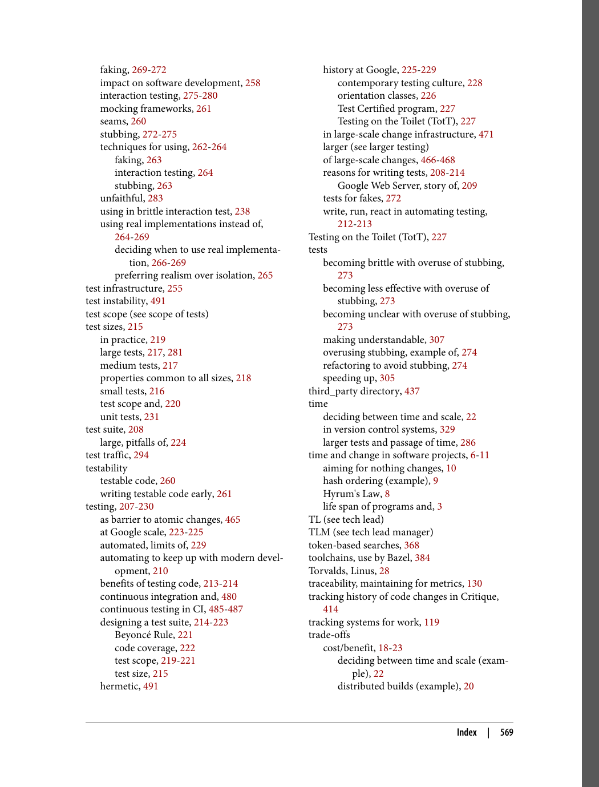

---

> "محاسبات به‌عنوان سرویس (CaaS)، مدلی است که در آن منابع محاسباتی به‌صورت سرویس ارائه می‌شوند. این مدل مقیاس‌پذیری و مدیریت آسان را ممکن می‌سازد."

### رام‌کردن محیط محاسباتی

> "رام‌کردن محیط محاسباتی به معنای ایجاد محیطی ساده و قابل مدیریت است."

مراحل رام‌کردن محیط محاسباتی:
1. **اتوماسیون زحمت‌ها**: خودکارسازی کارهای تکراری
2. **کانتینرسازی و چندمستأجری**: استفاده از کانتینرها برای ایزوله کردن برنامه‌ها
3. **بهینه‌سازی و اتوماسیون**: بهینه‌سازی منابع و خودکارسازی مدیریت

### نوشتن نرم‌افزار برای محاسبات مدیریت‌شده

> "نوشتن نرم‌افزار برای محاسبات مدیریت‌شده نیازمند تغییر در نحوه تفکر است."

اصول اصلی:
1. **معماری برای شکست**: طراحی سیستم برای مقاومت در برابر شکست
2. **دسته‌ای در مقابل سرویس**: درک تفاوت بین کارهای دسته‌ای و سرویس
3. **مدیریت حالت**: مدیریت حالت در سیستم‌های توزیع‌شده
4. **اتصال به سرویس**: نحوه اتصال به سرویس‌ها

### حیوانات خانگی در مقابل گاوها

> "تمثیل حیوانات خانگی در مقابل گاوها به تفاوت بین مدیریت سنتی و مدرن سرورها اشاره دارد."

1. **حیوانات خانگی**: سرورهایی که به طور خاص مدیریت می‌شوند و جایگزینی آن‌ها دشوار است
2. **گاوها**: سرورهایی که به طور یکسان مدیریت می‌شوند و جایگزینی آن‌ها آسان است

### مدیریت حالت

> "مدیریت حالت یکی از مهم‌ترین چالش‌ها در سیستم‌های توزیع‌شده است."

راه‌های مدیریت حالت:
1. **ذخیره‌سازی خارجی**: ذخیره حالت در سیستم‌های ذخیره‌سازی خارجی
2. **تکرار**: تکرار داده‌ها برای مقاومت در برابر شکست
3. **کش**: استفاده از کش برای بهبود عملکرد

### انتخاب سرویس محاسباتی

> "انتخاب سرویس محاسباتی مناسب تصمیمی مهم است."

عوامل مؤثر:
1. **تمرکز در مقابل سفارشی‌سازی**: آیا از یک سرویس مشترک استفاده شود یا سفارشی؟
2. **سطح انتزاع**: آیا از سرور لس یا کانتینر استفاده شود؟
3. **عمومی در مقابل خصوصی**: آیا از سرویس ابری عمومی استفاده شود یا خصوصی؟

---

# بخش ششم: نتیجه‌گیری

---

## پس‌نوشت

> "مهندسی نرم‌افزار در گوگل یک آزمایش فوق‌العاده در نحوه توسعه و نگهداری یک پایگاه کد بزرگ و در حال تحول بوده است."

### جمع‌بندی

> "این کتاب برخی از اصول اصلی راهنمای ما در مهندسی نرم‌افزار را توضیح می‌دهد."

مهندسان نرم‌افزار در گوگل یاد گرفته‌اند که:
1. **پایداری مهم است**: نرم‌افزار باید بتواند با تغییرات سازگار شود
2. **ترسیم مسیر روشن**: توسعه‌دهندگان باید مسیر روشنی برای توسعه داشته باشند
3. **شمول و دسترسی‌پذیری**: نرم‌افزار باید برای همه قابل استفاده باشد

### مسئولیت

> "به عنوان مهندسان نرم‌افزار، مسئولیت داریم که کد خود را با شمول، برابری و دسترسی‌پذیری برای همه طراحی کنیم."

مهندسان نرم‌افزار مسئولیت دارند که نرم‌افزاری بسازند که برای همه مفید باشد. این شامل در نظر گرفتن نیازهای کاربران متنوع و اطمینان از دسترسی‌پذیری است.

### آینده

> "با ظهور فناوری‌های جدید مانند هوش مصنوعی، رایانش کوانتومی و رایانش محیطی، هنوز چیزهای زیادی برای یادگیری داریم."

آینده مهندسی نرم‌افزار پر از چالش‌ها و فرصت‌های جدید است. مهم است که همواره یاد بگیریم و با تغییرات سازگار شویم.

---

## فهرست الفبایی

> فهرست الفبایی شامل مفاهیم کلیدی و اصطلاحات فنی کتاب است.

### مفاهیم کلیدی

- **ADR (Architecture Decision Records)**: سوابق تصمیمات معماری
- **API (Application Programming Interface)**: رابط برنامه‌نویسی کاربردی
- **CI/CD (Continuous Integration/Continuous Delivery)**: ادغام مداوم/تحویل مداوم
- **CaaS (Compute as a Service)**: محاسبات به‌عنوان سرویس
- **Code Review**: بررسی کد
- **Dependency Management**: مدیریت وابستگی
- **Linting**: بررسی کیفیت کد
- **Monorepo**: مخزن یکپارچه
- **Static Analysis**: تحلیل ایستا
- **Test Automation**: تست خودکار
- **Version Control**: کنترل نسخه
- **Build System**: سیستم ساخت

### اصطلاحات فنی

- **Compiler**: کامپایلر
- **Debugger**: دیباگر
- **IDE (Integrated Development Environment)**: محیط توسعه یکپارچه
- **JVM (Java Virtual Machine)**: ماشین مجازی جاوا
- **Package Manager**: مدیر بسته
- **Refactoring**: بازآرایی کد
- **Unit Test**: تست واحد
- **Integration Test**: تست ادغام
- **System Test**: تست سیستم
- **Acceptance Test**: تست پذیرش

### مفاهیم مدیریتی

- **Agile**: چابک
- **Scrum**: اسکرام
- **Kanban**: کانبان
- **Sprint**: اسپرینت
- **Backlog**: لیست کارها
- **Retrospective**: بازنگری
- **Daily Standup**: جلسه ایستاده روزانه
- **Planning Poker**: پوکر برنامه‌ریزی

---

*تاریخ انتشار: ۲۰۲۰ | ناشر: O'Reilly Media*