> **راهنمای مطالعه**
>
> در هر بخش، ابتدا متن اصلی کتاب به زبان انگلیسی آورده شده و سپس ترجمه و توضیحات فارسی همان بخش ارائه شده است.

---
-

###### 📄 صفحه ۵۳۷
> 1 Remember the SRE “error-budget” formulation: perfection is rarely the best goal. Understand how much
> room for error is acceptable and how much of that budget has been spent recently and use that to adjust the
> trade-off between velocity and stability.
> features to launch even if they aren’t perfect1 and can also create clarity in otherwise
> contentious launch decisions.
> One bug involved a rare dialect spoken on only one island in the Philippines. If a user
> asked a search question in this dialect, instead of an answer to their question, they
> would get a blank web page. We had to determine whether the cost of fixing this bug
> was worth delaying the release of a major new feature.
> We ran from office to office trying to determine how many people actually spoke this
> language, if it happened every time a user searched in this language, and whether
> these folks even used Google on a regular basis. Every quality engineer we spoke with
> deferred us to a more senior person. Finally, data in hand, we put the question to
> Search’s senior vice president. Should we delay a critical release to fix a bug that affec‐
> ted only a very small Philippine island? It turns out that no matter how small your
> island, you should get reliable and accurate search results: we delayed the release and
> fixed the bug.
> Meet Your Release Deadline
> The second idea is that if you’re late for the release train, it will leave without you.
> There’s something to be said for the adage, “deadlines are certain, life is not.” At some
> point in the release timeline, you must put a stake in the ground and turn away devel‐
> opers and their new features. Generally speaking, no amount of pleading or begging
> will get a feature into today’s release after the deadline has passed.
> There is the rare exception. The situation usually goes like this. It’s late Friday evening
> and six software engineers come storming into the release manager’s cube in a panic.
> They have a contract with the NBA and finished the feature moments ago. But it must
> go live before the big game tomorrow. The release must stop and we must cherry-
> pick the feature into the binary or we’ll be in breach of contract! A bleary-eyed release
> engineer shakes their head and says it will take four hours to cut and test a new
> binary. It’s their kid’s birthday and they still need to pick up the balloons.
> A world of regular releases means that if a developer misses the release train, they’ll
> be able to catch the next train in a matter of hours rather than days. This limits devel‐
> oper panic and greatly improves work–life balance for release engineers.
> 510
> |
> Chapter 24: Continuous Delivery

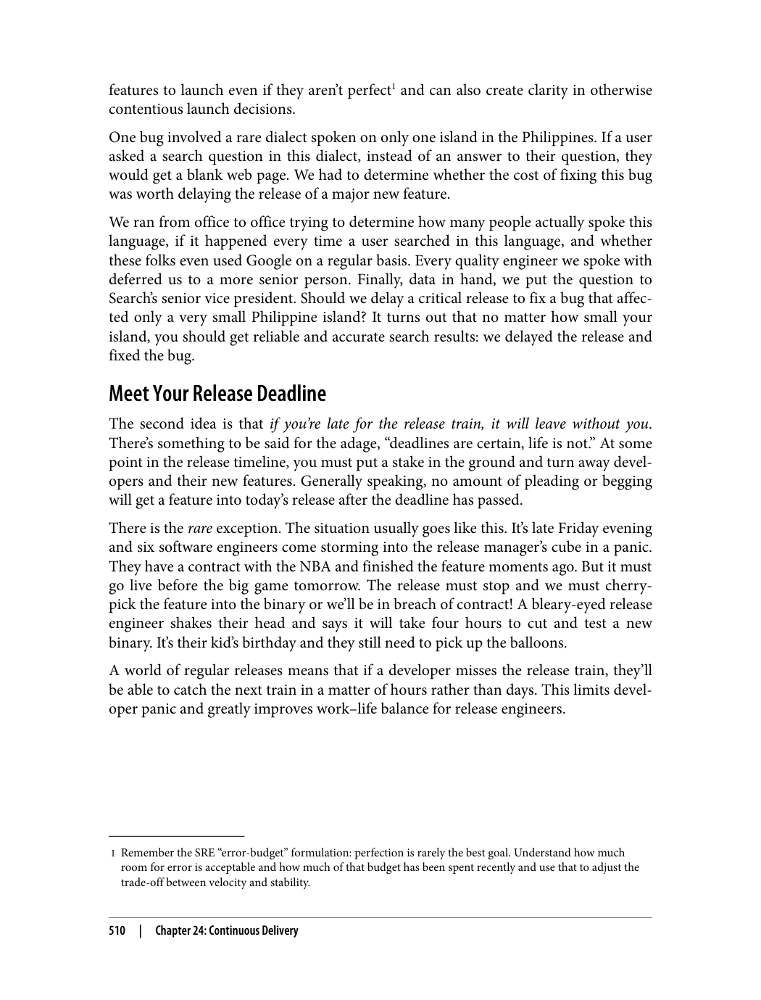

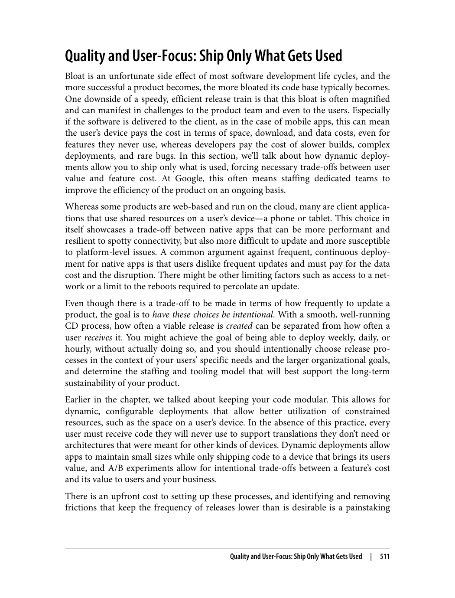

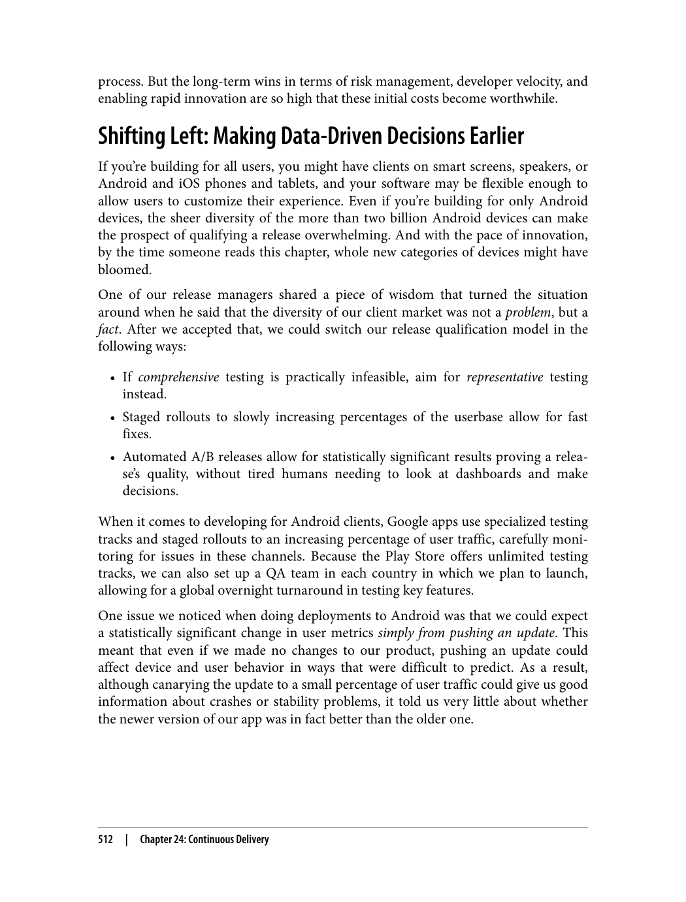

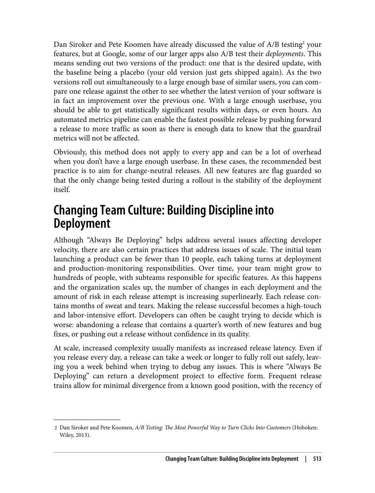

---

###### 📄 صفحه ۵۴۳

مراحل رام‌کردن محیط محاسباتی:
1. **اتوماسیون زحمت‌ها**: خودکارسازی کارهای تکراری
2. **کانتینرسازی و چندمستأجری**: استفاده از کانتینرها برای ایزوله کردن برنامه‌ها
3. **بهینه‌سازی و اتوماسیون**: بهینه‌سازی منابع و خودکارسازی مدیریت

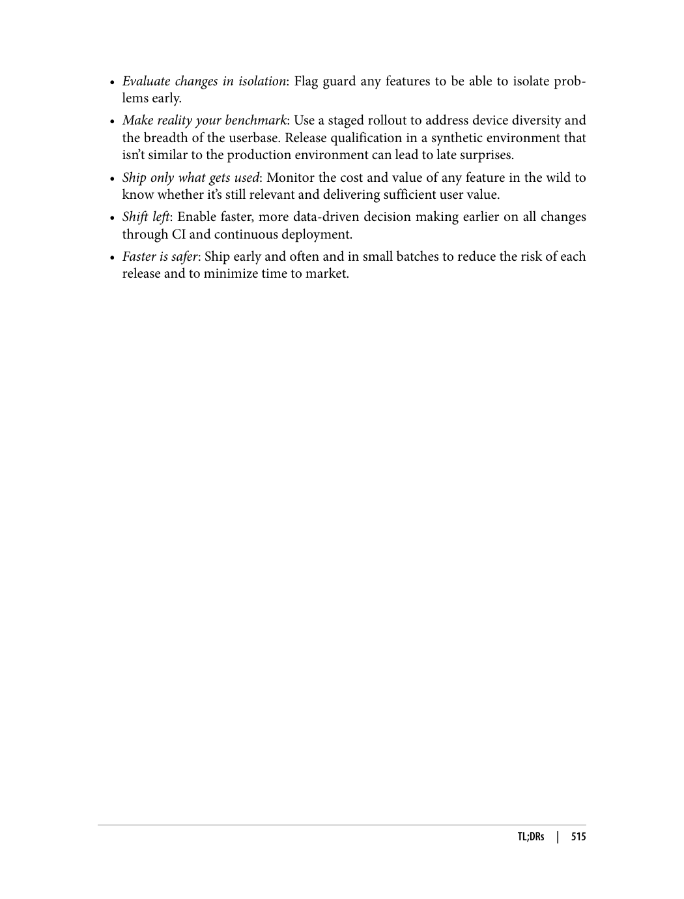

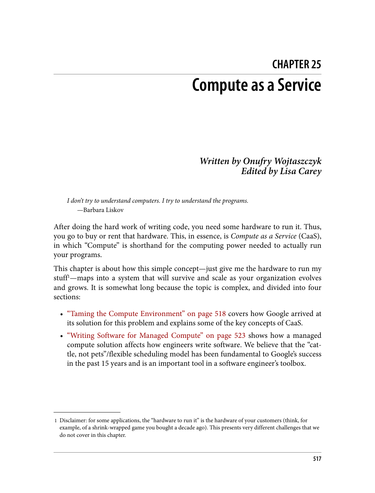

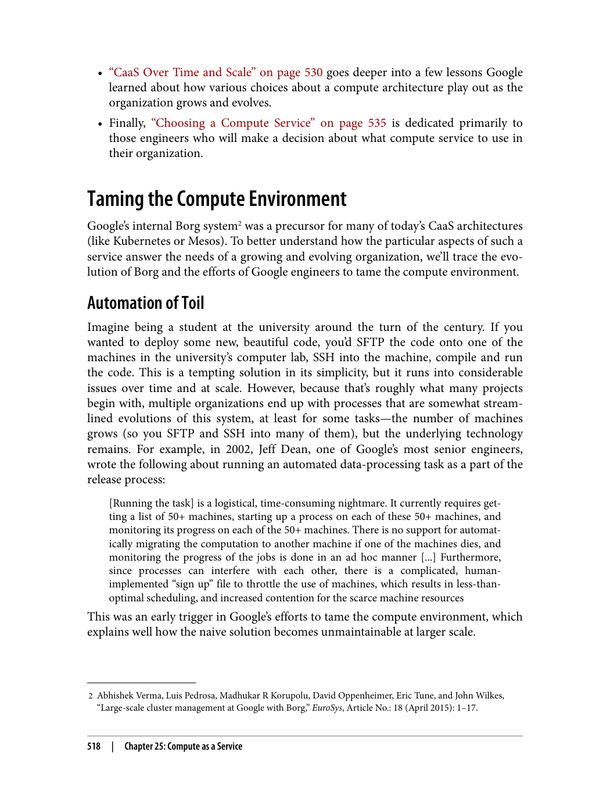

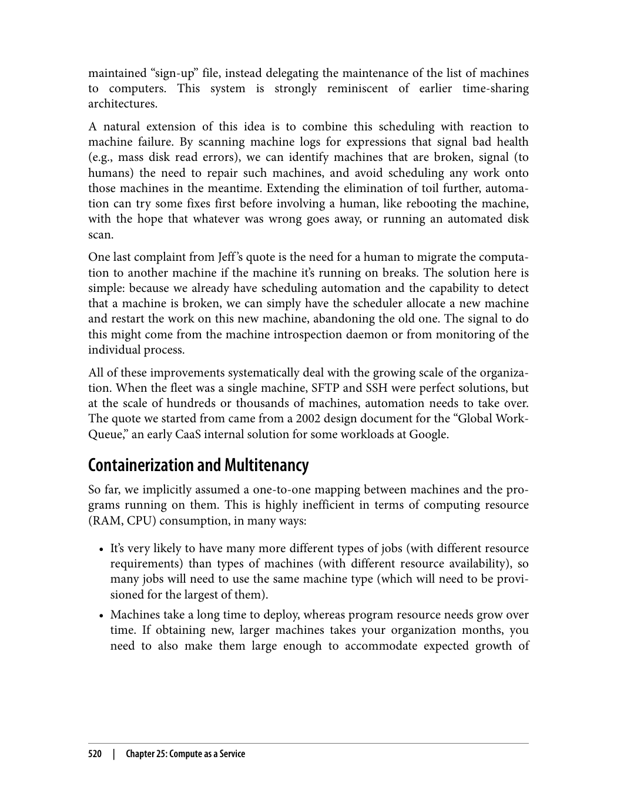

---

###### 📄 صفحه ۵۴۹
> containerization for which small resource footprints and short runtimes are expected.
> This led Google’s engineers designing Borg in 2003 to look to different solutions, end‐
> ing up with containers—a lightweight mechanism based on cgroups (contributed by
> Google engineers into the Linux kernel in 2007) and chroot jails, bind mounts and/or
> union/overlay filesystems for filesystem isolation. Open source container implemen‐
> tations include Docker and LMCTFY.
> Over time and with the evolution of the organization, more and more potential isola‐
> tion failures are discovered. To give a specific example, in 2011, engineers working on
> Borg discovered that the exhaustion of the process ID space (which was set by default
> to 32,000 PIDs) was becoming an isolation failure, and limits on the total number of
> processes/threads a single replica can spawn had to be introduced. We look at this
> example in more detail later in this chapter.
> Rightsizing and autoscaling
> The Borg of 2006 scheduled work based on the parameters provided by the engineer
> in the configuration, such as the number of replicas and the resource requirements.
> Looking at the problem from a distance, the idea of asking humans to determine the
> resource requirement numbers is somewhat flawed: these are not numbers that
> humans interact with daily. And so, these configuration parameters become them‐
> selves, over time, a source of inefficiency. Engineers need to spend time determining
> them upon initial service launch, and as your organization accumulates more and
> more services, the cost to determine them scales up. Moreover, as time passes, the
> program evolves (likely grows), but the configuration parameters do not keep up.
> This ends in an outage—where it turns out that over time the new releases had
> resource requirements that ate into the slack left for unexpected spikes or outages,
> and when such a spike or outage actually occurs, the slack remaining turns out to be
> insufficient.
> The natural solution is to automate the setting of these parameters. Unfortunately,
> this proves surprisingly tricky to do well. As an example, Google has only recently
> reached a point at which more than half of the resource usage over the whole Borg
> fleet is determined by rightsizing automation. That said, even though it is only half of
> the usage, it is a larger fraction of configurations, which means that the majority of
> engineers do not need to concern themselves with the tedious and error-prone bur‐
> den of sizing their containers. We view this as a successful application of the idea that
> “easy things should be easy, and complex things should be possible”—just because
> some fraction of Borg workloads is too complex to be properly managed by rightsiz‐
> ing doesn’t mean there isn’t great value in handling the easy cases.
> 522
> |
> Chapter 25: Compute as a Service

اصول اصلی:
1. **معماری برای شکست**: طراحی سیستم برای مقاومت در برابر شکست
2. **دسته‌ای در مقابل سرویس**: درک تفاوت بین کارهای دسته‌ای و سرویس
3. **مدیریت حالت**: مدیریت حالت در سیستم‌های توزیع‌شده
4. **اتصال به سرویس**: نحوه اتصال به سرویس‌ها

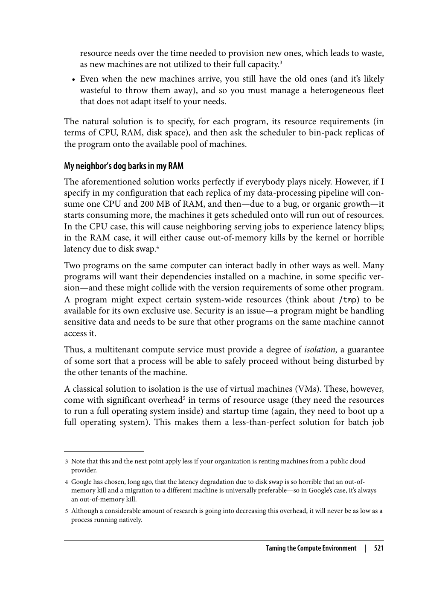

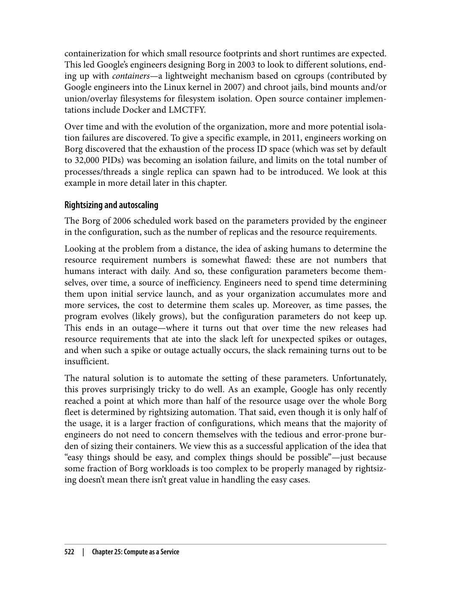

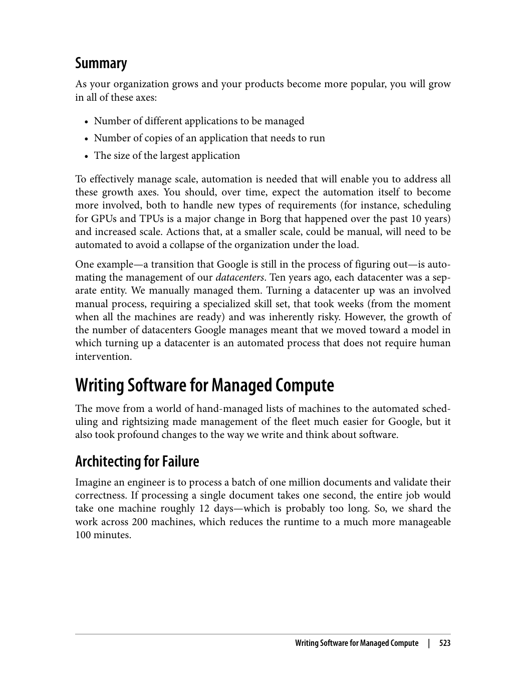

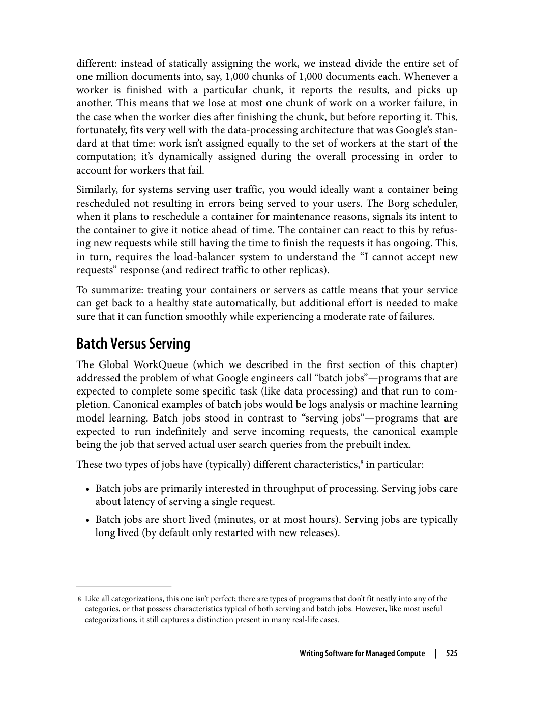

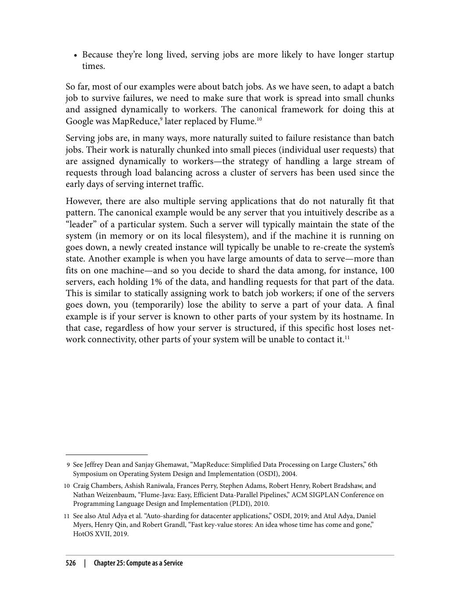

---

###### 📄 صفحه ۵۵۵
> 14 Note that retries need to be implemented correctly—with backoff, graceful degradation and tools to avoid cas‐
> cading failures like jitter. Thus, this should likely be a part of Remote Procedure Call library, instead of imple‐
> mented by hand by each developer. See, for example, Chapter 22: Addressing Cascading Failures in the SRE
> book.
> (although with higher latency). However, there is a clear trade-off here: how much to
> spend on the redundancy to mitigate the risk of an outage when cache capacity is lost.
> In a similar vein to caching, data might be pulled in from external storage to local in
> the warm-up of an application, in order to improve request serving latency.
> One more case of using local storage—this time in case of data that’s written more
> than read—is batching writes. This is a common strategy for monitoring data (think,
> for instance, about gathering CPU utilization statistics from the fleet for the purposes
> of guiding the autoscaling system), but it can be used anywhere where it is acceptable
> for a fraction of data to perish, either because we do not need 100% data coverage
> (this is the monitoring case), or because the data that perishes can be re-created (this
> is the case of a batch job that processes data in chunks, and writes some output for
> each chunk). Note that in many cases, even if a particular calculation has to take a
> long time, it can be split into smaller time windows by periodic checkpointing of state
> to persistent storage.
> Connecting to a Service
> As mentioned earlier, if anything in the system has the name of the host on which
> your program runs hardcoded (or even provided as a configuration parameter at
> startup), your program replicas are not cattle. However, to connect to your applica‐
> tion, another application does need to get your address from somewhere. Where?
> The answer is to have an extra layer of indirection; that is, other applications refer to
> your application by some identifier that is durable across restarts of the specific
> “backend” instances. That identifier can be resolved by another system that the
> scheduler writes to when it places your application on a particular machine. Now, to
> avoid distributed storage lookups on the critical path of making a request to your
> application, clients will likely look up the address that your app can be found on, and
> set up a connection, at startup time, and monitor it in the background. This is gener‐
> ally called service discovery, and many compute offerings have built-in or modular
> solutions. Most such solutions also include some form of load balancing, which
> reduces coupling to specific backends even more.
> A repercussion of this model is that you will likely need to repeat your requests in
> some cases, because the server you are talking to might be taken down before it man‐
> ages to answer.14 Retrying requests is standard practice for network communication
> (e.g., mobile app to a server) because of network issues, but it might be less intuitive
> 528
> |
> Chapter 25: Compute as a Service

1. **حیوانات خانگی**: سرورهایی که به طور خاص مدیریت می‌شوند و جایگزینی آن‌ها دشوار است
2. **گاوها**: سرورهایی که به طور یکسان مدیریت می‌شوند و جایگزینی آن‌ها آسان است

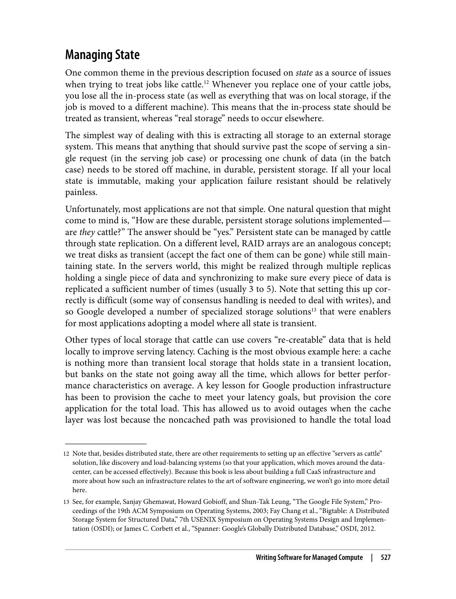

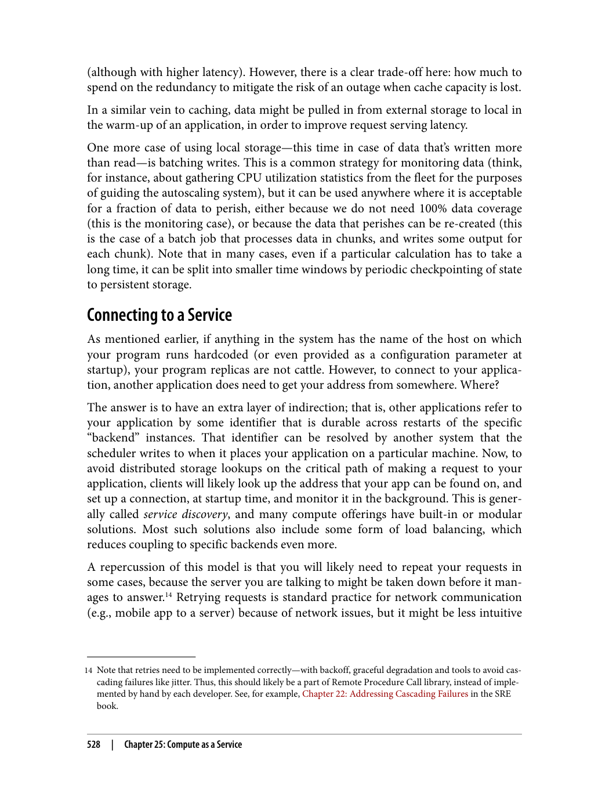

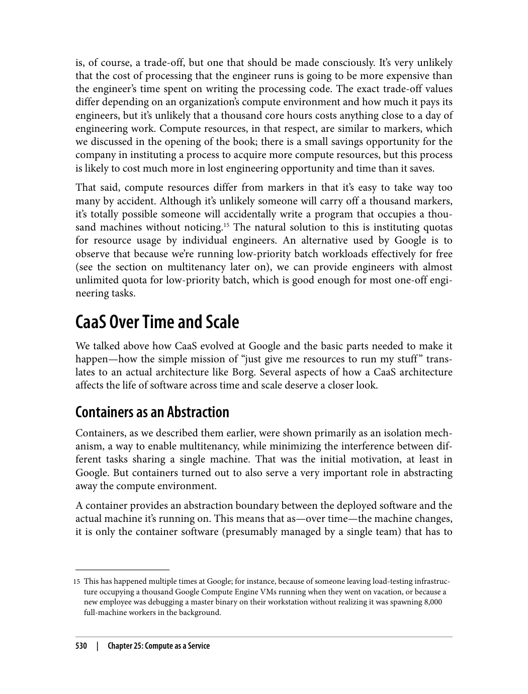

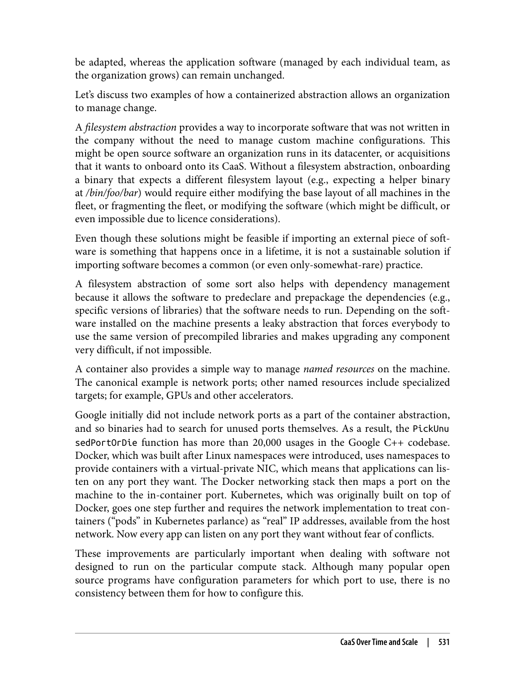

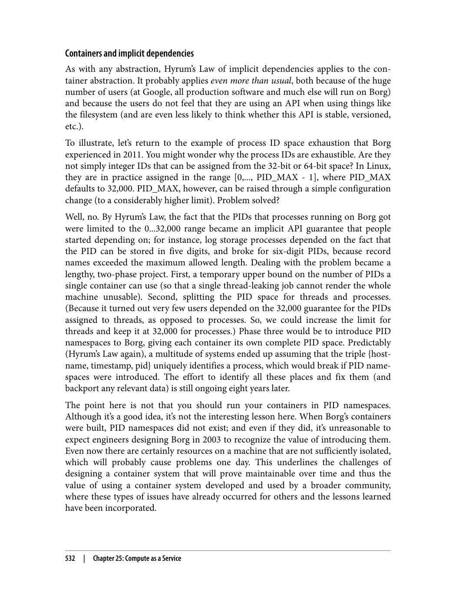

---

###### 📄 صفحه ۵۶۱
> total size of the machine, no more serving jobs can be put in there, even if real utiliza‐
> tion of resources is only 30% of capacity. But we can (and, in Borg, will) put batch
> jobs in the spare 70%, with the policy that if any of the serving jobs need the memory
> or CPU, we will reclaim it from the batch jobs (by freezing them in the case of CPU
> or killing in the case of RAM). Because the batch jobs are interested in throughput
> (measured in aggregate across hundreds of workers, not for individual tasks) and
> their individual replicas are cattle anyway, they will be more than happy to soak up
> this spare capacity of serving jobs.
> Depending on the shape of the workloads in a given pool of machines, this means
> that either all of the batch workload is effectively running on free resources (because
> we are paying for them in the slack of serving jobs anyway) or all the serving work‐
> load is effectively paying for only what they use, not for the slack capacity they need
> for failure resistance (because the batch jobs are running in that slack). In Google’s
> case, most of the time, it turns out we run batch effectively for free.
> Multitenancy for serving jobs
> Earlier, we discussed a number of requirements that a compute service must satisfy to
> be suitable for running serving jobs. As previously discussed, there are multiple
> advantages to having the serving jobs be managed by a common compute solution,
> but this also comes with challenges. One particular requirement worth repeating is a
> discovery service, discussed in “Connecting to a Service” on page 528. There are a
> number of other requirements that are new when we want to extend the scope of a
> managed compute solution to serving tasks, for example:
> • Rescheduling of jobs needs to be throttled: although it’s probably acceptable to
> kill and restart 50% of a batch job’s replicas (because it will cause only a tempo‐
> rary blip in processing, and what we really care about is throughput), it’s unlikely
> to be acceptable to kill and restart 50% of a serving job’s replicas (because the
> remaining jobs are likely too few to be able to serve user traffic while waiting for
> the restarted jobs to come back up again).
> • A batch job can usually be killed without warning. What we lose is some of the
> already performed processing, which can be redone. When a serving job is killed
> without warning, we likely risk some user-facing traffic returning errors or (at
> best) having increased latency; it is preferable to give several seconds of warning
> ahead of time so that the job can finish serving requests it has in flight and not
> accept new ones.
> For the aforementioned efficiency reasons, Borg covers both batch and serving jobs,
> but multiple compute offerings split the two concepts—typically, a shared pool of
> machines for batch jobs, and dedicated, stable pools of machines for serving jobs.
> Regardless of whether the same compute architecture is used for both types of jobs,
> however, both groups benefit from being treated like cattle.
> 534
> |
> Chapter 25: Compute as a Service

راه‌های مدیریت حالت:
1. **ذخیره‌سازی خارجی**: ذخیره حالت در سیستم‌های ذخیره‌سازی خارجی
2. **تکرار**: تکرار داده‌ها برای مقاومت در برابر شکست
3. **کش**: استفاده از کش برای بهبود عملکرد

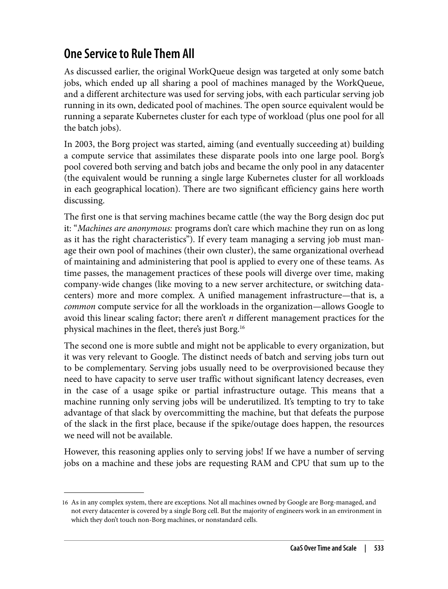

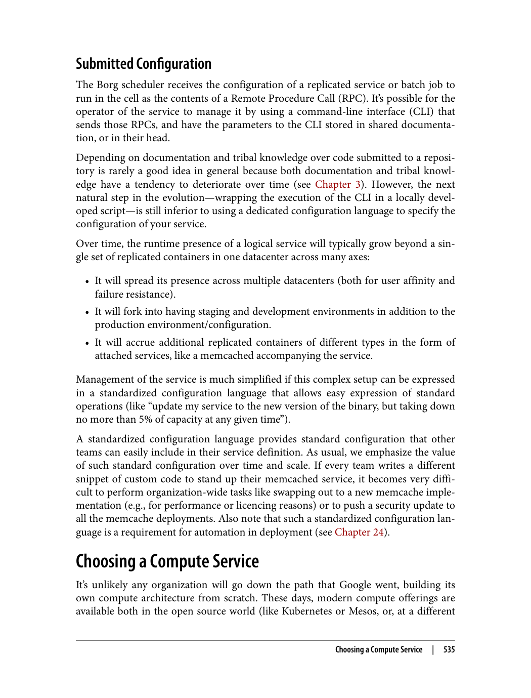

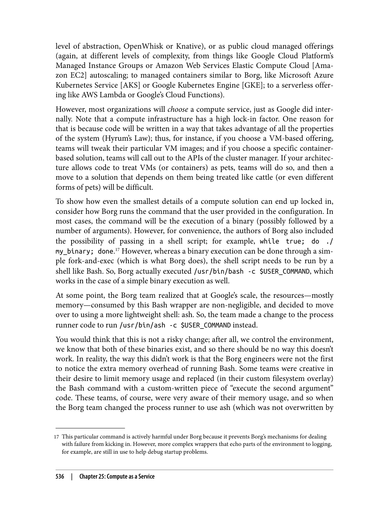

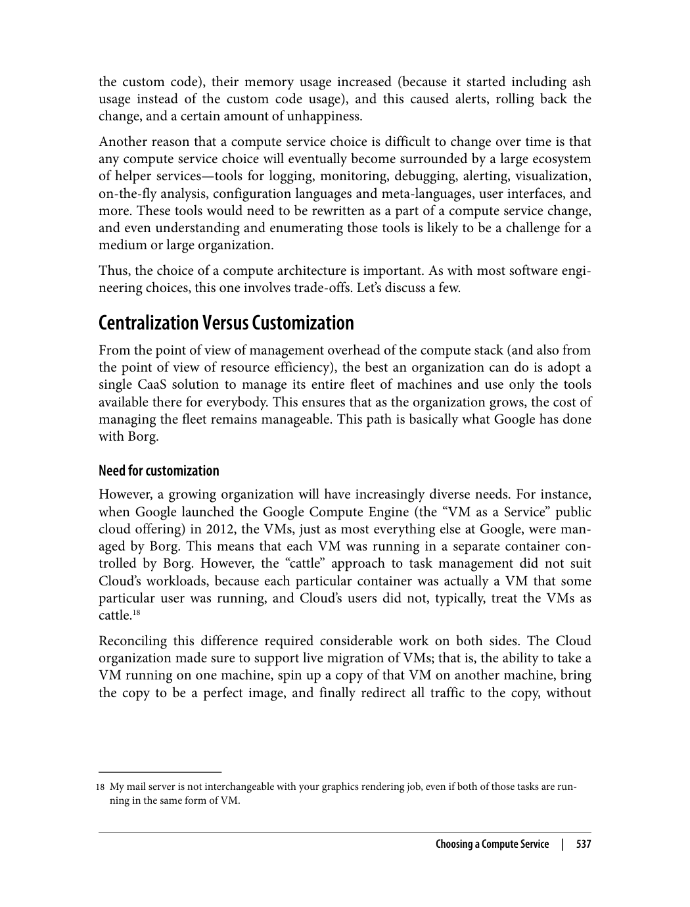

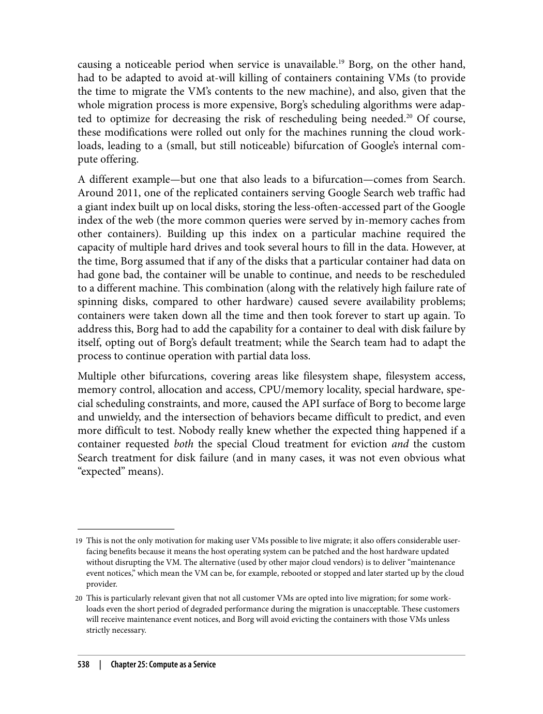

---

###### 📄 صفحه ۵۶۷
> 23 FaaS (Function as a Service) and PaaS (Platform as a Service) are related terms to serverless. There are differ‐
> ences between the three terms, but there are more similarities, and the boundaries are somewhat blurred.
> organization’s growth (because both the number of teams and the number of datacen‐
> ters a team occupies are likely to grow). And after the choice to manage cattle is
> made, containers are a natural choice for management; they are lighter weight
> (implying smaller resource overheads and startup times) and configurable enough
> that should you need to provide specialized hardware access to a specific type of
> workload, you can (if you so choose) allow punching a hole through easily.
> The advantage of VMs as cattle lies primarily in the ability to bring our own operat‐
> ing system, which matters if your workloads require a diverse set of operating sys‐
> tems to run. Multiple organizations will also have preexisting experience in managing
> VMs, and preexisting configurations and workloads based on VMs, and so might
> choose to use VMs instead of containers to ease migration costs.
> What is serverless?
> An even higher level of abstraction is serverless offerings.23 Assume that an organiza‐
> tion is serving web content and is using (or willing to adopt) a common server frame‐
> work for handling the HTTP requests and serving responses. The key defining trait
> of a framework is the inversion of control—so, the user will only be responsible for
> writing an “Action” or “Handler” of some sort—a function in the chosen language
> that takes the request parameters and returns the response.
> In the Borg world, the way you run this code is that you stand up a replicated con‐
> tainer, each replica containing a server consisting of framework code and your func‐
> tions. If traffic increases, you will handle this by scaling up (adding replicas or
> expanding into new datacenters). If traffic decreases, you will scale down. Note that a
> minimal presence (Google usually assumes at least three replicas in each datacenter a
> server is running in) is required.
> However, if multiple different teams are using the same framework, a different
> approach is possible: instead of just making the machines multitenant, we can also
> make the framework servers themselves multitenant.  In this approach, we end up
> running a larger number of framework servers, dynamically load/unload the action
> code on different servers as needed, and dynamically direct requests to those servers
> that have the relevant action code loaded. Individual teams no longer run servers,
> hence “serverless.”
> Most discussions of serverless frameworks compare them to the “VMs as pets”
> model. In this context, the serverless concept is a true revolution, as it brings in all of
> the benefits of cattle management—autoscaling, lower overhead, lack of explicit pro‐
> visioning of servers. However, as described earlier, the move to a shared, multitenant,
> 540
> |
> Chapter 25: Compute as a Service

عوامل مؤثر:
1. **تمرکز در مقابل سفارشی‌سازی**: آیا از یک سرویس مشترک استفاده شود یا سفارشی؟
2. **سطح انتزاع**: آیا از سرور لس یا کانتینر استفاده شود؟
3. **عمومی در مقابل خصوصی**: آیا از سرویس ابری عمومی استفاده شود یا خصوصی؟

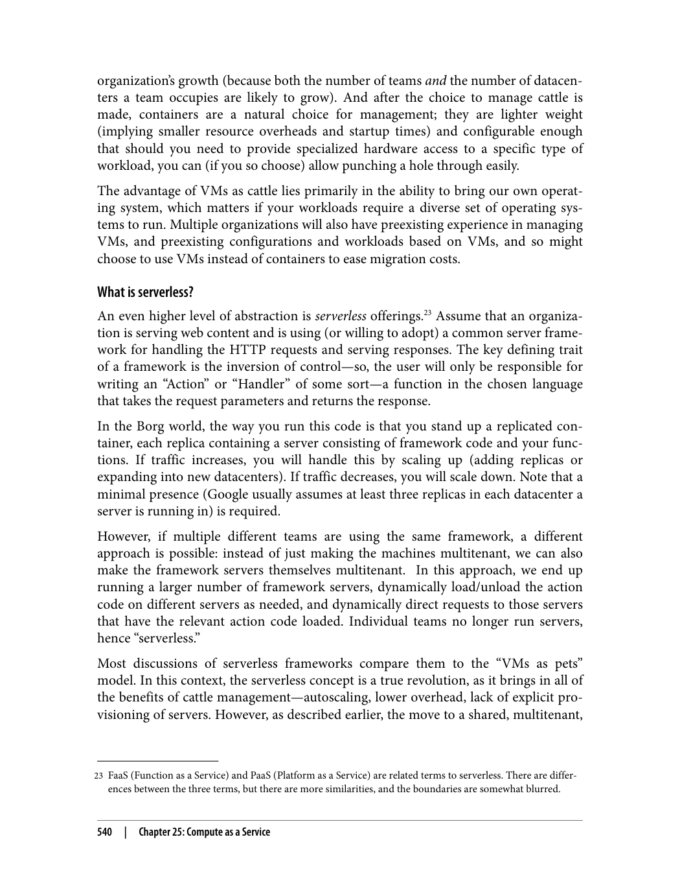

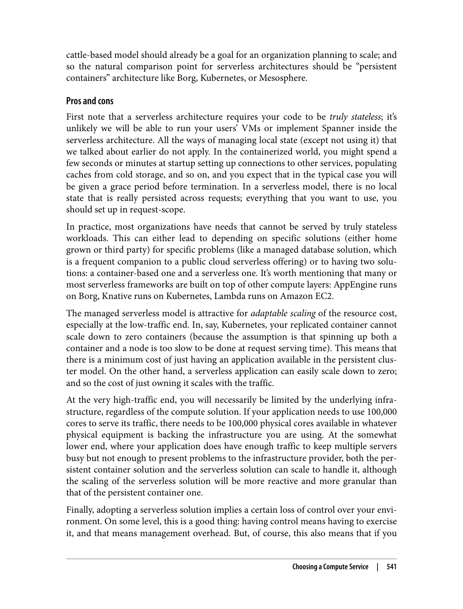

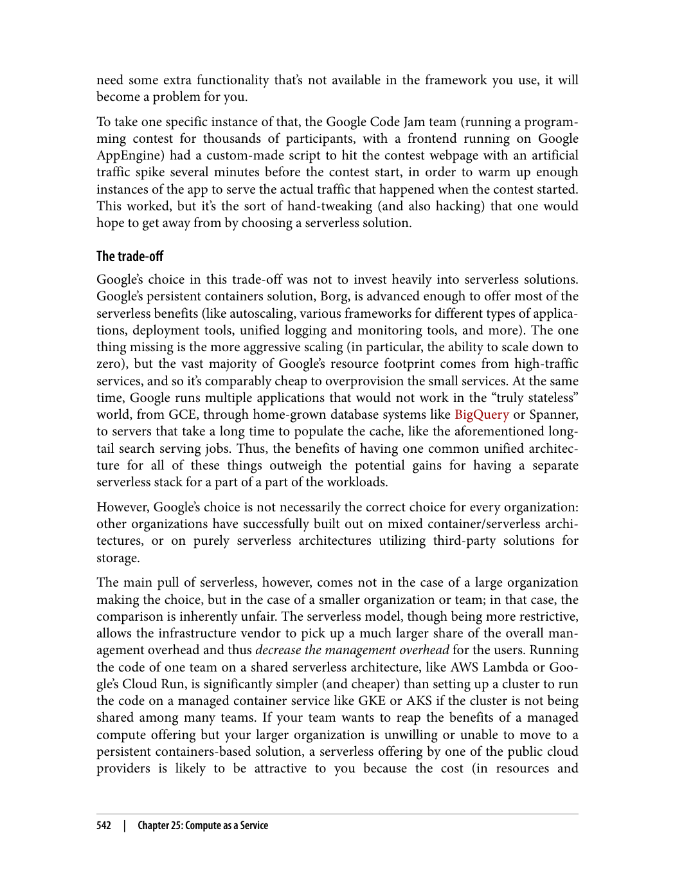

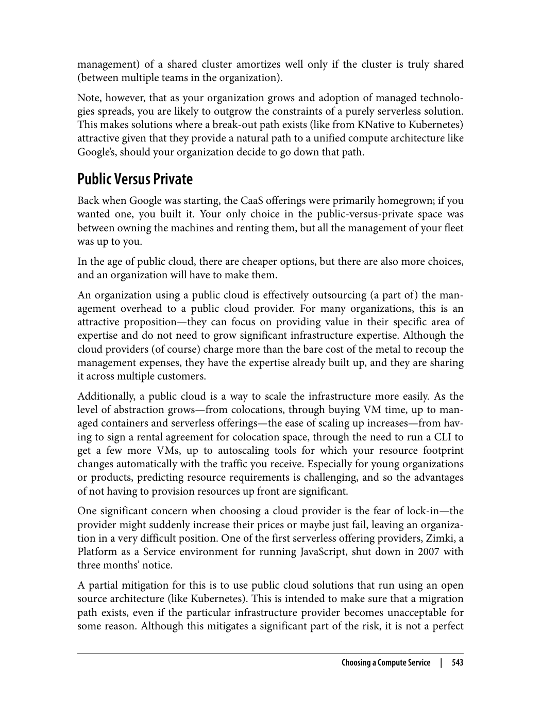

---

###### 📄 صفحه ۵۷۳

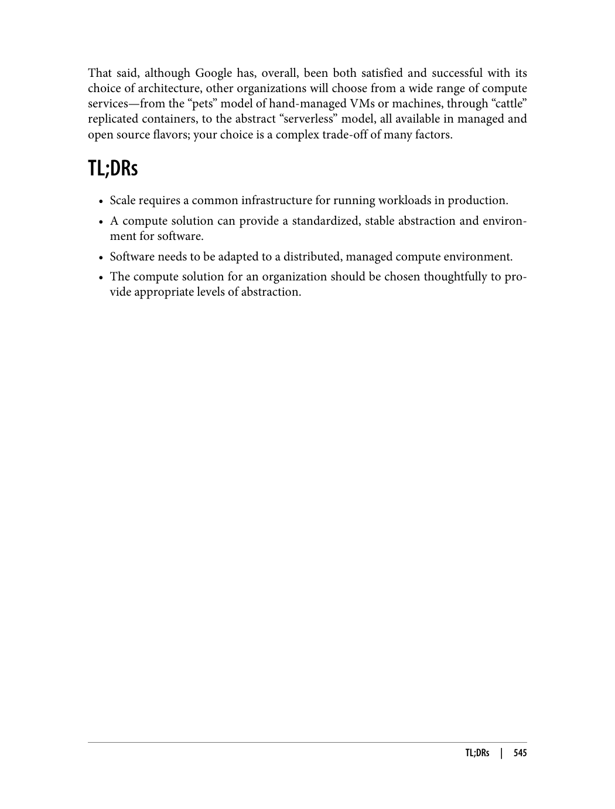

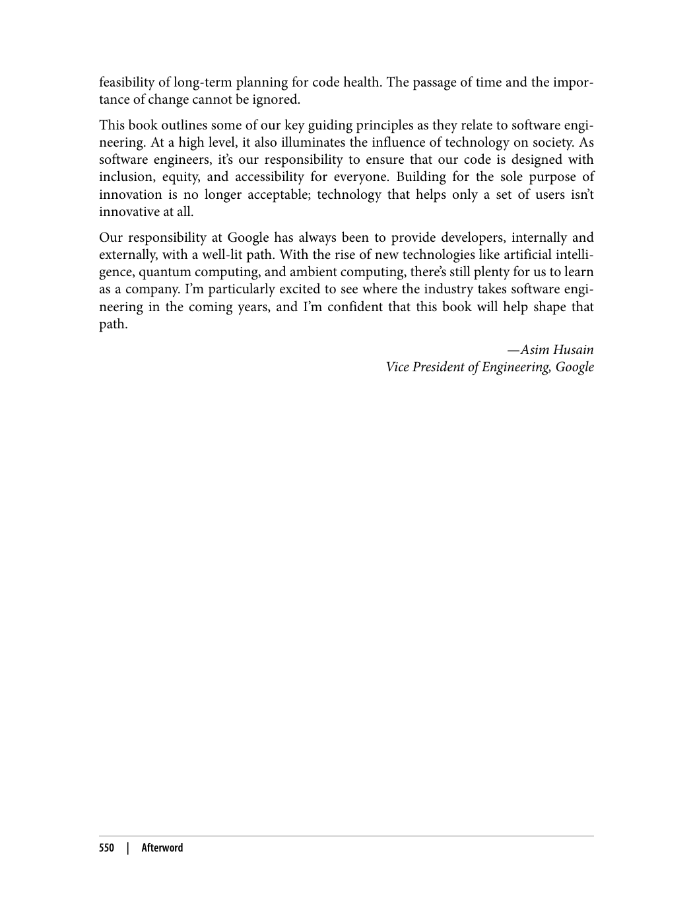

---

###### 📄 صفحه ۵۷۹
> atomicity for commits in VCSs, 328, 332
> attention from engineers (QUANTS), 131
> audience reviews, 199
> authoring large tests, 305
> authorization for large-scale changes, 473
> automated build system, 372
> automated testing
> code correctness checks, 172
> limits of, 229
> automation
> automated A/B releases, 512
> in continous integration, 483-485
> of code reviews, 179
> automation of toil in CaaS, 518-520
> automated scheduling, 519
> simple automations, 519
> autonomy for team members, 104
> autoscaling, 522
> B
> backsliding, preventing in deprecation process,
> 322
> backward compatibility and reactions to effi‐
> ciency improvement, 11
> batch jobs versus serving jobs, 525
> Bazel, 371, 380
> dependency versions, 394
> extending the build system, 384
> getting concrete with, 381
> parallelization of build steps, 382
> performing builds with command line,
> 382
> rebuilding only minimum set of targets
> each time, 383
> isolating the environment, 384
> making external dependencies determinis‐
> tic, 385
> platform independence using toolchains,
> 384
> remote caching and reproducible builds,
> 387
> speed and correctness, 372
> tools as dependencies, 383
> beginning, middle, and end sections for docu‐
> ments, 202
> behaviors
> code reviews for changes in, 181
> testing instead of methods, 241-246
> naming tests after behavior being tested,
> 244
> structuring tests to emphasize behaviors,
> 243
> unanticipated, testing for, 284
> updates to tests for changes in, 234
> best practices, style guide rules enforcing, 152
> Beyoncé Rule, 14, 221
> biases, 18
> small expressions of in interactions, 48
> universal presence of, 70
> binaries, interacting, functional testing of, 297
> blameless postmortems, 39-41, 88
> Blaze, 371, 380
> global dependency graph, 496
> blinders, identifying, 109
> in Web Search latency case study, 110
> Boost C++ library, compatibility promises, 435
> branch management, 336-339
> branch names in VCSs, 330
> dev branches, 337-339
> few long-lived branches at Google, 343
> release branches, 339
> work in progress is akin to a branch, 336
> “brilliant jerks”, 57
> brittle tests, 224
> preventing, 233-239
> striving for unchanging tests, 233
> testing state, not interactions, 238
> testing via public APIs, 234-237
> record/replay systems causing, 492
> with overuse of stubbing, 273
> browser and device testing, 297
> Buck, 380
> bug bashes, 299
> bug fixes, 181, 234
> bugs
> catching later in development, costs of, 207
> in real implementations causing cascade of
> test failures, 265
> logic concealing a bug in a test, 246
> not prevented by programmer ability alone,
> 210
> BUILD files, reformatting, 162
> build scripts
> difficulties of task-based build systems with,
> 379
> writing as tasks, 378
> build systems, 371-398
> 552
> |
> Index

مهندسان نرم‌افزار در گوگل یاد گرفته‌اند که:
1. **پایداری مهم است**: نرم‌افزار باید بتواند با تغییرات سازگار شود
2. **ترسیم مسیر روشن**: توسعه‌دهندگان باید مسیر روشنی برای توسعه داشته باشند
3. **شمول و دسترسی‌پذیری**: نرم‌افزار باید برای همه قابل استفاده باشد

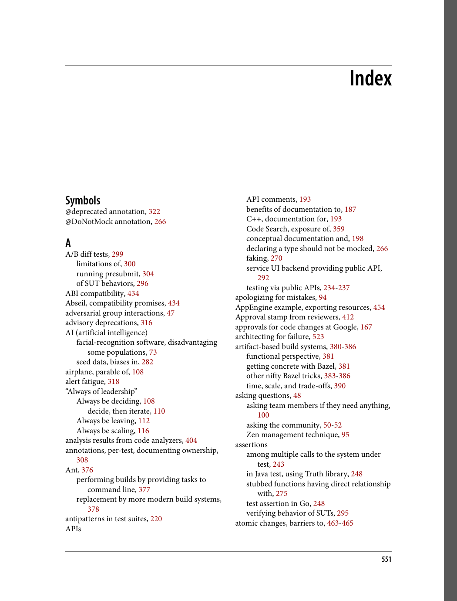

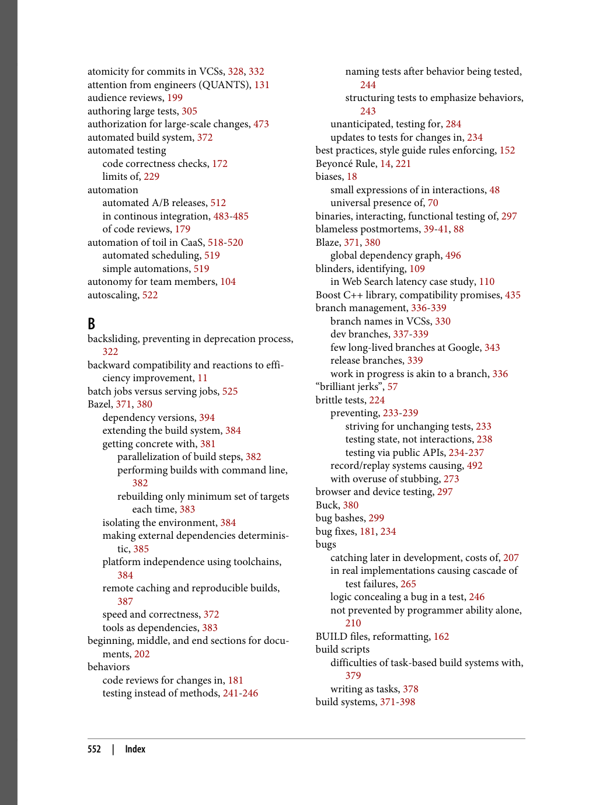

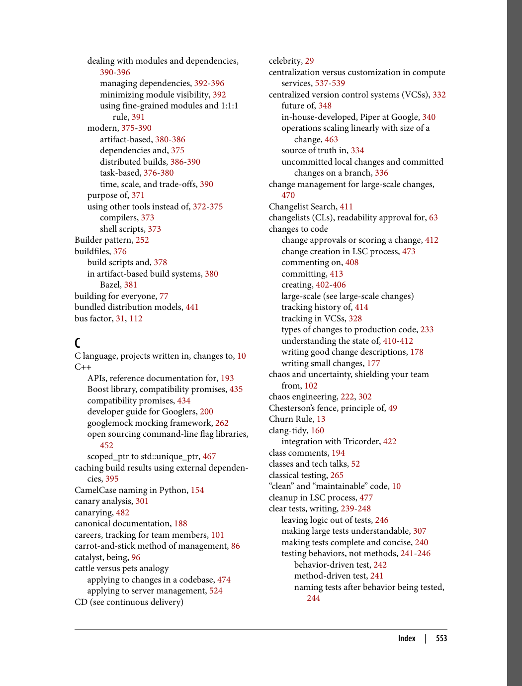

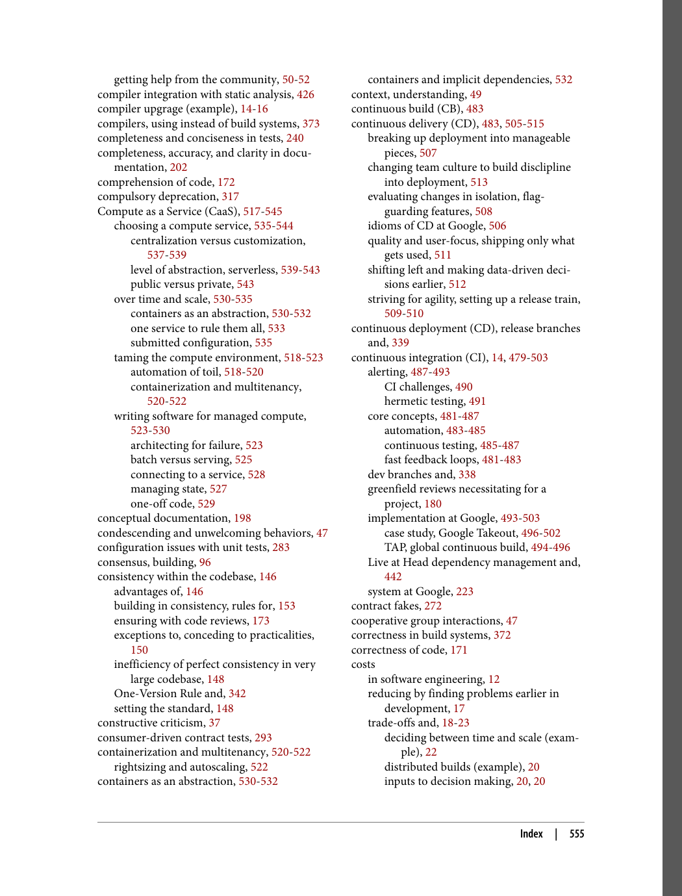

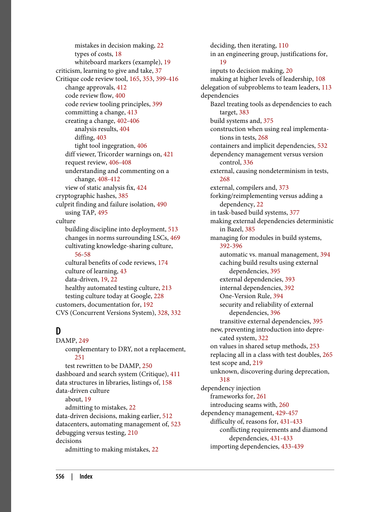

---

###### 📄 صفحه ۵۸۵
> for code changes, 178
> knowing your audience, 190-192
> types of audiences, 191
> philosophy, 201-204
> beginning, middle, and end sections, 202
> deprecating documents, 203
> parameters of good documentation, 202
> who, what, why, when, where, and how,
> 201
> promoting, 55
> treating as code, 188-190
> Google wiki and, 189
> types of, 192-199
> conceptual, 198
> design documents, 195
> landing pages, 198
> reference, 193-195
> tutorials, 196
> updating, 54
> when you need technical writers, 204
> documentation comments, 145
> documentation reviews, 199-201
> documented knowledge, 45
> domain knowledge of documentation audien‐
> ces, 191
> DRY (Don’t Repeat Yourself) principle
> tests and code sharing, DAMP, not DRY,
> 248-255
> DAMP as complement to DRY, 251
> test that is too DRY, 249
> violating for clearer tests, 241
> DVCSs (see distributed version control sys‐
> tems)
> E
> Edison, Thomas, 38
> education of software engineers, 72
> more inclusive education needed, 74
> efficiency improvements, changing code for, 11
> ego, losing, 36, 93
> Eisenhower, Dwight D., 118
> email at Google, 51
> Emerson, Ralph Waldo, 150
> end-to-end tests, 219
> engineering managers, 82, 86-88, 88
> (see also leading a team; managers and tech
> leads)
> contemporary managers, 87
> letting the team know failure is an option,
> 87
> manager as four-letter word, 86
> engineering productivity
> improving with testing, 231
> readability program and, 65
> Engineering Productivity Research (EPR) team,
> 65
> engineering productivity, measuring, 123-138
> assessing worth of measuring, 125-128
> goals, 130
> metrics, 132
> reasons for, 123-125
> selecting meaningful metrics with goals and
> signals, 129-130
> signals, 132
> taking action and tracking results after per‐
> forming research, 137
> validating metrics with data, 133-137
> equitable and inclusive engineering, 69-79
> bias and, 70
> building multicultural capacity, 72-74
> challenging established processes, 76
> making diversity actionable, 74
> need for diversity, 72
> racial inclusion, 70
> rejecting singular approaches, 75
> staying curious, and pushing forward, 78
> values versus outcomes, 77
> error checking tools, 160
> Error Prone tool (Java), 160
> @DoNotMock annotation, 266
> integration with Tricorder, 422
> error-prone and surprising constructs in code,
> avoiding, 149
> execution time for tests, 267
> speeding up tests, 305
> experience levels for documentation audiences,
> 191
> experiments and feature flags, 482
> expertise
> all-or-nothing, 44
> personalized advice from an expert, 45
> and shared communication forums, 14
> exploitation versus exploration problem, 363
> exploratory testing, 229, 298
> extrinsic versus intrinsic motivation, 104
> 558
> |
> Index

مهندسان نرم‌افزار مسئولیت دارند که نرم‌افزاری بسازند که برای همه مفید باشد. این شامل در نظر گرفتن نیازهای کاربران متنوع و اطمینان از دسترسی‌پذیری است.

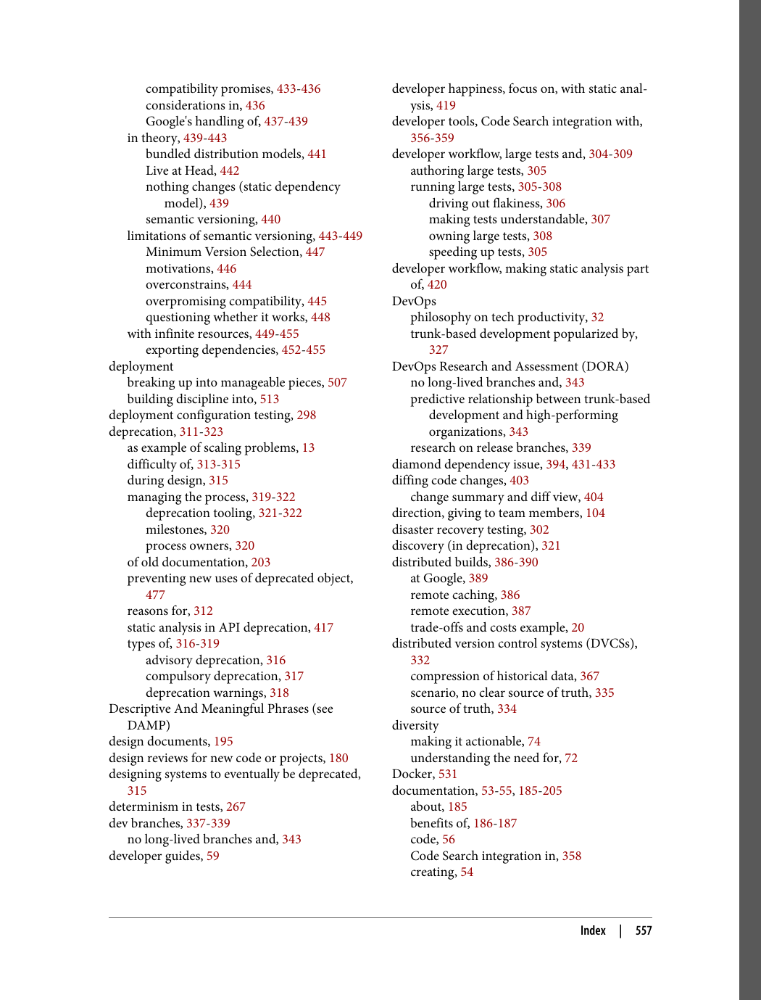

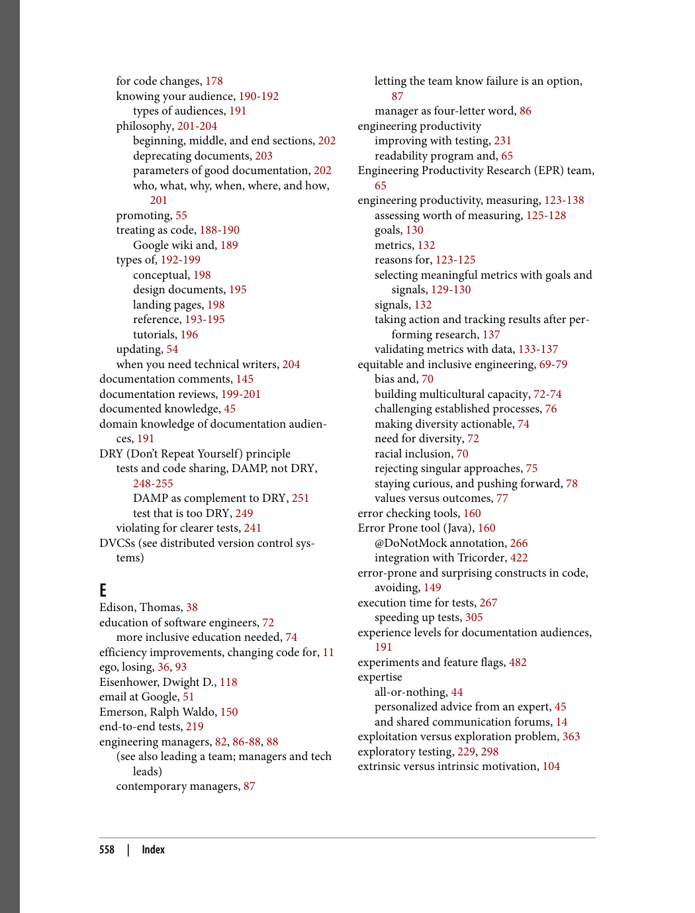

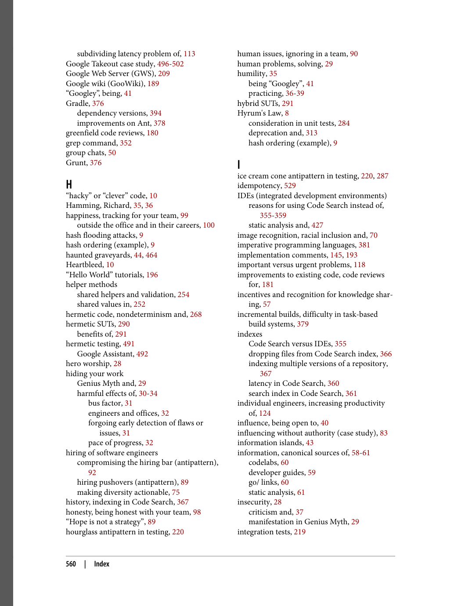

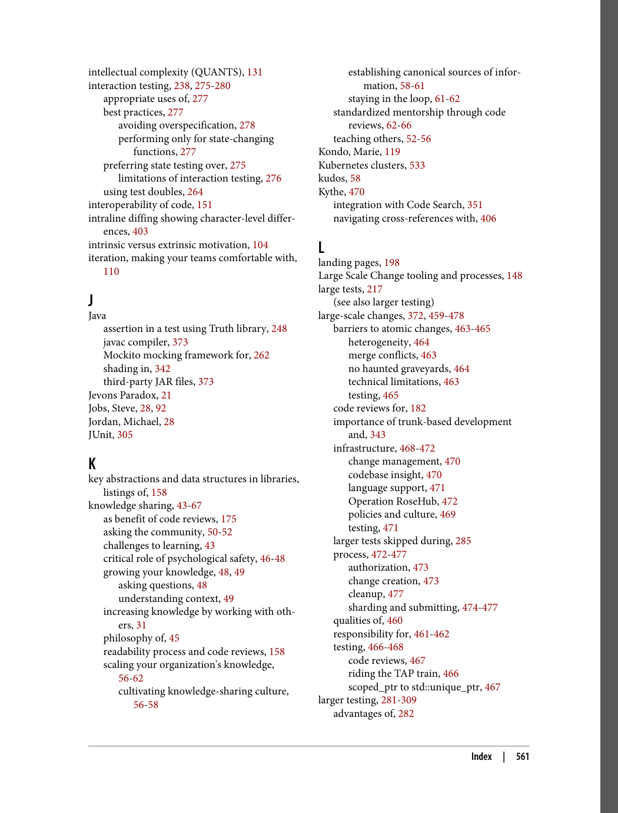

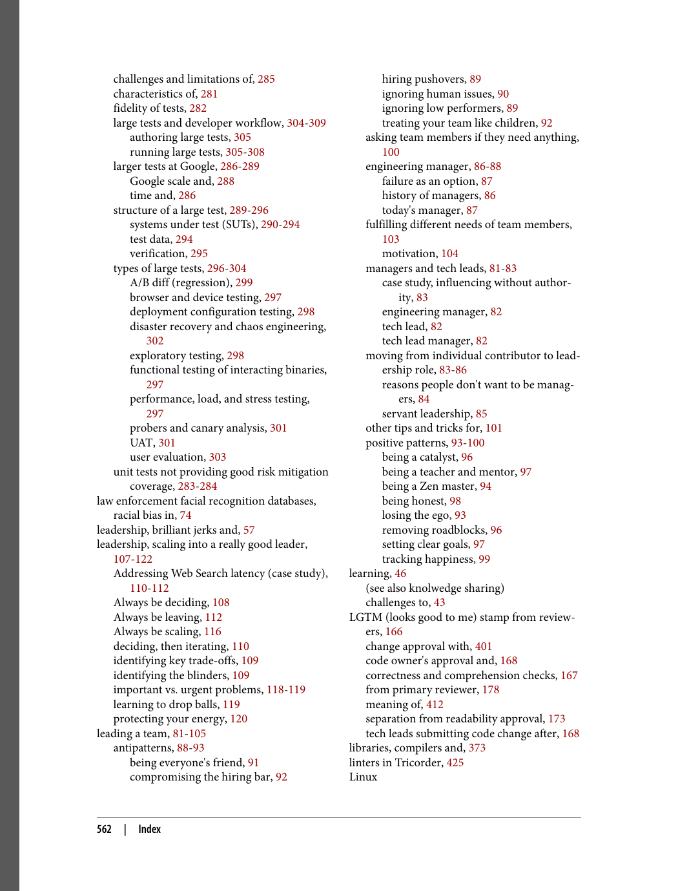

---

###### 📄 صفحه ۵۹۱
> minimizing module visibility, 392
> using fine-grained modules and 1:1:1 rule,
> 391
> monorepos, 345
> arguments against, 346
> organizations citing benefits of, 346
> motivating your team, 103
> intrinsic vs. extrinsic motivation, 104
> move detection for code chunks, 403
> multicultural capacity, building, 72-74
> how inequalities in society impact workpla‐
> ces, 74
> multimachine SUT, 291
> multitenancy, containerization and, 521-522
> multitenancy for serving jobs, 534
> multitenant framework servers, 540
> N
> named resources, managing on the machine,
> 531
> network ports, containers and, 531
> newsletters, 61
> no binary is perfect, 509
> non-state-changing functions, 278
> nondeterministic behavior in tests, 216, 218,
> 267
> notifications from Critique, 402
> O
> office hours, using for knowledge sharing, 52
> 1:1:1 rule, 391
> one-off code, 529
> One-Version Rule, 340, 342, 394
> monorepos and, 345
> Open Source Software (OSS)
> dependency management and, 430
> monorepos and, 347
> open sourcing gflags, 452
> Operation RoseHub, 472
> optimizations of existing code, code reviews
> for, 181
> overspecification of interaction tests, 278
> ownership of code, 169-170
> deprecation process owners, 320
> for greenfield reviews, 180
> granular ownership in Google monorepo,
> 340
> owning large tests, 308
> P
> Pact Contract Testing, 293
> Pants, 380
> parallelization of build steps
> difficulty in task-based systems, 378
> in Bazel, 383
> parallelization of tests, 267
> parroting, 44
> Pascal, Blaise, 191
> patience and kindness in answering questions,
> 49
> patience, learning, 39
> peer bonuses, 58
> Perforce, revision mumbers for a change, 336
> performance
> accommodating optimizations in the code‐
> base, 151
> testing, 297
> performance of software engineers
> flaws in performance ratings, 76
> ignoring low performers, 89
> personnel costs, 18
> “Peter Principle”, 84
> Piper, 340
> Code Search integration with, 353
> tools built on top of, 406
> policies for large-scale changes, 469
> politeness and professionalism in code reviews,
> 176
> postmortems, blameless, 39-41, 88
> precommit reviews, 400
> presubmits, 179
> checks in Tricorder, 425
> continuous testing and, 485
> infrastructure for large tests, 305
> optimization of, 490, 494
> testing on merges in dev branch, 338
> versus postsubmit, 486
> probers, 301
> problems
> dividing the problem space, 113-116
> important vs. urgent, 118
> product stability, dev branches and, 337
> production
> risks of testing in, 292
> testing in, 487
> professionalism in code reviews, 176
> programming
> clever code and, 10
> 564
> |
> Index

آینده مهندسی نرم‌افزار پر از چالش‌ها و فرصت‌های جدید است. مهم است که همواره یاد بگیریم و با تغییرات سازگار شویم.

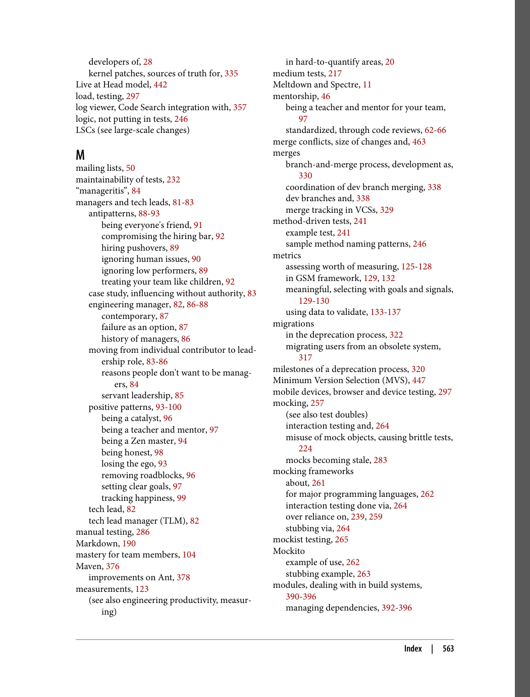

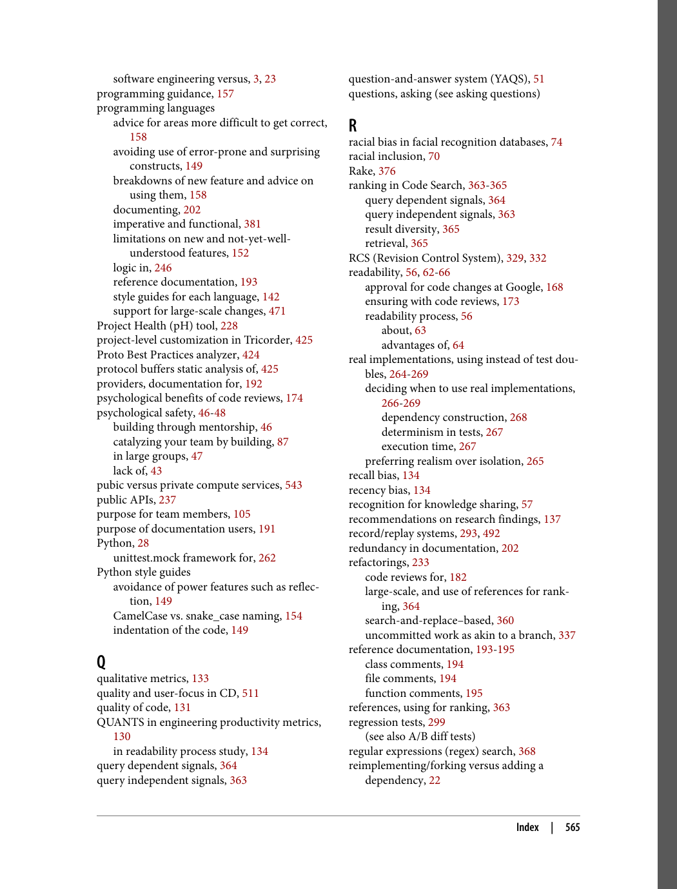

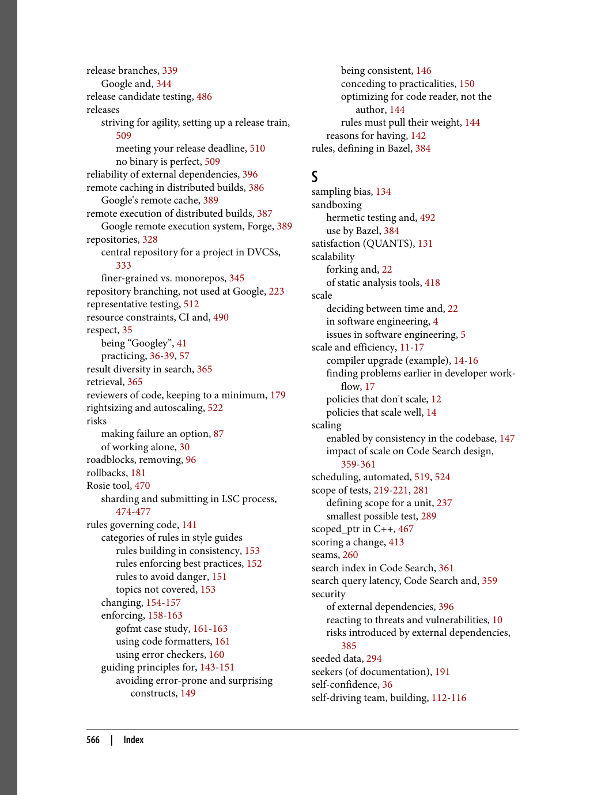

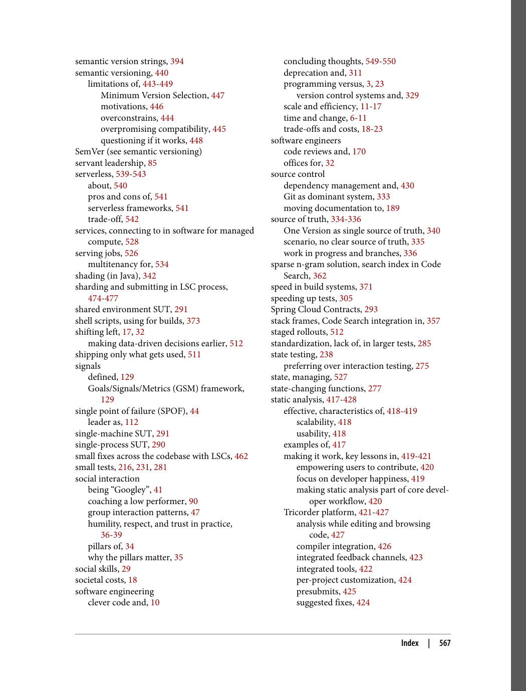

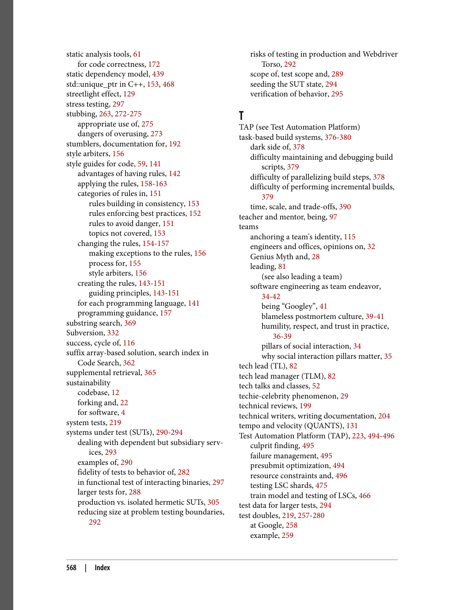

---

###### 📄 صفحه ۵۹۷
> mistakes in decision making, 22
> whiteboard markers (example), 19
> for leaders, 109
> in engineering productivity, 130
> in Web Search latency case study, 111
> key, identifying, 109
> transitive dependencies, 392
> external, 395
> strict, enforcing, 393
> tribal knowledge, 45
> Tricorder static analysis platform, 322, 421-427
> analysis while editing and browsing code,
> 427
> compiler integration, 426
> criteria for new checks, 422
> integrated feedback channels, 423
> integrated tools, 422
> per-project customization, 424
> presubmit checks, 425
> suggested fixes, 424
> trigram-based approach, search index in Code
> Search, 361
> trunk-based development, 327, 339
> correlation with good technical outcomes,
> 339
> Live at Head model and, 442
> predictive relationship between high-
> performing organizations and, 343
> source control questions and, 429
> trust, 35
> being “Googley”, 41
> code reviews and, 400
> practicing, 36-39
> treating your team like children (antipat‐
> tern), 92
> trusting your team and losing the ego, 93
> vulnerability and, 40
> Truth assertion library, 248
> tutorials, 196
> example of a bad tutorial, 196
> example, bad tutorial made better, 197
> U
> UAT (user acceptance testing), 301
> UIs
> end-to-end tests of service UI to its back‐
> end, 292
> in example of fairly small SUT, 288
> tests for, unreliable and costly, 292
> unchanging tests, 233
> unit testing, 231-256
> common gaps in unit tests, 283-284
> configuration issues, 283
> emergent behaviors and the vacuum
> effect, 284
> issues arising under load, 284
> unanticipated behaviors, inputs, and side
> effects, 284
> unfaithful test doubles, 283
> execution time for tests, 267
> lifespan of software tested, 286
> limitations of unit tests, 282
> maintainability of tests, importance of, 232
> narrow-scoped tests (or unit tests), 219
> preventing brittle tests, 233-239
> properties of good unit tests, 285
> tests and code sharing, DAMP, not DRY,
> 248-255
> DAMP test, 250
> defining test infrastructure, 255
> shared helpers and validation, 254
> shared setup, 253
> shared values, 251
> writing clear tests, 239-248
> leaving logic out of tests, 246
> making tests complete and concise, 240
> testing behaviors, not methods, 241-246
> writing clear failure messages, 247
> units (in unit testing), 237
> Unix, developers of, 28
> unreproducable builds, 385
> upgrades, 4
> compiler upgrade example, 14-16
> life span of software projects and impor‐
> tance of, 6
> usability of static analyses, 418
> user evaluation tests, 303
> user focus in CD, shipping only what gets used,
> 511
> users
> engineers building software for all users, 72
> focusing first on users most impacted by
> bias and discrimination, 78
> relegating consideration of user groups to
> late in development, 76
> V
> vacuum effect, unit tests and, 284
> 570
> |
> Index

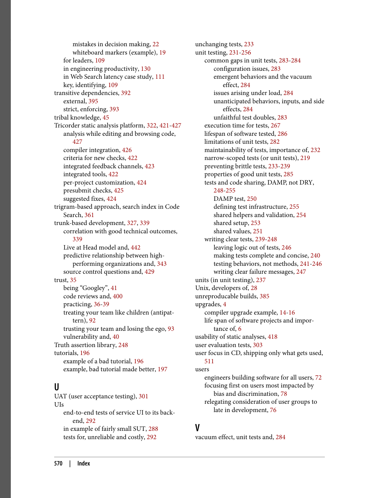

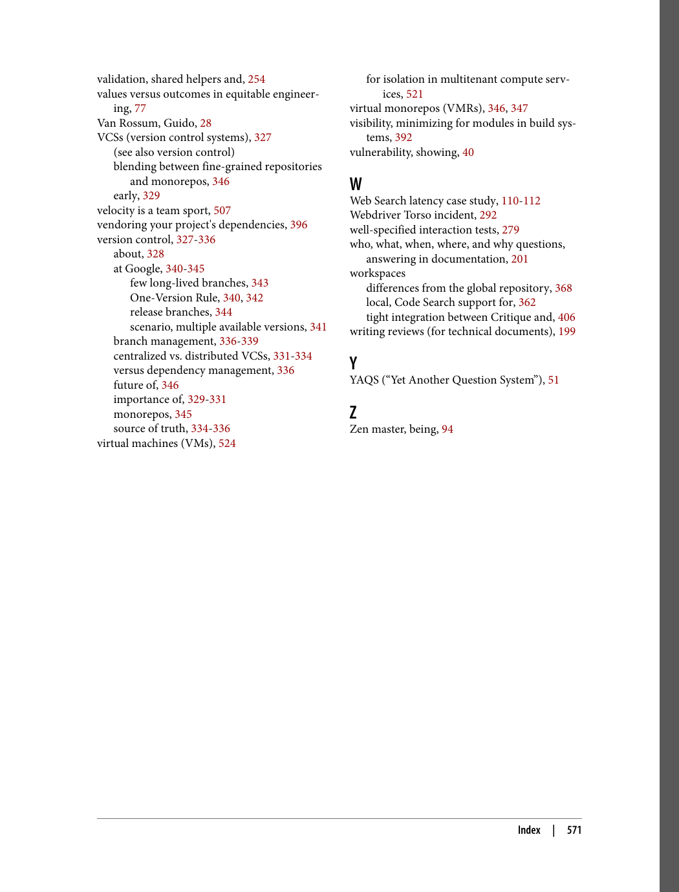

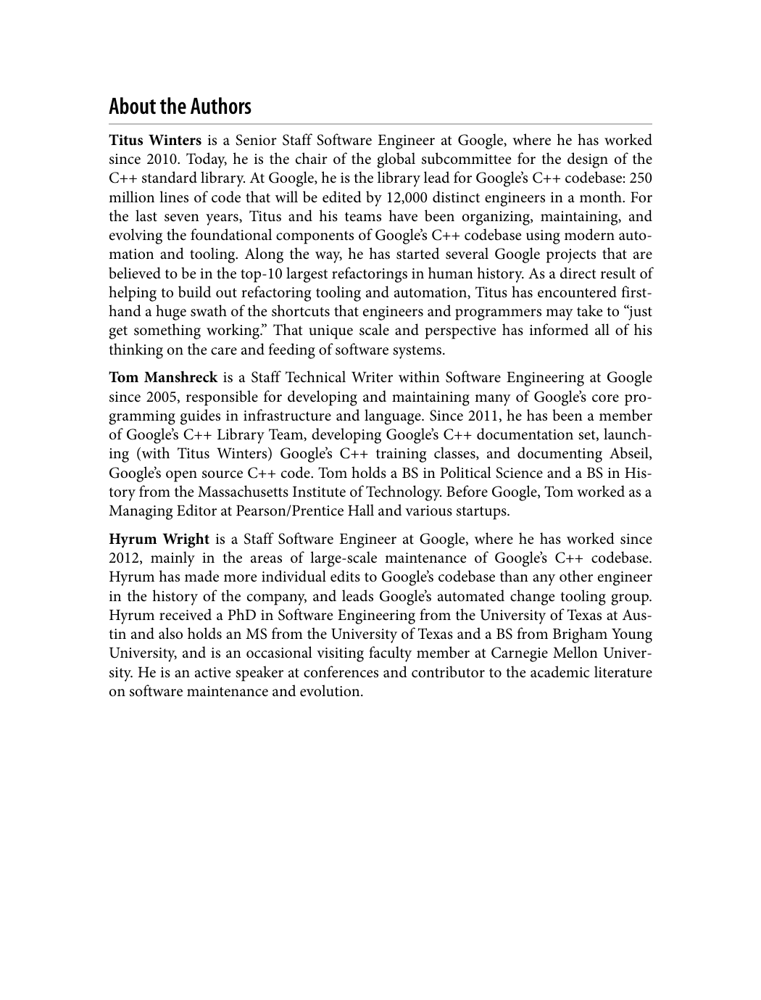

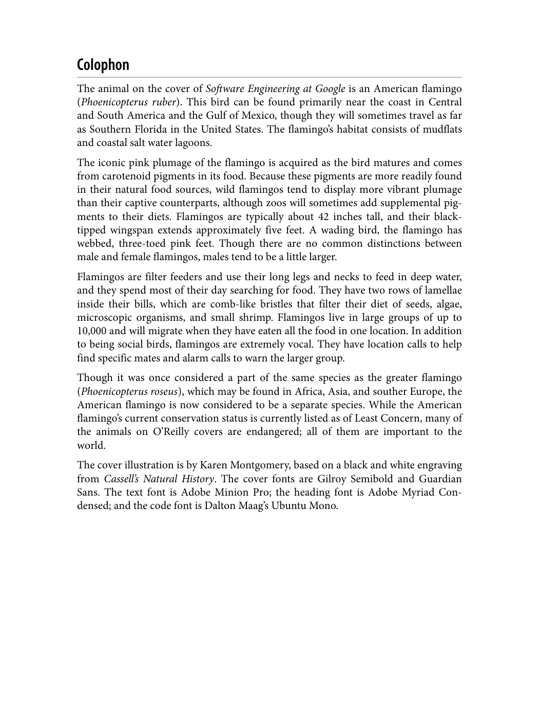

---
