> **راهنمای مطالعه**
>
> در هر بخش، ابتدا متن اصلی کتاب به زبان انگلیسی آورده شده و سپس ترجمه و توضیحات فارسی همان بخش ارائه شده است.

---
-

###### 📄 صفحه ۶۱
> In Short, Don't Hide
> So, what "hiding" boils down to is this: working alone is inherently riskier than work‐
> ing with others. Even though you might be afraid of someone stealing your idea or
> thinking you're not intelligent, you should be much more concerned about wasting
> huge swaths of your time toiling away on the wrong thing.
> Don't become another statistic.
> It's All About the Team
> So, let's back up now and put all of these ideas together.
> The point we've been hammering away at is that, in the realm of programming, lone
> craftspeople are extremely rare—and even when they do exist, they don't perform
> superhuman achievements in a vacuum; their world-changing accomplishment is
> almost always the result of a spark of inspiration followed by a heroic team effort.
> A great team makes brilliant use of its superstars, but the whole is always greater than
> the sum of its parts. But creating a superstar team is fiendishly difficult.
> Let's put this idea into simpler words: software engineering is a team endeavor.
> This concept directly contradicts the inner Genius Programmer fantasy so many of us
> hold, but it's not enough to be brilliant when you're alone in your hacker's lair. You're
> not going to change the world or delight millions of computer users by hiding and
> preparing your secret invention. You need to work with other people. Share your
> vision. Divide the labor. Learn from others. Create a brilliant team.
> Consider this: how many pieces of widely used, successful software can you name
> that were truly written by a single person? (Some people might say "LaTeX," but it's
> hardly "widely used," unless you consider the number of people writing scientific
> papers to be a statistically significant portion of all computer users!)
> High-functioning teams are gold and the true key to success. You should be aiming
> for this experience however you can.
> The Three Pillars of Social Interaction
> So, if teamwork is the best route to producing great software, how does one build (or
> find) a great team?
> To reach collaborative nirvana, you first need to learn and embrace what I call the
> "three pillars" of social skills. These three principles aren't just about greasing the
> wheels of relationships; they're the foundation on which all healthy interaction and
> collaboration are based:
> 34
> |
> Chapter 2: How to Work Well on Teams

**خلاصه کوتاه، پنهان نشوید**

پس آنچه «پنهان شدن» بدان خلاصه می‌شود این است: کار به تنهایی ذاتاً پرمخاطره‌تر از کار با دیگران است. حتی اگر از این بترسید که کسی ایده‌تان را بدزدد یا فکر کند باهوش نیستید، باید بسیار بیشتر نگران اتلاف بخش عظیمی از وقت‌تان در تلاش برای انجام کار اشتباه باشید. دیگر یکی از آمارها نشوید.

**همه چیز درباره تیم است**

بیایید اکنون عقب برویم و همه این ایده‌ها را کنار هم قرار دهیم. نکته‌ای که مدام بر آن تأکید کرده‌ایم این است که در حوزه برنامه‌نویسی، افراد تنها بسیار نادر هستند — و حتی زمانی که وجود دارند، دستاوردهای فوق‌العاده را در خلأ به دست نمی‌آورند؛ دستاورد‌های تحول‌آفرین آن‌ها تقریباً همیشه نتیجه جرقه‌ای از الهام به همراه تلاش قهرمانانه تیمی است.

یک تیم عالی از ستاره‌های خود به نحو درخشانی استفاده می‌کند، اما کل همیشه بزرگ‌تر از مجموع اجزای آن است. اما ایجاد یک تیم ستاره‌ای بسیار دشوار است.

بیایید این ایده را با کلمات ساده‌تری بیان کنیم: مهندسی نرم‌افزار یک تلاش تیمی است. این مفهوم مستقیماً با توهم درونی «برنامه‌نویس نابغه» که بسیاری از ما در ذهن داریم در تضاد است، اما درخشان بودن زمانی که در لانه هکر خود تنها هستید کافی نیست. شما با پنهان شدن و آماده کردن اختراع مخفی خود نمی‌توانید دنیا را تغییر دهید یا میلیون‌ها کاربر کامپیوتر را خوشحال کنید. شما باید با دیگران کار کنید. چشم‌انداز خود را به اشتراک بگذارید. کار را تقسیم کنید. از دیگران بیاموزید. یک تیم درخشان بسازید.

این را در نظر بگیرید: چند نرم‌افزار پرکاربرد و موفق می‌توانید نام ببرید که واقعاً توسط یک نفر نوشته شده باشد؟ (برخی ممکن است بگویند «LaTeX»، اما به سختی می‌توان آن را «پرکاربرد» دانست، مگر اینکه تعداد افرادی که مقالات علمی می‌نویسند را بخش آماری قابل‌توجهی از کل کاربران کامپیوتر در نظر بگیرید!)

تیم‌های با عملکرد بالا طلا هستند و کلید واقعی موفقیت محسوب می‌شوند. شما باید به هر شکل ممکن به این تجربه برسید.

**سه ستون تعامل اجتماعی**

پس اگر کار تیمی بهترین مسیر برای تولید نرم‌افزار عالی است، چگونه می‌توان یک تیم عالی ساخت (یا یافت)؟

برای رسیدن به نیروانا (تجریب ایده‌آل همکاری)، ابتدا باید آنچه را «سه ستون» مهارت‌های اجتماعی می‌نامم بیاموزید و بپذیرید. این سه اصل فقط درباره روان کردن چرخ‌ دنده روابط نیستند؛ آن‌ها پایه و اساس تمام تعاملات و همکاری‌های سالم هستند.

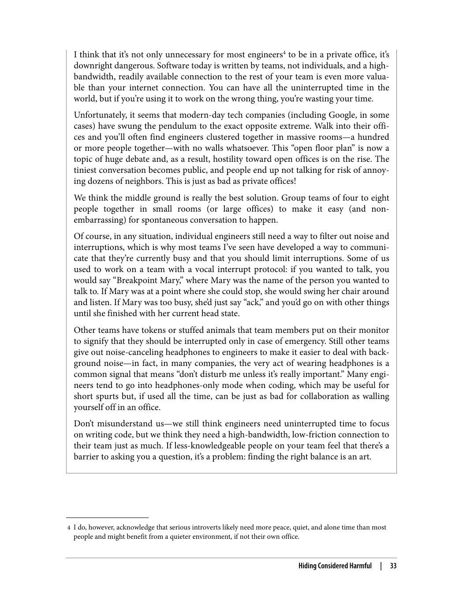

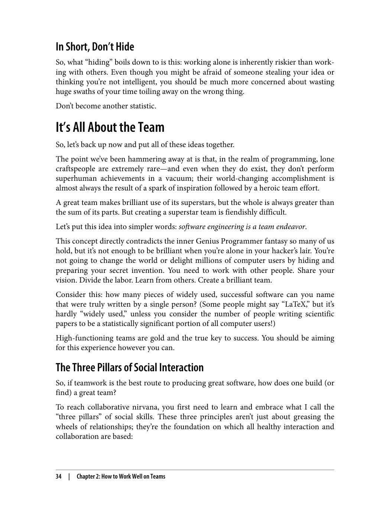

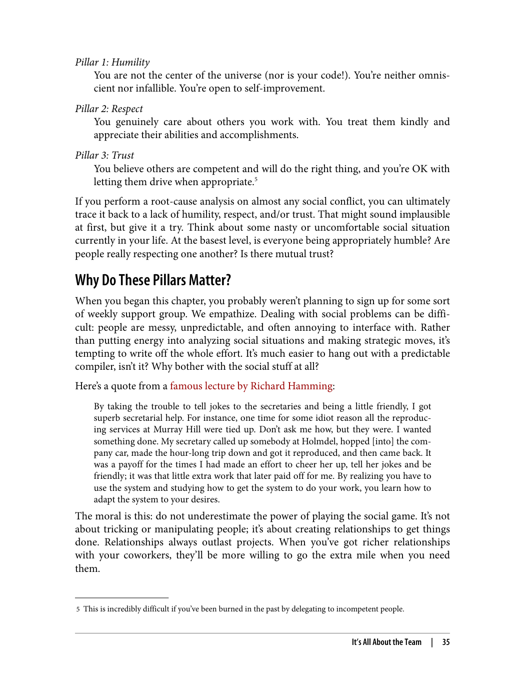

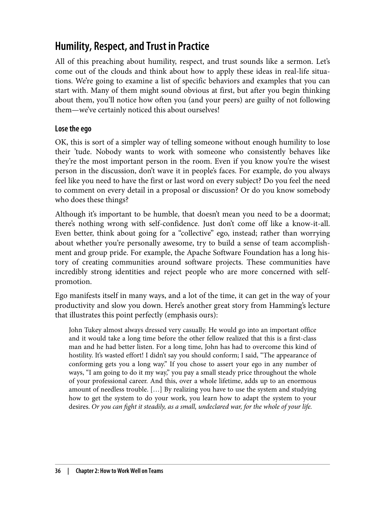

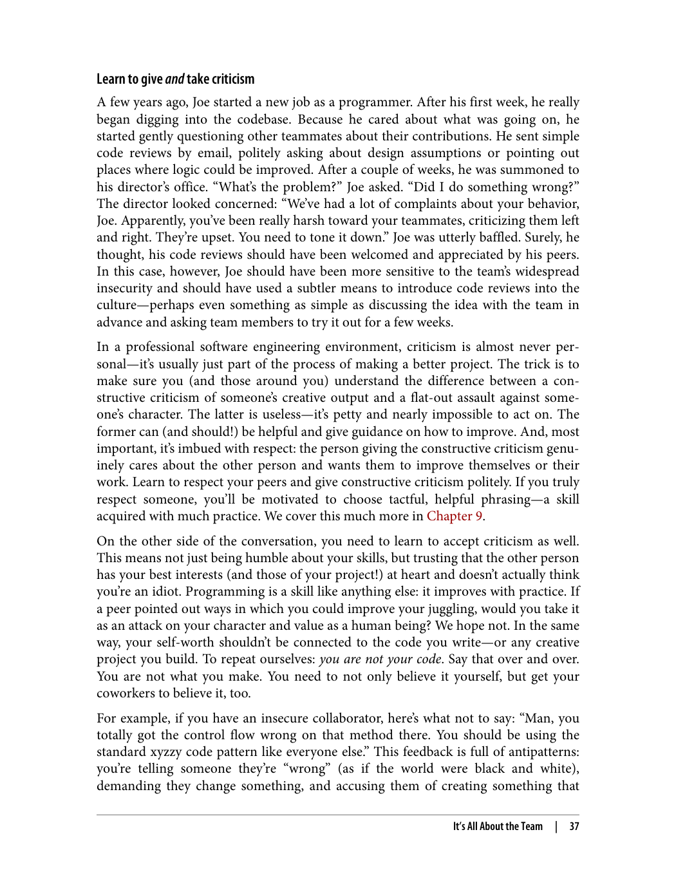

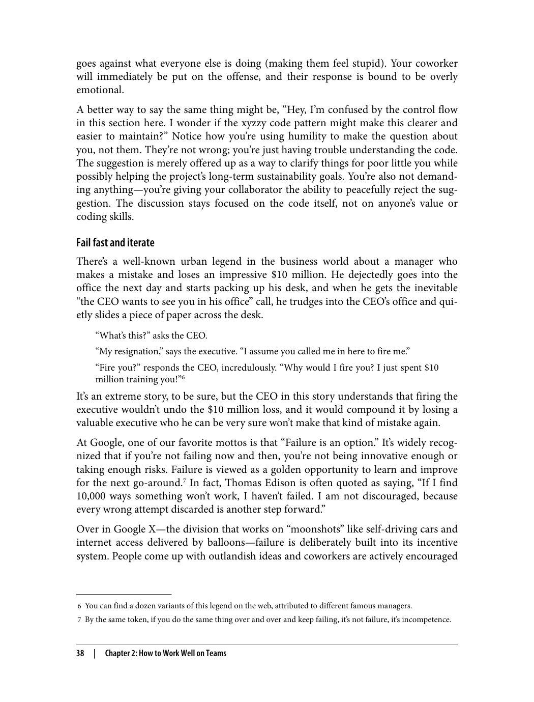

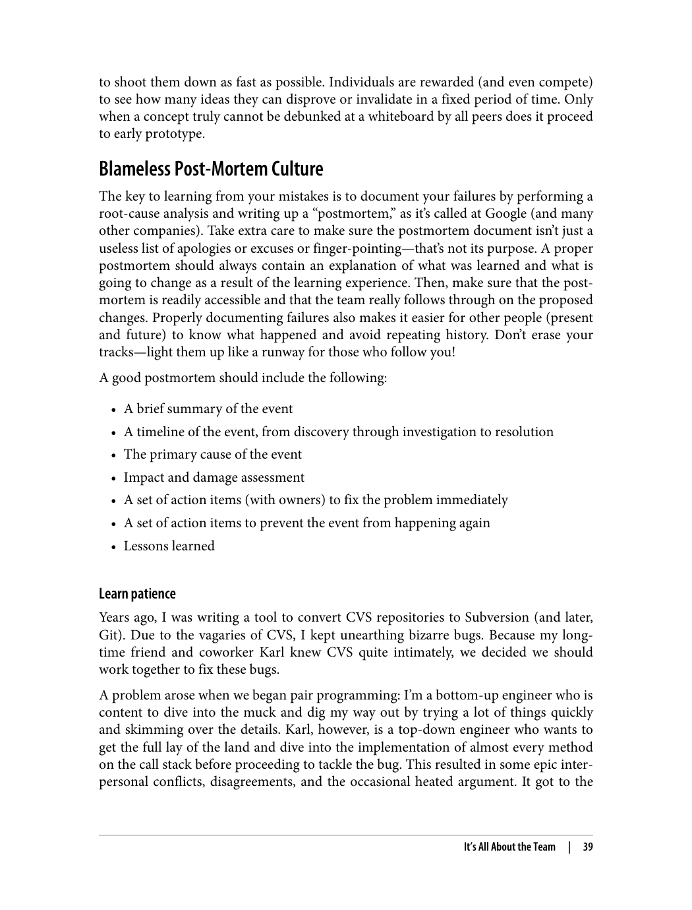

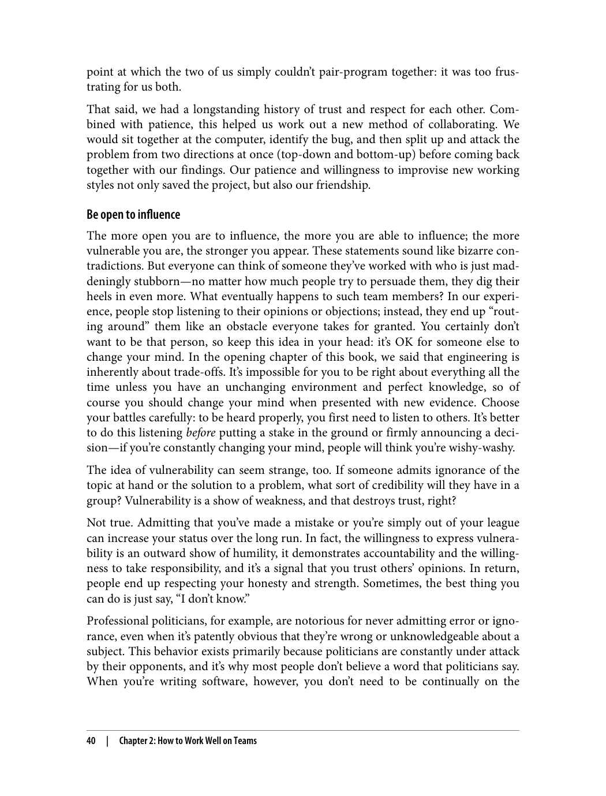

---

###### 📄 صفحه ۶۹
> Cares about the team
> Has empathy and respect for coworkers and actively works to help them without
> being asked, improving team cohesion.
> Does the right thing
> Has a strong sense of ethics about everything they do; willing to make difficult or
> inconvenient decisions to protect the integrity of the team and product.
> Now that we have these best-practice behaviors better defined, we've begun to shy
> away from using the term "Googley." It's always better to be specific about expect‐
> tions!
> Conclusion
> The foundation for almost any software endeavor—of almost any size—is a well-
> functioning team. Although the Genius Myth of the solo software developer still per‐
> sists, the truth is that no one really goes it alone. For a software organization to stand
> the test of time, it must have a healthy culture, rooted in humility, trust, and respect
> that revolves around the team, rather than the individual. Further, the creative nature
> of software development requires that people take risks and occasionally fail; for peo‐
> ple to accept that failure, a healthy team environment must exist.
> TL;DRs
> • Be aware of the trade-offs of working in isolation.
> • Acknowledge the amount of time that you and your team spend communicating
> and in interpersonal conflict. A small investment in understanding personalities
> and working styles of yourself and others can go a long way toward improving
> productivity.
> • If you want to work effectively with a team or a large organization, be aware of
> your preferred working style and that of others.
> 42
> |
> Chapter 2: How to Work Well on Teams

**به تیم اهمیت می‌دهد**
همدلی و احترام نسبت به همکاران دارد و بدون درخواست، به‌طور فعال برای کمک به آن‌ها تلاش می‌کند و هماهنگی تیم را بهبود می‌بخشد.

**کار درست را انجام می‌دهد**
احساس قوی اخلاقی نسبت به همه کارهایی که انجام می‌دهد دارد؛ حاضر است تصمیمات دشوار یا ناراحت‌کننده‌ای بگیرد تا یکپارچگی تیم و محصول را حفظ کند.

اکنون که این رفتارهای بهترین عمل را بهتر تعریف کرده‌ایم، شروع به پرهیز از استفاده از اصطلاح «گوگلی» کرده‌ایم. همیشه بهتر است انتظارات را مشخص بیان کنید!

**نتیجه‌گیری**
پایه و اساس تقریباً هر تلاش نرم‌افزاری — در تقریباً هر مقیاسی — یک تیم خوب‌عمل‌کننده است. اگرچه افسانه نابغه تک‌ توسعه‌دهنده نرم‌افزار همچنان پابرجاست، حقیقت این است که هیچ‌کس واقعاً به تنهایی عمل نمی‌کند. برای اینکه یک سازمان نرم‌افزاری دوام بیاورد، باید فرهنگ سالمی داشته باشد که در فروتنی، اعتماد و احترام ریشه داشته باشد و حول تیم به جای فرد بچرخد. علاوه بر این، ماهیت خلاقانه توسعه نرم‌افزار مستلزم آن است که افراد ریسک کنند و گاهی شکست بخورند؛ برای اینکه افراد این شکست را بپذیرند، محیط تیمی سالمی باید وجود داشته باشد.

**نکات کلیدی**
- از معاملات کار در انزوا آگاه باشید.
- میزان زمانی را که شما و تیم‌تان صرف ارتباطات و تعارضات بین‌فردی می‌کنید تصدیق کنید. سرمایه‌گذاری کوچک در درک شخصیت‌ها و سبک‌های کاری خود و دیگران می‌تواند در بهبود بهره‌وری بسیار مؤثر باشد.
- اگر می‌خواهید به‌طور مؤثر با یک تیم یا سازمان بزرگ کار کنید، از سبک کاری ترجیحی خود و دیگران آگاه باشید.

مقیاس یکی از مهم‌ترین عوامل در مهندسی نرم‌افزار است. هنگامی که یک پروژه از مقیاس کوچک به مقیاس بزرگ می‌رسد، چالش‌ها و راه‌حل‌ها به طور اساسی تغییر می‌کنند.

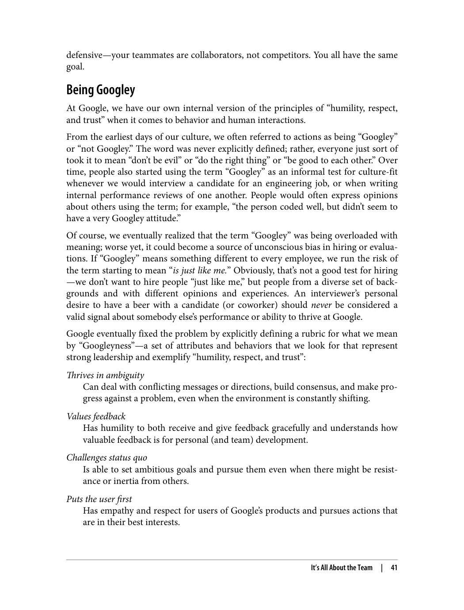

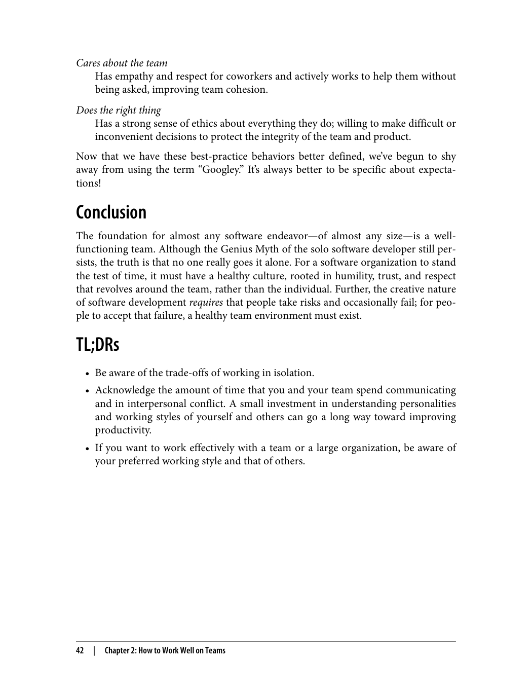

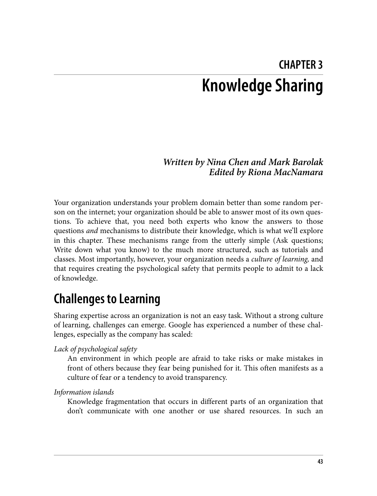

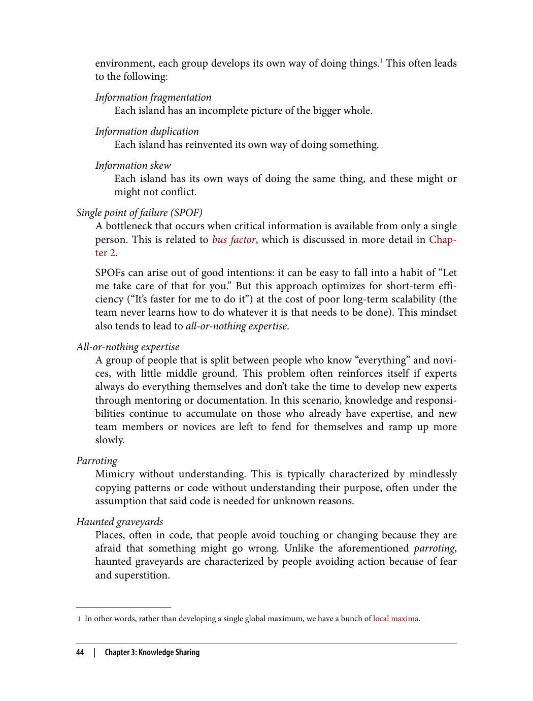

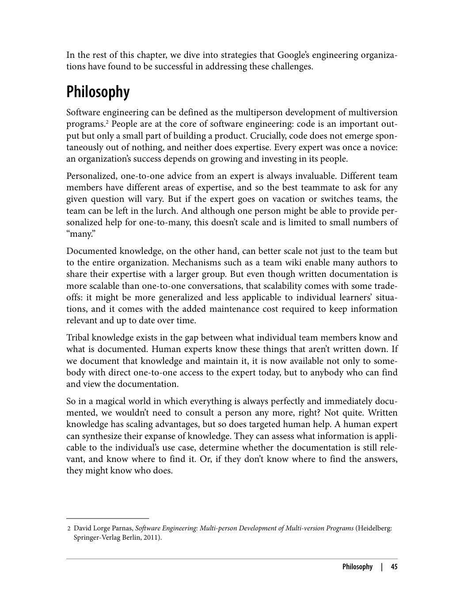

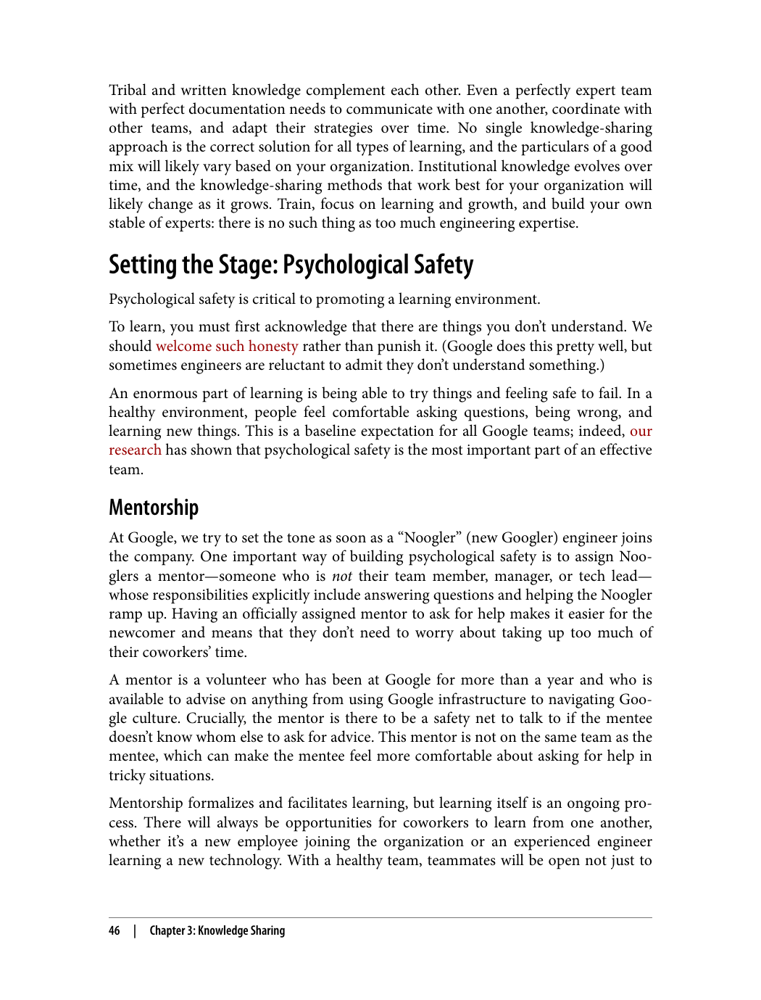

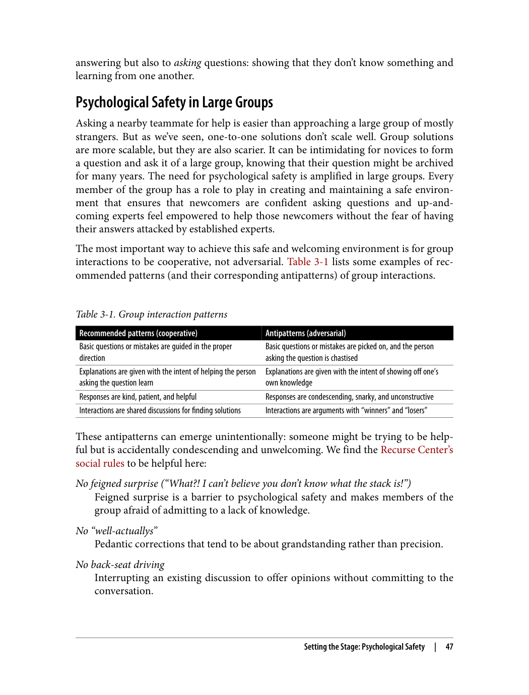

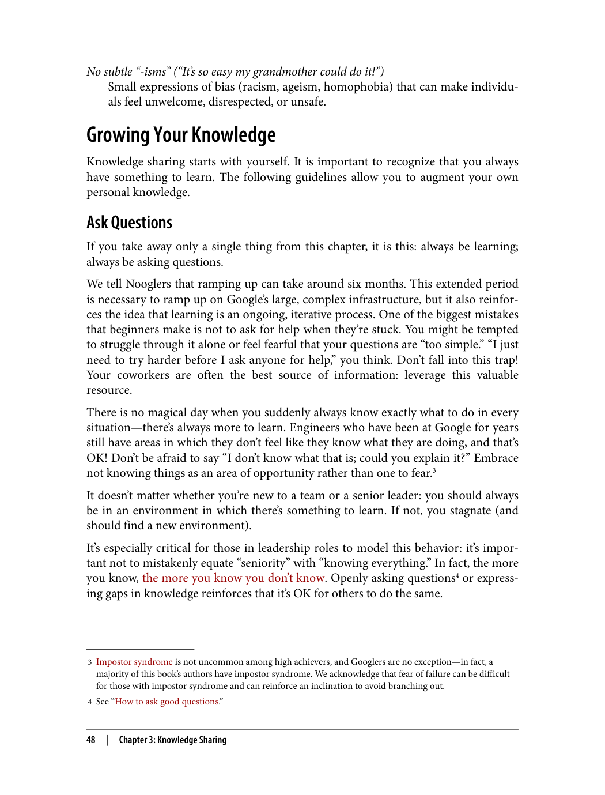

---

###### 📄 صفحه ۷۷
> Scaling Your Questions: Ask the Community
> Getting one-to-one help is high bandwidth but necessarily limited in scale. And as a
> learner, it can be difficult to remember every detail. Do your future self a favor: when
> you learn something from a one-to-one discussion, write it down.
> Chances are that future newcomers will have the same questions you had. Do them a
> favor, too, and share what you write down.
> Although sharing the answers you receive can be useful, it's also beneficial to seek
> help not from individuals but from the greater community. In this section, we exam‐
> ine different forms of community-based learning. Each of these approaches—group
> chats, mailing lists, and question-and-answer systems—have different trade-offs and
> complement one another. But each of them enables the knowledge seeker to get help
> from a broader community of peers and experts and also ensures that answers are
> broadly available to current and future members of that community.
> Group Chats
> When you have a question, it can sometimes be difficult to get help from the right
> person. Maybe you're not sure who knows the answer, or the person you want to ask
> is busy. In these situations, group chats are great, because you can ask your question
> to many people at once and have a quick back-and-forth conversation with whoever
> is available. As a bonus, other members of the group chat can learn from the question
> and answer, and many forms of group chat can be automatically archived and
> searched later.
> Group chats tend to be devoted either to topics or to teams. Topic-driven group chats
> are typically open so that anyone can drop in to ask a question. They tend to attract
> experts and can grow quite large, so questions are usually answered quickly. Team-
> oriented chats, on the other hand, tend to be smaller and restrict membership. As a
> result, they might not have the same reach as a topic-driven chat, but their smaller
> size can feel safer to a newcomer.
> Although group chats are great for quick questions, they don't provide much struc‐
> ture, which can make it difficult to extract meaningful information from a conversa‐
> tion in which you're not actively involved. As soon as you need to share information
> outside of the group, or make it available to refer back to later, you should write a
> document or email a mailing list.
> Mailing Lists
> Most topics at Google have a topic-users@ or topic-discuss@ Google Groups mailing
> list that anyone at the company can join or email. Asking a question on a public mail‐
> ing list is a lot like asking a group chat: the question reaches a lot of people who could
> 50
> |
> Chapter 3: Knowledge Sharing

**مقیاس‌بندی سؤالات خود: از جامعه بپرسید**
دریافت کمک یک‌به‌یک پهنای باند بالایی دارد اما لزوماً در مقیاس محدود است. و به عنوان یک یادگیرنده، به خاطر سپردن هر جزئیاتی می‌تواند دشوار باشد. به خود آینده‌تان لطف کنید: زمانی که از یک بحث یک‌به‌یک چیزی یاد گرفتید، آن را بنویسید.

احتمالاً تازه‌واردان آینده همان سؤالاتی را خواهند داشت که شما داشتید. به آن‌ها نیز لطف کنید و آنچه را می‌نویسید به اشتراک بگذارید.

اگرچه به اشتراک گذاشتن پاسخ‌هایی که دریافت می‌کنید مفید است، جستجوی کمک نه از افراد بلکه از جامعه بزرگ‌تر نیز سودمند است. در این بخش، ما اشکال مختلف یادگیری مبتنی بر جامعه را بررسی می‌کنیم. هر یک از این رویکردها — چت‌های گروهی، فهرست‌های پستی و سیستم‌های پرسش و پاسخ — معاملات متفاوتی دارند و یکدیگر را تکمیل می‌کنند. اما هر یک به جوینده دانش امکان می‌دهد از جامعه گسترده‌تری از همتایان و متخصصان کمک بگیرد و همچنین تضمین می‌کند که پاسخ‌ها به‌طور گسترده برای اعضای فعلی و آینده آن جامعه در دسترس باشند.

**چت‌های گروهی**
زمانی که سؤالی دارید، گاهی دریافت کمک از فرد مناسب می‌تواند دشوار باشد. شاید مطمئن نیستید چه کسی جواب را می‌داند، یا فردی که می‌خواهید بپرسید مشغول است. در این موقعیت‌ها، چت‌های گروهی عالی هستند، زیرا می‌توانید سؤال خود را همزمان از افراد زیادی بپرسید و مکالمه سریعی با هر کسی که در دسترس است داشته باشید. به عنوان یک مزیت، سایر اعضای چت گروهی نیز می‌توانند از پرسش و پاسخ بیاموزند و بسیاری از اشکال چت گروهی به‌طور خودکار بایگانی می‌شوند و می‌توان بعداً در آن‌ها جستجو کرد.

چت‌های گروهی معمولاً یا به موضوعات یا به تیم‌ها اختصاص دارند. چت‌های گروهی مبتنی بر موضوع معمولاً باز هستند تا هر کسی بتواند برای پرسیدن سؤالی وارد شود. این چت‌ها تمایل دارند متخصصان را جذب کنند و می‌توانند بسیار بزرگ شوند، بنابراین سؤالات معمولاً به سرعت پاسخ داده می‌شوند. از طرف دیگر، چت‌های تیمی معمولاً کوچک‌تر هستند و عضویت را محدود می‌کنند. در نتیجه، شاید همان دسترسی چت‌های مبتنی بر موضوع را نداشته باشند، اما اندازه کوچک‌تر آن‌ها می‌تواند برای یک تازه‌وارد احساس امنیت بیشتری ایجاد کند.

اگرچه چت‌های گروهی برای سؤالات سریع عالی هستند، ساختار زیادی ارائه نمی‌دهند، که می‌تواند استخراج اطلاعات معنادار از مکالمه‌ای را که در آن به‌طور فعال مشارکت ندارید دشوار کند. به محض اینکه نیاز دارید اطلاعاتی را خارج از گروه به اشتراک بگذارید یا آن را برای مراجعه بعدی در دسترس قرار دهید، باید یک سند بنویسید یا به یک فهرست پستی ایمیل بزنید.

**فهرست‌های پستی**
بیشتر موضوعات در گوگل یک فهرست پستی topic-users@ یا topic-discuss@ Google Groups دارند که هر کسی در شرکت می‌تواند به آن بپیوندد یا ایمیل بزند. پرسیدن سؤالی در یک فهرست پستی عمومی بسیار شبیه پرسیدن در یک چت گروهی است: سؤال به افراد زیادی می‌رسد که می‌توانند

در مقیاس کوچک، ارتقای کامپایلر ممکن است فقط چند روز طول بکشد. اما در مقیاس بزرگ، مانند گوگل با میلیون‌ها خط کد، این کار ماه‌ها یا حتی سال‌ها زمان می‌برد.

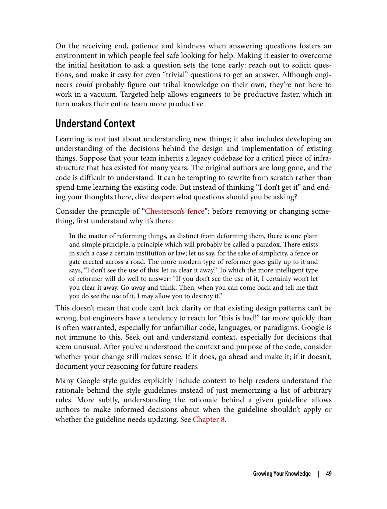

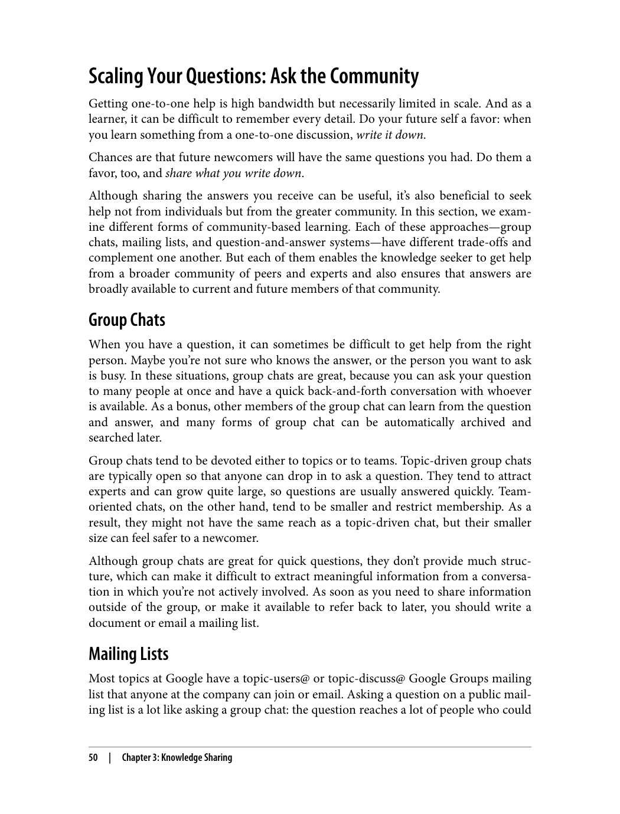

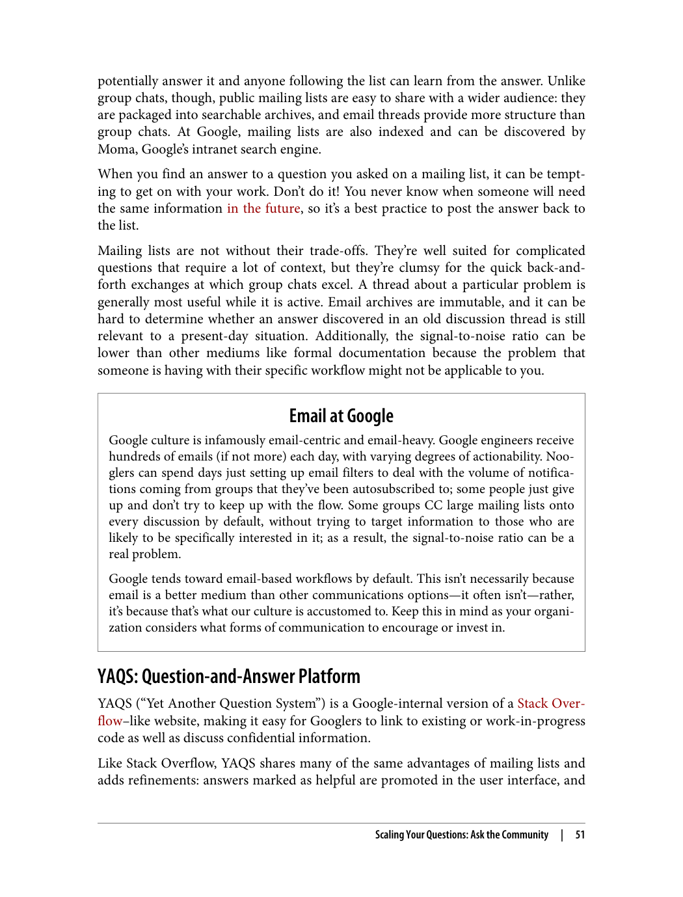

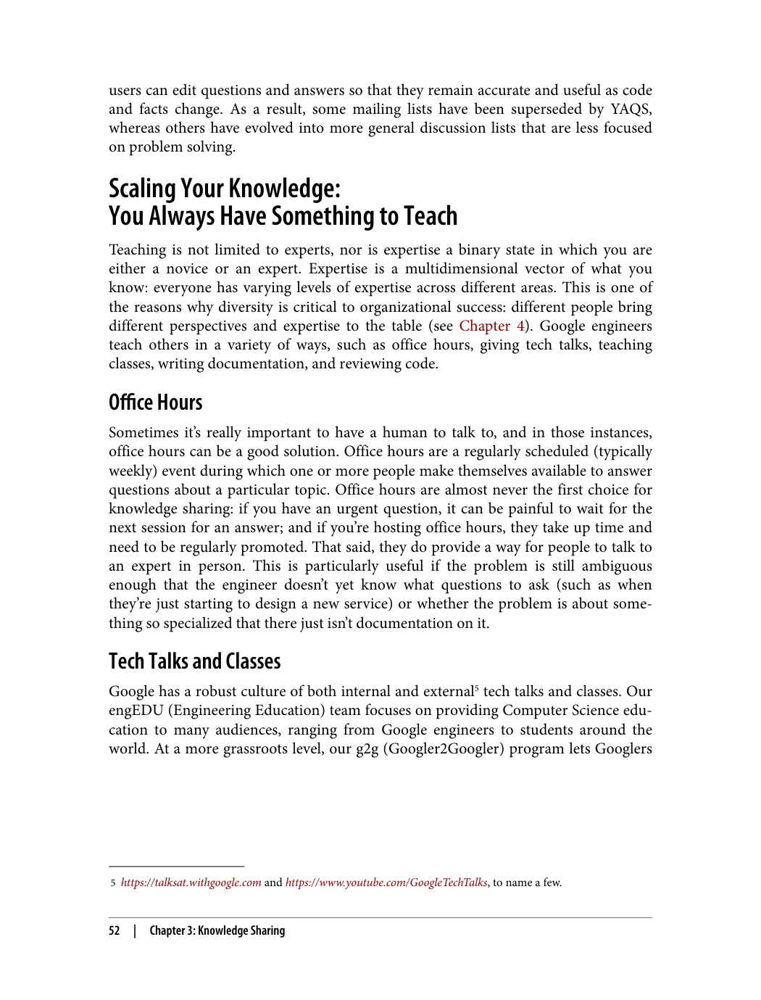

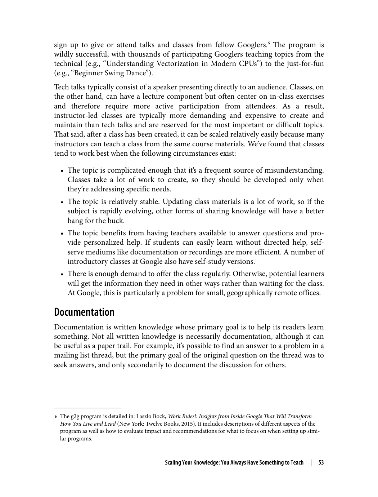

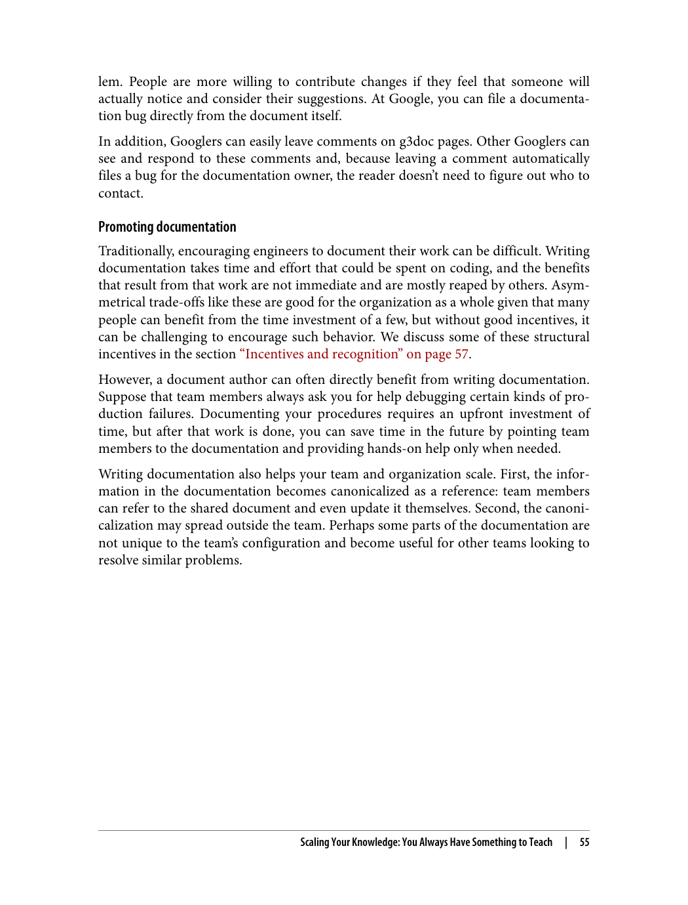

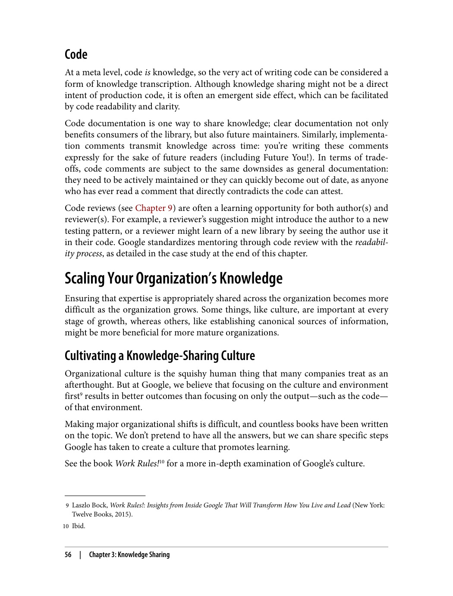

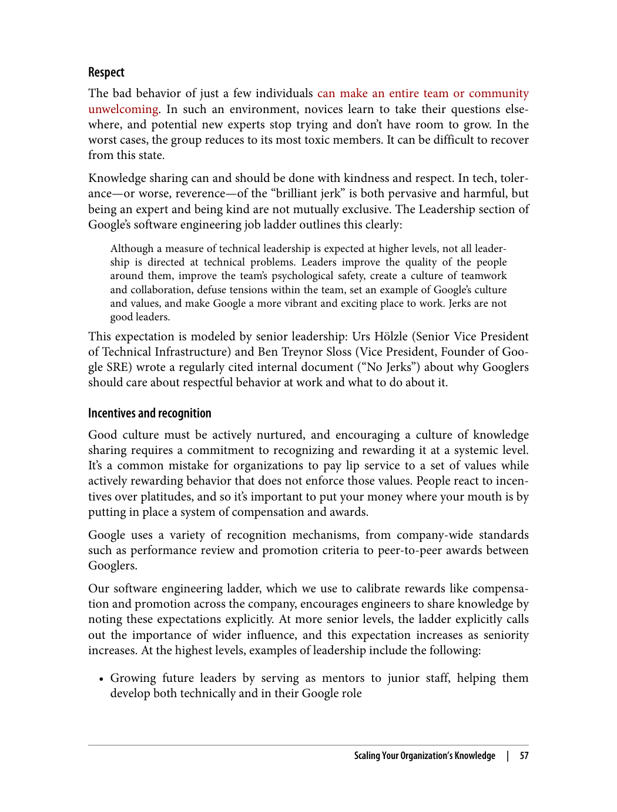

---