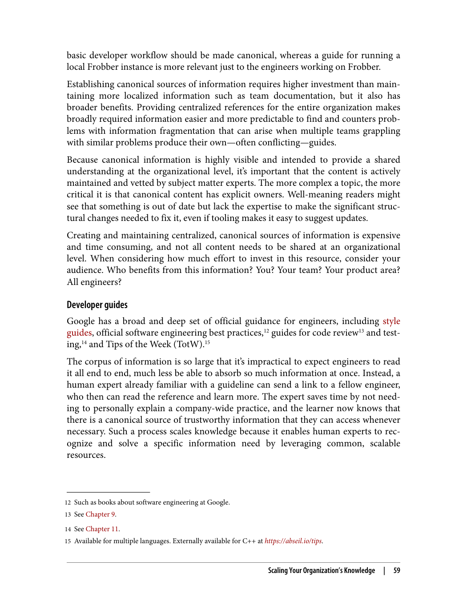
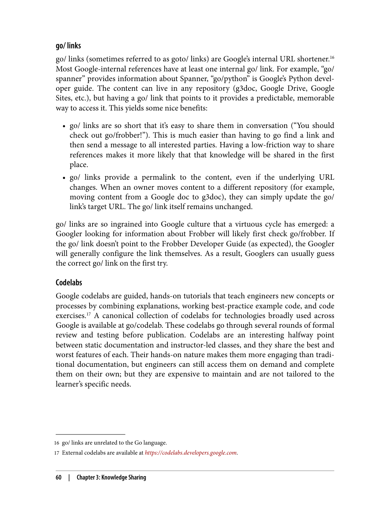
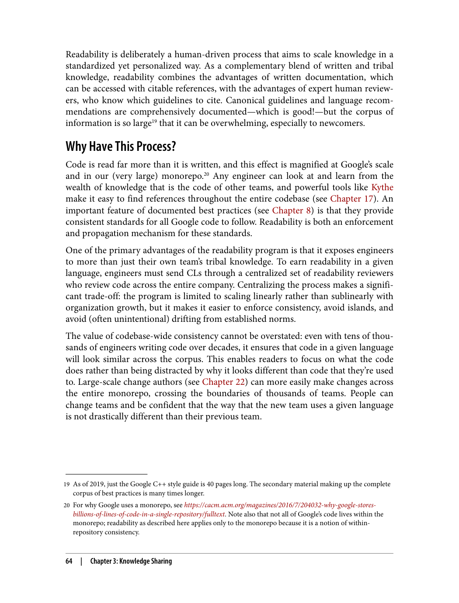
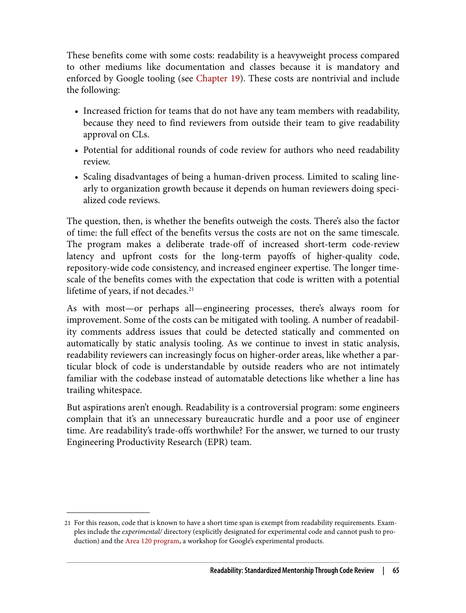
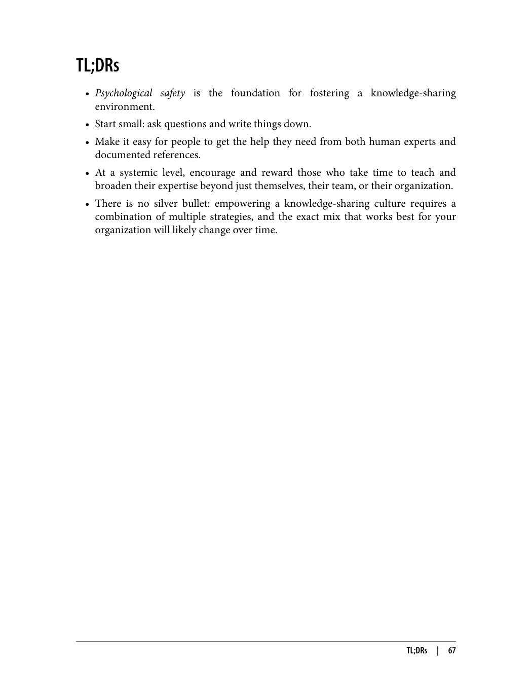
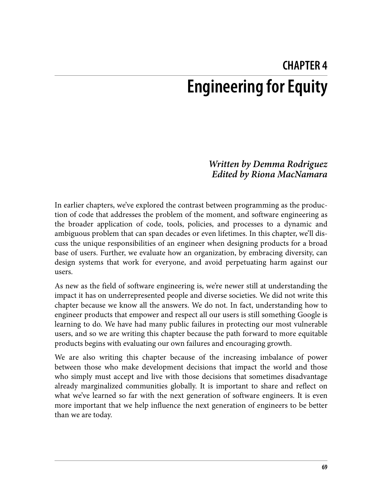
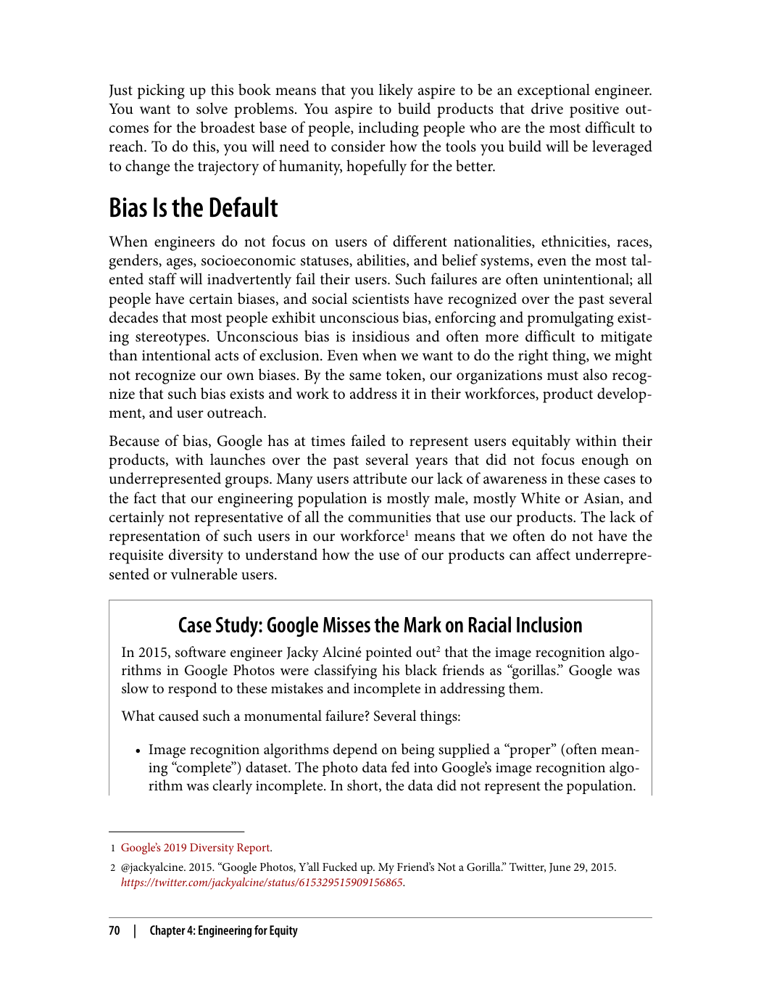

## فصل ۴: هزینه‌ها و مبادلات

---

> "هر تصمیم مهندسی، یک مبادله است. هزینه‌ها و مزایا باید به دقت سنجیده شوند."

### درک هزینه‌ها

> "هزینه‌های نرم‌افزار شامل هزینه‌های مستقیم و غیرمستقیم است."

هزینه‌های نرم‌افزار فقط شامل هزینه‌های مستقیم مانند حقوق برنامه‌نویسان نیست. هزینه‌های غیرمستقیم مانند زمان از دست رفته، باگ‌ها و مشکلات نگهداری نیز بسیار مهم هستند.

### مثال: علامت‌گذاری‌های وایت‌بورد

> "ساده‌ترین مثال، علامت‌گذاری‌های وایت‌بورد است. آیا ارزش دارد که یک فرآیند خرید ایجاد کنیم؟"

این مثال نشان می‌دهد که گاهی اوقات هزینه فرآیند خرید بیشتر از خود محصول است. در چنین مواردی، بهتر است فرآیند ساده‌تری داشته باشیم.

### مثال: سیستم‌های ساخت توزیع‌شده

> "آیا ارزش دارد که یک سیستم ساخت توزیع‌شده پیچیده ایجاد کنیم؟"

در مقیاس بزرگ، سیستم‌های ساخت توزیع‌شده می‌توانند زمان ساخت را از ساعت‌ها به دقیقه‌ها کاهش دهند. اما هزینه ایجاد و نگهداری آن‌ها نیز بالاست.

### اصول تصمیم‌گیری

1. **اندازه‌گیری هزینه‌ها**: هزینه‌ها و مزایا باید به دقت اندازه‌گیری شوند
2. **در نظر گرفتن مقیاس**: تصمیمات باید با مقیاس پروژه متناسب باشند
3. **iterative approach**: تصمیمات باید به صورت تدریجی و با بازخورد اصلاح شوند

---

# بخش دوم: فرهنگ

---