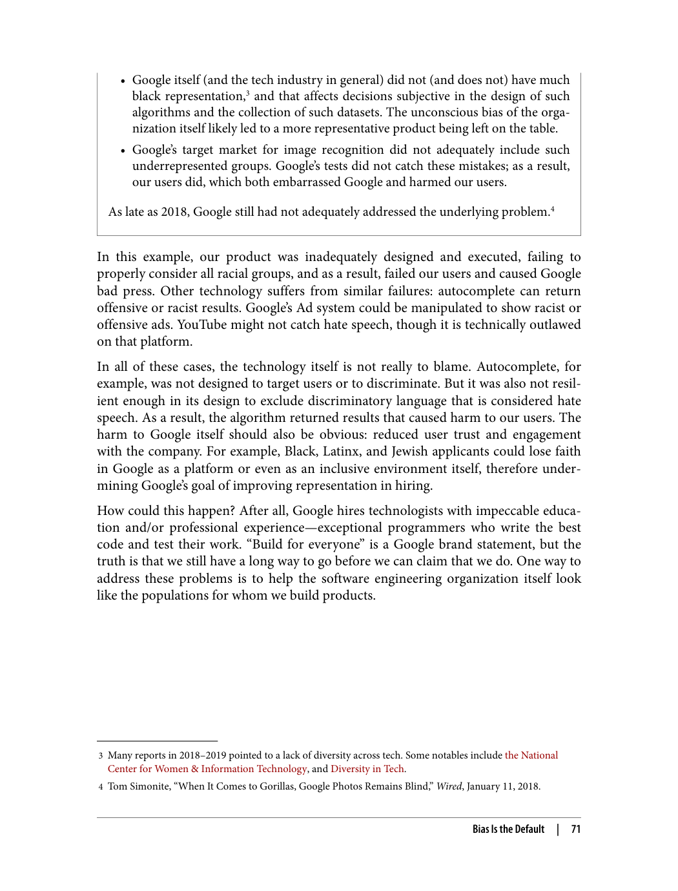
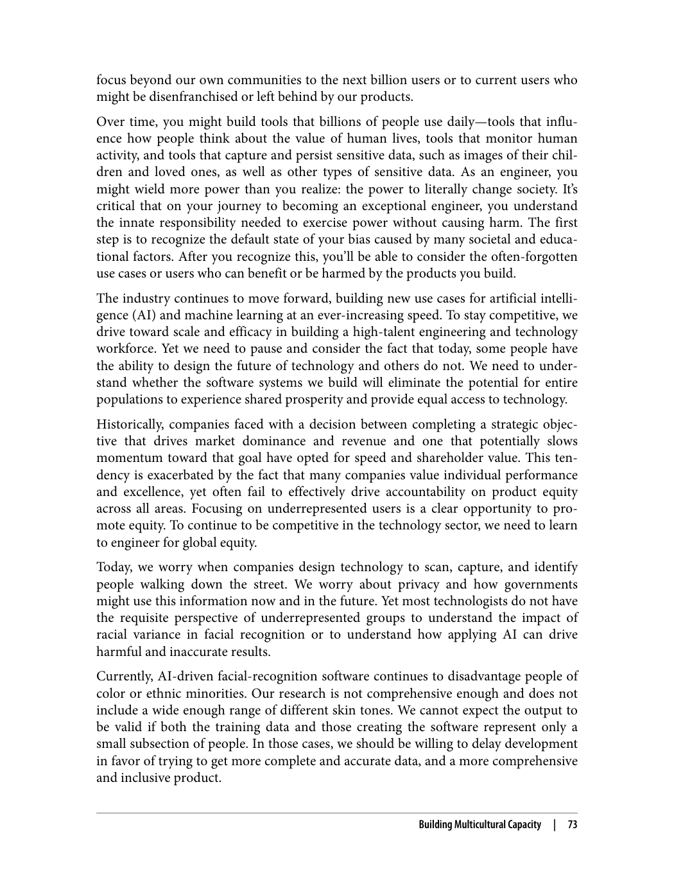

## فصل ۵: مهندسی نرم‌افزار به‌عنوان یک تلاش تیمی

---

> "نرم‌افزار یک تلاش تیمی است. ستون‌های تعامل اجتماعی - فروتنی، احترام و اعتماد - پایه و اساس کار تیمی هستند."

### ستون‌های تعامل اجتماعی

> "فروتنی، احترام و اعتماد، سه ستون اصلی تعامل اجتماعی هستند."

این سه ستون پایه و اساس کار تیمی مؤثر هستند. بدون آن‌ها، کار تیمی به درستی انجام نمی‌شود.

### فروتنی

> "فروتنی یعنی توانایی یادگیری از دیگران و پذیرش اینکه ممکن است اشتباه کنید."

فروتنی به معنای کم‌ارزش دانستن خود نیست. بلکه به معنای توانایی یادگیری از دیگران و پذیرش بازخورد است.

### احترام

> "احترام به معنای ارزش قائل شدن برای دیگران و نظرات آن‌ها است."

احترام به معنای گوش دادن به دیگران و در نظر گرفتن دیدگاه‌های آن‌ها است. حتی اگر با آن‌ها موافق نباشید.

### اعتماد

> "اعتماد به معنای باور داشتن به توانایی‌های دیگران و ایجاد محیطی امن برای ابراز نظرات است."

اعتماد پایه و اساس هر تیم موفق است. بدون اعتماد، اعضای تیم نمی‌توانند به طور مؤثر با هم کار کنند.

### فرهنگ یادگیری

> "فرهنگ یادگیری به معنای ایجاد محیطی است که در آن اعضا بتوانند از یکدیگر یاد بگیرند."

در فرهنگ یادگیری، اشتباهات به عنوان فرصت‌های یادگیری در نظر گرفته می‌شوند، نه دلیلی برای سرزنش.

---