> **راهنمای مطالعه**
>
> در هر بخش، ابتدا متن اصلی کتاب به زبان انگلیسی آورده شده و سپس ترجمه و توضیحات فارسی همان بخش ارائه شده است.

---
-

###### 📄 صفحه ۹۹
> Understanding the Need for Diversity
> At Google, we believe that being an exceptional engineer requires that you also focus
> on bringing diverse perspectives into product design and implementation. It also
> means that Googlers responsible for hiring or interviewing other engineers must con‐
> tribute to building a more representative workforce. For example, if you interview
> other engineers for positions at your company, it is important to learn how biased
> outcomes happen in hiring. There are significant prerequisites for understanding
> how to anticipate harm and prevent it. To get to the point where we can build for
> everyone, we first must understand our representative populations. We need to
> encourage engineers to have a wider scope of educational training.
> The first order of business is to disrupt the notion that as a person with a computer
> science degree and/or work experience, you have all the skills you need to become
> an exceptional engineer. A computer science degree is often a necessary foundation.
> However, the degree alone (even when coupled with work experience) will not make
> you an engineer. It is also important to disrupt the idea that only people with com‐
> puter science degrees can design and build products. Today, most programmers do
> have a computer science degree; they are successful at building code, establishing the‐
> ories of change, and applying methodologies for problem solving. However, as the
> aforementioned examples demonstrate, this approach is insufficient for inclusive and
> equitable engineering.
> Engineers should begin by focusing all work within the framing of the complete eco‐
> system they seek to influence. At minimum, they need to understand the population
> demographics of their users. Engineers should focus on people who are different than
> themselves, especially people who might attempt to use their products to cause harm.
> The most difficult users to consider are those who are disenfranchised by the pro‐
> cesses and the environment in which they access technology. To address this chal‐
> lenge, engineering teams need to be representative of their existing and future users.
> In the absence of diverse representation on engineering teams, individual engineers
> need to learn how to build for all users.
> Building Multicultural Capacity
> One mark of an exceptional engineer is the ability to understand how products can
> advantage and disadvantage different groups of human beings. Engineers are
> expected to have technical aptitude, but they should also have the discernment to
> know when to build something and when not to. Discernment includes building the
> capacity to identify and reject features or products that drive adverse outcomes.
> This is a lofty and difficult goal, because there is an enormous amount of individualism
> that goes into being a high-performing engineer. Yet to succeed, we must extend our
> 72
> |
> Chapter 4: Engineering for Equity

**درک نیاز به تنوع (Diversity)**

در گوگل، ما معتقدیم که یک مهندس استثنایی بودن مستلزم تمرکز بر آوردن دیدگاه‌های متنوع به طراحی و پیاده‌سازی محصول نیز هست. همچنین به این معناست که Googlers مسئول استخدام یا مصاحبه با مهندسان دیگر باید در ساخت نیروی کار نماینده‌تر مشارکت کنند. به عنوان مثال، اگر شما با مهندسان دیگر برای موقعیت‌های شرکت‌تان مصاحبه می‌کنید، مهم است که بیاموزید چگونه نتایج مغرضانه در استخدام اتفاق می‌افتند. پیش‌نیازهای قابل‌توجهی برای درک اینکه چگونه آسیب را پیش‌بینی و از آن جلوگیری کنیم وجود دارد. برای رسیدن به جایی که بتوانیم برای همه بسازیم، ابتدا باید جمعیت‌های نماینده خود را درک کنیم. نیاز داریم مهندسان را تشویق کنیم تا دامنه آموزش گسترده‌تری داشته باشند.

اولین اولویت، بر هم زدن این تصور است که به عنوان فردی با مدرک علوم کامپیوتر و/یا تجربه کاری، تمام مهارت‌های لازم برای تبدیل شدن به یک مهندس استثنایی را دارید. مدرک علوم کامپیوتر اغلب یک پایه ضروری است. با این حال، خود مدرک (حتی زمانی که با تجربه کاری همراه باشد) شما را مهندس نمی‌کند. همچنین مهم است که این ایده را که فقط افرادی با مدرک علوم کامپیوتر می‌توانند محصولات طراحی و بسازند نیز بر هم بزنیم. امروزه، بیشتر برنامه‌نویسان مدرک علوم کامپیوتر دارند؛ آن‌ها در ساخت کد، ایجاد نظریه‌های تغییر و اعمال روش‌های حل مسئله موفق هستند. با این حال، همانطور که مثال‌های فوق نشان می‌دهد، این رویکرد برای مهندسی فراگیر و عادلانه کافی نیست.

مهندسان باید با تمرکز بر تمام کارها در چارچوب اکوسیستم کاملی که می‌خواهند بر آن تأثیر بگذارند شروع کنند. حداقل، آن‌ها باید جمعیت‌شناسی کاربران خود را درک کنند. مهندسان باید بر افرادی که متفاوت از خودشان هستند تمرکز کنند، به ویژه افرادی که ممکن است سعی کنند از محصولات آن‌ها برای ایجاد آسیب استفاده کنند. دشوارترین کاربران برای در نظر گرفتن، کسانی هستند که توسط فرآیندها و محیطی که از طریق آن به فناوری دسترسی پیدا می‌کنند محروم شده‌اند. برای مقابله با این چالش، تیم‌های مهندسی باید نماینده کاربران فعلی و آینده خود باشند. در غیاب نمایندگی متنوع در تیم‌های مهندسی، مهندسان منفرد باید بیاموزند چگونه برای همه کاربران بسازند.

**توانمندسازی چندفرهنگی**

یکی از نشانه‌های یک مهندس استثنایی، توانایی درک این است که چگونه محصولات می‌توانند گروه‌های مختلف انسانی را در مزیت یا مضیقه قرار دهند. از مهندسان انتظار می‌رود صلاحیت فنی داشته باشند، اما همچنین باید تشخیص بدهند که چه زمانی چیزی بسازند و چه زمانی نسازند. تشخیص شامل ایجاد توانایی شناسایی و رد ویژگی‌ها یا محصولاتی است که نتایج نامطلوب ایجاد می‌کنند. این هدفی بلندپروازانه و دشوار است، زیرا میزان زیادی فردیت در یک مهندس با عملکرد بالا وجود دارد. با این حال، برای موفقیت باید فراتر برویم

این سه ستون پایه و اساس کار تیمی مؤثر هستند. بدون آن‌ها، کار تیمی به درستی انجام نمی‌شود.

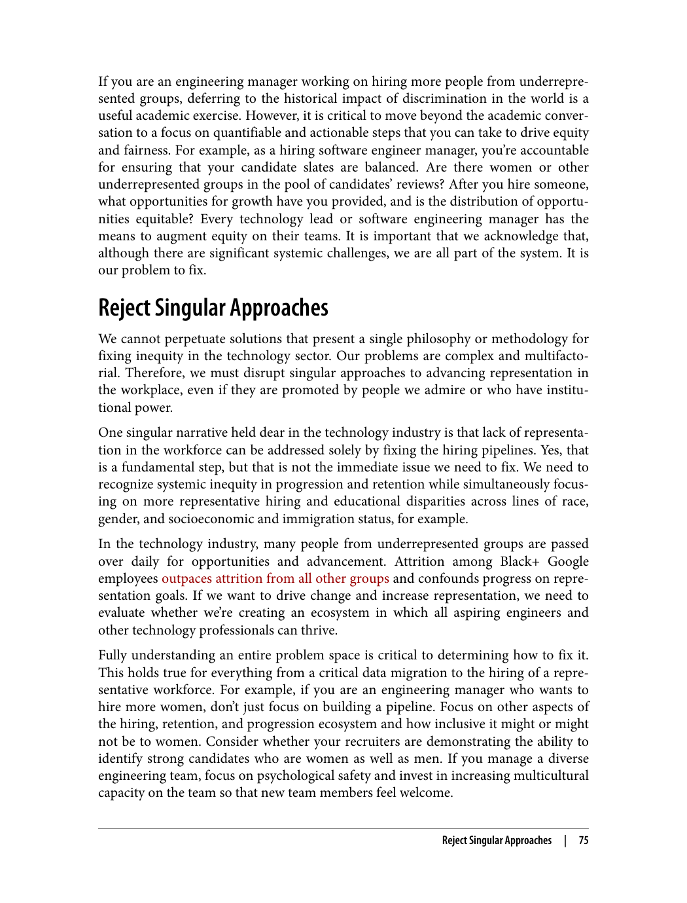

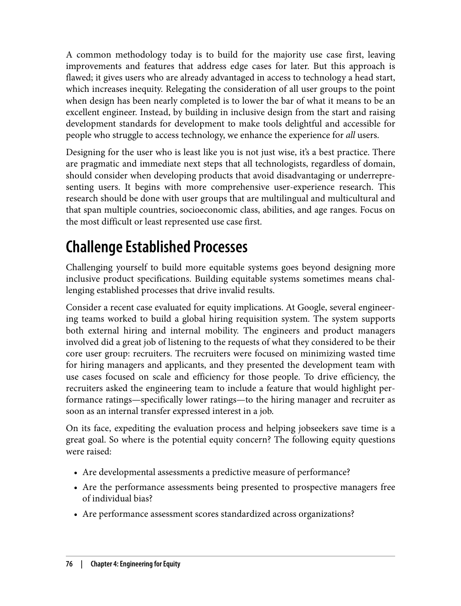

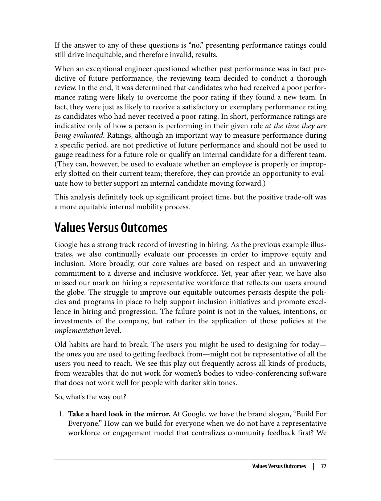

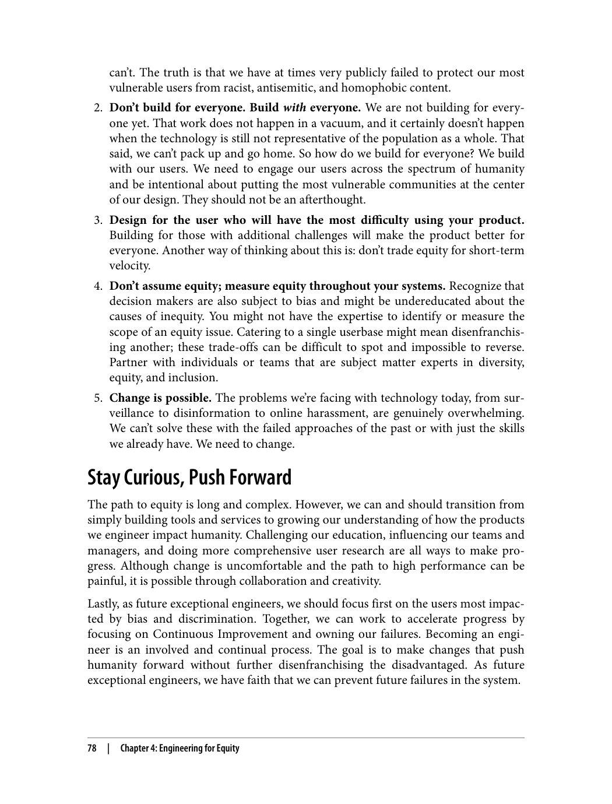

---

###### 📄 صفحه ۱۰۷

فروتنی به معنای کم‌ارزش دانستن خود نیست. بلکه به معنای توانایی یادگیری از دیگران و پذیرش بازخورد است.

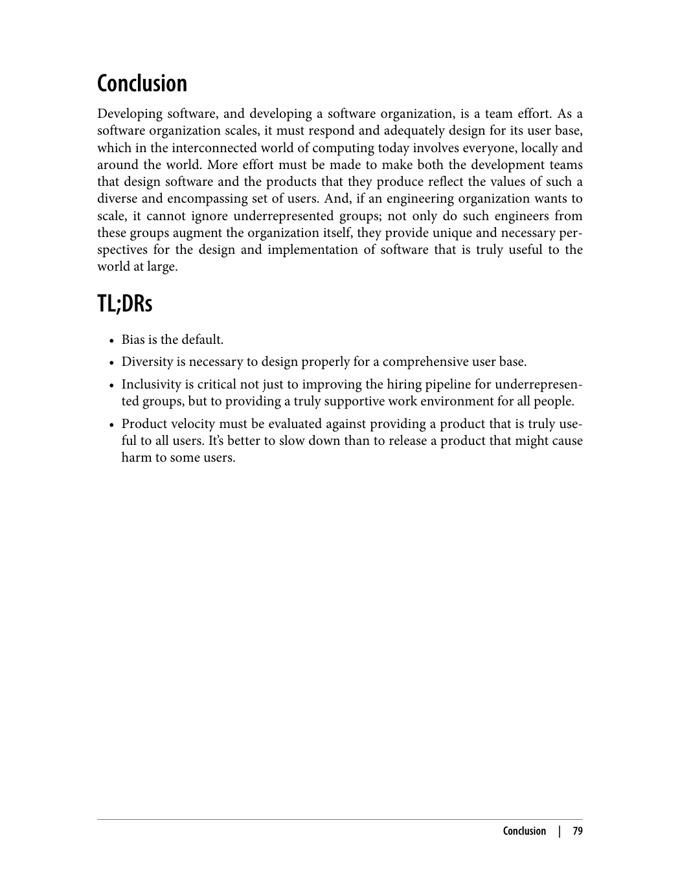

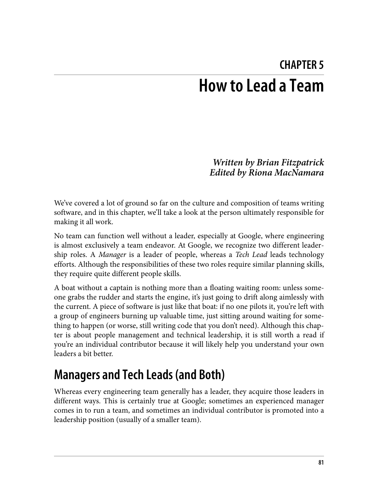

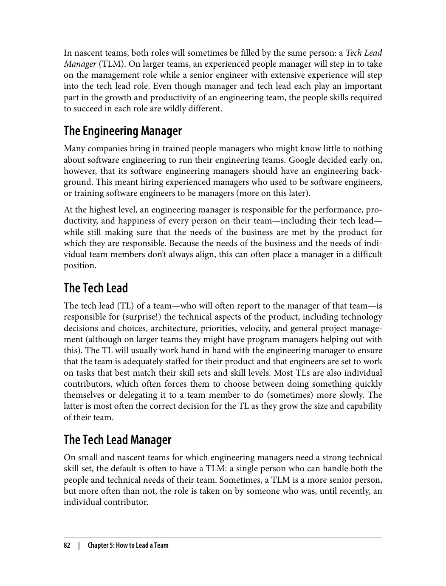

---

###### 📄 صفحه ۱۱۱
> 1 Another difference that takes getting used to is that the things we do as managers typically pay off over a
> longer timeline.
> your team resolve conflicts, make decisions, and coordinate people. It happens all the
> time, and often by accident. Maybe you never intended to become a "leader," but
> somehow it happened anyway. Some people refer to this affliction as "manageritis."
> Even if you've sworn to yourself that you'll never become a manager, at some point in
> your career, you're likely to find yourself in a leadership position, especially if you've
> been successful in your role. The rest of this chapter is intended to help you under‐
> stand what to do when this happens.
> We're not here to attempt to convince you to become a manager, but rather to help
> show why the best leaders work to serve their team using the principles of humility,
> respect, and trust. Understanding the ins and outs of leadership is a vital skill for
> influencing the direction of your work. If you want to steer the boat for your project
> and not just go along for the ride, you need to know how to navigate, or you'll run
> yourself (and your project) onto a sandbar.
> The Only Thing to Fear Is…Well, Everything
> Aside from the general sense of malaise that most people feel when they hear the
> word "manager," there are a number of reasons that most people don't want to
> become managers. The biggest reason you'll hear in the software development world
> is that you spend much less time writing code. This is true whether you become a TL
> or an engineering manager, and I'll talk more about this later in the chapter, but first,
> let's cover some more reasons why most of us avoid becoming managers.
> If you've spent the majority of your career writing code, you typically end a day with
> something you can point to—whether it's code, a design document, or a pile of bugs
> you just closed—and say, "That's what I did today." But at the end of a busy day of
> "management," you'll usually find yourself thinking, "I didn't do a damned thing
> today." It's the equivalent of spending years counting the number of apples you picked
> each day and changing to a job growing bananas, only to say to yourself at the end of
> each day, "I didn't pick any apples," happily ignoring the flourishing banana trees sit‐
> ting next to you. Quantifying management work is more difficult than counting
> widgets you turned out, but just making it possible for your team to be happy and
> productive is a big measure of your job. Just don't fall into the trap of counting apples
> when you're growing bananas.1
> Another big reason for not becoming a manager is often unspoken but rooted in the
> famous "Peter Principle," which states that "In a hierarchy every employee tends to
> rise to his level of incompetence." Google generally avoids this by requiring that a
> person perform the job above their current level for a period of time (i.e., to "exceeds
> 84
> |
> Chapter 5: How to Lead a Team

با این حال، تفاوت دیگری وجود دارد که نیاز به عادت دارد و آن این است که کارهایی که به عنوان مدیر انجام می‌دهیم معمولاً در بازه زمانی طولانی‌تری نتیجه می‌دهند.

تیم شما در حل تعارضات، تصمیم‌گیری و هماهنگی افراد کمک می‌کند. این اتفاق مدام می‌افتد و اغلب به صورت تصادفی است. شاید هرگز قصد «رهبر» شدن نداشتید، اما به هر حال اتفاق افتاده است. برخی این وضعیت را «مدیریت‌زدگی» (manageritis) می‌نامند. حتی اگر با خودتان عهد بسته باشید که هرگز مدیر نشوید، در نقطه‌ای از حرفه‌تان احتمالاً خود را در موقعیت رهبری خواهید یافت، به ویژه اگر در نقش خود موفق بوده باشید. بقیه این فصل برای کمک به شما در درک اینکه چه کاری انجام دهید وقتی این اتفاق می‌افتد در نظر گرفته شده است.

ما اینجا نیستیم که سعی کنیم شما را متقاعد کنیم مدیر شوید، بلکه برای کمک به نشان دادن این هستیم که چرا بهترین رهبران با استفاده از اصول فروتنی، احترام و اعتماد تلاش می‌کنند به تیم خود خدمت کنند. درک جزئیات رهبری مهارتی حیاتی برای تأثیرگذاری بر جهت کار شماست. اگر می‌خواهید برای پروژه خود فرمان روی دست بگیرید و فقط برای سواری همراه نباشید، باید بدانید چگونه ناوبری کنید، وگرنه خودتان (و پروژه‌تان) را به یک شن‌زار می‌کشانید.

**تنها چیزی که باید از آن بترسید... خب، همه چیز است**

علاوه بر حالت ناخوشایند عمومی که بیشتر مردم هنگام شنیدن کلمه «مدیر» احساس می‌کنند، دلایل متعددی وجود دارد که بیشتر مردم نمی‌خواهند مدیر شوند. بزرگ‌ترین دلیلی که در دنیای توسعه نرم‌افزار می‌شنوید این است که زمان کمتری صرف نوشتن کد می‌کنید. این چه TL (Tech Lead) شوید و چه engineering manager، صادق است و بعداً در این فصل بیشتر درباره آن صحبت خواهم کرد، اما ابتدا بیایید دلایل بیشتری را بررسی کنیم که چرا بیشتر ما از مدیر شدن اجتناب می‌کنیم.

اگر بیشتر دوران حرفه‌ای خود را صرف نوشتن کد کرده باشید، معمولاً روز را با چیزی به پایان می‌رسانید که می‌توانید به آن اشاره کنید — چه کد باشد، چه یک سند طراحی، چه انبوهی از باگ‌هایی که تازه بسته‌اید — و بگویید «این کاری بود که امروز انجام دادم.» اما در پایان یک روز شلوغ «مدیریت»، معمولاً خود را در حال فکر کردن می‌یابید: «امروز کوفتی انجام ندادم.» این معادل سال‌ها شمردن تعداد سیب‌هایی است که هر روز چیده‌اید و تغییر شغل به پرورش موز، فقط برای اینکه در پایان هر روز به خودتان بگویید «هیچ سیبی نچیدم» و خوشبختانه درختان موز شکوفان کنارتان را نادیده بگیرید. کمیّ‌سازی کار مدیریت دشوارتر از شمردن محصولاتی است که تولید کرده‌اید، اما فقط امکان‌پذیر کردن شادی و بهره‌وری تیم‌تان معیار بزرگی از کار شماست. فقط در دام شمردن سیب‌ها وقتی دارید موز پرورش می‌دهید نیفتید.

یک دلیل بزرگ دیگر برای مدیر نشدن اغلب بیان نمی‌شود اما در «اصل پیتر» (Peter Principle) معروف ریشه دارد که بیان می‌کند «در یک سلسله‌مراتب، هر کارمندی تمایل دارد تا سطح عدم شایستگی خود بالا برود.» گوگل معمولاً از این امر با الزام اینکه یک فرد برای مدتی شغل بالاتر از سطح فعلی خود را انجام دهد (یعنی «فراتر از

احترام به معنای گوش دادن به دیگران و در نظر گرفتن دیدگاه‌های آن‌ها است. حتی اگر با آن‌ها موافق نباشید.

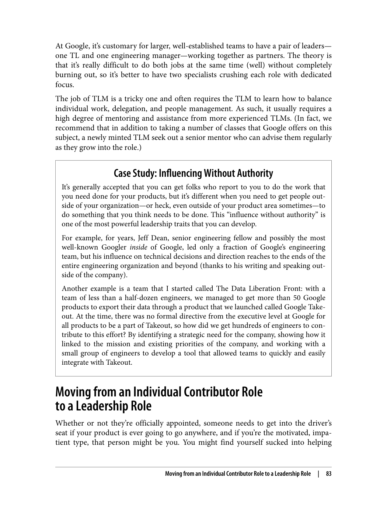

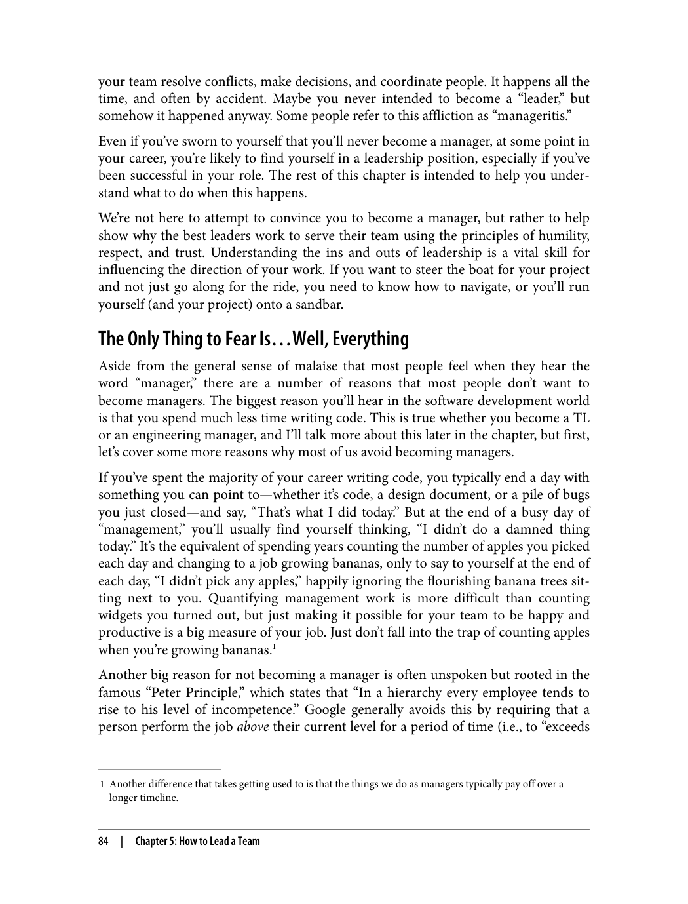

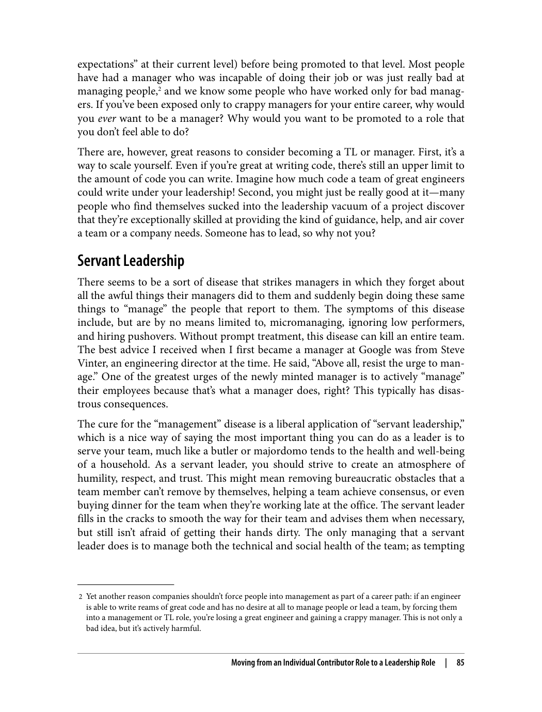

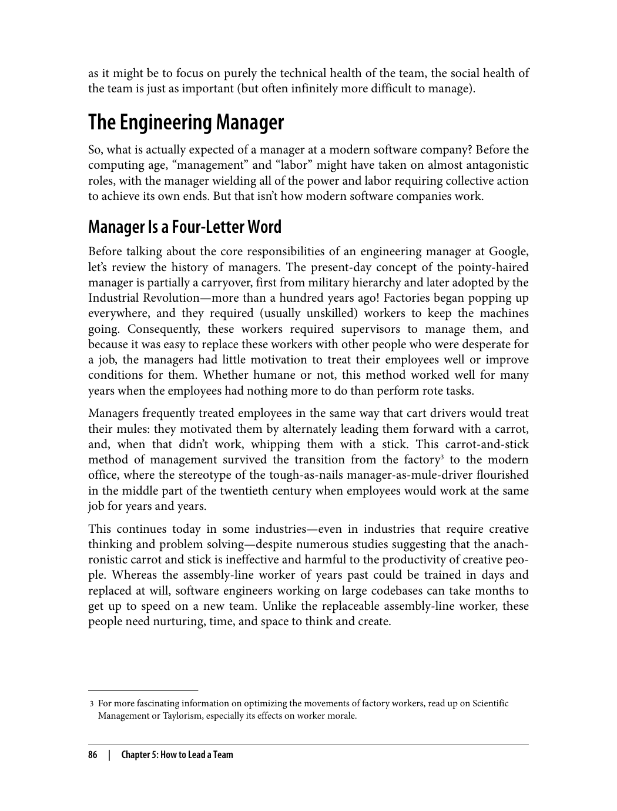

---

###### 📄 صفحه ۱۱۵
> 5 Public criticism of an individual is not only ineffective (it puts people on the defense), but rarely necessary,
> and most often is just mean or cruel. You can be sure the rest of the team already knows when an individual
> has failed, so there's no need to rub it in.
> knew you could complete. A good way to build a culture in which risk taking is
> accepted is to let your team know that it's OK to fail.
> So, let's get that out of the way: it's OK to fail. In fact, we like to think of failure as a
> way of learning a lot really quickly (provided that you're not repeatedly failing at the
> same thing). In addition, it's important to see failure as an opportunity to learn and
> not to point fingers or assign blame. Failing fast is good because there's not a lot at
> stake. Failing slowly can also teach a valuable lesson, but it is more painful because
> more is at risk and more can be lost (usually engineering time). Failing in a manner
> that affects customers is probably the least desirable failure that we encounter, but it's
> also one in which we have the greatest amount of structure in place to learn from fail‐
> ures. As mentioned earlier, every time there is a major production failure at Google,
> we perform a postmortem. This procedure is a way to document the events that led to
> the actual failure and to develop a series of steps that will prevent it from happening
> in the future. This is neither an opportunity to point fingers, nor is it intended to
> introduce unnecessary bureaucratic checks; rather, the goal is to strongly focus on the
> core of the problem and fix it once and for all. It's very difficult, but quite effective
> (and cathartic).
> Individual successes and failures are a bit different. It's one thing to laud individual
> successes, but looking to assign individual blame in the case of failure is a great way to
> divide a team and discourage risk taking across the board. It's alright to fail, but fail as
> a team and learn from your failures. If an individual succeeds, praise them in front of
> the team. If an individual fails, give constructive criticism in private.5 Whatever the
> case, take advantage of the opportunity and apply a liberal helping of humility,
> respect, and trust to help your team learn from its failures.
> Antipatterns
> Before we go over a litany of "design patterns" for successful TLs and engineering
> managers, we're going to review a collection of the patterns that you don't want to fol‐
> low if you want to be a successful manager. We've observed these destructive patterns
> in a handful of bad managers that we've encountered in our careers, and in more than
> a few cases, ourselves.
> 88
> |
> Chapter 5: How to Lead a Team

انتقاد از یک فرد به صورت عمومی نه تنها بی‌اثر است (افراد را دفاعی می‌کند)، بلکه به ندرت ضروری است و اغلب فقط بدخواهانه یا بی‌رحمانه است. می‌توانید مطمئن باشید بقیه تیم قبلاً می‌دانند چه زمانی یک فرد شکست خورده است، بنابراین نیازی به یادآوری مکرر آن نیست.

می‌دانستید که می‌توانید تکمیل کنید. راه خوبی برای ایجاد فرهنگی که در آن ریسک‌پذیری پذیرفته شود این است که به تیم‌تان اطلاع دهید شکست خوردن اشکالی ندارد.

پس بیایید این را همین الان مشخص کنیم: شکست خوردن اشکالی ندارد. در واقع، ما دوست داریم شکست را راهی برای یادگیری سریع و زیاد در نظر بگیریم (به شرطی که مکرراً در یک چیز شکست نخورید). علاوه بر این، مهم است که شکست را به عنوان فرصتی برای یادگیری ببینیم و نه بهانه‌ای برای انگشت اتهام زدن یا مقصر دانستن. شکست سریع خوب است زیرا چیز زیادی در خطر نیست. شکست آهسته هم می‌تواند درس ارزشمندی بیاموزد، اما دردناک‌تر است زیرا چیز بیشتری در خطر است و چیز بیشتری می‌تواند از دست برود (معمولاً زمان مهندسی). شکست به شکلی که بر مشتریان تأثیر بگذارد احتمالاً نامطلوب‌ترین شکستی است که با آن مواجه می‌شویم، اما همچنین یکی از مواردی است که بیشترین ساختار را برای یادگیری از شکست‌ها در اختیار داریم. همانطور که قبلاً ذکر شد، هر بار که یک شکست بزرگ تولیدی در گوگل رخ می‌دهد، یک postmortem (بررسی پس از حادثه) انجام می‌دهیم. این روشی برای مستندسازی رویدادهایی است که به شکست واقعی منجر شده و توسعه مجموعه‌ای از مراحلی است که از تکرار آن در آینده جلوگیری می‌کند. این نه فرصتی برای انگشت اتهام زدن است و نه برای معرفی بررسی‌های بوروکراتیک غیرضروری؛ بلکه هدف، تمرکز شدید بر هسته مشکل و رفع آن یکبار برای همیشه است. این کار بسیار دشوار است، اما بسیار مؤثر (و رهایی‌بخش) است.

موفقیت‌ها و شکست‌های فردی کمی متفاوت هستند. تحسین موفقیت‌های فردی یک چیز است، اما جستجوی مقصر دانستن فردی در مورد شکست، راه عالی‌ای برای تقسیم کردن تیم و دلسرد کردن ریسک‌پذیری در سراسر تیم است. شکست خوردن اشکالی ندارد، اما به عنوان تیم شکست بخورید و از شکست‌هایتان بیاموزید. اگر یک فرد موفق شد، او را در حضور تیم تحسین کنید. اگر یک فرد شکست خورد، انتقاد سازنده را در خصوصی ارائه دهید. در هر صورت، از این فرصت استفاده کنید و مقدار زیادی فروتنی، احترام و اعتماد به کار بگیرید تا به تیم‌تان کمک کنید از شکست‌هایش بیاموزد.

**ضدالگوها (Antipatterns)**

قبل از اینکه فهرستی از «الگوهای طراحی» برای TLها و مدیران مهندسی موفق را مرور کنیم، مجموعه‌ای از الگوهایی را بررسی خواهیم کرد که اگر می‌خواهید یک مدیر موفق باشید نباید از آن‌ها پیروی کنید. ما این الگوهای مخرب را در تعداد اندکی از مدیران بدی که در حرفه خود با آن‌ها مواجه شده‌ایم مشاهده کرده‌ایم و در بیش از چند مورد، در خودمان نیز دیده‌ایم.

اعتماد پایه و اساس هر تیم موفق است. بدون اعتماد، اعضای تیم نمی‌توانند به طور مؤثر با هم کار کنند.

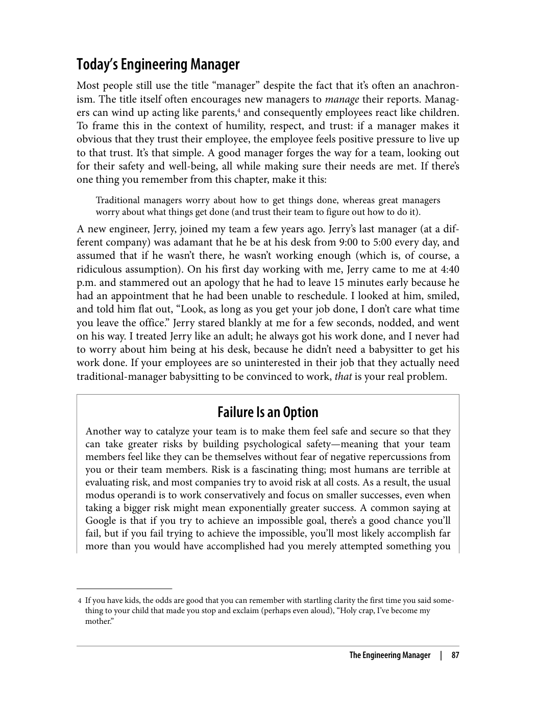

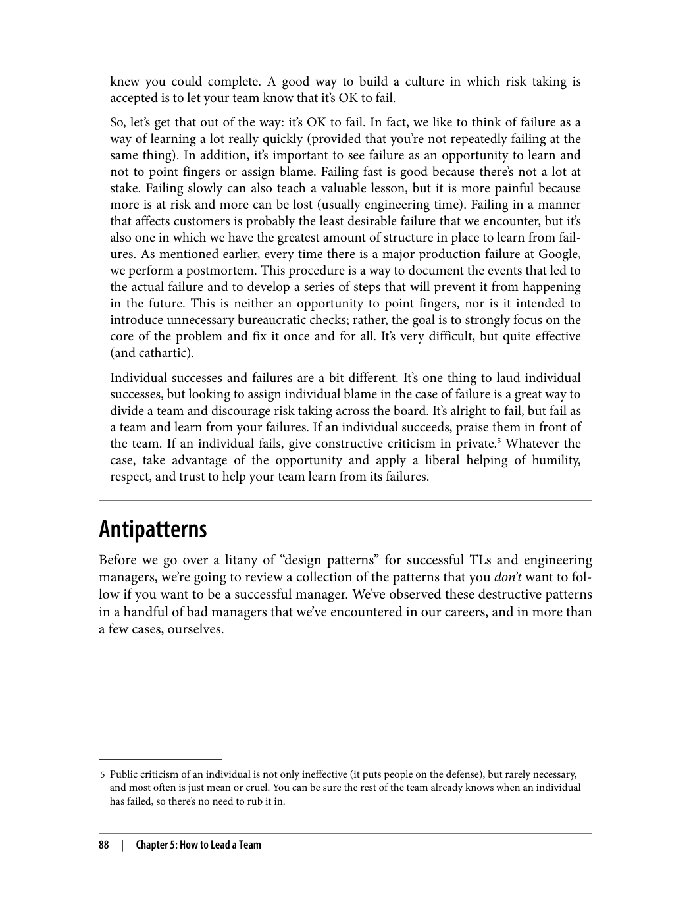

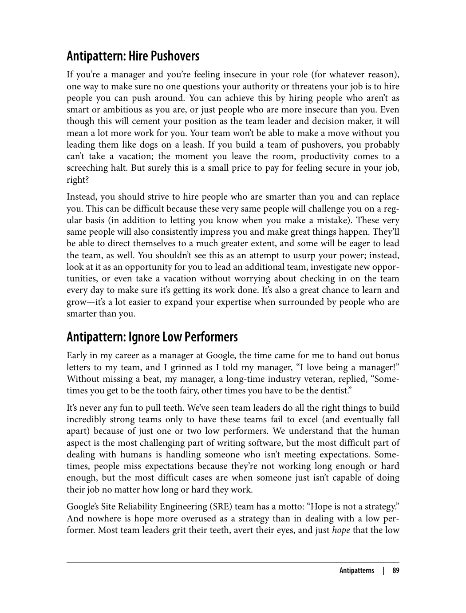

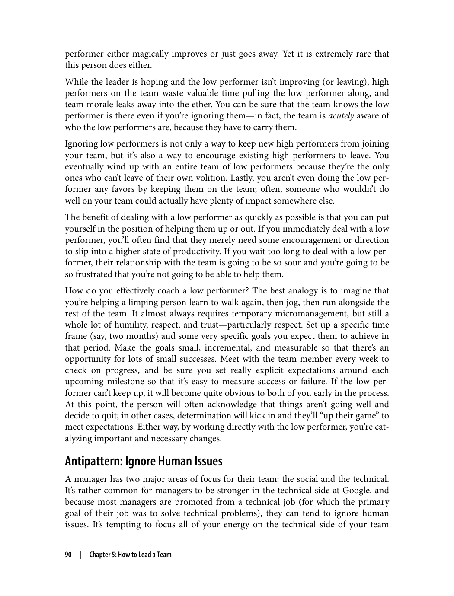

---

###### 📄 صفحه ۱۱۹
> making them uncomfortable—this gives you a chance to have informal conversations
> outside the normal work environment.
> Sometimes, it can be tricky to move into a management role over someone who has
> been a good friend and a peer. If the friend who is being managed is not self-
> managing and is not a hard worker, it can be stressful for everyone. We recommend
> that you avoid getting into this situation whenever possible, but if you can't, pay extra
> attention to your relationship with those folks.
> Antipattern: Compromise the Hiring Bar
> Steve Jobs once said: "A people hire other A people; B people hire C people." It's
> incredibly easy to fall victim to this adage, and even more so when you're trying to
> hire quickly. A common approach I've seen outside of Google is that a team needs to
> hire 5 engineers, so it sifts through a pile of applications, interviews 40 or 50 people,
> and picks the best 5 candidates regardless of whether they meet the hiring bar.
> This is one of the fastest ways to build a mediocre team.
> The cost of finding the appropriate person—whether by paying recruiters, paying for
> advertising, or pounding the pavement for references—pales in comparison to the
> cost of dealing with an employee who you never should have hired in the first place.
> This "cost" manifests itself in lost team productivity, team stress, time spent managing
> the employee up or out, and the paperwork and stress involved in firing the
> employee. That's assuming, of course, that you try to avoid the monumental cost of
> just leaving them on the team. If you're managing a team for which you don't have a
> say over hiring and you're unhappy with the hires being made for your team, you
> need to fight tooth and nail for higher-quality engineers. If you're still handed sub‐
> standard engineers, maybe it's time to look for another job. Without the raw materials
> for a great team, you're doomed.
> Antipattern: Treat Your Team Like Children
> The best way to show your team that you don't trust it is to treat team members like
> kids—people tend to act the way you treat them, so if you treat them like children or
> prisoners, don't be surprised when that's how they behave. You can manifest this
> behavior by micromanaging them or simply by being disrespectful of their abilities
> and giving them no opportunity to be responsible for their work. If it's permanently
> necessary to micromanage people because you don't trust them, you have a hiring
> failure on your hands. Well, it's a failure unless your goal was to build a team that you
> can spend the rest of your life babysitting. If you hire people worthy of trust and show
> these people you trust them, they'll usually rise to the occasion (sticking with the
> basic premise, as we mentioned earlier, that you've hired good people).
> 92
> |
> Chapter 5: How to Lead a Team

و آن‌ها را ناراحت کنید — این به شما فرصت می‌دهد مکالمات غیررسمی خارج از محیط کاری عادی داشته باشید.

گاهی اوقات، تغییر نقش به مدیریت کسی که دوست خوب و همتای شما بوده می‌تواند دشوار باشد. اگر دوستی که مدیریت می‌شود خودمدیر نیست و سخت‌کوش نباشد، می‌تواند برای همه استرس‌زا باشد. ما توصیه می‌کنیم تا جایی که ممکن است از این موقعیت اجتناب کنید، اما اگر نمی‌توانید، توجه ویژه‌ای به رابطه خود با آن افراد داشته باشید.

**ضدالگو: پایین آوردن استاندارد استخدام**

استیو جابز زمانی گفت: «افراد درجه A، افراد درجه A دیگری استخدام می‌کنند؛ افراد درجه B، افراد درجه C استخدام می‌کنند.» فوق‌العاده آسان است که قربانی این ضرب‌المثل شوید، و حتی بیشتر زمانی که سعی دارید سریع استخدام کنید. رویکرد رایجی که خارج از گوگل دیده‌ام این است که یک تیم نیاز به استخدام 5 مهندس دارد، پس انبوهی از درخواست‌ها را غربال می‌کند، 40 یا 50 نفر را مصاحبه می‌کند و 5 بهترین نامزد را انتخاب می‌کند صرف‌نظر از اینکه آیا استاندارد استخدام را دارند یا خیر. این یکی از سریع‌ترین راه‌ها برای ساختن یک تیم متوسط است.

هزینه پیدا کردن فرد مناسب — چه با پرداخت به استخدام‌کنندگان، چه پرداخت هزینه تبلیغات، چه تلاش برای یافتن معرف‌ها — در مقایسه با هزینه مقابله با کارمندی که اصلاً نباید استخدام می‌شد بسیار ناچیز است. این «هزینه» خود را به صورت از دست دادن بهره‌وری تیم، استرس تیم، زمان صرف شده برای مدیریت کارمند به سمت رشد یا خروج، و کاغذبازی و استرس مرتبط با اخراج کارمند نشان می‌دهد. این البته فرض بر این است که سعی می‌کنید از هزینه عظیم فقط نگه داشتن آن‌ها در تیم اجتناب کنید. اگر تیمی را مدیریت می‌کنید که در مورد استخدام نظری ندارید و از استخدام‌های انجام شده برای تیم‌تان ناراضی هستید، باید با تمام توان برای مهندسان با کیفیت‌تر بجنگید. اگر همچنان مهندسان زیر استاندارد به شما تحمیل می‌شوند، شاید زمان آن رسیده که به دنبال شغل دیگری بگردید. بدون مواد اولیه برای یک تیم عالی، محکوم به شکست هستید.

**ضدالگو: با تیم‌تان مثل بچه‌ها رفتار کنید**

بهترین راه برای نشان دادن اینکه به تیم‌تان اعتماد ندارید این است که با اعضای تیم مثل بچه‌ها رفتار کنید — افراد تمایل دارند طوری رفتار کنند که با آن‌ها رفتار می‌شود، پس اگر مثل بچه‌ها یا زندانیان با آن‌ها رفتار کنید، تعجب نکنید وقتی دقیقاً همانطور رفتار می‌کنند. می‌توانید این رفتار را با مدیریت ریز آن‌ها یا صرفاً با بی‌احترامی به توانایی‌هایشان و ندادن هیچ فرصتی برای مسئولیت‌پذیری در کارشان نشان دهید. اگر دائم نیاز به مدیریت ریز افراد دارید چون به آن‌ها اعتماد ندارید، مشکل استخدامی دارید. خب، این یک شکست است مگر اینکه هدفتان ساختن تیمی بوده باشد که بقیه عمرتان را نگهبانی‌اش کنید. اگر افرادی شایسته اعتماد استخدام کنید و به این افراد نشان دهید که به آن‌ها اعتماد دارید، معمولاً به موقعیت پاسخ می‌دهند (با فرض اولیه اصلی، همانطور که قبلاً اشاره کردیم، که افراد خوبی استخدام کرده‌اید).

در فرهنگ یادگیری، اشتباهات به عنوان فرصت‌های یادگیری در نظر گرفته می‌شوند، نه دلیلی برای سرزنش.

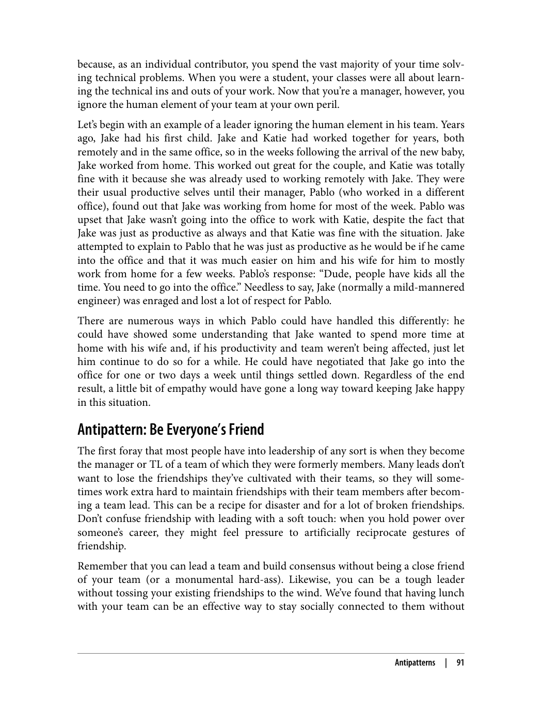

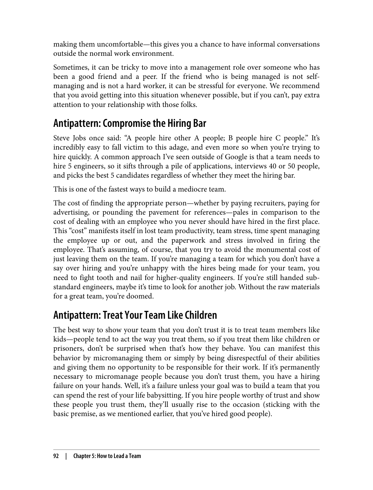

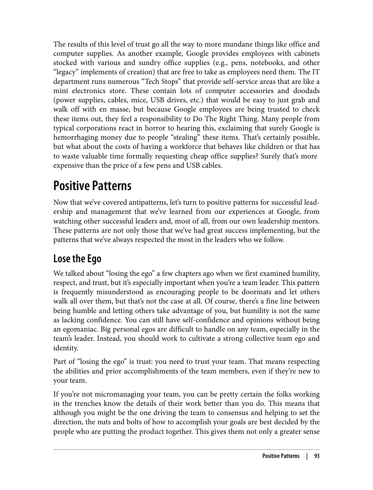

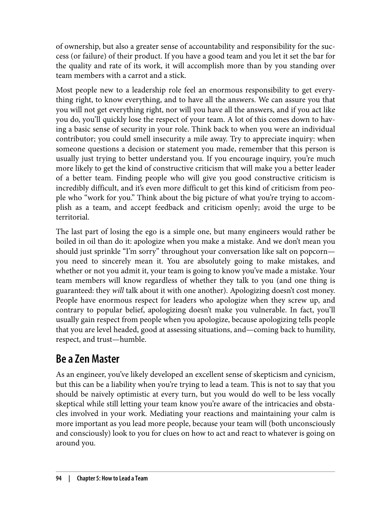

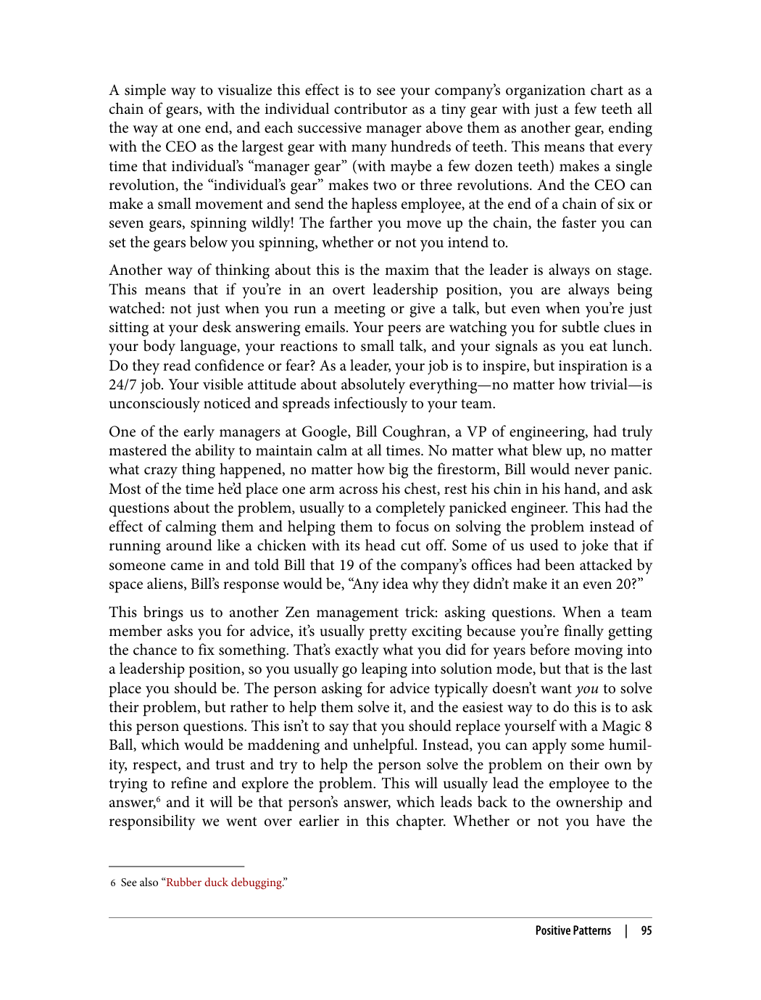

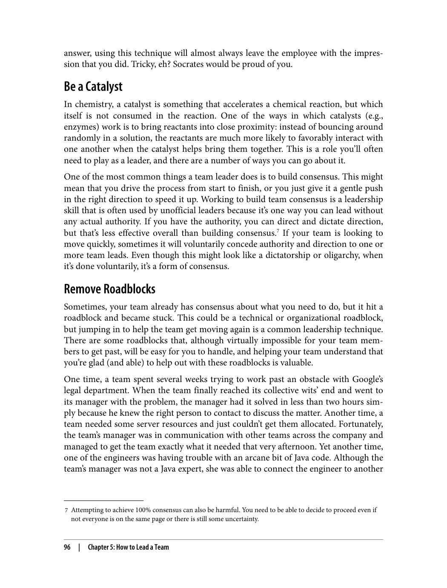

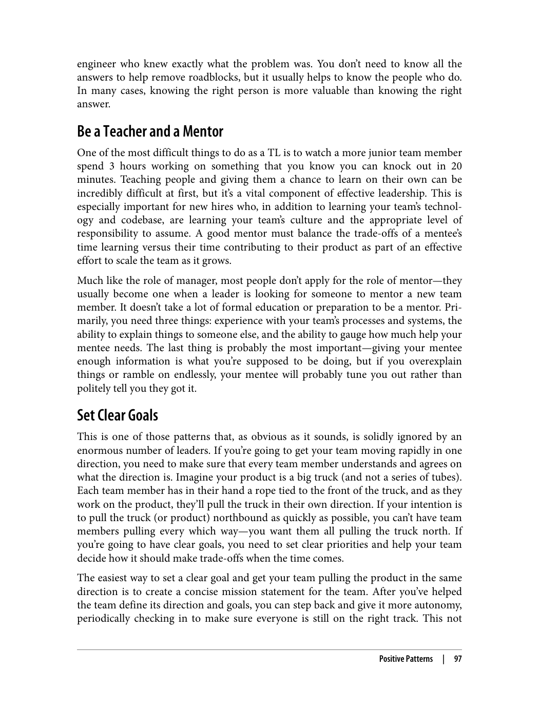

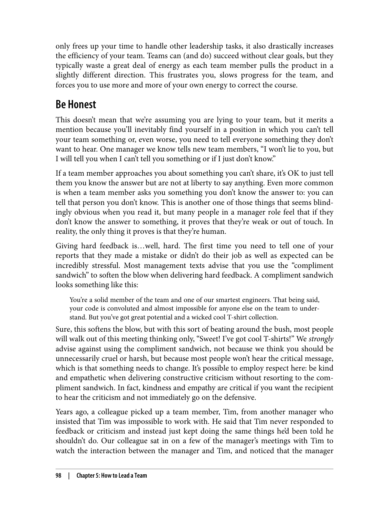

---