## فصل ۶: اشتراک‌گذاری دانش

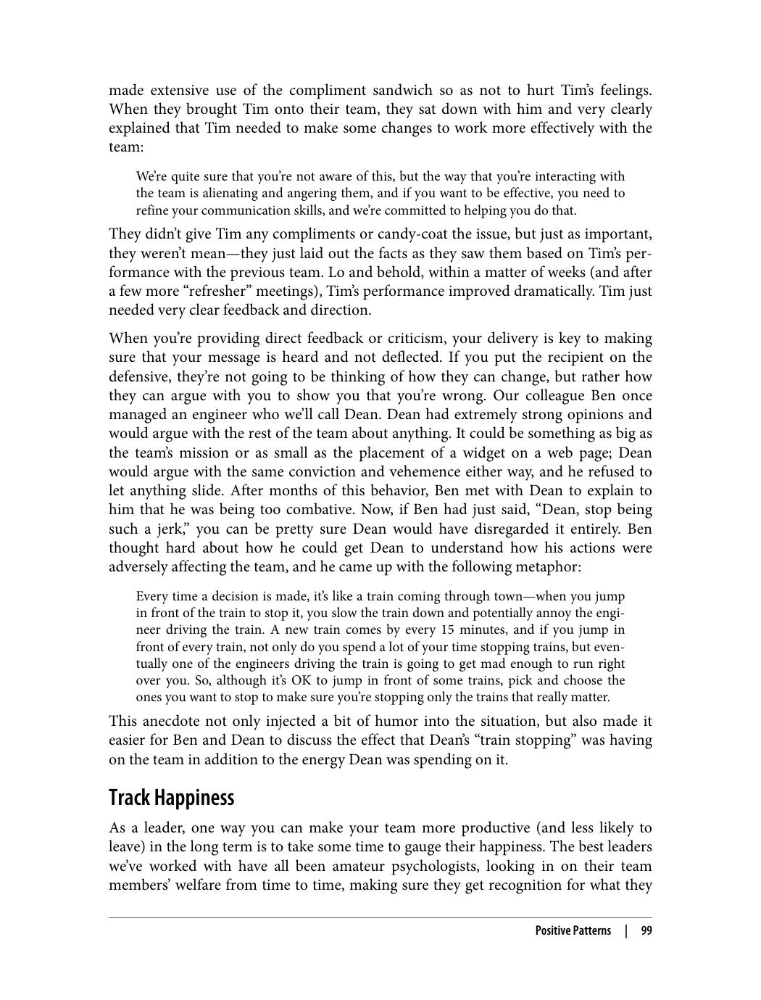

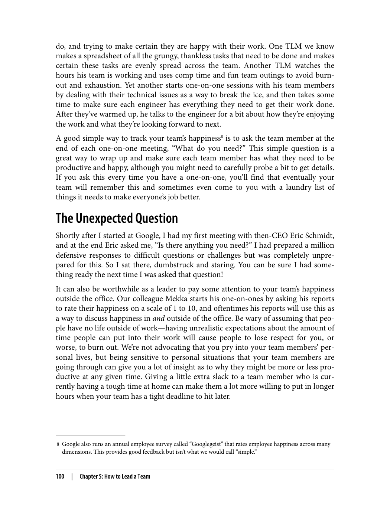

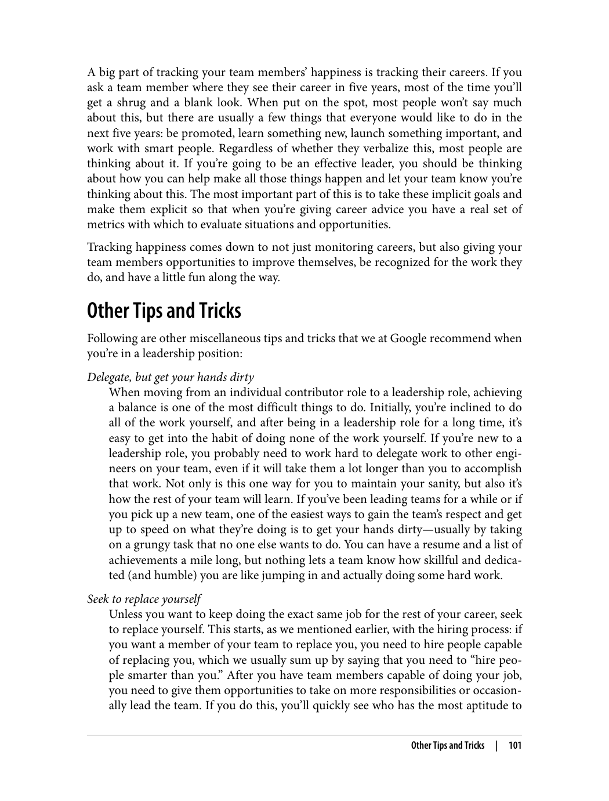

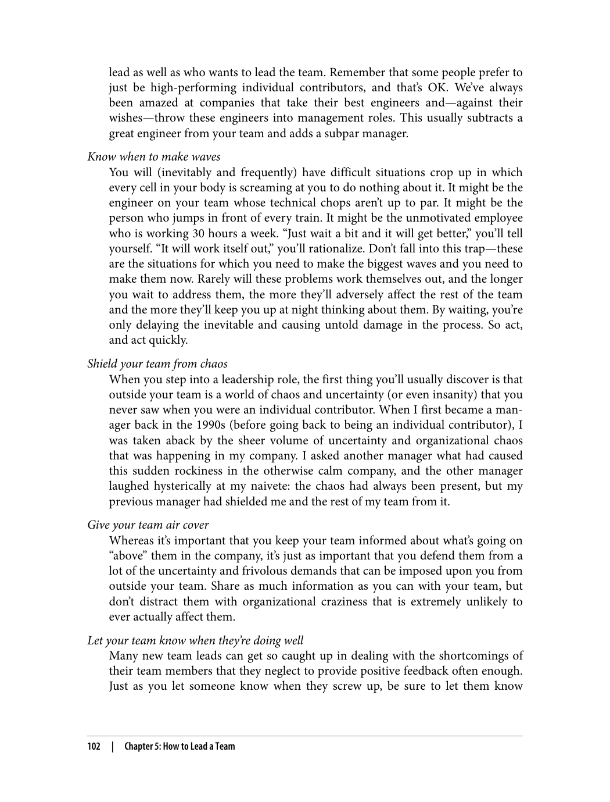

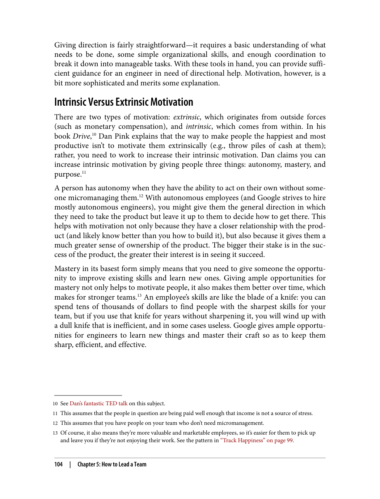

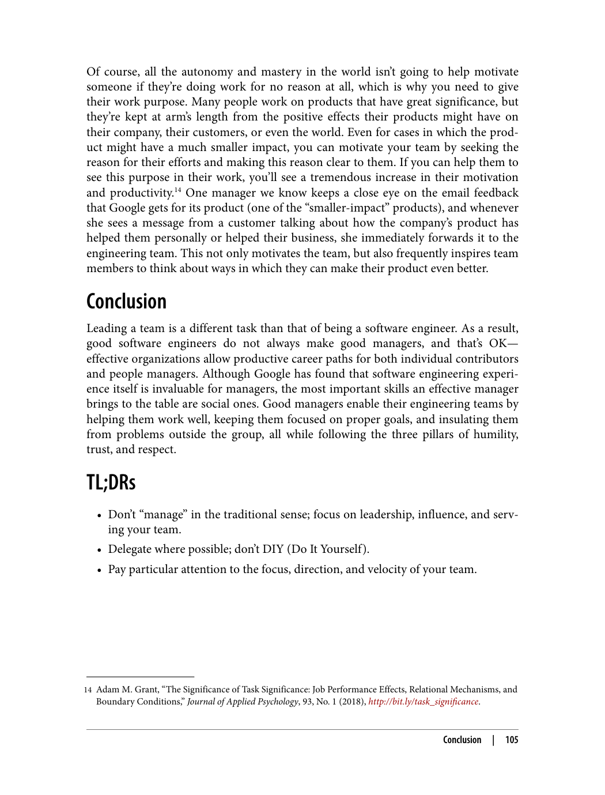

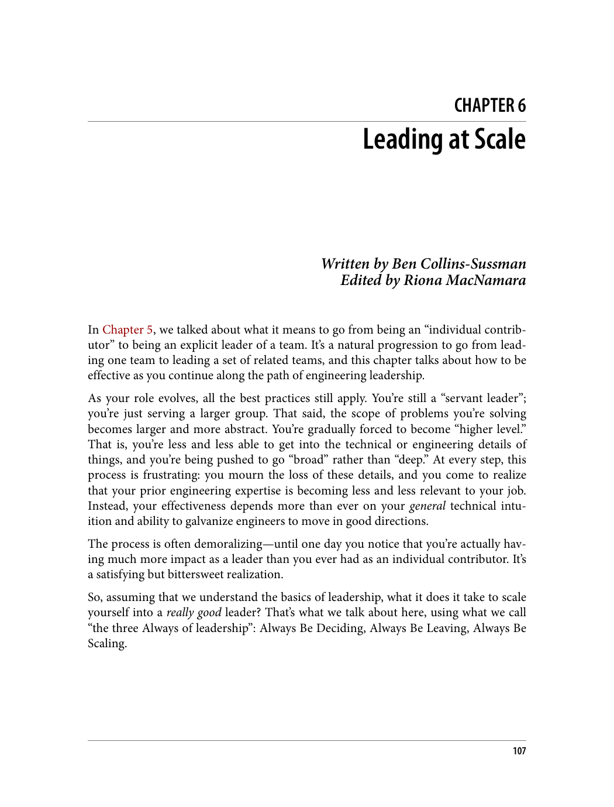

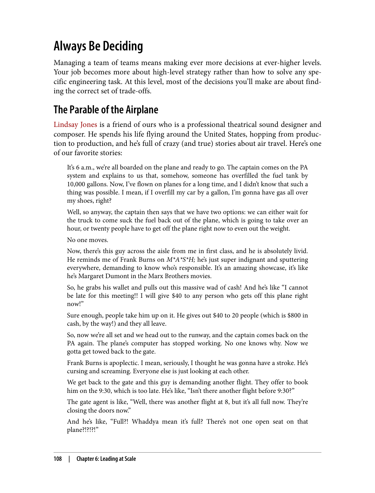

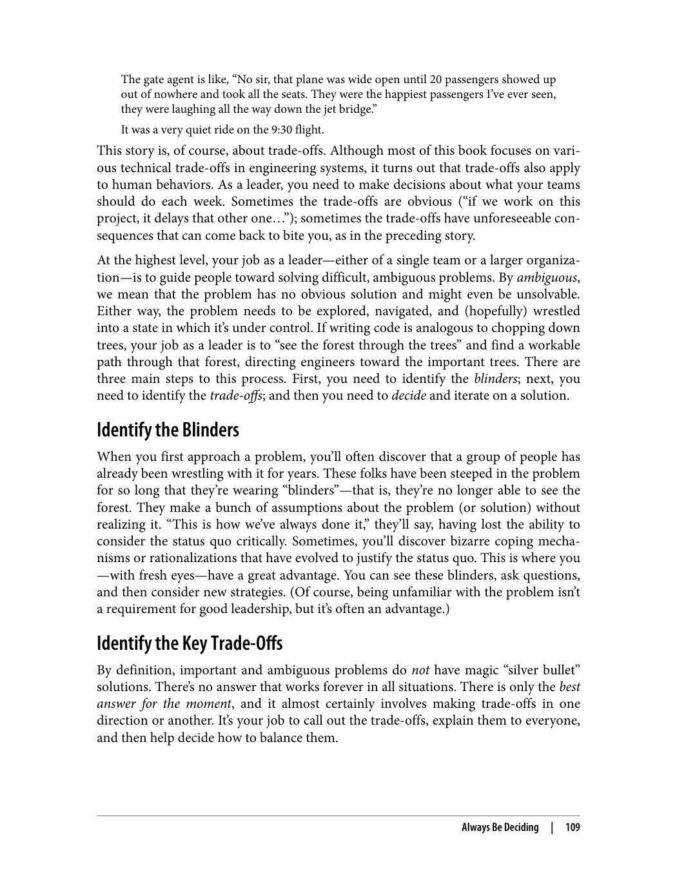

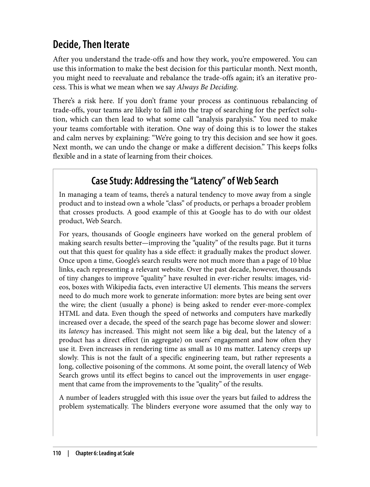

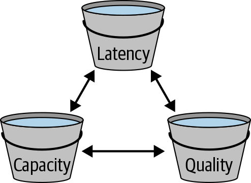

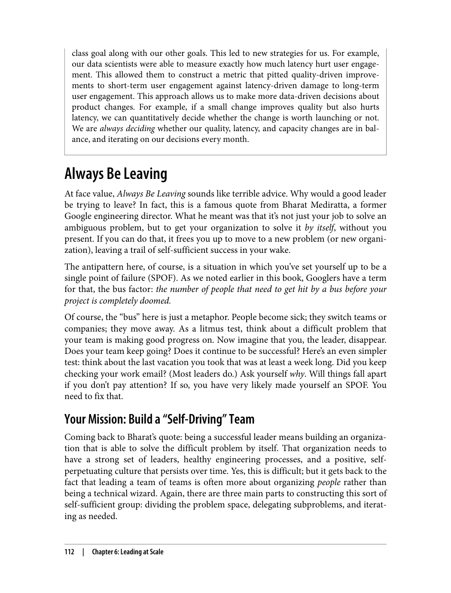

---

> "اشتراک‌گذاری دانش برای موفقیت تیم ضروری است. فرهنگ یادگیری، پرسیدن سوالات و آموزش به دیگران، کلید موفقیت است."

### چالش‌های یادگیری

> "یادگیری یک فرآیند مداوم است و چالش‌های خاص خود را دارد."

یکی از بزرگترین چالش‌ها در مهندسی نرم‌افزار، یادگیری مداوم است. فناوری‌ها به سرعت تغییر می‌کنند و مهندسان باید همواره یاد بگیرند.

### اهمیت روانشناسی ایمن

> "روانشناسی ایمن برای ایجاد محیطی مناسب برای یادگیری ضروری است."

روانشناسی ایمن به معنای ایجاد محیطی است که در آن اعضا بتوانند بدون ترس از قضاوت، سؤال بپرسند و اشتباهات خود را بپذیرند.

### رشد دانش شخصی

> "شما می‌توانید دانش خود را از طریق پرسیدن سوالات، درک زمینه و کار با دیگران رشد دهید."

راه‌های رشد دانش:
1. **پرسیدن سوالات**: از دیگران بپرسید و کمک بخواهید
2. **درک زمینه**: قبل از پرسیدن سوال، زمینه را درک کنید
3. **کار با دیگران**: با همکاران خود همکاری کنید

### آموزش به دیگران

> "آموزش به دیگران یکی از بهترین راه‌های یادگیری است."

وقتی چیزی را به دیگران آموزش می‌دهید، خودتان نیز بهتر آن را یاد می‌گیرید. این یکی از اصول اصلی یادگیری است.

---