> **راهنمای مطالعه**
>
> در هر بخش، ابتدا متن اصلی کتاب به زبان انگلیسی آورده شده و سپس ترجمه و توضیحات فارسی همان بخش ارائه شده است.

---
-

###### 📄 صفحه ۱۴۱
> decide to put 20 minutes aside to fix a longstanding and nagging issue. But before
> you carry out the task, be mindful and stop yourself. Ask this critical question: Am I
> really the only one who can do this work?
> Sure, it might be most efficient for you to do it, but then you’re failing to train your
> leaders. You’re not building a self-sufficient organization. Unless the task is truly time
> sensitive and on fire, bite the bullet and assign the work to someone else—presuma‐
> bly someone who you know can do it but will probably take much longer to finish.
> Coach them on the work if need be. You need to create opportunities for your leaders
> to grow; they need to learn to “level up” and do this work themselves so that you’re
> no longer in the critical path.
> The corollary here is that you need to be mindful of your own purpose as a leader of
> leaders. If you find yourself deep in the weeds, you’re doing a disservice to your orga‐
> nization. When you get to work each day, ask yourself a different critical question:
> What can I do that nobody else on my team can do?
> There are a number of good answers. For example, you can protect your teams from
> organizational politics; you can give them encouragement; you can make sure every‐
> one is treating one another well, creating a culture of humility, trust, and respect. It’s
> also important to “manage up,” making sure your management chain understands
> what your group is doing and staying connected to the company at large. But often
> the most common and important answer to this question is: “I can see the forest
> through the trees.” In other words, you can define a high-level strategy. Your strategy
> needs to cover not just overall technical direction, but an organizational strategy as
> well. You’re building a blueprint for how the ambiguous problem is solved and how
> your organization can manage the problem over time. You’re continuously mapping
> out the forest, and then assigning the tree-cutting to others.
> Adjusting and iterating
> Let’s assume that you’ve now reached the point at which you’ve built a self-sustaining
> machine. You’re no longer an SPOF. Congratulations! What do you do now?
> Before answering, note that you have actually liberated yourself—you now have the
> freedom to “Always Be Leaving.” This could be the freedom to tackle a new, adjacent
> problem, or perhaps you could even move yourself to a whole new department and
> problem space, making room for the careers of the leaders you’ve trained. This is a
> great way of avoiding personal burnout.
> 114
> |
> Chapter 6: Leading at Scale

تصمیم می‌گیرید ۲۰ دقیقه کنار بگذارید تا مشکلی قدیمی و آزاردهنده را برطرف کنید. اما قبل از انجام وظیفه، هوشیار باشید و خودتان را متوقف کنید. این سؤال حیاتی را بپرسید: آیا واقعاً من تنها کسی هستم که می‌تواند این کار را انجام دهد؟

البته، شاید انجام این کار توسط شما کارآمدتر باشد، اما در این صورت در آموزش رهبران خود کوتاهی کرده‌اید. شما در حال ساختن سازمانی خودکفا نیستید. مگر اینکه وظیفه واقعاً حساس به زمان باشد و شرایط بحرانی باشد، تحمل کنید و کار را به شخص دیگری محول کنید — احتمالاً کسی که می‌دانید می‌تواند آن را انجام دهد اما احتمالاً زمان بسیار بیشتری نیاز دارد. در صورت لزوم، کار را به آن‌ها آموزش دهید. شما باید فرصت‌هایی برای رشد رهبران خود ایجاد کنید؛ آن‌ها باید یاد بگیرند که «سطح خود را بالا ببرند» و این کار را خودشان انجام دهند تا شما دیگر در مسیر بحرانی (Critical Path) نباشید.

نتیجه منطقی اینجا این است که باید نسبت به هدف خود به عنوان رهبر رهبران هوشیار باشید. اگر متوجه شدید که عمیقاً در جزئیات فرو رفته‌اید (In the Weeds)، دارید به سازمان خود لطمه می‌زنید. هر روز که به سر کار می‌روید، یک سؤال حیاتی دیگر از خود بپرسید: چه کاری می‌توانم انجام دهم که هیچ‌کس دیگر در تیم من نمی‌تواند انجام دهد؟

پاسخ‌های خوب زیادی وجود دارد. به عنوان مثال، می‌توانید تیم‌های خود را از سیاست‌های سازمانی محافظت کنید؛ می‌توانید به آن‌ها انگیزه بدهید؛ می‌توانید مطمئن شوید که همه با یکدیگر خوب رفتار می‌کنند و فرهنگی از فروتنی، اعتماد و احترام ایجاد می‌کنید. همچنین مهم است که «مدیریت بالا» (Manage Up) انجام دهید و مطمئن شوید زنجیره مدیریتی شما می‌داند گروه شما چه کار می‌کند و با شرکت بزرگ‌تر در ارتباط باشید. اما اغلب رایج‌ترین و مهم‌ترین پاسخ به این سؤال این است: «من جنگل را از درختان می‌بینم.» به عبارت دیگر، می‌توانید یک استراتژی سطح بالا تعریف کنید. استراتژی شما باید نه تنها جهت‌گیری فنی کلی، بلکه یک استراتژی سازمانی نیز پوشش دهد. شما در حال تهیه نقشه‌ای برای نحوه حل مشکل مبهم و نحوه مدیریت آن توسط سازمان خود در طول زمان هستید. شما به طور مداوم جنگل را نقشه‌برداری می‌کنید و سپس بریدن درختان را به دیگران واگذار می‌کنید.

تنظیم و تکرار

فرض کنید اکنون به مرحله‌ای رسیده‌اید که ماشینی خودپایدار ساخته‌اید. شما دیگر یک نقطه شکست واحد (SPOF) نیستید. تبریک! اکنون چه کار می‌کنید؟

قبل از پاسخ، توجه کنید که در واقع خودتان را آزاد کرده‌اید — اکنون آزادی «همیشه در حال ترک» (Always Be Leaving) را دارید. این می‌تواند آزادی پرداختن به مشکلی جدید و مجاور باشد، یا شاید بتوانید خودتان را به کل بخش و فضای مشکل جدیدی منتقل کنید و جایی برای رشد حرفه‌ای رهبرانی که آموزش داده‌اید باز کنید. این روشی عالی برای جلوگیری از فرسودگی شغلی (Burnout) است.

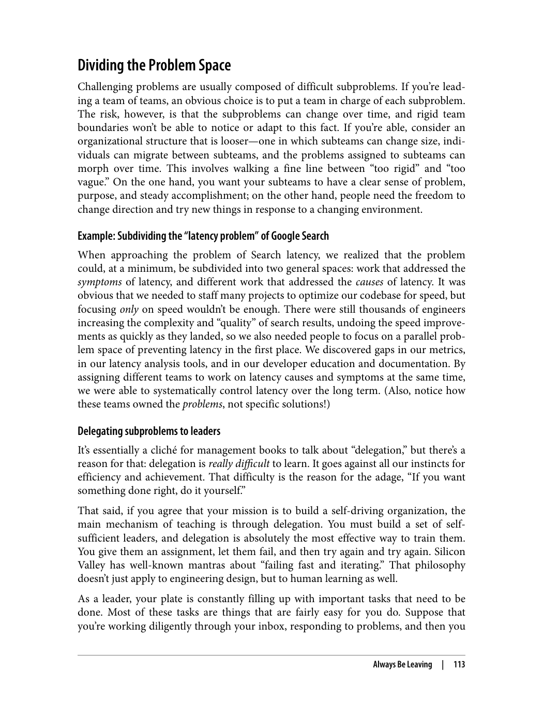

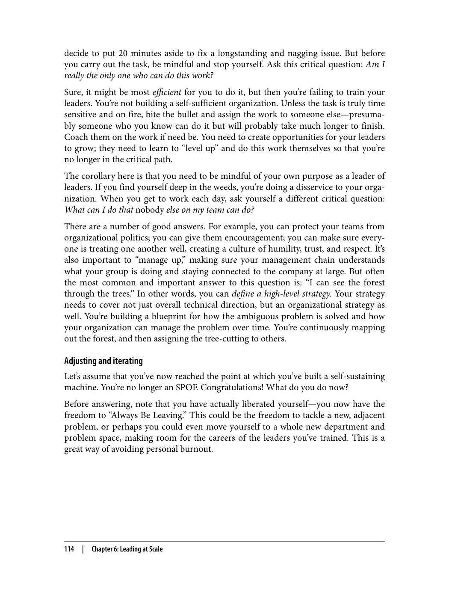

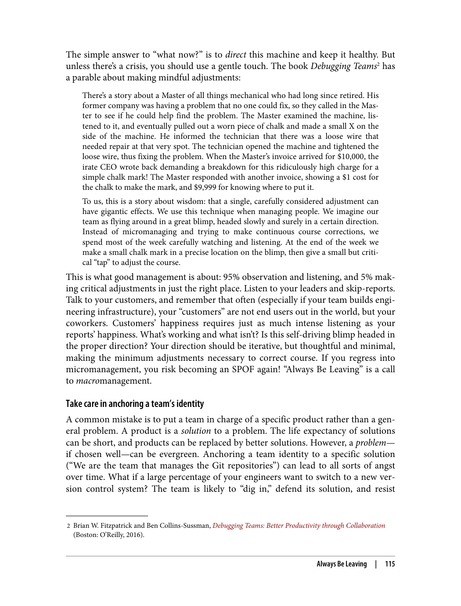

---

###### 📄 صفحه ۱۴۴
> Traction
> Eventually your team begins to figure things out. You’re making smarter deci‐
> sions, and real progress is made. Morale improves. You’re iterating on trade-offs,
> and the organization is beginning to drive itself around the problem. Nice job!
> Reward
> Something unexpected happens. Your manager takes you aside and congratulates
> you on your success. You discover your reward isn’t just a pat on the back, but a
> whole new problem to tackle. That’s right: the reward for success is more work…
> and more responsibility! Often, it’s a problem that is similar or adjacent to the
> first one, but equally difficult.
> So now you’re in a pickle. You’ve been given a new problem, but (usually) not more
> people. Somehow you need to solve both problems now, which likely means that the
> original problem still needs to be managed with half as many people in half the time.
> You need the other half of your people to tackle the new work! We refer to this final
> step as the compression stage: you’re taking everything you’ve been doing and com‐
> pressing it down to half the size.
> So really, the cycle of success is more of a spiral (see Figure 6-2). Over months and
> years, your organization is scaling by tackling new problems and then figuring out
> how to compress them so that it can take on new, parallel struggles. If you’re lucky,
> you’re allowed to hire more people as you go. More often than not, though, your hir‐
> ing doesn’t keep pace with the scaling. Larry Page, one of Google’s founders, would
> probably refer to this spiral as “uncomfortably exciting.”
> Figure 6-2. The spiral of success
> Always Be Scaling
> |
> 117

رسیدن به مسیر درست

در نهایت تیم شما شروع به درک اوضاع می‌کند. شما تصمیم‌های هوشمندانه‌تری می‌گیرید و پیشرفت واقعی حاصل می‌شود. روحیه تیم بهبود می‌یابد. شما در حال ایجاد تعادل بین مصالحه‌ها هستید و سازمان شروع به هدایت خود در اطراف مشکل می‌کند. آفرین!

پاداش

اتفاق غیرمنتظره‌ای می‌افتد. مدیر شما را کنار می‌کشد و به خاطر موفقیت‌تان تبریک می‌گوید. متوجه می‌شوید پاداش شما فقط تشویق نیست، بلکه مشکلی کاملاً جدید برای حل کردن است. درست است: پاداش موفقیت، کار بیشتر و مسئولیت بیشتر است! اغلب، این مشکلی مشابه یا مجاور مشکل اول است، اما به همان اندازه دشوار.

بنابراین اکنون در تنگنا قرار گرفته‌اید. مشکل جدیدی به شما داده شده، اما (معمولاً) نیروی بیشتری ندارید. باید به نوعی هر دو مشکل را حل کنید، که احتمالاً به این معناست که مشکل اصلی همچنان باید با نصف نیرو و در نصف زمان مدیریت شود. شما به نصف دیگر نیروهایتان نیاز دارید تا مشکل جدید را حل کنند! ما این مرحله نهایی را فشرده‌سازی (Compression) می‌نامیم: تمام کاری که انجام می‌دادید را به نصف اندازه فشرده می‌کنید.

پس در واقع، چرخه موفقیت بیشتر شبیه یک مارپیچ است (شکل 6-2 را ببینید). در طول ماه‌ها و سال‌ها، سازمان شما با حل مشکلات جدید و سپس یافتن راهی برای فشرده‌سازی آن‌ها مقیاس پیدا می‌کند تا بتواند مبارزات موازی جدیدی را آغاز کند. اگر خوش‌شانس باشید، در طول مسیر اجازه استخدام نیروی بیشتری به شما داده می‌شود. اما بیشتر اوقات، استخدام شما همگام با مقیاس‌پذیری پیش نمی‌رود. لری پیج، یکی از بنیان‌گذاران Google، احتمالاً این مارپیچ را «هیجان‌انگیز و ناراحت‌کننده» (Uncomfortably Exciting) می‌نامید.

شکل 6-2. مارپیچ موفقیت

همیشه در حال مقیاس‌پذیری باشید

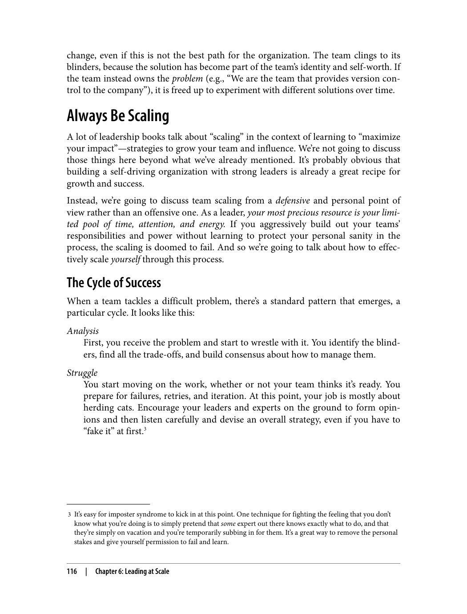

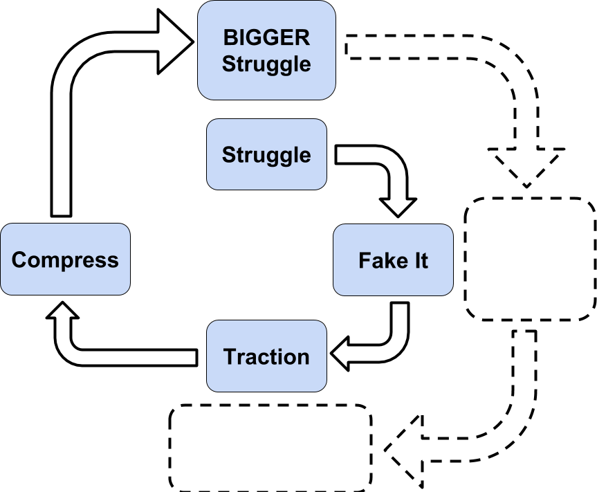

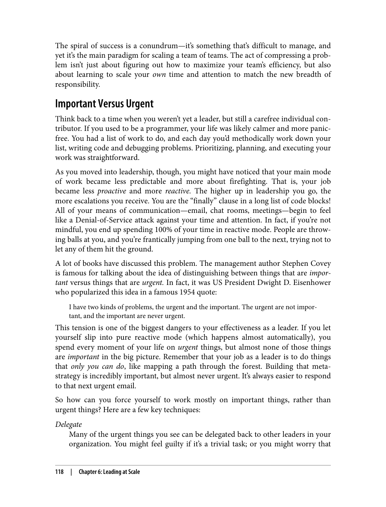

---

###### 📄 صفحه ۱۴۷
> that have deep emotional meaning, or, in Ms. Kondo’s words, spark deep “joy” just
> holding them. The thesis of her book is that most people declutter their lives incor‐
> rectly: they spend time tossing the bottom 20% in the garbage, but the remaining 80%
> still feels too cluttered. She argues that the true work of decluttering is about identify‐
> ing the top 20%, not the bottom 20%. If you can identify only the critical things, you
> should then toss out the other 80%. It sounds extreme, but it’s quite effective. It is
> greatly freeing to declutter so radically.
> It turns out that you can also apply this philosophy to your inbox or task list—the
> barrage of balls being thrown at you. Divide your pile of balls into three groups: the
> bottom 20% are probably neither urgent nor important and very easy to delete or
> ignore. There’s a middle 60%, which might contain some bits of urgency or impor‐
> tance, but it’s a mixed bag. At the top, there’s 20% of things that are absolutely, criti‐
> cally important.
> And so now, as you work through your tasks, do not try to tackle the top 80%—you’ll
> still end up overwhelmed and mostly working on urgent-but-not-important tasks.
> Instead, mindfully identify the balls that strictly fall in the top 20%—critical things
> that only you can do—and focus strictly on them. Give yourself explicit permission to
> drop the other 80%.
> It might feel terrible to do so at first, but as you deliberately drop so many balls, you’ll
> discover two amazing things. First, even if you don’t delegate that middle 60% of
> tasks, your subleaders often notice and pick them up automatically. Second, if some‐
> thing in that middle bucket is truly critical, it ends up coming back to you anyway,
> eventually migrating up into the top 20%. You simply need to trust that things below
> your top-20% threshold will either be taken care of or evolve appropriately. Mean‐
> while, because you’re focusing only on the critically important things, you’re able to
> scale your time and attention to cover your group’s ever-growing responsibilities.
> Protecting Your Energy
> We’ve talked about protecting your time and attention—but your personal energy is
> the other piece of the equation. All of this scaling is simply exhausting. In an environ‐
> ment like this, how do you stay charged and optimistic?
> Part of the answer is that over time, as you grow older, your overall stamina builds up.
> Early in your career, working eight hours a day in an office can feel like a shock; you
> come home tired and dazed. But just like training for a marathon, your brain and
> body build up larger reserves of stamina over time.
> The other key part of the answer is that leaders gradually learn to manage their
> energy more intelligently. It’s something they learn to pay constant attention to. Typi‐
> cally, this means being aware of how much energy you have at any given moment,
> 120
> |
> Chapter 6: Leading at Scale

این شامل درک نحوه تأثیر نابرابری‌های اجتماعی بر محل کار و چگونگی ساختن نرم‌افزاری فراگیرتر است.

که معنای عاطفی عمیقی دارند، یا به قول خانم کوندو، فقط نگه داشتن آن‌ها «شادی» عمیقی ایجاد می‌کند. فرضیه کتاب او این است که اکثر مردم زندگی خود را به اشتباه مرتب می‌کنند: وقت خود را صرف دور ریختن ۲۰٪ پایینی در سطل زباله می‌کنند، اما ۸۰٪ باقی‌مانده همچنان بیش از حد شلوغ به نظر می‌رسد. او استدلال می‌کند که کار واقعی مرتب‌سازی، شناسایی ۲۰٪ بالایی است، نه ۲۰٪ پایینی. اگر بتوانید فقط چیزهای حیاتی را شناسایی کنید، باید ۸۰٪ دیگر را دور بریزید. به نظر افراطی می‌رسد، اما بسیار مؤثر است. مرتب‌سازی رادیکال این‌قدر آزادی‌بخش است.

مشخص شده که می‌توانید این فلسفه را به صندوق ورودی یا لیست وظایف خود نیز اعمال کنید — سیلی از توپ‌هایی که به سمت شما پرتاب می‌شوند. انبوه توپ‌های خود را به سه گروه تقسیم کنید: ۲۰٪ پایینی احتمالاً نه فوری هستند و نه مهم و حذف یا نادیده گرفتن آن‌ها بسیار آسان است. ۶۰٪ میانی وجود دارد که ممکن است بخش‌هایی از فوریت یا اهمیت را داشته باشد، اما مخلوطی از موارد مختلف است. در بالا، ۲۰٪ چیزهایی وجود دارد که مطلقاً و به شدت مهم هستند.

و اکنون، هنگامی که از عهده وظایف خود برمی‌آیید، سعی نکنید ۸۰٪ بالایی را انجام دهید — باز هم غرق خواهید شد و عمدتاً روی وظایف فوری اما غیرمهم کار خواهید کرد. در عوض، آگاهانه توپ‌هایی را شناسایی کنید که دقیقاً در ۲۰٪ بالایی قرار دارند — چیزهای حیاتی که فقط شما می‌توانید انجام دهید — و دقیقاً روی آن‌ها تمرکز کنید. به خودتان اجازه صریح بدهید که ۸۰٪ دیگر را رها کنید.

در ابتدا ممکن است این کار وحشتناک به نظر برسد، اما وقتی عمداً این همه توپ را رها می‌کنید، دو چیز شگفت‌انگیز کشف خواهید کرد. اول، حتی اگر آن ۶۰٪ میانی از وظایف را واگذار نکنید، رهبران فرعی شما اغلب متوجه می‌شوند و خودکار آن‌ها را برمی‌دارند. دوم، اگر چیزی در آن گروه میانی واقعاً حیاتی باشد، در هر صورت به شما بازمی‌گردد و در نهایت به ۲۰٪ بالایی مهاجرت می‌کند. کافی است به این موضوع اعتماد کنید که چیزهای زیر آستانه ۲۰٪ بالایی شما یا رسیدگی می‌شوند یا به طور مناسب تکامل می‌یابند. در همین حال، از آنجا که فقط روی چیزهای بسیار مهم تمرکز می‌کنید، می‌توانید زمان و توجه خود را برای پوشش مسئولیت‌های رو به رشد تیم خود مقیاس‌دهی کنید.

محافظت از انرژی

ما در مورد محافظت از زمان و توجه شما صحبت کردیم — اما انرژی شخصی شما بخش دیگری از معادله است. تمام این مقیاس‌پذیری به سادگی طاقت‌فرساست. در چنین محیطی، چگونه شارژ و خوش‌بین می‌مانید؟

بخشی از پاسخ این است که با گذشت زمان و با بزرگ‌تر شدن، استقامت کلی شما افزایش می‌یابد. در ابتدای حرفه شما، کار هشت ساعت در روز در یک دفتر ممکن است شوک‌آور باشد؛ خسته و گیج به خانه می‌آیید. اما درست مانند تمرین برای ماراتن، مغز و بدن شما در طول زمان ذخایر بزرگ‌تری از استقامت را می‌سازند.

بخش کلیدی دیگر پاسخ این است که رهبران به تدریج یاد می‌گیرند انرژی خود را هوشمندانه‌تر مدیریت کنند. این چیزی است که یاد می‌گیرند به طور مداوم به آن توجه کنند. معمولاً، این به معنای آگاهی از میزان انرژی‌ای است که در هر لحظه معین دارید،

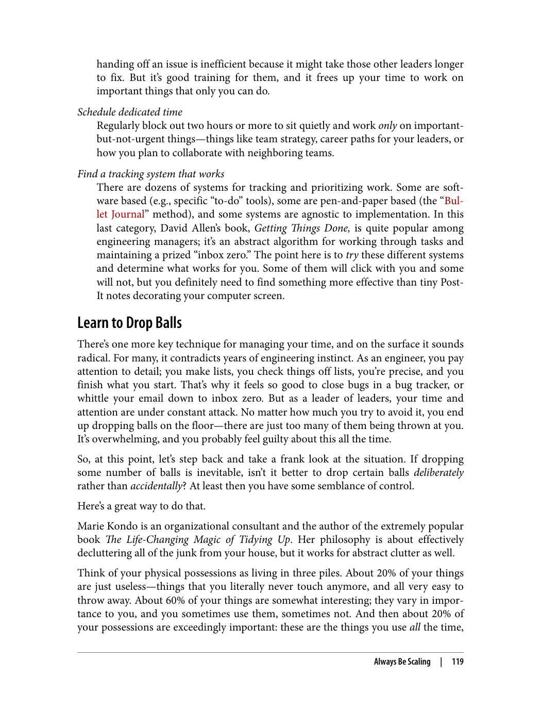

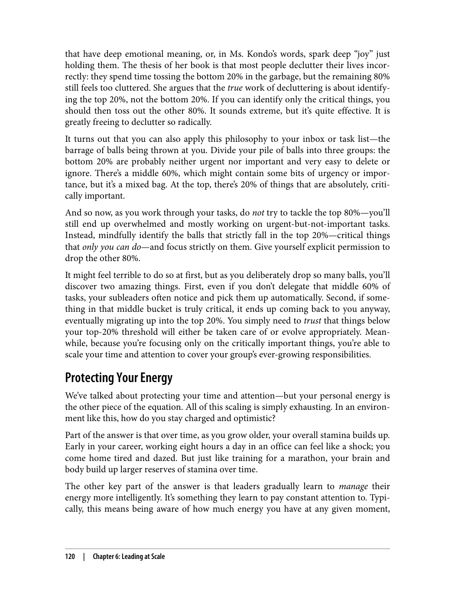

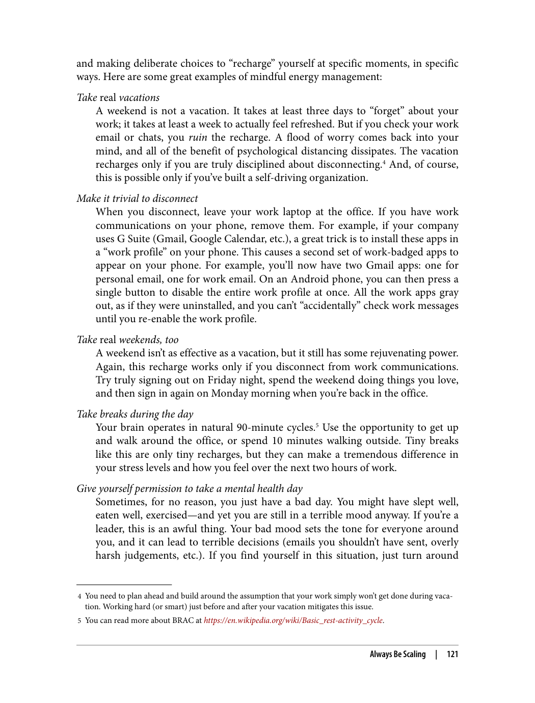

---

###### 📄 صفحه ۱۵۰
> 1 Frederick P. Brooks, The Mythical Man-Month: Essays on Software Engineering (New York: Addison-Wesley,
> 1995).
> CHAPTER 7
> Measuring Engineering Productivity
> Written by Ciera Jaspen
> Edited by Riona Macnamara
> Google is a data-driven company. We back up most of our products and design deci‐
> sions with hard data. The culture of data-driven decision making, using appropriate
> metrics, has some drawbacks, but overall, relying on data tends to make most deci‐
> sions objective rather than subjective, which is often a good thing. Collecting and
> analyzing data on the human side of things, however, has its own challenges. Specifi‐
> cally, within software engineering, Google has found that having a team of specialists
> focus on engineering productivity itself to be very valuable and important as the
> company scales and can leverage insights from such a team.
> Why Should We Measure Engineering Productivity?
> Let’s presume that you have a thriving business (e.g., you run an online search
> engine), and you want to increase your business’s scope (enter into the enterprise
> application market, or the cloud market, or the mobile market). Presumably, to
> increase the scope of your business, you’ll need to also increase the size of your engi‐
> neering organization. However, as organizations grow in size linearly, communica‐
> tion costs grow quadratically.1 Adding more people will be necessary to increase the
> scope of your business, but the communication overhead costs will not scale linearly
> as you add additional personnel. As a result, you won’t be able to scale the scope of
> your business linearly to the size of your engineering organization.
> 123

گاهی اوقات، فرآیندهایی که سال‌ها استفاده شده‌اند، ممکن است دیگر مؤثر نباشند. مهم است که بتوانیم این فرآیندها را به چالش بکشیم و بهبود دهیم.

خوانش‌پذیری کد (Code Readability) به مجموعه سبک‌ها و بهترین شیوه‌هایی اشاره دارد که کد را برای مهندسان دیگر قابل نگهداری می‌کند. فصل ۳ را ببینید.

fredrick پی. بروکس، افسانه ماه-مرد: مقالاتی در مورد مهندسی نرم‌افزار (نیویورک: ادیسون-وسلی، ۱۹۹۵).

فصل ۷

اندازه‌گیری بهره‌وری مهندسی

توسط سیرا جاسپن نوشته شده
توسط ریونا مک‌نامارا ویرایش شده

گوگل شرکتی داده‌محور (Data-Driven) است. بیشتر محصولات و تصمیمات طراحی خود را با داده‌های قطعی پشتیبانی می‌کنیم. فرهنگ تصمیم‌گیری داده‌محور با استفاده از معیارهای (Metrics) مناسب، معایبی دارد، اما در کل، تکیه بر داده‌ها تمایل دارد بیشتر تصمیمات را عینی (Objective) به جای ذهنی (Subjective) کند، که اغلب خوب است. با این حال، جمع‌آوری و تحلیل داده‌ها در سمت انسانی امور، چالش‌های خاص خود را دارد. به طور خاص، در حوزه مهندسی نرم‌افزار، گوگل دریافته که تمرکز تیمی از متخصصان روی بهره‌وری مهندسی خود بسیار ارزشمند و مهم است، زیرا شرکت مقیاس پیدا می‌کند و می‌تواند از بینش‌های چنین تیمی بهره‌مند شود.

چرا باید بهره‌وری مهندسی را اندازه‌گیری کنیم؟

فرض کنید کسب‌وکار پررونقی دارید (مثلاً یک موتور جستجوی آنلاین اداره می‌کنید) و می‌خواهید دامنه کسب‌وکار خود را گسترش دهید (وارد بازار برنامه‌های سازمانی، یا بازار cloud، یا بازار موبایل شوید). احتمالاً، برای افزایش دامنه کسب‌وکار خود، باید اندازه سازمان مهندسی خود را نیز افزایش دهید. با این حال، هنگامی که سازمان‌ها به طور خطی از نظر اندازه رشد می‌کنند، هزینه‌های ارتباطات به صورت درجه دوم (Quadratically) رشد می‌کنند. اضافه کردن افراد بیشتر برای افزایش دامنه کسب‌وکار ضروری خواهد بود، اما هزینه‌های سربار ارتباطات به طور خطی با اضافه شدن پرسنل جدید مقیاس نخواهند یافت. در نتیجه، نمی‌توانید دامنه کسب‌وکار خود را به طور خطی متناسب با اندازه سازمان مهندسی‌تان مقیاس‌دهی کنید.

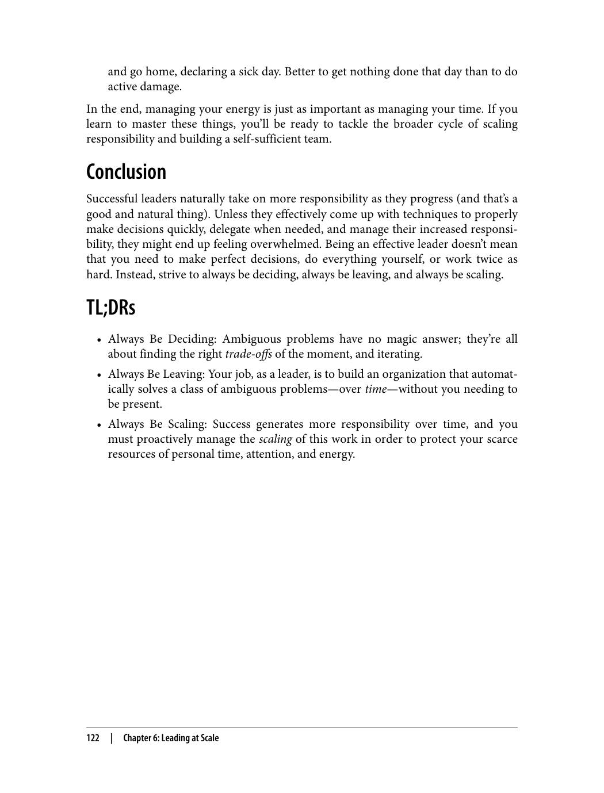

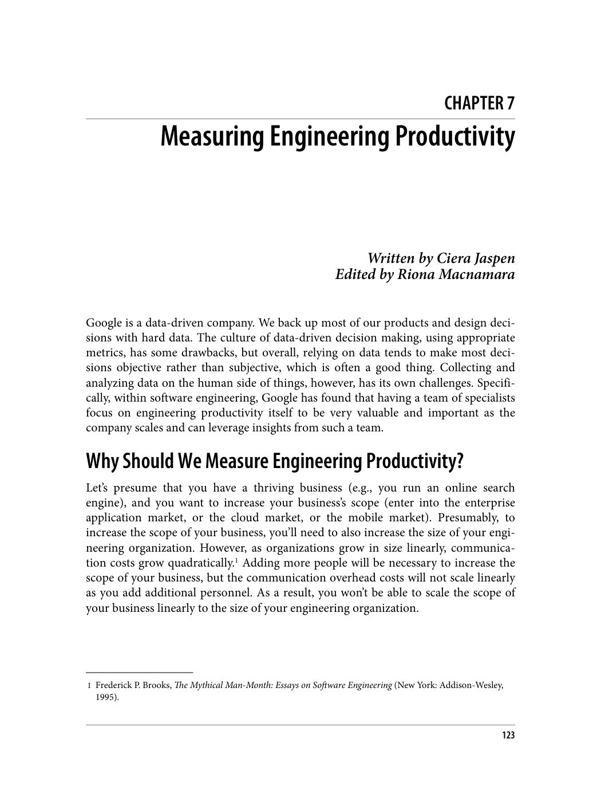

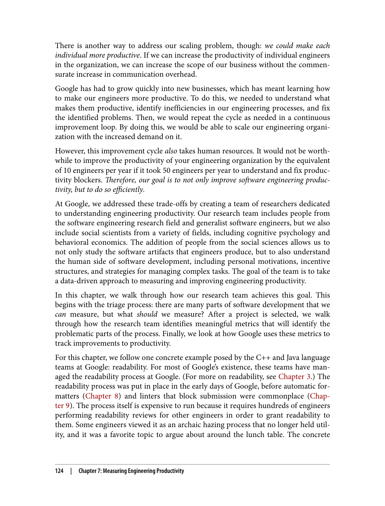

---

###### 📄 صفحه ۱۵۳
> 2 It’s worth pointing out here that our industry currently disparages “anecdata,” and everyone has a goal of
> being “data driven.” Yet anecdotes continue to exist because they are powerful. An anecdote can provide con‐
> text and narrative that raw numbers cannot; it can provide a deep explanation that resonates with others
> because it mirrors personal experience. Although our researchers do not make decisions on anecdotes, we do
> use and encourage techniques such as structured interviews and case studies to deeply understand phenom‐
> ena and provide context to quantitative data.
> When asked about this, the answer from the readability team was straightfor‐
> ward: if the benefit was enough to justify the costs of the process, they would link
> to the research and the data on the FAQ about readability and advertise it to set
> expectations.
> If we get a negative result, will appropriate action be taken?
> We ask this question because in many cases, we find that a negative result will not
> change a decision. There might be other inputs into a decision that would over‐
> ride any negative result. If that is the case, it might not be worth measuring in the
> first place. This is the question that stops most of the projects that our research
> team takes on; we learn that the decision makers were interested in knowing the
> results, but for other reasons, they will not choose to change course.
> In the case of readability, however, we had a strong statement of action from the
> team. It committed that, if our analysis showed that the costs either outweighed
> the benefit or the benefits were negligible, the team would kill the process. As dif‐
> ferent programming languages have different levels of maturity in formatters and
> static analyses, this evaluation would happen on a per-language basis.
> Who is going to decide to take action on the result, and when would they do it?
> We ask this to ensure that the person requesting the measurement is the one who
> is empowered to take action (or is doing so directly on their behalf). Ultimately,
> the goal of measuring our software process is to help people make business deci‐
> sions. It’s important to understand who that individual is, including what form of
> data convinces them. Although the best research includes a variety of approaches
> (everything from structured interviews to statistical analyses of logs), there might
> be limited time in which to provide decision makers with the data they need. In
> those cases, it might be best to cater to the decision maker. Do they tend to make
> decisions by empathizing through the stories that can be retrieved from inter‐
> views?2 Do they trust survey results or logs data? Do they feel comfortable with
> complex statistical analyses? If the decider doesn’t believe the form of the result
> in principle, there is again no point in measuring the process.
> In the case of readability, we had a clear decision maker for each programming
> language. Two language teams, Java and C++, actively reached out to us for assis‐
> tance, and the others were waiting to see what happened with those languages
> 126
> |
> Chapter 7: Measuring Engineering Productivity

هر پروژه و هر تیم شرایط خاص خود را دارد. رویکردهای انعطاف‌پذیر و سفارشی معمولاً مؤثرتر از رویکردهای یکسان هستند.

۲. ارزش اشاره به این نکته را دارد که صنعت ما در حال حاضر از «داده‌های حکایتی» (Anecdata) بدگویی می‌کند و هدف همه «داده‌محور» بودن است. با این حال، حکایات همچنان وجود دارند زیرا قدرتمند هستند. یک حکایت می‌تواند زمینه و روایتی ارائه دهد که اعداد خام نمی‌توانند؛ می‌تواند توضیح عمیقی ارائه دهد که با دیگران هم‌خوانی دارد زیرا تجربه شخصی آن‌ها را منعکس می‌کند. اگرچه محققان ما تصمیمات را بر اساس حکایات نمی‌گیرند، اما از تکنیک‌هایی مانند مصاحبه‌های ساختاریافته (Structured Interviews) و مطالعات موردی (Case Studies) استفاده می‌کنیم و آن‌ها را تشویق می‌کنیم تا پدیده‌ها را به طور عمیق درک کنند و زمینه‌ای برای داده‌های کمّی فراهم کنند.

هنگامی که از تیم خوانایی در این مورد پرسیده شد، پاسخ ساده بود: اگر منفعت به اندازه کافی برای توجیه هزینه‌های فرآیند کافی باشد، آن‌ها به تحقیقات و داده‌ها در مورد سؤالات متداول خوانایی پیوند می‌دادند و آن را تبلیغ می‌کردند تا انتظارات را تعیین کنند.

آیا اگر نتیجه منفی بگیریم، اقدام مناسب انجام خواهد شد؟

این سؤال را می‌پرسیم زیرا در بسیاری از موارد، متوجه می‌شویم که نتیجه منفی تصمیم را تغییر نخواهد داد. ممکن است ورودی‌های دیگری در یک تصمیم وجود داشته باشد که هر نتیجه منفی را نادیده بگیرد. اگر این‌طور باشد، شاید ارزش اندازه‌گیری از ابتدا وجود نداشته باشد. این سؤالی است که بیشتر پروژه‌هایی که تیم تحقیقاتی ما انجام می‌دهد را متوقف می‌کند؛ ما می‌آموزیم که تصمیم‌گیرندگان علاقه‌مند به دانستن نتایج بودند، اما به دلایل دیگر، انتخاب نمی‌کنند مسیر خود را تغییر دهند.

با این حال، در مورد خوانایی، بیانیه قوی از اقدام تیم داشتیم. این تعهد کرد که اگر تحلیل ما نشان دهد هزینه‌ها از منفعت بیشتر است یا منافع ناچیز است، تیم آن فرآیند را متوقف خواهد کرد. از آنجا که زبان‌های برنامه‌نویسی مختلف سطوح مختلفی از بلوغ در قالب‌گرهای (Formatters) و تحلیل‌های ایستا (Static Analysis) دارند، این ارزیابی بر اساس هر زبان به صورت جداگانه انجام می‌شد.

چه کسی تصمیم خواهد گرفت بر اساس نتیجه اقدام کند و چه زمانی این کار را انجام خواهد داد؟

این سؤال را می‌پرسیم تا مطمئن شویم شخصی که درخواست اندازه‌گیری را داده، همان کسی است که اختیار اقدام را دارد (یا مستقیماً به نمایندگی از او عمل می‌کند). در نهایت، هدف از اندازه‌گیری فرآیند نرم‌افزار ما کمک به مردم برای اتخاذ تصمیمات تجاری است. مهم است بدانیم آن فرد کیست، از جمله اینکه چه نوع داده‌ای آن‌ها را متقاعد می‌کند. اگرچه بهترین تحقیقات شامل رویکردهای متنوعی هستند (از مصاحبه‌های ساختاریافته تا تحلیل‌های آماری گزارش‌ها)، ممکن است زمان محدودی برای ارائه داده‌های مورد نیاز تصمیم‌گیرندگان وجود داشته باشد. در چنین مواردی، شاید بهتر باشد مطابق نیاز تصمیم‌گیرنده عمل کنیم. آیا آن‌ها تمایل دارند با هم‌دردی از طریق داستان‌هایی که از مصاحبه‌ها قابل بازیابی است تصمیم بگیرند؟ آیا به نتایج نظرسنجی یا داده‌های گزارش اعتماد دارند؟ آیا با تحلیل‌های آماری پیچیده راحت هستند؟ اگر تصمیم‌گیرنده اصولاً به شکل نتیجه اعتماد نداشته باشد، باز هم اندازه‌گیری فرآیند فایده‌ای ندارد.

در مورد خوانایی، تصمیم‌گیرنده مشخصی برای هر زبان برنامه‌نویسی داشتیم. دو تیم زبان، Java و C++، فعالانه برای کمک با ما تماس گرفتند و بقیه منتظر بودند ببینند با آن زبان‌ها چه اتفاقی می‌افتد.

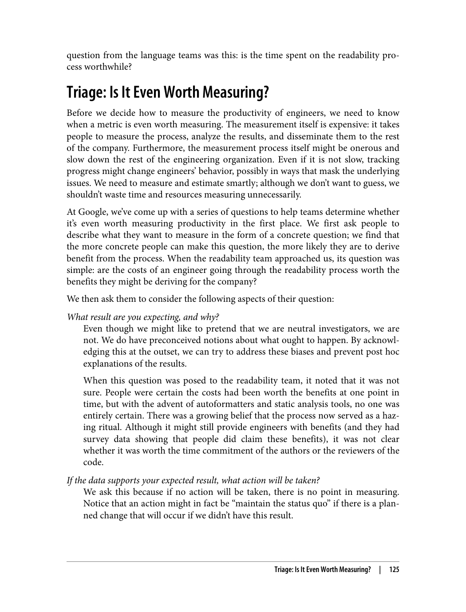

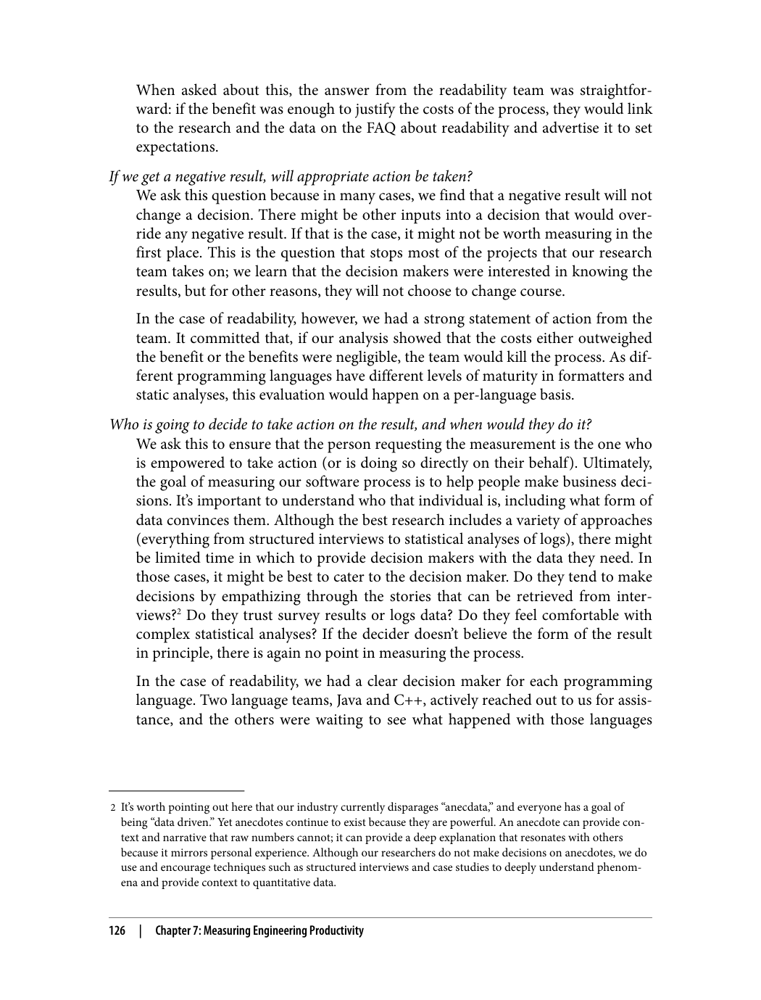

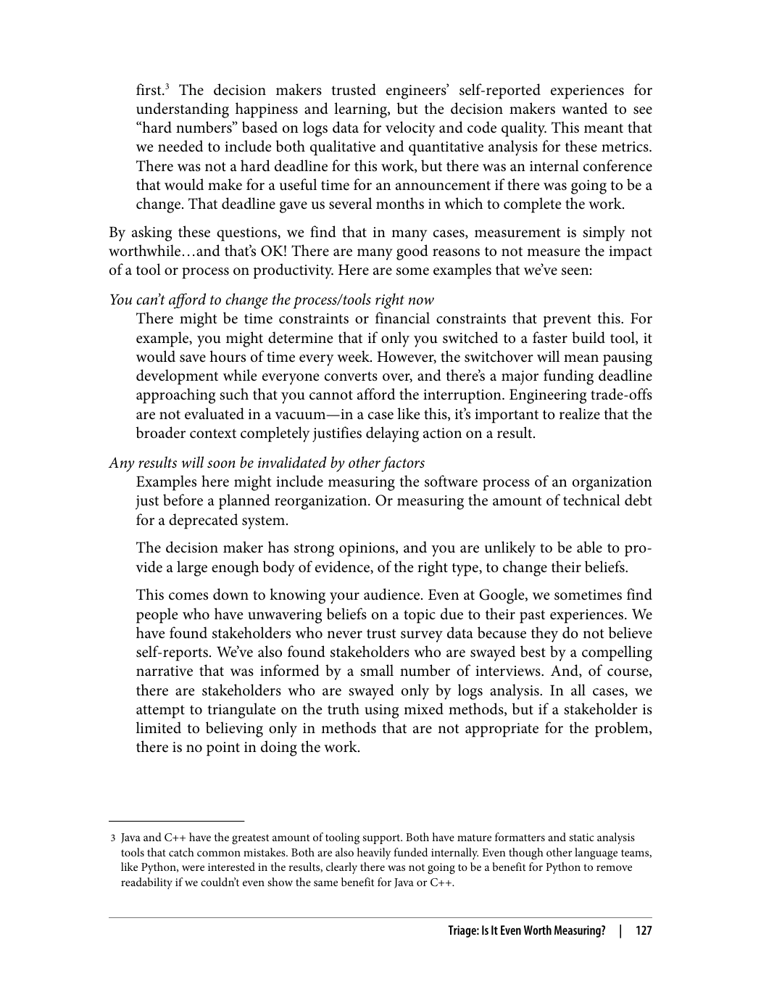

---

###### 📄 صفحه ۱۵۶
> 4 “From there it is only a small step to measuring ‘programmer productivity’ in terms of ‘number of lines of
> code produced per month.’ This is a very costly measuring unit because it encourages the writing of insipid
> code, but today I am less interested in how foolish a unit it is from even a pure business point of view. My
> point today is that, if we wish to count lines of code, we should not regard them as ‘lines produced’ but as
> ‘lines spent’: the current conventional wisdom is so foolish as to book that count on the wrong side of the
> ledger.” Edsger Dijkstra, on the cruelty of really teaching computing science, EWD Manuscript 1036.
> Selecting Meaningful Metrics with Goals and Signals
> After we decide to measure a software process, we need to determine what metrics to
> use. Clearly, lines of code (LOC) won’t do,4 but how do we actually measure engineer‐
> ing productivity?
> At Google, we use the Goals/Signals/Metrics (GSM) framework to guide metrics
> creation.
> • A goal is a desired end result. It’s phrased in terms of what you want to under‐
> stand at a high level and should not contain references to specific ways to meas‐
> ure it.
> • A signal is how you might know that you’ve achieved the end result. Signals are
> things we would like to measure, but they might not be measurable themselves.
> • A metric is proxy for a signal. It is the thing we actually can measure. It might not
> be the ideal measurement, but it is something that we believe is close enough.
> The GSM framework encourages several desirable properties when creating metrics.
> First, by creating goals first, then signals, and finally metrics, it prevents the streetlight
> effect. The term comes from the full phrase “looking for your keys under the street‐
> light”: if you look only where you can see, you might not be looking in the right place.
> With metrics, this occurs when we use the metrics that we have easily accessible and
> that are easy to measure, regardless of whether those metrics suit our needs. Instead,
> GSM forces us to think about which metrics will actually help us achieve our goals,
> rather than simply what we have readily available.
> Second, GSM helps prevent both metrics creep and metrics bias by encouraging us to
> come up with the appropriate set of metrics, using a principled approach, in advance
> of actually measuring the result. Consider the case in which we select metrics without
> a principled approach and then the results do not meet our stakeholders’ expecta‐
> tions. At that point, we run the risk that stakeholders will propose that we use differ‐
> ent metrics that they believe will produce the desired result. And because we didn’t
> select based on a principled approach at the start, there’s no reason to say that they’re
> wrong! Instead, GSM encourages us to select metrics based on their ability to meas‐
> ure the original goals. Stakeholders can easily see that these metrics map to their
> Selecting Meaningful Metrics with Goals and Signals
> |
> 129

تمرکز بر کاربرانی که بیشترین نیاز را دارند، به ایجاد نرم‌افزار بهتر و فراگیرتر کمک می‌کند.

۴. «از آنجا فقط یک قدم کوچک تا اندازه‌گیری 'بهره‌وری برنامه‌نویس' بر اساس 'تعداد خطوط کد تولید شده در ماه' باقی می‌ماند. این واحد اندازه‌گیری بسیار پرهزینه است زیرا نوشتن کد بی‌محتوا را تشویق می‌کند، اما امروز کمتر به این موضوع علاقه‌مندم که از دیدگاه صرفاً تجاری چقدر واحد احمقانه‌ای است. نکته من امروز این است که اگر بخواهیم خطوط کد را بشماریم، نباید آن‌ها را به عنوان 'خطوط تولید شده' در نظر بگیریم بلکه به عنوان 'خطوط خرج شده': خرد رایج فعلی آنقدر احمقانه است که آن شمارش را در سمت اشتباه دفتر ثبت می‌کند.» ادگار دایکسترا، در مورد بی‌رحمی واقعی تدریس علوم کامپیوتر، دست‌نوشته EWD 1036.

انتخاب معیارهای معنادار با اهداف و سیگنال‌ها

پس از اینکه تصمیم گرفتیم فرآیند نرم‌افزاری را اندازه‌گیری کنیم، باید تعیین کنیم از چه معیارهایی استفاده کنیم. واضح است که خطوط کد (LOC) مناسب نیستند، اما چگونه واقعاً بهره‌وری مهندسی را اندازه‌گیری کنیم؟

در گوگل، از چارچوب اهداف/سیگنال‌ها/معیارها (GSM) برای راهنمایی ایجاد معیارها استفاده می‌کنیم.

• هدف (Goal) نتیجه مطلوب مورد نظر است. بر اساس آنچه می‌خواهید در سطح بالا درک کنید بیان می‌شود و نباید حاوی ارجاعات به روش‌های خاص اندازه‌گیری باشد.
• سیگنال (Signal) راهی است که می‌توانید بفهمید به نتیجه مطلوب رسیده‌اید. سیگنال‌ها چیزهایی هستند که دوست داریم اندازه‌گیری کنیم، اما ممکن است خودشان قابل اندازه‌گیری نباشند.
• معیار (Metric) جانشینی برای سیگنال است. چیزی است که واقعاً می‌توانیم اندازه‌گیری کنیم. ممکن است اندازه‌گیری ایده‌آل نباشد، اما چیزی است که معتدیم به اندازه کافی نزدیک است.

چارچوب GSM چندین ویژگی مطلوب را هنگام ایجاد معیارها تشویق می‌کند. اول، با ایجاد اهداف ابتدا، سپس سیگنال‌ها و در نهایت معیارها، از اثر چراغ‌خیابان (Streetlight Effect) جلوگیری می‌کند. این اصطلاح از عبارت کامل «جستجوی کلیدهایتان زیر چراغ خیابان» می‌آید: اگر فقط جایی نگاه کنید که می‌توانید ببینید، ممکن است در جای درستی نگاه نکنید. در مورد معیارها، این زمانی اتفاق می‌افتد که از معیارهایی استفاده می‌کنیم که به راحتی در دسترس هستند و اندازه‌گیری آن‌ها آسان است، صرف نظر از اینکه آیا آن معیارها مناسب نیازهای ما هستند یا نه. در عوض، GSM ما را مجبور می‌کند به جای آنچه به راحتی در دسترس داریم، در مورد اینکه کدام معیارها واقعاً به ما کمک می‌کنند به اهدافمان برسیم، فکر کنیم.

دوم، GSM با تشویق ما به انتخاب مجموعه مناسب معیارها با استفاده از رویکردی اصولی، از پیش از اندازه‌گیری واقعی نتیجه، هم از گسترش معیارها (Metrics Creep) و هم از سوگیری معیارها (Metrics Bias) جلوگیری می‌کند. حالتی را در نظر بگیرید که معیارها را بدون رویکرد اصولی انتخاب می‌کنیم و سپس نتایج با انتظارات ذی‌نفعان (Stakeholders) مطابقت ندارند. در آن نقطه، خطر این وجود دارد که ذی‌نفعان پیشنهاد دهند از معیارهای دیگری استفاده کنیم که به نظر آن‌ها نتیجه مطلوب را تولید می‌کند. و از آنجا که در ابتدا بر اساس رویکرد اصولی انتخاب نکرده‌ایم، دلیلی وجود ندارد بگوییم آن‌ها اشتباه می‌کنند! در عوض، GSM ما را تشویق می‌کند بر اساس توانایی معیارها در اندازه‌گیری اهداف اصلی، معیارها را انتخاب کنیم. ذی‌نفعان به راحتی می‌توانند ببینند که این معیارها با اهداف آن‌ها نگاشت می‌شوند.

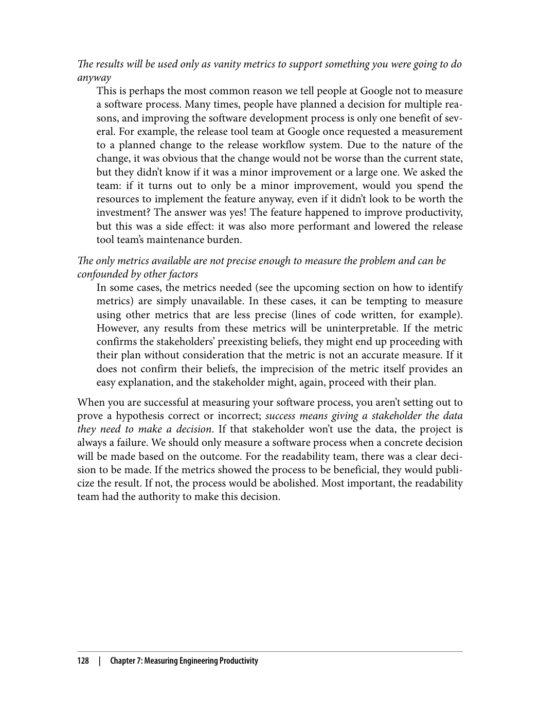

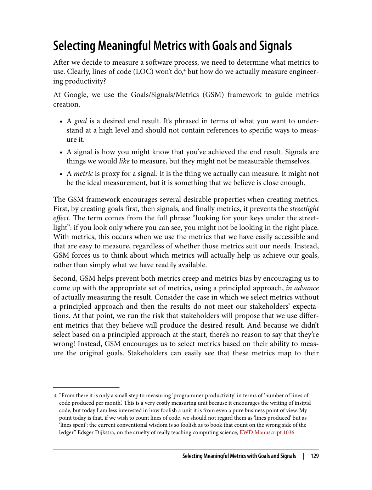

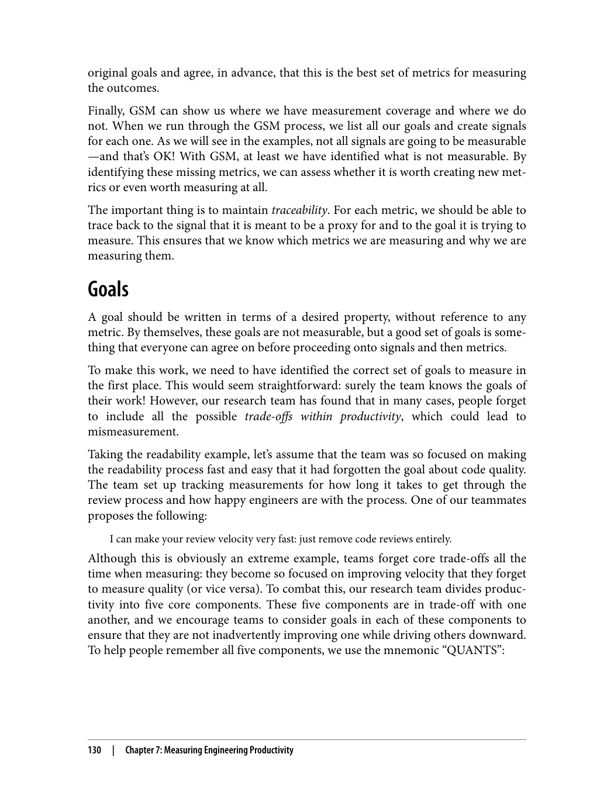

---
