> **راهنمای مطالعه**
>
> در هر بخش، ابتدا متن اصلی کتاب به زبان انگلیسی آورده شده و سپس ترجمه و توضیحات فارسی همان بخش ارائه شده است.

---
-

###### 📄 صفحه ۱۵۹
> Signals
> A signal is the way in which we will know we’ve achieved our goal. Not all signals are
> measurable, but that’s acceptable at this stage. There is not a 1:1 relationship between
> signals and goals. Every goal should have at least one signal, but they might have
> more. Some goals might also share a signal. Table 7-1 shows some example signals for
> the goals of the readability process measurement.
> Table 7-1. Signals and goals
> Goals
> Signals
> Engineers write higher-quality code as a result of
> the readability process.
> Engineers who have been granted readability judge their code to be of
> higher quality than engineers who have not been granted readability.
> The readability process has a positive impact on code quality.
> Engineers learn about the Google codebase and
> best coding practices as a result of the readability
> process.
> Engineers report learning from the readability process.
> Engineers receive mentoring during the
> readability process.
> Engineers report positive interactions with experienced Google engineers
> who serve as reviewers during the readability process.
> Engineers complete work tasks faster and more
> efficiently as a result of the readability process.
> Engineers who have been granted readability judge themselves to be
> more productive than engineers who have not been granted readability.
> Changes written by engineers who have been granted readability are
> faster to review than changes written by engineers who have not been
> granted readability.
> Engineers see the benefit of the readability
> process and have positive feelings about
> participating in it.
> Engineers view the readability process as being worthwhile.
> Metrics
> Metrics are where we finally determine how we will measure the signal. Metrics are
> not the signal themselves; they are the measurable proxy of the signal. Because they
> are a proxy, they might not be a perfect measurement. For this reason, some signals
> might have multiple metrics as we try to triangulate on the underlying signal.
> For example, to measure whether engineers’ code is reviewed faster after readability,
> we might use a combination of both survey data and logs data. Neither of these met‐
> rics really provide the underlying truth. (Human perceptions are fallible, and logs
> metrics might not be measuring the entire picture of the time an engineer spends
> reviewing a piece of code or can be confounded by factors unknown at the time, like
> the size or difficulty of a code change.) However, if these metrics show different
> results, it signals that possibly one of them is incorrect and we need to explore fur‐
> ther. If they are the same, we have more confidence that we have reached some kind
> of truth.
> 132
> |
> Chapter 7: Measuring Engineering Productivity

سیگنال‌ها

سیگنال راهی است که از طریق آن می‌فهمیم به هدف خود رسیده‌ایم. همه سیگنال‌ها قابل اندازه‌گیری نیستند، اما در این مرحله قابل قبول است. رابطه ۱ به ۱ بین سیگنال‌ها و اهداف وجود ندارد. هر هدف باید حداقل یک سیگنال داشته باشد، اما ممکن است بیشتر داشته باشد. برخی اهداف ممکن است سیگنال مشترکی نیز داشته باشند. جدول ۷-۱ برخی سیگنال‌های نمونه برای اهداف اندازه‌گیری فرآیند خوانایی را نشان می‌دهد.

جدول ۷-۱. سیگنال‌ها و اهداف

اهداف:
مهندسان کد با کیفیت‌تری در نتیجه فرآیند خوانایی می‌نویسند.

سیگنال‌ها:
مهندسانی که خوانایی به آن‌ها اعطا شده، کد خود را با کیفیت‌تر از مهندسانی که خوانایی به آن‌ها اعطا نشده ارزیابی می‌کنند.
فرآیند خوانایی تأثیر مثبتی بر کیفیت کد دارد.

مهندسان در نتیجه فرآیند خوانایی در مورد کد پایه (Codebase) Google و بهترین شیوه‌های کدنویسی یاد می‌گیرند.
مهندسان گزارش می‌دهند که از فرآیند خوانایی یاد گرفته‌اند.

مهندسان در طول فرآیند خوانایی راهنمایی دریافت می‌کنند.
مهندسان تعاملات مثبتی با مهندسان باتجربه Google که به عنوان بررسی‌کنندگان در فرآیند خوانایی خدمت می‌کنند گزارش می‌دهند.

مهندسان وظایف کاری خود را سریع‌تر و کارآمدتر در نتیجه فرآیند خوانایی انجام می‌دهند.
مهندسانی که خوانایی به آن‌ها اعطا شده، خود را بهره‌ورتر از مهندسانی که خوانایی به آن‌ها اعطا نشده ارزیابی می‌کنند.
تغییرات نوشته شده توسط مهندسانی که خوانایی به آن‌ها اعطا شده سریع‌تر بررسی می‌شوند تا تغییرات نوشته شده توسط مهندسانی که خوانایی به آن‌ها اعطا نشده.

مهندسان منفعت فرآیند خوانایی را می‌بینند و احساسات مثبتی نسبت به شرکت در آن دارند.
مهندسان فرآیند خوانایی را ارزشمند می‌دانند.

معیارها

معیارها جایی هستند که در نهایت تعیین می‌کنیم چگونه سیگنال را اندازه‌گیری کنیم. معیارها خود سیگنال‌ها نیستند؛ جانشین قابل اندازه‌گیری سیگنال هستند. از آنجا که جانشین هستند، ممکن است اندازه‌گیری کاملی نباشند. به همین دلیل، برخی سیگنال‌ها ممکن است چندین معیار داشته باشند تا سعی کنیم به صورت مثلثی به سیگنال اصلی نزدیک شویم.

به عنوان مثال، برای اندازه‌گیری اینکه آیا کد مهندسان پس از خوانایی سریع‌تر بررسی می‌شود، ممکن است از ترکیبی از داده‌های نظرسنجی و داده‌های گزارش استفاده کنیم. هیچ‌کدام از این معیارها واقعاً حقیقت اصلی را ارائه نمی‌دهند. (ادراکات انسانی خطاپذیر هستند و معیارهای گزارش ممکن است کل تصویر زمانی که یک مهندس صرف بررسی یک قطعه کد می‌کند را اندازه‌گیری نکنند یا ممکن است عوامل ناشناخته در آن زمان مانند اندازه یا دشواری یک تغییر کد، نتیجه را مخدوش کنند.) با این حال، اگر این معیارها نتایج متفاوتی نشان دهند، نشانه این است که احتمالاً یکی از آن‌ها نادرست است و باید بیشتر بررسی کنیم. اگر نتایج یکسان باشند، اطمینان بیشتری داریم که به نوعی حقیقت رسیده‌ایم.

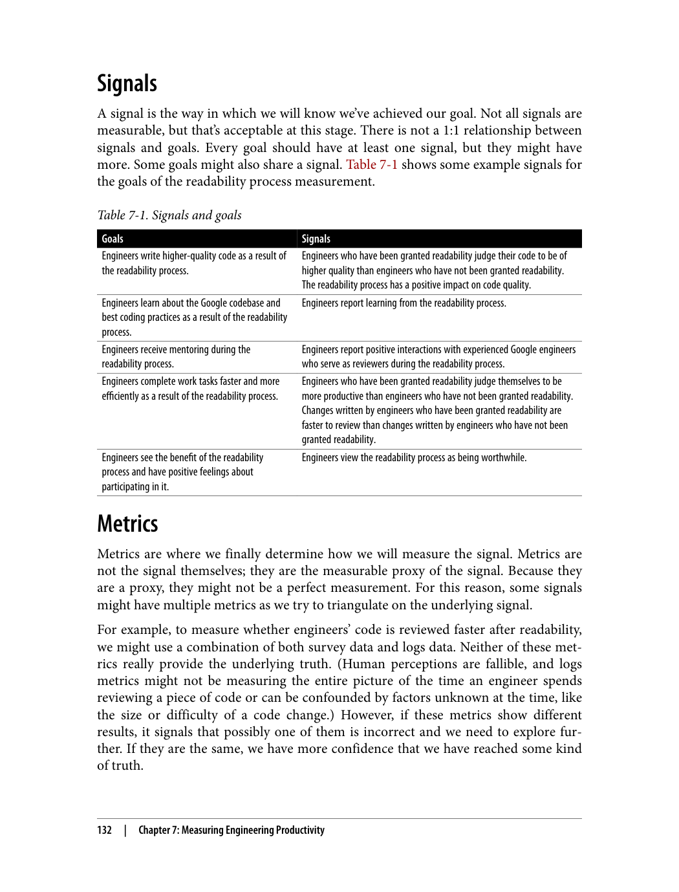

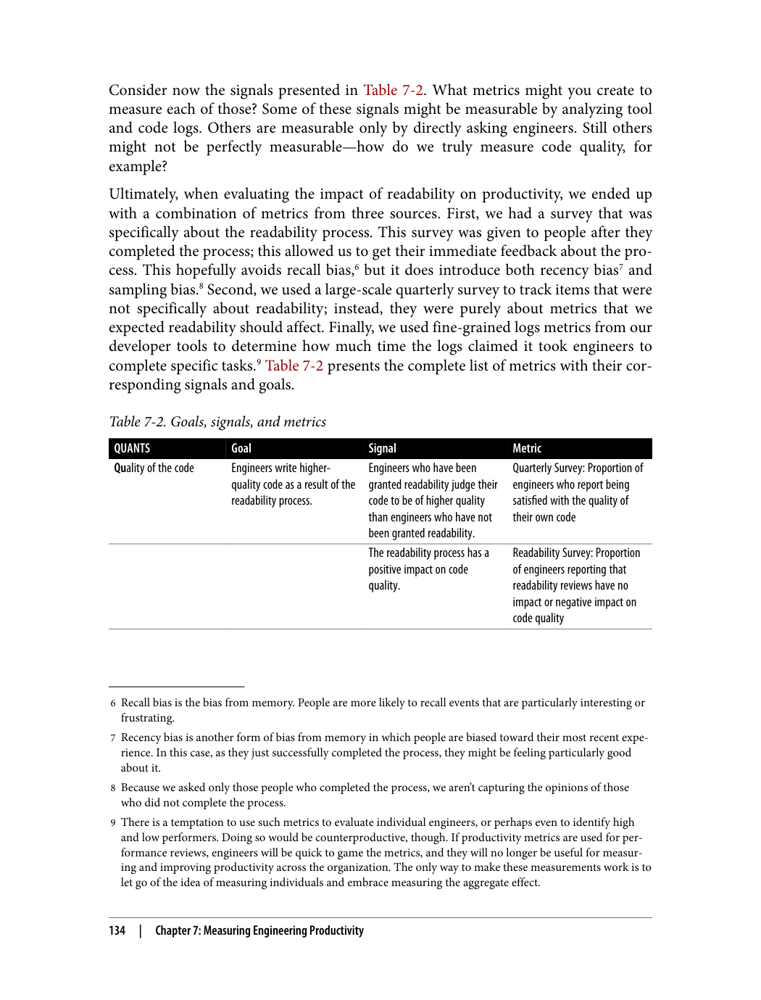

---

###### 📄 صفحه ۱۶۳
> QUANTS
> Goal
> Signal
> Metric
>
>
> CLs written by engineers who
> have been granted readability
> are easier to shepherd through
> code review than CLs written
> by engineers who have not
> been granted readability.
> Logs data: Median shepherding
> time for CLs from authors with
> readability and without
> readability
>
>
> CLs written by engineers who
> have been granted readability
> are faster to get through code
> review than CLs written by
> engineers who have not been
> granted readability.
> Logs data: Median time to
> submit for CLs from authors
> with readability and without
> readability
>
>
> The readability process does
> not have a negative impact on
> engineering velocity.
> Readability Survey: Proportion
> of engineers reporting that the
> readability process negatively
> impacts their velocity
>
>
>
> Readability Survey: Proportion
> of engineers reporting that
> readability reviewers
> responded promptly
>
>
>
> Readability Survey: Proportion
> of engineers reporting that
> timeliness of reviews was a
> strength of the readability
> process
> Satisfaction
> Engineers see the benefit of
> the readability process and
> have positive feelings about
> participating in it.
> Engineers view the readability
> process as being an overall
> positive experience.
> Readability Survey: Proportion
> of engineers reporting that
> their experience with the
> readability process was positive
> overall
>
>
> Engineers view the readability
> process as being worthwhile
> Readability Survey: Proportion
> of engineers reporting that the
> readability process is
> worthwhile
>
>
>
> Readability Survey: Proportion
> of engineers reporting that the
> quality of readability reviews is
> a strength of the process
>
>
>
> Readability Survey: Proportion
> of engineers reporting that
> thoroughness is a strength of
> the process
>
>
> Engineers do not view the
> readability process as
> frustrating.
> Readability Survey: Proportion
> of engineers reporting that the
> readability process is uncertain,
> unclear, slow, or frustrating
> 136
> |
> Chapter 7: Measuring Engineering Productivity

بدون راهنمای سبک کد، هر برنامه‌نویس ممکن است سبک متفاوتی داشته باشد. این باعث می‌شود کد خوانایی کمتری داشته باشد و نگهداری آن دشوارتر شود.

QUANTS

هدف: CL‌های نوشته شده توسط مهندسانی که خوانایی به آن‌ها اعطا شده، راحت‌تر از طریق بررسی کد هدایت (Shepherd) می‌شوند.
سیگنال: داده‌های گزارش: زمان میانه هدایت CL‌ها از نویسندگان با خوانایی و بدون خوانایی

هدف: CL‌های نوشته شده توسط مهندسانی که خوانایی به آن‌ها اعطا شده، سریع‌تر از بررسی کد عبور می‌کنند.
سیگنال: داده‌های گزارش: زمان میانه ارسال برای CL‌ها از نویسندگان با خوانایی و بدون خوانایی

هدف: فرآیند خوانایی تأثیر منفی بر سرعت مهندسی ندارد.
سیگنال: نظرسنجی خوانایی: نسبت مهندسانی که گزارش می‌دهند فرآیند خوانایی تأثیر منفی بر سرعت آن‌ها دارد
سیگنال: نظرسنجی خوانایی: نسبت مهندسانی که گزارش می‌دهند بررسی‌کنندگان خوانایی به موقع پاسخ داده‌اند
سیگنال: نظرسنجی خوانایی: نسبت مهندسانی که گزارش می‌دهند به‌موقع بودن بررسی‌ها نقطه قوت فرآیند خوانایی است

هدف: رضایت - مهندسان منفعت فرآیند خوانایی را می‌بینند و احساسات مثبتی نسبت به شرکت در آن دارند.
سیگنال: نظرسنجی خوانایی: نسبت مهندسانی که گزارش می‌دهند تجربه کلی آن‌ها از فرآیند خوانایی مثبت بوده
هدف: مهندسان فرآیند خوانایی را ارزشمند می‌دانند.
سیگنال: نظرسنجی خوانایی: نسبت مهندسانی که گزارش می‌دهند فرآیند خوانایی ارزشمند است
سیگنال: نظرسنجی خوانایی: نسبت مهندسانی که گزارش می‌دهند کیفیت بررسی‌های خوانایی نقطه قوت فرآیند است
سیگنال: نظرسنجی خوانایی: نسبت مهندسانی که گزارش می‌دهند جامعیت نقطه قوت فرآیند است

هدف: مهندسان فرآیند خوانایی را ناامیدکننده نمی‌دانند.
سیگنال: نظرسنجی خوانایی: نسبت مهندسانی که گزارش می‌دهند فرآیند خوانایی مبهم، نامشخص، کند یا ناامیدکننده است

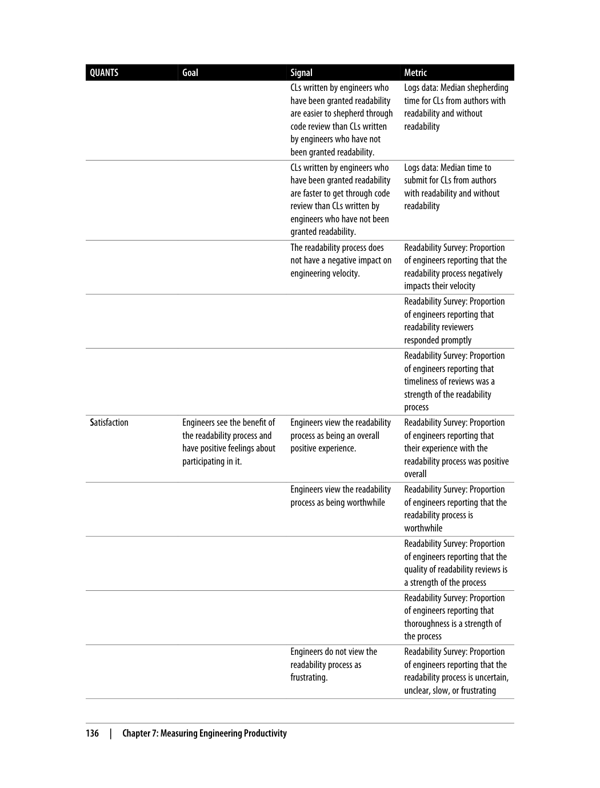

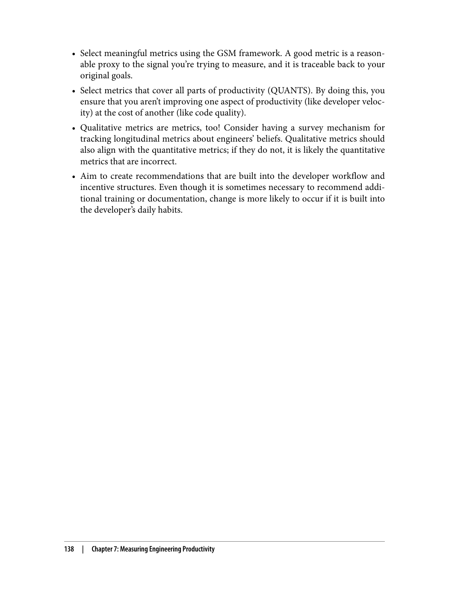

---

###### 📄 صفحه ۱۶۷

1. **خوانایی**: کد باید توسط دیگران قابل خواندن باشد
2. **سادگی**: کد باید ساده و قابل درک باشد
3. **ثبات**: سبک کد باید در سراسر پروژه یکسان باشد

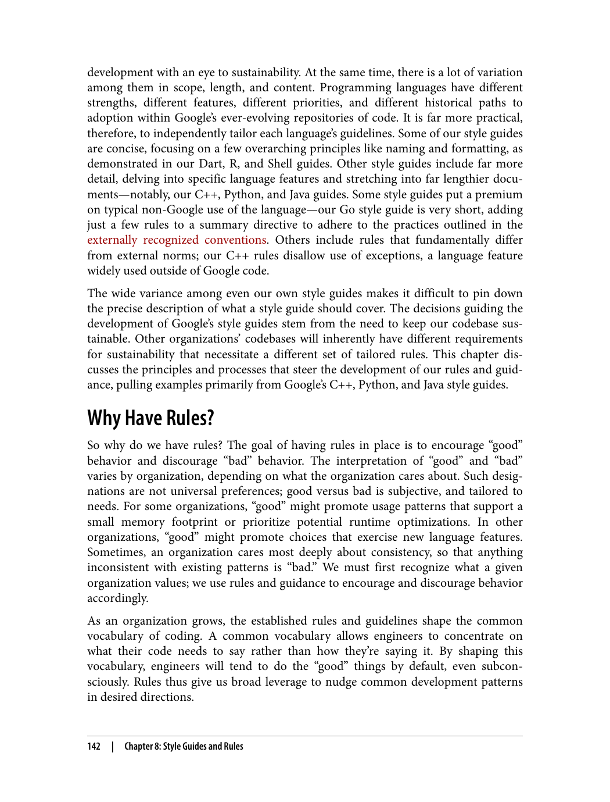

---

###### 📄 صفحه ۱۷۱
> 2 Tooling matters here. The measure for “too many” is not the raw number of rules in play, but how many an
> engineer needs to remember. For example, in the bad-old-days pre-clang-format, we needed to remember a
> ton of formatting rules. Those rules haven’t gone away, but with our current tooling, the cost of adherence has
> fallen dramatically. We’ve reached a point at which somebody could add an arbitrary number of formatting
> rules and nobody would care, because the tool just does it for you.
> Rules must pull their weight
> Not everything should go into a style guide. There is a nonzero cost in asking all of
> the engineers in an organization to learn and adapt to any new rule that is set. With
> too many rules,2 not only will it become harder for engineers to remember all rele‐
> vant rules as they write their code, but it also becomes harder for new engineers to
> learn their way. More rules also make it more challenging and more expensive to
> maintain the rule set.
> To this end, we deliberately chose not to include rules expected to be self-evident.
> Google’s style guide is not intended to be interpreted in a lawyerly fashion; just
> because something isn’t explicitly outlawed does not imply that it is legal. For exam‐
> ple, the C++ style guide has no rule against the use of goto. C++ programmers
> already tend to avoid it, so including an explicit rule forbidding it would introduce
> unnecessary overhead. If just one or two engineers are getting something wrong,
> adding to everyone’s mental load by creating new rules doesn’t scale.
> Optimize for the reader
> Another principle of our rules is to optimize for the reader of the code rather than the
> author. Given the passage of time, our code will be read far more frequently than it is
> written. We’d rather the code be tedious to type than difficult to read. In our Python
> style guide, when discussing conditional expressions, we recognize that they are
> shorter than if statements and therefore more convenient for code authors. However,
> because they tend to be more difficult for readers to understand than the more ver‐
> bose if statements, we restrict their usage. We value “simple to read” over “simple to
> write.” We’re making a trade-off here: it can cost more upfront when engineers must
> repeatedly type potentially longer, descriptive names for variables and types. We
> choose to pay this cost for the readability it provides for all future readers.
> As part of this prioritization, we also require that engineers leave explicit evidence of
> intended behavior in their code. We want readers to clearly understand what the code
> is doing as they read it. For example, our Java, JavaScript, and C++ style guides man‐
> date use of the override annotation or keyword whenever a method overrides a
> superclass method. Without the explicit in-place evidence of design, readers can
> likely figure out this intent, though it would take a bit more digging on the part of
> each reader working through the code.
> 144
> |
> Chapter 8: Style Guides and Rules

دسته‌بندی‌های اصلی:
1. **قوانینی که خوانایی را بهبود می‌بخشند**: مانند نامگذاری متغیرها
2. **قوانینی که بهترین شیوه‌ها را اعمال می‌کنند**: مانند مدیریت خطا
3. **قوانینی که از خطرات جلوگیری می‌کنند**: مانند جلوگیری از کدهای خطرناک

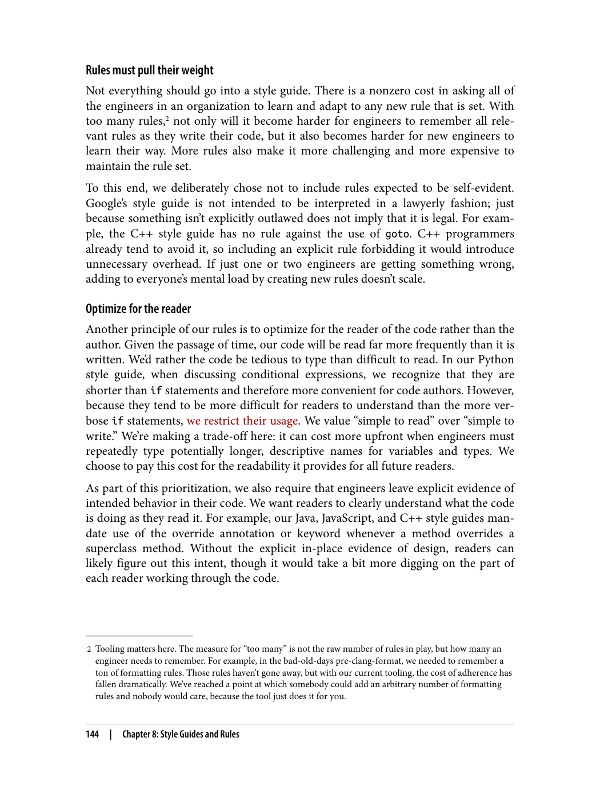

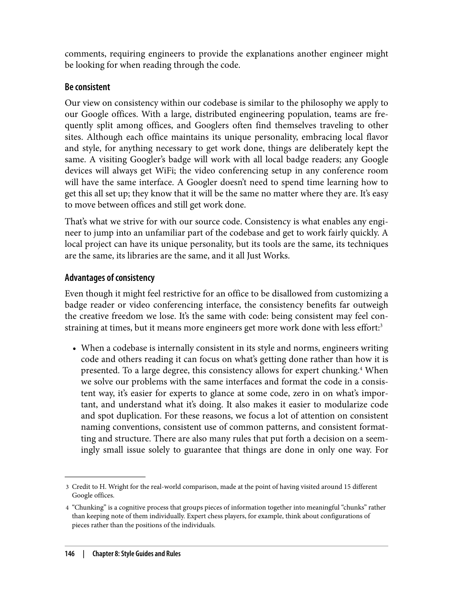

---

###### 📄 صفحه ۱۷۵
> 6 Use of const, for example.
> At Scale
> A few years ago, our C++ style guide promised to almost never change style guide
> rules that would make old code inconsistent: “In some cases, there might be good
> arguments for changing certain style rules, but we nonetheless keep things as they are
> in order to preserve consistency.”
> When the codebase was smaller and there were fewer old, dusty corners, that made
> sense.
> When the codebase grew bigger and older, that stopped being a thing to prioritize.
> This was (for the arbiters behind our C++ style guide, at least) a conscious change:
> when striking this bit, we were explicitly stating that the C++ codebase would never
> again be completely consistent, nor were we even aiming for that.
> It would simply be too much of a burden to not only update the rules to current best
> practices, but to also require that we apply those rules to everything that’s ever been
> written. Our Large Scale Change tooling and processes allow us to update almost all
> of our code to follow nearly every new pattern or syntax so that most old code exhib‐
> its the most recent approved style (see Chapter 22). Such mechanisms aren’t perfect,
> however; when the codebase gets as large as it is, we can’t be sure every bit of old code
> can conform to the new best practices. Requiring perfect consistency has reached the
> point where there’s too much cost for the value.
> Setting the standard.    When we advocate for consistency, we tend to focus on internal
> consistency. Sometimes, local conventions spring up before global ones are adopted,
> and it isn’t reasonable to adjust everything to match. In that case, we advocate a hier‐
> archy of consistency: “Be consistent” starts locally, where the norms within a given
> file precede those of a given team, which precede those of the larger project, which
> precede those of the overall codebase. In fact, the style guides contain a number of
> rules that explicitly defer to local conventions,6 valuing this local consistency over a
> scientific technical choice.
> However, it is not always enough for an organization to create and stick to a set of
> internal conventions. Sometimes, the standards adopted by the external community
> should be taken into account.
> 148
> |
> Chapter 8: Style Guides and Rules

قوانین نباید ثابت و غیرقابل تغییر باشند. آن‌ها باید بتوانند با تغییرات فناوری و نیازهای پروژه سازگار شوند.

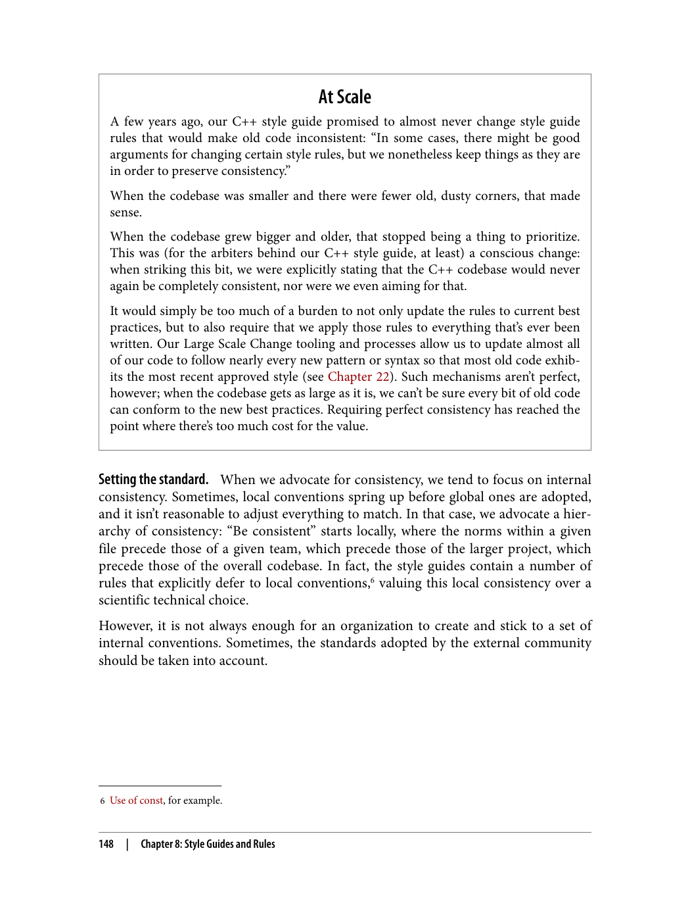

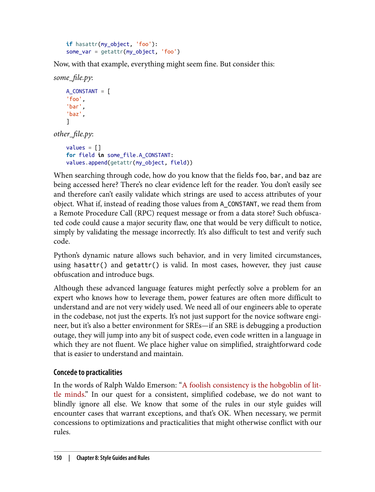

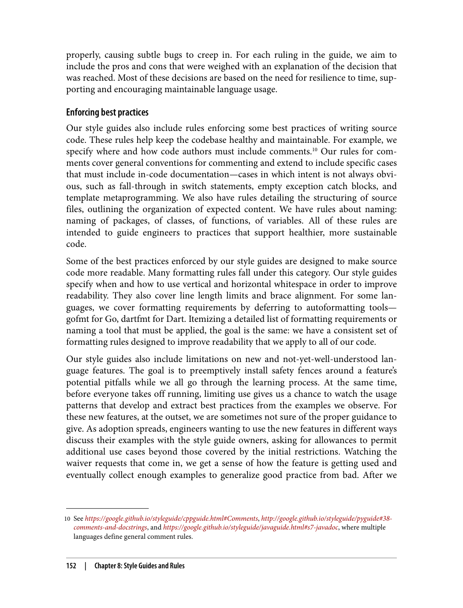

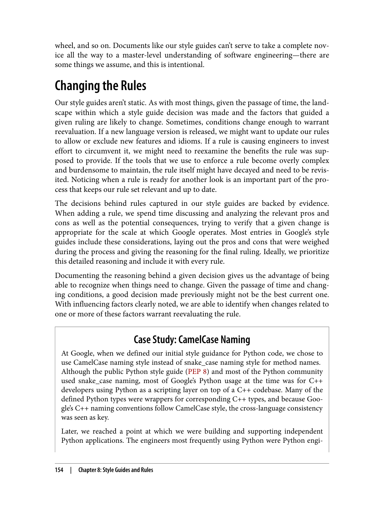

---
