## فصل ۸: راهنمای سبک کد

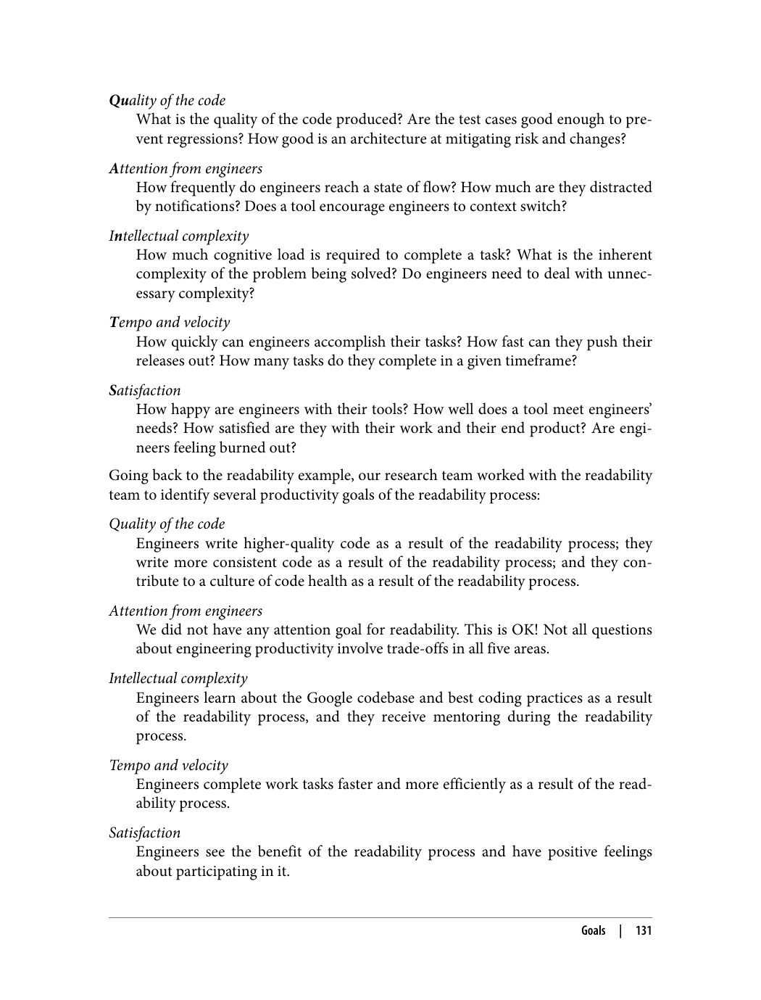

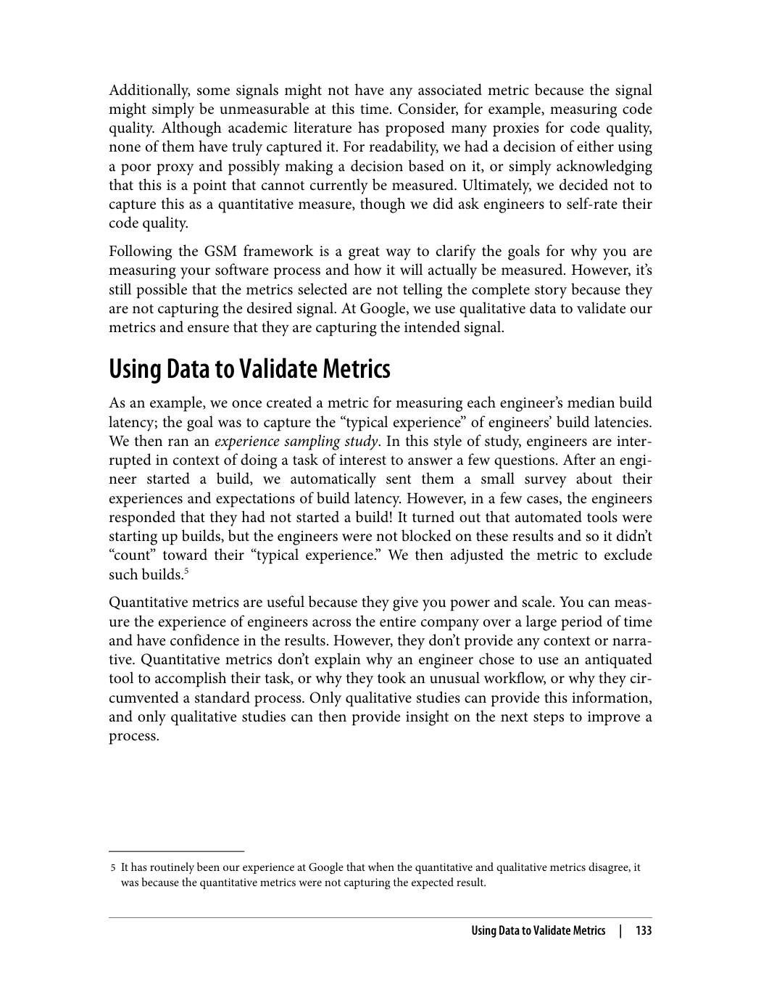

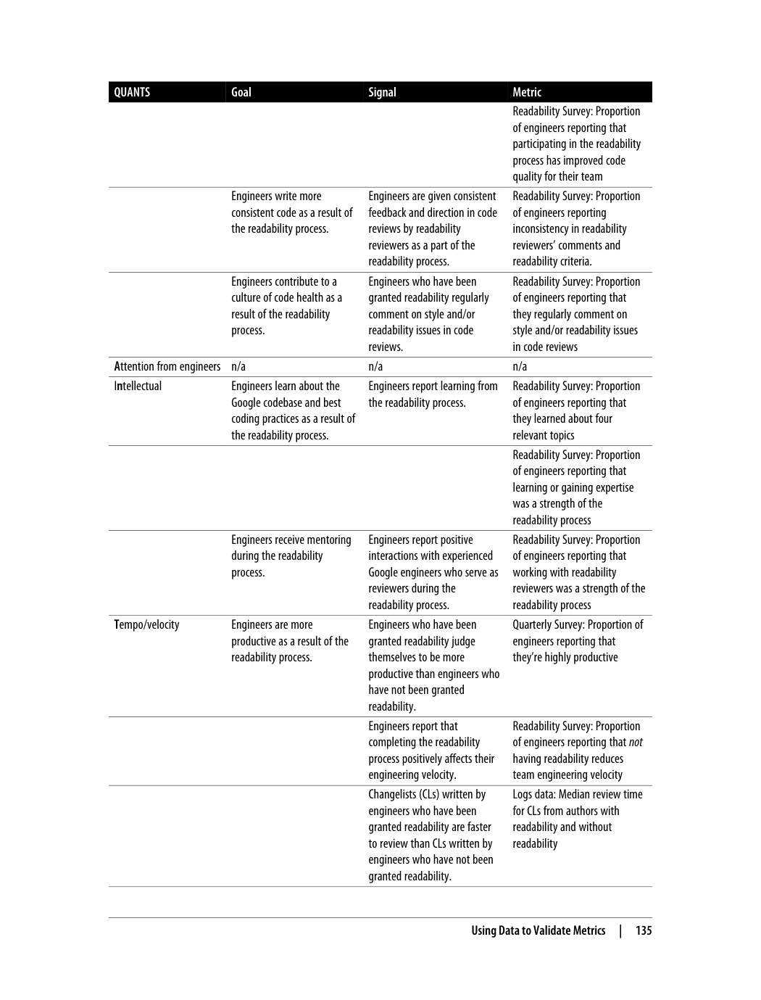

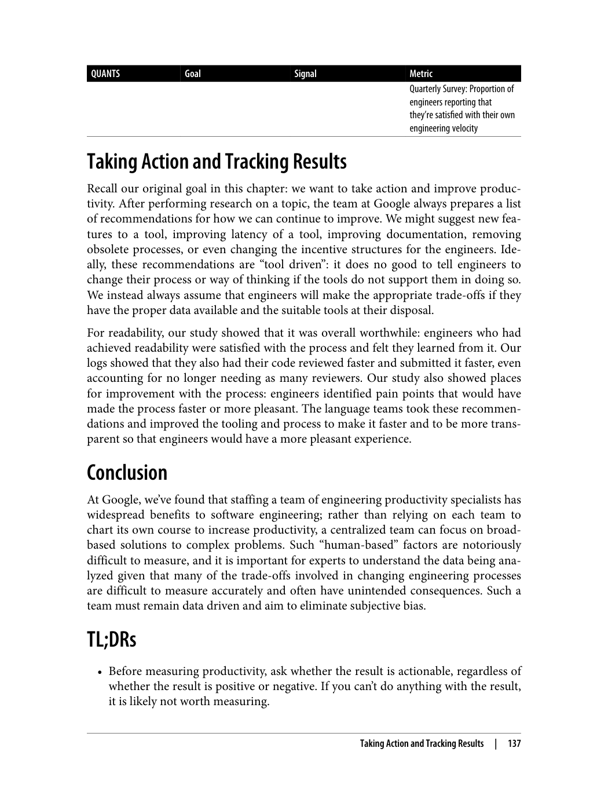

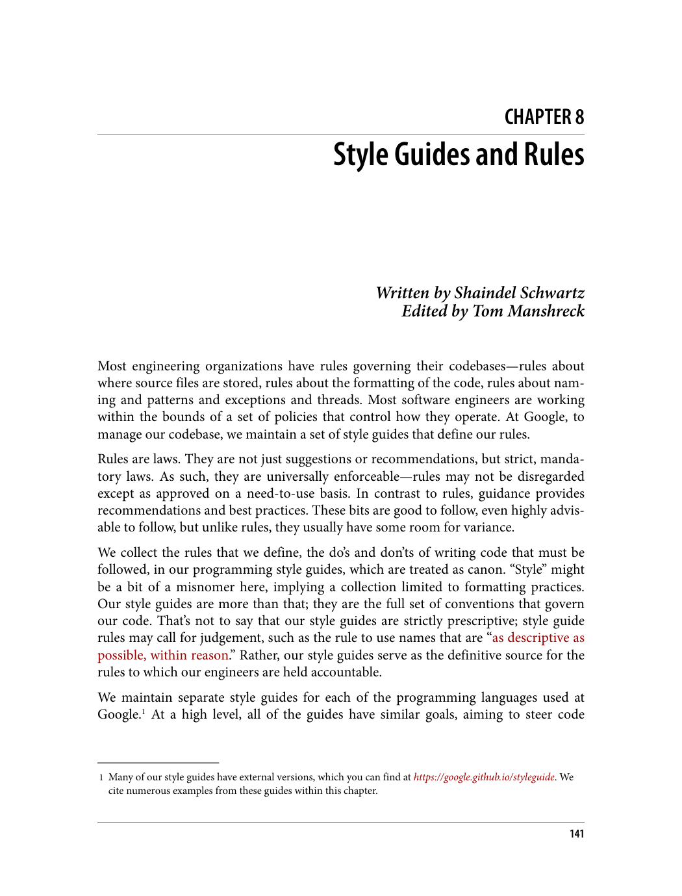

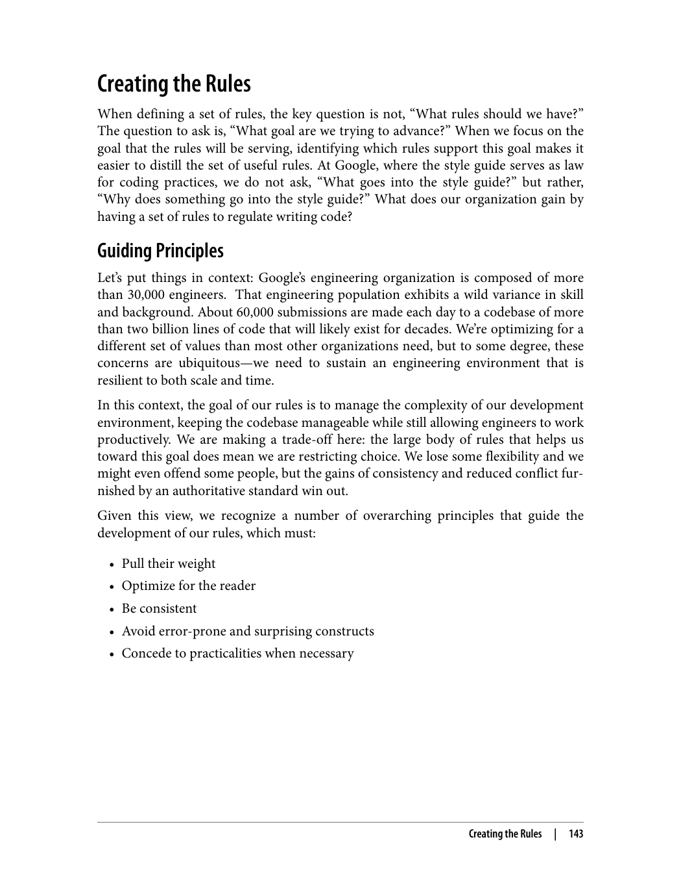

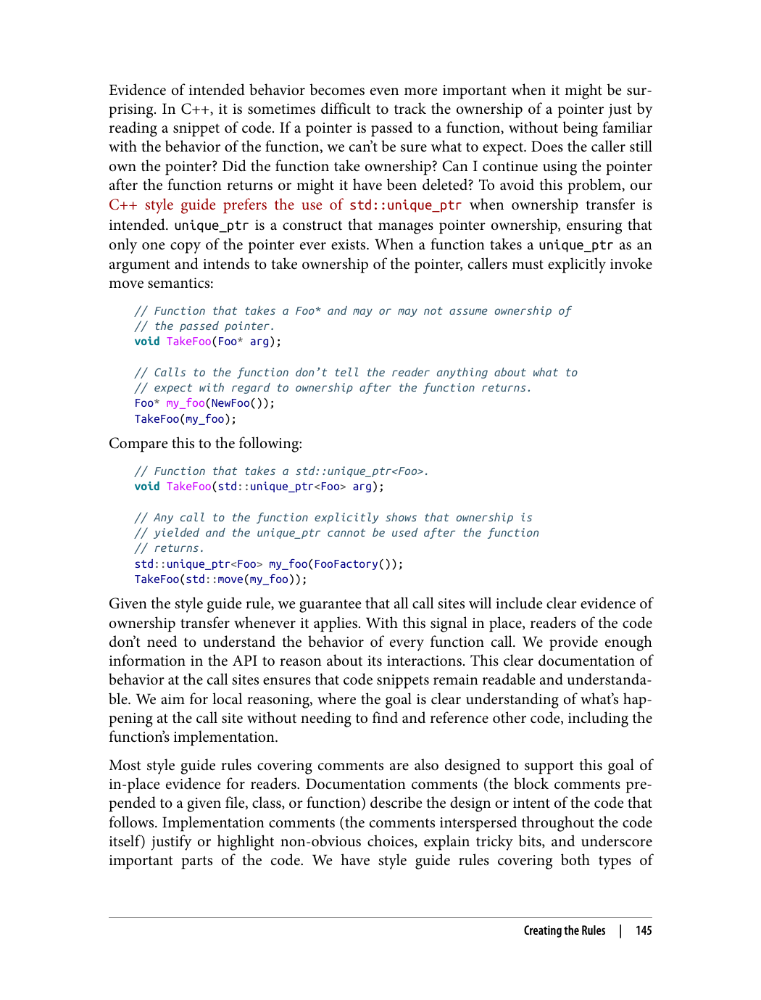

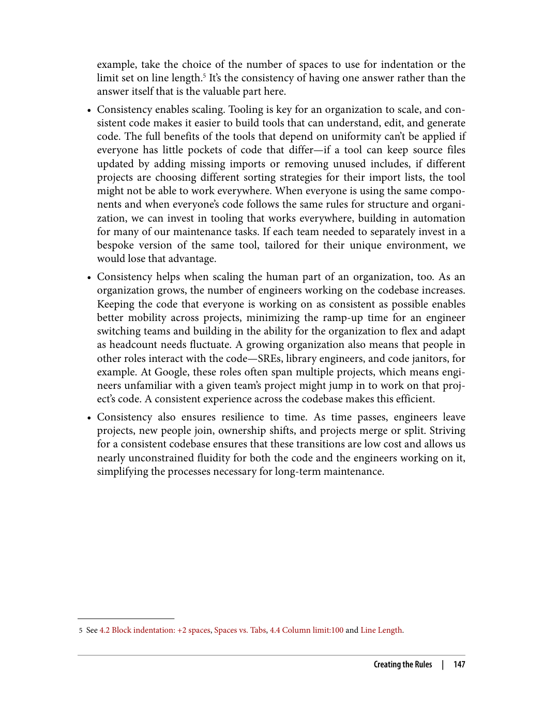

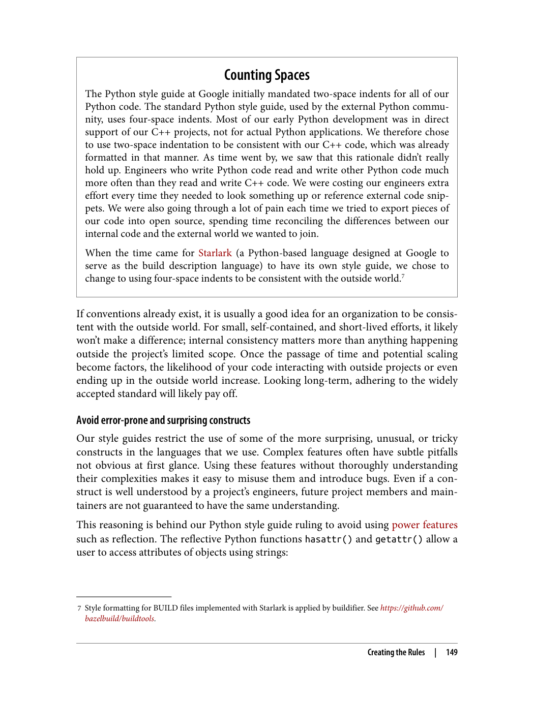

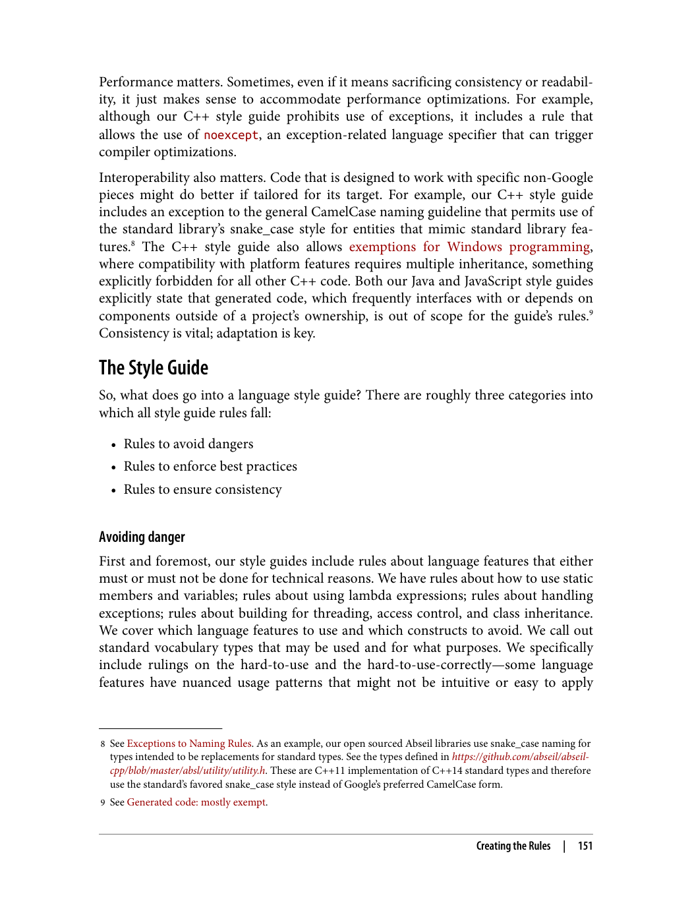

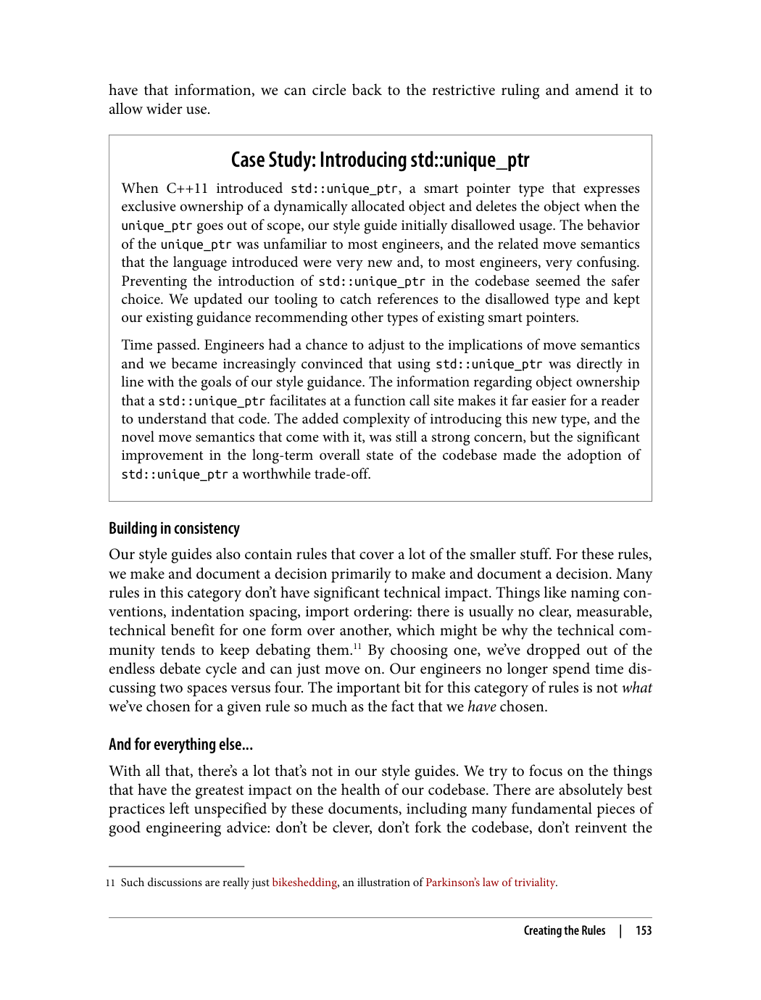

---

> "راهنمای سبک کد، قوانینی است که خوانایی و نگهداری کد را بهبود می‌بخشد. این قوانین باید بر اساس اصول راهنما باشند."

### چرا به راهنمای سبک کد نیاز داریم؟

> "راهنمای سبک کد به ایجاد ثبات در کد کمک می‌کند و خوانایی آن را بهبود می‌بخشد."

بدون راهنمای سبک کد، هر برنامه‌نویس ممکن است سبک متفاوتی داشته باشد. این باعث می‌شود کد خوانایی کمتری داشته باشد و نگهداری آن دشوارتر شود.

### اصول راهنمای سبک کد

> "اصول راهنمای سبک کد باید بر اساس خوانایی، سادگی و ثبات باشند."

1. **خوانایی**: کد باید توسط دیگران قابل خواندن باشد
2. **سادگی**: کد باید ساده و قابل درک باشد
3. **ثبات**: سبک کد باید در سراسر پروژه یکسان باشد

### دسته‌بندی قوانین

> "قوانین راهنمای سبک کد می‌توانند در دسته‌بندی‌های مختلفی قرار بگیرند."

دسته‌بندی‌های اصلی:
1. **قوانینی که خوانایی را بهبود می‌بخشند**: مانند نامگذاری متغیرها
2. **قوانینی که بهترین شیوه‌ها را اعمال می‌کنند**: مانند مدیریت خطا
3. **قوانینی که از خطرات جلوگیری می‌کنند**: مانند جلوگیری از کدهای خطرناک

### تغییر قوانین

> "قوانین راهنمای سبک کد باید بتوانند تغییر کنند تا با نیازهای جدید سازگار شوند."

قوانین نباید ثابت و غیرقابل تغییر باشند. آن‌ها باید بتوانند با تغییرات فناوری و نیازهای پروژه سازگار شوند.

---