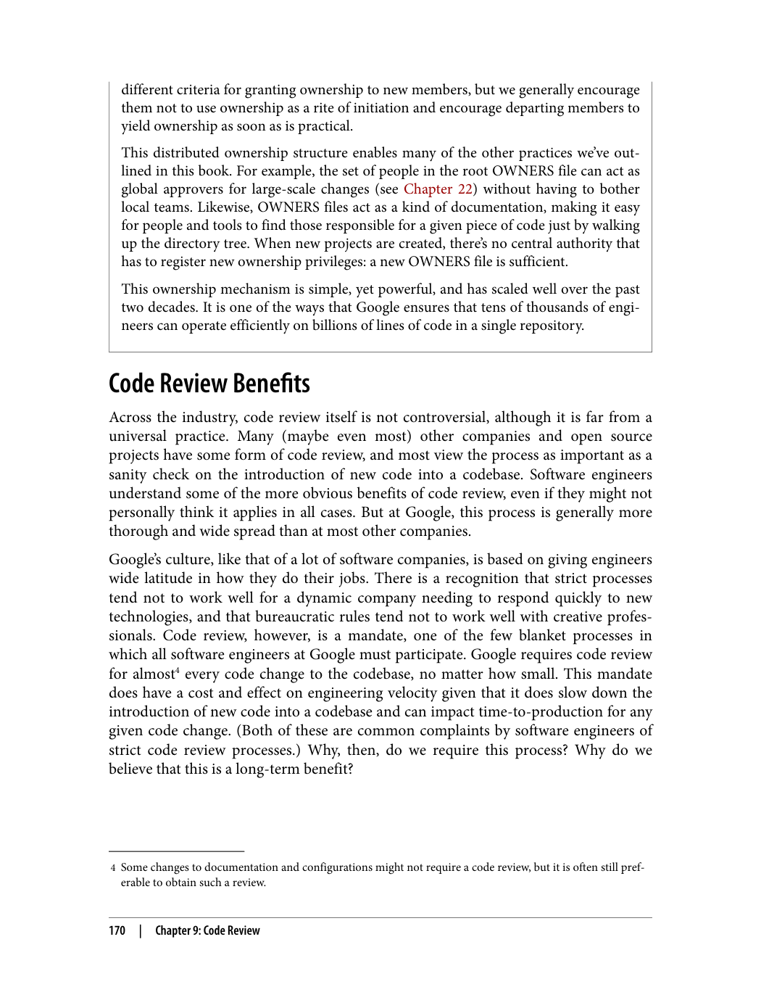
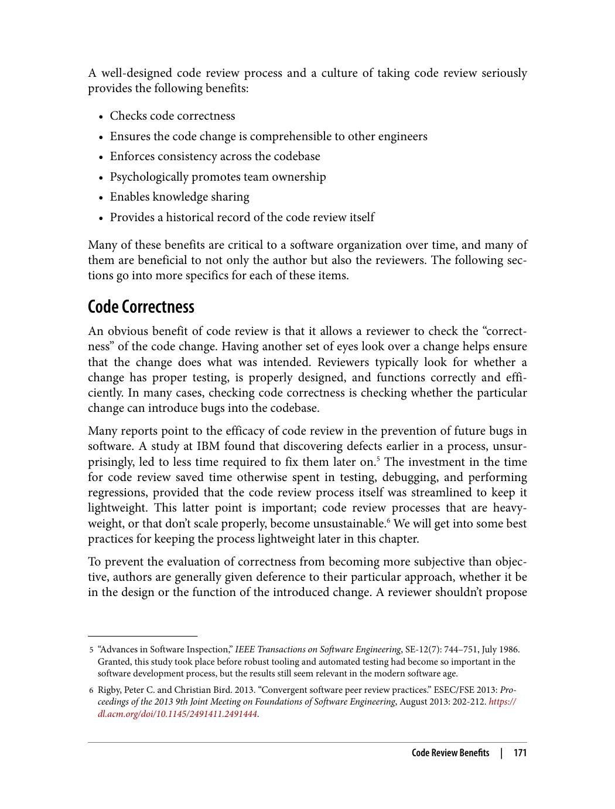
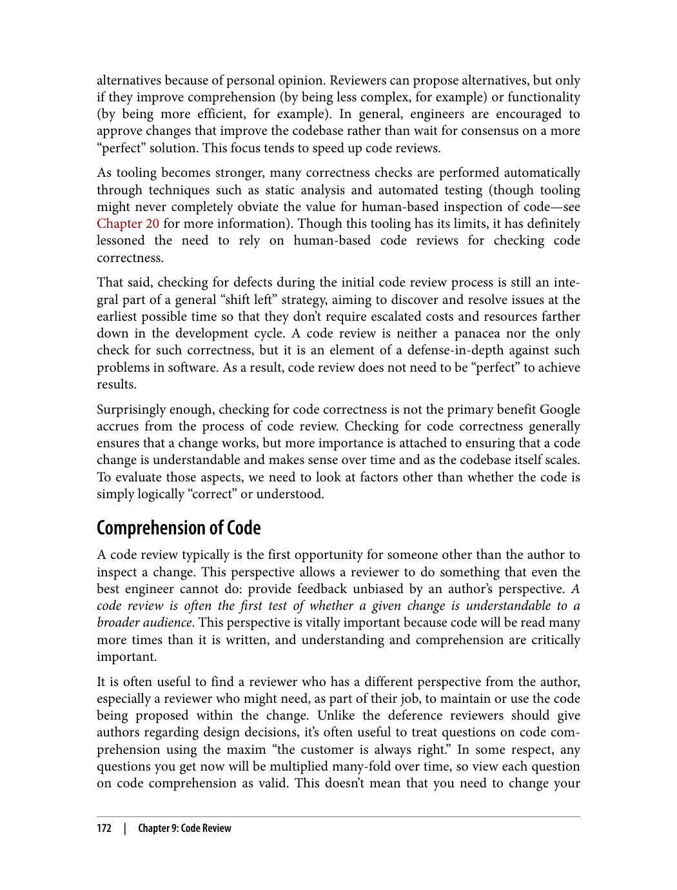
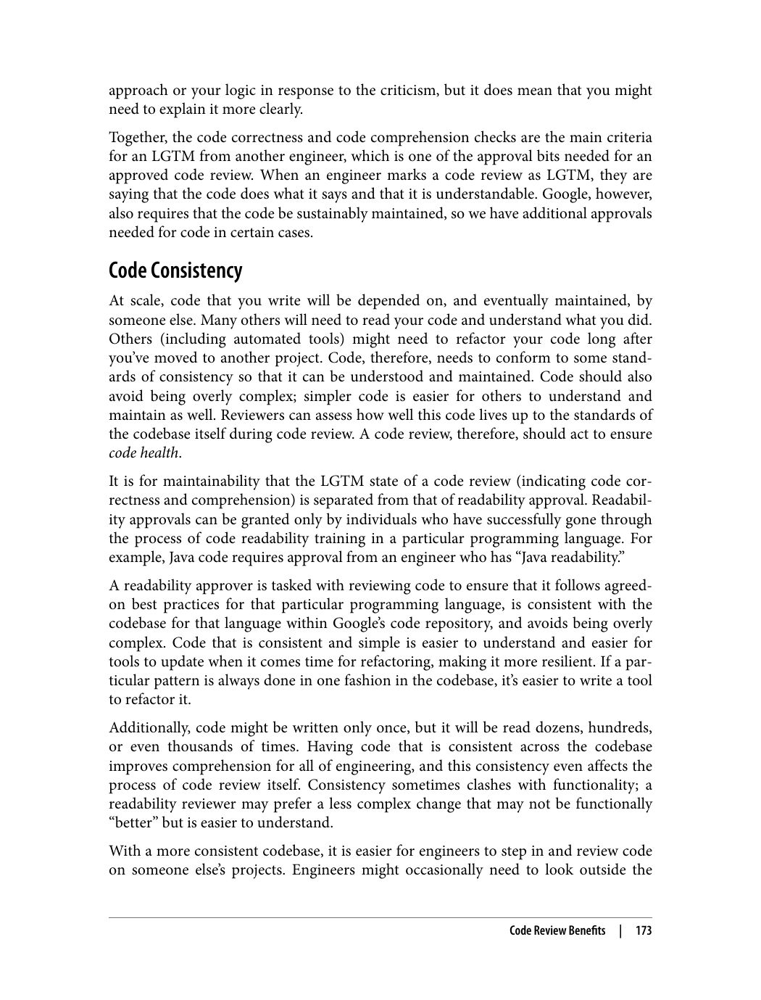
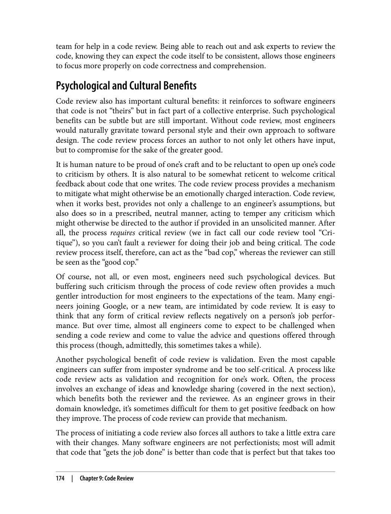
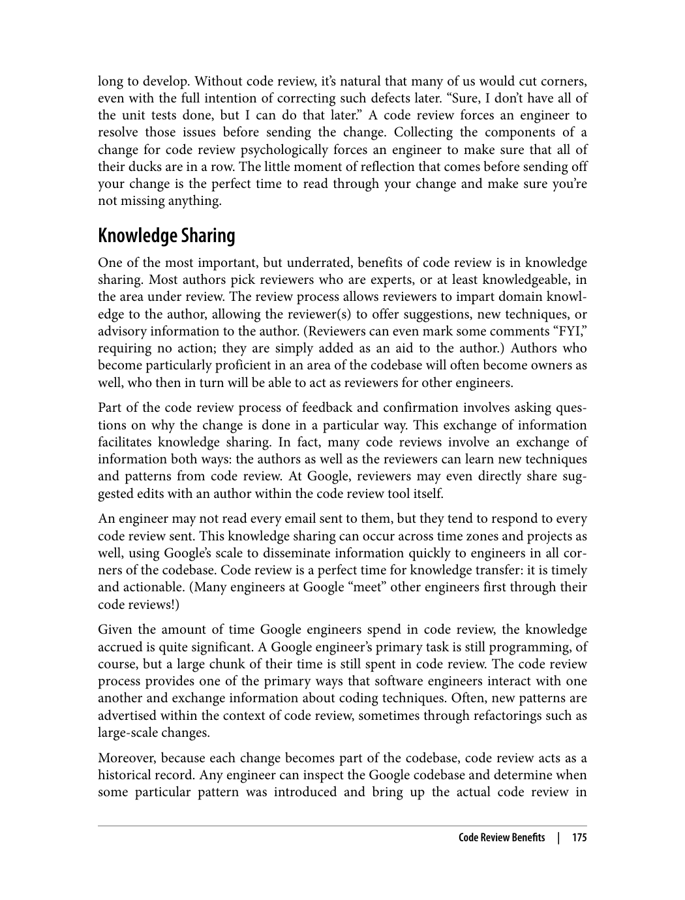
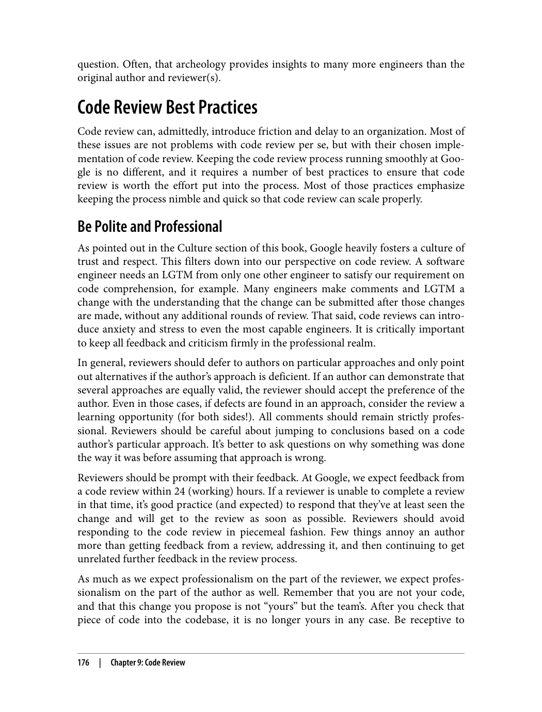

> **راهنمای مطالعه**
>
> در هر بخش، ابتدا متن اصلی کتاب به زبان انگلیسی آورده شده و سپس ترجمه و توضیحات فارسی همان بخش ارائه شده است.

---

###### 📄 صفحه ۱۸۳
> to be unnecessary, too ambiguous, or not beneficial. Others receive positive feedback,
> gauged to have merit either as-is or with some suggested refinement. These propos‐
> als, the ones that make it through community review, are subject to final decision-
> making approval.
> The Style Arbiters
> At Google, for each language's style guide, final decisions and approvals are made by
> the style guide's owners—our style arbiters. For each programming language, a group
> of long-time language experts are the owners of the style guide and the designated
> decision makers. The style arbiters for a given language are often senior members of
> the language's library team and other long-time Googlers with relevant language
> experience.
> The actual decision making for any style guide change is a discussion of the engineer‐
> ing trade-offs for the proposed modification. The arbiters make decisions within the
> context of the agreed-upon goals for which the style guide optimizes. Changes are not
> made according to personal preference; they're trade-off judgments. In fact, the C++
> style arbiter group currently consists of four members. This might seem strange: hav‐
> ing an odd number of committee members would prevent tied votes in case of a split
> decision. However, because of the nature of the decision making approach, where
> nothing is "because I think it should be this way" and everything is an evaluation of
> trade-off, decisions are made by consensus rather than by voting. The four-member
> group is happily functional as-is.
> Exceptions
> Yes, our rules are law, but yes, some rules warrant exceptions. Our rules are typically
> designed for the greater, general case. Sometimes, specific situations would benefit
> from an exemption to a particular rule. When such a scenario arises, the style arbiters
> are consulted to determine whether there is a valid case for granting a waiver to a
> particular rule.
> Waivers are not granted lightly. In C++ code, if a macro API is introduced, the style
> guide mandates that it be named using a project-specific prefix. Because of the way
> C++ handles macros, treating them as members of the global namespace, all macros
> that are exported from header files must have globally unique names to prevent colli‐
> sions. The style guide rule regarding macro naming does allow for arbiter-granted
> exemptions for some utility macros that are genuinely global. However, when the rea‐
> son behind a waiver request asking to exclude a project-specific prefix comes down to
> preferences due to macro name length or project consistency, the waiver is rejected.
> The integrity of the codebase outweighs the consistency of the project here.
> Exceptions are allowed for cases in which it is gauged to be more beneficial to permit
> the rule-breaking than to avoid it. The C++ style guide disallows implicit type con‐
> 156
> |
> Chapter 8: Style Guides and Rules

پیشنهادهایی که ارائه می‌شوند یا نامفید، بیش از حد مبهم یا فاقد سود تشخیص داده می‌شوند و یا با بازخورد مثبت روبرو می‌شوند و ارزش آن‌ها یا به همان شکل فعلی تأیید می‌شود یا با اصلاحات پیشنهادی بهبود می‌یابند. این پیشنهادها — یعنی همان‌هایی که از بررسی جامعه (Community Review) عبور می‌کنند — مشمول تأیید نهایی تصمیم‌گیری می‌شوند.

**داوران سبک (Style Arbiters)**

در گوگل، برای Style Guide هر زبان، تصمیمات نهایی و تأییدها توسط مالکان Style Guide انجام می‌شود — یعنی داوران سبک (Style Arbiters) ما. برای هر زبان برنامه‌نویسی، گروهی از کارشناسان باتجربه زبان، مالکان Style Guide و تصمیم‌گیرندگان تعیین‌شده هستند. داوران سبک یک زبان مشخص معمولاً اعضای ارشد تیم کتابخانه آن زبان و سایر کارمندان قدیمی گوگل با تجربه مرتبط با آن زبان هستند.

تصمیم‌گیری واقعی برای هر تغییر در Style Guide، بحثی درباره مبادلات مهندسی (Engineering Trade-offs) پیشنهاد اصلاح است. داوران در چارچوب اهداف توافق‌شده‌ای که Style Guide برای آن‌ها بهینه‌سازی می‌شود، تصمیم می‌گیرند. تغییرات بر اساس ترجیحات شخصی اعمال نمی‌شوند؛ آن‌ها قضاوت‌هایی درباره مبادلات هستند. در واقع، گروه داوران سبک C++ در حال حاضر شامل چهار عضو است. ممکن است این موضوع عجیب به نظر برسد: داشتن تعداد فرد اعضای کمیته از رأی مساوی در صورت تساوی آرا جلوگیری می‌کند. اما به دلیل ماهیت رویکرد تصمیم‌گیری، که در آن هیچ چیزی «چون فکر می‌کنم باید این‌طور باشد» نیست و همه‌چیز ارزیابی مبادلات است، تصمیمات به جای رأی‌گیری بر اساس اجماع اتخاذ می‌شوند. گروه چهار نفره با خوشحالی همان‌طور که هست عمل می‌کند.

**استثناها**

بله، قوانین ما قانون هستند، اما بله، برخی قوانین استثنا دارند. قوانین ما معمولاً برای حالت کلی و عمومی طراحی شده‌اند. گاهی اوقات، شرایط خاص از معافیت از یک قانون خاص سود می‌برند. وقتی چنین سناریویی پیش می‌آید، از داوران سبک مشورت گرفته می‌شود تا تعیین شود آیا دلیل موجهی برای اعطای معافیت از یک قانون خاص وجود دارد یا خیر.

معافیت‌ها به سادگی اعطا نمی‌شوند. در کد C++، اگر یک Macro API معرفی شود، Style Guide الزام می‌کند که با استفاده از یک پیشوند خاص پروژه نام‌گذاری شود. به دلیل نحوه مدیریت Macro‌ها در C++ که آن‌ها را به عنوان اعضای فضای نام سراسری (Global Namespace) در نظر می‌گیرد، تمام Macro‌هایی که از فایل‌های هدر (Header Files) صادر می‌شوند باید نام‌های منحصربه‌فرد سراسری داشته باشند تا از تداخل جلوگیری شود. قانون Style Guide درباره نام‌گذاری Macro‌ها اجازه معافیت‌های اعطا شده توسط داوران را برای برخی Macro‌های ابزاری که واقعاً سراسری هستند، می‌دهد. اما وقتی دلیل درخواست معافیت برای حذف پیشوند خاص پروژه به ترجیحات ناشی از طول نام Macro یا یکپارچگی پروژه برمی‌گردد، معافیت رد می‌شود. یکپارچگی پایگاه کد (Codebase) بر یکپارچگی پروژه در اینجا اولویت دارد.

استثناها برای مواردی مجاز هستند که اجازه نقض قانون بیشتر از اجتناب از آن سودمند تشخیص داده شود. Style Guide C++ تبدیل ضمنی نوع را مجاز نمی‌داند.

---

###### 📄 صفحه ۱۸۷
> Other rules are social rather than technical, and it is often unwise to solve social
> problems with a technical solution. For many of the rules that fall under this category,
> the details tend to be a bit less well defined and tooling would become complex and
> expensive. It's often better to leave enforcement of those rules to humans. For exam‐
> ple, when it comes to the size of a given code change (i.e., the number of files affected
> and lines modified) we recommend that engineers favor smaller changes. Small
> changes are easier for engineers to review, so reviews tend to faster and more thor‐
> ough. They're also less likely to introduce bugs because it's easier to reason about the
> potential impact and effects of a smaller change. The definition of small, however, is
> somewhat nebulous. A change that propagates the identical one-line update across
> hundreds of files might actually be easy to review. By contrast, a smaller, 20-line
> change might introduce complex logic with side effects that are difficult to evaluate.
> We recognize that there are many different measurements of size, some of which may
> be subjective—particularly when taking the complexity of a change into account. This
> is why we do not have any tooling to autoreject a proposed change that exceeds an
> arbitrary line limit. Reviewers can (and do) push back if they judge a change to be too
> large. For this and similar rules, enforcement is up to the discretion of the engineers
> authoring and reviewing the code. When it comes to technical rules, however, when‐
> ever it is feasible, we favor technical enforcement.
> Error Checkers
> Many rules covering language usage can be enforced with static analysis tools. In fact,
> an informal survey of the C++ style guide by some of our C++ librarians in mid-2018
> estimated that roughly 90% of its rules could be automatically verified. Error-
> checking tools take a set of rules or patterns and verify that a given code sample fully
> complies. Automated verification removes the burden of remembering all applicable
> rules from the code author. If an engineer only needs to look for violation warnings—
> many of which come with suggested fixes—surfaced during code review by an ana‐
> lyzer that has been tightly integrated into the development workflow, we minimize
> the effort that it takes to comply with the rules. When we began using tools to flag
> deprecated functions based on source tagging, surfacing both the warning and the
> suggested fix in-place, the problem of having new usages of deprecated APIs disap‐
> peared almost overnight. Keeping the cost of compliance down makes it more likely
> for engineers to happily follow through.
> We use tools like clang-tidy (for C++) and Error Prone (for Java) to automate the
> process of enforcing rules. See Chapter 20 for an in-depth discussion of our
> approach.
> The tools we use are designed and tailored to support the rules that we define. Most
> tools in support of rules are absolutes; everybody must comply with the rules, so
> everybody uses the tools that check them. Sometimes, when tools support best practi‐
> 160
> |
> Chapter 8: Style Guides and Rules

برخی قوانین اجتماعی هستند نه فنی، و اغلب هوشمندانه نیست که مشکلات اجتماعی با راه‌حل فنی حل شوند. برای بسیاری از قوانینی که در این دسته قرار می‌گیرند، جزئیات معمولاً کمتر به خوبی تعریف شده‌اند و ابزارها پیچیده و پرهزینه خواهند شد. اغلب بهتر است اجرای این قوانین به انسان‌ها واگذار شود. به عنوان مثال، وقتی صحبت از اندازه یک تغییر کد مشخص (یعنی تعداد فایل‌های تحت تأثیر و خطوط تغییر یافته) می‌شود، توصیه می‌کنیم مهندسان تغییرات کوچک‌تر را ترجیح دهند. تغییرات کوچک‌تر برای مهندسان راحت‌تر بازبینی (Code Review) می‌شوند، بنابراین بازبینی‌ها سریع‌تر و کامل‌تر انجام می‌شوند. آن‌ها همچنین کمتر باگ معرفی می‌کنند زیرا درک تأثیرات و اثرات بالقوه یک تغییر کوچک‌تر آسان‌تر است. اما تعریف «کوچک» تا حدی مبهم است. تغییری که به‌روزرسانی یک خطی یکسانی را در صدها فایل اعمال می‌کند ممکن است در واقع بازبینی آسانی باشد. در مقابل، تغییر کوچک‌تر ۲۰ خطی ممکن است منطق پیچیده‌ای با اثرات جانبی معرفی کند که ارزیابی آن‌ها دشوار است.

ما تشخیص می‌دهیم که اندازه‌گیری‌های مختلفی برای اندازه وجود دارد، برخی از آن‌ها ممکن است ذهنی باشند — به ویژه هنگام در نظر گرفتن پیچیدگی تغییر. به همین دلیل هیچ ابزاری برای رد خودکار یک تغییر پیشنهادی که از حد خط دلخواه فراتر رود نداریم. بازبینی‌کنندگان می‌توانند (و این کار را می‌کنند) اگر تشخیص دهند تغییر بیش از حد بزرگ است، اعتراض کنند. برای این قانون و قوانین مشابه، اجرای آن به صلاحدید مهندسانی بستگی دارد که کد را می‌نویسند و بازبینی می‌کنند. اما وقتی صحبت از قوانین فنی می‌شود، هر زمان که ممکن باشد، اجرای فنی را ترجیح می‌دهیم.

**بررسی‌کننده‌های خطا (Error Checkers)**

بسیاری از قوانینی که استفاده از زبان را پوشش می‌دهند می‌توانند با ابزارهای تحلیل ایستا (Static Analysis Tools) اجرا شوند. در واقع، یک بررسی غیررسمی از Style Guide C++ توسط برخی از کتابداران C++ ما در اواسط ۲۰۱۸ تخمین زد که تقریباً ۹۰٪ قوانین آن می‌توانند به طور خودکار تأیید شوند. ابزارهای بررسی خطا مجموعه‌ای از قوانین یا الگوها را می‌گیرند و تأیید می‌کنند که یک نمونه کد کاملاً مطابقت دارد. تأیید خودکار بار به یادآوردن تمام قوانین قابل اعمال را از نویسنده کد برمی‌دارد. اگر مهندس فقط نیاز باشد به هشدارهای نقض — که بسیاری از آن‌ها با پیشنهادات اصلاحی همراه هستند — که توسط یک تحلیلگر که به طور محکم در جریان کار توسعه ادغام شده در طی بازبینی کد ظاهر می‌شوند، نگاه کند، تلاش لازم برای رعایت قوانین را به حداقل می‌رسانیم. وقتی شروع به استفاده از ابزارهایی برای پرچم‌گذاری توابع منسوخ (Deprecated) بر اساس برچسب‌گذاری منبع کردیم و هشدار و اصلاح پیشنهادی را در جا نشان دادیم، مشکل استفاده‌های جدید از API‌های منسوخ تقریباً یک‌شبه از بین رفت. کم نگه داشتن هزینه رعایت، احتمال اینکه مهندsen با خوشحالی ادامه دهند را بیشتر می‌کند.

ما از ابزارهایی مانند clang-tidy (برای C++) و Error Prone (برای Java) برای خودکارسازی فرآیند اجرای قوانین استفاده می‌کنیم. برای بحث عمیق‌تر درباره رویکرد ما به فصل ۲۰ مراجعه کنید.

ابزارهایی که استفاده می‌کنیم برای پشتیبانی از قوانینی که تعریف می‌کنیم طراحی و سفارشی‌سازی شده‌اند. بیشتر ابزارهایی که از قوانین پشتیبانی می‌کنند مطلق هستند؛ همه باید از قوانین پیروی کنند، بنابراین همه از ابزارهایی که آن‌ها را بررسی می‌کنند استفاده می‌کنند. گاهی اوقات، وقتی ابزارها از بهترین شیوه‌ها پشتیبانی می‌کنند.

**مستندات یکی از مهم‌ترین بخش‌های هر نرم‌افزار است. بدون مستندات خوب، درک و استفاده از نرم‌افزار بسیار دشوار می‌شود.**

---

###### 📄 صفحه ۱۹۱

1. **مستندات مرجع**: توضیح جزئیات API و توابع
2. **آموزش‌ها**: راهنمای گام‌به‌گام برای استفاده از نرم‌افزار
3. **مستندات مفهومی**: توضیح مفاهیم و ایده‌های اصلی
4. **صفحات فرود**: معرفی کلی بخش‌های مختلف

---

###### 📄 صفحه ۱۹۵
> 3 At Google, "readability" does not refer simply to comprehension, but to the set of styles and best practices that
> allow code to be maintainable to other engineers. See Chapter 3.
> "bit," which will be set after a peer reviewer agrees that the code "looks good" to
> them.
> • Approval from one of the code owners that the code is appropriate for this par‐
> ticular part of the codebase (and can be checked into a particular directory). This
> approval might be implicit if the author is such an owner. Google's codebase is a
> tree structure with hierarchical owners of particular directories. (See Chapter 16).
> Owners act as gatekeepers for their particular directories. A change might be
> proposed by any engineer and LGTM'ed by any other engineer, but an owner of
> the directory in question must also approve this addition to their part of the
> codebase. Such an owner might be a tech lead or other engineer deemed expert
> in that particular area of the codebase. It's generally up to each team to decide
> how broadly or narrowly to assign ownership privileges.
> • Approval from someone with language "readability"3 that the code conforms to
> the language's style and best practices, checking whether the code is written in the
> manner we expect. This approval, again, might be implicit if the author has such
> readability. These engineers are pulled from a company-wide pool of engineers
> who have been granted readability in that programming language.
> Although this level of control sounds onerous—and, admittedly, it sometimes is—
> most reviews have one person assuming all three roles, which speeds up the process
> quite a bit. Importantly, the author can also assume the latter two roles, needing only
> an LGTM from another engineer to check code into their own codebase, provided
> they already have readability in that language (which owners often do).
> These requirements allow the code review process to be quite flexible. A tech lead
> who is an owner of a project and has that code's language readability can submit a
> code change with only an LGTM from another engineer. An intern without such
> authority can submit the same change to the same codebase, provided they get appro‐
> val from an owner with language readability. The three aforementioned permission
> "bits" can be combined in any combination. An author can even request more than
> one LGTM from separate people by explicitly tagging the change as wanting an
> LGTM from all reviewers.
> In practice, most code reviews that require more than one approval usually go
> through a two-step process: gaining an LGTM from a peer engineer, and then seeking
> approval from appropriate code owner/readability reviewer(s). This allows the two
> roles to focus on different aspects of the code review and saves review time. The pri‐
> mary reviewer can focus on code correctness and the general validity of the code
> change; the code owner can focus on whether this change is appropriate for their part
> 168
> |
> Chapter 9: Code Review

در گوگل، «خوانایی (Readability)» صرفاً به درک مطلب اشاره نمی‌کند، بلکه به مجموعه‌ای از سبک‌ها و بهترین شیوه‌ها اشاره دارد که به مهندسان دیگر امکان نگهداری کد را می‌دهند. به فصل ۳ مراجعه کنید.

بیتی که پس از موافقت یک بررسی‌کننده همکار با اینکه کد «خوب به نظر می‌رسد» تنظیم می‌شود.

• **تأیید از یکی از مالکان کد** مبنی بر اینکه کد برای بخش خاصی از پایگاه کد (Codebase) مناسب است (و می‌تواند در یک پوشه خاص ثبت شود). این تأیید ممکن است ضمنی باشد اگر نویسنده خود چنین مالکی باشد. پایگاه کد گوگل یک ساختار درختی با مالکان سلسله‌مراتبی پوشه‌های خاص است. (به فصل ۱۶ مراجعه کنید). مالکان به عنوان نگهبانان (Gatekeepers) پوشه‌های خاص خود عمل می‌کنند. یک تغییر ممکن است توسط هر مهندسی پیشنهاد شود و توسط هر مهندس دیگری LGTM بگیرد، اما مالک پوشه مورد نظر نیز باید این افزوده شدن به بخش خود از پایگاه کد را تأیید کند. چنین مالکی ممکن است یک تک‌لید (Tech Lead) یا مهندس دیگری باشد که در آن بخش خاص از پایگاه کد متخصص شناخته شده است. معمولاً به هر تیم بستگی دارد که چگونه مالکیت را به طور گسترده یا محدود اختصاص دهد.

• **تأیید از کسی با «خوانایی» زبان** که کد با سبک و بهترین شیوه‌های زبان مطابقت دارد و بررسی می‌کند آیا کد به شکلی که انتظار داریم نوشته شده است یا خیر. این تأیید، دوباره، ممکن است ضمنی باشد اگر نویسنده چنین خوانایی داشته باشد. این مهندسان از مجموعه‌ای از مهندسان در سطح شرکت انتخاب می‌شوند که خوانایی در آن زبان برنامه‌نویسی را دریافت کرده‌اند.

اگرچه این سطح از کنترل سنگین به نظر می‌رسد — و البته گاهی هم هست — بیشتر بازبینی‌ها یک نفر هر سه نقش را بر عهده دارد، که فرآیند را به طور قابل توجهی سریع‌تر می‌کند. به طور مهم، نویسنده همچنین می‌تواند دو نقش آخر را بر عهده بگیرد و فقط به یک LGTM از مهندس دیگری نیاز دارد تا کد را در پایگاه کد خود ثبت کند، به شرطی که از قبل خوانایی در آن زبان داشته باشد (که مالکان معمولاً دارند).

این الزامات به فرآیند بازبینی کد امکان انعطاف‌پذیری زیادی می‌دهند. یک تک‌لید که مالک یک پروژه است و خوانایی زبان آن کد را دارد، می‌تواند یک تغییر کد را فقط با یک LGTM از مهندس دیگری ارسال کند. یک کارآموز بدون چنین اختیاری می‌تواند همان تغییر را به همان پایگاه کد ارسال کند، به شرطی که تأیید مالک با خوانایی زبان را بگیرد. سه بیت مجوز ذکر شده در بالا را می‌توان در هر ترکیبی ترکیب کرد. یک نویسنده حتی می‌تواند از افراد مختلف بیش از یک LGTM درخواست کند با برچسب‌گذاری صریح تغییر به عنوان خواستار LGTM از همه بازبینی‌کنندگان.

در عمل، بیشتر بازبینی‌هایی که به بیش از یک تأیید نیاز دارند معمولاً از یک فرآیند دو مرحله‌ای عبور می‌کنند: کسب یک LGTM از یک مهندس همکار، و سپس کسب تأیید از مالک کد/بازبینی‌کننده(های) خوانایی مناسب. این به هر نقش اجازه می‌دهد روی جنبه‌های مختلف بازبینی کد تمرکز کند و زمان بازبینی را صرفه‌جویی کند. بازبین‌کننده اصلی می‌تواند روی صحت کد و اعتبار کلی تغییر کد تمرکز کند؛ مالک کد می‌تواند روی اینکه آیا این تغییر برای بخش خود مناسب است تمرکز کند.

**دانش شفاهی ممکن است با رفتن اعضای تیم از بین برود. اما دانش مستند شده همیشه باقی می‌ماند و قابل استفاده است.**

---

###### 📄 صفحه ۱۹۹
> alternatives because of personal opinion. Reviewers can propose alternatives, but only
> if they improve comprehension (by being less complex, for example) or functionality
> (by being more efficient, for example). In general, engineers are encouraged to
> approve changes that improve the codebase rather than wait for consensus on a more
> "perfect" solution. This focus tends to speed up code reviews.
> As tooling becomes stronger, many correctness checks are performed automatically
> through techniques such as static analysis and automated testing (though tooling
> might never completely obviate the value for human-based inspection of code—see
> Chapter 20 for more information). Though this tooling has its limits, it has definitely
> lessoned the need to rely on human-based code reviews for checking code
> correctness.
> That said, checking for defects during the initial code review process is still an inte‐
> gral part of a general "shift left" strategy, aiming to discover and resolve issues at the
> earliest possible time so that they don't require escalated costs and resources farther
> down in the development cycle. A code review is neither a panacea nor the only
> check for such correctness, but it is an element of a defense-in-depth against such
> problems in software. As a result, code review does not need to be "perfect" to achieve
> results.
> Surprisingly enough, checking for code correctness is not the primary benefit Google
> accrues from the process of code review. Checking for code correctness generally
> ensures that a change works, but more importance is attached to ensuring that a code
> change is understandable and makes sense over time and as the codebase itself scales.
> To evaluate those aspects, we need to look at factors other than whether the code is
> simply logically "correct" or understood.
> Comprehension of Code
> A code review typically is the first opportunity for someone other than the author to
> inspect a change. This perspective allows a reviewer to do something that even the
> best engineer cannot do: provide feedback unbiased by an author's perspective. A
> code review is often the first test of whether a given change is understandable to a
> broader audience. This perspective is vitally important because code will be read many
> more times than it is written, and understanding and comprehension are critically
> important.
> It is often useful to find a reviewer who has a different perspective from the author,
> especially a reviewer who might need, as part of their job, to maintain or use the code
> being proposed within the change. Unlike the deference reviewers should give
> authors regarding design decisions, it's often useful to treat questions on code com‐
> prehension using the maxim "the customer is always right." In some respect, any
> questions you get now will be multiplied many-fold over time, so view each question
> on code comprehension as valid. This doesn't mean that you need to change your
> 172
> |
> Chapter 9: Code Review

جایگزین‌ها به دلیل نظر شخصی ارائه نمی‌شوند. بازبینی‌کنندگان می‌توانند جایگزین‌هایی پیشنهاد دهند، اما فقط اگر درک را بهبود بخشند (مثلاً با پیچیدگی کمتر) یا عملکرد را بهبود بخشند (مثلاً با کارایی بیشتر). به طور کلی، مهندسان تشویق می‌شوند تغییراتی را تأیید کنند که پایگاه کد را بهبود می‌بخشند به جای اینکه منتظر اجماع درباره راه‌حل «کامل‌تری» بمانند. این تمرین باعث سرعت بخشیدن به بازبینی‌های کد می‌شود.

با قوی‌تر شدن ابزارها، بسیاری از بررسی‌های صحت به طور خودکار از طریق تکنیک‌هایی مانند تحلیل ایستا (Static Analysis) و آزمون خودکار (Automated Testing) انجام می‌شوند (هرچند ابزارها ممکن است هرگز ارزش بازرسی کد توسط انسان را به طور کامل از بین نبرند — به فصل ۲۰ برای اطلاعات بیشتر مراجعه کنید). اگرچه این ابزارها محدودیت‌هایی دارند، قطعاً نیاز به تکیه بر بازبینی کد توسط انسان برای بررسی صحت کد را کاهش داده‌اند.

با این حال، بررسی نواقص در طی فرآیند اولیه بازبینی کد همچنان بخش جدایی‌ناپذیر یک استراتژی کلی «شیفت چپ (Shift Left)» است که هدف آن کشف و رفع مشکلات در اسرع وقت است تا نیازی به هزینه‌ها و منابع بیشتر در ادامه چرخه توسعه نباشد. بازبینی کد نه یک معجزه است و نه تنها بررسی برای چنین صحتی، اما یک عنصر از دفاع در عمق (Defense-in-Depth) در برابر چنین مشکلاتی در نرم‌افزار است. در نتیجه، بازبینی کد نیازی نیست «کامل» باشد تا به نتایج برسد.

به طرز شگفت‌آوری، بررسی صحت کد مزیت اصلی‌ای نیست که گوگل از فرآیند بازبینی کد کسب می‌کند. بررسی صحت کد معمولاً تضمین می‌کند که یک تغییر کار می‌کند، اما اهمیت بیشتری به تضمین اینکه یک تغییر کد قابل درک است و در طول زمان و با مقیاس پذیری خود پایگاه کد منطقی به نظر می‌رسد، داده می‌شود. برای ارزیابی این جنبه‌ها، باید به عواملی فراتر از اینکه آیا کد صرفاً منطقاً «صحیح» است یا درک شده، نگاه کنیم.

**درک کد**

بازبینی کد معمولاً اولین فرصتی است که کسی غیر از نویسنده بتواند یک تغییر را بازرسی کند. این دیدگاه به بازبینی‌کننده اجازه می‌دهد کاری را انجام دهد که حتی بهترین مهندس هم نمی‌تواند: ارائه بازخورد بی‌طرفانه و عاری از دیدگاه نویسنده. بازبینی کد اغلب اولین آزمون این است که آیا یک تغییر خاص برای مخاطبان گسترده‌تر قابل درک است یا خیر. این دیدگاه بسیار مهم است زیرا کد بسیار بیشتر از آنکه نوشته شود، خوانده می‌شود و درک و فهم بسیار مهم هستند.

اغلب مفید است بازبینی‌کننده‌ای پیدا شود که دیدگاه متفاوتی از نویسنده دارد، به ویژه بازبینی‌کننده‌ای که ممکن است به عنوان بخشی از کار خود، نیاز به نگهداری یا استفاده از کدی که در تغییر پیشنهاد شده داشته باشد. برخلاف احترامی که بازبینی‌کنندگان باید به نویسندگان در مورد تصمیمات طراحی بگذارند، اغلب مفید است که سؤالات درباره درک کد با اصل «مشتری همیشه حق دارد» درمان شوند. از یک جهت، هر سؤالی که الان دریافت می‌کنید در طول زمان چندین برابر خواهد شد، بنابراین هر سؤال درباره درک کد را معتبر در نظر بگیرید. این بدان معنا نیست که باید کد خود را تغییر دهید.

**مستندات قدیمی ممکن است گمراه‌کننده باشند. مهم است که مستندات همواره به‌روز باشند.**

---