## فصل ۹: مستندات

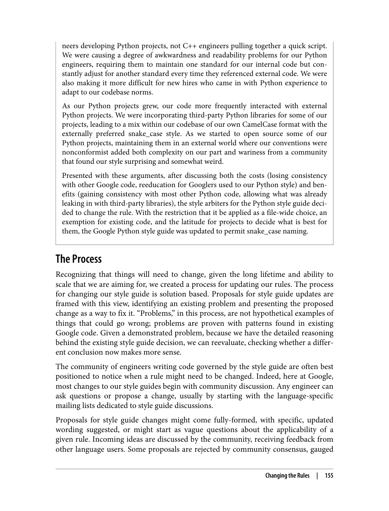

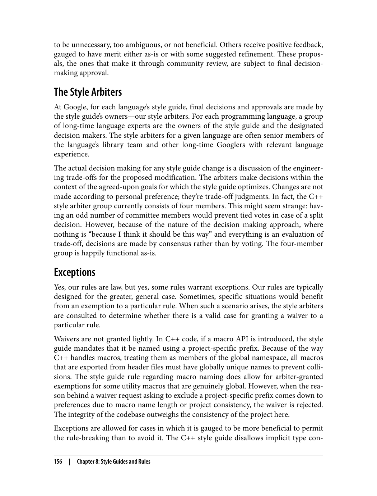

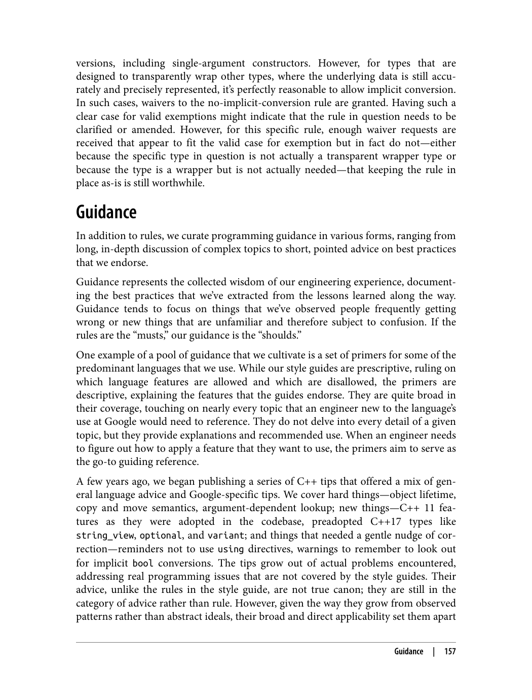

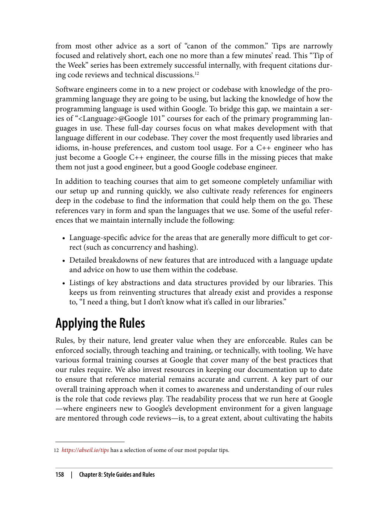

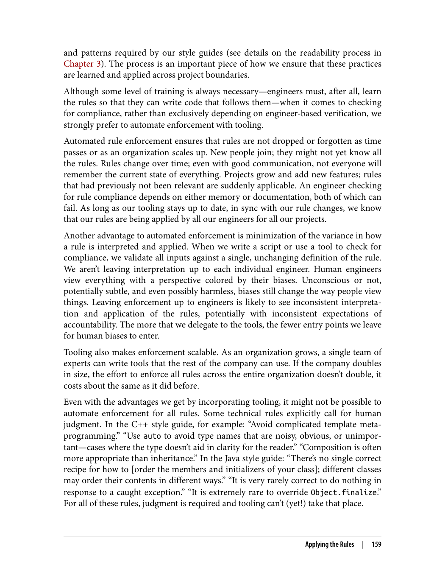

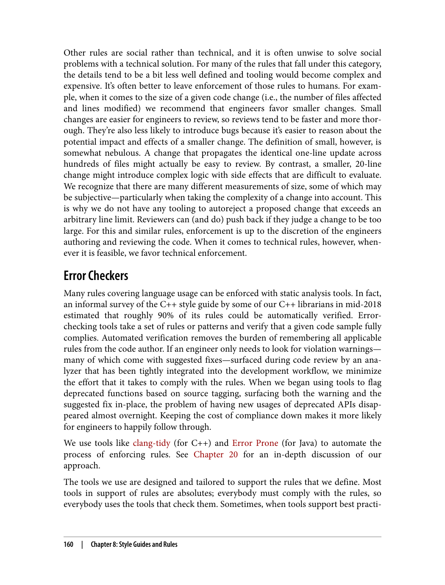

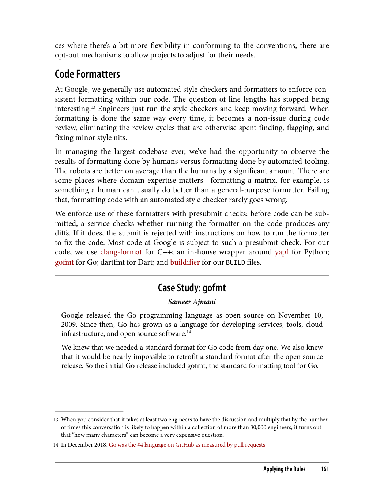

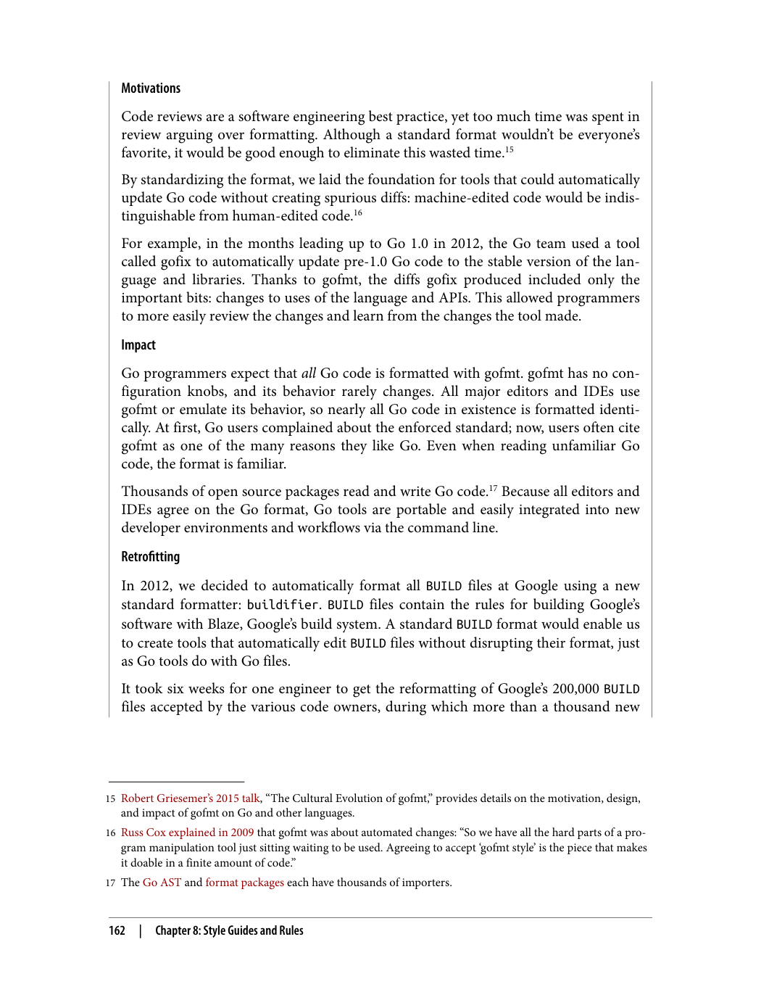

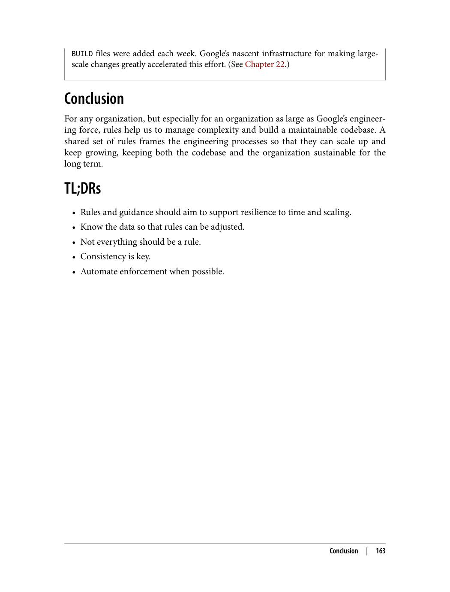

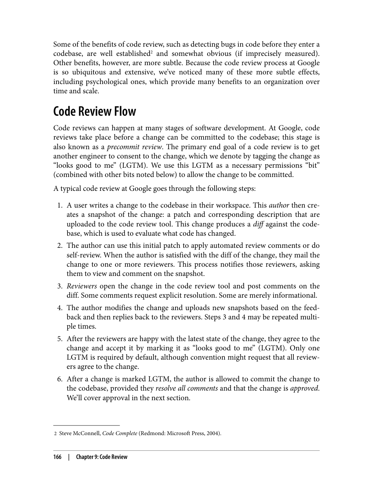

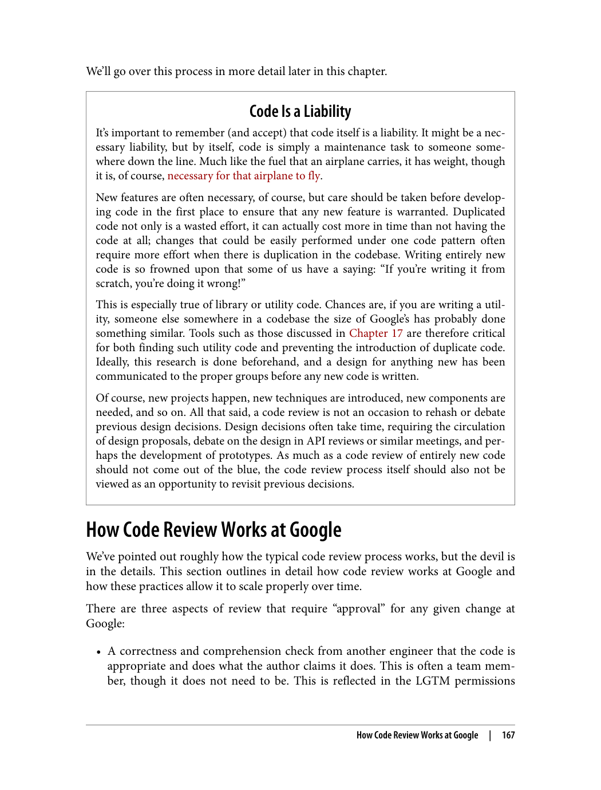

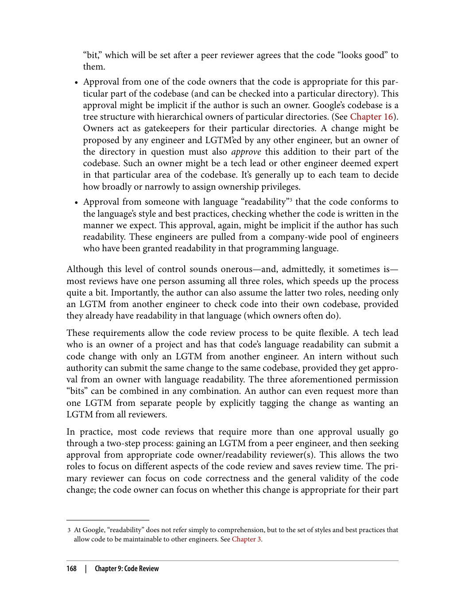

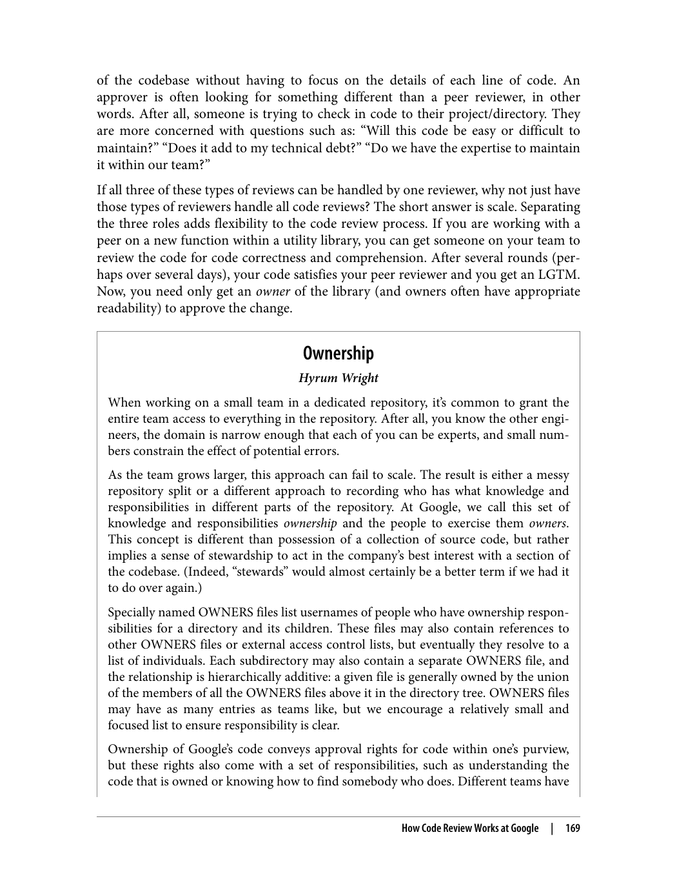

---

> "مستندات خوب، کلید درک و استفاده از نرم‌افزار است. مستندات باید دقیق، مختصر و به‌روز باشد."

### اهمیت مستندات

> "مستندات خوب به توسعه‌دهندگان کمک می‌کند تا نرم‌افزار را بهتر درک کنند و از آن استفاده کنند."

مستندات یکی از مهم‌ترین بخش‌های هر نرم‌افزار است. بدون مستندات خوب، درک و استفاده از نرم‌افزار بسیار دشوار می‌شود.

### انواع مستندات

> "مستندات می‌توانند انواع مختلفی داشته باشند، از مستندات مرجع تا آموزش‌ها."

1. **مستندات مرجع**: توضیح جزئیات API و توابع
2. **آموزش‌ها**: راهنمای گام‌به‌گام برای استفاده از نرم‌افزار
3. **مستندات مفهومی**: توضیح مفاهیم و ایده‌های اصلی
4. **صفحات فرود**: معرفی کلی بخش‌های مختلف

### دانش مستند شده

> "دانش مستند شده بسیار ارزشمندتر از دانش شفاهی است."

دانش شفاهی ممکن است با رفتن اعضای تیم از بین برود. اما دانش مستند شده همیشه باقی می‌ماند و قابل استفاده است.

### به‌روزرسانی مستندات

> "مستندات باید به طور منظم به‌روزرسانی شوند تا دقیق و مفید باقی بمانند."

مستندات قدیمی ممکن است گمراه‌کننده باشند. مهم است که مستندات همواره به‌روز باشند.

---